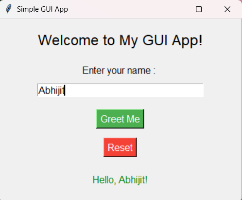

# 🚀 Day 29 - Simple GUI App

Welcome to **Day 29** of my **100 Days, 100 Python Projects** challenge!

This project is a simple **Graphical User Interface (GUI) application** built using Python's built-in `Tkinter` library. The application allows the user to enter their name and displays a personalized greeting through an interactive GUI.

---

## 📌 Project Overview

The application provides a simple and beginner-friendly graphical interface where users can:

* 👤 Enter their name
* 👋 Generate a personalized greeting
* 🔄 Reset the input and greeting
* 🖥️ Interact with buttons and input fields
* 🎨 Use a simple styled GUI layout

This project is designed to introduce the fundamentals of **GUI development with Python and Tkinter**.

---

## ✨ Features

* 🖥️ Simple graphical user interface
* 👤 Name input field
* 👋 Personalized greeting message
* 🔄 Reset button
* ⚠️ Empty input validation
* 🎨 Custom background and button styling
* 🏷️ Labels, buttons, and entry widgets
* 🖱️ Event-driven button actions
* 📐 Fixed window size

---

## 🖼️ Application Preview

Here is a preview of the GUI application:



---

## 🛠️ Technologies Used

* **Python 3**
* **Tkinter**

Tkinter is Python's built-in library for creating graphical user interfaces.

---

## 📂 Project Structure

```text
DAY_29/
│── main29.py
│── screenshot.png
└── README.md
```

> `screenshot.png` is the screenshot of the application's graphical interface.

---

## ▶️ How to Run

1. Make sure Python is installed

Check your Python version:

```bash
python --version
```

2. Open the project folder

Open the terminal inside the `DAY_29` folder.

3. Run the application

```bash
python main29.py
```

The GUI window will open automatically.

---

## 💻 How It Works

### Step 1: Enter Your Name

Enter your name in the input field.

Example:

```text
Enter your name : Abhijit
```

### Step 2: Click "Greet Me"

The application displays:

```text
Hello, Abhijit!
```

### Step 3: Reset

Clicking the **Reset** button clears:

* The name input field
* The greeting message

### Empty Input

If the user clicks **Greet Me** without entering a name, the application displays:

```text
Please enter your name!
```

---

## 🧩 GUI Components

The application uses several Tkinter widgets:

| Widget   | Purpose                             |
| -------- | ----------------------------------- |
| `Tk()`   | Creates the main application window |
| `Label`  | Displays text and messages          |
| `Entry`  | Accepts the user's name             |
| `Button` | Performs actions when clicked       |
| `pack()` | Arranges widgets inside the window  |

---

## 📚 Concepts Practiced

* Python GUI Development
* Tkinter
* Creating Windows
* Labels
* Entry Fields
* Buttons
* Functions
* Event Handling
* Callback Functions
* User Input
* Input Validation
* Widget Configuration
* Layout Management
* `mainloop()`

---

## 🎯 Learning Outcome

This project helped me understand:

* How to create a GUI application using Python
* How Tkinter widgets work
* How to accept user input through an `Entry` widget
* How buttons trigger functions using callbacks
* How to dynamically update a `Label`
* How to reset GUI elements
* How event-driven programming works
* How to organize a basic graphical application

---

## 🔮 Future Improvements

Possible enhancements for future versions:

* 🎨 Add a more modern GUI design
* 🌙 Add Dark Mode
* 🖼️ Add an application icon
* ⌨️ Support keyboard shortcuts
* 🎭 Add different greeting messages
* 🕒 Display the current date and time
* 🌈 Add customizable themes
* 🔊 Add text-to-speech greetings
* 💾 Save user information
* 📱 Improve responsive layout
* 🧩 Add more interactive widgets
* 🖥️ Convert it into a larger desktop application

---

## 📅 Challenge

This project is part of my **100 Days, 100 Python Projects** challenge, where I build one Python project every day to improve my Python programming skills, strengthen problem-solving abilities, and develop consistency through daily coding.

---

## 👨‍💻 Author

**Abhijit Munghate**

Happy Coding! 🚀
