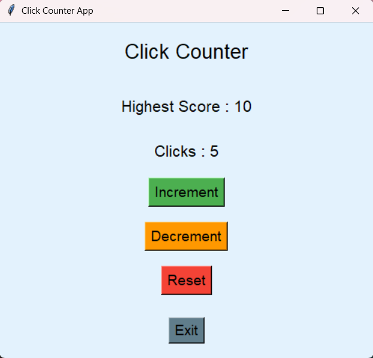

# 🚀 Day 30 - Click Counter App

Welcome to **Day 30** of my **100 Days, 100 Python Projects** challenge!

This project is a simple **GUI-based Click Counter App** built using Python's `Tkinter` library. The application allows users to increase and decrease a click counter, reset the counter, track the highest score, and display the total time for which the application was running.

---

## 📌 Project Overview

The Click Counter App provides a simple graphical interface where users can:

* ➕ Increase the click count
* ➖ Decrease the click count
* 🔄 Reset the counter
* 🏆 Track the highest score
* ⏱️ Calculate the application runtime
* 🚪 Exit the application
* 🖥️ Interact with the application through a graphical interface

The highest score is automatically updated whenever the current click count exceeds the previous highest score.

---

## ✨ Features

* 🖥️ Simple Tkinter GUI
* ➕ Increment button
* ➖ Decrement button
* 🔄 Reset button
* 🏆 Highest score tracking
* ⏱️ Application runtime calculation
* 🚪 Exit button
* 🚫 Prevents the counter from going below zero
* 📊 Real-time counter updates
* 🎨 Custom GUI styling
* 🕐 Uses the `datetime` module to track runtime

---

## 🖼️ Application Preview

Add a screenshot of your application here if you have one:

```markdown

```

Make sure `screenshot.png` is placed in the same folder as `README.md`.

---

## 🛠️ Technologies Used

* **Python 3**
* **Tkinter**
* **datetime Module**

---

## 📂 Project Structure

```text
DAY_30/
│── main30.py
│── screenshot.png
└── README.md
```

> `screenshot.png` is optional and can be included to display the application's GUI preview on GitHub.

---

## ▶️ How to Run

1. Make sure Python is installed

Check your Python version:

```bash
python --version
```

2. Open the project folder

Open the terminal inside the `DAY_30` folder.

3. Run the application

```bash
python main30.py
```

The Click Counter GUI will open automatically.

---

## 💻 How It Works

### ➕ Increment

Clicking the **Increment** button increases the counter by 1.

Example:

```text
Clicks : 1
Clicks : 2
Clicks : 3
```

Whenever the current click count becomes greater than the previous highest score, the highest score is automatically updated.

---

### ➖ Decrement

Clicking the **Decrement** button decreases the counter by 1.

However, the counter cannot become negative.

For example:

```text
Clicks : 3
      ↓
Clicks : 2
      ↓
Clicks : 1
      ↓
Clicks : 0
```

Clicking **Decrement** again while the counter is `0` will not decrease it further.

---

### 🔄 Reset

The **Reset** button sets the current click count back to zero.

```text
Clicks : 25
      ↓
Reset
      ↓
Clicks : 0
```

The highest score remains unchanged after resetting the counter.

---

### 🏆 Highest Score

The application keeps track of the highest click count reached during the current session.

Example:

```text
Clicks : 15
Highest Score : 15
```

If the counter is reset and later reaches 20:

```text
Clicks : 20
Highest Score : 20
```

---

### ⏱️ Runtime Tracking

The application records the time when it starts:

```python
start_time = datetime.now()
```

When the user clicks **Exit**, the application calculates the total runtime:

```python
end_time = datetime.now()
runtime = end_time - start_time
```

The runtime and highest score are then printed in the terminal.

Example:

```text
Application was running for: 0:05:42.318421
Highest Score: 25
```

---

## 🖥️ Sample GUI

```text
┌──────────────────────────────────────┐
│                                      │
│          Click Counter               │
│                                      │
│          Highest Score : 10          │
│                                      │
│             Clicks : 5              │
│                                      │
│            [ Increment ]             │
│                                      │
│            [ Decrement ]             │
│                                      │
│               [ Reset ]              │
│                                      │
│                [ Exit ]              │
│                                      │
└──────────────────────────────────────┘
```

---

## 📚 Concepts Practiced

* Python GUI Development
* Tkinter
* Creating GUI Windows
* Labels
* Buttons
* Functions
* Event Handling
* Callback Functions
* Global Variables
* Conditional Statements
* User Interaction
* Dynamic Widget Updates
* Date and Time Handling
* Runtime Calculation
* State Management

---

## 🎯 Learning Outcome

This project helped me understand:

* How to create an interactive GUI using Tkinter
* How buttons can trigger Python functions
* How to dynamically update labels
* How to maintain application state using variables
* How to track the highest value during a session
* How to prevent invalid counter values
* How to calculate application runtime using `datetime`
* How event-driven programming works in GUI applications

---

## 🔮 Future Improvements

Possible enhancements for future versions:

* 💾 Save the highest score permanently
* 📊 Add a click history
* 📈 Display click statistics
* ⏱️ Add a clicks-per-second counter
* 🏆 Add multiple high-score records
* 🎨 Add Dark Mode
* 🔊 Add sound effects for clicks
* ⌨️ Add keyboard shortcuts
* 🖱️ Add mouse-click tracking
* 🎯 Add a timed clicking challenge
* 🥇 Add a leaderboard
* 🕐 Add session history
* 📱 Improve the GUI design
* 🖥️ Create a more advanced version using CustomTkinter

---

## ⚠️ Note

* The counter cannot go below `0`.
* The highest score is tracked only during the current application session.
* Resetting the counter does **not** reset the highest score.
* The runtime is printed in the terminal when the application is closed.
* The application requires Python with Tkinter support.

---

## 📅 Challenge

This project is part of my **100 Days, 100 Python Projects** challenge, where I build one Python project every day to improve my Python programming skills, strengthen problem-solving abilities, and develop consistency through daily coding.

---

## 👨‍💻 Author

**Abhijit Munghate**

Happy Coding! 🚀
