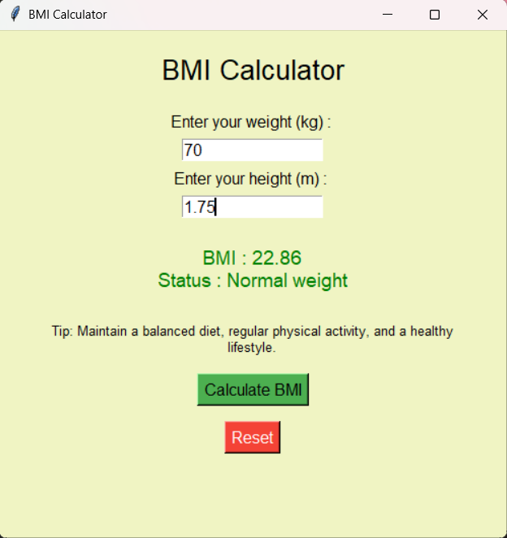

# 🚀 Day 31 - BMI Calculator

Welcome to **Day 31** of my **100 Days, 100 Python Projects** challenge!

This project is a simple **BMI Calculator GUI application** built using Python and Tkinter. It allows users to enter their weight and height, calculate their BMI, determine their BMI category, and receive a basic health tip based on the result.

---

## 📌 Project Overview

The application allows users to:

* ⚖️ Enter weight in kilograms
* 📏 Enter height in meters
* 🧮 Calculate BMI
* 📊 Determine the BMI category
* 💡 Display a health tip based on the BMI category
* 🔄 Reset all entered values and results
* ⚠️ Handle invalid inputs using error messages

The application uses **Tkinter** to provide a simple graphical user interface.

---

## ✨ Features

* 🖥️ Simple graphical user interface
* ⚖️ Weight input in kilograms
* 📏 Height input in meters
* 🧮 Automatic BMI calculation
* 📊 BMI category classification
* 💡 Category-based health tips
* ⚠️ Input validation
* 🚨 Error messages using `messagebox`
* 🔄 Reset functionality
* 🎨 Simple and clean interface

---

## 📊 BMI Categories

The application classifies BMI values using the following ranges:

| BMI Range   | Category      |
| ----------- | ------------- |
| Below 18.5  | Underweight   |
| 18.5 – 24.9 | Normal weight |
| 25 – 29.9   | Overweight    |
| 30 or above | Obesity       |

> **Note:** BMI is a general screening measure and should not be considered a complete assessment of an individual's health.

---

## 🖼️ Application Preview

Add a screenshot of your application here if you have one:



Make sure `screenshot.png` is placed in the same folder as `README.md`.

---

## 🛠️ Technologies Used

* **Python 3**
* **tkinter**
* **tkinter.messagebox**

---

## 📂 Project Structure

```text
DAY_31/
│── main31.py
│── screenshot.png
└── README.md
```

---

## ▶️ How to Run

1. Make sure **Python 3** is installed.
2. Clone this repository or download the project.
3. Open the terminal in the project folder.
4. Run the application:

```bash
python main31.py
```

The BMI Calculator GUI will open automatically.

---

## 🧮 BMI Formula

The application calculates BMI using the following formula:

```text
BMI = Weight (kg) / Height² (m)
```

### Example

For:

```text
Weight = 70 kg
Height = 1.75 m
```

The calculation is:

```text
BMI = 70 / (1.75²)
BMI = 22.86
```

The application displays:

```text
BMI : 22.86
Status : Normal weight
```

---

## 💻 Sample Output

### Main Interface

```text
---------------------------------------
             BMI Calculator

Enter your weight (kg) : [ 70 ]

Enter your height (m)  : [ 1.75 ]

         [ Calculate BMI ]
         
         [    Reset     ]

BMI : 22.86
Status : Normal weight

Tip: Maintain a balanced diet,
regular physical activity, and
a healthy lifestyle.
---------------------------------------
```

### Invalid Input

If the user enters text instead of a number:

```text
⚠ Invalid Input

Please enter valid numbers for weight and height.
```

If the user enters zero or a negative value:

```text
⚠ Invalid Input

Weight and height must be greater than 0.
```

---

## 📚 Concepts Practiced

* Functions
* Conditional Statements
* Dictionaries
* Exception Handling
* `try-except`
* Mathematical calculations
* User input validation
* Tkinter GUI development
* Tkinter `Label`
* Tkinter `Entry`
* Tkinter `Button`
* Tkinter `messagebox`
* Lambda functions
* GUI event handling
* Widget configuration

---

## 🎯 Learning Outcome

This project helped me practice:

* Building desktop applications using **Tkinter**
* Creating and configuring GUI widgets
* Handling button click events
* Performing mathematical calculations
* Using functions to organize program logic
* Validating user input
* Handling invalid input with `try-except`
* Displaying dynamic results in a GUI
* Creating a simple and interactive user interface

---

## ⚠️ Note

* Weight should be entered in **kilograms (kg)**.
* Height should be entered in **meters (m)**.
* Both values must be greater than `0`.
* The health tips provided by this application are general informational suggestions and are not medical advice.

---

## 🔮 Future Improvements

Possible enhancements for future versions:

* 🎨 Add different colors for each BMI category
* 📊 Add a visual BMI scale
* 📈 Add BMI history tracking
* 💾 Save previous BMI results
* 📅 Add date and time to BMI records
* 👤 Add additional user information
* 🌙 Add dark mode
* 📄 Export BMI results to PDF
* 📊 Add BMI charts and graphs
* 🖼️ Add application icons and images
* 🧹 Replace the reset lambda with a dedicated reset function

---

## 📅 Challenge

This project is part of my **100 Days, 100 Python Projects** challenge, where I build one Python project every day to improve my Python programming skills, strengthen problem-solving abilities, and develop consistency through daily coding.

---

## 👨‍💻 Author

**Abhijit Munghate**

Happy Coding! 🚀
