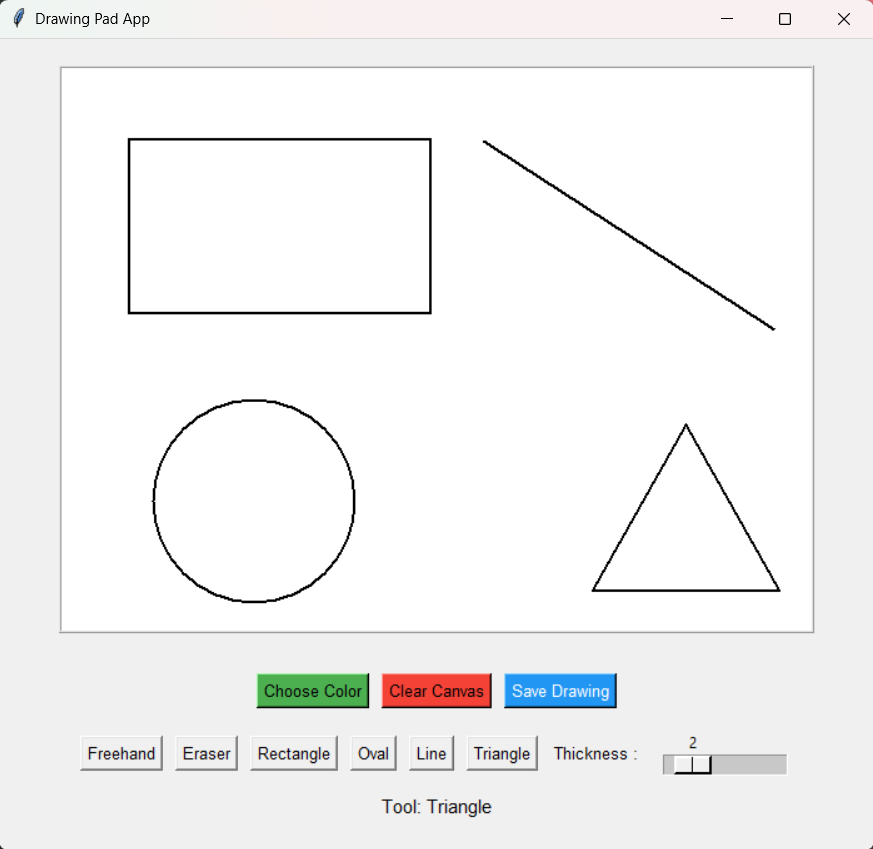

# 🚀 Day 32 - Drawing Pad App

Welcome to **Day 32** of my **100 Days, 100 Python Projects** challenge!

This project is a **GUI-based Drawing Pad Application** built using Python and Tkinter. It allows users to draw freely on a digital canvas, use different drawing tools and shapes, change colors and thickness, erase drawings, clear the canvas, and save their artwork as an image.

---

## 📌 Project Overview

The Drawing Pad App provides a simple digital canvas where users can create drawings using different tools.

The application allows users to:

* ✏️ Draw freely on the canvas
* 🧹 Erase parts of the drawing
* 🟥 Draw rectangles
* 🟢 Draw ovals
* 📏 Draw lines
* 🔺 Draw triangles
* 🎨 Choose custom colors
* 📏 Adjust drawing thickness
* 🗑️ Clear the entire canvas
* 💾 Save drawings as image files
* 🔄 Switch between different drawing tools

---

## ✨ Features

* 🖥️ Tkinter-based graphical interface
* ✏️ Freehand drawing
* 🧹 Eraser tool
* 🟥 Rectangle tool
* 🟢 Oval tool
* 📏 Line tool
* 🔺 Triangle tool
* 🎨 Custom color selection
* 📏 Adjustable drawing thickness from 1–10
* 🗑️ Clear canvas functionality
* 💾 Save drawings as PNG or JPEG
* 🖱️ Mouse-based drawing controls
* 👀 Live shape preview while drawing
* 🔄 Easy tool selection

---

## 🛠️ Technologies Used

* Python 3
* `tkinter`
* `tkinter.colorchooser`
* `tkinter.filedialog`
* `Pillow (PIL)`
* `PIL.ImageGrab`

---

## 🖼️ Application Preview

Here is a preview of the GUI application:



---

## 📂 Project Structure

```text
DAY_32/
│── main32.py
│── screenshot.png
└── README.md
```

> `screenshot.png` is the screenshot of the application's graphical interface.

---

## 📦 Installation

The project uses **Pillow** to capture and save the canvas as an image.

Install Pillow using:

```bash
pip install Pillow
```

Tkinter is generally included with standard Python installations on Windows.

---

## ▶️ How to Run

1. Make sure Python 3 is installed.
2. Install Pillow:

```bash
pip install Pillow
```

3. Open the terminal in the project folder.
4. Run the application:

```bash
python main32.py
```

The Drawing Pad GUI will open automatically.

---

## 🎨 Available Tools

### ✏️ Freehand

Allows you to draw freely on the canvas by dragging the mouse.

```text
Freehand → Mouse Drag → Drawing
```

### 🧹 Eraser

Allows you to erase parts of the drawing by drawing over them.

```text
Eraser → Mouse Drag → Erase
```

### 🟥 Rectangle

Click and drag to create a rectangle.

### 🟢 Oval

Click and drag to create an oval.

### 📏 Line

Click and drag to create a straight line.

### 🔺 Triangle

Click and drag to create a triangle.

---

## 🎨 Color Selection

The **Choose Color** button opens the Tkinter color picker.

Users can select a custom color for drawing shapes and freehand drawings.

Example:

```text
Choose Color
     ↓
Color Picker
     ↓
Select Color
     ↓
Start Drawing
```

---

## 📏 Drawing Thickness

The application provides a slider that allows the user to change the drawing thickness.

Available range:

```text
1 ───────────── 10
```

The default thickness is:

```text
2
```

---

## 💾 Saving Drawings

The **Save Drawing** button allows users to save their artwork as:

* PNG
* JPEG
* Other supported image formats

Example:

```text
drawing.png
```

The application uses `ImageGrab` from Pillow to capture the canvas area and save it as an image.

---

## 🖱️ Mouse Controls

The application uses Tkinter mouse events for drawing.

| Mouse Action        | Function            |
| ------------------- | ------------------- |
| Left Mouse Button   | Start drawing/shape |
| Mouse Drag          | Draw/preview shape  |
| Release Left Button | Finish shape        |

The application uses events such as:

```python
<Button-1>
<B1-Motion>
<ButtonRelease-1>
```

---

## 💻 Sample Interface

```text
------------------------------------------------------------

                     Drawing Pad App

        ┌──────────────────────────────────────┐
        │                                      │
        │                                      │
        │          Drawing Canvas              │
        │                                      │
        │                                      │
        │                                      │
        └──────────────────────────────────────┘

     [Choose Color] [Clear Canvas] [Save Drawing]

     [Freehand] [Eraser] [Rectangle] [Oval]
     [Line] [Triangle]

     Thickness : ─────●────────

     Tool: Freehand

------------------------------------------------------------
```

---

## 📚 Concepts Practiced

* Functions
* Global Variables
* Tkinter GUI Development
* Tkinter Canvas
* Mouse Events
* Event Binding
* Lambda Functions
* `colorchooser`
* `filedialog`
* Image Processing
* Pillow
* `ImageGrab`
* File Saving
* Exception Handling
* Conditional Statements
* Drawing Shapes
* GUI Widget Management

---

## 🎯 Learning Outcome

This project helped me practice:

* Building interactive GUI applications using **Tkinter**
* Working with the Tkinter `Canvas` widget
* Handling mouse events
* Creating freehand drawing functionality
* Drawing geometric shapes programmatically
* Implementing an eraser tool
* Using color selection dialogs
* Creating adjustable drawing thickness
* Capturing GUI content using Pillow
* Saving graphical content as image files
* Managing multiple tools inside a GUI application

---

## ⚠️ Note

* The **Pillow** library is required for saving drawings.
* The eraser works by drawing white marks over the existing canvas.
* Saved images capture the canvas area.
* The application is designed as a simple drawing utility and does not provide advanced image-editing features.

---

## 🔮 Future Improvements

Possible enhancements for future versions:

* ↩️ Undo and redo functionality
* 🖌️ Brush styles
* 🪣 Fill/bucket tool
* 📝 Text tool
* ⭐ More geometric shapes
* 🔍 Zoom functionality
* 📐 Shape resizing and editing
* 🖼️ Import existing images
* 🌈 Color palette
* 🧹 Better eraser with adjustable size
* 📋 Copy and paste functionality
* 🖱️ Right-click options
* ⌨️ Keyboard shortcuts
* 💾 Auto-save functionality
* 🌙 Dark mode
* 🖥️ Full-screen drawing mode

---

## 📅 Challenge

This project is part of my **100 Days, 100 Python Projects** challenge, where I build one Python project every day to improve my Python programming skills, strengthen problem-solving abilities, and develop consistency through daily coding.

---

## 👨‍💻 Author

**Abhijit Munghate**

Happy Coding! 🚀
