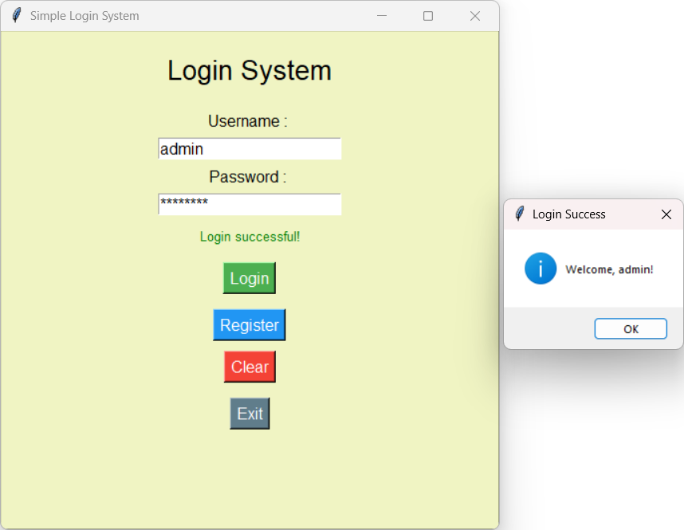

# 🔐 Day 33 - Simple Login System

Welcome to **Day 33** of my **100 Days, 100 Python Projects** challenge!

This project is a **Simple Login System** built using Python's built-in `Tkinter` library. The application provides a graphical interface for user registration and login while implementing features such as **password strength validation, login attempt limits, temporary lockout, and JSON-based user data storage**.

---

## 📌 Project Overview

The application provides a simple and beginner-friendly authentication system where users can:

* 👤 Enter a username
* 🔑 Enter a password
* 📝 Register a new account
* 🔐 Log in using registered credentials
* 💪 Validate password strength
* 🚫 Limit failed login attempts
* 🔒 Temporarily lock login after multiple failed attempts
* 💾 Store user credentials in a JSON file
* 🧹 Clear username, password, and status fields
* ❌ Exit the application
* 🖥️ Interact with the system through a graphical interface

This project introduces the fundamentals of **GUI development, authentication logic, file handling, JSON data storage, regular expressions, and basic security concepts in Python**.

---

## ✨ Features

* 🖥️ Graphical Login Interface
* 👤 User Registration
* 🔐 User Login
* 🔑 Password Input Masking
* 💪 Password Strength Validation
* 📏 Minimum 8-character password requirement
* 🔠 Uppercase letter validation
* 🔡 Lowercase letter validation
* 🔢 Number validation
* 🔣 Special character validation
* 🚫 Maximum 3 login attempts
* 🔒 30-second temporary login lockout
* 💾 JSON-based user credential storage
* ⚠️ Input validation
* 📢 Success and error message boxes
* 🧹 Clear button
* ❌ Exit button
* 🎨 Custom GUI styling
* 📊 Login status display

---

## 🖼️ Application Preview

Here is a preview of the GUI application:



---

## 🛠️ Technologies Used

* **Python 3**
* **Tkinter**
* **JSON**
* **Regular Expressions (`re`)**
* **OS module**
* **Time module**

### Libraries and Modules

| Module       | Purpose                                      |
| ------------ | -------------------------------------------- |
| `tkinter`    | Creating the graphical user interface        |
| `messagebox` | Displaying alerts, warnings, and information |
| `re`         | Validating password strength                 |
| `time`       | Managing the temporary login lockout         |
| `json`       | Storing and loading user credentials         |
| `os`         | Checking whether the user data file exists   |

---

## 📂 Project Structure

```text
DAY_33/
│── main33.py
│── users.json
│── screenshot.png
└── README.md
```

> `users.json` is automatically created by the application if it does not already exist.

> `screenshot.png` is the screenshot of the application's graphical interface.

---

## ▶️ How to Run

1. Make sure Python is installed

Check your Python version:

```bash
python --version
```

2. Open the project folder

Open the terminal inside the `DAY_33` folder.

3. Run the application

```bash
python main33.py
```

The **Simple Login System** GUI window will open automatically.

---

## 🔑 Default Login Credentials

When the application is run for the first time, a `users.json` file is automatically created with default credentials.

### Admin Account

```text
Username : admin
Password : admin123
```

### User Account

```text
Username : user
Password : user123
```

> These default passwords are intended for demonstration purposes only and should not be used in a real authentication system.

---

## 💻 How It Works

### Step 1: Enter Username and Password

Enter your username and password into the corresponding fields.

Example:

```text
Username : admin
Password : admin123
```

---

### Step 2: Click "Login"

The application checks whether:

* The username exists
* The entered password matches the stored password
* The account is currently locked

If the credentials are correct, the application displays:

```text
Welcome, admin!
```

and updates the status to:

```text
Login successful!
```

---

### Step 3: Failed Login Attempt

If the username or password is incorrect, the application displays an error message and shows the number of remaining attempts.

Example:

```text
Invalid username or password.
Attempts remaining: 2
```

---

### Step 4: Account Lockout

The application allows a maximum of **3 failed login attempts**.

After 3 unsuccessful attempts, login is temporarily locked for:

```text
30 seconds
```

The application displays:

```text
Too many failed login attempts.
Login locked for 30 seconds.
```

This demonstrates a basic form of **brute-force protection**.

---

### Step 5: Register a New User

Click the **Register** button to create a new account.

The application checks:

* Username is not empty
* Password is not empty
* Username does not already exist
* Password meets the required strength criteria

After successful registration, the credentials are stored in:

```text
users.json
```

---

## 💪 Password Strength Validation

The application checks whether a password satisfies the required security conditions.

A strong password must contain:

* 🔠 At least one uppercase letter
* 🔡 At least one lowercase letter
* 🔢 At least one number
* 🔣 At least one special character
* 📏 At least 8 characters

Example of a strong password:

```text
John@1234
```

The application categorizes passwords as:

| Password Strength | Condition                                                |
| ----------------- | -------------------------------------------------------- |
| 🔴 Weak           | Less than 8 characters or insufficient character variety |
| 🟡 Medium         | At least 8 characters with some character variety        |
| 🟢 Strong         | Uppercase + lowercase + number + special character       |

Only **Strong** passwords are accepted during registration.

---

## 💾 User Data Storage

User credentials are stored in a JSON file named:

```text
users.json
```

Example structure:

```json
{
    "admin": "admin123",
    "user": "user123"
}
```

The application automatically loads this file when it starts.

If the file does not exist, it creates the file with the default users.

---

## 🔒 Login Security Features

This project demonstrates several basic security concepts:

### Password Strength Checking

The system checks password complexity using regular expressions.

### Login Attempt Limiting

Only three failed login attempts are allowed before temporary lockout.

### Temporary Lockout

After three failed attempts, login is disabled for 30 seconds.

### Password Masking

The password field hides the entered password using:

```python
show="*"
```

### Input Validation

The application prevents registration when username or password fields are empty.

> ⚠️ **Security Note:** This project is designed for learning purposes. Passwords are currently stored as plain text inside `users.json`. A production authentication system should never store plaintext passwords; it should use secure password hashing such as Argon2, bcrypt, or scrypt.

---

## 🧩 GUI Components

The application uses several Tkinter widgets:

| Widget       | Purpose                                                  |
| ------------ | -------------------------------------------------------- |
| `Tk()`       | Creates the main application window                      |
| `Label`      | Displays titles, field names, and status messages        |
| `Entry`      | Accepts username and password input                      |
| `Button`     | Performs login, registration, clearing, and exit actions |
| `messagebox` | Displays information, warning, and error messages        |
| `pack()`     | Arranges widgets inside the window                       |
| `mainloop()` | Runs the Tkinter event loop                              |

---

## 📚 Concepts Practiced

* Python GUI Development
* Tkinter
* JSON File Handling
* File Handling
* User Authentication
* User Registration
* Password Validation
* Regular Expressions
* Password Strength Checking
* Login Attempt Tracking
* Account Lockout
* Time-Based Logic
* Exception-Free File Checking
* Dictionaries
* Functions
* Global Variables
* Event Handling
* Callback Functions
* Input Validation
* Widget Configuration
* Message Boxes
* Layout Management
* `mainloop()`

---

## 🎯 Learning Outcome

This project helped me understand:

* How to create an authentication GUI using Tkinter
* How to create registration and login functionality
* How to store and retrieve data using JSON
* How to validate passwords using regular expressions
* How to implement password strength checking
* How to track failed login attempts
* How temporary account lockout works
* How to use the `time` module for lockout periods
* How to display GUI notifications using `messagebox`
* How to work with files using Python
* How event-driven programming works
* How basic security mechanisms can be implemented in an application

---

## 🔮 Future Improvements

Possible enhancements for future versions:

* 🔐 Hash passwords using bcrypt or Argon2
* 👁️ Add a Show/Hide Password button
* 📧 Add email verification
* 🔑 Add Forgot Password functionality
* 🛡️ Add stronger authentication mechanisms
* 🔢 Add OTP-based authentication
* 👤 Add user roles such as Admin and User
* 📊 Create an Admin Dashboard
* 🗃️ Replace JSON storage with SQLite or MySQL
* 🕵️ Add login activity logging
* 🌐 Convert the system into a web-based authentication system
* 🔒 Add session management
* 🎨 Create a more modern GUI
* 🌙 Add Dark Mode
* 🖼️ Add an application icon
* 📱 Improve the overall interface
* 🚨 Add more advanced brute-force protection

---

## 📅 Challenge

This project is part of my **100 Days, 100 Python Projects** challenge, where I build one Python project every day to improve my Python programming skills, strengthen problem-solving abilities, learn new concepts, and develop consistency through daily coding.

---

## 👨‍💻 Author

**Abhijit Munghate**

Happy Coding! 🚀
