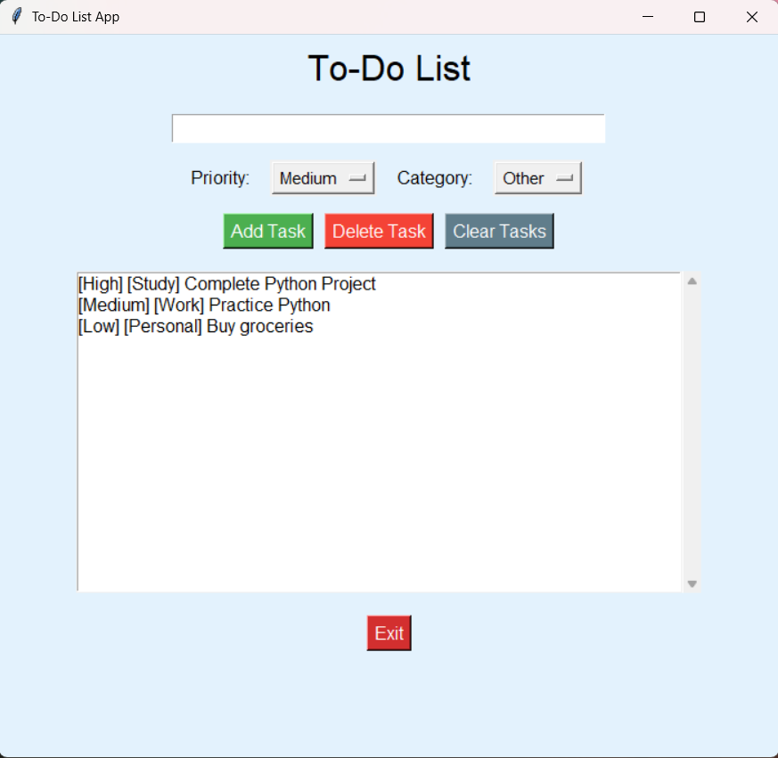

# 🚀 Day 34 - To-Do List GUI

Welcome to **Day 34** of my **100 Days, 100 Python Projects** challenge!

This project is a **To-Do List GUI application** built using Python's built-in **Tkinter** library. The application allows users to create, manage, categorize, prioritize, and delete tasks through a simple graphical interface. Tasks are also stored in a **JSON file**, allowing them to persist even after closing the application.

---

## 📌 Project Overview

The application provides a simple and interactive task management system where users can:

* 📝 Add new tasks
* ⭐ Assign priorities to tasks
* 🏷️ Categorize tasks
* 🗑️ Delete individual tasks
* 🧹 Clear all tasks
* 💾 Save tasks to a JSON file
* 🔄 Load previously saved tasks automatically
* 📜 View tasks inside a scrollable list
* ⚠️ Validate empty task input
* 🖥️ Interact with the application through a graphical interface

This project introduces important concepts such as **GUI development, JSON file handling, persistent data storage, list manipulation, widgets, and event-driven programming**.

---

## ✨ Features

* 🖥️ Graphical To-Do List Interface
* 📝 Task Entry Field
* ➕ Add Task functionality
* 🗑️ Delete Selected Task
* 🧹 Clear All Tasks
* ⭐ Task Priority Selection
* 🏷️ Task Category Selection
* 💾 Persistent JSON Storage
* 🔄 Automatic Task Loading
* 📜 Scrollable Task List
* ⚠️ Empty Task Validation
* ❓ Confirmation before clearing all tasks
* 🎨 Custom GUI styling
* 🚪 Exit button
* 📂 Automatic handling of invalid JSON data

---

## 🖼️ Application Preview

Here is a preview of the GUI application:



---

## 🛠️ Technologies Used

* **Python 3**
* **Tkinter**
* **JSON**
* **OS module**

### Libraries and Modules

| Module       | Purpose                                    |
| ------------ | ------------------------------------------ |
| `tkinter`    | Creating the graphical user interface      |
| `messagebox` | Displaying errors and confirmation dialogs |
| `json`       | Saving and loading tasks                   |
| `os`         | Checking whether the task file exists      |

---

## 📂 Project Structure

```text
DAY_34/
│── main34.py
│── tasks.json
│── screenshot.png
└── README.md
```

> `tasks.json` is automatically created when tasks are saved.

> `screenshot.png` is the screenshot of the application's graphical interface.

---

## ▶️ How to Run

### 1. Make sure Python is installed

Check your Python version:

```bash
python --version
```

### 2. Open the project folder

Open the terminal inside the `DAY_34` folder.

### 3. Run the application

```bash
python main34.py
```

The **To-Do List App** GUI window will open automatically.

---

## 💻 How It Works

### Step 1: Enter a Task

Enter your task into the task input field.

Example:

```text
Complete Python project
```

---

### Step 2: Select Priority

Choose a priority for the task:

* 🔴 High
* 🟡 Medium
* 🟢 Low

The default priority is:

```text
Medium
```

---

### Step 3: Select a Category

Choose a category for the task:

* 💼 Work
* 👤 Personal
* 📚 Study
* 📌 Other

The default category is:

```text
Other
```

---

### Step 4: Add the Task

Click the **Add Task** button.

The task will appear in the list in the following format:

```text
[High] [Study] Complete Python project
```

The task is also saved to `tasks.json`.

---

### Step 5: Delete a Task

Select a task from the list and click **Delete Task**.

The selected task will be removed from both:

* The GUI list
* The `tasks.json` file

If no task is selected, the application displays:

```text
Select a task to delete.
```

---

### Step 6: Clear All Tasks

Click **Clear Tasks** to remove all tasks.

Before deleting everything, the application asks for confirmation:

```text
Are you sure you want to delete all tasks?
```

If the user confirms, all tasks are removed and the JSON file is updated.

---

## 💾 Task Persistence

One of the main features of this project is **persistent task storage**.

Tasks are stored in:

```text
tasks.json
```

For example:

```json
[
    {
        "task": "Complete Python project",
        "priority": "High",
        "category": "Study"
    },
    {
        "task": "Buy groceries",
        "priority": "Low",
        "category": "Personal"
    }
]
```

When the application starts, it checks whether `tasks.json` exists.

If the file exists, the saved tasks are loaded automatically.

This means tasks remain available even after closing and reopening the application.

---

## 📜 Scrollable Task List

The application uses a **Tkinter Listbox** together with a **Scrollbar** to display tasks.

This allows the application to handle a larger number of tasks without making the window excessively large.

The displayed format is:

```text
[Priority] [Category] Task
```

Example:

```text
[High] [Work] Complete project documentation
[Medium] [Study] Practice Python
[Low] [Personal] Buy groceries
```

---

## ⚠️ Input Validation

The application checks whether the task input is empty.

If the user clicks **Add Task** without entering anything, the application displays:

```text
Task cannot be empty.
```

This prevents empty tasks from being added to the list.

---

## 🧩 GUI Components

The application uses several Tkinter widgets:

| Widget       | Purpose                                  |
| ------------ | ---------------------------------------- |
| `Tk()`       | Creates the main application window      |
| `Label`      | Displays titles and option labels        |
| `Entry`      | Accepts task input                       |
| `OptionMenu` | Allows priority and category selection   |
| `Button`     | Performs task-related actions            |
| `Listbox`    | Displays the task list                   |
| `Scrollbar`  | Allows scrolling through tasks           |
| `Frame`      | Organizes widgets into sections          |
| `StringVar`  | Stores selected priority and category    |
| `messagebox` | Displays errors and confirmation dialogs |
| `mainloop()` | Runs the Tkinter event loop              |

---

## 📚 Concepts Practiced

* Python GUI Development
* Tkinter
* JSON File Handling
* Persistent Data Storage
* File Handling
* Lists
* Dictionaries
* Functions
* Event Handling
* Callback Functions
* User Input
* Input Validation
* `StringVar`
* `OptionMenu`
* `Listbox`
* `Scrollbar`
* Frames
* Layout Management
* `pack()`
* `grid()`
* Exception Handling
* CRUD-style Operations
* `mainloop()`

---

## 🎯 Learning Outcome

This project helped me understand:

* How to build a practical GUI application using Tkinter
* How to create and manage tasks
* How to use buttons and callback functions
* How to use `Listbox` to display dynamic data
* How to implement scrolling in a GUI
* How to use dropdown menus with `OptionMenu`
* How to organize GUI components using frames
* How to store application data using JSON
* How to load saved data when an application starts
* How to update persistent data after adding or deleting items
* How to validate user input
* How to use confirmation dialogs
* How persistent storage works in a desktop application
* How event-driven programming works

---

## 🔮 Future Improvements

Possible enhancements for future versions:

* ☑️ Add task completion/check-off functionality
* ✏️ Add Edit Task functionality
* 🔍 Add task search functionality
* 🔽 Add filtering by priority
* 🏷️ Add filtering by category
* 📅 Add due dates
* ⏰ Add reminders and notifications
* 📊 Add task statistics
* 🔄 Add task sorting
* ⭐ Add more priority levels
* 🎨 Add a modern GUI design
* 🌙 Add Dark Mode
* 💾 Add database support using SQLite
* 📱 Improve responsive layout
* 🔐 Add user accounts
* ☁️ Add cloud synchronization
* 📆 Add calendar integration
* 🖱️ Add drag-and-drop task organization

---

## 📅 Challenge

This project is part of my **100 Days, 100 Python Projects** challenge, where I build one Python project every day to improve my Python programming skills, strengthen problem-solving abilities, learn new concepts, and develop consistency through daily coding.

---

## 👨‍💻 Author

**Abhijit Munghate**

Happy Coding! 🚀
