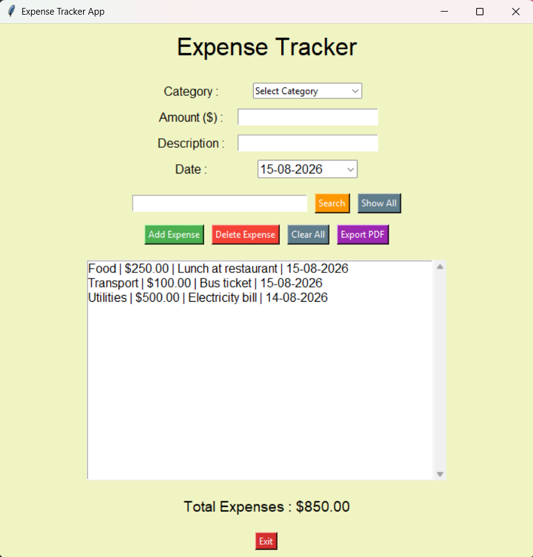

# 💰 Day 35 - Expense Tracker App

Welcome to **Day 35** of my **100 Days, 100 Python Projects** challenge!

This project is an **Expense Tracker GUI application** built using Python's **Tkinter** library. The application allows users to record, manage, search, and track their daily expenses through a graphical interface.

The application also provides **CSV-based data persistence**, automatic expense total calculation, date selection, and the ability to **export expense records as a PDF report**.

---

## 📌 Project Overview

The application provides a simple and interactive expense management system where users can:

* 💰 Add new expenses
* 🏷️ Select an expense category
* 💵 Enter an expense amount
* 📝 Add an expense description
* 📅 Select an expense date
* 🔍 Search existing expenses
* 📋 Display all expenses
* 🗑️ Delete individual expenses
* 🧹 Clear all expenses
* 📊 Calculate total expenses
* 💾 Save expenses to a CSV file
* 📂 Load previously saved expenses automatically
* 📄 Export expenses to a PDF report
* 📜 View expenses using a scrollable list
* ⚠️ Validate user input
* 🖥️ Manage expenses through a graphical interface

This project introduces practical concepts such as **GUI development, file handling, CSV storage, PDF generation, data validation, searching, and basic financial tracking**.

---

## ✨ Features

* 🖥️ Graphical Expense Tracker Interface
* ➕ Add Expense functionality
* 🗑️ Delete Expense functionality
* 🧹 Clear All Expenses
* 🏷️ Expense Categories
* 💵 Amount Validation
* 📝 Expense Description
* 📅 Date Selection
* 🔍 Expense Search
* 📋 Show All Expenses
* 📊 Automatic Total Calculation
* 💾 CSV Data Persistence
* 📂 Automatic Expense Loading
* 📄 PDF Report Export
* 📜 Scrollable Expense List
* ⚠️ Input Validation
* ❓ Confirmation before clearing all expenses
* 🎨 Custom GUI styling
* 🚪 Exit button

---

## 🖼️ Application Preview

Here is a preview of the GUI application:



---

## 🛠️ Technologies Used

* **Python 3**
* **Tkinter**
* **tkcalendar**
* **ReportLab**
* **CSV**
* **OS module**

### Libraries and Modules

| Module / Library | Purpose                                        |
| ---------------- | ---------------------------------------------- |
| `tkinter`        | Creating the graphical user interface          |
| `messagebox`     | Displaying errors, warnings, and confirmations |
| `ttk`            | Creating the category dropdown                 |
| `tkcalendar`     | Providing the date selection widget            |
| `reportlab`      | Generating PDF expense reports                 |
| `csv`            | Saving and loading expense data                |
| `os`             | Checking whether the expense file exists       |

---

## 📦 Installation

This project uses two external Python packages:

* `tkcalendar`
* `reportlab`

Install them using:

```bash
pip install tkcalendar reportlab
```

Tkinter, CSV, and OS are included with standard Python installations.

---

## 📂 Project Structure

```text
DAY_35/
│── main35.py
│── expenses.csv
│── expenses.pdf
│── screenshot.png
└── README.md
```

> `expenses.csv` is automatically created when expenses are saved.

> `expenses.pdf` is generated when the **Export PDF** button is used.

> `screenshot.png` is the screenshot of the application's graphical interface.

---

## ▶️ How to Run

### 1. Make sure Python is installed

Check your Python version:

```bash
python --version
```

### 2. Install required packages

```bash
pip install tkcalendar reportlab
```

### 3. Open the project folder

Open the terminal inside the `DAY_35` folder.

### 4. Run the application

```bash
python main35.py
```

The **Expense Tracker App** GUI window will open automatically.

---

## 💻 How It Works

### Step 1: Select a Category

Choose an expense category from the dropdown menu.

Available categories:

* 🍔 Food
* 🚗 Transport
* 🏠 Rent
* 💡 Utilities
* 📌 Other

---

### Step 2: Enter the Amount

Enter the amount spent.

Example:

```text
Amount ($) : 250
```

The application validates that the amount is a valid number and greater than zero.

---

### Step 3: Enter a Description

Enter a short description of the expense.

Example:

```text
Description : Lunch at restaurant
```

The description cannot be empty.

---

### Step 4: Select a Date

Select the expense date using the calendar-based date picker.

The date is displayed in:

```text
DD-MM-YYYY
```

format.

---

### Step 5: Add the Expense

Click **Add Expense**.

The expense will appear in the list in the following format:

```text
Food | $250.00 | Lunch at restaurant | 15-08-2026
```

The expense is also saved to `expenses.csv`.

---

## 📊 Total Expense Calculation

The application automatically calculates the total amount of all stored expenses.

For example:

```text
Food       | $250.00
Transport  | $100.00
Utilities  | $500.00
---------------------
Total      | $850.00
```

The total is displayed at the bottom of the application:

```text
Total Expenses : $850.00
```

---

## 🔍 Search Expenses

The application provides a search feature that allows users to search through their expenses.

The search checks all expense fields, including:

* Category
* Amount
* Description
* Date

For example, searching:

```text
Food
```

will display expenses containing `Food`.

Searching:

```text
Lunch
```

will display expenses whose description contains `Lunch`.

The search is **case-insensitive**.

---

## 📋 Show All Expenses

Click the **Show All** button to restore the complete expense list after performing a search.

This displays all expenses stored in the application.

---

## 🗑️ Delete an Expense

Select an expense from the list and click **Delete Expense**.

The selected expense will be removed from:

* The GUI list
* The in-memory expense list
* The `expenses.csv` file

If no expense is selected, the application displays:

```text
Please select an expense to delete.
```

---

## 🧹 Clear All Expenses

Click **Clear All** to remove every expense.

Before deleting the records, the application asks for confirmation:

```text
Are you sure you want to clear all expenses?
```

If confirmed:

* All expenses are removed
* The expense list is cleared
* The total becomes `$0.00`
* The CSV file is updated

---

## 💾 CSV Data Storage

Expense information is stored in:

```text
expenses.csv
```

Each expense contains four pieces of information:

```text
Category
Amount
Description
Date
```

Example:

```csv
Food,250.0,Lunch at restaurant,15-08-2026
Transport,100.0,Bus ticket,15-08-2026
Utilities,500.0,Electricity bill,14-08-2026
```

When the application starts, it checks whether `expenses.csv` exists and automatically loads previously saved expenses.

This provides **persistent data storage** between application sessions.

---

## 📄 PDF Export

The application can generate a PDF report containing the stored expenses.

Click the:

```text
Export PDF
```

button to generate:

```text
expenses.pdf
```

The PDF contains an **Expense Report** with each expense displayed along with:

* Date
* Category
* Amount
* Description

This provides a simple way to create a printable or shareable expense report.

---

## ⚠️ Input Validation

The application validates user input before adding an expense.

### Invalid Category

If no category is selected:

```text
Please select a category.
```

### Invalid Amount

If the amount is not a valid number:

```text
Please enter a valid amount.
```

### Zero or Negative Amount

If the amount is zero or negative:

```text
Amount must be greater than 0.
```

### Empty Description

If the description is empty:

```text
Please enter a description.
```

These validations prevent invalid expense records from being added.

---

## 🧩 GUI Components

The application uses several Tkinter widgets:

| Widget       | Purpose                                       |
| ------------ | --------------------------------------------- |
| `Tk()`       | Creates the main application window           |
| `Label`      | Displays titles, labels, and total expenses   |
| `Entry`      | Accepts amount, description, and search input |
| `Combobox`   | Provides expense category selection           |
| `DateEntry`  | Provides calendar-based date selection        |
| `Button`     | Performs expense-related actions              |
| `Listbox`    | Displays expense records                      |
| `Scrollbar`  | Allows scrolling through expenses             |
| `Frame`      | Organizes GUI components                      |
| `messagebox` | Displays errors and confirmation dialogs      |
| `mainloop()` | Runs the Tkinter event loop                   |

---

## 📚 Concepts Practiced

* Python GUI Development
* Tkinter
* `ttk.Combobox`
* Date Selection
* `tkcalendar`
* CSV File Handling
* Persistent Data Storage
* PDF Generation
* ReportLab
* File Handling
* Lists
* Functions
* Searching
* Data Validation
* Exception Handling
* String Processing
* Floating-Point Numbers
* Listbox
* Scrollbar
* Frames
* Event Handling
* Callback Functions
* Confirmation Dialogs
* `pack()`
* `grid()`
* `mainloop()`

---

## 🎯 Learning Outcome

This project helped me understand:

* How to build a practical GUI application using Tkinter
* How to create an expense management system
* How to work with CSV files
* How to store and retrieve persistent application data
* How to use dropdown menus for selecting categories
* How to integrate a calendar widget into a Tkinter application
* How to validate numerical input
* How to search through stored records
* How to delete and clear records
* How to calculate totals from stored data
* How to generate PDF reports using ReportLab
* How to organize widgets using frames
* How to use scrollable Listbox widgets
* How to create confirmation dialogs
* How event-driven programming works
* How different Python libraries can be integrated into one application

---

## 🔮 Future Improvements

Possible enhancements for future versions:

* 📊 Add expense charts and graphs
* 📈 Add monthly and yearly expense reports
* 🥧 Add category-wise expense visualization
* 📅 Add date-range filtering
* 🔍 Add advanced search and filtering
* ✏️ Add Edit Expense functionality
* 💰 Add income tracking
* 📊 Add income vs. expense comparison
* 🎯 Add monthly spending limits
* 🚨 Add budget notifications
* 📄 Improve PDF report formatting
* 📊 Add Excel export
* 🗄️ Replace CSV storage with SQLite or MySQL
* 👤 Add user accounts
* 🔐 Add authentication
* 🌙 Add Dark Mode
* 🎨 Create a more modern GUI design
* 📱 Improve responsive layout
* ☁️ Add cloud synchronization
* 📈 Add financial dashboards
* 💱 Support multiple currencies

---

## 📅 Challenge

This project is part of my **100 Days, 100 Python Projects** challenge, where I build one Python project every day to improve my Python programming skills, strengthen problem-solving abilities, learn new concepts, and develop consistency through daily coding.

---

## 👨‍💻 Author

**Abhijit Munghate**

Happy Coding! 🚀
