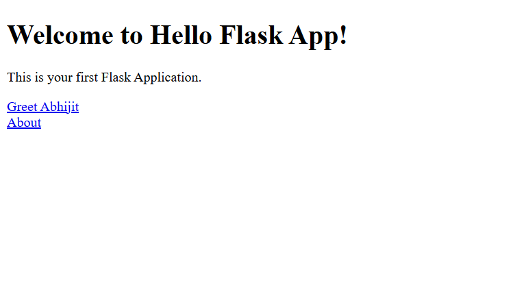
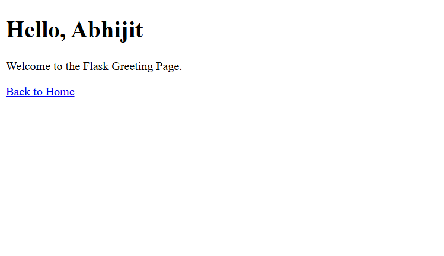

# 🌐 Day 36 - Hello Flask App

Welcome to **Day 36** of my **100 Days, 100 Python Projects** challenge!

This project is a simple **web application built using Python and Flask**. It introduces the fundamentals of web development with Flask, including **routing, HTML templates, dynamic URL parameters, and custom error handling**.

The application contains a home page, an about page, and a dynamic greeting page that displays a personalized message based on the name provided in the URL.

---

## 📌 Project Overview

The application provides a simple Flask-based website where users can:

* 🏠 Visit the home page
* 👋 Generate a personalized greeting
* 📄 View an About page
* 🔗 Navigate between different pages
* 🌐 Use Flask URL routing
* 👤 Pass a name through a dynamic URL
* ⚠️ Handle invalid URLs using a custom 404 error handler
* 🎨 Display content using HTML templates
* 🧩 Use Jinja template variables

This project is designed to introduce the fundamentals of **Flask web development and server-side rendering with Python**.

---

## ✨ Features

* 🌐 Flask Web Application
* 🏠 Home Page
* 📄 About Page
* 👋 Dynamic Greeting Page
* 👤 Dynamic URL Parameters
* 🔗 Navigation Links
* 🧩 HTML Templates
* 🎨 Basic HTML Interface
* ⚠️ Custom 404 Error Handling
* 🐍 Python Backend
* 🔄 Server-Side Template Rendering
* 🛠️ Flask Debug Mode

---

## 🖼️ Application Preview

Here is a preview of the Flask application:

### 🏠 Home Page


### 👋 Greeting Page


---

## 🛠️ Technologies Used

* **Python 3**
* **Flask**
* **HTML5**
* **Jinja2**

Flask is a lightweight Python web framework used for building web applications and APIs.

---

## 📦 Installation

First, make sure Python is installed.

Check your Python version:

```bash
python --version
```

Install Flask using:

```bash
pip install flask
```

---

## 📂 Project Structure

```text
DAY_36/
│
├── main36.py
├── README.md
│
├── templates/
│   ├── index.html
│   ├── about.html
│   └── greet.html
│
└── screenshots/
    ├── home.png
    └── greet.png
```

### File Description

| File / Folder    | Purpose                           |
| ---------------- | ----------------------------------|
| `main36.py`      | Main Flask application            |
| `templates/`     | Contains HTML templates           |
| `index.html`     | Home page                         |
| `about.html`     | About page                        |
| `greet.html`     | Dynamic greeting page             |
| `screenshots/`   | Contains application screenshots  |
| `home.png`       | Screenshot of the home page       |
| `greet.png`      | Screenshot of the greeting page   |
| `README.md`      | Project documentation             |

> Flask automatically looks for HTML templates inside the `templates` folder.

---

## ▶️ How to Run

### 1. Open the project folder

Open the terminal inside the `DAY_36` folder.

### 2. Install Flask

```bash
pip install flask
```

### 3. Run the application

```bash
python main36.py
```

You should see Flask start the development server.

The application will normally be available at:

```text
http://127.0.0.1:5000/
```

Open this address in your web browser.

---

## 🌐 Application Routes

The application contains four main routes:

| Route           | Purpose                          |
| --------------- | -------------------------------- |
| `/`             | Displays the home page           |
| `/about`        | Displays the About page          |
| `/greet/<name>` | Displays a personalized greeting |
| Invalid route   | Displays a custom 404 error      |

---

## 🏠 Home Page

The home page is available at:

```text
/
```

It displays:

```text
Welcome to Hello Flask App!

This is your first Flask Application.
```

The page also contains links to:

* 👋 Greeting Page
* 📄 About Page

---

## 📄 About Page

The About page is available at:

```text
/about
```

It provides information about the project and explains the concepts demonstrated by the application.

The page includes a link to return to the home page.

---

## 👋 Dynamic Greeting Page

The greeting page uses a **dynamic URL parameter**.

The route is:

```python
@app.route('/greet/<name>')
```

For example:

```text
/greet/Abhijit
```

Flask passes `Abhijit` to the `greet()` function.

The function then sends the name to the HTML template:

```python
return render_template('greet.html', name=name)
```

The template uses the Jinja variable:

```html
<h1>Hello, {{ name }}</h1>
```

The browser displays:

```text
Hello, Abhijit
```

You can also change the name directly in the URL.

For example:

```text
/greet/Python
```

will display:

```text
Hello, Python
```

---

## ⚠️ Custom 404 Error Handling

The application includes a custom error handler for pages that do not exist.

```python
@app.errorhandler(404)
def page_not_found(error):
    return f"Page not found: {error}", 404
```

For example, if you visit:

```text
/unknown
```

the application returns a custom message such as:

```text
Page not found: 404 Not Found
```

The response also correctly uses the HTTP status code:

```text
404
```

---

## 🧩 Flask Components

The application uses several important Flask concepts:

| Component                   | Purpose                                                 |
| --------------------------- | ------------------------------------------------------- |
| `Flask()`                   | Creates the Flask application                           |
| `@app.route()`              | Maps URLs to Python functions                           |
| `render_template()`         | Renders HTML templates                                  |
| `<name>`                    | Creates a dynamic URL parameter                         |
| `@app.errorhandler(404)`    | Handles missing pages                                   |
| `app.run()`                 | Starts the Flask development server                     |
| `if __name__ == '__main__'` | Runs the application when the file is executed directly |

---

## 🧩 HTML Templates

The project uses three HTML templates.

### `index.html`

The main home page of the application.

It contains:

* Welcome message
* Description
* Greeting link
* About link

### `about.html`

Provides information about the project and the Flask concepts used.

### `greet.html`

Displays the dynamic greeting.

It uses a Jinja template variable:

```html
{{ name }}
```

Flask replaces this variable with the name received from the URL.

---

## 🔄 How the Application Works

The basic request flow is:

```text
User
  │
  ▼
Web Browser
  │
  ▼
Flask Server
  │
  ▼
URL Route
  │
  ▼
Python Function
  │
  ▼
HTML Template
  │
  ▼
Web Browser
```

For example:

```text
/greet/Abhijit
        ↓
greet(name)
        ↓
name = "Abhijit"
        ↓
greet.html
        ↓
Hello, Abhijit
```

---

## 🐍 Flask Application Code

The main application creates the Flask instance:

```python
app = Flask(__name__)
```

Routes are then defined using decorators:

```python
@app.route('/')
def home():
    return render_template('index.html')
```

The application is started using:

```python
if __name__ == '__main__':
    app.run(debug=True)
```

---

## 🛠️ Debug Mode

The application runs with:

```python
app.run(debug=True)
```

Debug mode is useful during development because Flask automatically reloads the application when code changes are detected and provides detailed error information.

> ⚠️ Debug mode should not be enabled in a production deployment because it is intended for development and debugging.

---

## 📚 Concepts Practiced

* Python Web Development
* Flask
* Flask Application Creation
* Routing
* URL Mapping
* Dynamic URL Parameters
* HTML Templates
* Jinja2
* Template Variables
* `render_template()`
* HTTP Status Codes
* 404 Error Handling
* Custom Error Handlers
* Web Server Basics
* Client-Server Architecture
* Request and Response
* Debug Mode
* HTML5
* Basic Web Navigation

---

## 🎯 Learning Outcome

This project helped me understand:

* How to create a web application using Flask
* How Flask applications work
* How to create URL routes
* How to connect URLs with Python functions
* How to render HTML templates using Flask
* How to organize templates using the `templates` directory
* How dynamic URL parameters work
* How to pass Python variables to HTML templates
* How Jinja template variables work
* How to create custom 404 error handling
* How HTTP status codes are used
* How to run a local Flask development server
* How Python can be used for backend web development
* How client-server communication works at a basic level

---

## 🔮 Future Improvements

Possible enhancements for future versions:

* 🎨 Add CSS styling
* 📱 Make the website fully responsive
* 🌙 Add Dark Mode
* 🧭 Create a navigation bar
* 🖼️ Add images and icons
* 📝 Add user input forms
* 👤 Create a user registration system
* 🔐 Add authentication and login
* 🗄️ Connect the application to a database
* 📊 Add a dashboard
* 🔌 Create REST APIs
* ⚡ Add JavaScript interactivity
* 📨 Add contact forms
* 🛡️ Add better error pages
* 📄 Create custom 404 and 500 pages
* 🚀 Deploy the application online
* 🎨 Use Bootstrap or another CSS framework

---

## 📅 Challenge

This project is part of my **100 Days, 100 Python Projects** challenge, where I build one Python project every day to improve my Python programming skills, strengthen problem-solving abilities, learn new technologies, and develop consistency through daily coding.

---

## 👨‍💻 Author

**Abhijit Munghate**

Happy Coding! 🚀
