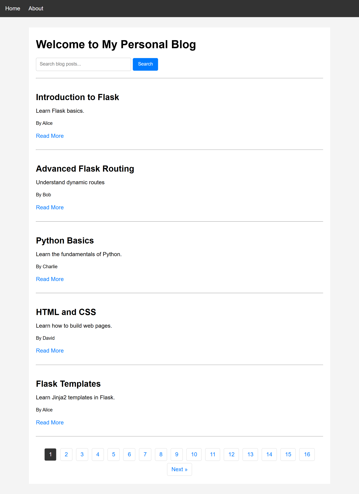
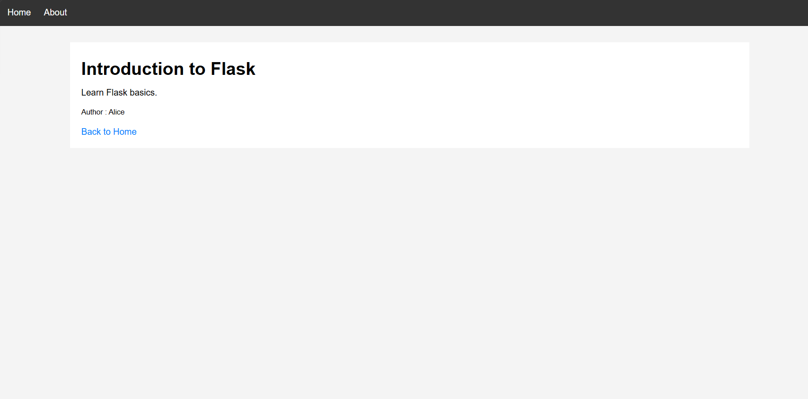
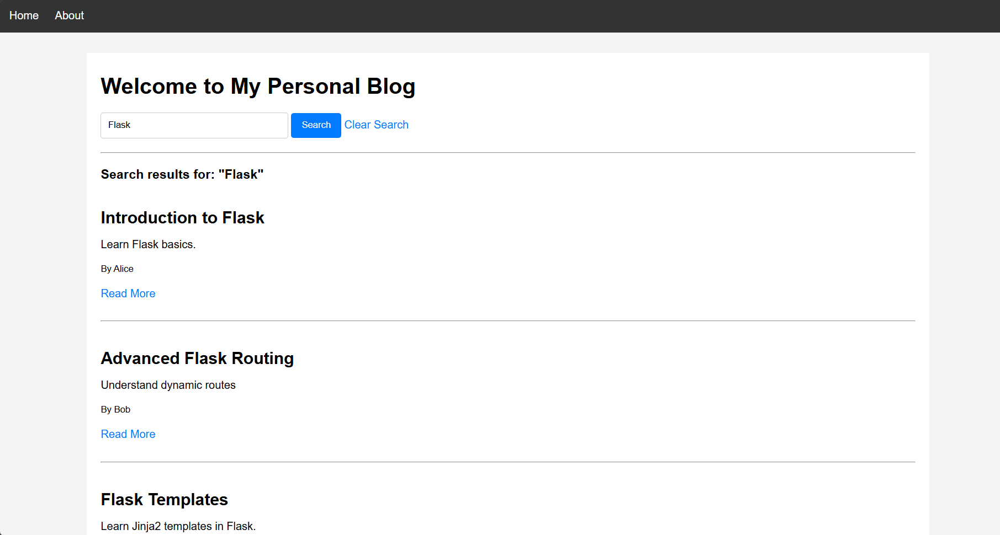

# 🌐 Day 37 - Personal Blog Website

Welcome to **Day 37** of my **100 Days, 100 Python Projects** challenge!

This project is a simple **personal blog website built using Python and Flask**. It demonstrates important Flask web development concepts such as **routing, dynamic URLs, HTML templates, template inheritance, Jinja2, search functionality, pagination, static CSS files, and passing data from Python to HTML templates**.

The application contains a home page that displays blog posts, a search feature for finding posts, pagination for navigating through multiple posts, individual post detail pages, and an About page.

---

## 📌 Project Overview

The application provides a simple Flask-based personal blog where users can:

* 🏠 View blog posts
* 🔍 Search for blog posts
* 📄 View individual blog posts
* 👤 View post authors
* 🔗 Navigate between different pages
* 📑 Use pagination to browse posts
* 🌐 Use Flask URL routing
* 🔢 Use dynamic URL parameters
* 🧩 Use Jinja2 template variables
* 🏗️ Use template inheritance
* 🎨 Apply CSS styling
* 📦 Serve static files using Flask
* 🐍 Use Python as the backend
* 🔄 Render dynamic content using Flask templates

This project is designed to strengthen the fundamentals of **Flask web development and server-side rendering with Python**.

---

## ✨ Features

* 🌐 Flask Web Application
* 🏠 Blog Home Page
* 📝 Multiple Blog Posts
* 🔍 Blog Post Search
* 📑 Pagination
* 👤 Author Information
* 📄 Individual Post Detail Pages
* 📚 About Page
* 🔗 Navigation Bar
* 🧩 HTML Templates
* 🏗️ Template Inheritance
* 🎨 CSS Styling
* 🧠 Jinja2 Template Variables
* 🔢 Dynamic URL Parameters
* 🛠️ Flask Routing
* 🐍 Python Backend
* 🔄 Server-Side Template Rendering
* ⚡ Flask Debug Mode

---

## 🖼️ Application Preview

Here is a preview of the Personal Blog Website:

### 🏠 Home Page



### 📄 Blog Post Page



### 🔍 Search Results



> Add your actual screenshots to the `screenshots/` folder and update the filenames above if required.

---

## 🛠️ Technologies Used

* **Python 3**
* **Flask**
* **HTML5**
* **CSS3**
* **Jinja2**

### Python

Python is used to build the backend logic, store the blog posts, process search requests, handle pagination, and manage routes.

### Flask

Flask is a lightweight Python web framework used to create the web application and handle HTTP requests and responses.

### HTML5

HTML is used to create the structure and content of the web pages.

### CSS3

CSS is used to style the blog website and improve its visual appearance.

### Jinja2

Jinja2 is Flask's template engine. It allows Python data to be dynamically displayed inside HTML templates.

---

## 📦 Installation

First, make sure Python is installed on your computer.

Check your Python version:

```bash
python --version
```

Install Flask using:

```bash
pip install flask
```

---

## 📂 Project Structure

```text
DAY_37/
│
├── main37.py
├── README.md
│
├── templates/
│   ├── layout.html
│   ├── index.html
│   ├── post.html
│   └── about_us.html
│
├── static/
│   └── css/
│       └── style.css
│
└── screenshots/
    ├── home.png
    ├── post.png
    └── search.png
```

### File Description

| File / Folder   | Purpose                                |
| --------------- | -------------------------------------- |
| `main37.py`     | Main Flask application                 |
| `templates/`    | Contains HTML templates                |
| `layout.html`   | Base HTML layout shared by other pages |
| `index.html`    | Blog home page                         |
| `post.html`     | Individual blog post page              |
| `about_us.html` | About page                             |
| `static/`       | Contains static files                  |
| `css/`          | Contains CSS files                     |
| `style.css`     | Stylesheet for the website             |
| `screenshots/`  | Contains application screenshots       |
| `home.png`      | Screenshot of the home page            |
| `post.png`      | Screenshot of the post page            |
| `search.png`    | Screenshot of the search page          |
| `README.md`     | Project documentation                  |

> Flask automatically looks for HTML templates inside the `templates` folder and static resources inside the `static` folder.

---

## ▶️ How to Run

### 1. Open the project folder

Open the terminal inside the `DAY_37` folder.

### 2. Install Flask

```bash
pip install flask
```

### 3. Run the application

```bash
python main37.py
```

Flask will start the development server.

The application will normally be available at:

```text
http://127.0.0.1:5000/
```

Open this address in your web browser.

---

## 🌐 Application Routes

The application contains three main routes:

| Route             | Purpose                          |
| ----------------- | -------------------------------- |
| `/`               | Displays the blog home page      |
| `/post/<post_id>` | Displays an individual blog post |
| `/about`          | Displays the About page          |

For example:

```text
/
```

opens the home page.

```text
/post/1
```

opens the blog post with ID `1`.

```text
/about
```

opens the About page.

---

## 🏠 Home Page

The home page is available at:

```text
/
```

The home page displays the available blog posts.

Each post contains:

* 📝 Post title
* 📄 Post content
* 👤 Author name
* 🔗 Read More link

The page also contains a search form and pagination controls.

---

## 🔍 Blog Search

The website includes a search feature that allows users to search for blog posts.

The search form uses the HTTP `GET` method:

```html
<form method="GET" action="/">
```

The search value is retrieved in Flask using:

```python
search = request.args.get('search', '').strip()
```

The application searches through:

* Post title
* Post content
* Author name

The filtering logic is:

```python
filtered_posts = [
    post for post in posts
    if search.lower() in post["title"].lower()
    or search.lower() in post["content"].lower()
    or search.lower() in post["author"].lower()
]
```

For example, searching for:

```text
Flask
```

can return posts containing the word **Flask** in their title or content, as well as posts written by an author whose name matches the search.

If a search is active, the page displays:

```text
Search results for: "Flask"
```

A **Clear Search** link is also displayed.

---

## 📑 Pagination

The website displays a maximum of **5 posts per page**.

This is controlled using:

```python
per_page = 5
```

The current page is retrieved from the URL:

```python
page = request.args.get('page', 1, type=int)
```

The application calculates the total number of pages and selects only the posts required for the current page.

The pagination provides:

* Previous button
* Page numbers
* Next button

For example:

```text
Previous   1   2   3   Next
```

The search query is preserved while navigating between pages.

For example:

```text
/?page=2&search=Flask
```

This allows users to browse search results without losing their search term.

---

## 📄 Blog Post Detail Page

Each blog post has a unique ID.

The route is:

```python
@app.route('/post/<int:post_id>')
def post_detail(post_id):
```

The `<int:post_id>` part creates a **dynamic URL parameter** and tells Flask that the value should be treated as an integer.

For example:

```text
/post/1
```

Flask passes:

```text
post_id = 1
```

to the `post_detail()` function.

The application searches for the matching post:

```python
post = next(
    (post for post in posts if post["id"] == post_id),
    None
)
```

If the post exists, Flask renders:

```python
return render_template('post.html', post=post)
```

The template then displays the post title, content, and author.

---

## ⚠️ Post Not Found Handling

If a user enters an ID that does not exist, the application returns a `404` response.

For example:

```text
/post/999
```

If post `999` does not exist, the application returns:

```html
<h1>Post Not Found</h1>
```

with the HTTP status code:

```text
404
```

The relevant Flask code is:

```python
if post:
    return render_template('post.html', post=post)

return "<h1>Post Not Found</h1>", 404
```

This demonstrates basic error handling in Flask.

---

## 📄 About Page

The About page is available at:

```text
/about
```

It provides information about the website and the project.

The page explains that the website was created using Flask and demonstrates concepts such as:

* Flask routing
* Templates
* Template inheritance
* Dynamic URLs
* Passing data from Python to HTML

---

## 🧩 Template Inheritance

One of the important concepts demonstrated in this project is **Jinja2 template inheritance**.

The project uses:

```text
layout.html
```

as the base template.

Other templates extend it using:

```html

```

For example:

```html


Home - My Blog


...

```

This avoids repeating common HTML code such as:

* `DOCTYPE`
* `<html>`
* `<head>`
* Navigation bar
* CSS stylesheet
* Page structure

---

## 🧱 Base Template - `layout.html`

The `layout.html` file provides the common structure of the website.

It contains:

* HTML document structure
* Page title block
* CSS stylesheet
* Navigation bar
* Content block

The title is defined using:

```html
My Blog
```

The page content is defined using:

```html

```

Individual pages replace these blocks with their own content.

---

## 🧩 Jinja2 Template Variables

The project uses Jinja2 variables to display Python data inside HTML.

For example, the home page displays the post title using:

```html
<h2>{{ post.title }}</h2>
```

The post content is displayed using:

```html
<p>{{ post.content }}</p>
```

The author is displayed using:

```html
<small>By {{ post.author }}</small>
```

Flask sends the post data to the template:

```python
return render_template(
    'index.html',
    posts=paginated_posts,
    search=search,
    page=page,
    total_pages=total_pages
)
```

Jinja2 then uses this data to generate the final HTML page.

---

## 🔗 Flask `url_for()`

The project uses Flask's `url_for()` function to generate URLs dynamically.

For example:

```html
<a href="{{ url_for('post_detail', post_id=post.id) }}">
    Read More
</a>
```

This creates the correct URL for the selected blog post.

Navigation links also use `url_for()`:

```html
<a href="{{ url_for('home') }}">Home</a>
<a href="{{ url_for('about') }}">About</a>
```

Using `url_for()` is better than manually writing URLs because Flask can generate the correct routes automatically.

---

## 🎨 CSS Styling

The project contains a CSS stylesheet:

```text
static/css/style.css
```

The stylesheet provides basic styling for:

* Page background
* Navigation bar
* Navigation links
* Main content container
* Search form
* Search button
* Blog posts
* Pagination
* Current page indicator
* Headings
* Links

The CSS file is connected to the base template using:

```html
<link rel="stylesheet"
      href="{{ url_for('static', filename='css/style.css')}}">
```

Flask automatically serves files stored inside the `static` directory.

---

## 🗃️ Blog Data

The blog posts are currently stored in a Python list of dictionaries.

Example:

```python
posts = [
    {
        "id": 1,
        "title": "Introduction to Flask",
        "content": "Learn Flask basics.",
        "author": "Alice"
    }
]
```

The project currently contains **12 sample blog posts**.

The posts cover topics such as:

* Flask
* Python
* HTML
* CSS
* Web Development
* Flask Routing
* Flask Forms
* Flask Templates
* Error Handling
* Python File Handling
* Python Lists

> The current project uses in-memory Python data, so posts will reset whenever the application restarts.

---

## 🔄 How the Application Works

The basic request flow is:

```text
User
  │
  ▼
Web Browser
  │
  ▼
Flask Server
  │
  ▼
URL Route
  │
  ▼
Python Function
  │
  ├── Search
  ├── Filtering
  ├── Pagination
  └── Post Lookup
  │
  ▼
Jinja2 Template
  │
  ▼
HTML + CSS
  │
  ▼
Web Browser
```

For example, when a user opens:

```text
/post/3
```

the request follows this process:

```text
/post/3
    ↓
post_detail(3)
    ↓
Find post with ID 3
    ↓
post = selected blog post
    ↓
post.html
    ↓
Display title, content and author
```

---

## 🔍 How Search and Pagination Work Together

When a user searches for a keyword, the application first filters the posts.

```text
All Posts
    ↓
Search Query
    ↓
Filtered Posts
    ↓
Pagination
    ↓
Current Page Posts
    ↓
index.html
```

For example:

```text
Search: Flask
        ↓
Find matching posts
        ↓
Filter results
        ↓
Display 5 results per page
```

The application also preserves the search query while moving between pages.

---

## 🐍 Flask Application Code

The application starts by importing Flask components:

```python
from flask import Flask, render_template, request
```

The Flask application is created using:

```python
app = Flask(__name__)
```

Routes are created using decorators:

```python
@app.route('/')
def home():
    ...
```

The application is started using:

```python
if __name__ == "__main__":
    app.run(debug=True)
```

---

## 🛠️ Debug Mode

The application runs using:

```python
app.run(debug=True)
```

Debug mode is useful during development because Flask automatically reloads the application when code changes are detected and provides detailed debugging information.

> ⚠️ Debug mode should not be enabled in a production deployment because it is intended for development and debugging.

---

## 🧩 Flask Components

| Component            | Purpose                                  |
| -------------------- | ---------------------------------------- |
| `Flask()`            | Creates the Flask application            |
| `@app.route()`       | Maps URLs to Python functions            |
| `render_template()`  | Renders HTML templates                   |
| `request.args.get()` | Retrieves query parameters               |
| `<int:post_id>`      | Creates a dynamic integer URL parameter  |
| `url_for()`          | Generates URLs for Flask routes          |
| `next()`             | Finds a matching post from the list      |
| Jinja2               | Dynamically displays Python data in HTML |
| ``      | Enables template inheritance             |
| ``        | Defines replaceable template sections    |
| `app.run()`          | Starts the Flask development server      |
| `debug=True`         | Enables Flask development debugging      |

---

## 📚 Concepts Practiced

* Python Web Development
* Flask
* Flask Application Creation
* Flask Routing
* Dynamic URL Parameters
* Integer URL Parameters
* Query Parameters
* Search Functionality
* Filtering Data
* Pagination
* HTML Templates
* Jinja2
* Template Variables
* Template Inheritance
* `render_template()`
* `url_for()`
* Static Files
* CSS Styling
* HTTP Status Codes
* 404 Error Handling
* Request and Response
* Client-Server Architecture
* Flask Debug Mode

---

## 🎯 Learning Outcome

This project helped me understand:

* How to create a blog website using Flask
* How Flask applications work
* How to create and manage URL routes
* How dynamic URL parameters work
* How to retrieve query parameters using Flask's `request` object
* How to implement search functionality
* How to filter data using Python
* How to implement pagination
* How to display multiple pages of data
* How to create individual blog post pages
* How to pass Python data to HTML templates
* How Jinja2 template variables work
* How template inheritance works
* How to create a reusable base HTML layout
* How to use Flask's `url_for()` function
* How to serve static CSS files
* How to handle missing blog posts
* How HTTP status code `404` works
* How Python can be used for backend web development
* How client-server communication works at a basic level

---

## 🔮 Future Improvements

Possible enhancements for future versions:

* 🎨 Improve the overall UI/UX
* 📱 Make the website fully responsive
* 🌙 Add Dark Mode
* 🔍 Add advanced search and filtering
* 🏷️ Add categories and tags
* 👤 Add user registration and login
* 🔐 Add authentication and authorization
* ✍️ Allow users to create blog posts
* ✏️ Add post editing functionality
* 🗑️ Add post deletion functionality
* 💬 Add comments
* ❤️ Add likes and reactions
* 🗄️ Connect the application to a database
* 📊 Create an admin dashboard
* 🖼️ Add featured images to posts
* 📅 Add post publication dates
* 🔗 Add social sharing
* 📧 Add contact forms
* 🛡️ Create custom 404 and 500 error pages
* 🔌 Create REST APIs
* ⚡ Add JavaScript interactivity
* 🚀 Deploy the application online
* 🎨 Use Bootstrap or another CSS framework

---

## 📅 Challenge

This project is part of my **100 Days, 100 Python Projects** challenge, where I build one Python project every day to improve my Python programming skills, strengthen problem-solving abilities, learn new technologies, and develop consistency through daily coding.

---

## 👨‍💻 Author

**Abhijit Munghate**

Happy Coding! 🚀
