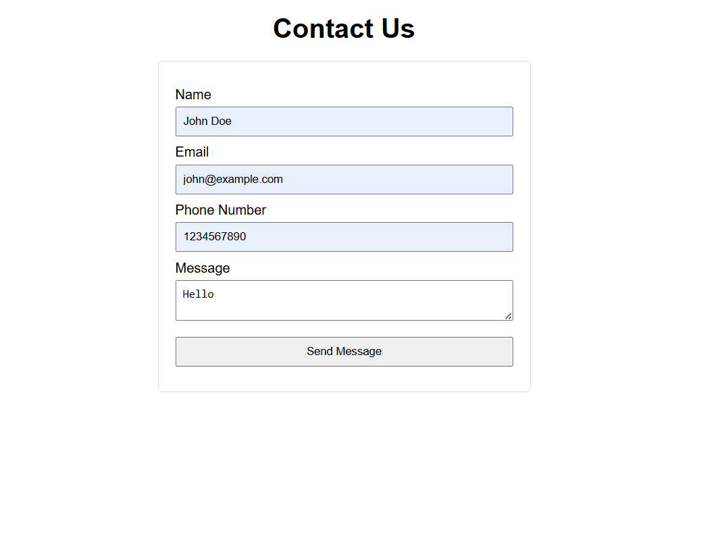
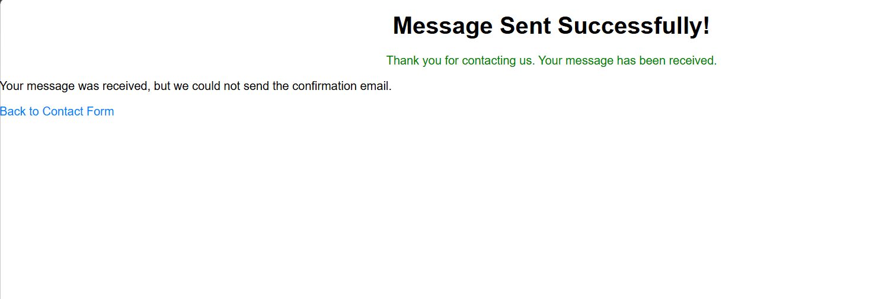
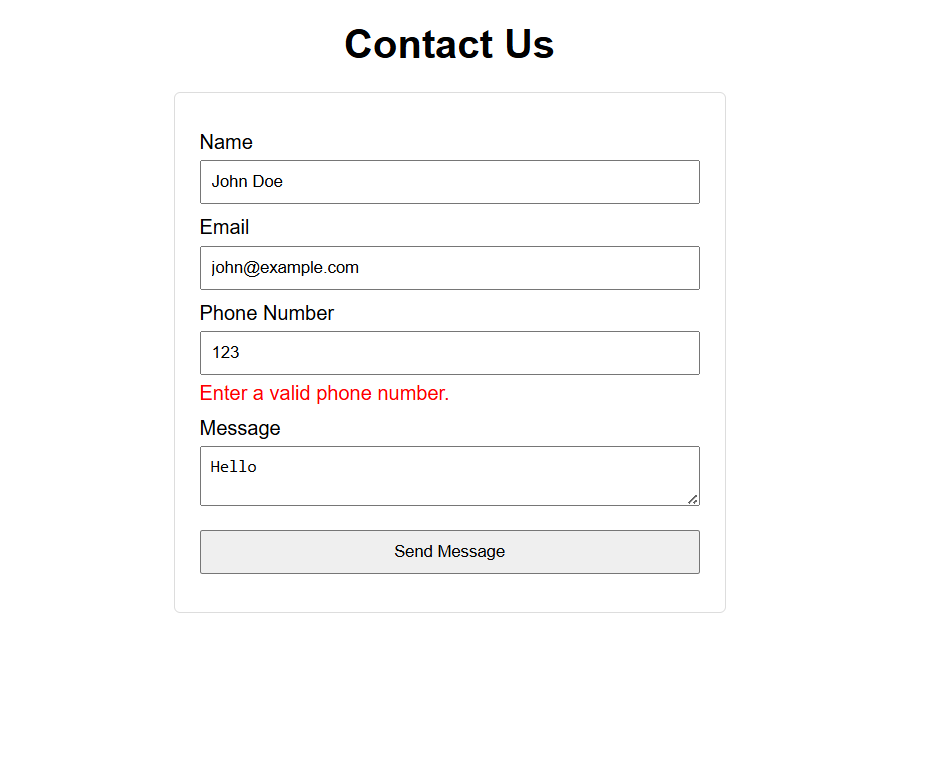

# 📬 Day 38 - Contact Form App

Welcome to **Day 38** of my **100 Days, 100 Python Projects** challenge!

This project is a **contact form web application built using Python and Flask**. It demonstrates how to create and process web forms using **Flask-WTF and WTForms**, validate user input, store submitted information in a CSV file, display success messages, and send confirmation emails using Python's built-in `smtplib` and `email` modules.

The application provides a simple contact form where users can enter their **name, email address, phone number, and message**. The submitted information is stored locally, and the application attempts to send a confirmation email to the submitted email address.

---

## 📌 Project Overview

The Contact Form App provides a simple web interface where users can:

* 📝 Enter their name
* 📧 Enter their email address
* 📱 Enter their phone number
* 💬 Enter a message
* ✅ Validate form fields
* 🛡️ Use CSRF protection through Flask-WTF
* 💾 Save submissions to a CSV file
* 📩 Send confirmation emails
* 🔔 Display success messages
* ⚠️ Display validation errors
* 🔄 Return to the contact form after submission
* 🎨 Use custom CSS styling

This project introduces the fundamentals of **Flask form handling, server-side validation, data storage, and email automation**.

---

## ✨ Features

* 🌐 Flask Web Application
* 📝 Contact Form
* 👤 Name Validation
* 📧 Email Validation
* 📱 Phone Number Validation
* 💬 Message Validation
* 🛡️ CSRF Protection
* 🔐 Flask-WTF Form Handling
* ✅ WTForms Validation
* 💾 CSV Data Storage
* 📩 Confirmation Email
* 📬 SMTP Email Integration
* 🔔 Flask Flash Messages
* ⚠️ Form Validation Errors
* 🎨 CSS Styling
* 📄 Success Page
* 🐍 Python Backend
* 🔄 Server-Side Form Processing
* 🛠️ Flask Debug Mode

---

## 🖼️ Application Preview

The application contains a contact form, a successful submission page, and validation error handling.

## 📸 Screenshots

### 📝 Contact Form



### ✅ Successful Submission



### ⚠️ Form Validation



> Add your actual screenshots to the `screenshots/` folder and update the filenames above if required.

---

## 🛠️ Technologies Used

* **Python 3**
* **Flask**
* **Flask-WTF**
* **WTForms**
* **HTML5**
* **CSS3**
* **CSV**
* **SMTP**
* **EmailMessage**

### Python

Python is used for the backend application logic, form processing, validation, CSV storage, and email functionality.

### Flask

Flask is used to create the web application, define routes, render templates, and process HTTP requests.

### Flask-WTF

Flask-WTF integrates WTForms with Flask and provides features such as form handling and CSRF protection.

### WTForms

WTForms is used to define form fields and validate user input.

### HTML5

HTML is used to create the contact form and success page.

### CSS3

CSS is used to style the contact form, validation errors, success messages, inputs, and links.

### CSV

Python's built-in `csv` module is used to store contact form submissions in a CSV file.

### SMTP

Python's `smtplib` module is used to connect to an SMTP server and send confirmation emails.

---

## 📦 Installation

First, make sure Python is installed on your computer.

Check your Python version:

```bash
python --version
```

Install Flask:

```bash
pip install flask
```

Install Flask-WTF:

```bash
pip install flask-wtf
```

You can also install both packages together:

```bash
pip install flask flask-wtf
```

---

## 📂 Project Structure

```text
DAY_38/
│
├── main38.py
├── README.md
│
├── templates/
│   ├── contact.html
│   └── success.html
│
├── static/
│   └── css/
│       └── style.css
│
└── screenshots/
    ├── contact_form.png
    ├── success.png
    └── validation_error.png
```

### File Description

| File / Folder          | Purpose                              |
| ---------------------- | ------------------------------------ |
| `main38.py`            | Main Flask application               |
| `templates/`           | Contains HTML templates              |
| `contact.html`         | Contact form page                    |
| `success.html`         | Successful submission page           |
| `static/`              | Contains static files                |
| `css/`                 | Contains CSS files                   |
| `style.css`            | Styles the application               |
| `screenshots/`         | Contains application screenshots     |
| `contact_form.png`     | Contact form screenshot              |
| `success.png`          | Successful submission screenshot     |
| `validation_error.png` | Form validation screenshot           |
| `contacts.csv`         | Stores submitted contact information |
| `README.md`            | Project documentation                |

> `contacts.csv` is created automatically when the first valid form submission is made.

---

## ▶️ How to Run

### 1. Open the project folder

Open the terminal inside the `DAY_38` folder.

### 2. Install the required packages

```bash
pip install flask flask-wtf
```

### 3. Configure the email settings

The application contains:

```python
SENDER_EMAIL = "my_email@gmail.com"
SENDER_PASSWORD = "my_app_password"
```

Replace these placeholder values with your email configuration.

> ⚠️ Do not commit real email passwords, API keys, or other credentials to GitHub. Use environment variables or a `.env` file for real projects.

### 4. Run the application

```bash
python main38.py
```

The Flask development server will start.

The application will normally be available at:

```text
http://127.0.0.1:5000/
```

Open this address in your web browser.

---

## 🌐 Application Route

The application uses one main route:

| Route | Methods       | Purpose                                 |
| ----- | ------------- | --------------------------------------- |
| `/`   | `GET`, `POST` | Displays and processes the contact form |

The route is defined as:

```python
@app.route('/', methods=['GET', 'POST'])
def contact():
```

The application supports both:

```text
GET
```

and:

```text
POST
```

requests.

### GET Request

A `GET` request displays the empty contact form.

### POST Request

A `POST` request is used when the user submits the form.

The application validates the submitted data and processes it if all fields are valid.

---

## 📝 Contact Form

The contact form contains four main input fields:

* 👤 Name
* 📧 Email
* 📱 Phone Number
* 💬 Message

The form also contains a submit button:

```text
Send Message
```

The HTML form uses:

```html
<form method="POST">
```

Flask-WTF processes the submitted form on the server.

---

## 🧩 Flask-WTF Form

The form is created using the `ContactForm` class:

```python
class ContactForm(FlaskForm):
    name = StringField('Name', validators=[DataRequired()])
    email = StringField('Email', validators=[DataRequired(), Email()])
    phone = StringField(
        "Phone Number",
        validators=[
            DataRequired(),
            Regexp(
                r"^\+?[0-9]{10,15}$",
                message="Enter a valid phone number."
            )
        ]
    )
    message = TextAreaField('Message', validators=[DataRequired()])
    submit = SubmitField('Send Message')
```

This class defines the structure and validation rules of the contact form.

---

## ✅ Form Validation

The application performs server-side validation before accepting a submission.

### Name Validation

The name field uses:

```python
DataRequired()
```

This ensures that the user cannot submit an empty name.

### Email Validation

The email field uses:

```python
DataRequired()
Email()
```

This ensures that:

* The email field is not empty.
* The entered value follows a valid email format.

### Phone Number Validation

The phone field uses:

```python
Regexp(
    r"^\+?[0-9]{10,15}$",
    message="Enter a valid phone number."
)
```

This allows:

* Optional `+` at the beginning
* Between 10 and 15 digits

For example:

```text
9876543210
+919876543210
```

### Message Validation

The message field uses:

```python
DataRequired()
```

This ensures that the user enters a message before submitting the form.

---

## 🛡️ CSRF Protection

Flask-WTF provides CSRF protection for the form.

The template contains:

```html
{{ form.hidden_tag() }}
```

This generates the hidden security fields required by Flask-WTF.

CSRF protection helps protect forms against **Cross-Site Request Forgery** attacks.

---

## ⚠️ Validation Error Messages

If the user enters invalid information, WTForms stores validation errors for the corresponding field.

For example:

```html

    <span class="error">{{ error }}</span>

```

The error message is displayed below the relevant field.

Examples of possible errors include:

```text
This field is required.
```

or:

```text
Invalid email address.
```

or:

```text
Enter a valid phone number.
```

This provides immediate feedback when the submitted information does not meet the validation rules.

---

## 🔄 Form Processing Flow

The application checks whether the submitted form is valid using:

```python
if form.validate_on_submit():
```

The basic process is:

```text
User
  │
  ▼
Contact Form
  │
  ▼
Submit Form
  │
  ▼
Flask-WTF
  │
  ▼
Validate Fields
  │
  ├── Invalid ──► Display Errors
  │
  └── Valid
        │
        ▼
   Read Form Data
        │
        ▼
   Save to CSV
        │
        ▼
   Send Confirmation Email
        │
        ▼
   Show Success Page
```

---

## 💾 Saving Form Submissions

The application stores submitted contact information in:

```text
contacts.csv
```

The `save_submission()` function handles this operation:

```python
def save_submission(name, email, phone, message):
```

The application first checks whether the file already exists:

```python
file_exists = os.path.exists(CONTACT_FILE)
```

The file is opened in append mode:

```python
with open(
    CONTACT_FILE,
    "a",
    newline="",
    encoding="utf-8"
) as csvfile:
```

If the file does not exist, a header row is created:

```text
Name,Email,Phone,Message
```

The submitted information is then added as a new row.

Example:

```text
Name,Email,Phone,Message
Abhijit,example@gmail.com,9876543210,Hello!
```

This allows multiple form submissions to be stored in one CSV file.

---

## 📩 Confirmation Email

After a successful form submission, the application attempts to send a confirmation email.

The function responsible for this is:

```python
def send_confirmation_email(name, email):
```

The application creates an email using:

```python
msg = EmailMessage()
```

The email contains:

```python
msg["Subject"] = "Contact Form Confirmation"
msg["From"] = SENDER_EMAIL
msg["To"] = email
```

The message body confirms that the contact form submission was successfully received.

---

## 📡 SMTP Email Sending

The application uses Python's `smtplib` module to connect to an SMTP server.

For Gmail, the code uses:

```python
with smtplib.SMTP_SSL("smtp.gmail.com", 465) as smtp:
```

The application then authenticates:

```python
smtp.login(SENDER_EMAIL, SENDER_PASSWORD)
```

and sends the message:

```python
smtp.send_message(msg)
```

The application uses SSL to establish a secure connection to the SMTP server.

> ⚠️ For a real application, email credentials should be stored securely using environment variables rather than directly inside the Python source code.

---

## 📧 Email Failure Handling

The application does not stop completely if the confirmation email cannot be sent.

It uses:

```python
try:
    send_confirmation_email(name, email)
    email_sent = True
except Exception as error:
    print("Email could not be sent:", error)
```

The variable:

```python
email_sent
```

is used to determine whether the success page should display an email confirmation message.

This means the form submission can still succeed even if the confirmation email fails.

---

## ✅ Success Page

After a valid submission, the application renders:

```python
return render_template(
    "success.html",
    email_sent=email_sent
)
```

The success page displays:

```text
Message Sent Successfully!
```

and informs the user that their message has been received.

If the confirmation email was successfully sent:

```text
A confirmation email has been sent to your email address.
```

If the email could not be sent:

```text
Your message was received, but we could not send the confirmation email.
```

The page also contains a link to return to the contact form.

---

## 🔔 Flask Flash Messages

The application uses Flask's `flash()` function:

```python
flash(
    f"Thank you, {name}! Your message has been submitted successfully.",
    "success"
)
```

Flash messages are temporary messages that can be displayed to users after an action.

The template retrieves them using:

```html

```

The message category is used as a CSS class:

```html
<p class="{{ category }}">{{ message }}</p>
```

For this project, the category is:

```text
success
```

---

## 🎨 CSS Styling

The application uses:

```text
static/css/style.css
```

The stylesheet provides basic styling for:

* Page layout
* Headings
* Contact form
* Input fields
* Text area
* Submit button
* Success messages
* Validation errors
* Links

The CSS file is loaded using Flask's `url_for()` function:

```html
<link
    rel="stylesheet"
    href="{{ url_for('static', filename='css/style.css')}}"
>
```

Flask automatically serves files stored inside the `static` directory.

---

## 🧩 Flask Components

| Component                   | Purpose                                   |
| --------------------------- | ----------------------------------------- |
| `Flask()`                   | Creates the Flask application             |
| `FlaskForm`                 | Creates a Flask-WTF form                  |
| `StringField()`             | Creates a text input field                |
| `TextAreaField()`           | Creates a multi-line message field        |
| `SubmitField()`             | Creates the submit button                 |
| `DataRequired()`            | Ensures a field is not empty              |
| `Email()`                   | Validates email format                    |
| `Regexp()`                  | Validates data using a regular expression |
| `form.validate_on_submit()` | Validates submitted form data             |
| `form.hidden_tag()`         | Generates CSRF protection fields          |
| `flash()`                   | Displays temporary user messages          |
| `render_template()`         | Renders HTML templates                    |
| `redirect()`                | Redirects users to another route          |
| `url_for()`                 | Generates Flask route URLs                |
| `csv.writer()`              | Writes submission data to CSV             |
| `smtplib.SMTP_SSL()`        | Creates a secure SMTP connection          |
| `EmailMessage()`            | Creates an email message                  |
| `app.run()`                 | Starts the Flask development server       |

---

## 🔐 Security Considerations

This project introduces several useful security concepts.

### CSRF Protection

Flask-WTF protects the form using CSRF tokens.

### Input Validation

User input is validated before it is processed.

### Email Credentials

The current code contains placeholder credentials:

```python
SENDER_EMAIL = "my_email@gmail.com"
SENDER_PASSWORD = "my_app_password"
```

For a real project, credentials should **not** be hard-coded.

A better approach is to use environment variables:

```python
SENDER_EMAIL = os.getenv("SENDER_EMAIL")
SENDER_PASSWORD = os.getenv("SENDER_PASSWORD")
```

and store sensitive configuration in a `.env` file that is excluded from Git.

> Never upload real passwords, app passwords, API keys, or secret keys to a public GitHub repository.

---

## 🐍 Flask Application Code

The application starts by importing the required Flask components:

```python
from flask import Flask, render_template, flash, redirect, url_for
```

Flask-WTF is imported using:

```python
from flask_wtf import FlaskForm
```

WTForms validators are imported using:

```python
from wtforms.validators import DataRequired, Email, Regexp
```

The Flask application is then created:

```python
app = Flask(__name__)
```

A secret key is configured for Flask sessions and flash messages:

```python
app.secret_key = 'your_secret_key'
```

The application is finally started using:

```python
if __name__ == "__main__":
    app.run(debug=True)
```

---

## 🛠️ Debug Mode

The application runs with:

```python
app.run(debug=True)
```

Debug mode is useful while developing because Flask automatically reloads the application when changes are detected and provides detailed debugging information.

> ⚠️ Debug mode should not be enabled in production because it is designed for development and debugging.

---

## 🔄 Complete Application Flow

The complete application workflow is:

```text
             User
               │
               ▼
       Contact Form Page
               │
               ▼
        Enter User Details
               │
               ▼
          Submit Form
               │
               ▼
       Flask-WTF Validation
               │
        ┌──────┴──────┐
        │             │
     Invalid        Valid
        │             │
        ▼             ▼
 Show Errors      Read Data
                      │
                      ▼
                Save to CSV
                      │
                      ▼
              Send Confirmation
                   Email
                      │
                      ▼
                Success Page
```

---

## 📚 Concepts Practiced

* Python Web Development
* Flask
* Flask-WTF
* WTForms
* HTML Forms
* Form Submission
* GET and POST Requests
* Server-Side Validation
* `DataRequired()`
* `Email()`
* `Regexp()`
* CSRF Protection
* Flask Flash Messages
* Jinja2 Templates
* Template Rendering
* Static CSS Files
* CSV File Handling
* File Existence Checking
* SMTP
* Email Automation
* `EmailMessage`
* Exception Handling
* HTTP Requests and Responses
* Client-Server Architecture
* Flask Debug Mode

---

## 🎯 Learning Outcome

This project helped me understand:

* How to create a contact form using Flask
* How to process HTML form submissions
* How Flask handles GET and POST requests
* How Flask-WTF integrates forms with Flask
* How to define form fields using WTForms
* How to validate user input on the server
* How to validate email addresses
* How to validate phone numbers using regular expressions
* How CSRF protection works with Flask-WTF
* How to display validation errors
* How to use Flask flash messages
* How to save submitted data to a CSV file
* How to send emails using Python
* How SMTP works at a basic level
* How to handle email-sending errors
* How to create a success page
* How to serve CSS files using Flask
* How to use Jinja2 template variables
* How to handle exceptions in Python
* How Python can be used to build practical web applications
* How form data moves from the browser to the backend

---

## 🔮 Future Improvements

Possible enhancements for future versions:

* 🎨 Improve the UI/UX
* 📱 Make the contact form fully responsive
* 🌙 Add Dark Mode
* 🎯 Add better form styling
* 📧 Add email notifications for the website owner
* 💾 Replace CSV storage with SQLite or MySQL
* 🗄️ Create a database for contact submissions
* 🔐 Move all credentials to environment variables
* 🔑 Use a `.env` configuration file
* 🛡️ Add stronger security protections
* 🤖 Add spam protection
* 🧩 Add CAPTCHA
* 📎 Allow file attachments
* 📊 Create an admin dashboard
* 🔍 Add submission search and filtering
* 🗑️ Add submission management
* 📅 Add submission timestamps
* 📤 Export submissions to CSV
* 📧 Add HTML email templates
* 🚀 Deploy the application online
* 🔔 Add notifications for administrators
* ⚡ Add JavaScript-based form validation

---

## 📅 Challenge

This project is part of my **100 Days, 100 Python Projects** challenge, where I build one Python project every day to improve my Python programming skills, strengthen my problem-solving abilities, learn new technologies, and develop consistency through daily coding.

---

## 👨‍💻 Author

**Abhijit Munghate**

Happy Coding! 🚀
