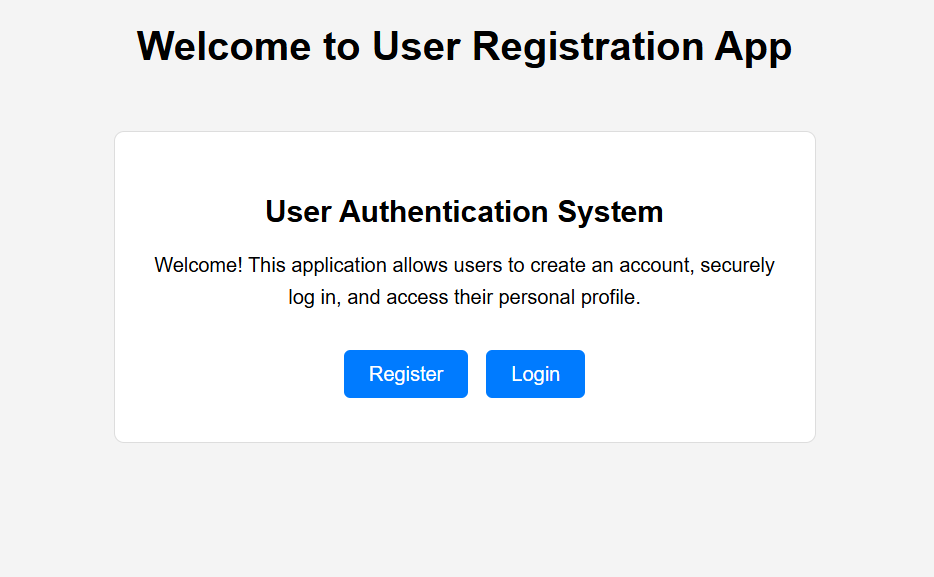
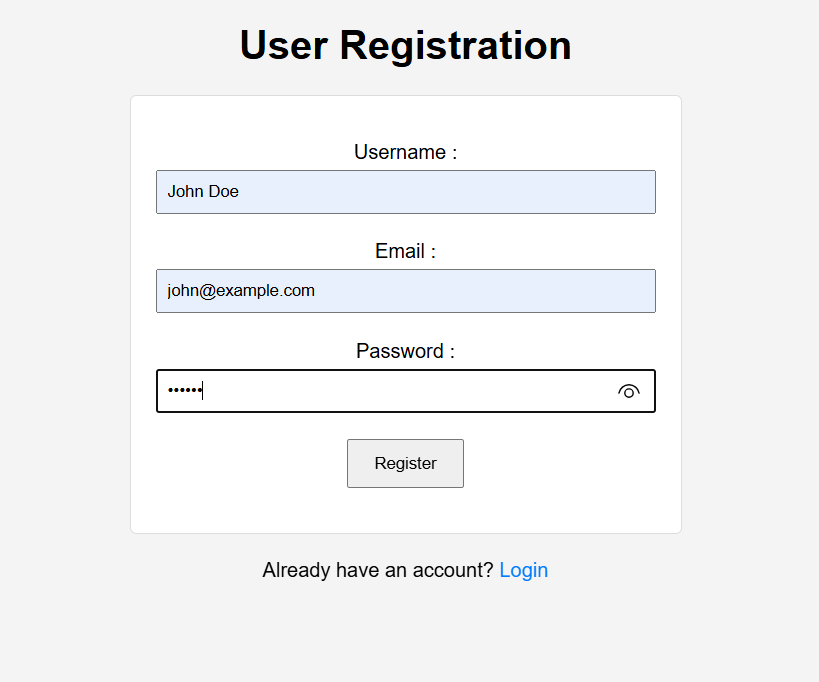
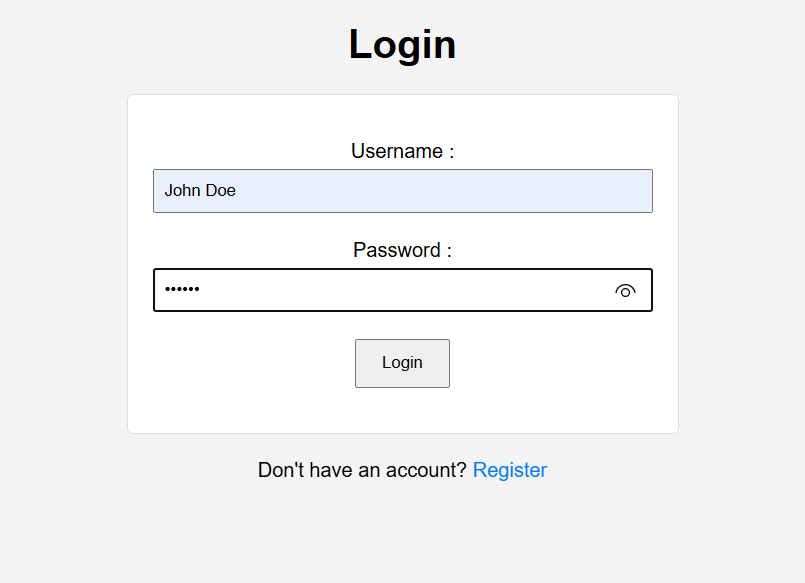
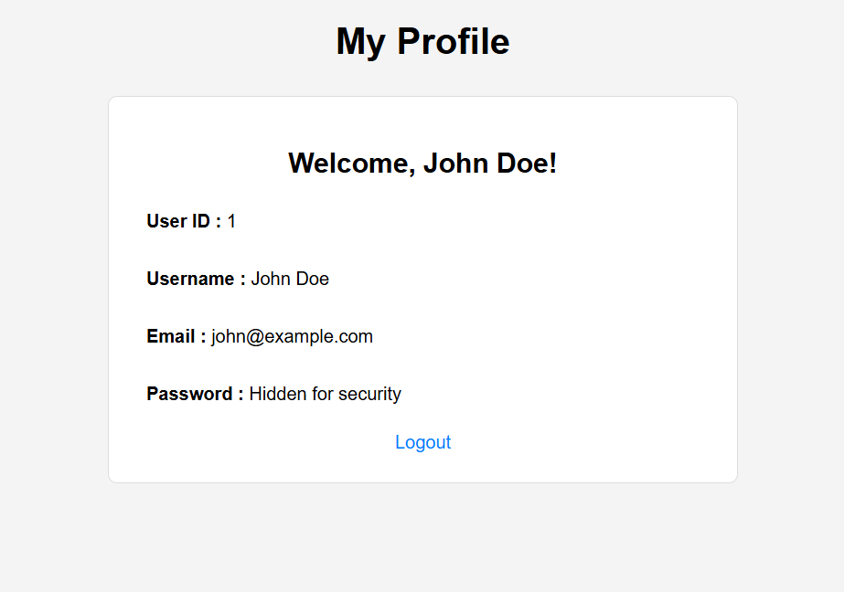

# 🔐 Day 39 - User Registration App

Welcome to **Day 39** of my **100 Days, 100 Python Projects** challenge!

This project is a **user registration and authentication web application built using Python and Flask**. It demonstrates important concepts such as **user registration, login authentication, password hashing, SQLite database integration, SQLAlchemy ORM, Flask sessions, flash messages, protected routes, and database migrations**.

The application allows users to create an account using a username, email, and password. Passwords are securely hashed before being stored in the database. Registered users can then log in and access a protected profile page. Users can also log out of their accounts.

---

## 📌 Project Overview

The User Registration App provides a simple authentication system where users can:

* 📝 Create a new account
* 👤 Choose a unique username
* 📧 Register using an email address
* 🔐 Create a password
* 🔒 Store passwords using secure hashing
* 🗄️ Store user information in a SQLite database
* 🔑 Log in using username and password
* 👤 Access a protected profile page
* 🚪 Log out of their account
* 🔔 Display success and error messages
* 🛡️ Restrict profile access to authenticated users
* 🔄 Manage database schema using Flask-Migrate
* 🎨 Use HTML and CSS for the user interface

This project introduces the fundamentals of **user authentication, database-backed Flask applications, password security, and session management**.

---

## ✨ Features

* 🌐 Flask Web Application
* 📝 User Registration
* 📧 Email Field
* 👤 Username Authentication
* 🔐 Password Authentication
* 🔒 Password Hashing
* 🗄️ SQLite Database
* 🧩 SQLAlchemy ORM
* 🔄 Flask-Migrate
* 🔑 Login System
* 👤 Protected User Profile
* 🚪 Logout Functionality
* 🔔 Flask Flash Messages
* ⚠️ Form Validation
* 🚫 Duplicate Username/Email Protection
* 🛡️ Session-Based Authentication
* 🎨 CSS Styling
* 🐍 Python Backend
* 🛠️ Flask Debug Mode

---

## 🖼️ Application Preview

The application contains four main pages:

### 🏠 Home Page



### 📝 Registration Page



### 🔑 Login Page



### 👤 User Profile



---

## 🛠️ Technologies Used

* **Python 3**
* **Flask**
* **Flask-SQLAlchemy**
* **Flask-Migrate**
* **SQLAlchemy**
* **SQLite**
* **Werkzeug**
* **HTML5**
* **CSS3**
* **Jinja2**

### Python

Python is used for the backend application logic, authentication, database operations, session management, and password handling.

### Flask

Flask is used to create the web application, define routes, render templates, process requests, and manage sessions.

### Flask-SQLAlchemy

Flask-SQLAlchemy integrates SQLAlchemy with Flask and provides an easier way to work with the database using Python classes and objects.

### Flask-Migrate

Flask-Migrate is used to manage database schema changes through migration files.

### SQLite

SQLite is used as the local relational database for storing user information.

### Werkzeug

Werkzeug provides the password hashing functions used to securely hash and verify passwords.

### Jinja2

Jinja2 is used to dynamically display information from Python inside HTML templates.

---

## 📦 Installation

First, make sure Python is installed.

Check your Python version:

```bash
python --version
```

Install Flask:

```bash
pip install flask
```

Install Flask-SQLAlchemy:

```bash
pip install flask-sqlalchemy
```

Install Flask-Migrate:

```bash
pip install flask-migrate
```

You can also install all required packages together:

```bash
pip install flask flask-sqlalchemy flask-migrate
```

---

## 📂 Project Structure

```text
DAY_39/
│
├── main39.py
├── README.md
├── users.db
│
├── migrations/
│   ├── versions/
│   ├── README
│   ├── alembic.ini
│   ├── env.py
│   └── script.py.mako
│
├── templates/
│   ├── home.html
│   ├── register.html
│   ├── login.html
│   └── profile.html
│
├── static/
│   └── css/
│       └── style.css
│
└── screenshots/
    ├── home.png
    ├── register.png
    ├── login.png
    └── profile.png
```

### File Description

| File / Folder   | Purpose                                         |
| --------------- | ----------------------------------------------- |
| `main39.py`     | Main Flask application                          |
| `users.db`      | SQLite database containing user records         |
| `migrations/`   | Contains Flask-Migrate database migration files |
| `templates/`    | Contains HTML templates                         |
| `home.html`     | Home page                                       |
| `register.html` | User registration page                          |
| `login.html`    | Login page                                      |
| `profile.html`  | Protected user profile page                     |
| `static/`       | Contains static resources                       |
| `css/`          | Contains CSS files                              |
| `style.css`     | Styles the application                          |
| `screenshots/`  | Contains application screenshots                |
| `README.md`     | Project documentation                           |

> `users.db` is generated by the application when the database is created. The `migrations/` directory is used to track database schema changes.

---

## 🗄️ Database Model

The application uses a `User` model:

```python
class User(db.Model):
    id = db.Column(db.Integer, primary_key=True)
    username = db.Column(db.String(80), unique=True, nullable=False)
    email = db.Column(db.String(120), unique=True, nullable=False)
    password = db.Column(db.String(128), nullable=False)
```

The database contains four main columns:

| Column     | Type    | Description          |
| ---------- | ------- | -------------------- |
| `id`       | Integer | Unique user ID       |
| `username` | String  | Unique username      |
| `email`    | String  | Unique email address |
| `password` | String  | Hashed password      |

The `id` column is the primary key.

Both `username` and `email` are configured as unique:

```python
unique=True
```

This prevents multiple users from registering with the same username or email address.

---

## 🔐 Password Security

The application **does not store plain-text passwords**.

Instead, passwords are hashed using Werkzeug:

```python
hashed_password = generate_password_hash(password)
```

The hashed password is then stored in the database:

```python
new_user = User(
    username=username,
    email=email,
    password=hashed_password
)
```

When the user logs in, the entered password is verified against the stored hash:

```python
check_password_hash(user.password, password)
```

The application therefore follows the basic flow:

```text
User Password
     │
     ▼
Password Hashing
     │
     ▼
Hashed Password
     │
     ▼
SQLite Database
```

During login:

```text
Entered Password
       │
       ▼
Password Verification
       │
       ▼
Stored Password Hash
       │
   ┌───┴───┐
   │       │
 Match   No Match
   │       │
   ▼       ▼
Login    Error
```

> Password hashing is an important security practice because passwords should not be stored as plain text.

---

## 📝 User Registration

The registration page is available at:

```text
/register
```

The user provides:

* Username
* Email
* Password

The application retrieves the submitted form data:

```python
username = request.form['username'].strip()
email = request.form['email'].strip()
password = request.form['password']
```

It first checks whether all fields contain data:

```python
if not username or not email or not password:
    flash('All fields are required!', 'error')
```

If the fields are valid, the password is hashed and a new `User` object is created.

```python
hashed_password = generate_password_hash(password)

new_user = User(
    username=username,
    email=email,
    password=hashed_password
)
```

The new user is then added to the database:

```python
db.session.add(new_user)
db.session.commit()
```

After successful registration, the user is redirected to the login page.

---

## 🚫 Duplicate User Protection

The username and email fields are configured as unique:

```python
username = db.Column(
    db.String(80),
    unique=True,
    nullable=False
)

email = db.Column(
    db.String(120),
    unique=True,
    nullable=False
)
```

If a user attempts to register with an existing username or email, the database raises an `IntegrityError`.

The application handles this using:

```python
except IntegrityError:
    db.session.rollback()
    flash(
        'Username or Email already exists!',
        'error'
    )
```

The database transaction is rolled back so that the failed operation does not leave the session in an invalid state.

---

## 🔑 Login System

The login page is available at:

```text
/login
```

The user enters:

* Username
* Password

The application searches for the user:

```python
user = User.query.filter_by(
    username=username
).first()
```

If the user exists, the application verifies the password:

```python
if user and check_password_hash(
    user.password,
    password
):
```

If the credentials are correct, the application creates a session:

```python
session['user_id'] = user.id
session['username'] = user.username
```

The user is then redirected to the profile page.

---

## ❌ Invalid Login

If the username does not exist or the password is incorrect, the application displays:

```text
Invalid username or password.
```

The message is generated using:

```python
flash(
    'Invalid username or password.',
    'error'
)
```

This avoids revealing whether a particular username exists.

---

## 👤 User Profile

The profile page is available at:

```text
/profile
```

However, the profile is a **protected route**.

Before displaying the profile, the application checks whether the user is logged in:

```python
if 'user_id' not in session:
    flash(
        'Please login to access your profile.',
        'error'
    )
    return redirect(url_for('login'))
```

This prevents unauthenticated users from directly accessing the profile page.

---

## 🛡️ Protected Route Flow

The profile authentication process works like this:

```text
User Visits /profile
        │
        ▼
Check Session
        │
   ┌────┴────┐
   │         │
Logged In  Not Logged In
   │         │
   ▼         ▼
Find User  Redirect
   │        to Login
   ▼
Display Profile
```

The user is retrieved from the database using:

```python
user = db.session.get(
    User,
    session['user_id']
)
```

The profile then displays:

* User ID
* Username
* Email
* Password status

The actual password is never displayed.

Instead, the page shows:

```text
Password: Hidden for security
```

---

## 🚪 Logout

The logout route is:

```text
/logout
```

The application removes the session information:

```python
session.clear()
```

A success message is then displayed:

```python
flash(
    'You have been logged out.',
    'success'
)
```

Finally, the user is redirected to the login page.

---

## 🍪 Flask Sessions

The application uses Flask's `session` object to remember the logged-in user.

When login succeeds:

```python
session['user_id'] = user.id
session['username'] = user.username
```

This allows the application to identify the currently authenticated user when they visit protected pages.

When the user logs out:

```python
session.clear()
```

all session data is removed.

The application uses a secret key:

```python
app.secret_key = 'your_secret_key'
```

The secret key is required by Flask for securely signing session data and supporting features such as flash messages.

> ⚠️ In a real application, the secret key should be stored securely using an environment variable rather than being hard-coded in the source code.

---

## 🔄 Complete Authentication Flow

The complete application flow is:

```text
                  Home Page
                 /        \
                ▼          ▼
          Register       Login
              │             │
              ▼             ▼
        Create Account   Verify User
              │             │
              ▼             ▼
        Hash Password    Check Password
              │             │
              ▼             ▼
        Save to Database   Session
              │             │
              ▼             ▼
             Login       Profile
                            │
                            ▼
                          Logout
```

---

## 🗄️ Flask-SQLAlchemy

The application uses Flask-SQLAlchemy:

```python
db = SQLAlchemy(app)
```

Instead of writing raw SQL queries, the application uses Python classes and SQLAlchemy ORM.

For example, the user model is represented by:

```python
class User(db.Model):
```

A new user can be added using:

```python
db.session.add(new_user)
db.session.commit()
```

A user can be queried using:

```python
User.query.filter_by(
    username=username
).first()
```

This makes database operations easier to manage using Python.

---

## 🔄 Database Migrations

The application uses Flask-Migrate:

```python
migrate = Migrate(app, db)
```

Flask-Migrate is useful when the database model changes during development.

For example, if a new column is added to the `User` model, migrations can be used to update the existing database structure without manually recreating the database.

### Initialize migrations

If migrations have not been initialized:

```bash
flask --app main39 db init
```

### Create a migration

After making changes to the database model:

```bash
flask --app main39 db migrate -m "Update user model"
```

### Apply the migration

```bash
flask --app main39 db upgrade
```

The migration workflow is:

```text
Change Model
     ↓
flask db migrate
     ↓
Migration File
     ↓
flask db upgrade
     ↓
Updated Database
```

> The `migrations/` folder should generally be committed to GitHub because it contains the database schema migration history. However, local database files such as `users.db` are commonly excluded from Git when they contain local development data.

---

## 🎨 CSS Styling

The project uses:

```text
static/css/style.css
```

The stylesheet provides styling for:

* Body
* Registration form
* Login form
* Profile container
* Home page container
* Buttons
* Links
* Success messages
* Error messages
* Input fields

The CSS file is loaded using:

```html
<link
    rel="stylesheet"
    href="{{ url_for('static', filename='css/style.css') }}"
>
```

Flask automatically serves files stored inside the `static` directory.

---

## 🔔 Flask Flash Messages

The application uses Flask flash messages to provide feedback to users.

Examples include:

### Successful Registration

```text
Registration successful! Please login.
```

### Successful Login

```text
Login successful!
```

### Invalid Login

```text
Invalid username or password.
```

### Duplicate Account

```text
Username or Email already exists!
```

### Successful Logout

```text
You have been logged out.
```

### Unauthorized Profile Access

```text
Please login to access your profile.
```

Messages are displayed in the HTML templates using:

```html

```

---

## 🧩 Flask Components

| Component                  | Purpose                             |
| -------------------------- | ----------------------------------- |
| `Flask()`                  | Creates the Flask application       |
| `render_template()`        | Renders HTML templates              |
| `request`                  | Retrieves submitted form data       |
| `flash()`                  | Displays temporary messages         |
| `redirect()`               | Redirects users to another route    |
| `url_for()`                | Generates route URLs                |
| `session`                  | Stores login session information    |
| `SQLAlchemy()`             | Connects Flask to SQLAlchemy        |
| `Migrate()`                | Enables database migrations         |
| `db.Model`                 | Defines database models             |
| `db.Column()`              | Defines database columns            |
| `db.session.add()`         | Adds a database object              |
| `db.session.commit()`      | Saves database changes              |
| `db.session.rollback()`    | Rolls back a failed transaction     |
| `User.query.filter_by()`   | Searches for users                  |
| `generate_password_hash()` | Creates a secure password hash      |
| `check_password_hash()`    | Verifies a password                 |
| `IntegrityError`           | Handles database uniqueness errors  |
| `app.run()`                | Starts the Flask development server |

---

## ▶️ How to Run

### 1. Open the project folder

Open the terminal inside the `DAY_39` folder.

### 2. Install the dependencies

```bash
pip install flask flask-sqlalchemy flask-migrate
```

### 3. Set up the database

If this is the first time running the project, initialize the migration system:

```bash
flask --app main39 db init
```

Create the initial migration:

```bash
flask --app main39 db migrate -m "Initial migration"
```

Apply the migration:

```bash
flask --app main39 db upgrade
```

### 4. Run the application

```bash
python main39.py
```

The application will normally be available at:

```text
http://127.0.0.1:5000/
```

Open the URL in your web browser.

---

## 🧪 Testing the Application

You can test the application using the following workflow.

### Test 1 - Open Home Page

Visit:

```text
/
```

Expected result:

```text
Welcome to User Registration App
```

---

### Test 2 - Register a User

Visit:

```text
/register
```

Enter:

```text
Username: Abhijit
Email: abhijit@example.com
Password: your_password
```

Click:

```text
Register
```

Expected result:

```text
Registration successful! Please login.
```

---

### Test 3 - Login

Visit:

```text
/login
```

Enter the registered username and password.

Expected result:

```text
Login successful!
```

You should be redirected to:

```text
/profile
```

---

### Test 4 - View Profile

The profile page should display:

```text
My Profile

Welcome, Abhijit!

User ID: ...
Username: Abhijit
Email: abhijit@example.com
Password: Hidden for security
```

---

### Test 5 - Logout

Click:

```text
Logout
```

Expected result:

```text
You have been logged out.
```

The application redirects you to the login page.

---

### Test 6 - Try Accessing Profile Without Login

After logging out, manually visit:

```text
/profile
```

Expected result:

```text
Please login to access your profile.
```

You should be redirected to:

```text
/login
```

---

## 📚 Concepts Practiced

* Python Web Development
* Flask
* Flask Routing
* HTML Forms
* HTTP GET and POST Requests
* User Registration
* User Authentication
* Login and Logout
* Session Management
* Protected Routes
* Flask Flash Messages
* Password Hashing
* Password Verification
* Werkzeug Security
* Flask-SQLAlchemy
* SQLAlchemy ORM
* SQLite Database
* Database Models
* Database Queries
* Database Transactions
* Integrity Errors
* Flask-Migrate
* Database Migrations
* Jinja2 Templates
* Static CSS Files
* Client-Server Architecture
* Authentication Flow
* Basic Web Security
* Debug Mode

---

## 🎯 Learning Outcome

This project helped me understand:

* How to create a user registration system using Flask
* How to create login and logout functionality
* How to store users in a SQLite database
* How Flask-SQLAlchemy works
* How SQLAlchemy ORM works with Python classes
* How to create database models
* How to query users from a database
* How to handle database transactions
* How to handle duplicate usernames and emails
* How to use `IntegrityError`
* How to hash passwords securely
* How to verify hashed passwords during login
* How Flask sessions work
* How to create protected routes
* How to restrict profile access to authenticated users
* How to use Flask flash messages
* How Flask-Migrate manages database schema changes
* How to create and apply database migrations
* How to organize Flask templates and static files
* How to build a basic authentication workflow
* How Python can be used to build database-backed web applications
* How basic authentication and security concepts work

---

## 🔐 Security Considerations

This project demonstrates several basic security practices:

### Password Hashing

Passwords are stored as hashes instead of plain text:

```python
generate_password_hash(password)
```

### Password Verification

Passwords are verified using:

```python
check_password_hash()
```

### Protected Profile

The profile route checks whether the user is authenticated before displaying user information.

### Session Management

The user ID is stored in the Flask session after successful authentication.

### Unique Constraints

The database prevents duplicate usernames and email addresses.

### Secret Key

Flask uses a secret key to protect session-related data.

> For a production application, additional protections such as CSRF protection, stronger validation, secure cookies, HTTPS, rate limiting, account recovery, email verification, and proper secret management should be implemented.

---

## 🔮 Future Improvements

Possible enhancements for future versions:

* 🎨 Improve the UI/UX
* 📱 Make the application fully responsive
* 🌙 Add Dark Mode
* 📧 Add email verification
* 🔑 Add password reset functionality
* 🔒 Add stronger password requirements
* 🛡️ Add CSRF protection to forms
* 🚫 Add login rate limiting
* 👤 Add user profile editing
* 🖼️ Add profile pictures
* 📅 Add account creation timestamps
* 🗄️ Add additional user fields
* 👑 Add user roles such as Admin and User
* 📊 Create an admin dashboard
* 🗑️ Add account deletion
* ✏️ Allow users to update their information
* 📧 Send login notifications
* 🔐 Store secrets using environment variables
* 🛡️ Use secure session cookie configuration
* 🚀 Deploy the application online
* 🧪 Add automated tests
* 🔌 Create REST APIs
* 📱 Create a mobile-friendly interface

---

## 📅 Challenge

This project is part of my **100 Days, 100 Python Projects** challenge, where I build one Python project every day to improve my Python programming skills, strengthen my problem-solving abilities, learn new technologies, and develop consistency through daily coding.

---

## 👨‍💻 Author

**Abhijit Munghate**

Happy Coding! 🚀
