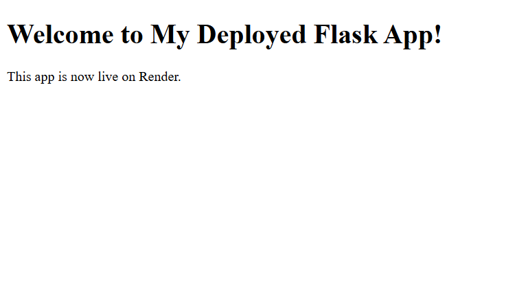

# 🚀 Day 41 - Deploy Flask App

Welcome to **Day 41** of my **100 Days, 100 Python Projects** challenge!

This project is a simple **Flask web application** created using Python. The application displays a welcome message through a web page and is configured for deployment using **Gunicorn**.

Initially, this project was planned for deployment on **Heroku**. Since Heroku no longer provides the free deployment option I was looking for, I switched to **Render** to deploy the Flask application.

---

## 📌 Project Overview

The application is a beginner-friendly Flask web app that demonstrates how to:

* 🌐 Create a web application using Flask
* 🏠 Create a home route
* 📄 Render an HTML template
* 🖥️ Run a Flask application locally
* ⚙️ Configure Gunicorn as a production web server
* 🚀 Deploy a Flask application on Render

The main purpose of this project is to understand the basic workflow of taking a Python Flask application from local development to a **live web application**.

---

## ✨ Features

* 🌐 Flask-based web application
* 🏠 Home page route
* 📄 HTML template using `index.html`
* 🖥️ Simple and clean webpage
* ⚙️ Gunicorn production server
* 📦 Dependency management using `requirements.txt`
* 🚀 Deployment-ready configuration
* ☁️ Deployment on Render
* 📱 Basic responsive HTML layout

---

## 🖼️ Application Preview

Here is a preview of the deployed Flask application:



> `screenshot.png` will be added after the application is successfully deployed on Render.

---

## 🌐 Live Demo

The application will be available online after deployment.

**Live Website:**
`https://your-render-app-url.onrender.com`

> Replace the URL above with your actual Render deployment URL after deployment.

---

## 🛠️ Technologies Used

* **Python 3**
* **Flask**
* **HTML5**
* **Gunicorn**
* **Render**

### Flask

Flask is a lightweight Python web framework used to build web applications and APIs.

### Gunicorn

Gunicorn is a Python WSGI HTTP server commonly used to run Flask applications in production environments.

### Render

Render is a cloud platform that can be used to deploy and host web applications.

---

## 📂 Project Structure

```text
DAY_41/

│── main41.py
│
├── templates/
│   └── index.html
│
│── Procfile
│── requirements.txt
│── screenshot.png
└── README.md
```

### File Description

| File               | Purpose                                                 |
| ------------------ | ------------------------------------------------------- |
| `main41.py`        | Contains the Flask application and routes               |
| `templates/`       | Contains HTML templates                                 |
| `index.html`       | HTML page displayed by the Flask application            |
| `Procfile`         | Tells the hosting platform how to start the application |
| `requirements.txt` | Contains the required Python dependencies               |
| `screenshot.png`   | Screenshot of the deployed application                  |
| `README.md`        | Project documentation                                   |

---

## 💻 Flask Application

The Flask application creates a single route:

```python
@app.route('/')
def home():
    return render_template('index.html')
```

When a user visits the root URL `/`, Flask renders the `index.html` template.

The application is started locally using:

```python
if __name__ == "__main__":
    app.run(debug=True)
```

---

## 📄 HTML Page

The `index.html` file contains the webpage displayed to the user.

The page includes:

```text
Welcome to My Deployed Flask App!

This app is now live on Render.
```

It also uses the viewport meta tag to provide basic mobile responsiveness.

---

## ⚙️ Procfile

The project contains a `Procfile` for deployment:

```text
web: gunicorn main41:app
```

This tells the deployment platform to start the Flask application using **Gunicorn**.

Here:

* `main41` → Python file containing the Flask application
* `app` → Flask application object
* `gunicorn` → Production WSGI server

---

## 📦 requirements.txt

The project dependencies are listed in `requirements.txt`:

```text
Flask
gunicorn
```

These packages are installed by the deployment platform before starting the application.

---

## ▶️ How to Run Locally

### 1. Make sure Python is installed

Check your Python version:

```bash
python --version
```

### 2. Open the project folder

Open the terminal inside the `DAY_41` folder.

### 3. Install the required packages

```bash
pip install -r requirements.txt
```

### 4. Run the Flask application

```bash
python main41.py
```

The Flask development server will start.

Open the URL shown in the terminal, usually:

```text
http://127.0.0.1:5000/
```

The Flask webpage should now be displayed in your browser.

---

## 🚀 Deployment

### Initial Plan: Heroku

Initially, this project was created with the goal of deploying the Flask application on **Heroku**.

However, Heroku's current pricing and free-tier availability did not fit the requirements of this project, so I decided to use **Render** instead.

### Final Deployment Platform: Render

The Flask application is configured to be deployed on **Render**.

The deployment process involves:

1. 📁 Creating the Flask project
2. 📦 Adding `requirements.txt`
3. ⚙️ Creating the `Procfile`
4. 📤 Pushing the project to GitHub
5. 🌐 Creating a Web Service on Render
6. 🔗 Connecting the GitHub repository
7. 🚀 Deploying the application
8. 🖼️ Adding a screenshot of the live application

---

## 🔄 Deployment Workflow

```text
Python Flask Application
          ↓
       GitHub
          ↓
        Render
          ↓
       Gunicorn
          ↓
   Live Web Application
```

---

## 🧩 Flask Components Used

| Component           | Purpose                              |
| ------------------- | ------------------------------------ |
| `Flask()`           | Creates the Flask application        |
| `@app.route('/')`   | Defines the home page route          |
| `render_template()` | Loads the HTML template              |
| `app.run()`         | Runs the application locally         |
| `Gunicorn`          | Runs the application in production   |
| `Procfile`          | Defines the production start command |

---

## 📚 Concepts Practiced

* Python Web Development
* Flask
* Flask Routing
* HTML Templates
* `render_template()`
* HTTP Routes
* Web Servers
* WSGI
* Gunicorn
* `requirements.txt`
* Procfile
* GitHub Deployment Workflow
* Cloud Deployment
* Render
* Production Deployment

---

## 🎯 Learning Outcome

This project helped me understand:

* How to create a basic Flask web application
* How Flask routes work
* How Python interacts with HTML templates
* How to organize a deployment-ready Flask project
* Why `requirements.txt` is important for deployment
* How a `Procfile` is used to start a web application
* What Gunicorn does in a production environment
* How Flask applications can be deployed to cloud platforms
* How to move a project from local development to a live website
* The basic workflow of deploying a Python application using GitHub and Render

---

## 🔮 Future Improvements

Possible enhancements for future versions:

* 🎨 Improve the webpage design with CSS
* 🌙 Add Dark Mode
* 📄 Add multiple Flask pages
* 🧭 Add navigation
* 📱 Improve mobile responsiveness
* 📝 Add a contact form
* 🔐 Add authentication
* 🗄️ Connect a database
* 🌦️ Add an API
* 🎨 Create a modern UI
* 📊 Add dynamic content
* 🔒 Configure production security settings
* 🌐 Add a custom domain
* 🚀 Add more advanced deployment features

---

## 📅 Challenge

This project is part of my **100 Days, 100 Python Projects** challenge, where I build one Python project every day to improve my Python programming skills, strengthen my problem-solving abilities, learn new technologies, and maintain consistency through daily coding.

Day 41 focuses on taking Python beyond the local environment by learning the basics of **Flask application deployment**.

---

## 👨‍💻 Author

**Abhijit Munghate**

Happy Coding! 🚀🐍
