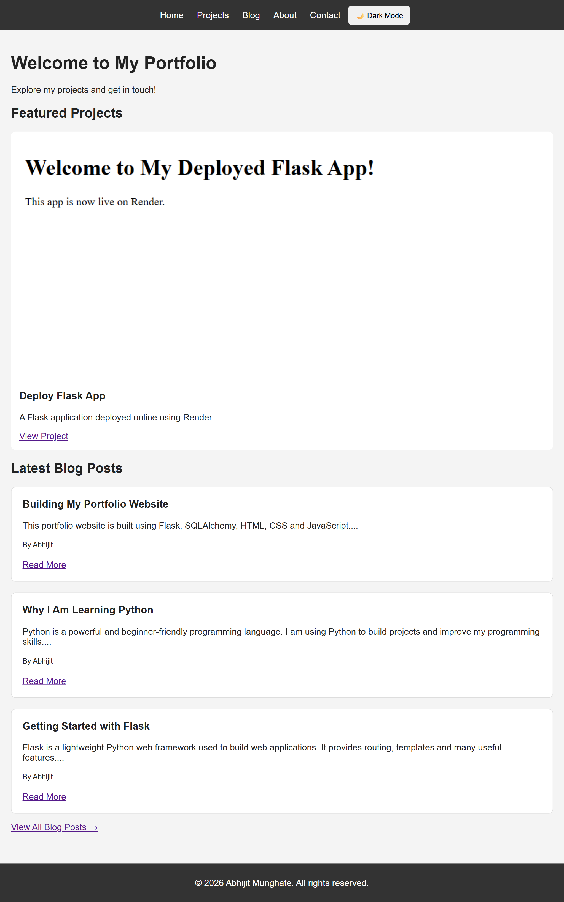
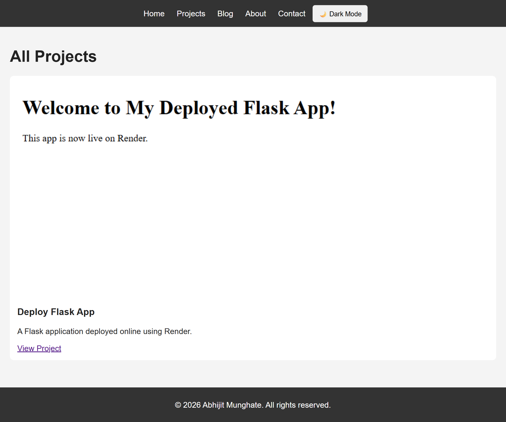
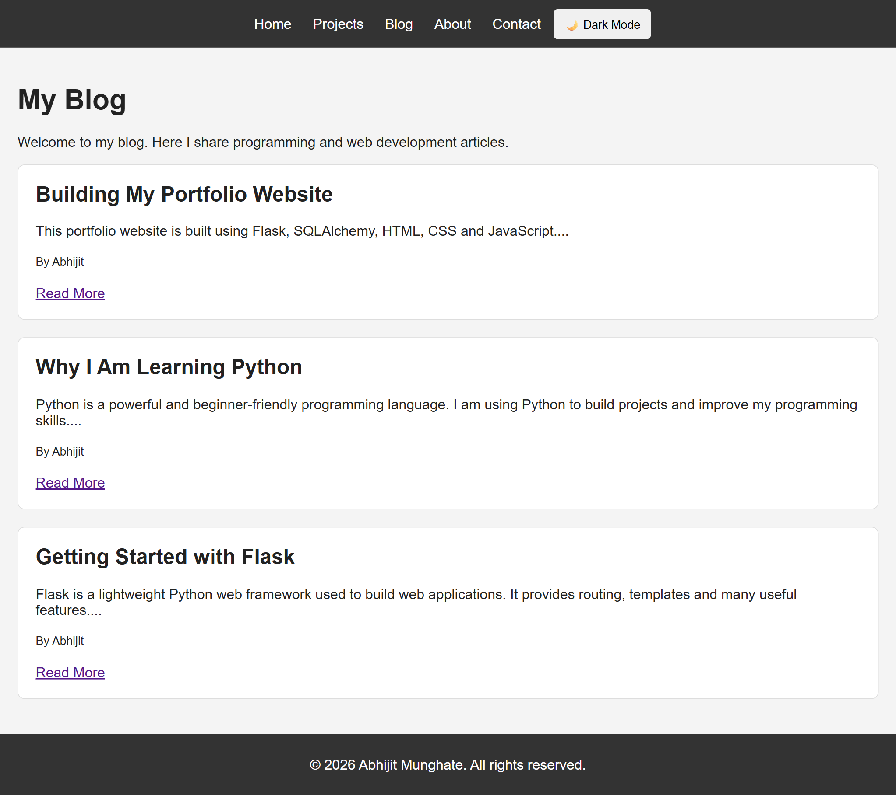
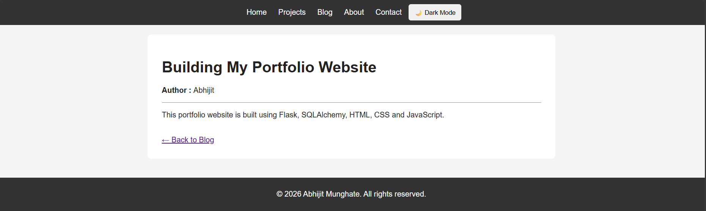
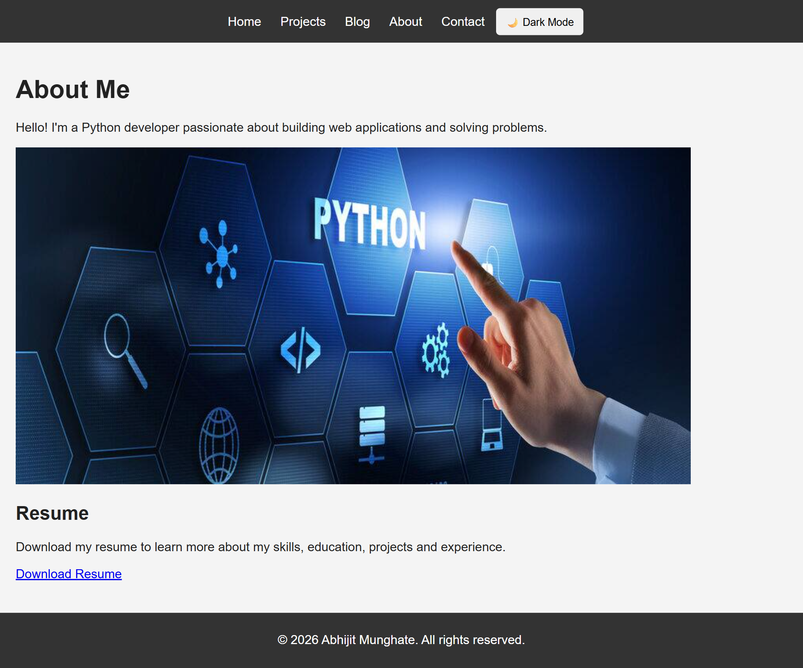
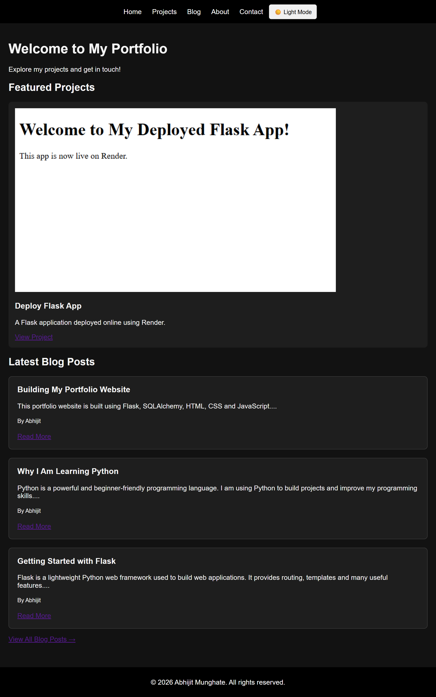

# 🚀 Day 42 - Portfolio Website

Welcome to **Day 42** of my **100 Days, 100 Python Projects** challenge!

This project is a dynamic **personal portfolio website** built using **Python, Flask, and Flask-SQLAlchemy**. The website showcases projects, provides an About page with a downloadable resume, includes a contact form, and contains a complete blog section.

The project also includes **Dark Mode**, database integration, flash messages, and a responsive web layout.

---

## 📌 Project Overview

This project is a full-featured portfolio website designed to showcase my skills, projects, and experience while also demonstrating my understanding of Flask web development and databases.

The website allows visitors to:

* 🏠 View the portfolio homepage
* 📁 Explore projects
* 👤 Learn more about me
* 📄 Download my resume
* 📝 Read blog posts
* 📖 Open individual blog posts
* 📬 Send messages through the contact form
* 🌙 Switch between Light Mode and Dark Mode
* 💾 Store projects, blog posts, and contact messages using SQLite

This project helped me move from building simple Flask applications to creating a more **dynamic, database-driven web application**.

---

## ✨ Features

* 🌐 Flask-based portfolio website
* 🏠 Home page with featured projects and latest blog posts
* 📁 Dedicated Projects page
* 👤 About Me page
* 📄 Downloadable resume
* 📝 Blog section
* 📖 Individual blog post pages
* 📬 Contact form
* 💾 SQLite database integration
* 🗃️ Flask-SQLAlchemy ORM
* ⚠️ Form validation
* ✅ Flash success and error messages
* 🌙 Dark Mode
* 💡 Light/Dark theme persistence using `localStorage`
* 📱 Basic responsive layout
* 🖼️ Project images and profile picture
* 🔗 External project links
* 🚀 Deployment-ready using Gunicorn
* ☁️ Ready for deployment on Render

---

## 🖼️ Application Preview

The portfolio website contains multiple pages and features.

## 📸 Screenshots

### 🏠 Home Page



### 📁 Projects Page



### 📝 Blog



### 📖 Blog Post



### 👤 About & Resume



### 🌙 Dark Mode



---

## 🌐 Live Demo

The application will be available online after deployment.

**Live Website:**

`https://one00-days-100-python-projects.onrender.com`

> Replace the URL above with your actual Render deployment URL after deployment.

---

## 🛠️ Technologies Used

* **Python 3**
* **Flask**
* **Flask-SQLAlchemy**
* **SQLite**
* **HTML5**
* **CSS3**
* **JavaScript**
* **Gunicorn**
* **Render**

### Flask

Flask is a lightweight Python web framework used to build the backend and handle routing, requests, templates, and application logic.

### Flask-SQLAlchemy

Flask-SQLAlchemy is used to integrate SQLAlchemy with Flask and provides an easy way to work with the SQLite database using Python classes and objects.

### SQLite

SQLite is used as the database for storing:

* Projects
* Contact messages
* Blog posts

### JavaScript

JavaScript is used to implement the Light/Dark Mode functionality and save the selected theme using browser `localStorage`.

---

## 📂 Project Structure

```text
DAY_42/

│── main42.py
│── requirements.txt
│── Procfile
│
├── templates/
│   ├── base.html
│   ├── index.html
│   ├── projects.html
│   ├── about.html
│   ├── contact.html
│   ├── blog.html
│   └── blog_post.html
│
├── static/
│   ├── css/
│   │   └── style.css
│   │
│   ├── js/
│   │   └── script.js
│   │
│   ├── images/
│   │   ├── profile.jpg
│   │   └── project images
│   │
│   └── resume.pdf
│
├── screenshots/
│   ├── home.png
│   ├── projects.png
│   ├── blog.png
│   ├── blog-post.png
│   ├── about.png
│   └── dark-mode.png
│
└── README.md
```

---

## 🗃️ Database Models

The application uses **three SQLAlchemy models**.

### 📁 Project

The `Project` model stores information about portfolio projects.

```text
Project
├── id
├── title
├── description
├── image
└── link
```

It is used to dynamically display projects on the Home and Projects pages.

---

### 📬 ContactMessage

The `ContactMessage` model stores messages submitted through the contact form.

```text
ContactMessage
├── id
├── name
├── email
└── message
```

When a visitor submits the contact form successfully, the information is saved in the SQLite database.

---

### 📝 BlogPost

The `BlogPost` model stores blog articles.

```text
BlogPost
├── id
├── title
├── content
└── author
```

Blog posts are displayed dynamically on the Blog page and individual posts can be accessed using their unique IDs.

---

## 🔗 Website Routes

The Flask application contains several routes:

| Route             | Purpose                          |
| ----------------- | -------------------------------- |
| `/`               | Portfolio home page              |
| `/projects`       | Displays all projects            |
| `/about`          | About Me and resume              |
| `/contact`        | Contact form                     |
| `/blog`           | Displays all blog posts          |
| `/blog/<post_id>` | Displays an individual blog post |

---

## 🏠 Home Page

The Home page displays:

* Welcome message
* Featured projects
* Project images
* Project descriptions
* Links to projects
* Latest three blog posts
* Blog post previews
* Links to individual blog posts
* Link to view all blog posts

The latest three blog posts are retrieved using:

```python
posts = BlogPost.query.order_by(BlogPost.id.desc()).limit(3).all()
```

---

## 📁 Projects Page

The Projects page retrieves all projects from the database and displays them dynamically.

Each project contains:

* Project image
* Project title
* Project description
* External project link

This means new projects can be added to the database without manually changing the HTML structure.

---

## 👤 About Page

The About page contains:

* Personal introduction
* Profile picture
* Resume information
* Download Resume button

The resume is served from the Flask `static` folder.

---

## 📬 Contact Form

The Contact page provides a form where visitors can submit:

* Name
* Email
* Message

The application checks whether all fields have been filled.

If any field is empty, an error message is displayed:

```text
All fields are required!
```

If the form is submitted successfully, the message is stored in the database and the user receives:

```text
Your message has been sent successfully!
```

The application uses Flask's `flash()` functionality to display these messages.

---

## 📝 Blog System

The website includes a complete basic blog system.

The Blog page displays all available posts, including:

* Blog title
* Content preview
* Author
* Read More link

Clicking **Read More** opens the individual blog post.

The individual blog post page displays:

* Full title
* Author
* Complete content
* Back to Blog link

---

## 🌙 Dark Mode

The website includes a Light/Dark Mode toggle.

The theme can be changed using the:

**🌙 Dark Mode**

button in the navigation bar.

When Dark Mode is enabled:

* The background changes to a dark theme
* Text colors are adjusted
* Cards use dark backgrounds
* Forms use dark styling
* Header and footer become darker

The selected theme is stored using browser `localStorage`, so the user's preference remains available when they revisit the website.

---

## 🧩 Flask Components Used

| Component           | Purpose                           |
| ------------------- | --------------------------------- |
| `Flask()`           | Creates the Flask application     |
| `render_template()` | Renders HTML templates            |
| `request`           | Handles submitted form data       |
| `redirect()`        | Redirects users to another route  |
| `url_for()`         | Generates Flask URLs              |
| `flash()`           | Displays temporary messages       |
| `SQLAlchemy()`      | Provides database integration     |
| `db.Model`          | Defines database models           |
| `db.session`        | Adds and commits database records |
| `get_or_404()`      | Handles missing blog posts        |
| `app.route()`       | Defines application routes        |

---

## 📦 requirements.txt

The project uses the following Python packages:

```text
Flask
Flask-SQLAlchemy
gunicorn
```

Install them using:

```bash
pip install -r requirements.txt
```

---

## ⚙️ Procfile

The project contains a `Procfile` for production deployment:

```text
web: gunicorn main42:app
```

This tells the hosting platform to run the Flask application using Gunicorn.

Here:

* `main42` → Python file containing the Flask application
* `app` → Flask application object
* `gunicorn` → Production WSGI server

---

## ▶️ How to Run Locally

### 1. Make sure Python is installed

Check your Python version:

```bash
python --version
```

### 2. Open the project folder

Open a terminal inside the `DAY_42` folder.

### 3. Install dependencies

```bash
pip install -r requirements.txt
```

### 4. Run the application

```bash
python main42.py
```

### 5. Open the website

Open the following URL in your browser:

```text
http://127.0.0.1:5000/
```

The portfolio website should now be available locally.

---

## 💾 Database

The application uses SQLite with Flask-SQLAlchemy.

The database is configured using:

```python
app.config['SQLALCHEMY_DATABASE_URI'] = 'sqlite:///portfolio.db'
```

The database tables are automatically created using:

```python
with app.app_context():
    db.create_all()
```

The database contains tables for:

* Projects
* Contact messages
* Blog posts

---

## 🚀 Deployment on Render

This project is prepared for deployment on **Render**.

The deployment setup uses:

```text
GitHub Repository
       ↓
     Render
       ↓
    Gunicorn
       ↓
 Flask Application
```

### Deployment Steps

1. Push the project to GitHub.
2. Create a new **Web Service** on Render.
3. Connect the GitHub repository.
4. Select the appropriate branch.
5. Configure the Python environment.
6. Install dependencies using `requirements.txt`.
7. Use Gunicorn as the start command.
8. Deploy the application.
9. Open the generated Render URL.
10. Add screenshots of the deployed website to this README.

### Start Command

The application can be started in production using:

```bash
gunicorn main42:app
```

---

## 📚 Concepts Practiced

* Python Web Development
* Flask
* Flask Routing
* Jinja2 Templates
* Template Inheritance
* `base.html`
* Dynamic HTML Rendering
* Flask Forms
* HTTP GET and POST Requests
* Form Validation
* Flash Messages
* Flask-SQLAlchemy
* SQLite Database
* Database Models
* CRUD Fundamentals
* Querying Database Records
* Static Files
* CSS
* JavaScript
* Browser `localStorage`
* Dark Mode
* Gunicorn
* Web Deployment
* Render

---

## 🎯 Learning Outcome

This project helped me understand:

* How to build a complete Flask portfolio website
* How Flask routes connect different pages
* How to use Jinja2 template inheritance
* How to create reusable layouts using `base.html`
* How to connect Flask with SQLite
* How to create database models using SQLAlchemy
* How to retrieve and display database records dynamically
* How to process HTML forms using Flask
* How to validate user input
* How to use flash messages
* How to create a basic blog system
* How to implement Dark Mode using JavaScript
* How to store user preferences using `localStorage`
* How to prepare a Flask application for production deployment
* How Gunicorn is used to serve a Flask application
* How to deploy a Python Flask project using Render

---

## 🔮 Future Improvements

Possible enhancements for future versions:

* 🔐 Add an admin login system
* 📝 Add an admin dashboard for managing projects and blog posts
* ✏️ Add Create, Read, Update, and Delete functionality for blog posts
* 🗄️ Use PostgreSQL for production
* 📬 Add email notifications for contact messages
* 🔎 Add blog search functionality
* 🏷️ Add blog categories and tags
* 📅 Add publication dates
* ❤️ Add a Like system for blog posts
* 💬 Add comments to blog posts
* 📱 Improve mobile responsiveness
* 🎨 Create a more modern portfolio design
* ✨ Add animations and transitions
* 🔒 Improve application security
* 🌐 Add a custom domain
* 🚀 Add CI/CD deployment

---

## 📅 Challenge

This project is part of my **100 Days, 100 Python Projects** challenge, where I build one Python project every day to improve my Python programming skills, strengthen my problem-solving abilities, learn new technologies, and maintain consistency through daily coding.

**Day 42** focuses on building a complete **database-driven Flask portfolio website** with projects, blogging, contact functionality, Dark Mode, and deployment preparation.

---

## 👨‍💻 Author

**Abhijit Munghate**

Happy Coding! 🚀🐍
