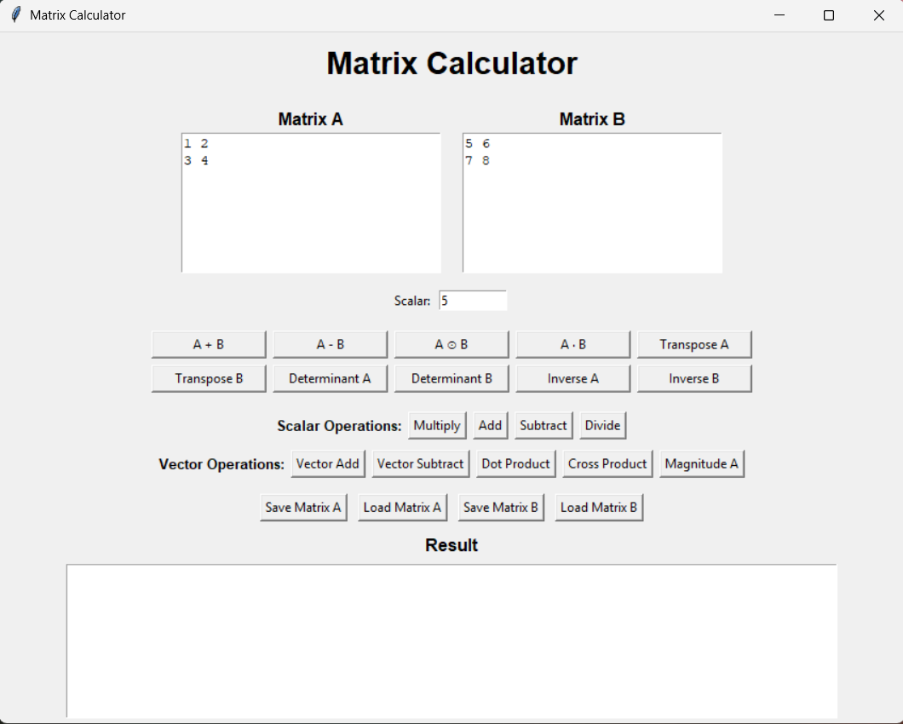
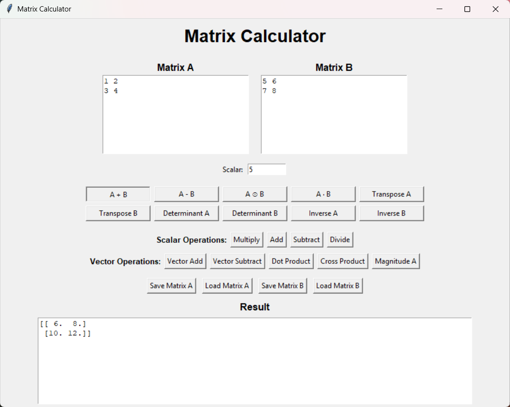
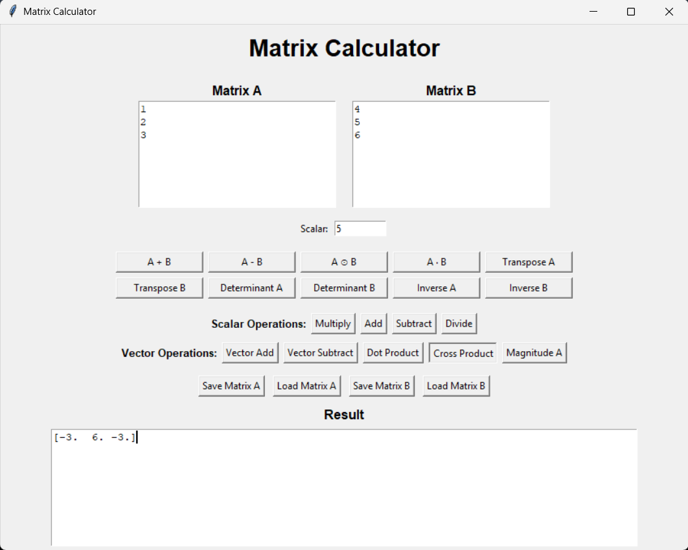

# 🚀 Day 43 - Matrix Calculator

Welcome to **Day 43** of my **100 Days, 100 Python Projects** challenge!

This project is a **Matrix Calculator GUI application** built using **Python, NumPy, and Tkinter**. It provides a graphical interface for performing a wide range of matrix, scalar, and vector operations.

The main goal of this project was to strengthen my understanding of **Data Science fundamentals**, particularly the **NumPy library**, while also practicing GUI development with Tkinter.

---

## 📌 Project Overview

The Matrix Calculator allows users to enter two matrices and perform different mathematical operations through an interactive graphical interface.

The application supports:

* ➕ Matrix addition
* ➖ Matrix subtraction
* ✖️ Element-wise matrix multiplication
* 🔢 Matrix dot product
* 🔄 Matrix transpose
* 📐 Matrix determinant
* 🔁 Matrix inverse
* ✖️ Scalar multiplication
* ➕ Scalar addition
* ➖ Scalar subtraction
* ➗ Scalar division
* ➕ Vector addition
* ➖ Vector subtraction
* 🔢 Vector dot product
* ✖️ Vector cross product
* 📏 Vector magnitude
* 💾 Save matrices as JSON files
* 📂 Load matrices from JSON files
* ⚠️ Input and mathematical error handling

This project demonstrates how **NumPy can be used to perform mathematical and numerical operations efficiently**.

---

## ✨ Features

* 🖥️ Interactive graphical user interface
* 🔢 Support for custom matrix dimensions
* ➕ Matrix addition
* ➖ Matrix subtraction
* ✖️ Element-wise matrix multiplication
* 🔢 Matrix dot product
* 🔄 Matrix transpose
* 📐 Determinant calculation
* 🔁 Matrix inverse
* 🔢 Scalar operations
* 📊 Vector operations
* 📏 Vector magnitude calculation
* 💾 Save matrices as JSON
* 📂 Load matrices from JSON
* ⚠️ Input validation
* 🚨 Error messages using Tkinter message boxes
* 🧮 NumPy-powered calculations
* 📋 Dedicated result display area

---

## 🖼️ Application Screenshots

The project includes screenshots showing the main interface and different operations.

## Screenshots

### 🖥️ Main Interface



### 🧮 Matrix Operations



### 🔢 Scalar and Vector Operations



---

## 🛠️ Technologies Used

* **Python 3**
* **NumPy**
* **Tkinter**
* **JSON**

### Python

Python is used as the primary programming language for implementing the calculator logic and graphical interface.

### NumPy

NumPy is the main library used for numerical and matrix operations.

It provides functions such as:

```python
np.dot()
np.linalg.det()
np.linalg.inv()
np.linalg.norm()
np.cross()
```

### Tkinter

Tkinter is Python's built-in GUI library and is used to create:

* Windows
* Labels
* Text fields
* Buttons
* Message boxes
* File dialogs

### JSON

JSON is used to save and load matrices from files.

---

## 📂 Project Structure

```text
DAY_43/

│── main43.py
│── requirements.txt
│── README.md
│
└── screenshots/
    ├── matrix-calculator-main.png
    ├── matrix-operations.png
    └── scalar-vector-operations.png
```

---

## 📦 requirements.txt

The project requires NumPy.

```text
numpy
```

Install the dependency using:

```bash
pip install -r requirements.txt
```

---

## ▶️ How to Run

### 1. Make sure Python is installed

Check your Python version:

```bash
python --version
```

### 2. Open the project folder

Open a terminal inside the `DAY_43` folder.

### 3. Install the required dependency

```bash
pip install -r requirements.txt
```

### 4. Run the application

```bash
python main43.py
```

The **Matrix Calculator** GUI window will open automatically.

---

## 🧮 Matrix Operations

### ➕ Matrix Addition

Adds corresponding elements of Matrix A and Matrix B.

```text
A + B
```

Both matrices must have the same dimensions.

---

### ➖ Matrix Subtraction

Subtracts corresponding elements of Matrix B from Matrix A.

```text
A - B
```

Both matrices must have the same dimensions.

---

### ✖️ Element-wise Matrix Multiplication

The application performs element-wise multiplication:

```text
A ⊙ B
```

Both matrices must have the same dimensions.

> This is different from standard matrix multiplication. Standard matrix multiplication is available through the `A · B` operation.

---

### 🔢 Matrix Dot Product

Performs standard matrix multiplication using NumPy:

```python
np.dot(A, B)
```

For this operation:

```text
Number of columns in A
        =
Number of rows in B
```

---

### 🔄 Matrix Transpose

The transpose operation converts rows into columns and columns into rows.

```text
A → Aᵀ
```

The application provides separate transpose operations for Matrix A and Matrix B.

---

### 📐 Determinant

The determinant can be calculated for square matrices.

The application uses:

```python
np.linalg.det(A)
```

A matrix must have the same number of rows and columns to calculate its determinant.

---

### 🔁 Matrix Inverse

The application can calculate the inverse of a square matrix using:

```python
np.linalg.inv(A)
```

The matrix must be square and non-singular.

---

## 🔢 Scalar Operations

The calculator also supports operations between a matrix and a scalar value.

Available operations:

* ✖️ Multiply
* ➕ Add
* ➖ Subtract
* ➗ Divide

For example:

```text
Matrix A × Scalar
Matrix A + Scalar
Matrix A - Scalar
Matrix A ÷ Scalar
```

The application also prevents division by zero.

---

## 📊 Vector Operations

Matrices entered as row or column vectors can be used for vector operations.

The application supports:

### ➕ Vector Addition

```text
A + B
```

### ➖ Vector Subtraction

```text
A - B
```

### 🔢 Vector Dot Product

Calculates the dot product of two vectors.

```python
np.dot(A, B)
```

### ✖️ Vector Cross Product

Calculates the cross product of two 3D vectors.

```python
np.cross(A, B)
```

The cross product is supported only for **3-dimensional vectors**.

### 📏 Vector Magnitude

Calculates the magnitude of a vector using:

```python
np.linalg.norm(A)
```

---

## 💾 Save and Load Matrices

The application allows matrices to be stored as JSON files.

### Save Matrix

The matrix is converted into JSON format containing:

```json
{
    "rows": 2,
    "columns": 2,
    "data": [
        [1, 2],
        [3, 4]
    ]
}
```

### Load Matrix

Previously saved JSON matrices can be loaded back into the application using the file dialog.

This makes it possible to reuse matrices without entering them manually again.

---

## ⌨️ Matrix Input Format

Matrices are entered directly into the text boxes.

Each row should be written on a separate line, with values separated by spaces.

### Example

```text
1 2 3
4 5 6
7 8 9
```

This represents:

```text
[ 1  2  3 ]
[ 4  5  6 ]
[ 7  8  9 ]
```

All rows must contain the same number of columns.

---

## ⚠️ Error Handling

The application uses validation and exception handling to prevent invalid operations.

Examples of errors handled include:

* Empty matrix
* Invalid numbers
* Rows with different numbers of columns
* Matrix dimension mismatch
* Invalid matrix multiplication dimensions
* Determinant of a non-square matrix
* Inverse of a non-square matrix
* Division by zero
* Invalid scalar values
* Invalid vector dimensions
* Cross product with non-3D vectors
* Invalid JSON matrix files

Errors are displayed using Tkinter's `messagebox`.

---

## 🧩 NumPy Functions Practiced

This project provided practical experience with several important NumPy functions.

| NumPy Function     | Purpose                                         |
| ------------------ | ----------------------------------------------- |
| `np.array()`       | Creates NumPy arrays                            |
| `np.add()`         | Performs addition                               |
| `np.subtract()`    | Performs subtraction                            |
| `np.dot()`         | Calculates dot products / matrix multiplication |
| `np.cross()`       | Calculates vector cross product                 |
| `np.linalg.det()`  | Calculates matrix determinant                   |
| `np.linalg.inv()`  | Calculates matrix inverse                       |
| `np.linalg.norm()` | Calculates vector magnitude                     |
| `.T`               | Calculates matrix transpose                     |
| `.shape`           | Gets matrix dimensions                          |
| `.flatten()`       | Converts arrays into one-dimensional vectors    |
| `.tolist()`        | Converts NumPy arrays to Python lists           |

---

## 🖥️ GUI Components Used

The application uses several Tkinter components:

| Component    | Purpose                                   |
| ------------ | ----------------------------------------- |
| `Tk()`       | Creates the main application window       |
| `Label`      | Displays headings and text                |
| `Text`       | Accepts matrix input and displays results |
| `Entry`      | Accepts scalar values                     |
| `Button`     | Performs operations                       |
| `Frame`      | Organizes GUI components                  |
| `messagebox` | Displays errors and success messages      |
| `filedialog` | Selects files for saving and loading      |

---

## 📚 Concepts Practiced

* Python Programming
* NumPy
* Numerical Computing
* Data Science Basics
* Matrix Operations
* Vector Operations
* Linear Algebra Basics
* NumPy Arrays
* Array Dimensions
* Array Manipulation
* Tkinter GUI Development
* Event-Driven Programming
* Exception Handling
* Input Validation
* JSON File Handling
* File Dialogs
* Object-Oriented Programming
* Classes and Methods
* Functions
* GUI Layout Management

---

## 🎯 Learning Outcome

This project helped me understand:

* How NumPy arrays work
* How NumPy can be used for numerical computing
* How to perform matrix operations using NumPy
* How to perform vector operations
* How to calculate determinants and matrix inverses
* How matrix dimensions affect mathematical operations
* The difference between element-wise multiplication and matrix multiplication
* How to work with NumPy's linear algebra functions
* How to build a GUI application using Tkinter
* How to connect buttons with Python functions
* How to validate user input
* How to handle errors using exceptions
* How to save structured data using JSON
* How to load previously saved data
* How Data Science libraries such as NumPy can be used in practical applications

---

## 🔮 Future Improvements

Possible enhancements for future versions:

* 🎨 Improve the GUI design
* 🌙 Add Dark Mode
* 📊 Add matrix rank calculation
* 🧮 Add eigenvalues and eigenvectors
* 📐 Add matrix trace
* 🔄 Add matrix power
* 🧠 Add row-reduction / RREF
* 📏 Add vector normalization
* 🔢 Add matrix scalar display formatting
* 📋 Add copy-to-clipboard functionality
* 🧹 Add a Clear button
* ↩️ Add Undo/Redo functionality
* 📜 Add calculation history
* 📁 Support additional matrix file formats
* 🖥️ Improve window responsiveness
* 📱 Create a more modern interface

---

## 📅 Challenge

This project is part of my **100 Days, 100 Python Projects** challenge, where I build one Python project every day to improve my Python programming skills, strengthen my problem-solving abilities, learn new technologies, and maintain consistency through daily coding.

**Day 43** focuses on **Data Science fundamentals with NumPy**, while combining numerical computing with a practical **Tkinter Matrix Calculator** application.

---

## 👨‍💻 Author

**Abhijit Munghate**

Happy Coding! 🚀🐍📊
