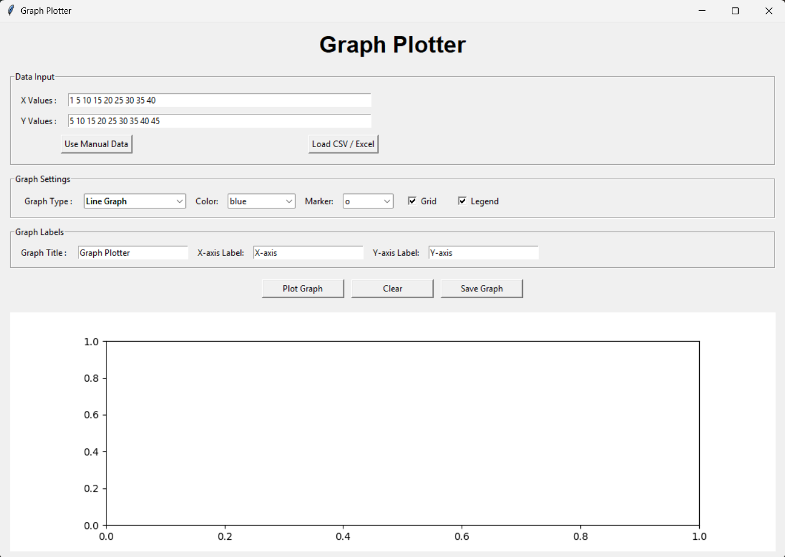
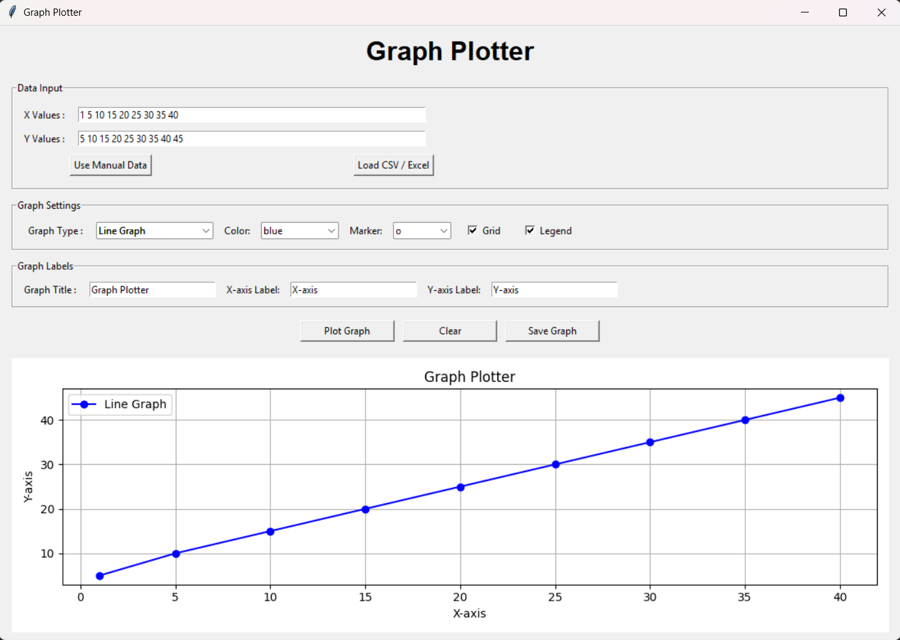
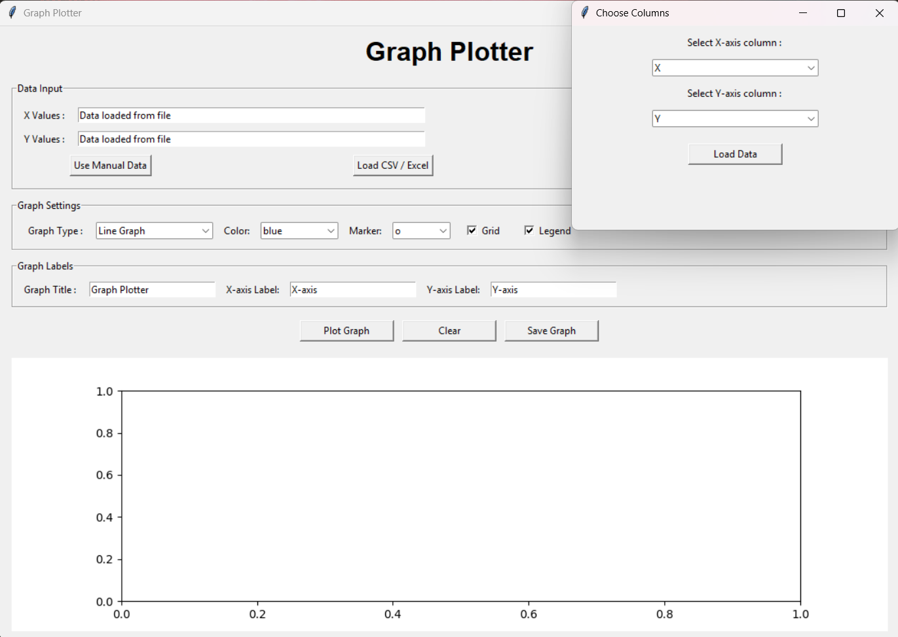
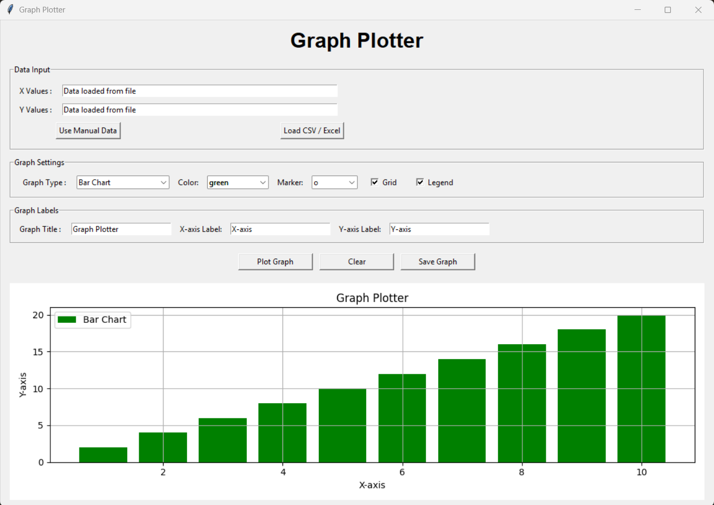

# 🚀 Day 45 - Graph Plotter

Welcome to **Day 45** of my **100 Days, 100 Python Projects** challenge!

This project is a **Graph Plotter GUI application** built using **Python, Tkinter, Matplotlib, and Pandas**. The application allows users to enter data manually or load data from CSV and Excel files, select different types of graphs, customize graph settings, and save the generated graphs.

The main purpose of this project is to gain practical experience with **Data Visualization and Data Science basics**, particularly using the **Matplotlib and Pandas libraries**.

---

## 📌 Project Overview

Data visualization is an important part of Data Science because it helps transform numerical data into meaningful graphical representations.

This project provides an interactive graphical interface where users can:

* ✏️ Enter X and Y values manually
* 📂 Load data from CSV files
* 📊 Load data from Excel files
* 🔀 Select X and Y columns from imported datasets
* 📈 Create different types of graphs
* 🎨 Customize graph colors
* 🔵 Select graph markers
* 📐 Add graph titles and axis labels
* 🔲 Enable or disable grid lines
* 🏷️ Enable or disable legends
* 💾 Save graphs as PNG, JPG, or PDF
* 🧹 Clear the current data and graph

---

## ✨ Features

* 🖥️ Interactive Tkinter GUI
* ✏️ Manual X and Y data input
* 📂 CSV file support
* 📊 Excel file support
* 🔀 X/Y column selection for imported datasets
* 📈 Line Graph
* 📊 Bar Chart
* 🔵 Scatter Plot
* 🥧 Pie Chart
* 📉 Histogram
* 🌊 Area Chart
* 🎨 Multiple color options
* 🔷 Multiple marker options
* 🔲 Optional grid
* 🏷️ Optional legend
* 📝 Custom graph title
* 📌 Custom X-axis label
* 📌 Custom Y-axis label
* 💾 Save graph as PNG
* 🖼️ Save graph as JPG
* 📄 Save graph as PDF
* ⚠️ Input validation
* 🚨 Error handling using message boxes
* 📊 Matplotlib graph embedded directly inside the GUI

---

## 🖼️ Application Screenshots

## Screenshots

### 🖥️ Main Interface



### 📈 Generated Graph



### 📂 CSV/Excel Column Selection



### 📊 Different Graph Types



---

## 🛠️ Technologies Used

* **Python 3**
* **Tkinter**
* **Matplotlib**
* **Pandas**
* **OpenPyXL**

### Python

Python is used to build the application logic and graphical user interface.

### Tkinter

Tkinter is Python's built-in GUI library and is used to create the application's interface, including:

* Input fields
* Buttons
* Labels
* Dropdown menus
* Checkboxes
* File dialogs
* Message boxes

### Matplotlib

Matplotlib is used to create and display the graphs.

It is responsible for generating:

* Line graphs
* Bar charts
* Scatter plots
* Pie charts
* Histograms
* Area charts

### Pandas

Pandas is used to load and process data from CSV and Excel files.

### OpenPyXL

OpenPyXL provides Excel `.xlsx` file support when working with Pandas.

---

## 📂 Project Structure

```text
DAY_45/
│
├── main45.py
├── data.csv
├── requirements.txt
├── README.md
└── screenshots/
    ├── main-interface.png
    ├── line-graph.png
    ├── column-selection.png
    └── bar-chart.png
```

### File Description

| File / Folder      | Purpose                    |
| ------------------ | -------------------------- |
| `main45.py`        | Main Python application    |
| `data.csv`         | Sample dataset for testing |
| `requirements.txt` | Python dependencies        |
| `README.md`        | Project documentation      |
| `screenshots/`     | Application screenshots    |

---

## 📦 requirements.txt

The project requires the following Python libraries:

```text
matplotlib
pandas
openpyxl
```

Install all dependencies using:

```bash
pip install -r requirements.txt
```

---

## ▶️ How to Run

### 1. Make sure Python is installed

Check your Python version:

```bash
python --version
```

### 2. Open the project folder

Open a terminal inside the `DAY_45` folder.

### 3. Install the required dependencies

```bash
pip install -r requirements.txt
```

### 4. Run the application

```bash
python main45.py
```

The **Graph Plotter** GUI window will open automatically.

---

## ✏️ Manual Data Input

The application allows users to enter X and Y values manually.

For example:

### X Values

```text
1 2 3 4 5
```

### Y Values

```text
10 20 15 30 25
```

The application converts the entered values into numerical lists and validates that both X and Y contain the same number of values.

---

## 📂 Loading CSV or Excel Data

Instead of manually entering data, users can load an existing dataset.

The application supports:

### CSV

```text
data.csv
```

### Excel

```text
data.xlsx
```

After selecting the file, the application checks whether the dataset contains at least two columns.

The user can then select:

* X-axis column
* Y-axis column

from the column-selection window.

---

## 📊 Supported Graph Types

The application supports six different graph types.

### 📈 1. Line Graph

Line graphs are useful for showing trends and changes in data.

The application uses:

```python
self.axis.plot()
```

Example:

```text
X → 1  2  3  4  5
Y → 2  4  6  8 10
```

---

### 📊 2. Bar Chart

Bar charts are useful for comparing values between categories.

The application uses:

```python
self.axis.bar()
```

---

### 🔵 3. Scatter Plot

Scatter plots are useful for visualizing relationships between two numerical variables.

The application uses:

```python
self.axis.scatter()
```

---

### 🥧 4. Pie Chart

Pie charts represent values as proportions of a whole.

The application uses:

```python
self.axis.pie()
```

The X values are used as labels and Y values represent the corresponding sizes.

---

### 📉 5. Histogram

Histograms are useful for visualizing the distribution of numerical data.

The application uses:

```python
self.axis.hist()
```

The application uses 10 bins by default.

---

### 🌊 6. Area Chart

Area charts display trends while filling the area underneath the plotted line.

The application uses:

```python
self.axis.fill_between()
```

---

## 🎨 Graph Customization

The application provides several graph customization options.

### 🎨 Color

Users can select from:

```text
Blue
Red
Green
Orange
Purple
Black
Cyan
Magenta
```

### 🔷 Marker

Available markers include:

```text
o
s
^
D
*
+
x
.
```

### 🔲 Grid

Users can enable or disable grid lines using the Grid checkbox.

### 🏷️ Legend

Users can enable or disable the graph legend.

### 📝 Graph Labels

Users can customize:

* Graph title
* X-axis label
* Y-axis label

---

## 💾 Saving Graphs

Generated graphs can be saved using the **Save Graph** button.

The application supports:

```text
PNG
JPG
PDF
```

For example:

```text
graph.png
graph.jpg
graph.pdf
```

The graph is saved using Matplotlib's:

```python
self.figure.savefig()
```

---

## ⚠️ Input Validation

The application validates the entered data before generating graphs.

For example, X and Y values must contain the same number of elements.

If the user enters:

```text
X → 1 2 3 4
Y → 10 20 30
```

the application displays an error because the lengths are different.

The application also checks that the input data is not empty.

---

## 🔄 Clear Function

The **Clear** button resets the current application state.

It:

* Clears X values
* Clears Y values
* Removes loaded dataset information
* Clears the graph
* Resets the graph display

This allows the user to start a new visualization without restarting the application.

---

## 🧩 Libraries and Functions Practiced

### Matplotlib

| Function         | Purpose                       |
| ---------------- | ----------------------------- |
| `plt.Figure()`   | Creates the Matplotlib figure |
| `add_subplot()`  | Creates the plotting area     |
| `plot()`         | Creates line graphs           |
| `bar()`          | Creates bar charts            |
| `scatter()`      | Creates scatter plots         |
| `pie()`          | Creates pie charts            |
| `hist()`         | Creates histograms            |
| `fill_between()` | Creates area charts           |
| `set_title()`    | Sets graph title              |
| `set_xlabel()`   | Sets X-axis label             |
| `set_ylabel()`   | Sets Y-axis label             |
| `grid()`         | Adds grid lines               |
| `legend()`       | Adds legend                   |
| `savefig()`      | Saves graphs                  |
| `tight_layout()` | Adjusts graph layout          |

### Pandas

| Function          | Purpose                        |
| ----------------- | ------------------------------ |
| `pd.read_csv()`   | Loads CSV files                |
| `pd.read_excel()` | Loads Excel files              |
| `df.columns`      | Gets column names              |
| `df.tolist()`     | Converts column data to a list |

---

## 🖥️ GUI Components Used

The project uses several Tkinter components:

| Component           | Purpose                             |
| ------------------- | ----------------------------------- |
| `Tk()`              | Creates the main window             |
| `Label`             | Displays text                       |
| `Entry`             | Accepts manual data and labels      |
| `Button`            | Performs actions                    |
| `LabelFrame`        | Organizes sections                  |
| `Combobox`          | Selects graph settings and columns  |
| `Checkbutton`       | Enables/disables grid and legend    |
| `Toplevel`          | Creates the column-selection window |
| `messagebox`        | Displays success and error messages |
| `filedialog`        | Selects input/output files          |
| `FigureCanvasTkAgg` | Embeds Matplotlib inside Tkinter    |

---

## 📚 Concepts Practiced

* Python Programming
* Data Visualization
* Data Science Basics
* Matplotlib
* Pandas
* Tkinter GUI Development
* CSV Data Processing
* Excel Data Processing
* Line Graphs
* Bar Charts
* Scatter Plots
* Pie Charts
* Histograms
* Area Charts
* Graph Customization
* File Handling
* Data Validation
* Exception Handling
* GUI Event Handling
* Embedded Matplotlib Figures
* Data Import and Export

---

## 🎯 Learning Outcome

This project helped me understand:

* How to create graphs using Matplotlib
* How different graph types are used for data visualization
* How to customize graph colors and markers
* How to add titles and axis labels
* How to use grid lines and legends
* How to load datasets using Pandas
* How to read CSV and Excel files
* How to allow users to select columns from a dataset
* How to embed Matplotlib graphs inside a Tkinter application
* How to save generated visualizations in different formats
* How to validate numerical data
* How to combine multiple Python libraries in one project
* How Data Visualization fits into the Data Science workflow

---

## 🔮 Future Improvements

Possible enhancements for future versions:

* 📊 Add more graph types
* 🎨 Add custom color selection
* 📐 Add customizable graph size
* 🔢 Add axis range controls
* 📈 Add multiple datasets on the same graph
* 🧮 Add statistical analysis
* 📊 Add correlation visualization
* 🔍 Add zoom and pan controls
* 🖱️ Add interactive graphs
* 📋 Add a data table preview
* 📂 Support more file formats
* 💾 Add graph history
* 🌙 Add Dark Mode
* 🎨 Improve the overall GUI design
* 📱 Improve responsive layout
* 📊 Add automatic chart recommendations based on data
* 📈 Add basic data analysis before plotting

---

## 📅 Challenge

This project is part of my **100 Days, 100 Python Projects** challenge, where I build one Python project every day to improve my Python programming skills, strengthen my problem-solving abilities, learn new technologies, and maintain consistency through daily coding.

**Day 45** focuses on **Data Visualization fundamentals**, combining **Pandas for data handling**, **Matplotlib for visualization**, and **Tkinter for GUI development** to create a practical Graph Plotter application.

---

## 👨‍💻 Author

**Abhijit Munghate**

Happy Coding! 🚀🐍📊
