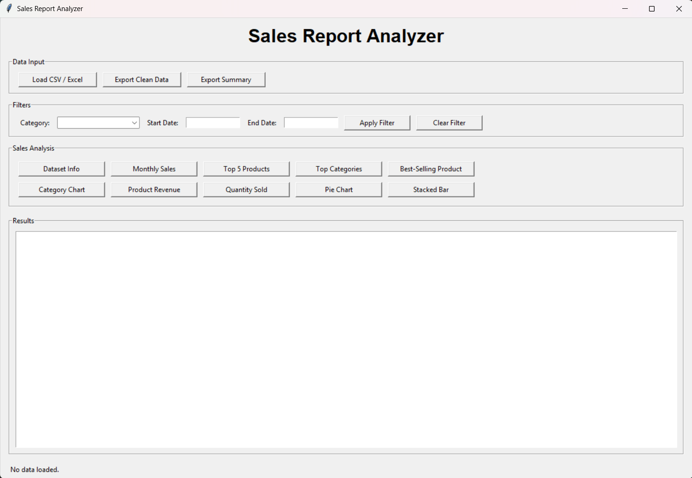
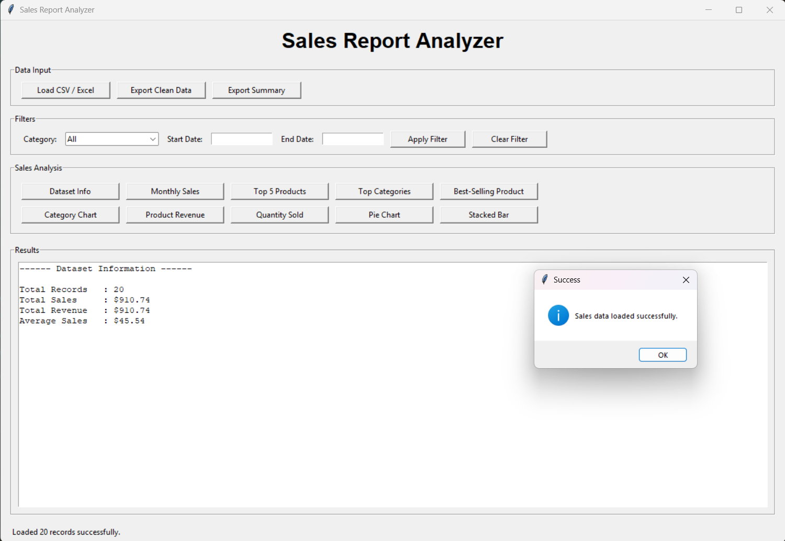
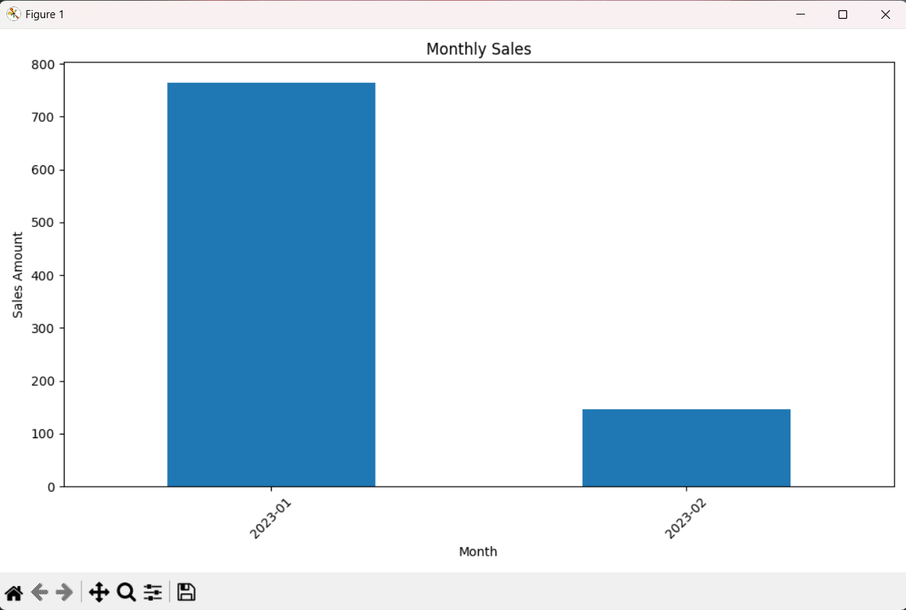
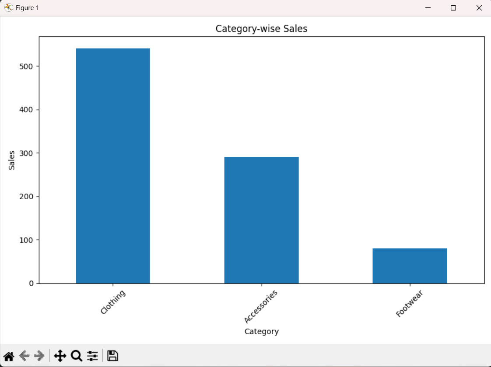
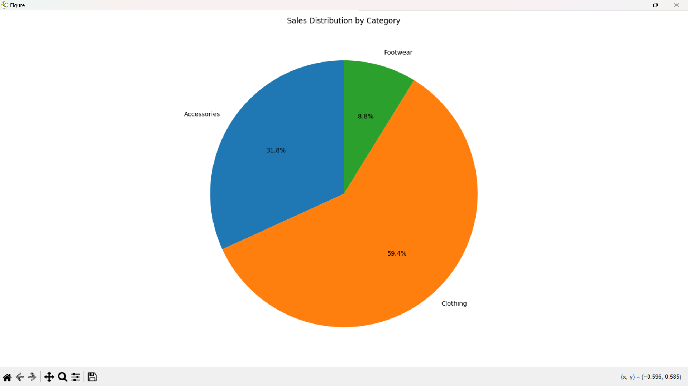
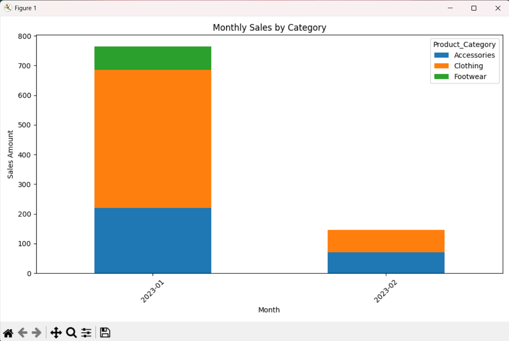
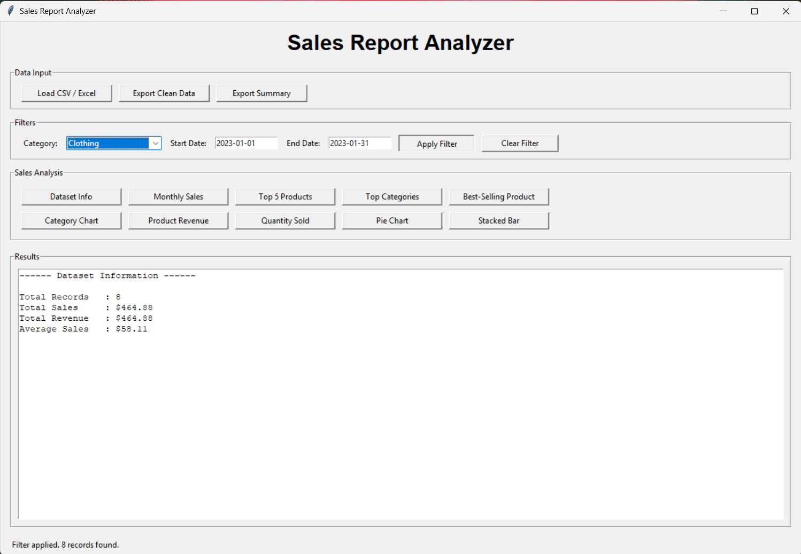
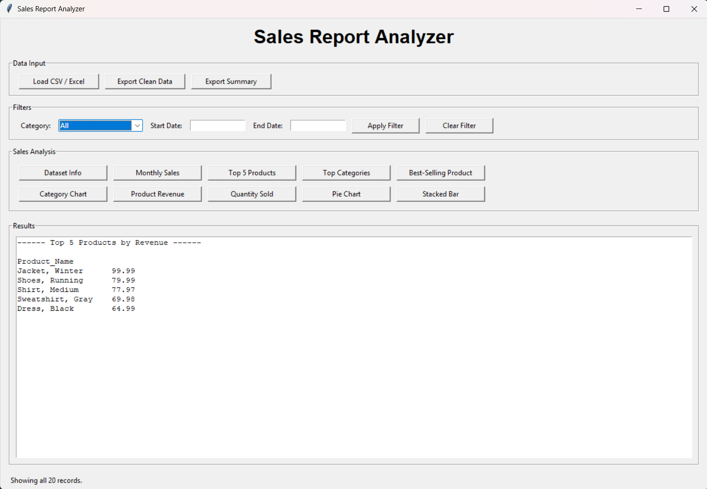

# 🚀 Day 46 - Sales Report Analyzer

Welcome to **Day 46** of my **100 Days, 100 Python Projects** challenge!

This project is a **Sales Report Analyzer GUI application** built using **Python, Tkinter, Pandas, and Matplotlib**. The application allows users to load sales data from CSV or Excel files, clean and validate the dataset, apply filters, analyze sales performance, generate charts, and export cleaned data and summary reports.

The main purpose of this project is to gain practical experience with **Data Analysis, Data Visualization, Data Cleaning, File Handling, and GUI Development**, while learning how Pandas and Matplotlib can be combined to build a practical sales analytics application.

---

## 📌 Project Overview

Sales data often contains a large number of records that can be difficult to analyze manually. A sales report analyzer can help transform raw transaction data into meaningful information such as total sales, revenue, best-selling products, category performance, and monthly sales trends.

This project provides an interactive graphical interface where users can:

* 📂 Load sales data from CSV files
* 📊 Load sales data from Excel files
* 🧹 Automatically clean and validate imported data
* 🔀 Filter data by product category
* 📅 Filter data by start and end dates
* 📈 Analyze monthly sales
* 🏆 Find the top 5 products by revenue
* 📊 Analyze sales by category
* 🥇 Identify the best-selling product
* 📉 Generate different sales charts
* 🥧 Visualize category-wise sales distribution
* 📊 Generate stacked monthly sales charts
* 💾 Export cleaned sales data
* 📄 Export a text-based sales summary report

---

## ✨ Features

* 🖥️ Interactive Tkinter GUI
* 📂 CSV file support
* 📊 Excel file support
* 🧹 Automatic data cleaning
* ⚠️ Missing-column validation
* 🔢 Numerical data validation
* 📅 Date conversion and validation
* 🗑️ Duplicate record removal
* 🚫 Removal of invalid negative values
* 🔎 Category-based filtering
* 📅 Date-range filtering
* 📊 Dataset information
* 📈 Monthly sales analysis
* 🏆 Top 5 products by revenue
* 📊 Sales by category
* 🥇 Best-selling product
* 📊 Category-wise sales chart
* 📈 Product revenue chart
* 📦 Quantity sold by category
* 🥧 Sales distribution pie chart
* 📊 Monthly sales by category stacked bar chart
* 💾 Export cleaned dataset as CSV
* 📄 Export summary report as TXT
* 🚨 Error handling using message boxes
* 📊 Matplotlib-based data visualization

---

## 🖼️ Application Screenshots

## Screenshots

### 🖥️ Main Application



### 📊 Dataset Information



### 📈 Monthly Sales



### 📊 Category-wise Sales



### 🥧 Sales Distribution



### 📊 Monthly Sales by Category



### 🔎 Interactive Filtering



### 🏆 Top 5 Products



---

## 🛠️ Technologies Used

* **Python 3**
* **Tkinter**
* **Pandas**
* **Matplotlib**
* **OpenPyXL**

### Python

Python is used to build the complete application logic, data-processing functionality, GUI, filtering system, validation, analysis, and export features.

### Tkinter

Tkinter is Python's built-in GUI library and is used to create the application's interface, including:

* Labels
* Buttons
* Text areas
* Entry fields
* Comboboxes
* Label frames
* File dialogs
* Message boxes

### Pandas

Pandas is the primary data-analysis library used in the project.

It is responsible for:

* Loading CSV files
* Loading Excel files
* Cleaning data
* Converting numerical columns
* Converting dates
* Removing duplicates
* Filtering records
* Grouping sales data
* Calculating totals and averages
* Creating monthly summaries
* Generating category and product analysis
* Creating pivot tables

### Matplotlib

Matplotlib is used to visualize sales information through different charts.

It is responsible for generating:

* Monthly sales charts
* Category-wise sales charts
* Product revenue charts
* Quantity charts
* Pie charts
* Stacked bar charts

### OpenPyXL

OpenPyXL provides `.xlsx` Excel file support when Excel data is loaded using Pandas.

---

## 📂 Project Structure

```text
DAY_46/

│
├── main46.py
├── sales_data.csv
├── requirements.txt
├── README.md
│
└── screenshots/
    ├── main_gui.png
    ├── dataset_info.png
    ├── monthly_sales.png
    ├── category_sales.png
    ├── pie_chart.png
    ├── stacked_bar.png
    ├── filtering.png
    └── top_products.png
```

### File Description

| File / Folder      | Purpose                          |
| ------------------ | -------------------------------- |
| `main46.py`        | Main Python application          |
| `sales_data.csv`   | Sample sales dataset for testing |
| `requirements.txt` | Python dependencies              |
| `README.md`        | Project documentation            |
| `screenshots/`     | Application screenshots          |

---

## 📦 requirements.txt

The project requires the following Python libraries:

```text
pandas
matplotlib
openpyxl
```

Install all dependencies using:

```bash
pip install -r requirements.txt
```

---

## ▶️ How to Run

### 1. Make sure Python is installed

Check your Python version:

```bash
python --version
```

### 2. Open the project folder

Open a terminal inside the `DAY_46` folder.

### 3. Install the required dependencies

```bash
pip install -r requirements.txt
```

### 4. Run the application

```bash
python main46.py
```

The **Sales Report Analyzer** GUI window will open automatically.

---

## 📂 Loading Sales Data

The application allows users to load sales datasets using the **Load CSV / Excel** button.

Supported formats include:

### CSV

```text
sales_data.csv
```

### Excel

```text
sales_data.xlsx
```

After selecting a file, the application reads the dataset using Pandas.

The application then checks whether the required columns are present.

The required columns are:

```text
Product_Name
Product_Category
Quantity
Price
Sales_Amount
Date
```

If any required column is missing, the application displays an error message.

---

## 🧹 Data Cleaning

One of the important parts of this project is automatic data cleaning.

The `clean_data()` function performs several operations before the dataset is analyzed.

### Missing Categories

Missing product categories are replaced with:

```text
Unknown
```

### Numerical Conversion

The following columns are converted into numerical values:

```text
Quantity
Price
Sales_Amount
```

Invalid numerical values are converted to missing values and removed during cleaning.

### Date Conversion

The `Date` column is converted into a Pandas datetime format.

```python
data["Date"] = pd.to_datetime(data["Date"], errors="coerce")
```

Invalid dates are removed from the dataset.

### Removing Invalid Values

Records containing negative values for:

* Quantity
* Price
* Sales Amount

are removed.

### Removing Duplicates

Duplicate records are removed using:

```python
data.drop_duplicates()
```

### Revenue Calculation

The application calculates revenue using:

```python
data["Revenue"] = data["Quantity"] * data["Price"]
```

### Year-Month Extraction

A separate `Year_Month` column is created to simplify monthly analysis.

```python
data["Year_Month"] = data["Date"].dt.to_period("M")
```

---

## 🔎 Data Filtering

The application provides interactive filtering options.

Users can filter the dataset using:

* Product Category
* Start Date
* End Date

### Category Filter

Users can select a specific product category or choose:

```text
All
```

### Date Filter

Users can enter dates using:

```text
YYYY-MM-DD
```

For example:

```text
2023-01-01
```

The application then displays only the records matching the selected conditions.

### Clear Filter

The **Clear Filter** button restores the complete cleaned dataset.

---

## 📊 Dataset Information

The **Dataset Info** button displays important information about the currently active dataset.

The application calculates:

* Total Records
* Total Sales
* Total Revenue
* Average Sales

Example output:

```text
------ Dataset Information ------

Total Records   : 20
Total Sales     : $...
Total Revenue   : $...
Average Sales   : $...
```

This provides a quick overview of the sales dataset.

---

## 📈 Monthly Sales Analysis

The **Monthly Sales** feature groups the sales data according to month and calculates the total sales for each month.

The application uses:

```python
data.groupby("Year_Month")["Sales_Amount"].sum()
```

The results are displayed in the application and visualized using a bar chart.

Monthly sales analysis can help identify:

* Sales trends
* High-performing months
* Low-performing months
* Changes in sales over time

---

## 🏆 Top 5 Products by Revenue

The **Top 5 Products** feature identifies the five products generating the highest revenue.

The application groups products by name and calculates their total revenue.

```python
data.groupby("Product_Name")["Revenue"].sum()
```

The results are sorted in descending order and the top five products are displayed.

This can help identify the products that contribute most to overall revenue.

---

## 📊 Sales by Category

The **Top Categories** feature calculates the total sales generated by each product category.

The application uses:

```python
data.groupby("Product_Category")["Sales_Amount"].sum()
```

The categories are then sorted according to their sales performance.

This helps compare the performance of categories such as:

```text
Clothing
Accessories
Footwear
```

---

## 🥇 Best-Selling Product

The **Best-Selling Product** feature identifies the product with the highest total quantity sold.

The application uses:

```python
data.groupby("Product_Name")["Quantity"].sum()
```

The product with the highest quantity is selected as the best-selling product.

The result displays:

```text
------ Best-Selling Product ------

Product  : Product Name
Quantity : Quantity Sold
```

---

## 📊 Supported Visualizations

The application provides several visualization options for analyzing sales data.

### 📈 1. Monthly Sales Chart

Displays total sales for each month.

```python
monthly.plot(kind="bar")
```

This chart is useful for identifying monthly sales trends.

---

### 📊 2. Category-wise Sales Chart

Displays sales generated by each product category.

```python
category_sales.plot(kind="bar")
```

This makes it easier to compare category performance.

---

### 📈 3. Product Revenue Chart

Displays the top 10 products according to revenue.

```python
products.plot(kind="bar")
```

This visualization helps identify high-revenue products.

---

### 📦 4. Quantity Sold Chart

Displays the total quantity sold for each product category.

```python
quantity.plot(kind="bar")
```

This helps determine which categories have the highest sales volume.

---

### 🥧 5. Sales Distribution Pie Chart

The pie chart represents the percentage contribution of each product category to total sales.

The application uses:

```python
plt.pie(
    category_sales,
    labels=category_sales.index,
    autopct="%1.1f%%",
    startangle=90
)
```

This provides a quick visual representation of category-wise sales distribution.

---

### 📊 6. Stacked Bar Chart

The stacked bar chart displays monthly sales while separating the values according to product category.

The application first creates a pivot table:

```python
pd.pivot_table(
    data,
    values="Sales_Amount",
    index="Year_Month",
    columns="Product_Category",
    aggfunc="sum",
    fill_value=0
)
```

The resulting data is displayed using a stacked bar chart.

This visualization helps compare both:

* Monthly sales
* Category contribution

at the same time.

---

## 💾 Export Clean Data

The **Export Clean Data** button allows users to save the currently active cleaned and filtered dataset.

The exported data is saved as a CSV file.

Example:

```text
clean_sales_data.csv
```

The export contains the cleaned dataset along with calculated fields such as:

```text
Revenue
Year_Month
```

This allows the processed dataset to be reused for further analysis.

---

## 📄 Export Summary

The **Export Summary** button generates a text-based sales report.

The report contains:

* Dataset information
* Total records
* Total sales
* Total revenue
* Average sales
* Top 5 products by revenue
* Sales by category
* Best-selling product

Example:

```text
SALES REPORT
============================

DATASET INFORMATION
----------------------------
Total Records : ...
Total Sales   : ...
Total Revenue : ...
Average Sales : ...

TOP 5 PRODUCTS BY REVENUE
----------------------------
...

SALES BY CATEGORY
----------------------------
...

BEST-SELLING PRODUCT
----------------------------
...
```

The summary can be saved as:

```text
sales_report.txt
```

---

## ⚠️ Input Validation and Error Handling

The application includes error handling to prevent crashes and provide meaningful feedback.

It checks for:

* Empty datasets
* Missing required columns
* Invalid numerical values
* Invalid dates
* Negative quantity values
* Negative prices
* Negative sales amounts
* Duplicate records
* Empty filtered results
* Missing sales data before analysis

Errors and warnings are displayed using Tkinter message boxes.

For example, if an invalid date is entered, the application displays:

```text
Please enter dates in YYYY-MM-DD format.
```

---

## 🔄 Application Workflow

The general workflow of the application is:

```text
Load CSV / Excel File
        ↓
Validate Required Columns
        ↓
Clean Sales Data
        ↓
Remove Invalid Records
        ↓
Calculate Revenue
        ↓
Create Year-Month Data
        ↓
Display Dataset Information
        ↓
Apply Filters
        ↓
Perform Sales Analysis
        ↓
Generate Visualizations
        ↓
Export Clean Data / Summary
```

---

## 🧩 Libraries and Functions Practiced

### Pandas

| Function            | Purpose                                |
| ------------------- | -------------------------------------- |
| `pd.read_csv()`     | Loads CSV files                        |
| `pd.read_excel()`   | Loads Excel files                      |
| `pd.to_numeric()`   | Converts values to numerical data      |
| `pd.to_datetime()`  | Converts values to datetime            |
| `dropna()`          | Removes missing values                 |
| `drop_duplicates()` | Removes duplicate records              |
| `groupby()`         | Groups sales data                      |
| `sum()`             | Calculates totals                      |
| `mean()`            | Calculates averages                    |
| `sort_values()`     | Sorts analysis results                 |
| `head()`            | Gets top records                       |
| `pivot_table()`     | Creates summarized category/month data |
| `copy()`            | Creates dataset copies                 |

### Matplotlib

| Function         | Purpose              |
| ---------------- | -------------------- |
| `plot()`         | Creates charts       |
| `pie()`          | Creates pie charts   |
| `tight_layout()` | Adjusts chart layout |
| `show()`         | Displays charts      |
| `set_title()`    | Sets chart titles    |
| `set_xlabel()`   | Sets X-axis labels   |
| `set_ylabel()`   | Sets Y-axis labels   |

### Tkinter

| Component    | Purpose                         |
| ------------ | ------------------------------- |
| `Tk()`       | Creates the main window         |
| `Label`      | Displays text                   |
| `Button`     | Performs actions                |
| `Entry`      | Accepts user input              |
| `Text`       | Displays analysis results       |
| `LabelFrame` | Organizes GUI sections          |
| `Combobox`   | Selects product categories      |
| `messagebox` | Displays errors and messages    |
| `filedialog` | Selects files for import/export |

---

## 🖥️ GUI Components Used

The project uses several Tkinter components:

| Component    | Purpose                                                      |
| ------------ | ------------------------------------------------------------ |
| `Tk()`       | Creates the main application window                          |
| `Label`      | Displays headings and status information                     |
| `Button`     | Executes loading, filtering, analysis, and export operations |
| `Entry`      | Accepts start and end dates                                  |
| `Text`       | Displays analysis results                                    |
| `LabelFrame` | Groups related controls                                      |
| `Combobox`   | Provides category selection                                  |
| `messagebox` | Displays warnings, errors, and success messages              |
| `filedialog` | Opens and saves files                                        |

---

## 📚 Concepts Practiced

* Python Programming
* Object-Oriented Programming
* Tkinter GUI Development
* Data Analysis
* Data Cleaning
* Data Visualization
* Pandas
* Matplotlib
* CSV File Processing
* Excel File Processing
* Data Validation
* Date Processing
* Data Filtering
* GroupBy Operations
* Aggregation
* Pivot Tables
* Revenue Calculation
* Sales Analysis
* Exception Handling
* File Handling
* Data Export
* GUI Event Handling
* Business Data Analysis

---

## 🎯 Learning Outcome

This project helped me understand:

* How to build a practical data-analysis application using Python
* How to create a GUI using Tkinter
* How to load CSV and Excel datasets using Pandas
* How to validate imported datasets
* How to clean real-world-style sales data
* How to handle missing and invalid values
* How to remove duplicate records
* How to convert data types using Pandas
* How to process dates using Pandas
* How to calculate revenue from quantity and price
* How to filter datasets using multiple conditions
* How to perform GroupBy-based analysis
* How to identify top-performing products
* How to analyze category-wise sales
* How to analyze monthly sales
* How to create different types of charts
* How to use pivot tables for data analysis
* How to export cleaned datasets
* How to generate summary reports
* How to combine Pandas, Matplotlib, and Tkinter into one application
* How Data Analysis and Data Visualization can be used for business insights

---

## 🔮 Future Improvements

Possible enhancements for future versions:

* 📊 Add an interactive dashboard
* 📈 Add more visualization types
* 📅 Add a date picker instead of manual date input
* 🔎 Add product-name filtering
* 💰 Add profit and profit-margin analysis
* 📊 Add average order value
* 🏆 Add more advanced product rankings
* 📈 Add sales forecasting
* 📊 Add interactive charts
* 📋 Add a data table preview inside the GUI
* 📉 Add sales trend analysis
* 📊 Add KPI cards for important metrics
* 📑 Export reports as PDF or Excel
* 📊 Create automated monthly reports
* 📈 Add year-over-year sales comparison
* 🔍 Add advanced filtering options
* 🌙 Add Dark Mode
* 🎨 Improve the overall GUI design
* 🖱️ Add zoom and interactive chart controls
* 📊 Add automatic business insights
* 🤖 Add machine-learning-based sales prediction

---

## 📅 Challenge

This project is part of my **100 Days, 100 Python Projects** challenge, where I build one Python project every day to improve my Python programming skills, strengthen my problem-solving abilities, learn new technologies, and maintain consistency through daily coding.

**Day 46** focuses on **Sales Data Analysis**, combining **Pandas for data cleaning and analysis**, **Matplotlib for data visualization**, and **Tkinter for GUI development** to create a practical Sales Report Analyzer.

Through this project, I explored how raw sales transaction data can be transformed into useful business information and visual insights.

---

## 👨‍💻 Author

**Abhijit Munghate**

Happy Coding! 🚀🐍📊
