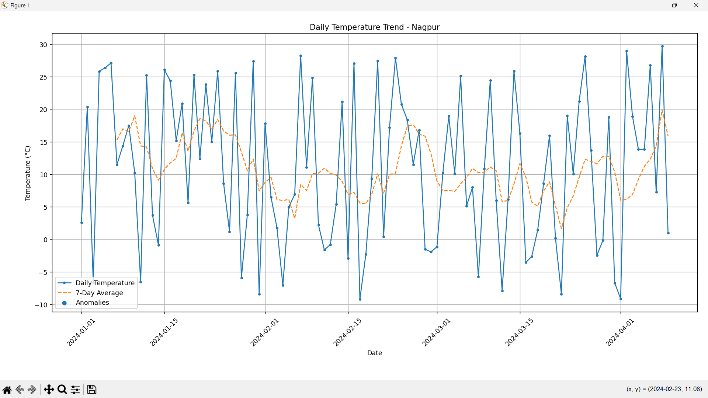
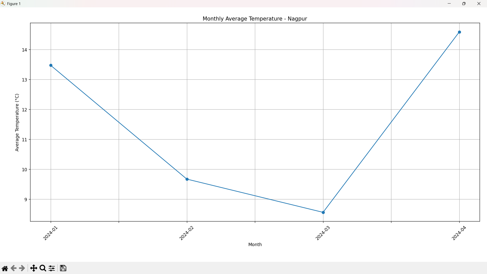
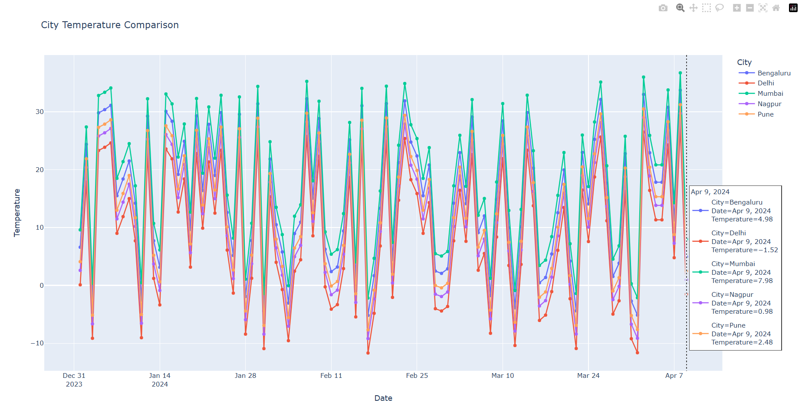

# 🌡️ Day 47 - Temperature Plotter

Welcome to **Day 47** of my **100 Days, 100 Python Projects** challenge!

This project is a **Temperature Plotter and Analysis application** built using **Python, Pandas, Matplotlib, and Plotly**. The application loads temperature data from a CSV file, validates and processes the dataset, calculates temperature statistics, analyzes daily, monthly, and yearly temperature trends, detects temperature anomalies, and generates interactive visualizations for comparing multiple cities.

The main purpose of this project is to gain practical experience with **Data Analysis, Data Visualization, Time-Series Data, Statistical Analysis, and Interactive Visualization** using Python.

---

## 📌 Project Overview

Temperature data collected over multiple days and cities can be used to identify weather patterns, temperature trends, unusual readings, and differences between locations.

This project provides a command-line based temperature analysis tool where users can:

* 📂 Load temperature data from a CSV file
* ✅ Validate required columns
* 🧹 Clean invalid and missing data
* 🏙️ Analyze temperatures for individual cities
* 📈 Generate daily temperature trends
* 📊 Calculate 7-day rolling averages
* 🚨 Detect temperature anomalies
* 📅 Analyze monthly average temperatures
* 📆 Analyze yearly average temperatures
* 🌍 Compare temperatures across multiple cities
* 📊 Display temperature statistics
* 🖱️ Generate interactive Plotly charts
* 💾 Save interactive charts as HTML files

The sample dataset contains temperature records for multiple Indian cities, including:

* 📍 Nagpur
* 🌊 Mumbai
* 🏛️ Delhi
* 🌆 Bengaluru
* 🏔️ Pune

Each city contains approximately **100 temperature records**, resulting in around **500 records** in the dataset.

---

## ✨ Features

* 🐍 Python-based temperature analysis
* 📂 CSV file support
* ✅ Dataset validation
* 🧹 Data cleaning
* 📅 Date conversion
* 🔢 Numerical temperature conversion
* 🏙️ Multiple city support
* 📈 Daily temperature trends
* 📊 7-day rolling average
* 🚨 Temperature anomaly detection
* 📅 Monthly temperature analysis
* 📆 Yearly temperature analysis
* 🌍 Multiple city comparison
* 📊 Temperature statistics
* 🖱️ Interactive Plotly visualization
* 💾 Export interactive charts as HTML
* ⚠️ Input validation
* 🚨 Exception handling
* 📈 Matplotlib visualizations
* 🌐 Interactive Plotly charts
* 🖥️ Command-line interface

---

## 🖼️ Application Screenshots

## Screenshots

### 📈 Daily Temperature Trend



### 📊 Monthly Average Temperature



### 🌍 Multiple City Comparison



---

## 🛠️ Technologies Used

* **Python 3**
* **Pandas**
* **Matplotlib**
* **Plotly**

### Python

Python is used to implement the complete application logic, including:

* File handling
* Data processing
* User input
* Data analysis
* Statistical calculations
* Visualization control
* Error handling

### Pandas

Pandas is the primary library used for data processing and analysis.

It is responsible for:

* Reading CSV files
* Converting dates
* Converting temperature values
* Removing invalid records
* Sorting data
* Grouping temperature data
* Calculating rolling averages
* Detecting anomalies
* Calculating monthly averages
* Calculating yearly averages
* Comparing cities

### Matplotlib

Matplotlib is used to create static temperature visualizations.

The project uses Matplotlib for:

* Daily temperature trends
* 7-day rolling averages
* Temperature anomaly visualization
* Monthly temperature trends
* Yearly temperature charts

### Plotly

Plotly is used to create interactive temperature visualizations.

It provides features such as:

* Interactive hover information
* Zooming
* Panning
* City-based color grouping
* Interactive legends
* Multiple city comparison
* HTML chart export

---

## 📂 Project Structure

```text
DAY_47/

│
├── main47.py
├── temperature_data.csv
├── requirements.txt
├── README.md
│
└── screenshots/
    ├── daily_temperature.png
    ├── monthly_temperature.png
    └── city_comparison.png
```

### File Description

| File / Folder          | Purpose                 |
| ---------------------- | ----------------------- |
| `main47.py`            | Main Python application |
| `temperature_data.csv` | Temperature dataset     |
| `requirements.txt`     | Python dependencies     |
| `README.md`            | Project documentation   |
| `screenshots/`         | Project screenshots     |

---

## 📊 Dataset Structure

The project uses a CSV dataset containing three main columns:

```text
Date,City,Temperature
```

Example:

```text
Date,City,Temperature
2024-01-01,Nagpur,2.6
2024-01-02,Nagpur,20.38
2024-01-03,Nagpur,-6.64
```

The dataset contains approximately **500 records** across multiple cities.

### Dataset Columns

| Column        | Description                                |
| ------------- | ------------------------------------------ |
| `Date`        | Date on which the temperature was recorded |
| `City`        | City where the temperature was recorded    |
| `Temperature` | Recorded temperature in degrees Celsius    |

### Cities Included

The sample dataset contains temperature data for:

| City      | Approx. Records |
| --------- | --------------: |
| Nagpur    |             100 |
| Mumbai    |             100 |
| Delhi     |             100 |
| Bengaluru |             100 |
| Pune      |             100 |
| **Total** |         **500** |

---

## 📦 requirements.txt

The project requires the following Python libraries:

```text
pandas
matplotlib
plotly
```

Install all dependencies using:

```bash
pip install -r requirements.txt
```

---

## ▶️ How to Run

### 1. Make sure Python is installed

Check your Python version:

```bash
python --version
```

### 2. Open the project folder

Open a terminal inside the `DAY_47` folder.

### 3. Install the required dependencies

```bash
pip install -r requirements.txt
```

### 4. Run the application

```bash
python main47.py
```

### 5. Enter the CSV file path

When prompted, enter the location of the temperature dataset.

For example:

```text
temperature_data.csv
```

The application will load and validate the dataset.

---

## 📂 Loading Temperature Data

The `load_data()` function reads the CSV file using Pandas.

```python
data = pd.read_csv(file_path)
```

The application verifies that the dataset contains the required columns:

```text
Date
Temperature
```

If the `City` column is missing, the application automatically creates a default city:

```text
Default City
```

The `City` column is also cleaned and converted into string values.

---

## 🧹 Data Cleaning and Validation

Before analysis, the application performs several data-cleaning operations.

### Required Columns

The application checks for:

```text
Date
Temperature
```

If a required column is missing, an error is displayed.

### Date Conversion

The `Date` column is converted into Pandas datetime format:

```python
data["Date"] = pd.to_datetime(
    data["Date"],
    errors="coerce"
)
```

Invalid dates are converted to missing values and removed.

### Temperature Conversion

Temperature values are converted into numerical values:

```python
data["Temperature"] = pd.to_numeric(
    data["Temperature"],
    errors="coerce"
)
```

Invalid temperature values are removed.

### Removing Invalid Records

Records with invalid dates or temperatures are removed using:

```python
data.dropna(
    subset=["Date", "Temperature"]
)
```

### Sorting Data

The cleaned dataset is sorted by:

```text
City
Date
```

This makes time-series analysis easier.

---

## 📊 Temperature Statistics

The **Show Statistics** feature displays an overview of the complete temperature dataset.

The application calculates:

* Total number of records
* Average temperature
* Minimum temperature
* Maximum temperature
* Number of cities
* Date range

Example:

```text
------ Temperature Statistics ------

Total Records : 500
Average Temperature : XX.XX °C
Minimum Temperature : XX.XX °C
Maximum Temperature : XX.XX °C
Number of Cities : 5
Date Range : 2024-01-01 to ...
```

These statistics provide a quick overview of the dataset.

---

## 📈 Daily Temperature Trend

The **Daily Temperature Trend** feature allows users to select a city and visualize its daily temperature.

For example:

```text
Nagpur
Mumbai
Delhi
Bengaluru
Pune
```

The chart displays:

* Daily temperature
* 7-day rolling average
* Detected anomalies

The daily temperature is plotted using:

```python
plt.plot(
    city_data["Date"],
    city_data["Temperature"]
)
```

This visualization helps identify short-term temperature changes.

---

## 📊 7-Day Rolling Average

The project calculates a **7-day rolling average** to smooth short-term fluctuations in temperature data.

The calculation is performed separately for each city:

```python
data.groupby("City")["Temperature"].transform(
    lambda x: x.rolling(7).mean()
)
```

The rolling average helps make general temperature trends easier to observe.

For example:

```text
Day 1 → Temperature
Day 2 → Temperature
...
Day 7 → Average of first 7 days
Day 8 → Average of days 2–8
```

The rolling average is displayed alongside the daily temperature trend.

---

## 🚨 Temperature Anomaly Detection

The application includes basic statistical anomaly detection.

For each city, it calculates:

* Mean temperature
* Standard deviation

A temperature is marked as an anomaly when it falls outside:

```text
Mean ± 2 × Standard Deviation
```

The application uses:

```python
data["Anomaly"] = (
    (data["Temperature"] >
     mean_temperature + 2 * std_temperature)
    |
    (data["Temperature"] <
     mean_temperature - 2 * std_temperature)
)
```

Detected anomalies are highlighted on the daily temperature chart.

This can help identify unusually high or low temperature readings.

> **Note:** This is a simple statistical anomaly-detection method intended for learning and exploratory analysis, not a meteorological forecasting system.

---

## 📅 Monthly Temperature Trend

The **Monthly Temperature Trend** feature calculates the average temperature for each month.

The application extracts the month from the date:

```python
city_data["Month"] = (
    city_data["Date"]
    .dt.to_period("M")
    .astype(str)
)
```

It then calculates the monthly average:

```python
monthly = (
    city_data
    .groupby("Month")["Temperature"]
    .mean()
)
```

The result is displayed as a line chart.

This visualization can help identify:

* Seasonal patterns
* Warmer months
* Cooler months
* Long-term temperature changes

---

## 📆 Yearly Temperature Trend

The **Yearly Temperature Trend** feature calculates the average temperature for each year.

The application extracts the year:

```python
city_data["Year"] = (
    city_data["Date"].dt.year
)
```

It then calculates the yearly average:

```python
yearly = (
    city_data
    .groupby("Year")["Temperature"]
    .mean()
)
```

The results are displayed using a bar chart.

This feature is useful for comparing average temperatures between different years when a larger multi-year dataset is provided.

---

## 🌍 Multiple City Comparison

The project supports temperature comparison across multiple cities.

The interactive comparison uses:

```python
px.line(
    data,
    x="Date",
    y="Temperature",
    color="City",
    markers=True
)
```

Each city is represented separately in the interactive chart.

This makes it possible to compare cities such as:

```text
Nagpur
Mumbai
Delhi
Bengaluru
Pune
```

The comparison can help identify differences in temperature patterns between locations.

---

## 🖱️ Interactive Temperature Plot

The project uses **Plotly Express** to create an interactive temperature visualization.

```python
px.line(
    data,
    x="Date",
    y="Temperature",
    color="City",
    markers=True
)
```

The interactive graph allows users to:

* Hover over data points
* Zoom into specific periods
* Pan across the graph
* Show or hide cities
* Compare multiple cities
* Inspect individual temperature values

The hover mode is configured as:

```python
fig.update_layout(
    hovermode="x unified"
)
```

This makes it easier to compare temperatures across cities for the same date.

---

## 💾 Saving Interactive Charts

The application provides an option to save the interactive Plotly chart as an HTML file.

The chart is saved using:

```python
fig.write_html(file_name)
```

For example:

```text
temperature_chart.html
```

The generated HTML file can be opened in a web browser and interacted with without running the Python application again.

---

## 🧩 Functions Practiced

### Data Loading

| Function           | Purpose                              |
| ------------------ | ------------------------------------ |
| `load_data()`      | Loads and validates temperature data |
| `pd.read_csv()`    | Reads CSV files                      |
| `pd.to_datetime()` | Converts dates                       |
| `pd.to_numeric()`  | Converts temperature values          |
| `dropna()`         | Removes invalid records              |
| `sort_values()`    | Sorts the dataset                    |

### Data Analysis

| Function                      | Purpose                            |
| ----------------------------- | ---------------------------------- |
| `calculate_rolling_average()` | Calculates 7-day averages          |
| `detect_anomalies()`          | Detects unusual temperature values |
| `groupby()`                   | Groups data by city/month/year     |
| `mean()`                      | Calculates average temperature     |
| `std()`                       | Calculates standard deviation      |
| `nunique()`                   | Counts unique cities               |

### Matplotlib

| Function             | Purpose               |
| -------------------- | --------------------- |
| `plt.figure()`       | Creates a figure      |
| `plt.plot()`         | Creates line charts   |
| `plt.scatter()`      | Displays anomalies    |
| `plt.title()`        | Sets chart title      |
| `plt.xlabel()`       | Sets X-axis label     |
| `plt.ylabel()`       | Sets Y-axis label     |
| `plt.legend()`       | Displays chart legend |
| `plt.grid()`         | Adds grid lines       |
| `plt.xticks()`       | Rotates date labels   |
| `plt.tight_layout()` | Adjusts chart layout  |
| `plt.show()`         | Displays chart        |

### Plotly

| Function          | Purpose                         |
| ----------------- | ------------------------------- |
| `px.line()`       | Creates interactive line charts |
| `update_layout()` | Customizes interactive charts   |
| `write_html()`    | Saves charts as HTML            |
| `fig.show()`      | Displays interactive charts     |

---

## 🖥️ Command-Line Interface

The project uses a simple command-line menu.

After loading the dataset, the user can select from:

```text
------ Temperature Analysis ------

1. Daily Temperature Trend
2. Monthly Temperature Trend
3. Yearly Temperature Trend
4. Interactive Temperature Plot
5. Compare Multiple Cities
6. Show Statistics
7. Save Interactive Chart
8. Exit
```

The selected option executes the corresponding analysis function.

---

## 🔄 Application Workflow

The overall workflow of the application is:

```text
Enter CSV File Path
        ↓
Load Temperature Data
        ↓
Validate Required Columns
        ↓
Clean Invalid Data
        ↓
Sort Data by City and Date
        ↓
Display Dataset Statistics
        ↓
Select Analysis
        ↓
┌───────────────────────────────┐
│ Daily Trend                   │
│ Monthly Trend                 │
│ Yearly Trend                  │
│ City Comparison               │
│ Interactive Visualization     │
│ Anomaly Detection             │
└───────────────────────────────┘
        ↓
Display / Save Visualization
```

---

## 📚 Concepts Practiced

* Python Programming
* Functions
* File Handling
* Exception Handling
* Pandas
* Matplotlib
* Plotly
* Data Cleaning
* Data Validation
* Time-Series Data
* Date and Time Processing
* Statistical Analysis
* Mean
* Standard Deviation
* Rolling Average
* Anomaly Detection
* Data Aggregation
* GroupBy Operations
* Data Visualization
* Interactive Visualization
* Multi-City Comparison
* CSV Processing
* HTML Chart Export
* Command-Line Applications

---

## 🎯 Learning Outcome

This project helped me understand:

* How to load CSV datasets using Pandas
* How to validate data before analysis
* How to clean invalid and missing values
* How to convert strings into dates
* How to convert data into numerical values
* How to work with time-series datasets
* How to calculate daily temperature trends
* How to calculate rolling averages
* How rolling averages can smooth noisy data
* How to calculate statistical values using Pandas
* How to detect simple statistical anomalies
* How to aggregate data by month
* How to aggregate data by year
* How to compare data from multiple cities
* How to create static charts using Matplotlib
* How to create interactive charts using Plotly
* How to save interactive visualizations as HTML
* How to build a command-line data-analysis application
* How Data Analysis and Data Visualization work together

---

## 🔮 Future Improvements

Possible enhancements for future versions:

* 🌡️ Add minimum and maximum temperature analysis
* 🌧️ Add rainfall data
* 💧 Add humidity analysis
* 💨 Add wind-speed analysis
* 🌤️ Add weather-condition analysis
* 📊 Add temperature distribution histograms
* 📈 Add moving averages for different periods
* 🚨 Improve anomaly detection methods
* 📅 Add custom date-range analysis
* 🌍 Add geographic map visualization
* 🗺️ Add city location mapping
* 📊 Add interactive dashboards
* 📈 Add temperature forecasting
* 🤖 Add machine-learning-based prediction
* 📉 Add correlation analysis between weather variables
* 📑 Export analysis reports as PDF
* 📊 Export processed data to Excel
* 🖥️ Build a Tkinter GUI version
* 🌐 Build a web-based version using Flask
* 📡 Connect the project to a real-time weather API
* 🔄 Add automatic data updates
* 📊 Add more statistical analysis features

---

## 📅 Challenge

This project is part of my **100 Days, 100 Python Projects** challenge, where I build one Python project every day to improve my Python programming skills, strengthen my problem-solving abilities, learn new technologies, and maintain consistency through daily coding.

**Day 47** focuses on **Temperature Data Analysis and Visualization**, combining **Pandas for data processing**, **Matplotlib for static visualization**, and **Plotly for interactive visualization**.

Through this project, I explored how time-series temperature data can be analyzed to identify trends, compare cities, calculate rolling averages, and detect unusual temperature readings.

---

## 👨‍💻 Author

**Abhijit Munghate**

Happy Coding! 🚀🐍🌡️📊
