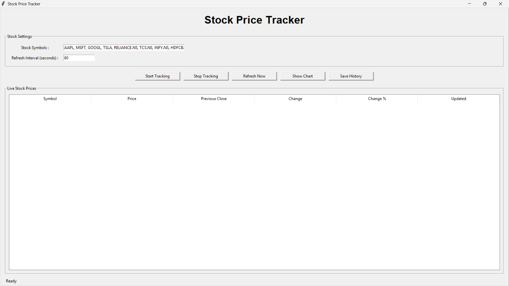
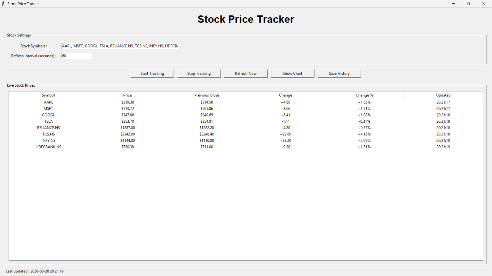
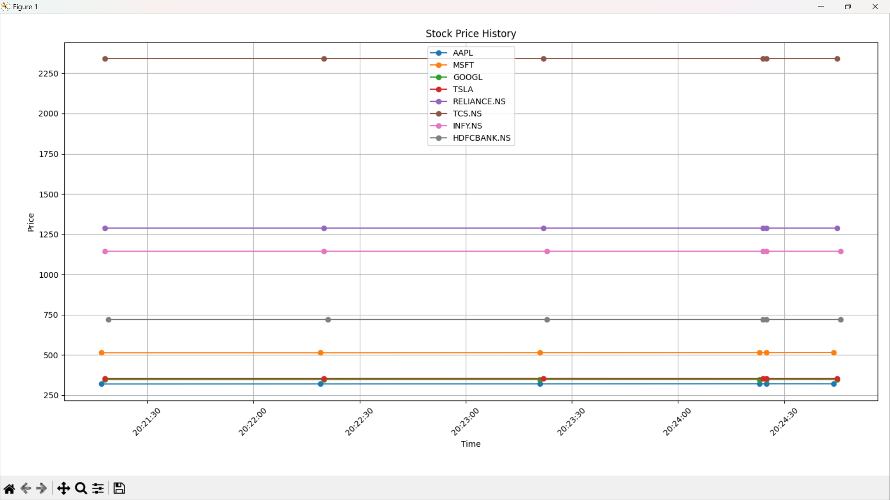

# 🚀 Day 48 - Stock Price Tracker

Welcome to **Day 48** of my **100 Days, 100 Python Projects** challenge!

This project is a **Stock Price Tracker GUI application** built using **Python, Tkinter, yFinance, Pandas, and Matplotlib**. The application allows users to track stock prices for multiple stock symbols, automatically refresh market data at a user-defined interval, view price changes, visualize price history, and save collected stock data as a CSV file.

The main purpose of this project is to gain practical experience with **API-based Data Retrieval, Financial Data Analysis, GUI Development, Data Visualization, Automatic Refreshing, and File Handling** using Python.

---

## 📌 Project Overview

Stock prices change continuously during market hours, making it useful to have a tool that can retrieve and monitor the latest available market data.

This project provides an interactive GUI where users can:

* 📈 Track multiple stocks simultaneously
* 💹 Retrieve stock prices using Yahoo Finance data
* 🔄 Automatically refresh stock prices
* ⏱️ Configure the refresh interval
* 🔃 Manually refresh prices
* 📊 View current stock information in a table
* 📉 Calculate price changes
* 📊 Calculate percentage changes
* 📈 Visualize collected price history
* 💾 Save stock price history as a CSV file
* ⚠️ Handle invalid stock symbols and input errors

Example stock symbols include:

```text
AAPL
MSFT
GOOGL
```

Users can also enter multiple symbols separated by commas.

---

## ✨ Features

* 🖥️ Interactive Tkinter GUI
* 📈 Real-time/latest available stock price retrieval
* 🌐 Yahoo Finance data through `yfinance`
* 📊 Multiple stock symbol tracking
* 🔄 Automatic periodic price updates
* ⏱️ Custom refresh interval
* 🔃 Manual **Refresh Now** option
* ▶️ Start Tracking functionality
* ⏹️ Stop Tracking functionality
* 📋 Live stock price table
* 💰 Current price display
* 📉 Previous closing price
* 📊 Price change calculation
* 📈 Percentage change calculation
* 🕐 Last updated timestamp
* 📈 Stock price history chart
* 💾 Export price history to CSV
* ⚠️ Input validation
* 🚨 Error handling using message boxes
* 🔁 Duplicate stock symbol removal
* 📊 Matplotlib-based visualization

---

## 🖼️ Application Screenshots

### 🖥️ 1. Main GUI



The main interface allows users to enter stock symbols, configure the refresh interval, start or stop tracking, manually refresh prices, view charts, and save price history.

### 📊 2. Multiple Stock Tracking



The application can track multiple stocks at the same time and display their latest available prices, previous closing prices, changes, percentage changes, and update times.

### 📈 3. Price History Analysis



The price history chart visualizes the collected stock prices over time, allowing users to compare the movement of multiple stocks.

---

## 🛠️ Technologies Used

* **Python 3**
* **Tkinter**
* **yFinance**
* **Pandas**
* **Matplotlib**

### Python

Python is used to build the complete application logic, including:

* Stock data retrieval
* GUI development
* Price calculations
* Automatic refreshing
* Data storage
* Chart generation
* CSV export
* Error handling

### Tkinter

Tkinter is Python's built-in GUI library and is used to create the application's interface.

It provides:

* Input fields
* Buttons
* Labels
* Tables
* Frames
* File dialogs
* Message boxes

### yFinance

`yfinance` is used to retrieve stock market data from Yahoo Finance.

The application uses it to obtain:

* Latest available closing price
* Previous closing price
* Historical market data

Example:

```python
ticker = yf.Ticker(symbol)
history = ticker.history(
    period="2d",
    interval="1d",
    auto_adjust=False
)
```

### Pandas

Pandas is used to store and process the collected stock price history.

It is responsible for:

* Creating DataFrames
* Converting timestamps
* Organizing price history
* Exporting data to CSV

### Matplotlib

Matplotlib is used to visualize the collected stock price history.

Each tracked stock is plotted as a separate line so that price movements can be compared.

---

## 📂 Project Structure

```text
DAY_48/

│
├── main48.py
├── requirements.txt
├── README.md
│
└── screenshots/
    ├── main_gui.png
    ├── multiple_stock_tracking.png
    └── price_history.png
```

### File Description

| File / Folder      | Purpose                 |
| ------------------ | ----------------------- |
| `main48.py`        | Main Python application |
| `requirements.txt` | Python dependencies     |
| `README.md`        | Project documentation   |
| `screenshots/`     | Application screenshots |

---

## 📦 requirements.txt

The project requires the following Python libraries:

```text
yfinance
pandas
matplotlib
```

Install all dependencies using:

```bash
pip install -r requirements.txt
```

> **Note:** `tkinter` is included with most standard Python installations on Windows and usually does not need to be installed separately using `pip`.

---

## ▶️ How to Run

### 1. Make sure Python is installed

Check your Python version:

```bash
python --version
```

### 2. Open the project folder

Open a terminal inside the `DAY_48` folder.

### 3. Install the required dependencies

```bash
pip install -r requirements.txt
```

### 4. Run the application

```bash
python main48.py
```

The **Stock Price Tracker** GUI window will open automatically.

---

## 📈 Entering Stock Symbols

The application allows users to enter one or more stock symbols.

The default symbols are:

```text
AAPL, MSFT, GOOGL
```

Multiple symbols should be separated by commas.

For example:

```text
AAPL, MSFT, GOOGL, AMZN, TSLA
```

The application converts the symbols to uppercase and removes unnecessary spaces.

It also removes duplicate symbols.

For example:

```text
aapl, AAPL, msft
```

will be treated as:

```text
AAPL, MSFT
```

---

## ⏱️ Refresh Interval

Users can configure how frequently the application retrieves updated stock data.

The default interval is:

```text
60 seconds
```

The application requires the refresh interval to be at least **10 seconds**.

For example:

```text
30
```

means the application attempts to refresh the tracked prices every 30 seconds.

---

## ▶️ Start Tracking

The **Start Tracking** button begins automatic stock tracking.

When tracking starts, the application:

1. Validates the refresh interval
2. Retrieves the latest available price data
3. Updates the stock table
4. Stores the price in the history
5. Schedules the next refresh

The application continues this process until the user selects **Stop Tracking**.

---

## ⏹️ Stop Tracking

The **Stop Tracking** button stops automatic updates.

The application uses Tkinter's scheduling mechanism to manage automatic refreshes.

The scheduled callback is cancelled when tracking is stopped.

This prevents unnecessary updates from continuing after tracking has been disabled.

---

## 🔃 Refresh Now

The **Refresh Now** button allows users to manually retrieve the latest available stock data without waiting for the next automatic refresh.

This is useful when users want an immediate update.

---

## 📊 Live Stock Price Table

The main GUI displays tracked stocks in a table.

The table contains:

| Column           | Description                                   |
| ---------------- | --------------------------------------------- |
| `Symbol`         | Stock ticker symbol                           |
| `Price`          | Latest available closing price                |
| `Previous Close` | Previous day's closing price                  |
| `Change`         | Difference between current and previous close |
| `Change %`       | Percentage change                             |
| `Updated`        | Time when the application updated the value   |

Example:

```text
Symbol    Price    Previous Close    Change    Change %    Updated
AAPL      $...     $...              +...      +...%       ...
MSFT      $...     $...              +...      +...%       ...
GOOGL     $...     $...              -...      -...%       ...
```

---

## 💰 Stock Price Calculation

The application retrieves the latest available closing price from the downloaded market data.

```python
latest = history.iloc[-1]
price = float(latest["Close"])
```

The previous closing price is obtained from the previous record:

```python
previous_close = float(
    history.iloc[-2]["Close"]
)
```

The price change is calculated as:

```python
change = price - previous_close
```

The percentage change is calculated using:

```python
change_percent = (
    change / previous_close
) * 100
```

This allows the application to display both absolute and percentage changes.

---

## 🌐 Stock Data Retrieval

The project uses the `yfinance` library to retrieve market data.

The application creates a ticker object:

```python
ticker = yf.Ticker(symbol)
```

It then requests recent market history:

```python
history = ticker.history(
    period="2d",
    interval="1d",
    auto_adjust=False
)
```

The application uses this data to calculate the latest available price and previous close.

> **Important:** Despite the application's "live" tracking interface, this implementation retrieves the latest available market data returned by Yahoo Finance; it should not be interpreted as a guaranteed real-time exchange feed.

---

## 📈 Price History

Every successful price update is stored in the application's `price_history` list.

Each record contains:

```text
Timestamp
Symbol
Price
Previous_Close
Change
Change_Percent
```

Example:

```python
{
    "Timestamp": "2026-08-28 10:30:00",
    "Symbol": "AAPL",
    "Price": 200.00,
    "Previous_Close": 198.50,
    "Change": 1.50,
    "Change_Percent": 0.76
}
```

This historical information is later used for visualization and CSV export.

---

## 📊 Price History Chart

The **Show Chart** button generates a Matplotlib visualization of the collected stock price history.

The application creates a separate line for each stock:

```python
for symbol in data["Symbol"].unique():
    symbol_data = data[
        data["Symbol"] == symbol
    ]

    plt.plot(
        symbol_data["Timestamp"],
        symbol_data["Price"],
        marker="o",
        label=symbol
    )
```

The resulting graph allows users to compare the price movement of multiple stocks over the tracking period.

The chart includes:

* Stock price lines
* Time on the X-axis
* Price on the Y-axis
* Stock symbols in the legend
* Grid lines
* Rotated timestamps

---

## 💾 Saving Stock History

The **Save History** button allows users to export collected stock data to a CSV file.

The application converts the price history into a Pandas DataFrame:

```python
data = pd.DataFrame(
    self.price_history
)
```

The data is then exported using:

```python
data.to_csv(
    filename,
    index=False
)
```

Example output:

```text
stock_history.csv
```

The exported file can be opened using:

* Microsoft Excel
* Google Sheets
* Pandas
* Other data-analysis tools

---

## ⚠️ Input Validation and Error Handling

The application includes validation and error handling to prevent invalid inputs and unexpected failures.

It checks for:

* Empty stock symbol input
* Invalid stock symbols
* Invalid refresh intervals
* Refresh intervals below 10 seconds
* Missing market data
* Empty price history
* File-save errors

Errors are displayed using Tkinter message boxes.

For example:

```text
Please enter at least one stock symbol.
```

or:

```text
Refresh interval should be at least 10 seconds.
```

---

## 🔄 Application Workflow

The overall workflow of the application is:

```text
Enter Stock Symbols
        ↓
Set Refresh Interval
        ↓
Start Tracking
        ↓
Retrieve Market Data
        ↓
Calculate Price Changes
        ↓
Update Stock Table
        ↓
Store Price History
        ↓
Wait for Refresh Interval
        ↓
Retrieve Updated Data
        ↓
Update Table Again
        ↓
        ├── Show Chart
        │
        └── Save History
```

---

## 🧩 Functions Practiced

### Stock Data

| Function           | Purpose                           |
| ------------------ | --------------------------------- |
| `get_symbols()`    | Reads and validates stock symbols |
| `get_interval()`   | Validates refresh interval        |
| `get_stock_data()` | Retrieves stock market data       |
| `update_prices()`  | Updates prices for all symbols    |

### GUI Management

| Function               | Purpose                      |
| ---------------------- | ---------------------------- |
| `create_widgets()`     | Creates the GUI              |
| `update_table()`       | Updates stock information    |
| `update_table_error()` | Displays unavailable symbols |
| `start_tracking()`     | Starts automatic tracking    |
| `stop_tracking()`      | Stops automatic tracking     |
| `schedule_update()`    | Schedules future updates     |
| `scheduled_refresh()`  | Performs scheduled refreshes |

### Visualization and Export

| Function         | Purpose                      |
| ---------------- | ---------------------------- |
| `show_chart()`   | Displays stock price history |
| `save_history()` | Saves price history as CSV   |

---

## 🖥️ GUI Components Used

The project uses several Tkinter components:

| Component    | Purpose                                         |
| ------------ | ----------------------------------------------- |
| `Tk()`       | Creates the main application window             |
| `Label`      | Displays titles and status information          |
| `Entry`      | Accepts stock symbols and refresh interval      |
| `Button`     | Performs application actions                    |
| `LabelFrame` | Organizes GUI sections                          |
| `Treeview`   | Displays live stock information                 |
| `filedialog` | Selects the CSV output location                 |
| `messagebox` | Displays warnings, errors, and success messages |

---

## 📚 Concepts Practiced

* Python Programming
* Object-Oriented Programming
* Tkinter GUI Development
* API/Data Retrieval
* Financial Data Analysis
* yFinance
* Pandas
* Matplotlib
* CSV File Handling
* Data Visualization
* Automatic Refreshing
* Event Scheduling
* Data Storage
* Percentage Calculations
* Exception Handling
* Input Validation
* Multiple Stock Tracking
* Historical Data Analysis
* GUI Event Handling

---

## 🎯 Learning Outcome

This project helped me understand:

* How to retrieve financial market data using Python
* How to work with the `yfinance` library
* How to build a stock tracking GUI using Tkinter
* How to accept and validate multiple stock symbols
* How to retrieve data for multiple stocks
* How to calculate price changes
* How to calculate percentage changes
* How to update a GUI automatically
* How to use Tkinter's `after()` method for scheduled tasks
* How to store historical price information
* How to convert collected data into a Pandas DataFrame
* How to visualize stock price history using Matplotlib
* How to export collected data to CSV
* How to handle unavailable market data
* How to implement error handling in a GUI application
* How external financial data can be combined with Python data-analysis tools

---

## 🔮 Future Improvements

Possible enhancements for future versions:

* 📊 Add real-time intraday market data
* 📈 Add candlestick charts
* 📊 Add trading volume
* 📉 Add moving averages
* 📈 Add technical indicators such as RSI and MACD
* 🔔 Add price alerts
* 🚨 Add notifications when a target price is reached
* 💰 Add portfolio tracking
* 📊 Add portfolio profit/loss calculation
* 📈 Add percentage-based performance comparison
* 📅 Add selectable historical date ranges
* 🔎 Add stock search functionality
* 📊 Add interactive Plotly charts
* 💾 Export data to Excel
* 📄 Generate stock reports
* 🌐 Add a web-based dashboard
* 📱 Build a mobile-friendly interface
* 🌙 Add Dark Mode
* 🎨 Improve the GUI design
* 🔄 Add automatic reconnection when data retrieval fails
* 📊 Add comparison against market indices
* 🤖 Add basic stock-price forecasting

---

## ⚠️ Disclaimer

This project is created for **educational and programming practice purposes**.

The stock information displayed by the application is obtained through Yahoo Finance data via `yfinance`. Market data availability, timing, and accuracy may vary.

This application is **not financial advice** and should not be used as the sole basis for investment or trading decisions.

---

## 📅 Challenge

This project is part of my **100 Days, 100 Python Projects** challenge, where I build one Python project every day to improve my Python programming skills, strengthen my problem-solving abilities, learn new technologies, and maintain consistency through daily coding.

**Day 48** focuses on **Stock Market Data Retrieval and Monitoring**, combining **yFinance for financial data**, **Tkinter for GUI development**, **Pandas for data handling**, and **Matplotlib for visualization** to create a practical Stock Price Tracker.

Through this project, I explored how Python can be used to retrieve external data, process it, display it in a graphical interface, visualize historical information, and export collected data for further analysis.

---

## 👨‍💻 Author

**Abhijit Munghate**

Happy Coding! 🚀🐍📈💰
