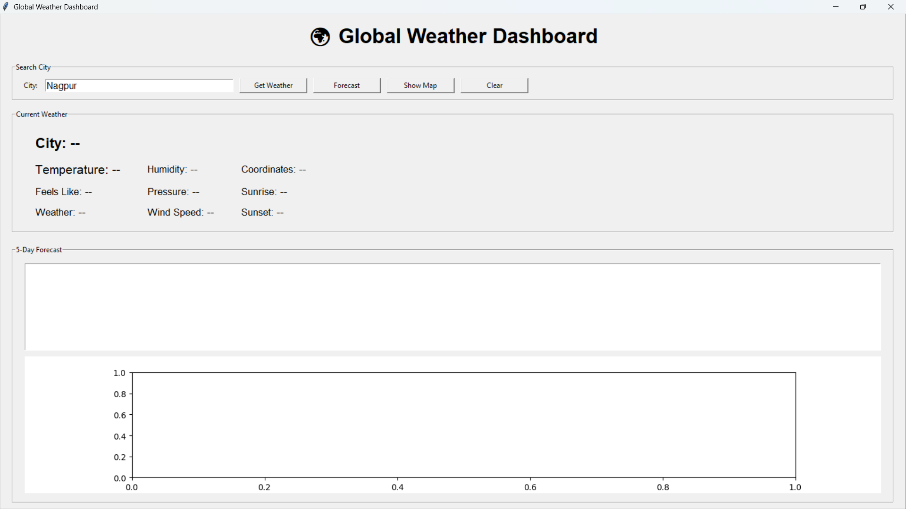
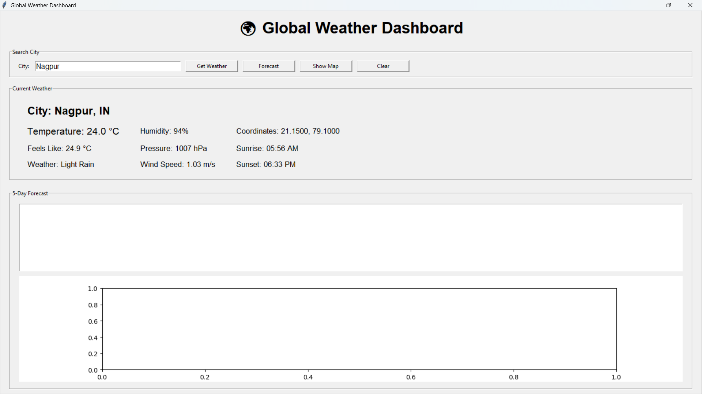
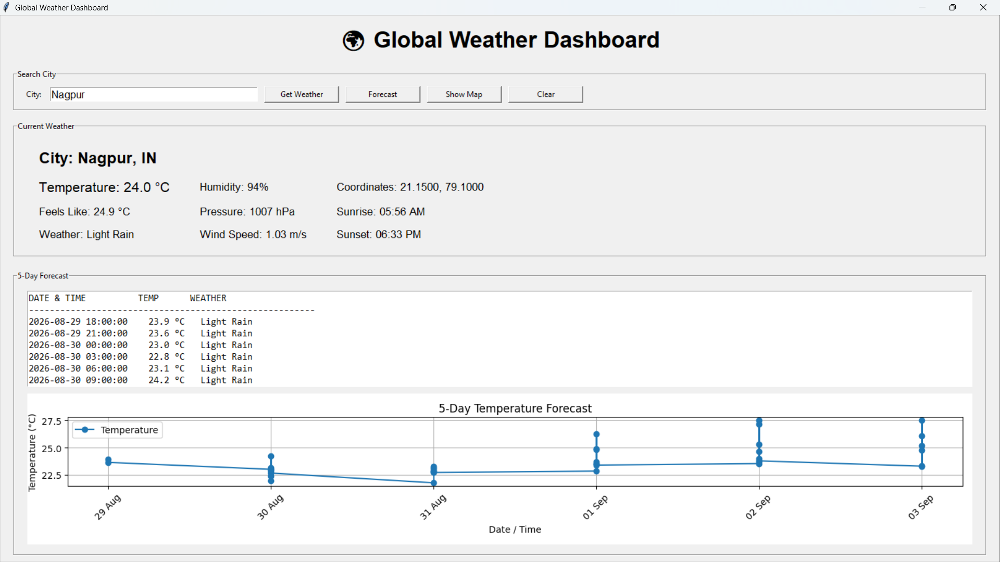
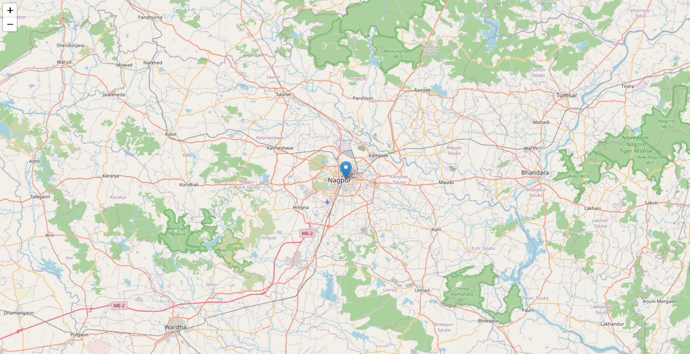

# 🚀 Day 49 - Global Weather Dashboard

Welcome to **Day 49** of my **100 Days, 100 Python Projects** challenge!

This project is a **Global Weather Dashboard GUI application** built using **Python, Tkinter, Requests, Matplotlib, and Folium**. The application allows users to search for weather information for cities around the world, view current weather conditions, check a 5-day forecast, visualize forecast temperatures, and view the selected city's location on an interactive map.

The main purpose of this project is to gain practical experience with **API Integration, JSON Data Processing, GUI Development, Data Visualization, Interactive Maps, and External Data Retrieval** using Python.

---

## 📌 Project Overview

Weather information is an excellent example of how applications can retrieve and process data from external APIs.

This project uses the **OpenWeather API** to retrieve weather information based on the city entered by the user.

The dashboard allows users to:

* 🌍 Search weather information for cities around the world
* 🌡️ View current temperature
* 🥶 View feels-like temperature
* ☁️ View current weather conditions
* 💧 View humidity
* 🌬️ View wind speed
* 📊 View atmospheric pressure
* 📍 View geographical coordinates
* 🌅 View sunrise time
* 🌇 View sunset time
* 📅 View a 5-day / 3-hour weather forecast
* 📈 Visualize forecast temperatures using Matplotlib
* 🗺️ View the city's location using an interactive Folium map
* 🔄 Clear the dashboard and search for another city
* ⚠️ Handle invalid city names and API errors

---

## ✨ Features

* 🖥️ Interactive Tkinter GUI
* 🌍 Global city weather search
* 🌐 OpenWeather API integration
* 🌡️ Current temperature
* 🥶 Feels-like temperature
* ☁️ Current weather description
* 💧 Humidity information
* 📊 Atmospheric pressure
* 🌬️ Wind speed
* 📍 Latitude and longitude
* 🌅 Sunrise time
* 🌇 Sunset time
* 📅 5-day weather forecast
* ⏰ 3-hour forecast intervals
* 📈 Forecast temperature graph
* 🗺️ Interactive weather map
* 📌 City location marker
* 💬 Weather information popup on map
* 🧹 Clear dashboard functionality
* ⚠️ Input validation
* 🚨 Error handling using message boxes
* 🔐 API key through environment variable
* 📊 Matplotlib graph embedded directly inside the GUI

---

## 🖼️ Application Screenshots

### 🖥️ 1. Main Dashboard



The main dashboard provides the city search interface along with the current weather information.

---

### 🌡️ 2. Current Weather Details



The dashboard displays detailed weather information including temperature, feels-like temperature, humidity, pressure, wind speed, coordinates, sunrise, and sunset.

---

### 📅 3. 5-Day Forecast



The forecast section displays weather predictions at 3-hour intervals along with the corresponding temperature information.

The temperature trend is also visualized using an embedded Matplotlib graph. 

The graph provides a visual representation of the predicted temperature changes throughout the forecast period.

---

### 🗺️ 4. Interactive Weather Map



The application generates an interactive Folium map showing the selected city's geographical location.

The marker popup displays the city's temperature and current weather condition.

---

## 🛠️ Technologies Used

* **Python 3**
* **Tkinter**
* **Requests**
* **OpenWeather API**
* **Matplotlib**
* **Folium**

### Python

Python is used to develop the complete application logic, including:

* API communication
* JSON data processing
* GUI development
* Weather information extraction
* Forecast processing
* Graph generation
* Interactive map generation
* Error handling

---

### Tkinter

Tkinter is Python's built-in GUI library and is used to create the application's graphical interface.

It provides:

* Input fields
* Buttons
* Labels
* Frames
* Text areas
* Message boxes

The main dashboard is completely built using Tkinter.

---

### Requests

The `requests` library is used to communicate with the OpenWeather API.

It sends HTTP GET requests and retrieves weather information in JSON format.

Example:

```python
params = {
    "q": city,
    "appid": API_KEY,
    "units": "metric"
}

response = requests.get(
    CURRENT_WEATHER_URL,
    params=params,
    timeout=10
)
```

The application then processes the returned JSON response.

---

### OpenWeather API

The **OpenWeather API** provides the weather information used by the application.

Two API endpoints are used:

```text
Current Weather API
https://api.openweathermap.org/data/2.5/weather
```

and:

```text
5-Day Forecast API
https://api.openweathermap.org/data/2.5/forecast
```

The current weather endpoint is used to retrieve information such as:

* Temperature
* Feels-like temperature
* Weather condition
* Humidity
* Pressure
* Wind speed
* Coordinates
* Sunrise
* Sunset

The forecast endpoint provides weather predictions for the next five days at approximately three-hour intervals.

---

### Matplotlib

Matplotlib is used to create the forecast temperature graph.

The graph is embedded directly into the Tkinter application using:

```python
FigureCanvasTkAgg
```

The graph displays:

* Forecast dates and times
* Temperature values
* Temperature trend
* Grid lines
* Legend

---

### Folium

Folium is used to create the interactive weather map.

The application creates a map centered on the selected city's latitude and longitude.

Example:

```python
weather_map = folium.Map(
    location=[latitude, longitude],
    zoom_start=10
)
```

A marker is then added to the map:

```python
folium.Marker(
    [latitude, longitude],
    popup=popup_text,
    tooltip=city
).add_to(weather_map)
```

The generated map is saved as an HTML file and opened automatically in the default web browser.

---

## 📂 Project Structure

```text
DAY_49/

│
├── main49.py
├── requirements.txt
├── README.md
│
└── screenshots/
    ├── main_dashboard.png
    ├── current_weather.png
    ├── forecast.png
    └── weather_map.png
```

### File Description

| File / Folder      | Purpose                           |
| ------------------ | --------------------------------- |
| `main49.py`        | Main Python application           |
| `requirements.txt` | Python dependencies               |
| `README.md`        | Project documentation             |
| `screenshots/`     | Application screenshots           |
| `weather_map.html` | Generated interactive weather map |

> `weather_map.html` is generated automatically when the **Show Map** button is used.

---

## 📦 requirements.txt

The project requires the following Python libraries:

```text
requests
pandas
matplotlib
folium
```

Install all dependencies using:

```bash
pip install -r requirements.txt
```

> **Note:** `pandas` is included in the requirements because it is listed in the project's dependency file, although the current application code does not directly use Pandas.

---

## 🔐 OpenWeather API Key

This project requires an API key from **OpenWeather**.

The application reads the API key from an environment variable:

```text
OPENWEATHER_API_KEY
```

The code intentionally does not hard-code the API key.

The application checks:

```python
if not API_KEY:
    raise ValueError(
        "OpenWeather API key not found."
    )
```

This is a safer approach than directly writing the API key inside the source code.

### Windows

You can set the environment variable using:

```bash
set OPENWEATHER_API_KEY=your_api_key_here
```

For PowerShell:

```powershell
$env:OPENWEATHER_API_KEY="your_api_key_here"
```

Then run:

```bash
python main49.py
```

> **Important:** Never commit your actual API key to GitHub. If you use an environment variable, make sure your secrets are not accidentally included in your repository.

---

## ▶️ How to Run

### 1. Make sure Python is installed

Check your Python version:

```bash
python --version
```

---

### 2. Open the project folder

Open a terminal inside the `DAY_49` folder.

---

### 3. Install the required dependencies

```bash
pip install -r requirements.txt
```

---

### 4. Configure the OpenWeather API key

Set the `OPENWEATHER_API_KEY` environment variable.

For example, on Windows PowerShell:

```powershell
$env:OPENWEATHER_API_KEY="your_api_key_here"
```

---

### 5. Run the application

```bash
python main49.py
```

The **Global Weather Dashboard** GUI window will open automatically.

---

## 🔎 Searching for Weather

The application provides a city input field where users can enter a city name.

For example:

```text
Nagpur
```

Other examples include:

```text
Mumbai
Delhi
Pune
Bengaluru
London
Tokyo
New York
Paris
Dubai
```

After entering the city name, click:

```text
Get Weather
```

The application retrieves the current weather information from the OpenWeather API.

---

## 🌡️ Current Weather Information

After successfully retrieving weather data, the dashboard displays:

### City

The city name and country code.

Example:

```text
City: Nagpur, IN
```

### Temperature

Current temperature in Celsius.

```text
Temperature: 25.4 °C
```

### Feels Like

The apparent temperature based on weather conditions.

```text
Feels Like: 26.1 °C
```

### Weather

Current weather condition.

Example:

```text
Weather: Clear Sky
```

### Humidity

Relative humidity percentage.

```text
Humidity: 65%
```

### Pressure

Atmospheric pressure in hectopascals.

```text
Pressure: 1012 hPa
```

### Wind Speed

Current wind speed.

```text
Wind Speed: 3.5 m/s
```

### Coordinates

The geographical coordinates of the city.

```text
Coordinates: 21.1458, 79.0882
```

### Sunrise

Local sunrise time provided by the weather API.

### Sunset

Local sunset time provided by the weather API.

---

## 📅 5-Day Weather Forecast

The **Forecast** button retrieves forecast data from the OpenWeather 5-day forecast endpoint.

The forecast contains weather information at approximately **3-hour intervals**.

The application displays:

```text
DATE & TIME          TEMP      WEATHER
-------------------------------------------------------
2026-08-29 12:00:00   29.4 °C   Clear Sky
2026-08-29 15:00:00   30.1 °C   Few Clouds
...
```

The forecast information is displayed directly inside the Tkinter application.

---

## 📈 Forecast Temperature Visualization

After loading the forecast, the application extracts:

* Forecast date/time
* Forecast temperature

These values are then plotted using Matplotlib.

The graph contains:

* Temperature values
* Forecast timeline
* Temperature markers
* X-axis labels
* Y-axis temperature values
* Grid
* Legend

The graph is embedded directly into the Tkinter GUI rather than opening as a separate Matplotlib window.

---

## 🗺️ Interactive Weather Map

The **Show Map** button creates an interactive map using Folium.

The map is centered using the weather API's geographical coordinates:

```python
latitude = self.weather_data["coord"]["lat"]
longitude = self.weather_data["coord"]["lon"]
```

The application then creates the map:

```python
weather_map = folium.Map(
    location=[latitude, longitude],
    zoom_start=10
)
```

A marker is placed at the selected city.

The marker popup displays:

```text
City
Temperature
Weather
```

The map is saved as:

```text
weather_map.html
```

The application then opens the generated HTML file in the default browser.

---

## 🧹 Clear Dashboard

The **Clear** button resets the dashboard.

It clears:

* Current weather information
* Forecast information
* Forecast graph
* Stored weather data
* Stored forecast data
* Status information

After clearing the dashboard, users can search for another city.

---

## ⚠️ Input Validation

The application validates user input before making API requests.

If the city field is empty, the application displays:

```text
Please enter a city name.
```

This prevents unnecessary API requests.

---

## 🚨 Error Handling

The application handles several possible API and network errors.

### Missing API Key

```text
OpenWeather API key not found.
```

### Invalid API Key

```text
Invalid OpenWeather API key.
```

### City Not Found

```text
City not found.
```

### API Errors

Other HTTP errors are reported using an appropriate error message.

The application also uses a request timeout:

```python
timeout=10
```

This prevents the application from waiting indefinitely for a response.

---

## 🔄 Application Workflow

The overall workflow of the application is:

```text
Enter City
     ↓
Click "Get Weather"
     ↓
Validate City Input
     ↓
Send Request to OpenWeather API
     ↓
Receive JSON Response
     ↓
Process Weather Data
     ↓
Display Current Weather
     ↓
     ├── Forecast
     │      ↓
     │   Retrieve 5-Day Forecast
     │      ↓
     │   Display Forecast
     │      ↓
     │   Plot Temperature Graph
     │
     └── Show Map
            ↓
       Get Latitude & Longitude
            ↓
       Create Folium Map
            ↓
       Add Weather Marker
            ↓
       Open Map in Browser
```

---

## 🧩 Functions Practiced

### API Functions

| Function                  | Purpose                                     |
| ------------------------- | ------------------------------------------- |
| `fetch_current_weather()` | Retrieves current weather information       |
| `fetch_forecast()`        | Retrieves 5-day forecast data               |
| `format_time()`           | Converts Unix timestamps into readable time |

### GUI Functions

| Function            | Purpose                                |
| ------------------- | -------------------------------------- |
| `create_widgets()`  | Creates the dashboard interface        |
| `get_weather()`     | Retrieves and displays current weather |
| `display_weather()` | Updates weather information on the GUI |
| `show_forecast()`   | Retrieves and displays forecast data   |
| `clear_dashboard()` | Resets the dashboard                   |

### Visualization Functions

| Function          | Purpose                                       |
| ----------------- | --------------------------------------------- |
| `plot_forecast()` | Creates the forecast temperature graph        |
| `show_map()`      | Creates and opens the interactive weather map |

---

## 🖥️ GUI Components Used

The project uses several Tkinter components:

| Component           | Purpose                             |
| ------------------- | ----------------------------------- |
| `Tk()`              | Creates the main application window |
| `Label`             | Displays weather information        |
| `Entry`             | Accepts city names                  |
| `Button`            | Performs application actions        |
| `LabelFrame`        | Organizes dashboard sections        |
| `Text`              | Displays forecast information       |
| `messagebox`        | Displays errors and warnings        |
| `FigureCanvasTkAgg` | Embeds Matplotlib inside Tkinter    |

---

## 📚 Concepts Practiced

* Python Programming
* Object-Oriented Programming
* Tkinter GUI Development
* REST API Integration
* HTTP Requests
* JSON Data Processing
* OpenWeather API
* API Authentication
* Environment Variables
* Error Handling
* Exception Handling
* Input Validation
* Weather Data Processing
* Date and Time Conversion
* Data Visualization
* Matplotlib
* Embedded Graphs
* Interactive Maps
* Folium
* HTML File Generation
* External Data Retrieval
* GUI Event Handling

---

## 🎯 Learning Outcome

This project helped me understand:

* How to integrate a third-party API with Python
* How to send HTTP GET requests using Requests
* How to work with JSON API responses
* How to authenticate API requests using an API key
* How to use environment variables for API credentials
* How to retrieve current weather information
* How to retrieve a 5-day weather forecast
* How to process timestamps returned by APIs
* How to convert Unix timestamps into readable time
* How to display API data inside a Tkinter GUI
* How to create temperature visualizations using Matplotlib
* How to embed Matplotlib graphs into Tkinter
* How to generate interactive maps using Folium
* How to add markers and popups to maps
* How to generate and open HTML files from Python
* How to handle API failures gracefully
* How to combine multiple Python libraries into a single application
* How external APIs can be used to build practical real-world applications

---

## 🔮 Future Improvements

Possible enhancements for future versions:

* 🌡️ Add temperature unit selection between Celsius, Fahrenheit, and Kelvin
* 🌍 Add automatic location detection
* 📍 Add current location weather
* 🔎 Add city autocomplete
* 🌎 Add country and state selection
* 🌤️ Add weather icons
* 🌧️ Add precipitation information
* 👁️ Add visibility information
* ☁️ Add cloud coverage
* 🌬️ Add wind direction
* 💨 Add wind gust information
* 🌡️ Add minimum and maximum temperature
* 📊 Add humidity and pressure charts
* 📈 Add longer-term weather history
* 🗺️ Display multiple cities on the same map
* 📌 Add weather markers for multiple locations
* 🌐 Add interactive Plotly visualizations
* 🔔 Add severe weather alerts
* 📱 Create a responsive web version
* 🌙 Add Dark Mode
* 🎨 Improve the GUI design
* 💾 Add weather history storage
* 📄 Export weather reports
* 📊 Add weather comparison between cities
* 🔄 Add automatic weather updates
* 📈 Add historical weather analysis

---

## ⚠️ Disclaimer

This project is created for **educational and programming practice purposes**.

Weather information is retrieved from the OpenWeather API and may vary depending on API availability, update frequency, and network conditions.

The weather information displayed by this application should not be considered a substitute for official weather warnings or emergency information.

---

## 📅 Challenge

This project is part of my **100 Days, 100 Python Projects** challenge, where I build one Python project every day to improve my Python programming skills, strengthen my problem-solving abilities, learn new technologies, and maintain consistency through daily coding.

**Day 49** focuses on **API Integration and Weather Data Visualization**, combining **OpenWeather API for weather data**, **Requests for HTTP communication**, **Tkinter for GUI development**, **Matplotlib for data visualization**, and **Folium for interactive maps** to create a practical Global Weather Dashboard.

Through this project, I explored how external APIs can be integrated with Python applications to retrieve real-world data and transform that data into useful graphical and interactive experiences.

---

## 👨‍💻 Author

**Abhijit Munghate**

Happy Coding! 🚀🐍🌍🌦️
