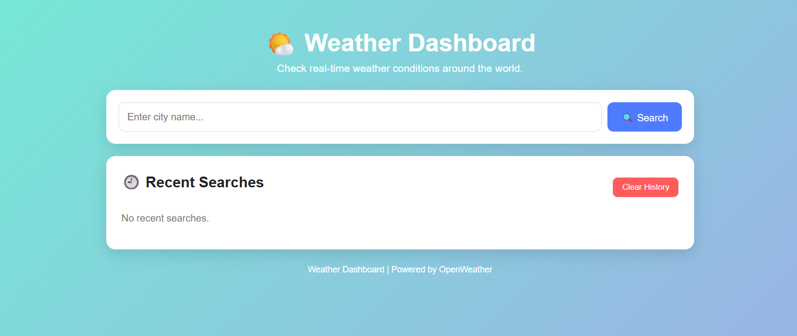
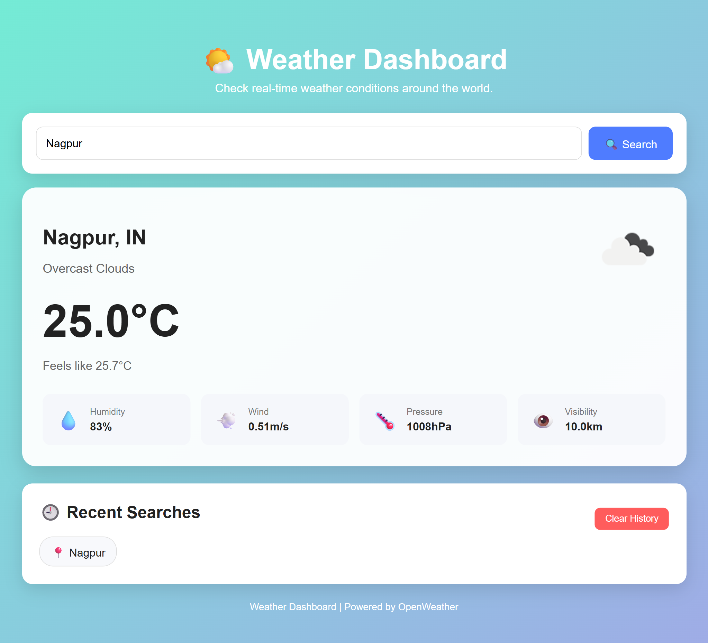
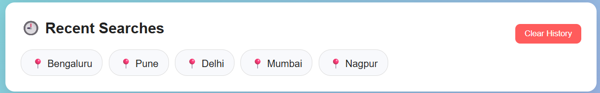
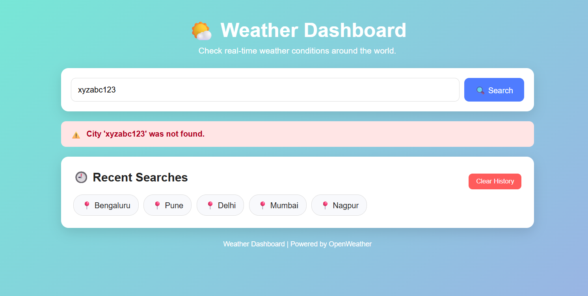

# 🌤️ Day 50 - Weather Dashboard App

Welcome to **Day 50** of my **100 Days, 100 Python Projects** challenge!

This project is a **Weather Dashboard Web Application** built using **Python, Flask, HTML, CSS, JavaScript, and the OpenWeather API**.

The application allows users to search for a city and view its **real-time weather information**, including temperature, feels-like temperature, humidity, wind speed, atmospheric pressure, visibility, and weather conditions.

The project also includes a **recent search history feature** using browser `localStorage`, responsive design for different screen sizes, API error handling, and support for deployment using **Gunicorn**.

The main goal of this project was to strengthen my understanding of **Flask web development, REST APIs, HTTP requests, JSON data processing, frontend-backend communication, JavaScript local storage, and web application deployment**.

---

## 📌 Project Overview

The Weather Dashboard provides a simple and interactive interface for checking current weather conditions for cities around the world.

Users can:

* 🌍 Search for any city
* 🌡️ View the current temperature
* 🤗 View the feels-like temperature
* ☁️ View current weather conditions
* 💧 Check humidity
* 💨 Check wind speed
* 🌡️ Check atmospheric pressure
* 👁️ Check visibility
* 🖼️ View the corresponding weather icon
* 🕘 View recently searched cities
* 🔄 Search a city again from search history
* 🗑️ Clear search history
* ⚠️ Receive meaningful error messages
* 📱 Use the application on desktop and mobile devices

The application fetches weather data from the **OpenWeather API** and displays the processed information through a Flask-powered web interface.

---

## ✨ Features

* 🌤️ Real-time weather information
* 🔍 City-based weather search
* 🌡️ Temperature display in Celsius
* 🤗 Feels-like temperature
* ☁️ Weather condition and description
* 💧 Humidity information
* 💨 Wind speed
* 🌡️ Atmospheric pressure
* 👁️ Visibility information
* 🖼️ Dynamic weather icons
* 🕘 Recent search history
* 💾 Browser localStorage support
* 🗑️ Clear search history
* ⚠️ API and input error handling
* 🚨 User-friendly error messages
* 📱 Responsive design
* 🎨 Modern gradient-based interface
* 🔐 API key stored using environment variables
* ⏱️ HTTP request timeout handling
* 🌐 Flask web framework
* 🚀 Gunicorn support for production deployment
* 📦 Simple dependency management using `requirements.txt`

---

## 🖼️ Application Screenshots

The project includes screenshots showing the main dashboard, weather information, search history, and error handling.

## Screenshots

### 🌤️ Main Dashboard



### 🌡️ Weather Information



### 🕘 Search History



### ⚠️ Error Handling



---

## 🌐 Live Demo

The application will be available online after deployment.

**Live Website:**
`https://day-50-weather-dashboard.onrender.com`

> Replace the URL above with your actual Render deployment URL after deployment.

---

## 🛠️ Technologies Used

* **Python 3**
* **Flask**
* **Requests**
* **HTML5**
* **CSS3**
* **JavaScript**
* **OpenWeather API**
* **Jinja2**
* **Browser localStorage**
* **Gunicorn**

### Python

Python is used as the main programming language for implementing the backend logic, API communication, weather data processing, and Flask application.

### Flask

Flask is used to create the web application and handle HTTP requests.

The application contains routes for:

* Displaying the dashboard
* Processing weather searches
* Handling 404 errors
* Handling 500 errors

### Requests

The `requests` library is used to communicate with the OpenWeather API.

The application sends the city name and API key to the weather service and receives the weather information as JSON.

### HTML

HTML is used to create the structure of the Weather Dashboard.

It provides:

* Search form
* Weather information section
* Weather details cards
* Search history section
* Error message section
* Footer

### CSS

CSS is used to create the visual appearance of the application.

The interface includes:

* Gradient background
* Card-based layout
* Responsive grid
* Styled search form
* Weather information cards
* Hover effects
* Mobile responsiveness

### JavaScript

JavaScript is used to manage the recent search history.

The application uses browser `localStorage` to:

* Store searched cities
* Retrieve previous searches
* Display recent searches
* Remove duplicate searches
* Limit history to 10 cities
* Clear the complete search history

### OpenWeather API

The OpenWeather API provides the real-time weather information used by the application.

The API provides information such as:

* City
* Country
* Temperature
* Feels-like temperature
* Weather description
* Humidity
* Atmospheric pressure
* Wind speed
* Visibility
* Weather icon

### Gunicorn

Gunicorn is used as the production WSGI server for deploying the Flask application.

The application can be started with:

```bash
gunicorn main50:app
```

---

## 📂 Project Structure

```text
DAY_50/
│
├── main50.py
├── requirements.txt
├── README.md
├── Procfile
│
├── templates/
│   └── index.html
│
├── static/
│   ├── css/
│   │   └── style.css
│   │
│   └── js/
│       └── script.js
│
└── screenshots/
    ├── main-dashboard.png
    ├── weather-information.png
    ├── search-history.png
    └── error-handling.png
```

---

## 📦 requirements.txt

The project requires Flask, Requests, and Gunicorn.

```text
Flask
requests
gunicorn
```

Install the dependencies using:

```bash
pip install -r requirements.txt
```

---

## 🔑 OpenWeather API Key

This application requires an **OpenWeather API key** to retrieve weather information.

The API key is not hard-coded into the Python source code.

Instead, the application reads it from an environment variable:

```python
API_KEY = os.getenv("OPENWEATHER_API_KEY")
```

This is a safer approach because sensitive credentials should not be directly stored inside the source code.

### Environment Variable

The application expects:

```text
OPENWEATHER_API_KEY
```

to contain the OpenWeather API key.

---

## ▶️ How to Run Locally

### 1. Make sure Python is installed

Check your Python version:

```bash
python --version
```

---

### 2. Open the project folder

Open a terminal inside the `DAY_50` folder.

---

### 3. Install dependencies

```bash
pip install -r requirements.txt
```

---

### 4. Configure the API key

Set the `OPENWEATHER_API_KEY` environment variable.

#### Windows Command Prompt

```cmd
set OPENWEATHER_API_KEY=your_api_key_here
```

#### Windows PowerShell

```powershell
$env:OPENWEATHER_API_KEY="your_api_key_here"
```

#### Linux / macOS

```bash
export OPENWEATHER_API_KEY="your_api_key_here"
```

---

### 5. Run the Flask application

```bash
python main50.py
```

The application will start locally.

Open the URL shown in the terminal, usually:

```text
http://127.0.0.1:5000/
```

---

## 🌐 How the Application Works

The application follows a simple request and response flow.

```text
User enters city
       ↓
HTML search form
       ↓
Flask POST request
       ↓
fetch_weather()
       ↓
OpenWeather API
       ↓
JSON weather response
       ↓
parse_weather()
       ↓
Simplified weather data
       ↓
Jinja2 template
       ↓
Weather Dashboard
```

---

## 🔍 Weather Search

The user enters a city name into the search field.

For example:

```text
Mumbai
```

The form sends a `POST` request to the Flask application.

```python
@app.route('/', methods=["GET", "POST"])
def home():
```

The city name is retrieved using:

```python
searched_city = request.form.get("city", "").strip()
```

The application then passes the city name to:

```python
fetch_weather(searched_city)
```

---

## 🌐 Fetching Weather Data

The `fetch_weather()` function communicates with the OpenWeather API.

The request parameters include:

```python
params = {
    "q": city,
    "appid": API_KEY,
    "units": "metric"
}
```

The `metric` unit ensures that temperature is returned in Celsius.

The request also uses a timeout:

```python
requests.get(BASE_URL, params=params, timeout=10)
```

This prevents the application from waiting indefinitely for the weather service.

---

## 📊 Processing API Data

The OpenWeather API returns a JSON response containing many fields.

Instead of passing the complete response directly to the template, the application extracts the required information using:

```python
parse_weather(data)
```

The function creates a simplified weather dictionary containing:

```text
City
Country
Temperature
Feels Like
Description
Humidity
Pressure
Wind Speed
Visibility
Weather Icon
Icon Code
```

This makes the data easier to use in the HTML template.

---

## 🌡️ Weather Information Displayed

The dashboard displays the following information.

### 🌡️ Temperature

The current temperature is displayed in Celsius.

Example:

```text
28.5°C
```

---

### 🤗 Feels Like

Shows the apparent temperature experienced by the user.

Example:

```text
Feels like 30.2°C
```

---

### ☁️ Weather Description

Displays the current weather condition.

Examples:

```text
Clear Sky
Clouds
Light Rain
Thunderstorm
```

---

### 💧 Humidity

Displays the relative humidity percentage.

Example:

```text
Humidity
72%
```

---

### 💨 Wind Speed

Displays wind speed in meters per second.

Example:

```text
Wind
4.1 m/s
```

---

### 🌡️ Atmospheric Pressure

Displays atmospheric pressure in hectopascals.

Example:

```text
Pressure
1012 hPa
```

---

### 👁️ Visibility

The API provides visibility in meters.

The application converts it into kilometers:

```python
data.get("visibility", 0) / 1000
```

Example:

```text
Visibility
10.0 km
```

---

## 🖼️ Dynamic Weather Icons

The application retrieves the weather icon code from the OpenWeather response.

```python
icon_code = weather_info["icon"]
```

The icon URL is generated using:

```python
ICON_URL.format(icon_code)
```

The resulting image is displayed dynamically in the dashboard.

---

## 🕘 Recent Search History

The application includes a recent search history feature using JavaScript and browser `localStorage`.

The history is stored using:

```javascript
const HISTORY_KEY = "weatherSearchHistory";
```

The application stores a maximum of:

```javascript
const MAX_HISTORY = 10;
```

cities.

---

## 💾 LocalStorage

When a city is successfully searched, it is saved in the browser.

The application uses:

```javascript
localStorage.setItem(
    HISTORY_KEY,
    JSON.stringify(history)
);
```

This allows the search history to remain available even after refreshing the page.

---

## 🔄 Duplicate Search Handling

Before adding a city to the history, existing entries are removed:

```javascript
history = history.filter(
    item => item.toLowerCase() !== city.toLowerCase()
);
```

This prevents duplicate city names from appearing in the search history.

The latest search is then placed at the beginning:

```javascript
history.unshift(city);
```

---

## 📋 Search History Limit

The application keeps only the latest 10 searches:

```javascript
history = history.slice(0, MAX_HISTORY);
```

This keeps the interface clean and prevents unlimited local storage growth.

---

## 🔍 Searching From History

Users can click a city from the recent search list.

JavaScript creates a POST form dynamically:

```javascript
const form = document.createElement("form");
form.method = "POST";
form.action = "/";
```

The selected city is then submitted back to Flask.

This allows users to quickly search for a previously searched city.

---

## 🗑️ Clear Search History

Users can clear their complete search history using the **Clear History** button.

The application removes the stored data with:

```javascript
localStorage.removeItem(HISTORY_KEY);
```

The history display is then refreshed.

---

## ⚠️ Error Handling

The application includes multiple levels of error handling to provide meaningful feedback to users.

### Missing API Key

If the API key is not configured:

```text
OpenWeather API key is not configured.
```

---

### Empty City

If the user submits an empty city name:

```text
Please enter a city name.
```

---

### API Timeout

If the weather service takes too long:

```text
Weather service took too long to respond.
```

---

### Connection Error

If the application cannot connect to the weather service:

```text
Unable to connect to the weather service.
```

---

### Invalid API Key

For an unauthorized API request:

```text
Invalid OpenWeather API key.
```

---

### City Not Found

If the requested city does not exist:

```text
City 'Example' was not found.
```

---

### API Rate Limit

If the API request limit is exceeded:

```text
Weather API request limit exceeded. Please try again later.
```

---

### Unexpected API Data

The application also handles unexpected API response structures:

```text
The weather service returned unexpected data.
```

---

## 🚨 HTTP Error Handling

The Flask application also defines custom handlers for common server errors.

### 404 Error

```python
@app.errorhandler(404)
def page_not_found(error):
```

Displays:

```text
Page not found.
```

---

### 500 Error

```python
@app.errorhandler(500)
def internal_server_error(error):
```

Displays:

```text
Internal server error. Please try again.
```

---

## 🎨 User Interface

The dashboard uses CSS to create a clean and modern interface.

The main visual elements include:

* 🌈 Gradient background
* 🃏 White weather cards
* 🔵 Styled search button
* 📊 Weather information grid
* 🕘 Search history section
* ⚠️ Error message cards
* ✨ Hover effects
* 📱 Responsive layout

---

## 📱 Responsive Design

The application is designed to work on different screen sizes.

For tablets, the weather details use a two-column layout.

For smaller mobile screens, the layout changes to a single-column design.

The search form also changes from a horizontal layout to a vertical layout on smaller screens.

This is achieved using CSS media queries:

```css
@media (max-width: 800px)
```

and:

```css
@media (max-width: 600px)
```

---

## 🔐 API Key Security

The project uses an environment variable instead of directly placing the API key inside the Python source code.

```python
API_KEY = os.getenv("OPENWEATHER_API_KEY")
```

This helps prevent accidentally exposing the API key when the project is uploaded to GitHub.

### Important

The actual API key should **never** be committed to GitHub.

For example, avoid:

```python
API_KEY = "my-secret-api-key"
```

Instead, use:

```python
API_KEY = os.getenv("OPENWEATHER_API_KEY")
```

---

## 🚀 Deployment

The application is designed to be deployed as a Flask web application using **Gunicorn**.

The production server command is:

```bash
gunicorn main50:app
```

Here:

```text
main50
```

is the Python file containing the Flask application, and:

```text
app
```

is the Flask application object.

---

## 📄 Procfile

For platforms that use a `Procfile`, the project can include:

```text
web: gunicorn main50:app
```

This tells the hosting platform to start the Flask application using Gunicorn.

---

## 🌐 Deployment Environment Variable

When deploying the application, configure the following environment variable in the hosting platform:

```text
OPENWEATHER_API_KEY
```

Set its value to your OpenWeather API key.

The API key should be configured through the hosting platform's environment variable settings rather than being included in the source code.

---

## 🧩 Important Python Functions Practiced

| Function / Concept     | Purpose                            |
| ---------------------- | ---------------------------------- |
| `os.getenv()`          | Reads environment variables        |
| `requests.get()`       | Sends HTTP requests                |
| `response.json()`      | Converts API response to JSON data |
| `response.status_code` | Checks HTTP response status        |
| `dict.get()`           | Safely retrieves dictionary values |
| `.strip()`             | Removes unnecessary whitespace     |
| `render_template()`    | Renders HTML templates             |
| `request.form.get()`   | Retrieves submitted form data      |
| `app.route()`          | Creates Flask routes               |
| `app.errorhandler()`   | Handles HTTP errors                |

---

## 🧩 JavaScript Functions Practiced

| Function / Concept          | Purpose                                   |
| --------------------------- | ----------------------------------------- |
| `localStorage.getItem()`    | Retrieves stored history                  |
| `localStorage.setItem()`    | Saves search history                      |
| `localStorage.removeItem()` | Deletes search history                    |
| `JSON.parse()`              | Converts JSON string into JavaScript data |
| `JSON.stringify()`          | Converts JavaScript data into JSON        |
| `filter()`                  | Removes duplicate cities                  |
| `unshift()`                 | Adds a city to the beginning              |
| `slice()`                   | Limits history size                       |
| `createElement()`           | Creates HTML elements dynamically         |
| `addEventListener()`        | Handles user interactions                 |
| `DOMContentLoaded`          | Runs code after page loading              |

---

## 🖥️ Flask Components Used

| Flask Component       | Purpose                       |
| --------------------- | ----------------------------- |
| `Flask()`             | Creates the Flask application |
| `render_template()`   | Renders HTML pages            |
| `request`             | Handles form submissions      |
| `@app.route()`        | Defines application routes    |
| `@app.errorhandler()` | Defines custom error handlers |

---

## 📚 Concepts Practiced

* Python Programming
* Flask Web Development
* REST API Integration
* HTTP Requests
* JSON Data Processing
* API Response Handling
* Environment Variables
* API Key Security
* HTML5
* CSS3
* JavaScript
* Jinja2 Templates
* Browser localStorage
* DOM Manipulation
* Event Handling
* Responsive Web Design
* Error Handling
* Exception Handling
* HTTP Status Codes
* Client-Server Architecture
* Frontend-Backend Communication
* Gunicorn
* Web Application Deployment

---

## 🎯 Learning Outcome

This project helped me understand:

* How to build a web application using Flask
* How Flask handles GET and POST requests
* How to integrate a third-party REST API
* How to send HTTP requests using Python
* How to process JSON API responses
* How to extract useful information from nested JSON data
* How to display dynamic data using Jinja2
* How to handle API errors and exceptions
* How HTTP status codes work
* How to use environment variables for API keys
* Why sensitive credentials should not be hard-coded
* How JavaScript interacts with HTML elements
* How browser localStorage works
* How to implement recent search history
* How to create responsive web interfaces
* How to connect frontend and backend components
* How to use Gunicorn for Flask deployment
* How to structure a Flask project

---

## 🔮 Future Improvements

Possible enhancements for future versions:

* 📅 Add 5-day weather forecast
* 🌡️ Add hourly weather forecast
* 🌍 Add country and timezone information
* 🌅 Add sunrise and sunset times
* 🌙 Add automatic Dark Mode
* 📍 Add current location weather
* 🗺️ Add interactive weather maps
* 📊 Add weather charts
* 🌧️ Add precipitation information
* 🌬️ Add wind direction
* ☀️ Add UV index
* 🧭 Add compass/wind visualization
* 🌡️ Add minimum and maximum temperature
* 🔔 Add severe weather alerts
* ⭐ Allow users to save favorite cities
* 🔐 Add user accounts
* 🗃️ Store search history on the server
* 🎨 Improve UI animations
* 📱 Convert the application into a Progressive Web App
* ⚡ Add caching to reduce repeated API requests
* 🧪 Add automated tests
* 🐳 Add Docker support
* 🚀 Add CI/CD deployment

---

## 📅 Challenge

This project is part of my **100 Days, 100 Python Projects** challenge, where I build one Python project every day to improve my programming skills, strengthen my problem-solving abilities, learn new technologies, and maintain consistency through daily coding.

**Day 50** focuses on **Flask web development and REST API integration**, while combining backend Python development with HTML, CSS, JavaScript, browser storage, responsive UI design, and real-time weather data.

---

## 👨‍💻 Author

**Abhijit Munghate**

Happy Coding! 🚀🐍🌤️
