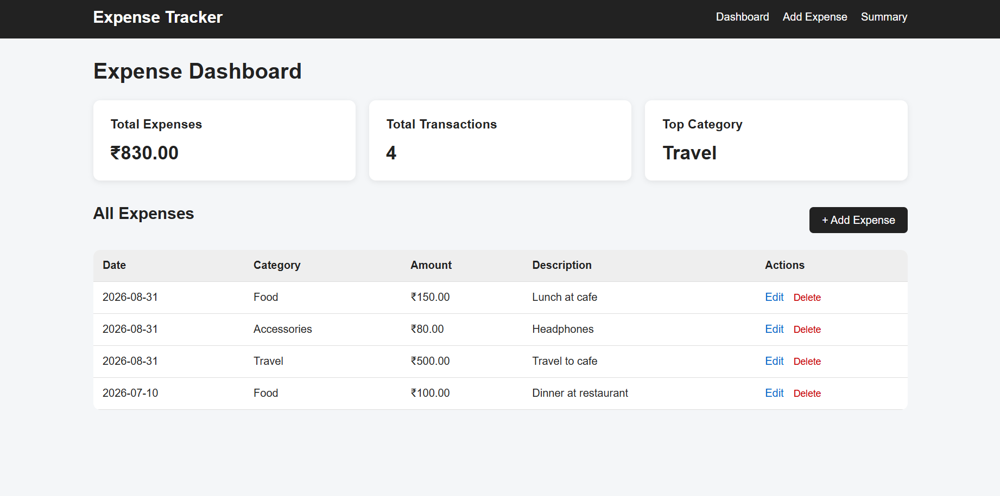
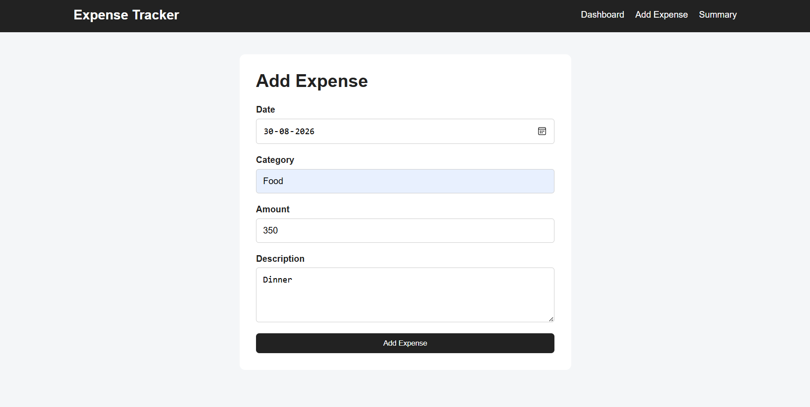
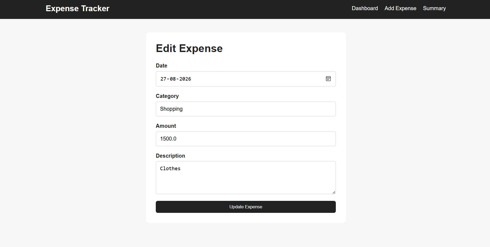
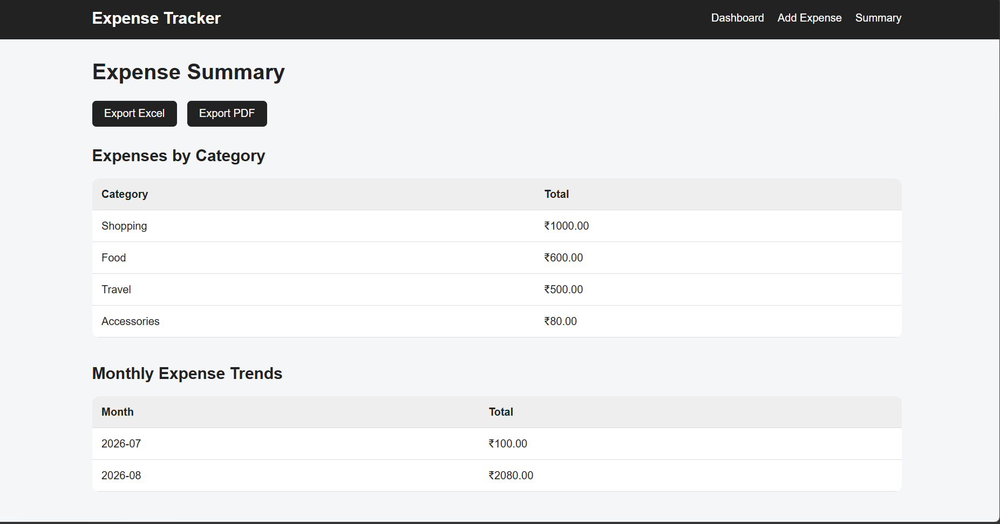
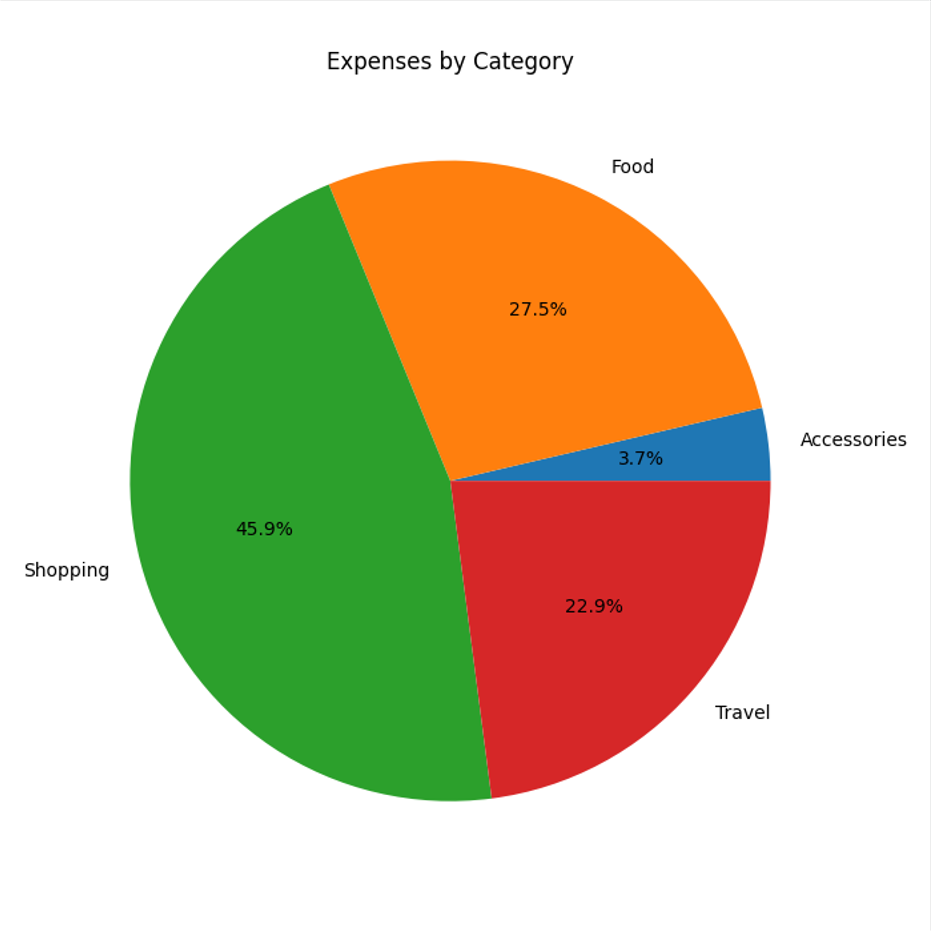
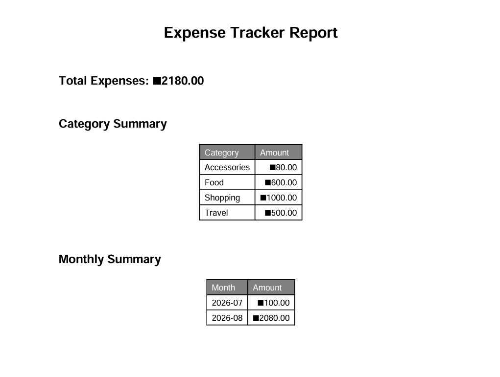

# 💰 Day 51 - Expense Tracker

Welcome to **Day 51** of my **100 Days, 100 Python Projects** challenge!

This project is a **web-based Expense Tracker application** built using **Python, Flask, Pandas, Matplotlib, HTML, CSS, CSV, Excel, and ReportLab**.

The application allows users to record, edit, delete, and analyze their daily expenses through a simple web interface. It also provides expense summaries by category and month, visualizations of spending patterns, and export functionality for both **Excel and PDF reports**.

The main goal of this project was to strengthen my understanding of **Flask web development, CRUD operations, Pandas data analysis, data visualization, file handling, report generation, and frontend-backend integration**.

---

## 📌 Project Overview

The Expense Tracker provides a centralized interface for recording and analyzing personal expenses.

Users can:

* ➕ Add new expenses
* ✏️ Edit existing expenses
* 🗑️ Delete expenses
* 📋 View all recorded expenses
* 💰 View total expenses
* 🔢 View total number of transactions
* 🏷️ Identify the highest-spending category
* 📊 Analyze expenses by category
* 📅 Analyze monthly expense trends
* 📈 Generate expense visualizations
* 📥 Export expense data to Excel
* 📄 Generate PDF expense reports
* ⚠️ Receive validation and error messages
* 📱 Use the application on different screen sizes

The application stores expense records in a **CSV file** and uses **Pandas** for data processing and analysis.

---

## ✨ Features

* 💰 Expense tracking
* ➕ Add expenses
* ✏️ Edit expenses
* 🗑️ Delete expenses
* 📋 Expense dashboard
* 📊 Total expense calculation
* 🔢 Transaction count
* 🏷️ Top expense category
* 📂 CSV-based data storage
* 📈 Category expense visualization
* 📅 Monthly expense visualization
* 📊 Category-wise expense summary
* 📆 Monthly expense summary
* 📥 Excel export
* 📄 PDF report generation
* ⚠️ Input validation
* 🚨 Flash messages for success and errors
* 🖥️ Responsive web interface
* 🎨 Clean card and table-based UI
* 📊 Pandas-powered data analysis
* 📈 Matplotlib-powered charts
* 📑 ReportLab-powered PDF generation

---

## 🖼️ Application Screenshots

The project includes screenshots demonstrating the main dashboard, expense entry, editing, summaries, visualizations, and generated PDF report.

## 📸 Screenshots

### 💰 Dashboard



The dashboard displays:

* Total expenses
* Total transactions
* Highest-spending category
* Complete expense table
* Edit and Delete actions

---

### ➕ Add Expense



The Add Expense page allows users to enter:

* Date
* Category
* Amount
* Description

---

### ✏️ Edit Expense



The Edit Expense page allows users to modify an existing expense record.

---

### 📊 Expense Summary



The Summary page displays:

* Expenses grouped by category
* Monthly expense totals
* Excel export option
* PDF export option

---

### 📈 Expense Visualization



Matplotlib is used to generate visual representations of expense data.

The application currently generates:

* Expenses by Category pie chart
* Monthly Expense Trends bar chart

---

### 📄 PDF Report



The application generates a PDF report containing:

* Total expenses
* Category summary
* Monthly summary

---

## 🛠️ Technologies Used

* **Python 3**
* **Flask**
* **Pandas**
* **Matplotlib**
* **HTML5**
* **CSS3**
* **CSV**
* **OpenPyXL**
* **ReportLab**

### Python

Python is used as the primary programming language for implementing the backend, data processing, validation, file handling, and report generation.

### Flask

Flask is used to create the web application and manage routes, forms, templates, redirects, and flash messages.

### Pandas

Pandas is used for:

* Reading CSV data
* Creating DataFrames
* Adding expense records
* Updating expense records
* Deleting records
* Grouping expenses
* Calculating totals
* Generating category summaries
* Generating monthly summaries
* Exporting data to Excel

### Matplotlib

Matplotlib is used to generate expense visualizations.

The application creates:

* Category expense pie chart
* Monthly expense trend bar chart

The application uses the non-interactive `Agg` backend:

```python
matplotlib.use("Agg")
```

This allows charts to be generated in environments without a graphical display, such as deployment servers.

### CSV

CSV is used as the primary storage format for expense records.

The application automatically creates the CSV file with the required columns if it does not already exist.

### OpenPyXL

OpenPyXL is used through Pandas to generate Excel files containing multiple sheets.

### ReportLab

ReportLab is used to generate downloadable PDF expense reports.

### HTML & CSS

HTML provides the structure of the application, while CSS is used to create the layout, navigation bar, cards, forms, tables, buttons, and responsive design.

---

## 📂 Project Structure

```text
100_DAYS_100_PROJECTS/
│
├── DAY_51/
│   │
│   ├── main51.py
│   ├── expenses.csv
│   ├── requirements.txt
│   ├── README.md
│   │
│   ├── templates/
│   │   ├── base.html
│   │   ├── index.html
│   │   ├── add_expense.html
│   │   ├── edit_expense.html
│   │   └── summary.html
│   │
│   └── static/
│       ├── style.css
│       └── charts/
│
└── ...
```

### File Description

| File / Folder       | Purpose                              |
| ------------------- | ------------------------------------ |
| `main51.py`         | Main Flask application               |
| `expenses.csv`      | Stores expense records               |
| `requirements.txt`  | Lists Python dependencies            |
| `README.md`         | Project documentation                |
| `templates/`        | Contains Flask HTML templates        |
| `base.html`         | Common page layout and navigation    |
| `index.html`        | Expense dashboard                    |
| `add_expense.html`  | Add expense form                     |
| `edit_expense.html` | Edit expense form                    |
| `summary.html`      | Expense summaries and export options |
| `static/style.css`  | Application styling                  |
| `static/charts/`    | Stores generated charts              |

---

## 📦 requirements.txt

The project uses the following Python libraries:

```text
Flask
pandas
matplotlib
openpyxl
reportlab
```

Install all dependencies using:

```bash
pip install -r requirements.txt
```

---

## ▶️ How to Run

### 1. Make sure Python is installed

Check the Python version:

```bash
python --version
```

---

### 2. Open the project folder

Open a terminal inside the `DAY_51` folder:

```bash
cd DAY_51
```

---

### 3. Install dependencies

```bash
pip install -r requirements.txt
```

---

### 4. Run the application

```bash
python main51.py
```

The Flask application will start locally.

Open the URL shown in the terminal, usually:

```text
http://127.0.0.1:5000/
```

---

## 🔄 How the Application Works

The application follows a simple Flask-based workflow:

```text
User
  ↓
Flask Web Interface
  ↓
Add / Edit / Delete Expense
  ↓
Pandas DataFrame
  ↓
expenses.csv
  ↓
Data Analysis
  ↓
Charts / Summary / Excel / PDF
```

---

# 💰 Expense Management

## ➕ Add Expense

Users can add a new expense using the **Add Expense** page.

The form accepts:

* Date
* Category
* Amount
* Description

Example:

```text
Date: 2026-08-31
Category: Food
Amount: 150
Description: Lunch at cafe
```

The application validates the date and amount before saving the expense.

A new DataFrame row is created:

```python
new_expense = pd.DataFrame([
    {
        "Date": date,
        "Category": category,
        "Amount": amount,
        "Description": description
    }
])
```

The new record is then added to the existing DataFrame and saved to the CSV file.

---

## ✏️ Edit Expense

Existing expenses can be modified using the **Edit** button.

The application retrieves the selected record using its DataFrame index.

Users can update:

* Date
* Category
* Amount
* Description

The updated data is then saved back to:

```text
expenses.csv
```

---

## 🗑️ Delete Expense

Users can delete an expense using the **Delete** button.

The application uses a POST request to remove the selected record:

```python
df = df.drop(df.index[index]).reset_index(drop=True)
```

The updated DataFrame is then saved back to the CSV file.

A confirmation dialog is also displayed in the browser before deletion.

---

# 📊 Dashboard

The main dashboard provides an overview of the user's expenses.

It displays three important statistics.

## 💰 Total Expenses

The application calculates the total amount spent using:

```python
total_expenses = df["Amount"].sum()
```

---

## 🔢 Total Transactions

The total number of recorded expenses is calculated using:

```python
total_transactions = len(df)
```

---

## 🏷️ Top Category

The application groups expenses by category and sorts them from highest to lowest:

```python
category_summary = (
    df.groupby("Category")["Amount"]
    .sum()
    .sort_values(ascending=False)
)
```

The first category in the resulting series is displayed as the highest-spending category.

---

# 📈 Expense Analysis

The application provides two main forms of expense analysis.

## 🏷️ Expenses by Category

Expenses are grouped by their category.

For example:

```text
Food          ₹600
Shopping      ₹1000
Travel        ₹500
Accessories   ₹80
```

This helps users understand where most of their money is being spent.

---

## 📅 Monthly Expense Trends

The application converts the expense dates into Pandas datetime values:

```python
temp_df["Date"] = pd.to_datetime(temp_df["Date"])
```

It then extracts the month:

```python
temp_df["Month"] = temp_df["Date"].dt.to_period("M")
```

Expenses are grouped by month to calculate monthly spending.

This makes it possible to identify changes in spending over time.

---

# 📊 Data Visualization

The application uses **Matplotlib** to generate charts.

## 🥧 Category Expense Chart

A pie chart shows the percentage distribution of expenses across different categories.

The chart is generated using:

```python
category_summary.plot(
    kind="pie",
    autopct="%1.1f%%"
)
```

The resulting chart is saved as:

```text
static/charts/category_expenses.png
```

---

## 📊 Monthly Expense Chart

A bar chart displays monthly expense totals.

The application generates the chart using:

```python
monthly_summary.plot(kind="bar")
```

The resulting chart is saved as:

```text
static/charts/monthly_expenses.png
```

---

## 📁 Chart Storage

Generated charts are stored inside:

```text
static/
└── charts/
    ├── category_expenses.png
    └── monthly_expenses.png
```

The chart directory is automatically created when the application starts:

```python
os.makedirs(CHART_DIR, exist_ok=True)
```

---

# 📥 Excel Export

The application allows users to export their expense information as an Excel workbook.

The Excel file is generated using Pandas and OpenPyXL.

The exported workbook contains three sheets:

### 1. Expenses

Contains the complete expense records.

### 2. Category Summary

Contains total expenses grouped by category.

### 3. Monthly Summary

Contains total expenses grouped by month.

The generated file is:

```text
expense_summary.xlsx
```

The application sends the file to the user using Flask's:

```python
send_file()
```

---

# 📄 PDF Export

The application can generate a PDF report using **ReportLab**.

The PDF contains:

* Expense Tracker Report title
* Total expenses
* Category summary
* Monthly summary

The report includes formatted tables for the category and monthly summaries.

The generated file is:

```text
expense_summary.pdf
```

The PDF is returned to the browser as a downloadable file.

---

# 📋 CSV Data Storage

Expense records are stored in:

```text
expenses.csv
```

The CSV file follows this structure:

```csv
Date,Category,Amount,Description
2026-08-31,Food,150.0,Lunch at cafe
2026-08-31,Accessories,80.0,Headphones
2026-08-31,Travel,500.0,Travel to cafe
2026-07-10,Food,100.0,Dinner at restaurant
2026-08-30,Food,350.0,Dinner
2026-08-27,Shopping,1000.0,Clothes
```

The application automatically initializes the file if it does not exist.

```python
def initialize_csv():
```

The required columns are:

```text
Date
Category
Amount
Description
```

---

# 🧹 Data Processing

The application uses Pandas to process the CSV data.

The amount column is converted to numeric values:

```python
df["Amount"] = pd.to_numeric(
    df["Amount"],
    errors="coerce"
)
```

This helps ensure that expense amounts can be used safely for calculations.

---

# ⚠️ Input Validation

The application validates user input before saving expenses.

## 📅 Date Validation

The date must follow the format:

```text
YYYY-MM-DD
```

The application validates the date using:

```python
datetime.strptime(date, "%Y-%m-%d")
```

Invalid dates result in an error message.

---

## 💰 Amount Validation

The amount must be a valid positive number.

The application checks:

```python
amount = float(amount)

if amount <= 0:
    raise ValueError
```

Therefore:

* Text values are rejected
* Zero is rejected
* Negative values are rejected
* Positive numeric values are accepted

---

## 🚨 Flash Messages

Flask flash messages are used to provide feedback to the user.

Examples include:

```text
Expense added successfully!
```

```text
Expense updated successfully!
```

```text
Expense deleted successfully!
```

Error messages are also displayed when invalid data is submitted.

---

# 🖥️ User Interface

The application uses a simple responsive interface built with HTML and CSS.

The interface includes:

* Navigation bar
* Dashboard cards
* Expense tables
* Add Expense form
* Edit Expense form
* Summary tables
* Export buttons
* Alert messages
* Empty-state messages

---

## 🧭 Navigation

The navigation bar provides links to:

```text
Dashboard
Add Expense
Summary
```

The navigation is implemented using Flask's `url_for()` function.

Example:

```html
<a href="{{ url_for('index') }}">
    Dashboard
</a>
```

---

# 📱 Responsive Design

The application includes responsive CSS using media queries.

For smaller screens:

* Navigation items wrap
* Statistics cards change to a single-column layout
* Dashboard controls stack vertically
* Tables remain accessible through horizontal scrolling

The responsive breakpoint is:

```css
@media (max-width: 768px)
```

This allows the application to remain usable on tablets and mobile devices.

---

# 🧩 Flask Routes

The application contains several Flask routes.

| Route             | Method    | Purpose                               |
| ----------------- | --------- | ------------------------------------- |
| `/`               | GET       | Displays the expense dashboard        |
| `/add`            | GET, POST | Adds a new expense                    |
| `/edit/<index>`   | GET, POST | Edits an existing expense             |
| `/delete/<index>` | POST      | Deletes an expense                    |
| `/summary`        | GET       | Displays expense summaries and charts |
| `/export/excel`   | GET       | Downloads Excel report                |
| `/export/pdf`     | GET       | Downloads PDF report                  |

---

# 🧩 Important Python Functions

| Function            | Purpose                             |
| ------------------- | ----------------------------------- |
| `initialize_csv()`  | Creates the CSV file if required    |
| `load_expenses()`   | Loads expense data into a DataFrame |
| `save_expenses()`   | Saves DataFrame data to CSV         |
| `index()`           | Displays dashboard                  |
| `add_expense()`     | Adds a new expense                  |
| `edit_expense()`    | Updates an existing expense         |
| `delete_expense()`  | Deletes an expense                  |
| `generate_charts()` | Creates expense visualizations      |
| `summary()`         | Generates expense summaries         |
| `export_excel()`    | Generates Excel report              |
| `export_pdf()`      | Generates PDF report                |

---

# 🧩 Pandas Functions and Concepts Practiced

| Pandas Function / Concept | Purpose                               |
| ------------------------- | ------------------------------------- |
| `pd.read_csv()`           | Reads CSV data                        |
| `pd.DataFrame()`          | Creates DataFrames                    |
| `pd.concat()`             | Adds new records                      |
| `pd.to_numeric()`         | Converts values to numeric data       |
| `df.to_csv()`             | Saves DataFrame to CSV                |
| `df.groupby()`            | Groups expense data                   |
| `.sum()`                  | Calculates totals                     |
| `.sort_values()`          | Sorts expense categories              |
| `pd.to_datetime()`        | Converts dates                        |
| `.dt.to_period()`         | Extracts month periods                |
| `.to_dict()`              | Converts DataFrame data for templates |
| `pd.ExcelWriter()`        | Creates Excel workbooks               |

---

# 🧩 Matplotlib Functions and Concepts Practiced

| Function / Concept   | Purpose                 |
| -------------------- | ----------------------- |
| `plt.figure()`       | Creates a figure        |
| `.plot(kind="pie")`  | Creates pie chart       |
| `.plot(kind="bar")`  | Creates bar chart       |
| `plt.title()`        | Adds chart title        |
| `plt.xlabel()`       | Adds X-axis label       |
| `plt.ylabel()`       | Adds Y-axis label       |
| `plt.xticks()`       | Controls X-axis labels  |
| `plt.tight_layout()` | Adjusts chart layout    |
| `plt.savefig()`      | Saves chart as an image |
| `plt.close()`        | Closes the figure       |

---

# 🧩 Flask Components Practiced

| Flask Component     | Purpose                    |
| ------------------- | -------------------------- |
| `Flask()`           | Creates Flask application  |
| `render_template()` | Renders HTML templates     |
| `request`           | Handles form data          |
| `redirect()`        | Redirects users            |
| `url_for()`         | Generates route URLs       |
| `flash()`           | Displays user messages     |
| `send_file()`       | Sends generated files      |
| `@app.route()`      | Defines application routes |

---

# 📚 Concepts Practiced

* Python Programming
* Flask Web Development
* CRUD Operations
* Create, Read, Update, Delete
* CSV File Handling
* Pandas
* DataFrames
* Data Cleaning
* Data Aggregation
* GroupBy Operations
* Numerical Data Processing
* Date and Time Processing
* Data Visualization
* Matplotlib
* Pie Charts
* Bar Charts
* Excel File Generation
* OpenPyXL
* PDF Generation
* ReportLab
* HTML
* CSS
* Jinja2 Templates
* Flask Routing
* Form Handling
* Input Validation
* Exception Handling
* Flash Messages
* File Downloads
* Responsive Web Design
* Backend-Frontend Integration

---

# 🎯 Learning Outcome

This project helped me understand:

* How to build a complete CRUD application using Flask
* How to create and manage Flask routes
* How to process HTML form submissions
* How to store application data in CSV files
* How to use Pandas for data processing
* How to perform grouping and aggregation using Pandas
* How to calculate expense totals
* How to analyze category-wise spending
* How to analyze monthly spending
* How to convert date data using Pandas
* How to create visualizations using Matplotlib
* How to save charts as image files
* How to generate Excel reports
* How to generate PDF reports
* How to use ReportLab for document generation
* How to validate user input
* How to use Flask flash messages
* How to implement edit and delete functionality
* How to send generated files through Flask
* How to create reusable HTML layouts using Jinja2 template inheritance
* How to create responsive web interfaces
* How to combine data analysis with a practical web application

---

# 🔮 Future Improvements

Possible enhancements for future versions:

* 🔐 Add user authentication
* 👤 Support multiple users
* 🗄️ Replace CSV storage with SQLite or PostgreSQL
* 🔎 Add expense search functionality
* 🏷️ Add category filters
* 📅 Add date-range filtering
* 💰 Add monthly budgets
* 🚨 Add budget alerts
* 📊 Add more visualization types
* 📈 Add interactive charts
* 📉 Add spending comparison between months
* 📆 Add yearly expense analysis
* 💡 Add spending insights
* 💳 Add income tracking
* 💰 Add savings tracking
* 📊 Add income vs expense charts
* 📱 Improve mobile UI
* 🌙 Add Dark Mode
* 🎨 Improve dashboard design
* 📥 Add CSV export
* 🖨️ Add print-friendly reports
* 🔄 Add automatic report generation
* ☁️ Add cloud database support
* 🚀 Deploy the application online
* 🐳 Add Docker support
* 🧪 Add automated tests

---

# 📅 Challenge

This project is part of my **100 Days, 100 Python Projects** challenge, where I build one Python project every day to improve my programming skills, strengthen my problem-solving abilities, learn new technologies, and maintain consistency through daily coding.

**Day 51** focuses on **Flask web development, CRUD operations, data analysis with Pandas, data visualization with Matplotlib, and automated report generation**, combining backend development with practical data science concepts.

---

# 👨‍💻 Author

**Abhijit Munghate**

Happy Coding! 🚀🐍💰📊
