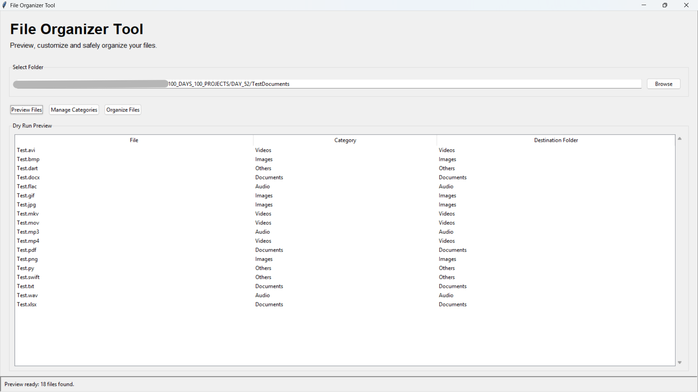
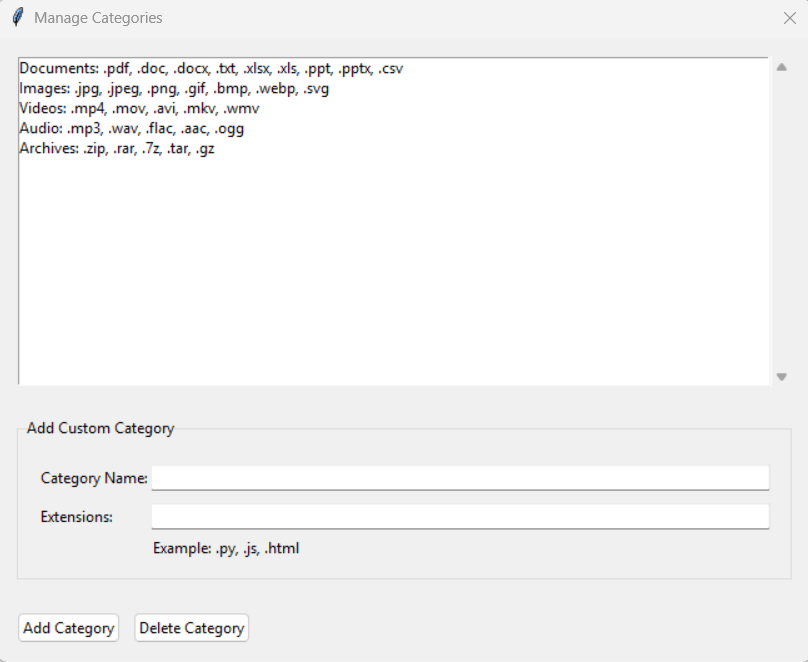
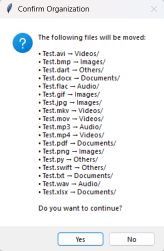
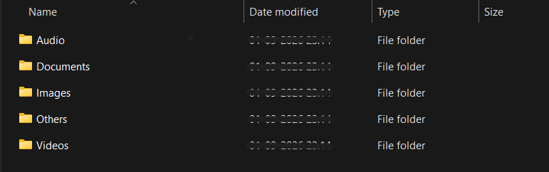

# 🚀 Day 52 - File Organizer Tool

Welcome to **Day 52** of my **100 Days, 100 Python Projects** challenge!

This project is a **File Organizer Tool** built using **Python and Tkinter**. It provides a graphical interface for automatically organizing files into categorized folders based on their file extensions.

The main goal of this project was to strengthen my understanding of **Python file handling, OS operations, automation, object-oriented programming, and GUI development with Tkinter**.

The application also includes a **dry-run preview**, **custom category management**, **duplicate filename handling**, and **confirmation before moving files**, making the organization process safer and more user-friendly.

---

## 📌 Project Overview

The File Organizer Tool allows users to select a folder and automatically organize the files inside it into separate folders according to their file types.

For example:

```text
Downloads/
│
├── report.pdf
├── photo.jpg
├── song.mp3
├── movie.mp4
├── archive.zip
└── notes.txt
```

After organization:

```text
Downloads/
│
├── Documents/
│   ├── report.pdf
│   └── notes.txt
│
├── Images/
│   └── photo.jpg
│
├── Audio/
│   └── song.mp3
│
├── Videos/
│   └── movie.mp4
│
└── Archives/
    └── archive.zip
```

Files whose extensions do not match any configured category are automatically placed inside an **Others** folder.

The application provides a graphical interface where users can:

* 📂 Select a folder
* 👀 Preview files before organizing
* 🗂️ Categorize files automatically
* ⚙️ Create custom file categories
* 🗑️ Delete custom categories
* 🔐 Confirm file movement before execution
* 📦 Handle duplicate filenames safely
* ⚠️ Display errors and warnings
* 📊 View the organization results

---

## ✨ Features

* 🖥️ User-friendly Tkinter graphical interface
* 📂 Folder selection using a file dialog
* 🔍 Automatic file extension detection
* 📁 Automatic folder creation
* 👀 Dry-run preview before moving files
* 🗂️ Predefined file categories
* ⚙️ Custom category management
* ➕ Add custom categories and extensions
* 🗑️ Delete categories
* 🔐 Confirmation dialog before organizing files
* 🔄 Automatic duplicate filename handling
* 📦 Files with unknown extensions go to `Others`
* 🚨 Error and warning handling
* 📊 Treeview-based file preview
* 📋 Status bar for operation updates
* 🧹 Preview clearing when a new folder is selected
* 🛡️ Safe file movement using `shutil`
* 🧱 Object-oriented project structure

---

## 🗂️ Default File Categories

The application comes with several predefined categories.

| Category      | Supported Extensions                                                      |
| ------------- | ------------------------------------------------------------------------- |
| **Documents** | `.pdf`, `.doc`, `.docx`, `.txt`, `.xlsx`, `.xls`, `.ppt`, `.pptx`, `.csv` |
| **Images**    | `.jpg`, `.jpeg`, `.png`, `.gif`, `.bmp`, `.webp`, `.svg`                  |
| **Videos**    | `.mp4`, `.mov`, `.avi`, `.mkv`, `.wmv`                                    |
| **Audio**     | `.mp3`, `.wav`, `.flac`, `.aac`, `.ogg`                                   |
| **Archives**  | `.zip`, `.rar`, `.7z`, `.tar`, `.gz`                                      |
| **Others**    | Any unsupported or unknown file extension                                 |

---

## 🧠 How the File Organizer Works

The application follows a simple organization workflow:

```text
Select Folder
      ↓
Scan Files
      ↓
Detect File Extensions
      ↓
Assign Categories
      ↓
Preview Organization Plan
      ↓
Confirm Operation
      ↓
Create Required Folders
      ↓
Move Files
      ↓
Display Results
```

This approach allows users to see what will happen **before any files are moved**.

---

## 🖼️ Application Screenshots

The project includes screenshots demonstrating the main interface, custom category management, confirmation dialog, and the resulting organized folder structure.

## 📸 Screenshots

### 🖥️ Main Window



The main window provides:

* Folder selection
* Preview Files button
* Manage Categories button
* Organize Files button
* File organization preview
* Status information

---

### ⚙️ Custom Category Management



The category management window allows users to:

* View existing categories
* Add custom categories
* Define multiple file extensions
* Delete categories

For example, users can create a category such as:

```text
Code: .py, .js, .html, .css
```

---

### 🔐 Organization Confirmation



Before moving files, the application displays a confirmation dialog showing the files that will be organized.

Example:

```text
report.pdf → Documents/
photo.jpg → Images/
song.mp3 → Audio/
archive.zip → Archives/
```

The user can choose whether to continue or cancel the operation.

---

### 📁 Organized Folder



After the organization process is completed, the files are moved into their respective category folders.

---

## 🛠️ Technologies Used

* **Python 3**
* **Tkinter**
* **OS Module**
* **Shutil**

### Python

Python is used as the primary programming language for implementing the file organization logic, GUI, validation, and application workflow.

### Tkinter

Tkinter is Python's built-in GUI framework and is used to create:

* Application windows
* Labels
* Buttons
* Entry fields
* Frames
* Treeview
* Listbox
* Scrollbars
* File dialogs
* Message boxes

### OS Module

The `os` module is used for file system operations such as:

```python
os.listdir()
os.path.join()
os.path.isfile()
os.path.isdir()
os.path.splitext()
os.path.exists()
os.makedirs()
```

These functions allow the application to inspect directories, identify files, create folders, and construct file paths.

### Shutil

The `shutil` module is used to move files:

```python
shutil.move()
```

This allows the application to automatically relocate files into their appropriate category folders.

---

## 📂 Project Structure

```text
100_DAYS_100_PROJECTS/
│
├── DAY_52/
│   │
│   ├── main52.py
│   ├── README.md
│   │
│   └── screenshots/
│       ├── main-window.png
│       ├── custom-category.png
│       ├── confirmation.png
│       └── organized-folder.png
│
└── ...
```

---

## ▶️ How to Run

### 1. Make sure Python is installed

Check your Python version:

```bash
python --version
```

The project uses Python's standard libraries, so no external packages are required.

---

### 2. Open the project folder

Open a terminal inside the `DAY_52` folder.

```bash
cd DAY_52
```

---

### 3. Run the application

```bash
python main52.py
```

The **File Organizer Tool** GUI window will open automatically.

---

## 📁 Selecting a Folder

Click the:

```text
Browse
```

button to select the folder that contains the files you want to organize.

The selected folder path will appear inside the folder input field.

For example:

```text
C:\Users\User\Downloads
```

The application then scans the selected folder for files.

---

## 👀 Dry Run Preview

Before organizing the files, the application provides a **Preview Files** option.

Click:

```text
Preview Files
```

The application scans the selected folder and creates an organization plan.

The preview displays:

| File       | Category  | Destination Folder |
| ---------- | --------- | ------------------ |
| report.pdf | Documents | Documents          |
| photo.jpg  | Images    | Images             |
| song.mp3   | Audio     | Audio              |
| movie.mp4  | Videos    | Videos             |

No files are moved during the preview stage.

This acts as a **dry run**, allowing the user to verify the organization plan before making changes.

---

## 🗂️ File Categorization

The application determines a file's category based on its extension.

For example:

```text
report.pdf
```

has the extension:

```text
.pdf
```

The application searches through the configured categories and finds:

```text
Documents
```

Therefore:

```text
report.pdf → Documents/
```

Similarly:

```text
photo.jpg → Images/
song.mp3 → Audio/
movie.mp4 → Videos/
archive.zip → Archives/
```

---

## 🔍 Extension Detection

The application uses:

```python
os.path.splitext(file_name)
```

to separate the filename from its extension.

The extension is converted to lowercase using:

```python
.lower()
```

This ensures that files such as:

```text
photo.jpg
photo.JPG
photo.Jpg
```

are treated consistently.

---

## 📁 Automatic Folder Creation

The application automatically creates the required category folders.

For example, if the selected directory contains image files but does not have an `Images` folder, the application creates it automatically.

It uses:

```python
os.makedirs(folder_path, exist_ok=True)
```

The `exist_ok=True` option prevents errors when the folder already exists.

---

## ⚙️ Custom Categories

The application allows users to create their own categories.

Click:

```text
Manage Categories
```

Users can enter:

```text
Category Name:
Code
```

and:

```text
Extensions:
.py, .js, .html, .css
```

The application automatically normalizes extensions and ensures that they begin with a `.`.

For example:

```text
py, js, html
```

will be converted to:

```text
.py, .js, .html
```

This makes the category system flexible and customizable.

---

## 🗑️ Delete Categories

Users can also delete categories through the category management window.

The application first checks whether a category has been selected.

If no category is selected, a warning message is displayed.

This prevents accidental deletion attempts.

---

## 🔐 Confirmation Before Organizing

The application does not immediately move files after clicking **Organize Files**.

Instead, it creates a confirmation message containing the planned operations.

Example:

```text
The following files will be moved:

• report.pdf → Documents/
• photo.jpg → Images/
• song.mp3 → Audio/

Do you want to continue?
```

The user can choose:

```text
Yes
```

to continue or:

```text
No
```

to cancel the operation.

This provides an additional safety step before modifying the selected folder.

---

## 🔄 Duplicate Filename Handling

The application safely handles situations where a file with the same name already exists in the destination folder.

For example, if:

```text
Images/photo.jpg
```

already exists and another:

```text
photo.jpg
```

needs to be moved there, the application automatically generates:

```text
photo_1.jpg
```

If that also exists:

```text
photo_2.jpg
```

and so on.

This functionality is implemented using:

```python
get_unique_destination()
```

This prevents existing files from being unintentionally overwritten.

---

## 📦 Others Category

If a file extension does not match any configured category, it is automatically assigned to:

```text
Others
```

For example:

```text
unknown.xyz
```

would become:

```text
Others/unknown.xyz
```

This ensures that files are not left behind simply because their extension is not included in the predefined categories.

---

## 🚨 Error Handling

The application includes several validation and error-handling mechanisms.

Examples include:

* No folder selected
* Invalid folder path
* Folder cannot be accessed
* No files found
* Invalid category name
* Missing extensions
* No category selected for deletion
* File movement failure
* File system errors
* Unexpected organization errors

The application displays appropriate warnings, errors, and information dialogs using Tkinter's:

```python
messagebox
```

---

## 📊 Organization Results

After the organization process finishes, the application displays the files that were successfully moved.

If all files are moved successfully, a message such as:

```text
Successfully moved 10 files.
```

is displayed.

If some files fail, the application reports:

```text
8 files moved.
2 files failed.
```

along with the relevant error information.

This allows the user to identify any files that could not be processed.

---

## 🧩 Important Python Functions and Modules Practiced

| Function / Module    | Purpose                              |
| -------------------- | ------------------------------------ |
| `os.listdir()`       | Lists files and folders              |
| `os.path.join()`     | Creates platform-independent paths   |
| `os.path.isfile()`   | Checks whether a path is a file      |
| `os.path.isdir()`    | Checks whether a path is a directory |
| `os.path.splitext()` | Extracts file extensions             |
| `os.path.exists()`   | Checks whether a path exists         |
| `os.makedirs()`      | Creates directories                  |
| `shutil.move()`      | Moves files                          |
| `set()`              | Removes duplicate category names     |
| `try/except`         | Handles runtime errors               |
| `tkinter`            | Creates the GUI                      |
| `ttk.Treeview`       | Displays file organization preview   |
| `filedialog`         | Selects folders                      |
| `messagebox`         | Displays warnings and confirmations  |

---

## 🖥️ GUI Components Used

The application uses several Tkinter and ttk components.

| Component    | Purpose                                |
| ------------ | -------------------------------------- |
| `Tk()`       | Creates the main application window    |
| `Toplevel()` | Creates the category management window |
| `Frame`      | Organizes GUI elements                 |
| `LabelFrame` | Creates titled sections                |
| `Label`      | Displays text and headings             |
| `Entry`      | Displays and accepts folder paths      |
| `Button`     | Performs application actions           |
| `Treeview`   | Displays the file organization preview |
| `Listbox`    | Displays categories                    |
| `Scrollbar`  | Provides scrolling                     |
| `StringVar`  | Manages dynamic GUI text               |
| `filedialog` | Selects folders                        |
| `messagebox` | Displays messages and confirmations    |

---

## 🧱 Object-Oriented Design

The project uses two main classes.

### `FileOrganizer`

The `FileOrganizer` class handles the core file organization logic.

Its responsibilities include:

* Detecting file categories
* Creating an organization plan
* Creating destination folders
* Handling duplicate filenames
* Moving files
* Tracking successful and failed operations

Important methods include:

```python
get_folder_for_file()
get_file_plan()
create_folders()
get_unique_destination()
organize()
```

---

### `FileOrganizerGUI`

The `FileOrganizerGUI` class handles the graphical user interface.

Its responsibilities include:

* Creating the main interface
* Selecting folders
* Previewing files
* Managing categories
* Confirming operations
* Displaying results
* Updating application status

Important methods include:

```python
create_widgets()
browse_folder()
preview_files()
manage_categories()
organize_files()
clear_preview()
```

This separation between **application logic** and **GUI logic** makes the project easier to understand and maintain.

---

## 📚 Concepts Practiced

This project provided practical experience with:

* Python Programming
* File Handling
* Directory Management
* File Extensions
* OS Operations
* File Automation
* `os` Module
* `shutil` Module
* Tkinter GUI Development
* Tkinter `ttk`
* Object-Oriented Programming
* Classes and Methods
* Functions
* Lists and Dictionaries
* Sets
* String Manipulation
* Exception Handling
* Input Validation
* File System Operations
* Dynamic Folder Creation
* Duplicate File Handling
* Event-Driven Programming
* GUI Layout Management
* User Confirmation Workflows
* Dry-Run / Preview Design

---

## 🎯 Learning Outcome

This project helped me understand:

* How to work with files and directories using Python
* How to detect file extensions programmatically
* How to automate repetitive file organization tasks
* How to use the `os` module for file system operations
* How to move files using `shutil`
* How to dynamically create directories
* How to handle duplicate filenames safely
* How to design a file categorization system
* How to create customizable categories
* How to build a GUI using Tkinter
* How to use `Treeview` for displaying structured data
* How to create confirmation dialogs
* How to validate user input
* How to handle file system errors
* How to structure a Python application using classes
* How to separate GUI logic from core application logic
* How automation can be used to solve practical problems

---

## 🔮 Future Improvements

Possible enhancements for future versions include:

* 📊 Display file counts for each category
* 📏 Sort files by size
* 📅 Sort files by creation or modification date
* 🔍 Add a search/filter feature
* ↩️ Add an Undo Organization feature
* 📜 Add an organization history log
* 💾 Save custom categories to a configuration file
* 📤 Export organization reports
* 🔄 Add automatic folder monitoring
* ⏱️ Schedule automatic organization
* 🧹 Add duplicate file detection
* 📦 Detect files by MIME type
* 🗃️ Add more predefined categories
* 🎨 Improve the GUI design
* 🌙 Add Dark Mode
* 📈 Display statistics and charts
* 🛡️ Add a more advanced safe-preview system
* 📂 Support recursive organization of subfolders
* ⚡ Add background processing for large directories

---

## 💡 Why This Project Is Useful

Manually organizing large folders can become repetitive and time-consuming.

For example, a Downloads folder may contain:

```text
PDF files
Images
Videos
Music
Documents
Archives
Code files
Unknown files
```

Instead of manually moving each file, this application automates the process.

The project demonstrates how Python can be used to create practical **desktop automation tools** that interact directly with the operating system.

---

## 📅 100 Days Challenge

This project is part of my **100 Days, 100 Python Projects** challenge, where I build one Python project every day to improve my Python programming skills, strengthen my problem-solving abilities, learn new technologies, and maintain consistency through daily coding.

**Day 52** focuses on **Python file system automation**, combining `os` and `shutil` with a practical **Tkinter GUI File Organizer**.

---

## 👨‍💻 Author

**Abhijit Munghate**

Happy Coding! 🚀🐍📁
