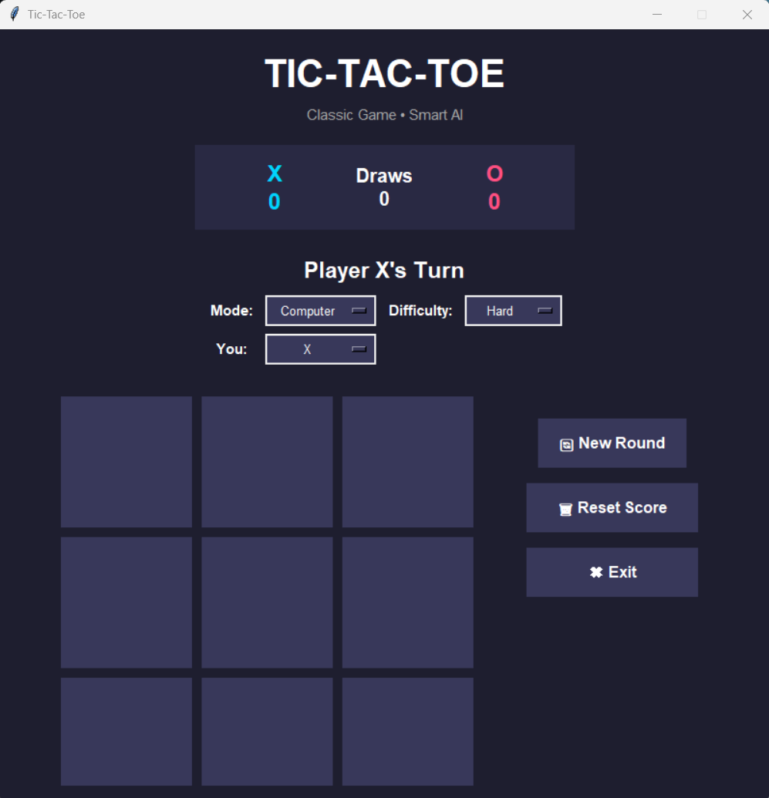
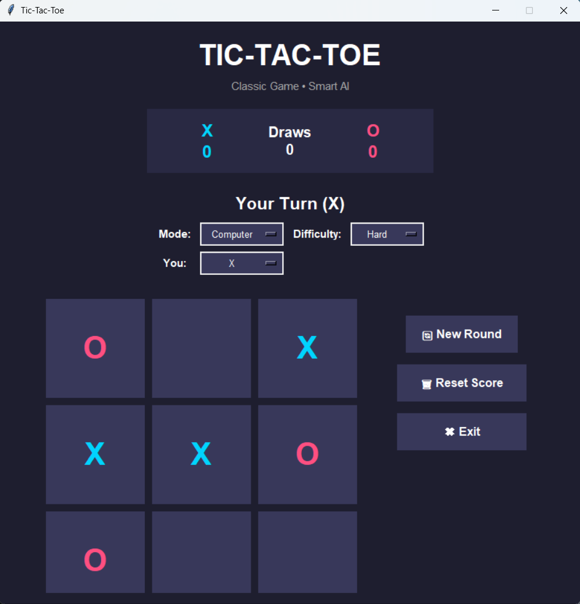
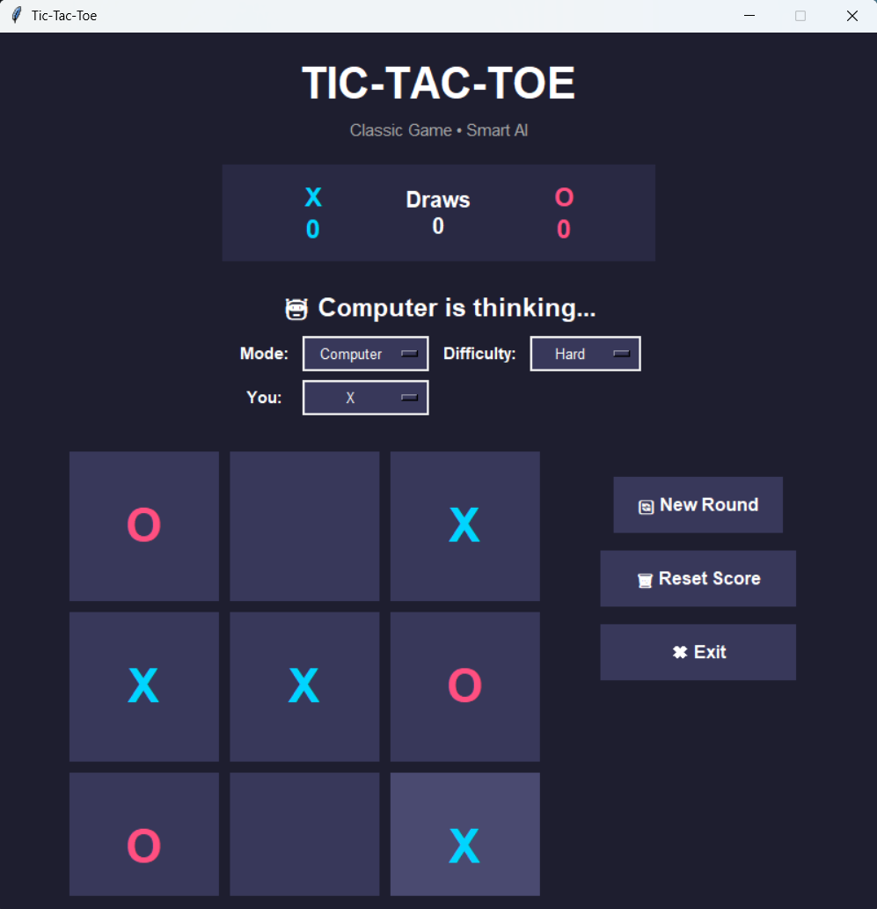
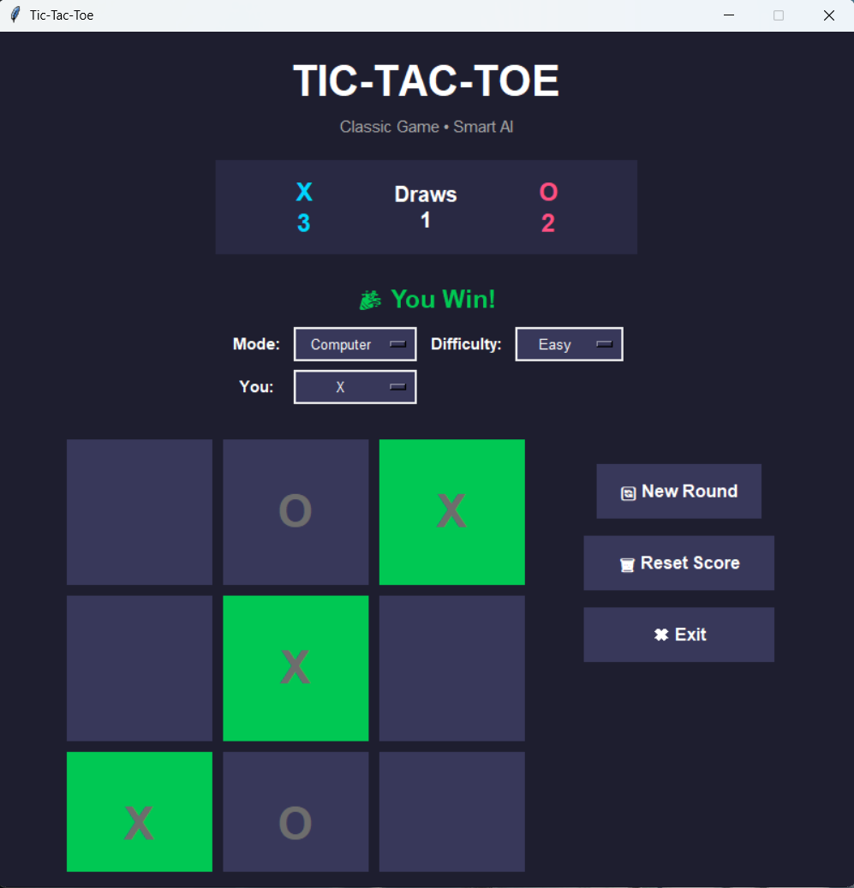
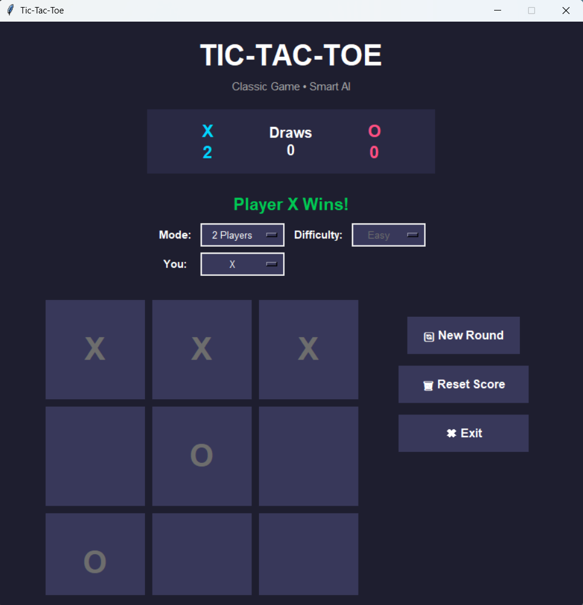

# 🚀 Day 53 - Tic-Tac-Toe Game

Welcome to **Day 53** of my **100 Days, 100 Python Projects** challenge!

This project is a **Tic-Tac-Toe Game** built using **Python and Tkinter**. The game provides a modern graphical interface with support for **single-player and two-player modes**, multiple difficulty levels, score tracking, sound effects, winning animations, and customizable player symbols.

The main goal of this project was to strengthen my understanding of **Python game logic, GUI development, event-driven programming, recursion, artificial intelligence, and the Minimax algorithm**.

The project also provided practical experience in creating an interactive desktop application where user actions, game state, computer decisions, animations, and scores are managed dynamically.

---

## 📌 Project Overview

Tic-Tac-Toe is a classic two-player strategy game played on a **3 × 3 grid**.

The objective is to place three identical symbols in a row:

```text
Horizontal
Vertical
Diagonal
```

This project extends the traditional game by adding a **Computer AI opponent**.

Players can choose between:

* 🤖 **Computer Mode**
* 👥 **2 Players Mode**

In Computer Mode, the player can also select:

* 🟢 **Easy**
* 🔴 **Hard**

The player can additionally choose whether they want to play as:

```text
X
```

or:

```text
O
```

The game keeps track of:

```text
X Score
O Score
Draws
```

and provides controls for starting a new round, resetting the score, and exiting the application.

---

## ✨ Features

* 🎮 Classic 3 × 3 Tic-Tac-Toe gameplay
* 🤖 Computer AI opponent
* 🧠 Hard difficulty using the Minimax algorithm
* 🎲 Easy difficulty using random moves
* 👥 Two-player local game mode
* ❌⭕ Player symbol selection
* 📊 Score tracking
* 🏆 Win detection
* 🤝 Draw detection
* ✨ Winning-cell animation
* 🔊 Sound effects for moves
* 🎉 Winning sound effect
* 🤝 Draw sound effect
* ⚠️ Error sound for invalid moves
* 🔄 New Round functionality
* 🗑️ Reset Score functionality
* ✖️ Exit button
* 🎨 Modern dark-themed GUI
* 🖱️ Button hover effects
* ⏳ Computer thinking indicator
* 🚫 Board locking after game completion
* 🛡️ Protection against invalid moves during AI processing

---

## 🖼️ Application Screenshots

The project includes screenshots demonstrating the main interface, AI gameplay, computer thinking state, winning animation, and available game modes.

## 📸 Screenshots

### 🖥️ Main Interface



The main interface contains:

* Game title
* Scoreboard
* Current turn indicator
* Game settings
* Tic-Tac-Toe board
* Game controls

The control panel provides:

```text
🔄 New Round
🗑 Reset Score
✖ Exit
```

---

### 🤖 AI Gameplay



In Computer Mode, the player competes against the built-in AI.

The player makes a move and the computer automatically calculates and performs its move.

The game displays:

```text
🤖 Computer is thinking...
```

while the computer is deciding its move.

---

### ⏳ Computer Thinking



After the player's move, the application temporarily prevents additional player input while the computer processes its move.

A short delay is introduced using Tkinter's:

```python
window.after()
```

This makes the computer's response feel more natural.

---

### 🏆 Winning Animation



When a player wins, the three winning cells are highlighted using an animation.

The winning cells repeatedly change their background color to visually indicate the winning combination.

The game also displays an appropriate result message such as:

```text
🎉 You Win!
```

or:

```text
🤖 Computer Wins!
```

---

### 🎮 Game Modes



The game supports multiple configurations:

```text
Mode:
    Computer
    2 Players

Difficulty:
    Easy
    Hard

You:
    X
    O
```

This allows players to customize how they want to play.

---

## 🛠️ Technologies Used

* **Python 3**
* **Tkinter**
* **Random Module**
* **Winsound** *(Windows only)*

### Python

Python is used as the primary programming language for implementing:

* Game logic
* Player turns
* Score management
* AI decision-making
* Win and draw detection
* GUI interactions
* Animations
* Error handling

### Tkinter

Tkinter is Python's built-in GUI framework and is used to create:

* Application window
* Labels
* Buttons
* Frames
* Option menus
* Game board
* Scoreboard
* Control buttons
* Hover interactions

### Random

The `random` module is used by the **Easy AI** to randomly select an available cell.

```python
random.choice(empty_cells)
```

### Winsound

The Windows `winsound` module is used to generate simple sound effects.

The application uses different sounds for:

* Player moves
* Winning
* Draws
* Invalid moves

If the program is executed on a non-Windows system, the sound function safely does nothing.

---

## 📂 Project Structure

```text
100_DAYS_100_PROJECTS/
│
├── DAY_53/
│   │
│   ├── main53.py
│   ├── README.md
│   │
│   └── screenshots/
│       ├── main-interface.png
│       ├── ai-gameplay.png
│       ├── computer-thinking.png
│       ├── winning-animation.png
│       └── game-modes.png
│
└── ...
```

---

## 📦 Requirements

This project uses Python's built-in libraries.

Therefore, **no external Python packages are required**.

The project uses:

```text
tkinter
random
winsound
```

`tkinter` and `random` are part of the standard Python installation.

`winsound` is available on Windows and is handled safely in the application for other operating systems.

---

## ▶️ How to Run

### 1. Make sure Python is installed

Check your Python version:

```bash
python --version
```

---

### 2. Open the project folder

Open a terminal inside the `DAY_53` folder.

```bash
cd DAY_53
```

---

### 3. Run the application

```bash
python main53.py
```

The **Tic-Tac-Toe** GUI window will open automatically.

---

## 🎮 How to Play

### Step 1: Select Game Mode

The application provides two modes.

### 🤖 Computer

Play against the built-in AI.

The computer automatically makes its move after the player.

### 👥 2 Players

Two players can play against each other on the same computer.

Players alternate between:

```text
X
O
```

---

## 🧠 Difficulty Levels

Computer Mode provides two difficulty levels.

### 🟢 Easy

The computer selects a random empty cell.

The application uses:

```python
random.choice(empty_cells)
```

This means the computer does not strategically evaluate the board.

As a result, the player can more easily defeat the computer.

---

### 🔴 Hard

The Hard difficulty uses the **Minimax algorithm** to determine the best possible move.

The AI evaluates possible future game states and chooses a move that maximizes its chance of winning while minimizing the player's chance of winning.

The main functions involved are:

```python
minimax()
get_best_move()
```

This makes the Hard AI significantly more challenging than the Easy AI.

---

## 🧠 Minimax Algorithm

The Minimax algorithm is a recursive decision-making algorithm commonly used in turn-based games.

The algorithm evaluates possible game states.

The scoring system used in this project is:

```text
Computer wins → +10
Player wins   → -10
Draw          → 0
```

The computer attempts to maximize its score.

The player is treated as the minimizing opponent.

Conceptually:

```text
                 Current Board
                       │
             ┌─────────┴─────────┐
             │                   │
          Move 1              Move 2
             │                   │
        Future State        Future State
             │                   │
       ┌─────┴─────┐       ┌─────┴─────┐
      Win         Draw     Loss        Draw
      +10           0       -10          0
```

The algorithm recursively explores possible moves until it reaches a terminal state.

This allows the Hard AI to make strategically strong decisions.

---

## 🔢 Game Board

The game uses a 3 × 3 board:

```text
       1       2       3

   ┌───────┬───────┬───────┐
1  │       │       │       │
   ├───────┼───────┼───────┤
2  │       │       │       │
   ├───────┼───────┼───────┤
3  │       │       │       │
   └───────┴───────┴───────┘
```

The board is represented in Python as a nested list:

```python
board = [
    ["", "", ""],
    ["", "", ""],
    ["", "", ""]
]
```

An empty string represents an available cell.

For example:

```text
X O ""
"" X ""
O "" X
```

represents a diagonal winning position for X.

---

## 🏆 Win Detection

The application checks all possible winning combinations.

### Horizontal Wins

```text
X X X
O O -
- - -
```

### Vertical Wins

```text
X O -
X O -
X - -
```

### Diagonal Wins

```text
X - O
- X -
O - X
```

The function:

```python
check_winner()
```

checks:

* 3 rows
* 3 columns
* Main diagonal
* Opposite diagonal

It returns both the winning player and the cells that form the winning combination.

---

## 🤝 Draw Detection

A game is considered a draw when:

* There is no winner
* There are no empty cells remaining

The application uses:

```python
is_draw()
```

to determine whether the board is completely filled.

The draw score is then increased:

```python
scores["Draws"] += 1
```

and the game displays:

```text
It's a Draw!
```

---

## 📊 Score Tracking

The application maintains a scoreboard for:

```text
X
O
Draws
```

The scores are stored using a Python dictionary:

```python
scores = {
    "X": 0,
    "O": 0,
    "Draws": 0
}
```

Whenever a player wins, their score increases.

For example:

```text
X
3
```

means X has won three rounds.

---

## 🔄 New Round

The **New Round** button starts another game without deleting the overall scores.

It resets:

* Board
* Current player
* Game-over state
* Computer thinking state
* Winning cells

The scoreboard remains unchanged.

This allows players to continue a match across multiple rounds.

---

## 🗑️ Reset Score

The **Reset Score** button completely resets the scoreboard.

The scores become:

```text
X      0
Draws  0
O      0
```

A new round is also started.

---

## ✖️ Exit

The **Exit** button closes the application.

It uses:

```python
window.destroy()
```

to terminate the Tkinter window.

---

## ❌⭕ Player Symbol Selection

In Computer Mode, the player can choose:

```text
X
```

or:

```text
O
```

If the player chooses X:

```text
Player → X
Computer → O
```

If the player chooses O:

```text
Player → O
Computer → X
```

When O is selected, the computer starts the game automatically because X traditionally plays first.

---

## 🎨 User Interface

The application uses a dark-themed interface.

Important interface colors include:

```python
BG_COLOR = "#1e1e2f"
CARD_COLOR = "#292943"
X_COLOR = "#00d4ff"
O_COLOR = "#ff4f81"
TEXT_COLOR = "#ffffff"
WIN_COLOR = "#00c853"
BUTTON_COLOR = "#38385a"
HOVER_COLOR = "#4a4a70"
```

These colors are used to visually distinguish:

* Background
* Scoreboard
* X moves
* O moves
* Winning cells
* Buttons
* Hover states

---

## 🖱️ Button Hover Effects

The game includes hover effects for the board buttons.

When the mouse enters an available cell, its background changes.

The functions:

```python
button_enter()
button_leave()
```

control this behavior.

This makes the interface more interactive and provides visual feedback to the user.

---

## ✨ Winning Animation

When a player wins, the application highlights the winning cells.

The function:

```python
animate_winner()
```

uses Tkinter's:

```python
window.after()
```

to repeatedly change the cell background.

The animation runs for multiple steps:

```text
Winning cells
      ↓
Highlight
      ↓
Normal
      ↓
Highlight
      ↓
Normal
      ↓
...
```

This provides a visual indication of the winning combination.

---

## 🔊 Sound Effects

The project includes optional Windows sound effects.

The function:

```python
play_sound()
```

supports:

```text
move
win
draw
error
```

### Move

A short beep is played after a valid move.

### Win

A sequence of tones is played when a player wins.

### Draw

A different sound sequence is used for a draw.

### Error

A short error beep is played when an invalid move is attempted.

The application safely handles systems where `winsound` is unavailable:

```python
try:
    import winsound
except Exception:
    pass
```

Therefore, sound functionality does not prevent the game from running.

---

## ⏳ Computer Thinking Delay

After the player makes a move, the computer does not respond instantly.

The application uses:

```python
window.after(500, computer_move)
```

to introduce a short delay.

During this time, the status displays:

```text
🤖 Computer is thinking...
```

The variable:

```python
computer_thinking
```

prevents the player from making another move while the computer is processing its turn.

---

## 🛡️ Invalid Move Protection

The application prevents several invalid actions.

A move is rejected if:

* The game is already over
* The computer is currently thinking
* The selected cell is already occupied
* It is not the player's turn in Computer Mode

For example:

```python
if board[row][col] != "":
    play_sound("error")
    return
```

This prevents players from overwriting an existing move.

---

## 🧩 Important Functions

| Function              | Purpose                                |
| --------------------- | -------------------------------------- |
| `play_sound()`        | Plays game sound effects               |
| `create_board()`      | Creates the 3 × 3 game board           |
| `reset_game()`        | Starts a new round                     |
| `reset_scores()`      | Resets all scores                      |
| `update_scoreboard()` | Updates displayed scores               |
| `disable_buttons()`   | Disables the board after the game ends |
| `check_winner()`      | Detects winning combinations           |
| `is_draw()`           | Detects a draw                         |
| `animate_winner()`    | Animates winning cells                 |
| `handle_result()`     | Handles wins and draws                 |
| `on_click()`          | Handles player moves                   |
| `get_empty_cells()`   | Finds available board cells            |
| `minimax()`           | Calculates AI game states              |
| `get_best_move()`     | Selects the best Hard AI move          |
| `get_easy_move()`     | Selects a random Easy AI move          |
| `computer_move()`     | Performs the computer's move           |
| `change_game_mode()`  | Changes between game modes             |
| `change_difficulty()` | Changes AI difficulty                  |
| `change_symbol()`     | Changes player's symbol                |

---

## 🧠 Game State Variables

The application maintains several variables to track the current game state.

```python
board
current_player
game_mode
difficulty
player_symbol
computer_symbol
game_over
computer_thinking
scores
winning_cells
```

These variables allow the application to keep track of:

* Current board
* Current turn
* Selected game mode
* AI difficulty
* Player and computer symbols
* Game completion status
* AI processing state
* Match scores
* Winning cells

---

## 📚 Concepts Practiced

This project provided practical experience with:

* Python Programming
* Tkinter GUI Development
* Game Development
* Game State Management
* Conditional Logic
* Lists
* Nested Lists
* Dictionaries
* Functions
* Global Variables
* Event-Driven Programming
* Object-Free Procedural GUI Design
* Recursion
* Artificial Intelligence Basics
* Minimax Algorithm
* Randomized Algorithms
* Tree Search Concepts
* Input Validation
* Exception Handling
* GUI Animations
* Timed Callbacks
* Score Management
* User Interaction
* Button Events
* Mouse Hover Events
* Cross-platform Error Handling

---

## 🎯 Learning Outcome

This project helped me understand:

* How to build an interactive game using Python
* How to create a graphical interface using Tkinter
* How to represent a game board using nested lists
* How to detect horizontal, vertical, and diagonal winning patterns
* How to detect draw conditions
* How to manage multiple game states
* How to implement a two-player game mode
* How to create a computer-controlled opponent
* How random algorithms can be used for simple AI
* How the Minimax algorithm works
* How recursion can be used for game-tree exploration
* How to prevent invalid user interactions
* How to create animations using Tkinter callbacks
* How to add sound effects to a desktop application
* How to implement score tracking
* How to create configurable game settings
* How to provide visual feedback through colors and animations
* How to use delayed callbacks with `window.after()`

---

## 🔮 Future Improvements

Possible enhancements for future versions include:

* 🧠 Improve Minimax with depth-based scoring
* 🏆 Add player names
* 📊 Add detailed match statistics
* 📜 Add game history
* 💾 Save scores between application sessions
* 🎨 Add more themes
* 🌙 Add theme switching
* 🔊 Add volume controls
* 🎵 Add background music
* 🏅 Add achievements
* 📈 Add win-rate statistics
* 🧠 Add additional AI difficulty levels
* 🌐 Add online multiplayer
* 🔌 Add network-based multiplayer
* 🖥️ Create a responsive/resizable interface
* 🎮 Add keyboard controls
* ⌨️ Allow number-key board selection
* ↩️ Add Undo functionality for two-player mode
* 🔄 Add Replay Match functionality
* 🏆 Add tournament mode
* 📱 Create a mobile version
* 🎯 Add larger board sizes such as 4 × 4 or 5 × 5

---

## 💡 Why This Project Is Useful

Although Tic-Tac-Toe is a simple game, it provides an excellent introduction to important programming and AI concepts.

The project demonstrates how a simple game can be extended into a more advanced application by adding:

```text
GUI
+
Game Logic
+
AI
+
Minimax
+
Animations
+
Sound
+
Score Tracking
+
Multiple Game Modes
```

The Hard AI in particular provides practical experience with **recursive search and decision-making algorithms**, which are important concepts in artificial intelligence.

---

## 📅 100 Days Challenge

This project is part of my **100 Days, 100 Python Projects** challenge, where I build one Python project every day to improve my Python programming skills, strengthen my problem-solving abilities, learn new technologies, and maintain consistency through daily coding.

**Day 53** focuses on **Python game development and basic artificial intelligence**, combining Tkinter GUI development with the **Minimax algorithm** to create a challenging Tic-Tac-Toe opponent.

---

## 👨‍💻 Author

**Abhijit Munghate**

Happy Coding! 🚀🐍🎮
