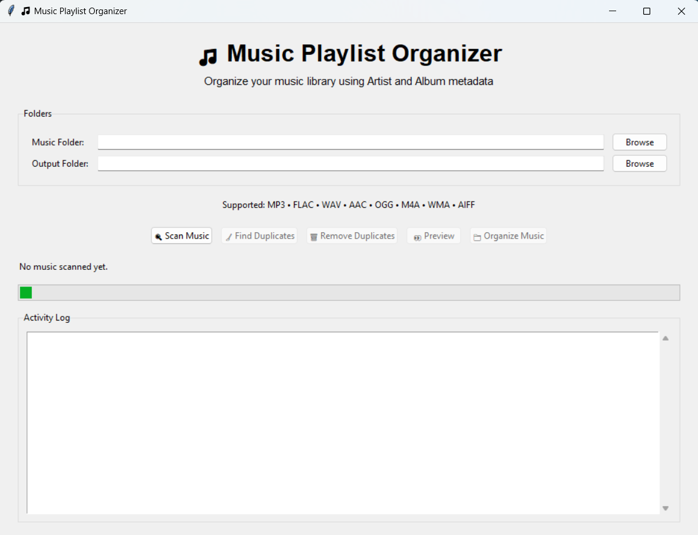
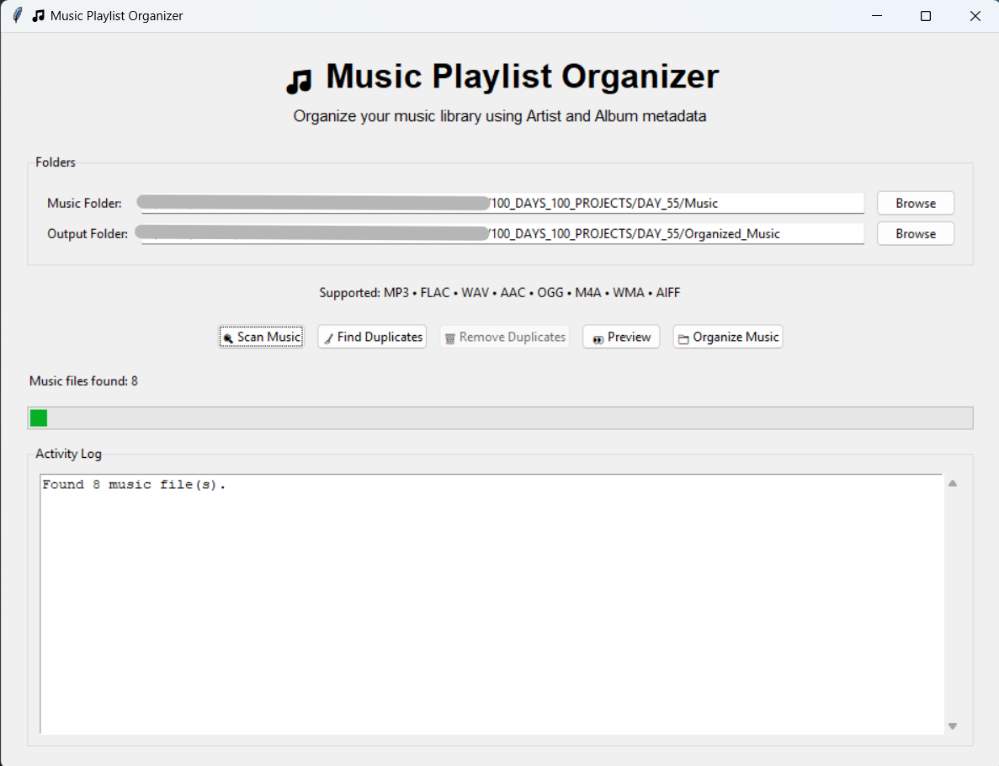
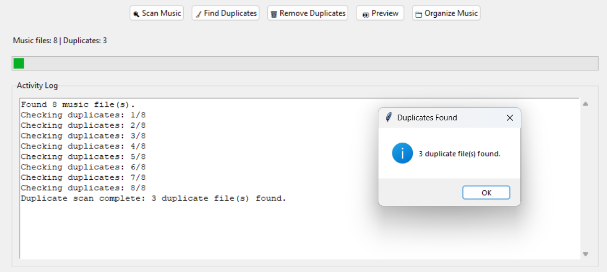
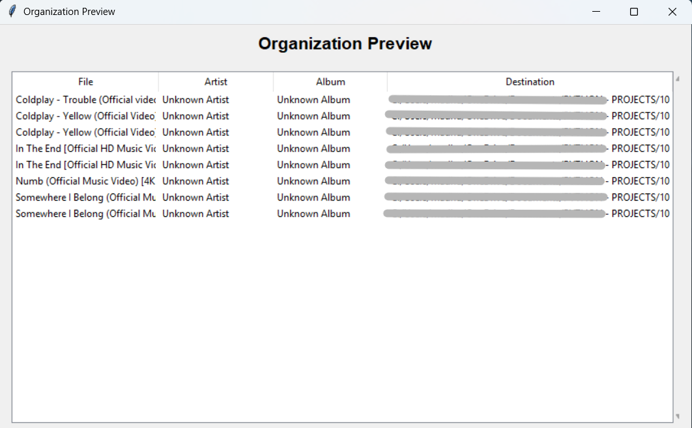
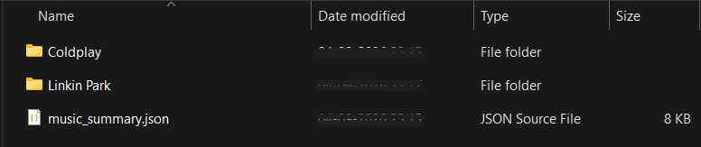

# 🎵 Day 55 - Music Playlist Organizer

Welcome to **Day 55** of my **100 Days, 100 Python Projects** challenge!

This project is a **Music Playlist Organizer GUI application** built using **Python, Tkinter, Mutagen, OS, Shutil, JSON, Hashlib, and Threading**.

The application scans a music library, extracts metadata such as **Artist and Album**, detects duplicate music files using **SHA-256 file hashing**, provides an organization preview, and automatically organizes music into an **Artist → Album** folder structure.

The application also generates a **JSON summary report** containing information about organized files, detected duplicates, and statistics.

The main purpose of this project is to gain practical experience with **File Handling, Metadata Extraction, GUI Development, File Hashing, Automation, Multithreading, and Data Organization** using Python.

---

## 📌 Project Overview

Managing a large music collection manually can become difficult when songs are stored in different folders or have duplicate copies.

This project provides an automated solution for organizing a music library.

The application allows users to:

* 📂 Select a music source folder
* 📁 Select an output folder
* 🔍 Scan for supported music files
* 🎵 Extract music metadata
* 👀 Preview the organization structure
* 🧹 Detect duplicate files
* 🔐 Compare files using SHA-256 hashes
* 🗑️ Remove duplicate files
* 📁 Organize music by Artist and Album
* 🛡️ Prevent filename conflicts
* ⚡ Perform long-running operations in background threads
* 📊 Display operation progress and activity logs
* 📄 Generate a JSON summary report

---

## ✨ Features

* 🖥️ Interactive Tkinter GUI
* 📂 Source music folder selection
* 📁 Output folder selection
* 🔍 Recursive music library scanning
* 🎵 Music metadata extraction
* 👤 Artist-based organization
* 💿 Album-based organization
* 👀 Organization preview
* 🧹 Duplicate file detection
* 🔐 SHA-256 file hashing
* 🗑️ Duplicate file removal
* 🛡️ Automatic filename conflict handling
* ⚡ Background threading
* 📊 Progress indicator
* 📝 Activity log
* 📄 JSON summary generation
* ⚠️ Error handling
* 🚨 Input validation
* 🎧 Support for multiple audio formats

---

## 🎧 Supported Music Formats

The application currently supports the following audio file extensions:

```text
.mp3
.flac
.wav
.aac
.ogg
.m4a
.wma
.aiff
.aif
```

The supported extensions are defined using:

```python
SUPPORTED_EXTENSIONS = (
    ".mp3",
    ".flac",
    ".wav",
    ".aac",
    ".ogg",
    ".m4a",
    ".wma",
    ".aiff",
    ".aif"
)
```

The scanner checks file extensions without being affected by uppercase or lowercase characters.

For example:

```text
song.mp3
song.MP3
SONG.Mp3
```

are all recognized as supported music files.

---

## 🎵 Music Metadata

The application uses the **Mutagen** library to extract metadata from audio files.

The following metadata fields are extracted:

* 🎵 Title
* 👤 Artist
* 💿 Album
* 🎼 Genre
* 📂 File path

The application uses:

```python
audio = File(file_path, easy=True)
```

to read the metadata.

If metadata is missing, default values are used:

```text
Unknown Title
Unknown Artist
Unknown Album
Unknown Genre
```

This prevents missing metadata from causing the organization process to fail.

---

## 📂 Music Organization

The application organizes music using the following structure:

```text
Output Folder/
│
├── Artist 1/
│   ├── Album 1/
│   │   ├── song1.mp3
│   │   └── song2.mp3
│   │
│   └── Album 2/
│       └── song3.mp3
│
├── Artist 2/
│   └── Album 1/
│       └── song4.flac
│
└── Artist 3/
    └── Album 1/
        └── song5.wav
```

For example:

```text
Music Library/
└── Arijit Singh/
    └── Tum Hi Ho/
        └── Tum_Hi_Ho.mp3
```

The organization path is created using:

```python
artist_folder = os.path.join(output_directory, artist)
album_folder = os.path.join(artist_folder, album)
```

This creates an easy-to-navigate music library.

---

## 🧹 Duplicate Detection

The application can identify duplicate music files using **SHA-256 hashing**.

Instead of relying only on filenames, the application calculates a cryptographic hash based on the actual file contents.

For example:

```text
Song A
SHA-256 → abc123...

Song B
SHA-256 → abc123...
```

If two files have the same SHA-256 hash, they are treated as duplicates.

This allows the application to detect duplicate files even when they have different filenames.

---

## 🔐 SHA-256 File Hashing

The project uses Python's built-in `hashlib` module.

The hashing process uses:

```python
sha256 = hashlib.sha256()
```

The file is read in chunks:

```python
chunk = file.read(1024 * 1024)
```

Each chunk is then added to the hash:

```python
sha256.update(chunk)
```

Finally, the hexadecimal hash is returned:

```python
return sha256.hexdigest()
```

Reading the file in chunks helps avoid loading the entire audio file into memory at once.

---

## 🗑️ Removing Duplicate Files

After duplicates are detected, the user can remove them using the:

```text
🗑 Remove Duplicates
```

button.

Before deletion, the application displays a confirmation dialog:

```text
X duplicate file(s) will be permanently deleted.

Do you want to continue?
```

The user must confirm before the files are permanently removed.

The application uses:

```python
os.remove(duplicate)
```

to delete duplicate files.

### ⚠️ Important

Duplicate removal is **permanent**. Deleted files are not moved to a recycle bin or backup location by this application.

Users should verify the detected duplicates before confirming deletion.

---

## 👀 Organization Preview

Before organizing the music library, users can preview the planned organization.

The preview displays:

| File       | Artist   | Album   | Destination             |
| ---------- | -------- | ------- | ----------------------- |
| song1.mp3  | Artist 1 | Album 1 | Output/Artist 1/Album 1 |
| song2.flac | Artist 2 | Album 2 | Output/Artist 2/Album 2 |

The preview allows users to verify where their music files will be placed before starting the organization process.

---

## 🛡️ Filename Conflict Handling

The application prevents existing files from being overwritten.

If a destination file already exists:

```text
song.mp3
```

the application automatically generates:

```text
song_1.mp3
song_2.mp3
song_3.mp3
```

and so on.

This is handled by:

```python
get_unique_destination()
```

This provides an additional layer of protection against accidental file replacement.

---

## 🧹 Filename Sanitization

Some characters are not allowed in Windows filenames.

The application sanitizes artist and album names using:

```python
re.sub(r'[<>:"/\\|?*]', "_", name)
```

For example:

```text
Artist: A/B
```

can be converted into:

```text
Artist_ A_B
```

This helps prevent errors when creating folders based on metadata.

If the metadata is empty, the application uses:

```text
Unknown
```

as the folder name.

---

## ⚡ Background Processing

Scanning large music libraries and calculating hashes can take time.

To prevent the GUI from freezing during these operations, the project uses Python's:

```python
threading
```

module.

For example:

```python
thread = threading.Thread(
    target=self.scan_music,
    args=(directory,),
    daemon=True
)

thread.start()
```

Duplicate detection and music organization are also performed in background threads.

The GUI is updated safely using:

```python
self.root.after()
```

This keeps the interface responsive while processing files.

---

## 📊 Progress Indicator

The application includes a progress bar:

```python
self.progress = ttk.Progressbar(
    self.root,
    mode="indeterminate"
)
```

The progress indicator starts while long-running operations are running:

```python
self.progress.start()
```

and stops after the operation completes:

```python
self.progress.stop()
```

This gives the user visual feedback while the application is working.

---

## 📝 Activity Log

The application contains an **Activity Log** section that displays information about ongoing operations.

Examples include:

```text
Found 25 music file(s).

Checking duplicates: 1/25
Checking duplicates: 2/25
Checking duplicates: 3/25

Duplicate scan complete: 3 duplicate file(s) found.

Moved: song.mp3
Moved: another_song.flac

Organization complete. 22 file(s) organized.
```

The log provides useful feedback during scanning, duplicate detection, and organization.

---

## 📄 JSON Summary Report

After the organization process is complete, the application creates:

```text
music_summary.json
```

inside the selected output folder.

The JSON file contains:

* Organized files
* Duplicate information
* Organization statistics

The structure is similar to:

```json
{
    "organized_files": [],
    "duplicates": [],
    "statistics": {
        "organized_count": 10,
        "duplicate_count": 2
    }
}
```

The summary can be useful for:

* 📊 Reviewing the organization
* 📝 Keeping a record of processed files
* 🔍 Checking duplicate information
* 📈 Understanding organization statistics

---

## 🖥️ Application Screenshots

## Screenshots

### 1. 🖥️ Main Interface

The main interface allows the user to select the source music folder and output folder.



---

### 2. 🔍 Music Scanning

The application scans the selected directory recursively and identifies supported music files.



---

### 3. 🧹 Duplicate Detection

The duplicate detection feature calculates file hashes and identifies duplicate music files.



---

### 4. 👀 Organization Preview

The preview window shows the Artist, Album, file name, and planned destination before files are organized.



---

### 5. 📁 Organized Music Library

After organization, the music library is arranged into Artist and Album folders.



---

## 🛠️ Technologies Used

* **Python 3**
* **Tkinter**
* **Mutagen**
* **OS**
* **Shutil**
* **JSON**
* **Hashlib**
* **Threading**
* **Regular Expressions**

### Python

Python is used to build the complete application logic, including file scanning, metadata processing, duplicate detection, organization, and GUI functionality.

### Tkinter

Tkinter is used to create the graphical user interface.

It provides:

* Labels
* Buttons
* Entry fields
* File dialogs
* Progress bars
* Text widgets
* Scrollbars
* Treeviews
* Message boxes

### Mutagen

Mutagen is used to read metadata from audio files.

It allows the application to extract:

```text
Title
Artist
Album
Genre
```

from supported audio files.

### OS

The `os` module is used for:

* Directory traversal
* Path handling
* Folder creation
* File existence checking
* File deletion

### Shutil

The `shutil` module is used to move music files:

```python
shutil.move(source, destination)
```

### JSON

The `json` module is used to generate the final organization summary.

### Hashlib

The `hashlib` module is used to calculate SHA-256 hashes for duplicate detection.

### Threading

The `threading` module is used to perform time-consuming operations in the background without blocking the GUI.

### Regular Expressions

The `re` module is used to sanitize artist and album names before creating folders.

---

## 📂 Project Structure

```text
DAY_55/
│
├── main55.py
├── requirements.txt
├── README.md
└── screenshots/
    ├── main-interface.png
    ├── music-scanning.png
    ├── duplicate-detection.png
    ├── organization-preview.png
    └── organized-music-library.png
```

After running the application, the selected output directory may also contain:

```text
Output Folder/
│
├── Artist 1/
│   └── Album 1/
│       └── songs...
│
├── Artist 2/
│   └── Album 2/
│       └── songs...
│
└── music_summary.json
```

### File Description

| File / Folder      | Purpose                                   |
| ------------------ | ----------------------------------------- |
| `main55.py`        | Main Music Playlist Organizer application |
| `requirements.txt` | Python dependency list                    |
| `README.md`        | Project documentation                     |
| `screenshots/`     | Application screenshots                   |

---

## 📦 requirements.txt

The project requires the following external Python library:

```text
mutagen
```

Install the dependency using:

```bash
pip install -r requirements.txt
```

Alternatively:

```bash
pip install mutagen
```

The following modules are included with Python and do not require separate installation:

```text
os
shutil
json
hashlib
threading
re
tkinter
```

---

## ▶️ How to Run

### 1. Make sure Python is installed

Check your Python version:

```bash
python --version
```

### 2. Open the project folder

Open a terminal inside the `DAY_55` folder.

### 3. Install the required dependency

```bash
pip install -r requirements.txt
```

### 4. Run the application

```bash
python main55.py
```

The **Music Playlist Organizer** GUI will open automatically.

---

## 🎮 How to Use

### Step 1 - Select Music Folder

Click:

```text
📂 Browse
```

next to **Music Folder**.

Select the folder containing your music files.

The application scans directories recursively, so music stored inside subfolders can also be discovered.

---

### Step 2 - Select Output Folder

Click:

```text
📂 Browse
```

next to **Output Folder**.

Select the location where the organized music library should be created.

---

### Step 3 - Scan Music

Click:

```text
🔍 Scan Music
```

The application searches for supported audio files.

The statistics section displays the number of music files found.

---

### Step 4 - Find Duplicates

Click:

```text
🧹 Find Duplicates
```

The application calculates SHA-256 hashes and checks for files with identical content.

If duplicates are found, the number of duplicate files is displayed.

---

### Step 5 - Remove Duplicates

If duplicate files are detected, click:

```text
🗑 Remove Duplicates
```

The application asks for confirmation before permanently deleting the duplicate files.

---

### Step 6 - Preview Organization

Select the output folder and click:

```text
👀 Preview
```

The application displays the planned organization:

```text
Artist → Album → Music File
```

This allows the user to inspect the planned destinations before moving files.

---

### Step 7 - Organize Music

Click:

```text
📁 Organize Music
```

After confirmation, the application:

1. Reads metadata
2. Creates Artist folders
3. Creates Album folders
4. Handles filename conflicts
5. Moves the music files
6. Generates the JSON summary
7. Displays the completion message

---

## 🔄 Application Workflow

The overall workflow of the application is:

```text
Select Music Folder
        │
        ▼
   Scan Music Files
        │
        ▼
Extract Audio Metadata
        │
        ├───────────────┐
        ▼               ▼
Find Duplicates      Preview
        │               │
        ▼               ▼
Remove Duplicates   Confirm Plan
        │               │
        └───────┬───────┘
                ▼
        Organize Music
                │
                ▼
      Artist → Album Folders
                │
                ▼
       Generate JSON Report
```

---

## 🧩 Main Functions

| Function                     | Purpose                                     |
| ---------------------------- | ------------------------------------------- |
| `scan_directory()`           | Recursively scans for supported music files |
| `get_tag()`                  | Safely retrieves audio metadata             |
| `extract_metadata()`         | Extracts title, artist, album, and genre    |
| `sanitize_filename()`        | Makes metadata safe for folder names        |
| `get_unique_destination()`   | Prevents filename conflicts                 |
| `calculate_file_hash()`      | Calculates SHA-256 file hash                |
| `find_duplicates()`          | Detects duplicate music files               |
| `remove_duplicates()`        | Deletes selected duplicate files            |
| `create_organization_plan()` | Creates the planned folder structure        |
| `organize_files()`           | Moves music files into organized folders    |
| `save_summary_to_json()`     | Creates the JSON summary report             |

---

## 🖥️ GUI Components Used

| Component     | Purpose                                       |
| ------------- | --------------------------------------------- |
| `Tk()`        | Creates the main application window           |
| `Label`       | Displays titles and information               |
| `Entry`       | Displays selected folder paths                |
| `Button`      | Performs application actions                  |
| `LabelFrame`  | Groups related interface elements             |
| `Progressbar` | Displays processing activity                  |
| `Text`        | Displays activity logs                        |
| `Scrollbar`   | Scrolls through activity logs                 |
| `Treeview`    | Displays organization preview                 |
| `Toplevel`    | Creates the preview window                    |
| `filedialog`  | Selects folders                               |
| `messagebox`  | Displays warnings, confirmations, and results |

---

## 🔐 File Handling and Safety

The application includes several mechanisms to make file organization safer:

### Filename Conflict Protection

Existing files are not overwritten.

Instead:

```text
song.mp3
song_1.mp3
song_2.mp3
```

are generated when necessary.

### Confirmation Dialogs

The application asks for confirmation before:

* Removing duplicates
* Organizing music

### Input Validation

The application checks:

* Whether a music folder was selected
* Whether the selected folder exists
* Whether an output folder was selected
* Whether music files were scanned before organization

### Error Handling

Exceptions during:

* Metadata extraction
* Hash calculation
* File deletion
* File movement

are handled without immediately crashing the entire application.

---

## 📚 Concepts Practiced

* Python Programming
* Tkinter GUI Development
* File Handling
* Directory Traversal
* Recursive File Scanning
* Audio Metadata Extraction
* Mutagen
* File Organization
* File Moving
* Filename Sanitization
* SHA-256 Hashing
* Duplicate Detection
* JSON File Generation
* Multithreading
* GUI Event Handling
* Progress Indicators
* Error Handling
* Exception Handling
* Regular Expressions
* Data Structures
* Automation
* Path Manipulation

---

## 🎯 Learning Outcome

This project helped me understand:

* How to recursively scan directories using Python
* How to identify files based on their extensions
* How to extract metadata from audio files
* How to work with the Mutagen library
* How to organize files automatically
* How to create dynamic directory structures
* How to safely move files using `shutil`
* How to prevent filename conflicts
* How to sanitize filenames
* How cryptographic hashes can be used for duplicate detection
* How to calculate SHA-256 hashes using `hashlib`
* How to delete files programmatically
* How to generate JSON reports
* How to use background threads in a Tkinter application
* How to keep a GUI responsive during long-running operations
* How to create an activity log
* How to build a practical file-management automation tool
* How different Python standard-library modules can work together in a single application

---

## ⚠️ Limitations

This project has a few limitations:

* 🗂️ Organization is based on Artist and Album metadata
* 🎵 Files with missing metadata are placed under `Unknown`
* 🧹 Duplicate detection compares complete file contents using SHA-256
* 🗑️ Duplicate deletion is permanent
* 📊 The progress bar indicates activity but does not show an exact percentage
* 💾 The JSON report is generated in the selected output directory
* 🖥️ The application is primarily designed as a desktop GUI application
* 📝 Music metadata is not modified; the application only reads metadata
* 🔊 The application does not play music

---

## 🔮 Future Improvements

Possible enhancements for future versions:

* 🎵 Add an integrated music player
* ▶️ Add Play / Pause / Stop controls
* 🔊 Add volume controls
* 📋 Add playlist creation
* 🎼 Organize by Genre
* 📅 Organize by Year
* 💿 Add album artwork support
* 📝 Edit music metadata
* 🔍 Add advanced duplicate comparison
* 📊 Show exact scanning progress percentage
* ⏹️ Add a Cancel Scan button
* ↩️ Add an Undo Organization feature
* 🗃️ Create automatic backups before moving files
* 🧹 Move duplicates to a quarantine folder instead of deleting them
* 📈 Add music library statistics
* 🔎 Add search and filtering
* 🎨 Improve the GUI design
* 🌙 Add Dark Mode
* 📱 Improve the interface layout
* 📄 Export reports to CSV or Excel
* ☁️ Add cloud backup support
* 🎧 Create automatic playlists based on Artist, Album, or Genre

---

## 📅 Challenge

This project is part of my **100 Days, 100 Python Projects** challenge, where I build one Python project every day to improve my Python programming skills, strengthen my problem-solving abilities, learn new technologies, and maintain consistency through daily coding.

**Day 55** focuses on **File Automation and Music Library Management**, combining **Tkinter for GUI development**, **Mutagen for audio metadata extraction**, **Hashlib for duplicate detection**, **Shutil for file organization**, and **Threading for responsive background processing** to create a practical Music Playlist Organizer.

---

## 👨‍💻 Author

**Abhijit Munghate**

Happy Coding! 🚀🐍🎵
