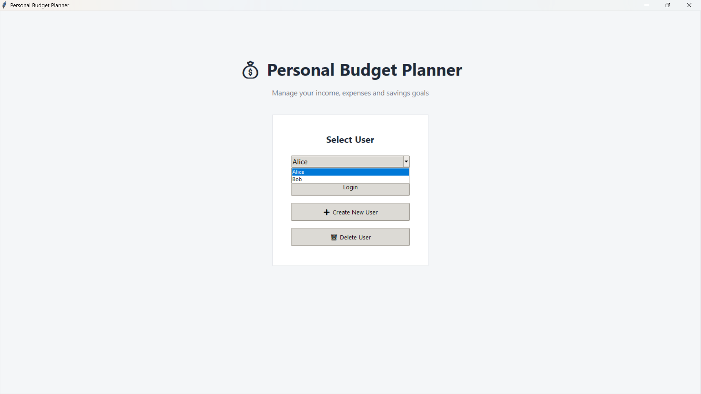
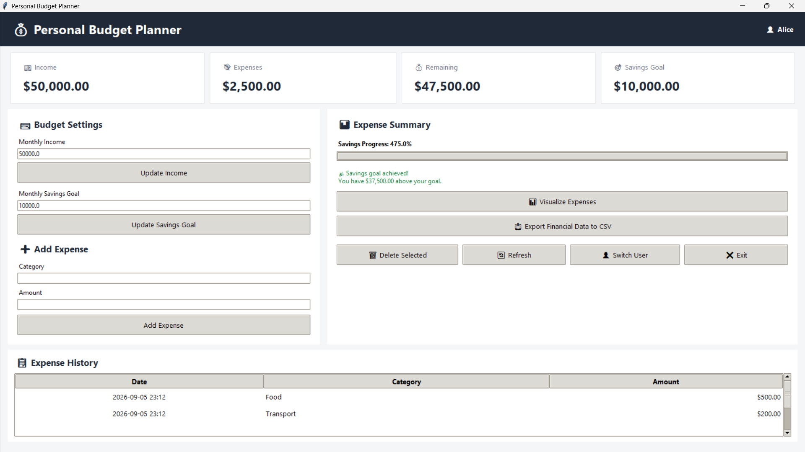
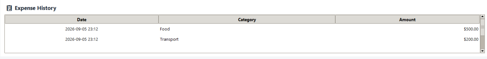
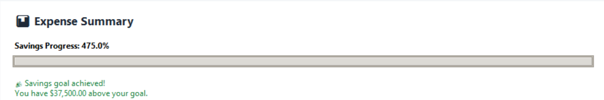
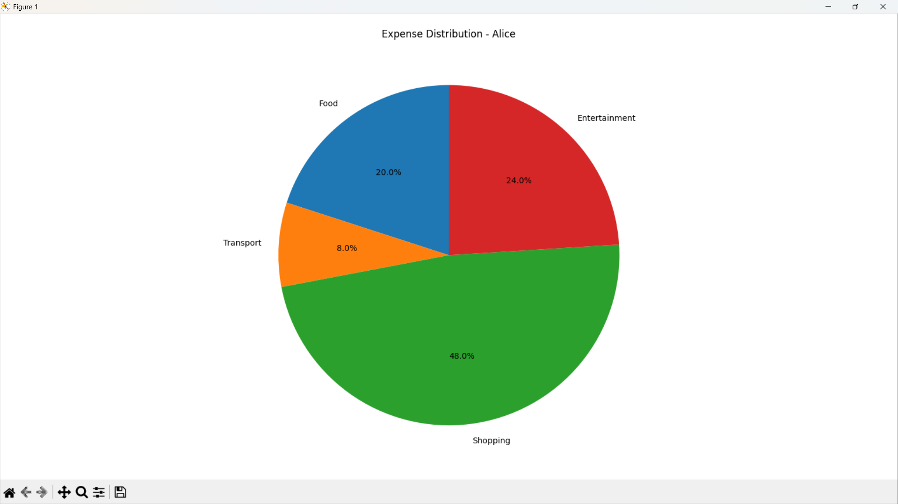

# 💰 Day 56 - Personal Budget Planner

Welcome to **Day 56** of my **100 Days, 100 Python Projects** challenge!

This project is a **Personal Budget Planner GUI application** built using **Python, Tkinter, JSON, CSV, Matplotlib, and Datetime**.

The application allows users to create and manage personal financial profiles, record monthly income, set savings goals, track expenses, monitor their remaining budget, visualize expense distribution, and export financial data to CSV.

The application also stores user data locally in a **JSON file**, allowing financial information to persist between application sessions.

The main purpose of this project is to gain practical experience with **GUI Development, File Handling, JSON Data Storage, CSV Export, Data Visualization, Financial Calculations, and Python Application Design**.

---

## 📌 Project Overview

Managing personal finances effectively requires keeping track of income, expenses, savings goals, and remaining budgets.

This project provides a simple desktop-based solution for managing these financial details.

Users can create their own profiles and manage their financial information independently.

The application allows users to:

* 👤 Create multiple users
* 🔐 Select and switch between users
* 💵 Set monthly income
* 🎯 Set a monthly savings goal
* 💸 Add expenses
* 📋 View expense history
* 🗑️ Delete selected expenses
* 💰 Calculate remaining budget
* 📊 Track savings progress
* 📈 Visualize expense distribution
* 📤 Export financial data to CSV
* 💾 Store data permanently in a JSON file
* 🔄 Refresh the dashboard
* ❌ Delete user profiles and their financial data

---

## ✨ Features

* 🖥️ Modern Tkinter GUI
* 👤 Multiple user profiles
* ➕ Create new users
* 🗑️ Delete users
* 🔄 Switch between users
* 💵 Monthly income management
* 🎯 Savings goal management
* ➕ Expense management
* 📋 Expense history table
* 🗑️ Delete individual expenses
* 💰 Automatic remaining budget calculation
* 📊 Savings progress bar
* 🎉 Savings goal achievement status
* 📈 Expense visualization using Matplotlib
* 🥧 Category-based expense pie chart
* 📤 CSV financial data export
* 💾 JSON-based persistent storage
* 🕒 Automatic expense date and time recording
* ⚠️ Input validation
* 🚨 Error handling
* 🔄 Dashboard refresh
* 📁 Local data storage
* 🎨 Styled dashboard interface

---

## 👤 User Management

The application supports multiple users.

When the application starts, users are presented with a **User Selection** screen.

Existing users can be selected from the dropdown menu.

New users can be created using:

```text
➕ Create New User
```

Each user has their own:

* Monthly income
* Savings goal
* Expense history

The financial data of one user is kept separate from another user's data.

---

## ➕ Creating a New User

To create a new user:

1. Click **Create New User**
2. Enter a username
3. Click **Create User**

The application validates the username.

For example:

```text
Username:
Abhijit
```

A new user is stored with the initial structure:

```python
{
    "income": 0.0,
    "savings_goal": 0.0,
    "expenses": []
}
```

If the username already exists, the application displays an error.

---

## 🔐 User Data Storage

All user information is stored locally in:

```text
budget_data.json
```

The application loads this file when it starts.

The data is stored in JSON format.

A simplified structure looks like:

```json
{
    "User": {
        "income": 50000.0,
        "savings_goal": 10000.0,
        "expenses": [
            {
                "date": "2026-09-05 18:30",
                "category": "Food",
                "amount": 500.0
            }
        ]
    }
}
```

This allows the application to preserve financial information between sessions.

---

## 💵 Income Management

Users can enter their monthly income from the **Budget Settings** section.

Example:

```text
Monthly Income
50000
```

Click:

```text
Update Income
```

The application validates the entered value and updates the user's financial information.

The dashboard automatically displays the updated income.

---

## 🎯 Savings Goal

Users can set a monthly savings goal.

For example:

```text
Monthly Savings Goal
10000
```

Click:

```text
Update Savings Goal
```

The application uses the savings goal to calculate progress.

---

## 💸 Adding Expenses

Users can add expenses by entering:

* Category
* Amount

For example:

```text
Category: Food
Amount: 500
```

Click:

```text
Add Expense
```

The application automatically records the current date and time.

An expense is stored as:

```python
{
    "date": datetime.now().strftime("%Y-%m-%d %H:%M"),
    "category": category,
    "amount": amount
}
```

The category is also formatted using:

```python
category.capitalize()
```

For example:

```text
food
```

becomes:

```text
Food
```

---

## 📋 Expense History

All expenses are displayed in the **Expense History** section.

The table contains:

| Date             | Category |    Amount |
| ---------------- | -------- | --------: |
| 2026-09-05 18:30 | Food     |   $500.00 |
| 2026-09-05 19:10 | Travel   |   $300.00 |
| 2026-09-05 20:00 | Shopping | $1,000.00 |

The table can be scrolled using the vertical scrollbar.

This allows users to easily review their recorded expenses.

---

## 🗑️ Deleting Expenses

Users can select an expense from the history table and click:

```text
🗑 Delete Selected
```

Before deleting the expense, the application displays a confirmation dialog containing:

* Date
* Category
* Amount

The expense is deleted only after the user confirms the action.

---

## 💰 Remaining Budget

The application automatically calculates the remaining budget.

The calculation is:

```text
Remaining Budget = Monthly Income - Total Expenses
```

For example:

```text
Income          = $50,000
Total Expenses  = $20,000
-------------------------
Remaining       = $30,000
```

The dashboard automatically updates this value whenever an expense or income value changes.

---

## 📊 Dashboard Statistics

The main dashboard contains four important financial statistics:

### 💵 Income

Displays the user's monthly income.

### 💸 Expenses

Displays the total amount spent.

### 💰 Remaining

Displays the remaining budget after expenses.

### 🎯 Savings Goal

Displays the user's target savings amount.

Example:

```text
Income       $50,000.00
Expenses     $20,000.00
Remaining    $30,000.00
Savings Goal $10,000.00
```

---

## 📈 Savings Progress Tracking

The application provides a visual progress bar for the savings goal.

The percentage is calculated using:

```python
percentage = (remaining / goal) * 100
```

The progress value is restricted between:

```text
0% and 100%
```

The application also displays the calculated percentage.

For example:

```text
Savings Progress: 125.0%
```

If the remaining budget is greater than or equal to the savings goal, the application displays:

```text
🎉 Savings goal achieved!
You have $X above your goal.
```

If the goal has not been reached, it displays:

```text
⚠️ Savings goal not reached.
You need $X more to reach your goal.
```

---

## 🥧 Expense Visualization

The application includes an **Expense Visualization** feature using Matplotlib.

Click:

```text
📊 Visualize Expenses
```

to generate a pie chart showing how expenses are distributed across categories.

For example:

```text
Food       → $5,000
Travel     → $3,000
Shopping   → $7,000
Utilities  → $2,000
```

The application calculates category totals using:

```python
category_totals = defaultdict(float)
```

and adds each expense to its corresponding category.

The chart is then generated using:

```python
plt.pie(
    sizes,
    labels=labels,
    autopct="%1.1f%%",
    startangle=90
)
```

This provides a visual representation of spending habits.

---

## 📤 Export Financial Data

The application allows users to export their financial information to a CSV file.

Click:

```text
📤 Export Financial Data to CSV
```

The user can choose where to save the CSV file.

The default filename is:

```text
<username>_financial_data.csv
```

For example:

```text
Abhijit_financial_data.csv
```

---

## 📄 CSV Report Structure

The exported CSV file contains a financial summary.

Example:

```text
PERSONAL BUDGET REPORT
User,Abhijit
Income,50000.00
Savings Goal,10000.00
Total Expenses,20000.00
Remaining Budget,30000.00

Date,Category,Amount
2026-09-05 18:30,Food,500.00
2026-09-05 19:10,Travel,300.00
2026-09-05 20:00,Shopping,1000.00
```

This allows users to open their financial report in applications such as:

* Microsoft Excel
* Google Sheets
* LibreOffice Calc
* Other spreadsheet applications

---

## 💾 JSON Data Persistence

The project uses JSON for persistent local data storage.

The `load_data()` function reads:

```text
budget_data.json
```

when the application starts.

The `save_data()` function writes updated information back to the file whenever financial data changes.

This means users do not have to enter their financial information every time they launch the application.

---

## 🔄 Refresh Dashboard

The:

```text
🔄 Refresh
```

button updates the dashboard using the latest stored information.

The refresh operation updates:

* Income
* Expenses
* Remaining budget
* Savings goal
* Savings progress
* Savings status
* Expense history

---

## 👤 Switching Users

Users can switch between different profiles using:

```text
👤 Switch User
```

The application returns to the user-selection screen.

This makes it possible to manage multiple financial profiles from the same application.

---

## 🗑️ Deleting Users

Existing users can be deleted from the user-selection screen.

Before deletion, the application asks for confirmation.

Deleting a user permanently removes:

* Income
* Savings goal
* Expense history
* Other stored financial information

from the application's JSON data.

---

## ⚠️ Input Validation

The application validates financial values before saving them.

### Income

Income must be a valid number greater than or equal to zero.

Invalid input displays:

```text
Invalid Income
Please enter a valid positive income amount.
```

### Savings Goal

The savings goal must also be a valid non-negative number.

### Expense Amount

Expense amounts must be greater than zero.

For example:

```text
-500
```

or:

```text
abc
```

will be rejected.

### Expense Category

The category cannot be empty.

---

## 🚨 Error Handling

The application uses exception handling to prevent unexpected crashes.

For example, JSON loading handles:

```python
json.JSONDecodeError
OSError
```

File-saving operations also handle operating-system errors.

CSV exporting uses exception handling to detect file-writing problems.

Message boxes are used to communicate:

* Errors
* Warnings
* Confirmations
* Successful operations

to the user.

---

## 🖥️ Application Screenshots

## Screenshots

### 1. 👤 User Selection

The user-selection screen allows users to select an existing profile or create a new one.



---

### 2. 💰 Main Dashboard

The main dashboard displays income, expenses, remaining budget, savings goal, budget settings, expense management, and other controls.



---

### 3. 📋 Expense History

The Expense History section displays all recorded expenses with their date, category, and amount.



---

### 4. 🎯 Savings Goal Tracking

The savings progress section displays the current progress toward the user's savings goal.



---

### 5. 📊 Expense Visualization

The application generates a pie chart showing the distribution of expenses across different categories.



---

## 🛠️ Technologies Used

* **Python 3**
* **Tkinter**
* **JSON**
* **CSV**
* **Matplotlib**
* **Datetime**
* **Collections**
* **OS**

### Python

Python is used to implement the complete application logic, including:

* User management
* Expense tracking
* Budget calculations
* Data storage
* GUI interaction
* Data export
* Visualization

### Tkinter

Tkinter is used to create the graphical user interface.

It provides:

* Windows
* Labels
* Buttons
* Entry fields
* Comboboxes
* Progress bars
* Treeviews
* Scrollbars
* Message boxes

### JSON

JSON is used for persistent local storage of user financial data.

### CSV

The `csv` module is used to export financial reports.

### Matplotlib

Matplotlib is used to visualize expense distribution using a pie chart.

### Datetime

The `datetime` module automatically records the date and time whenever an expense is added.

### Collections

`defaultdict` is used to calculate total spending for each expense category.

### OS

The `os` module is used to check whether the JSON data file exists.

---

## 📂 Project Structure

```text
DAY_56/
│
├── main56.py
├── budget_data.json
├── requirements.txt
├── README.md
└── screenshots/
    ├── user-selection.png
    ├── main-dashboard.png
    ├── expense-history.png
    ├── savings-goal-tracking.png
    └── expense-visualization.png
```

### File Description

| File / Folder      | Purpose                                  |
| ------------------ | ---------------------------------------- |
| `main56.py`        | Main Personal Budget Planner application |
| `budget_data.json` | Local persistent financial data          |
| `requirements.txt` | Python dependency list                   |
| `README.md`        | Project documentation                    |
| `screenshots/`     | Application screenshots                  |

> **Note:** `budget_data.json` is created and updated by the application when financial data is saved.

---

## 📦 requirements.txt

The project requires the following external Python library:

```text
matplotlib
```

Install the dependency using:

```bash
pip install -r requirements.txt
```

Alternatively:

```bash
pip install matplotlib
```

The following modules are included with Python and do not require separate installation:

```text
tkinter
json
csv
os
datetime
collections
```

---

## ▶️ How to Run

### 1. Make sure Python is installed

Check your Python version:

```bash
python --version
```

### 2. Open the project folder

Open a terminal inside the `DAY_56` folder.

### 3. Install the required dependency

```bash
pip install -r requirements.txt
```

### 4. Run the application

```bash
python main56.py
```

The **Personal Budget Planner** GUI will open automatically.

---

## 🔄 Application Workflow

The overall application workflow is:

```text
Start Application
       │
       ▼
Load JSON Data
       │
       ▼
User Selection
       │
       ├───────────────┐
       ▼               ▼
Create User       Select User
       │               │
       └───────┬───────┘
               ▼
          Main Dashboard
               │
       ┌───────┼────────┐
       ▼       ▼        ▼
    Income   Savings   Expenses
       │       Goal       │
       │       │          ▼
       │       │    Expense History
       │       │          │
       └───────┼──────────┘
               ▼
        Calculate Budget
               │
               ▼
       Savings Progress
               │
       ┌───────┴────────┐
       ▼                ▼
Visualize Expenses   Export CSV
       │                │
       ▼                ▼
    Pie Chart      Financial Report
```

---

## 🧩 Main Functions and Methods

| Function / Method     | Purpose                                 |
| --------------------- | --------------------------------------- |
| `load_data()`         | Loads financial data from JSON          |
| `save_data()`         | Saves financial data to JSON            |
| `show_user_screen()`  | Displays user selection interface       |
| `create_user()`       | Creates a new financial profile         |
| `login_user()`        | Logs in to the selected user            |
| `delete_user()`       | Deletes a user and their financial data |
| `show_dashboard()`    | Creates the main dashboard              |
| `create_stat_card()`  | Creates dashboard statistic cards       |
| `update_income()`     | Updates monthly income                  |
| `update_goal()`       | Updates savings goal                    |
| `add_expense()`       | Adds a new expense                      |
| `delete_expense()`    | Deletes a selected expense              |
| `refresh_dashboard()` | Updates dashboard information           |
| `plot_expenses()`     | Creates expense distribution chart      |
| `export_csv()`        | Exports financial data to CSV           |
| `switch_user()`       | Returns to user selection               |

---

## 🖥️ GUI Components Used

| Component     | Purpose                                    |
| ------------- | ------------------------------------------ |
| `Tk()`        | Creates the main application window        |
| `Frame`       | Organizes interface sections               |
| `Label`       | Displays text and statistics               |
| `Entry`       | Accepts income, goal, category, and amount |
| `Button`      | Performs application actions               |
| `Combobox`    | Selects users                              |
| `Treeview`    | Displays expense history                   |
| `Scrollbar`   | Scrolls through expense history            |
| `Progressbar` | Displays savings progress                  |
| `Toplevel`    | Creates dialog windows                     |
| `messagebox`  | Displays alerts and confirmations          |
| `filedialog`  | Selects CSV export location                |

---

## 📚 Concepts Practiced

* Python Programming
* Tkinter GUI Development
* Object-Oriented Programming
* JSON File Handling
* CSV File Handling
* Data Persistence
* User Management
* Expense Tracking
* Budget Calculations
* Savings Goal Tracking
* Date and Time Handling
* Data Visualization
* Matplotlib
* Pie Charts
* Dictionaries
* Lists
* `defaultdict`
* File Validation
* Input Validation
* Exception Handling
* GUI Event Handling
* File Export
* Local Data Storage
* Desktop Application Development

---

## 🎯 Learning Outcome

This project helped me understand:

* How to build a complete desktop application using Tkinter
* How to create multiple user profiles
* How to store application data using JSON
* How to load and save persistent data
* How to manage financial information programmatically
* How to calculate total expenses and remaining budgets
* How to implement savings goals
* How to create visual progress indicators
* How to use Matplotlib for financial visualization
* How to create category-based pie charts
* How to export data to CSV
* How to create and manage tables using Tkinter Treeview
* How to validate numerical input
* How to handle file-related errors
* How to use `defaultdict` for category-based calculations
* How to automatically record timestamps
* How to design a multi-section GUI dashboard
* How to combine multiple Python modules into a practical application
* How to build a real-world personal finance management tool

---

## ⚠️ Limitations

This project is designed as a simple personal budget management application and has some limitations:

* 💾 Data is stored locally in a JSON file
* 🔐 User profiles do not use passwords or authentication
* ☁️ No cloud synchronization
* 📱 No mobile application
* 📊 Only expense distribution is visualized
* 📈 No historical financial trend charts
* 💳 No bank or payment integration
* 🧾 No automatic transaction importing
* 💱 Currency is currently displayed using the `$` symbol
* 📅 Expenses are tracked without monthly filtering
* 📊 No category budget limits
* 🔔 No spending alerts or notifications
* 🔄 No automatic backup system

---

## 🔮 Future Improvements

Possible enhancements for future versions:

* 🔐 Add username and password authentication
* 🔒 Encrypt stored financial data
* 💱 Add multiple currency support
* 📅 Add monthly and yearly expense filtering
* 📊 Add monthly expense charts
* 📈 Add income vs expense graphs
* 🎯 Add category-wise budgets
* ⚠️ Add spending limit alerts
* 📊 Add detailed financial analytics
* 📉 Add spending trend visualization
* 💾 Add automatic data backups
* ☁️ Add cloud data synchronization
* 📱 Develop a mobile version
* 🌐 Convert the application into a web application
* 📤 Add Excel export
* 📄 Add PDF financial reports
* 🧾 Add recurring expenses
* 🔍 Add expense search and filtering
* ✏️ Add expense editing
* 🏷️ Add predefined expense categories
* 📊 Add financial dashboard analytics
* 🌙 Add Dark Mode
* 🎨 Improve the overall UI/UX
* 🔔 Add savings and budget notifications

---

## 📅 Challenge

This project is part of my **100 Days, 100 Python Projects** challenge, where I build one Python project every day to improve my Python programming skills, strengthen my problem-solving abilities, learn new technologies, and maintain consistency through daily coding.

**Day 56** focuses on **Personal Finance Management**, combining **Tkinter for GUI development**, **JSON for persistent data storage**, **CSV for financial data export**, and **Matplotlib for expense visualization** to create a practical Personal Budget Planner.

---

## 👨‍💻 Author

**Abhijit Munghate**

Happy Coding! 🚀🐍💰
