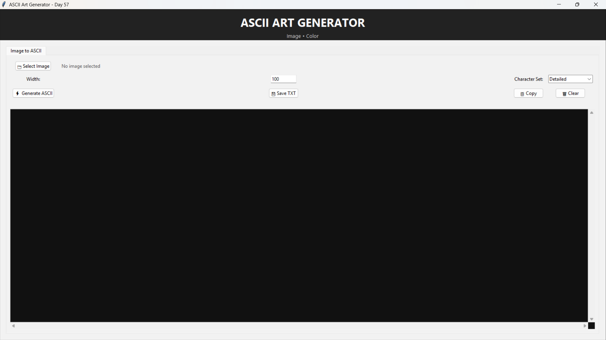
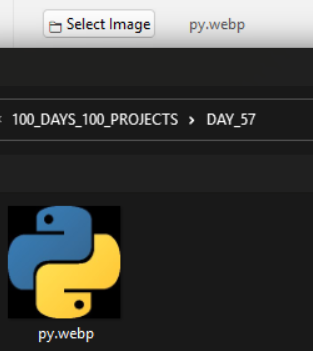
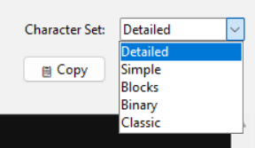
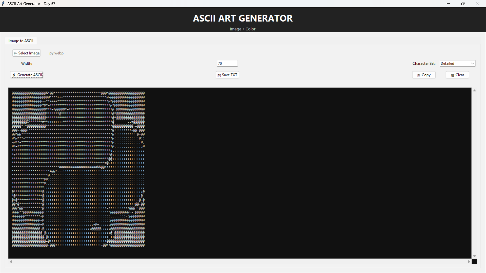
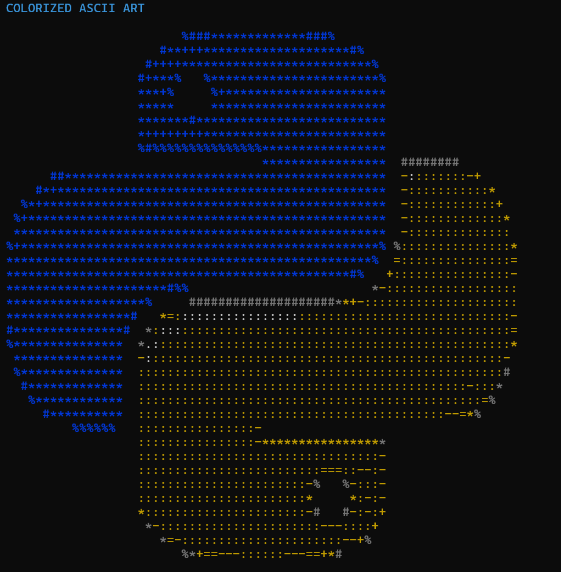

# 🚀 Day 57 - ASCII Art Generator

Welcome to **Day 57** of my **100 Days, 100 Python Projects** challenge!

This project is an **ASCII Art Generator** built using **Python, Tkinter, Pillow, and Colorama**. The application converts images into ASCII characters based on their brightness and provides both a **graphical user interface** and a **colorized terminal mode**.

The main purpose of this project is to gain practical experience with **image processing, pixel manipulation, ASCII conversion, terminal colors, file handling, and GUI development** using Python.

---

## 📌 Project Overview

ASCII art is a technique of creating images using text characters instead of traditional graphical pixels.

This project takes an image, processes its pixels, converts it into grayscale, and maps different brightness levels to ASCII characters.

The application provides two ways to generate ASCII art:

* 🖥️ Tkinter GUI for grayscale ASCII art
* 💻 Terminal mode for colorized ASCII art

Users can select an image, control the output width, choose different character sets, preview the generated ASCII art, copy it to the clipboard, and save it as a text file.

---

## ✨ Features

* 🖥️ Interactive Tkinter GUI
* 💻 Terminal-based ASCII art generator
* 📂 Image file selection
* 🖼️ JPG image support
* 🖼️ PNG image support
* 🖼️ BMP image support
* 🖼️ GIF image support
* 🖼️ WEBP image support
* 🔄 Automatic image resizing
* ⚖️ Aspect ratio preservation
* 🌑 Grayscale image conversion
* 🔤 Multiple ASCII character sets
* 📐 Adjustable ASCII output width
* 🔢 Width validation from 10 to 200 characters
* 👁️ Large ASCII preview area
* ↔️ Horizontal scrolling
* ↕️ Vertical scrolling
* 📋 Copy ASCII art to clipboard
* 💾 Save ASCII art as TXT
* 🎨 Colorized terminal ASCII output
* 🌈 RGB-to-ANSI color approximation
* ⚡ Fast pixel-to-character conversion
* 🧹 Clear generated ASCII art
* ⚠️ Input validation
* 🚨 Error handling using message boxes
* 🎛️ Tab-based GUI interface

---

## 🖼️ Application Screenshots

## Screenshots

### 🖥️ Main Window



### 📂 Image Selected



### 🔤 ASCII Character Sets



### 🖼️ ASCII Preview



### 🎨 Colorized Terminal Output



---

## 🛠️ Technologies Used

* **Python 3**
* **Tkinter**
* **Pillow**
* **Colorama**
* **OS Module**

### Python

Python is used to build the complete application logic, image processing workflow, ASCII conversion system, terminal interface, and GUI.

### Tkinter

Tkinter is Python's built-in GUI library and is used to create the graphical interface.

It provides:

* Buttons
* Labels
* Text areas
* Entry fields
* Combo boxes
* Scrollbars
* Tabs
* File dialogs
* Message boxes

### Pillow

Pillow is used for image processing.

It is responsible for:

* Opening images
* Reading image dimensions
* Resizing images
* Converting images to grayscale
* Accessing individual pixel values
* Reading RGB pixel values

The project uses:

```python
from PIL import Image
```

### Colorama

Colorama is used to display colored ASCII art in the terminal using ANSI color codes.

It provides colors such as:

```text
RED
GREEN
BLUE
YELLOW
MAGENTA
CYAN
WHITE
```

### OS Module

The `os` module is used for file and path operations, including checking whether an image file exists and displaying the selected image filename.

---

## 📂 Project Structure

```text
DAY_57/
│
├── main57.py
├── requirements.txt
├── README.md
└── screenshots/
    ├── main-window.png
    ├── image-selected.png
    ├── ascii-preview.png
    ├── character-sets.png
    └── colorized-terminal.png
```

### File Description

| File / Folder      | Purpose                 |
| ------------------ | ----------------------- |
| `main57.py`        | Main Python application |
| `requirements.txt` | Python dependencies     |
| `README.md`        | Project documentation   |
| `screenshots/`     | Application screenshots |

---

## 📦 requirements.txt

The project requires the following Python libraries:

```text
Pillow
colorama
```

Install all dependencies using:

```bash
pip install -r requirements.txt
```

### Built-in Python Libraries

The following modules are part of Python's standard library and do not need separate installation:

```text
tkinter
os
```

---

## ▶️ How to Run

### 1. Make sure Python is installed

Check your Python version:

```bash
python --version
```

### 2. Open the project folder

Open a terminal inside the `DAY_57` folder.

### 3. Install the required dependencies

```bash
pip install -r requirements.txt
```

### 4. Run the application

```bash
python main57.py
```

The terminal menu will appear.

```text
=======================================================
        ASCII ART GENERATOR
=======================================================

1. Generate Colorized ASCII from Image
2. Open Tkinter GUI
3. Exit
```

---

## 💻 Terminal Mode

The application provides a terminal-based mode for generating **colorized ASCII art**.

Select:

```text
1. Generate Colorized ASCII from Image
```

The application then asks for the image path:

```text
Enter image path:
```

After entering the path, the user can specify the ASCII width.

The generated ASCII art is displayed directly in the terminal using ANSI colors.

---

## 🎨 Colorized ASCII Art

The terminal mode uses the original RGB values of the image to approximate colors.

The function:

```python
rgb_to_ansi_color()
```

examines the RGB components and determines an approximate terminal color.

The application supports colors such as:

```text
Black
Red
Green
Blue
Yellow
Magenta
Cyan
White
Light Black
```

For example, an image containing a strong red component may be represented using:

```python
Fore.RED
```

The ASCII characters are then printed together with the corresponding ANSI color code.

---

## 🖥️ Tkinter GUI

The second option opens the graphical interface:

```text
2. Open Tkinter GUI
```

The GUI provides an easier way to generate and manage ASCII art.

The main interface contains:

* Image selection
* ASCII width input
* Character set selection
* Generate button
* Save button
* Copy button
* Clear button
* ASCII preview area
* Horizontal scrollbar
* Vertical scrollbar

---

## 📂 Selecting an Image

The **Select Image** button opens a file-selection dialog.

Supported image formats include:

```text
JPG
JPEG
PNG
BMP
GIF
WEBP
```

The selected filename is displayed in the GUI.

The application stores the selected image path and uses it when generating the ASCII art.

---

## 📐 ASCII Width

Users can control the width of the generated ASCII art.

The default width is:

```text
100
```

The maximum supported width is:

```text
200
```

The application also requires the width to be at least:

```text
10
```

Therefore, the valid range is:

```text
10 - 200
```

If an invalid width is entered, the application displays an error message.

---

## 🔄 Image Resizing

Before converting an image into ASCII characters, the image is resized.

The project maintains the approximate aspect ratio using:

```python
aspect_ratio = img.height / img.width
```

The output height also uses a factor of:

```text
0.55
```

This compensates for the difference between the height and width of typical terminal characters.

This helps prevent the generated ASCII image from appearing excessively stretched vertically.

---

## 🌑 Grayscale Conversion

The GUI converts the selected image into grayscale using:

```python
img.convert("L")
```

Grayscale pixels contain values between:

```text
0 - 255
```

where:

```text
0   → Black
255 → White
```

These brightness values are then mapped to ASCII characters.

---

## 🔤 ASCII Character Sets

The application provides five different ASCII character sets.

### 1. Detailed

```text
@%#*+=-:. 
```

Provides a larger range of characters and can produce more detailed ASCII art.

### 2. Simple

```text
#*:. 
```

Uses fewer characters for a simpler appearance.

### 3. Blocks

```text
█▓▒░ 
```

Uses block characters to create a more graphical appearance.

### 4. Binary

```text
10 
```

Uses only `1` and `0` characters.

### 5. Classic

```text
@#S%?*+;:,.
```

Uses a classic ASCII-art style character set.

---

## 🔢 Pixel-to-ASCII Mapping

Each grayscale pixel is mapped to one character from the selected character set.

The project uses the following calculation:

```python
ascii_chars[pixel * (len(ascii_chars) - 1) // 255]
```

This converts the pixel range:

```text
0 - 255
```

into the available character indexes.

For example, darker pixels are mapped toward the beginning of the character set, while brighter pixels are mapped toward the end.

The resulting characters are then combined into a string.

---

## 🖼️ ASCII Preview

After generating the ASCII art, the result is displayed inside a large Tkinter `Text` widget.

The preview uses a dark background and a monospaced font:

```text
Consolas
```

A monospaced font ensures that every ASCII character occupies approximately the same horizontal space, which is important for maintaining the visual structure of the generated image.

The preview also provides:

* ↕️ Vertical scrolling
* ↔️ Horizontal scrolling

This allows users to view large ASCII images without changing the generated output.

---

## 💾 Saving ASCII Art

Generated ASCII art can be saved as a text file.

The **Save TXT** button opens a save dialog and allows the user to select the output location.

The ASCII art is written using:

```python
open(output_path, "w", encoding="utf-8")
```

The output format is:

```text
TXT
```

For example:

```text
my_ascii_art.txt
```

---

## 📋 Copy to Clipboard

The **Copy** button allows the generated ASCII art to be copied directly to the system clipboard.

The project uses Tkinter clipboard functionality:

```python
self.root.clipboard_clear()
self.root.clipboard_append(self.ascii_art)
```

This makes it easy to paste the generated ASCII art into:

* Text editors
* Terminals
* Documents
* Chat applications
* Code files

---

## 🧹 Clear Function

The **Clear** button resets the current application state.

It:

* Clears the generated ASCII art
* Clears the preview area
* Removes the selected image
* Resets the image label

This allows the user to start a new conversion without restarting the application.

---

## ⚠️ Input Validation

The application performs validation before generating ASCII art.

For example, if no image has been selected, the application displays:

```text
Please select an image first.
```

The ASCII width is also validated.

The allowed width range is:

```text
10 - 200
```

Invalid values generate an appropriate error message.

The application also handles image-processing and file-related exceptions using `try-except` blocks.

---

## 🚨 Error Handling

The GUI uses Tkinter message boxes to communicate errors and warnings.

Examples include:

### No Image

```text
No Image
Please select an image first.
```

### Invalid Input

```text
Invalid Input
Width must be between 10 and 200.
```

### Save Error

If the ASCII art cannot be saved, the application displays the corresponding error.

This makes the application more user-friendly and prevents unexpected crashes during normal usage.

---

## 🧩 Main Functions

### `load_image()`

Loads and resizes an image while maintaining its approximate aspect ratio.

```python
load_image(image_path, new_width)
```

### `convert_to_grayscale()`

Converts the image into grayscale.

```python
convert_to_grayscale(img)
```

### `map_pixels_to_ascii()`

Maps grayscale pixel values to characters from the selected ASCII character set.

```python
map_pixels_to_ascii(img, ascii_chars)
```

### `generate_ascii_art()`

Combines image loading, resizing, grayscale conversion, and pixel mapping to generate the final ASCII art.

```python
generate_ascii_art(image_path, new_width, character_set)
```

### `rgb_to_ansi_color()`

Approximates RGB colors using terminal ANSI colors.

```python
rgb_to_ansi_color(r, g, b)
```

### `generate_color_ascii()`

Generates colorized ASCII art for terminal output.

```python
generate_color_ascii(image_path, new_width)
```

### `save_ascii_art()`

Saves generated ASCII art to a text file.

```python
save_ascii_art(ascii_art, output_path)
```

---

## 🖥️ GUI Components Used

The project uses several Tkinter components:

| Component    | Purpose                                      |
| ------------ | -------------------------------------------- |
| `Tk()`       | Creates the main application window          |
| `Frame`      | Organizes GUI sections                       |
| `Label`      | Displays text and filenames                  |
| `Button`     | Performs application actions                 |
| `Entry`      | Accepts ASCII width                          |
| `Combobox`   | Selects ASCII character sets                 |
| `Notebook`   | Creates the tabbed interface                 |
| `Text`       | Displays generated ASCII art                 |
| `Scrollbar`  | Enables horizontal and vertical scrolling    |
| `messagebox` | Displays warnings, errors, and confirmations |
| `filedialog` | Selects input images and output files        |

---

## 📚 Libraries and Functions Practiced

### Pillow

| Function / Feature         | Purpose                           |
| -------------------------- | --------------------------------- |
| `Image.open()`             | Opens image files                 |
| `Image.resize()`           | Resizes images                    |
| `Image.convert()`          | Converts images to grayscale/RGB  |
| `Image.Resampling.LANCZOS` | High-quality image resizing       |
| `getdata()`                | Accesses pixel data               |
| `getpixel()`               | Retrieves individual pixel values |

### Tkinter

| Function / Component | Purpose                     |
| -------------------- | --------------------------- |
| `Tk()`               | Creates the main window     |
| `Frame()`            | Creates GUI containers      |
| `Label()`            | Displays information        |
| `Button()`           | Creates interactive buttons |
| `Entry()`            | Accepts user input          |
| `Text()`             | Displays ASCII art          |
| `StringVar()`        | Stores GUI values           |
| `Notebook()`         | Creates tabbed interface    |
| `Scrollbar()`        | Adds scrolling              |
| `filedialog`         | Handles file selection      |
| `messagebox`         | Displays messages           |

### Colorama

| Feature           | Purpose                    |
| ----------------- | -------------------------- |
| `Fore.RED`        | Red terminal text          |
| `Fore.GREEN`      | Green terminal text        |
| `Fore.BLUE`       | Blue terminal text         |
| `Fore.YELLOW`     | Yellow terminal text       |
| `Fore.MAGENTA`    | Magenta terminal text      |
| `Fore.CYAN`       | Cyan terminal text         |
| `Fore.WHITE`      | White terminal text        |
| `Style.RESET_ALL` | Resets terminal formatting |
| `colorama.init()` | Initializes Colorama       |

### Python Standard Library

| Module / Feature    | Purpose                        |
| ------------------- | ------------------------------ |
| `os.path.isfile()`  | Checks whether an image exists |
| `open()`            | Saves ASCII art                |
| `input()`           | Accepts terminal input         |
| `try-except`        | Handles runtime errors         |
| List comprehensions | Processes pixel data           |
| String slicing      | Creates ASCII art lines        |

---

## 📚 Concepts Practiced

* Python Programming
* Object-Oriented Programming
* Tkinter GUI Development
* Image Processing
* Pillow
* Pixel Manipulation
* RGB Color Processing
* Grayscale Conversion
* ASCII Art Generation
* Character Mapping
* Image Resizing
* Aspect Ratio Calculation
* ANSI Terminal Colors
* Color Approximation
* File Handling
* Text File Generation
* Clipboard Handling
* Input Validation
* Exception Handling
* GUI Event Handling
* Terminal Applications
* Functions and Modular Programming
* Dictionaries
* List Comprehensions
* String Manipulation

---

## 🎯 Learning Outcome

This project helped me understand:

* How digital images are represented using pixels
* How to open and process images using Pillow
* How to resize images while maintaining aspect ratio
* How grayscale conversion works
* How pixel brightness can be mapped to characters
* How to generate ASCII art from image data
* How different ASCII character sets affect the output
* How to access individual RGB pixel values
* How to approximate image colors using ANSI terminal colors
* How to create a Tkinter-based image-processing application
* How to create scrollable text-based previews
* How to copy generated content to the clipboard
* How to save generated output as a text file
* How to validate user input
* How to handle file and image-processing errors
* How to combine third-party Python libraries in a practical project
* How terminal applications and GUI applications can work together

---

## 🔮 Future Improvements

Possible enhancements for future versions:

* 🎨 Add full-color ASCII preview inside the GUI
* 🌈 Add more ANSI terminal colors
* 🖼️ Add original image preview
* ↔️ Add automatic width adjustment
* 🔢 Add custom character-set creation
* 🔤 Allow users to enter their own ASCII characters
* 💾 Add PNG export of ASCII art
* 📄 Add PDF export
* 📝 Add HTML export with colors
* 🎨 Add customizable ASCII text color
* 🌓 Add Dark Mode and Light Mode
* 🔍 Add zoom controls for the ASCII preview
* ↕️ Add automatic height adjustment
* 🖼️ Add drag-and-drop image support
* 📁 Add batch image conversion
* 📦 Add output folder selection
* ⚡ Add optimized processing for very large images
* 🌈 Add true-color terminal output
* 📊 Add image brightness/contrast controls
* 🔆 Add brightness adjustment
* 🎚️ Add contrast adjustment
* 🖼️ Add edge-detection ASCII mode
* 🎭 Add multiple artistic rendering modes
* 📱 Improve overall GUI design

---

## 📅 Challenge

This project is part of my **100 Days, 100 Python Projects** challenge, where I build one Python project every day to improve my Python programming skills, strengthen my problem-solving abilities, learn new technologies, and maintain consistency through daily coding.

**Day 57** focuses on **Image Processing and ASCII Art Generation**, combining **Pillow for image manipulation**, **Tkinter for GUI development**, and **Colorama for terminal color output** to create a practical ASCII Art Generator.

---

## 👨‍💻 Author

**Abhijit Munghate**

Happy Coding! 🚀🐍🎨
