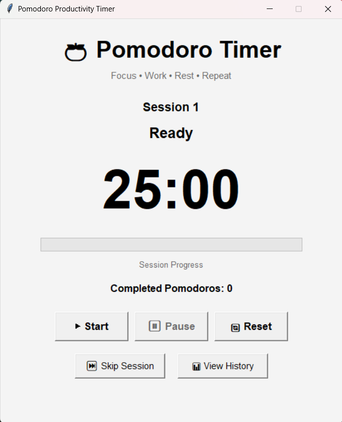
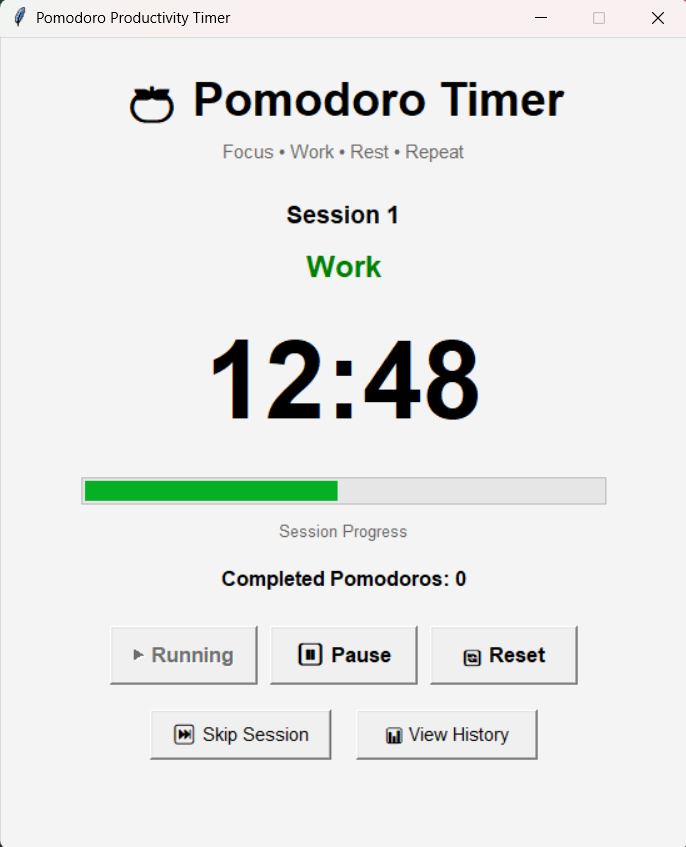
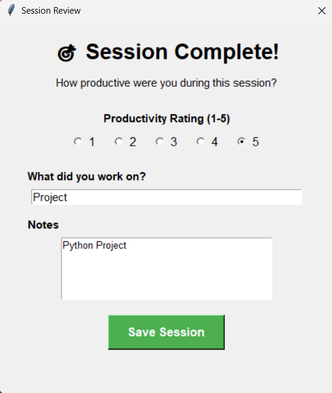
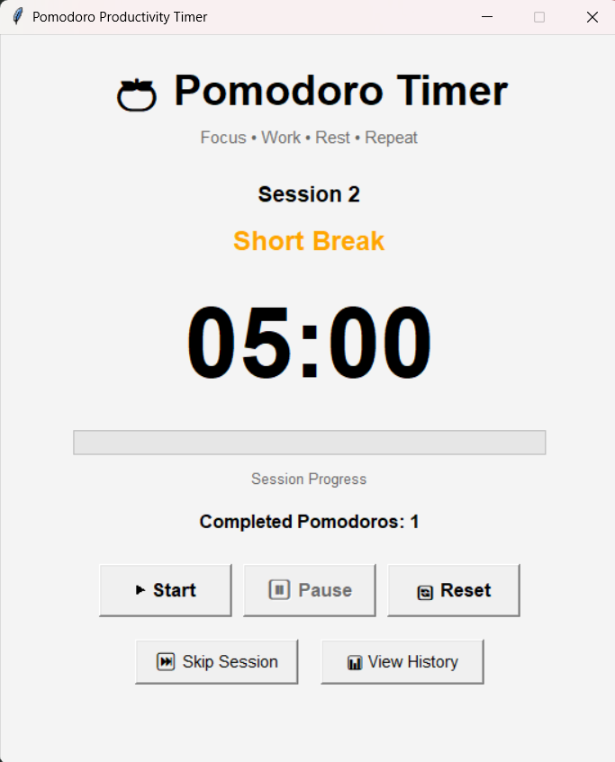
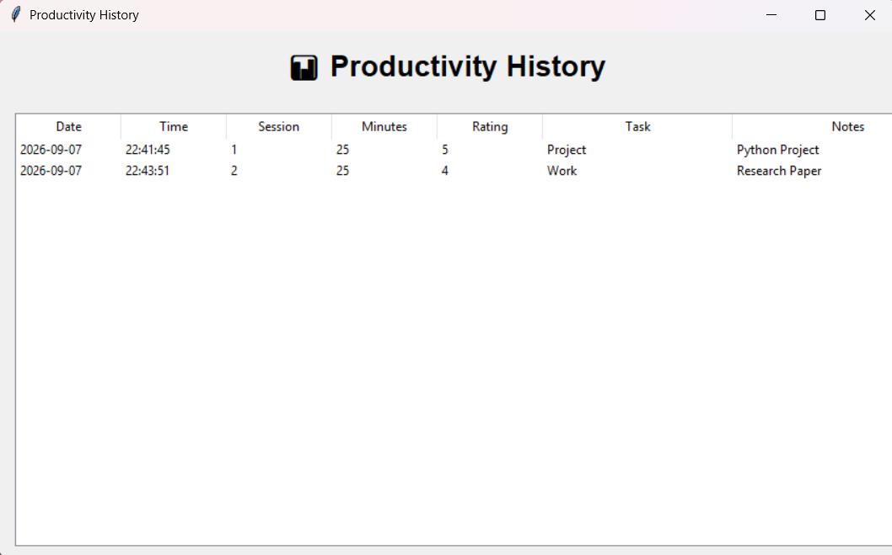

# 🚀 Day 58 - Pomodoro Timer

Welcome to **Day 58** of my **100 Days, 100 Python Projects** challenge!

This project is a **Pomodoro Productivity Timer** built using **Python and Tkinter**. The application implements the Pomodoro technique by dividing work into focused sessions followed by short or long breaks.

The application also records completed work sessions, allows users to rate their productivity, store tasks and notes, and view their productivity history.

The main purpose of this project is to gain practical experience with **GUI development, timer-based event handling, session management, JSON data persistence, user input handling, and productivity tracking** using Python.

---

## 📌 Project Overview

The **Pomodoro Technique** is a time-management method that divides work into focused intervals followed by short breaks.

This project provides a graphical Pomodoro timer where users can:

* 🍅 Start a work session
* ⏸️ Pause and resume the timer
* 🔄 Reset the timer
* ⏭️ Skip the current session
* ☕ Take short breaks
* 🌙 Take long breaks after four completed Pomodoros
* 🔔 Receive a notification when a session ends
* ⭐ Rate productivity from 1 to 5
* 📝 Record the task worked on
* 📋 Add session notes
* 💾 Store completed sessions in JSON
* 📊 View productivity history
* ⏱️ Track completed Pomodoros
* 📈 Monitor session progress

The default Pomodoro cycle is:

```text
25 minutes Work
       ↓
5 minutes Short Break
       ↓
25 minutes Work
       ↓
5 minutes Short Break
       ↓
25 minutes Work
       ↓
5 minutes Short Break
       ↓
25 minutes Work
       ↓
15 minutes Long Break
       ↓
Repeat
```

---

## ✨ Features

* 🍅 Pomodoro timer
* ⏱️ 25-minute work sessions
* ☕ 5-minute short breaks
* 🌙 15-minute long breaks
* ▶️ Start timer
* ⏸️ Pause timer
* ▶️ Resume paused timer
* 🔄 Reset timer
* ⏭️ Skip session
* 🔔 Session completion notification
* 📊 Session progress bar
* 🔢 Completed Pomodoro counter
* 🎯 Productivity rating from 1–5
* 📝 Task tracking
* 📋 Session notes
* 💾 Automatic session history storage
* 📄 JSON-based data persistence
* 📊 Productivity history window
* 📅 Date and time recording
* 🖥️ Tkinter GUI
* 📜 Scrollable productivity history
* ⚠️ Input validation
* 🚨 Error handling
* 🔄 Automatic work/break transitions

---

## 🖼️ Application Screenshots

## Screenshots

### 🖥️ Main Window



### 🍅 Work Session



### 🎯 Session Review



### ☕ Break Session



### 📊 Productivity History



---

## 🛠️ Technologies Used

* **Python 3**
* **Tkinter**
* **JSON**
* **Datetime**
* **OS**
* **Winsound**

### Python

Python is used to implement the timer logic, session management, productivity tracking, file handling, and graphical user interface.

### Tkinter

Tkinter is Python's built-in GUI library and is used to create the application's interface.

It provides:

* Labels
* Buttons
* Progress bars
* Text fields
* Radio buttons
* Windows
* Dialogs
* Treeviews
* Scrollbars
* Message boxes

### JSON

JSON is used to store completed Pomodoro session history.

The application stores information such as:

* Date
* Time
* Session number
* Duration
* Productivity rating
* Task
* Notes

### Datetime

The `datetime` module is used to record the date and time when a work session is completed.

The application stores:

```text
Date → YYYY-MM-DD
Time → HH:MM:SS
```

### OS

The `os` module is used to check whether the session history file exists before loading it.

### Winsound

On Windows systems, the `winsound` module is used to play a notification sound when a timer session finishes.

The project also includes a fallback using Tkinter's window bell when `winsound` is unavailable.

---

## 📂 Project Structure

```text
DAY_58/
│
├── main58.py
├── session_history.json
├── README.md
└── screenshots/
    ├── main-window.png
    ├── work-session.png
    ├── session-review.png
    ├── break-session.png
    └── productivity-history.png
```

> `session_history.json` is created automatically when the first completed work session is saved.

### File Description

| File / Folder          | Purpose                                   |
| ---------------------- | ----------------------------------------- |
| `main58.py`            | Main Python application                   |
| `session_history.json` | Stores completed Pomodoro session history |
| `README.md`            | Project documentation                     |
| `screenshots/`         | Application screenshots                   |

---

## 📦 Dependencies

This project primarily uses Python's built-in libraries.

No external package installation is required.

The application uses:

```text
tkinter
datetime
json
os
winsound
```

### Built-in Modules

All of the above modules are included with standard Python installations.

`winsound` is available on Windows systems. If it is unavailable, the application uses Tkinter's built-in `bell()` notification.

---

## ▶️ How to Run

### 1. Make sure Python is installed

Check your Python version:

```bash
python --version
```

### 2. Open the project folder

Open a terminal inside the `DAY_58` folder.

### 3. Run the application

```bash
python main58.py
```

The **Pomodoro Productivity Timer** window will open automatically.

---

## 🍅 Pomodoro Timer

The application starts with a default work session of:

```text
25:00
```

The timer displays:

* Current session number
* Current session type
* Remaining time
* Session progress
* Completed Pomodoros

The default session durations are defined as:

```python
WORK_TIME = 25 * 60
SHORT_BREAK = 5 * 60
LONG_BREAK = 15 * 60
```

The values are stored in seconds because the timer counts down once every second.

---

## ▶️ Starting a Session

The **Start** button starts the current timer.

When the timer starts:

* The Start button becomes disabled
* The Pause button becomes enabled
* The session status is displayed
* The countdown begins
* The progress bar starts updating

The application uses Tkinter's:

```python
window.after()
```

to execute the countdown repeatedly without freezing the GUI.

---

## ⏸️ Pause and Resume

The **Pause** button temporarily stops the countdown.

When paused:

```text
Work - Paused
```

is displayed.

The current timer value is preserved.

The application also cancels the scheduled timer callback using:

```python
window.after_cancel()
```

The **Start** button changes to:

```text
▶ Resume
```

Pressing it resumes the timer from the current remaining time.

---

## 🔄 Reset Timer

The **Reset** button completely resets the current Pomodoro cycle.

It resets:

* Session count
* Completed Pomodoros
* Current session type
* Timer duration
* Progress bar
* Status
* Button states

The timer returns to:

```text
25:00
```

and:

```text
Session 1
Completed Pomodoros: 0
```

---

## ⏭️ Skip Session

The **Skip Session** button allows the user to move to the next session without waiting for the current timer to finish.

### If the current session is Work

The application moves to:

```text
Short Break
```

or:

```text
Long Break
```

depending on the completed Pomodoro count.

### If the current session is a Break

The application moves directly to:

```text
Work
```

This gives users control over their Pomodoro cycle.

---

## ☕ Short Break

After completing a work session, the application normally prepares a:

```text
5-minute Short Break
```

The status changes to:

```text
Short Break
```

and the timer becomes:

```text
05:00
```

After the break finishes, the application prepares the next work session.

---

## 🌙 Long Break

After every four completed Pomodoros, the application starts a:

```text
15-minute Long Break
```

The logic checks:

```python
if completed_pomodoros > 0 and completed_pomodoros % 4 == 0:
```

Therefore:

```text
Pomodoro 1 → Short Break
Pomodoro 2 → Short Break
Pomodoro 3 → Short Break
Pomodoro 4 → Long Break
```

This cycle then repeats.

---

## 🔔 Session Notifications

When a timer reaches zero, the application plays a notification.

On Windows systems, it attempts to use:

```python
winsound.MessageBeep()
```

If `winsound` is unavailable or the sound cannot be played, the application uses:

```python
window.bell()
```

This allows the user to know that the current session has ended without continuously watching the timer.

---

## 📊 Session Progress

The application includes a progress bar that visually represents the progress of the current session.

The progress is calculated using:

```python
progress = ((total_seconds - current_seconds) / total_seconds) * 100
```

For example:

```text
Session Start
0%
  ↓
50%
  ↓
100%
Session Complete
```

This provides a quick visual indication of how much of the current session has been completed.

---

## 🔢 Completed Pomodoros

Every time a **Work** session reaches zero, the application increments the completed Pomodoro counter.

For example:

```text
Completed Pomodoros: 0
```

After the first completed work session:

```text
Completed Pomodoros: 1
```

After four completed work sessions:

```text
Completed Pomodoros: 4
```

The counter is also used to determine whether the next break should be a short break or a long break.

---

## 🎯 Session Review

After completing a work session, the application opens a **Session Review** window.

The user can record:

### ⭐ Productivity Rating

The user can select a productivity rating from:

```text
1  2  3  4  5
```

where the rating represents how productive the session was.

### 📝 Task

The user can enter what they worked on.

For example:

```text
Completed Python project documentation
```

### 📋 Notes

The user can add additional information about the session.

For example:

```text
Completed most of the planned work and reviewed the code.
```

The session review must be saved before continuing to the next session.

---

## 💾 Session History

Completed work sessions are stored in:

```text
session_history.json
```

Each session contains information such as:

```json
{
    "date": "2026-09-07",
    "time": "22:30:15",
    "session": 1,
    "duration_minutes": 25,
    "productivity": 4,
    "task": "Python Project",
    "notes": "Completed the main functionality."
}
```

This allows productivity information to remain available after the application is closed.

---

## 📊 Productivity History

The **View History** button opens a separate productivity history window.

The history is displayed using a Tkinter `Treeview`.

The table contains:

| Column  | Description                         |
| ------- | ----------------------------------- |
| Date    | Date of the completed session       |
| Time    | Time when the session was completed |
| Session | Pomodoro session number             |
| Minutes | Session duration                    |
| Rating  | Productivity rating                 |
| Task    | Work performed during the session   |
| Notes   | Additional session information      |

A scrollbar allows the user to browse through multiple completed sessions.

---

## 📄 JSON Data Persistence

The project uses JSON instead of a database to keep the application simple and lightweight.

The history file is:

```text
session_history.json
```

The application uses:

```python
json.load()
```

to read existing history and:

```python
json.dump()
```

to save updated history.

If the history file does not exist, the application starts with an empty history.

If the JSON file contains invalid data, the application safely returns an empty history instead of crashing.

---

## 🧠 Timer State Management

The application maintains several variables to control the timer.

### `timer_running`

Determines whether the timer is currently active.

```text
True  → Timer running
False → Timer stopped
```

### `timer_paused`

Tracks whether the timer is paused.

```text
True  → Timer paused
False → Timer not paused
```

### `current_seconds`

Stores the number of seconds remaining in the current session.

### `total_seconds`

Stores the original duration of the current session.

### `current_session_type`

Stores the current session type:

```text
Work
Short Break
Long Break
```

### `completed_pomodoros`

Tracks the number of completed work sessions.

---

## 🧩 Main Functions

### `play_notification()`

Plays a notification sound when a session finishes.

### `load_history()`

Loads previously stored session data from JSON.

### `save_history()`

Saves session history to the JSON file.

### `add_session_to_history()`

Creates a session record containing:

* Date
* Time
* Session number
* Duration
* Productivity
* Task
* Notes

### `update_timer_display()`

Updates:

* Timer display
* Progress bar
* Session number

### `start_timer()`

Starts or resumes the current timer.

### `countdown()`

Handles the one-second countdown and schedules the next update.

### `finish_session()`

Determines what happens after a timer reaches zero.

### `prepare_work_session()`

Prepares a new 25-minute work session.

### `show_productivity_dialog()`

Displays the session review form.

### `prepare_next_session()`

Determines whether the next session should be a short or long break.

### `pause_timer()`

Pauses the current timer and cancels the scheduled callback.

### `reset_timer()`

Resets the entire Pomodoro cycle.

### `skip_session()`

Skips the current work or break session.

### `get_session_color()`

Returns a different display color depending on the current session type.

### `show_history()`

Displays all previously completed work sessions in a Treeview.

---

## 🖥️ GUI Components Used

The project uses several Tkinter components:

| Component     | Purpose                                    |
| ------------- | ------------------------------------------ |
| `Tk()`        | Creates the main application window        |
| `Toplevel()`  | Creates session review and history windows |
| `Label`       | Displays timer and status information      |
| `Button`      | Performs timer actions                     |
| `Frame`       | Organizes GUI components                   |
| `Progressbar` | Displays session progress                  |
| `Radiobutton` | Selects productivity rating                |
| `Entry`       | Accepts task information                   |
| `Text`        | Accepts session notes                      |
| `Treeview`    | Displays productivity history              |
| `Scrollbar`   | Enables history scrolling                  |
| `messagebox`  | Displays notifications and warnings        |

---

## 📚 Libraries and Functions Practiced

### Tkinter

| Function / Component | Purpose                      |
| -------------------- | ---------------------------- |
| `Tk()`               | Creates the main window      |
| `Toplevel()`         | Creates additional windows   |
| `Label()`            | Displays text                |
| `Button()`           | Creates interactive buttons  |
| `Frame()`            | Organizes interface sections |
| `Progressbar()`      | Displays session progress    |
| `Radiobutton()`      | Allows rating selection      |
| `Entry()`            | Accepts task input           |
| `Text()`             | Accepts notes                |
| `Treeview()`         | Displays session history     |
| `Scrollbar()`        | Adds scrolling               |
| `after()`            | Schedules timer updates      |
| `after_cancel()`     | Cancels scheduled callbacks  |
| `messagebox`         | Displays messages            |

### JSON

| Function      | Purpose          |
| ------------- | ---------------- |
| `json.load()` | Reads JSON data  |
| `json.dump()` | Writes JSON data |

### Datetime

| Function         | Purpose                        |
| ---------------- | ------------------------------ |
| `datetime.now()` | Gets the current date and time |
| `strftime()`     | Formats date and time          |

### OS

| Function           | Purpose                                |
| ------------------ | -------------------------------------- |
| `os.path.exists()` | Checks whether the history file exists |

### Winsound

| Function                 | Purpose                            |
| ------------------------ | ---------------------------------- |
| `winsound.MessageBeep()` | Plays a Windows notification sound |

---

## 📚 Concepts Practiced

* Python Programming
* Tkinter GUI Development
* Event-Driven Programming
* Timer-Based Applications
* Countdown Timers
* `after()` Scheduling
* `after_cancel()`
* Global State Management
* Session Management
* Pomodoro Technique
* JSON Data Persistence
* File Handling
* Date and Time Handling
* Productivity Tracking
* User Input Handling
* Radio Buttons
* Progress Bars
* Treeview Tables
* Scrollbars
* Multiple Tkinter Windows
* Message Boxes
* Exception Handling
* Conditional Logic
* Functions
* Dictionaries
* Lists
* GUI Event Handling
* Windows Notifications

---

## 🎯 Learning Outcome

This project helped me understand:

* How to build a timer application using Tkinter
* How to implement countdown functionality
* How to use `window.after()` for repeated GUI updates
* How to cancel scheduled Tkinter callbacks
* How to pause and resume timers
* How to manage different application states
* How to implement the Pomodoro technique programmatically
* How to automatically switch between work and break sessions
* How to implement short and long break logic
* How to track completed Pomodoros
* How to create session review forms
* How to collect productivity ratings and notes
* How to store application data in JSON
* How to load and save persistent data
* How to display historical data using Treeview
* How to create multiple Tkinter windows
* How to handle user input
* How to provide sound notifications
* How to combine productivity tracking with GUI development
* How to create a practical real-world Python application

---

## 🔮 Future Improvements

Possible enhancements for future versions:

* ⏱️ Allow users to customize work duration
* ☕ Allow users to customize short-break duration
* 🌙 Allow users to customize long-break duration
* ⚙️ Add a settings window
* 🔔 Add custom notification sounds
* 🎵 Add background focus music
* 📊 Add productivity charts
* 📈 Add daily productivity statistics
* 📅 Add weekly productivity reports
* 📆 Add monthly productivity reports
* ⭐ Calculate average productivity rating
* 🔥 Add daily Pomodoro streak tracking
* 🎯 Add daily Pomodoro goals
* 📋 Add a dedicated task manager
* 📝 Allow editing previous session notes
* 🗑️ Add session history deletion
* 📤 Export productivity history to CSV
* 📄 Export productivity reports to PDF
* 💾 Add database support
* 🌙 Add Dark Mode
* 🎨 Improve GUI styling
* 🔔 Add desktop notifications
* 📱 Improve responsive layout
* 📊 Add productivity analytics dashboard
* 🏆 Add achievements and milestones
* ☁️ Add cloud-based productivity synchronization

---

## 📅 Challenge

This project is part of my **100 Days, 100 Python Projects** challenge, where I build one Python project every day to improve my Python programming skills, strengthen my problem-solving abilities, learn new technologies, and maintain consistency through daily coding.

**Day 58** focuses on **Productivity and Time Management**, combining **Tkinter for GUI development**, **Python timer events for session management**, and **JSON for persistent productivity history** to create a practical Pomodoro Timer application.

---

## 👨‍💻 Author

**Abhijit Munghate**

Happy Coding! 🚀🐍🍅
