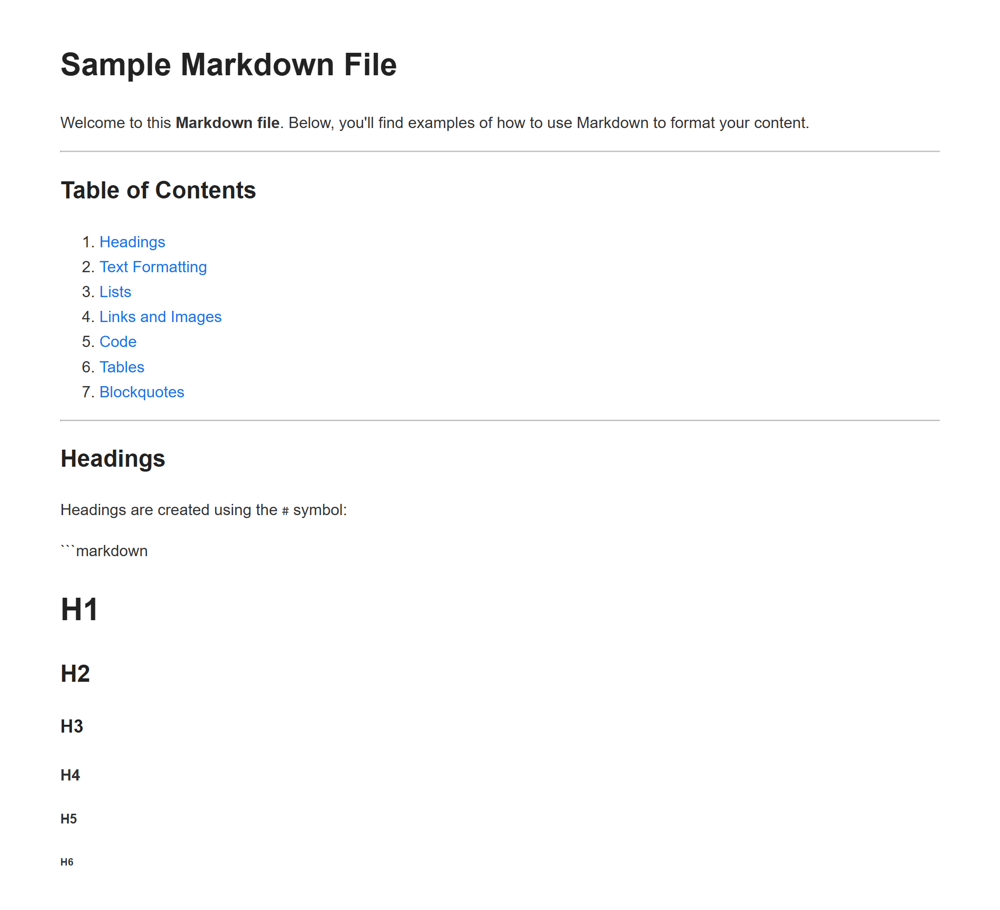

# 🚀 Day 59 - Markdown to HTML Converter

Welcome to **Day 59** of my **100 Days, 100 Python Projects** challenge!

This project is a **Markdown to HTML Converter** built using **Python, the Markdown library, and Flask**. The application converts Markdown files into properly structured HTML documents, supports batch conversion of entire folders, allows custom CSS styling, and provides a Flask-based live preview.

The main purpose of this project is to gain practical experience with **Markdown processing, HTML generation, file handling, web development with Flask, CSS integration, and automation of document conversion** using Python.

---

## 📌 Project Overview

Markdown is a lightweight markup language commonly used for documentation, README files, technical writing, and web content.

This project converts Markdown content into HTML that can be opened directly in a web browser.

The application provides three main operations:

* 📄 Convert a single Markdown file
* 📂 Convert multiple Markdown files from a folder
* 🌐 Preview Markdown as a webpage using Flask

Users can also provide a custom CSS file to modify the appearance of the generated HTML.

The Markdown converter supports several useful Markdown features through extensions such as:

* 📊 Tables
* 💻 Fenced code blocks
* ↵️ Line breaks

---

## ✨ Features

* 💻 Command-line interface
* 📄 Single Markdown file conversion
* 📂 Bulk Markdown folder conversion
* 📝 `.md` file support
* 📝 `.markdown` file support
* 🌐 Markdown to HTML conversion
* 📊 Markdown table support
* 💻 Fenced code block support
* ↵️ Line break support
* 🎨 Custom CSS support
* 📄 Complete HTML document generation
* 🏷️ Automatic HTML title generation
* 📁 Automatic output directory creation
* 🌐 Flask-powered live preview
* 🔄 Automatic browser preview refresh
* 🌍 Automatic browser opening
* ⚠️ File validation
* 🚨 Exception handling
* 📋 Conversion progress in terminal
* 📊 Conversion success/failure reporting
* 🔤 UTF-8 file encoding

---

## 🖼️ Application Screenshots

## Screenshots

### 🌐 Live Preview



> Make sure these screenshot filenames match the actual files in your `screenshots/` folder.

---

## 🛠️ Technologies Used

* **Python 3**
* **Markdown**
* **Flask**
* **HTML**
* **CSS**
* **Web Browser**
* **Pathlib**

### Python

Python is used to implement the complete conversion workflow, file handling, command-line interface, CSS integration, and Flask preview functionality.

### Markdown

The Python Markdown library converts Markdown syntax into HTML.

The project uses:

```python
markdown.markdown(
    markdown_text,
    extensions=["tables", "fenced_code", "nl2br"]
)
```

The enabled extensions provide support for:

* Tables
* Fenced code blocks
* Newline-to-`<br>` conversion

### Flask

Flask is used to create a lightweight local web server for the live preview functionality.

The preview is available at:

```text
http://127.0.0.1:5000
```

The generated HTML content is rendered using Flask's:

```python
render_template_string()
```

### HTML

HTML is generated as the final output format.

The converter creates a complete HTML document containing:

* `DOCTYPE`
* `<html>`
* `<head>`
* `<meta>`
* `<title>`
* `<style>`
* `<body>`

### CSS

CSS is used to style the generated HTML documents.

The application provides default styling and also allows users to provide their own custom CSS file.

### Pathlib

The `pathlib` module is used for modern file and directory path handling.

It is used for:

* File paths
* File extensions
* Relative paths
* Output directories
* Filename manipulation

---

## 📂 Project Structure

```text
DAY_59/
│
├── main59.py
├── requirements.txt
├── README.md
└── screenshots/
    └── live-preview.png
```

### File Description

| File / Folder      | Purpose                 |
| ------------------ | ----------------------- |
| `main59.py`        | Main Python application |
| `requirements.txt` | Python dependencies     |
| `README.md`        | Project documentation   |
| `screenshots/`     | Application screenshots |

The Markdown input files, CSS files, and generated HTML files can be stored outside the project directory and selected through their file paths.

---

## 📦 requirements.txt

The project requires the following Python libraries:

```text
markdown
flask
```

Install all dependencies using:

```bash
pip install -r requirements.txt
```

### Built-in Python Libraries

The following modules are part of Python's standard library and do not require separate installation:

```text
os
webbrowser
pathlib
```

---

## ▶️ How to Run

### 1. Make sure Python is installed

Check your Python version:

```bash
python --version
```

### 2. Open the project folder

Open a terminal inside the `DAY_59` folder.

### 3. Install the required dependencies

```bash
pip install -r requirements.txt
```

### 4. Run the application

```bash
python main59.py
```

The terminal menu will appear:

```text
=======================================================
       MARKDOWN TO HTML CONVERTER
=======================================================

Choose an option:
1. Convert a Markdown file
2. Convert all Markdown files in a folder
3. Live preview
4. Exit
```

---

## 📄 Converting a Single Markdown File

Option:

```text
1. Convert a Markdown file
```

allows the user to convert one Markdown file.

The application asks for:

```text
Enter Markdown file path:
```

The user then provides the output HTML path:

```text
Enter output HTML file path:
```

The application:

1. Reads the Markdown file
2. Converts Markdown to HTML
3. Optionally loads custom CSS
4. Generates an HTML title
5. Wraps the content in a complete HTML document
6. Creates the output directory if necessary
7. Saves the generated HTML file

Example:

```text
Input:
README.md

Output:
output/README.html
```

---

## 📂 Bulk Markdown Conversion

Option:

```text
2. Convert all Markdown files in a folder
```

allows users to convert multiple Markdown files automatically.

The application searches the input folder recursively using:

```python
input_folder.rglob("*.md")
```

and:

```python
input_folder.rglob("*.markdown")
```

This means Markdown files can also exist inside nested directories.

For example:

```text
documents/
├── guide.md
├── notes.markdown
└── tutorials/
    ├── python.md
    └── flask.md
```

The converter preserves the relative directory structure in the output folder.

For example:

```text
output/
├── guide.html
├── notes.html
└── tutorials/
    ├── python.html
    └── flask.html
```

---

## 🔄 Folder Conversion Workflow

The bulk conversion process follows these steps:

```text
Select Input Folder
        ↓
Search for Markdown Files
        ↓
Find .md / .markdown Files
        ↓
Read Markdown Content
        ↓
Convert Markdown → HTML
        ↓
Apply CSS
        ↓
Create Output Directories
        ↓
Save HTML Files
```

The terminal displays the conversion progress:

```text
Found 3 Markdown file(s).
--------------------------------------------------

✓ guide.md → output/guide.html
✓ notes.md → output/notes.html
✓ tutorial.md → output/tutorial.html

--------------------------------------------------
Successfully converted: 3 file(s)
```

---

## 🎨 Custom CSS Support

The application allows users to apply their own CSS styling to the generated HTML.

When converting a file, the application asks:

```text
Do you want to use a custom CSS file? (y/n):
```

If the user selects:

```text
y
```

the application asks for the CSS file path.

The CSS content is then inserted into the generated HTML document.

This allows users to customize:

* Fonts
* Colors
* Spacing
* Headings
* Tables
* Code blocks
* Links
* Page layout

---

## 📝 Default HTML Styling

If no custom CSS is provided, the converter applies built-in styling.

The generated HTML includes styling for elements such as:

```text
body
h1
h2
h3
a
img
table
th
td
pre
code
blockquote
```

For example, generated pages have:

* Centered content
* Maximum width of 900px
* Readable typography
* Styled tables
* Styled code blocks
* Responsive images
* Styled blockquotes
* Link formatting

---

## 🏷️ Automatic HTML Titles

The HTML title is generated automatically from the Markdown filename.

For example:

```text
my_python_project.md
```

becomes:

```text
My Python Project
```

The project uses:

```python
markdown_path.stem.replace("_", " ").title()
```

This creates a more readable browser title without requiring the user to manually enter one.

---

## 📊 Markdown Tables

The converter enables the Markdown `tables` extension.

This allows Markdown such as:

```text
| Name | Age |
| ---- | --- |
| John | 20 |
| Alice | 22 |
```

to be converted into an HTML table.

The generated table can then be styled using the default CSS or custom CSS.

---

## 💻 Fenced Code Blocks

The project enables the:

```text
fenced_code
```

extension.

This allows Markdown code blocks such as:

````text
```python
print("Hello World")
```
````

to be converted into HTML code blocks.

This is particularly useful for:

* Programming tutorials
* Documentation
* README files
* Technical articles
* Coding notes

---

## ↵️ Line Break Support

The project also enables:

```text
nl2br
```

which converts newline characters into HTML line breaks.

This helps preserve line formatting when Markdown is converted into HTML.

---

## 🌐 Live Preview

Option:

```text
3. Live preview
```

allows users to preview a Markdown file as a webpage.

The application:

1. Reads the Markdown file
2. Converts it into HTML
3. Loads optional CSS
4. Starts a Flask server
5. Opens the browser automatically
6. Displays the generated webpage

The local preview server runs at:

```text
http://127.0.0.1:5000
```

The preview uses Flask's:

```python
@app.route("/")
```

route to display the generated content.

---

## 🔄 Automatic Preview Refresh

The Flask preview includes a small JavaScript timer:

```javascript
setTimeout(function() {
    location.reload();
}, 3000);
```

This causes the preview webpage to reload approximately every three seconds.

This provides a simple live-preview experience while the Flask server is running.

---

## 🌍 Automatic Browser Opening

The project uses Python's `webbrowser` module:

```python
webbrowser.open(...)
```

to automatically open the local Flask preview in the user's default web browser.

This avoids requiring the user to manually open the browser after starting the preview.

---

## 📄 Generated HTML Structure

The converter wraps the generated Markdown HTML inside a complete HTML document.

The structure is approximately:

```html
<!DOCTYPE html>
<html lang="en">
<head>
    <meta charset="UTF-8">
    <meta name="viewport"
          content="width=device-width, initial-scale=1.0">

    <title>Markdown to HTML</title>

    <style>
        /* Default or custom CSS */
    </style>
</head>

<body>
    <!-- Converted Markdown HTML -->
</body>
</html>
```

This means the generated file can be opened directly in a browser.

---

## 📁 Automatic Directory Creation

The application automatically creates missing output directories.

The function:

```python
output_path.parent.mkdir(
    parents=True,
    exist_ok=True
)
```

ensures that the required directory structure exists before writing the HTML file.

For example, if the output path is:

```text
generated/pages/tutorial.html
```

the required directories are created automatically if they do not already exist.

---

## ⚠️ File Validation

The application validates input files before attempting conversion.

For example, when converting a single file:

```python
if not os.path.isfile(markdown_file):
```

checks whether the specified Markdown file actually exists.

If the file cannot be found, the application displays:

```text
✗ Markdown file not found.
```

The CSS file is also checked before it is used.

If the CSS file does not exist, the application continues without custom CSS.

---

## 🚨 Error Handling

The project uses `try-except` blocks to handle possible runtime errors.

Errors can occur during:

* File reading
* Markdown conversion
* CSS loading
* HTML generation
* File writing
* Folder conversion
* Flask preview startup

Instead of immediately terminating, the application displays an appropriate error message in the terminal.

---

## 🧩 Main Functions

### `read_markdown_file()`

Reads Markdown content from a file using UTF-8 encoding.

```python
read_markdown_file(file_path)
```

### `read_css_file()`

Reads CSS content from a file.

```python
read_css_file(css_path)
```

### `convert_markdown_to_html()`

Converts Markdown text into HTML using the Python Markdown library.

```python
convert_markdown_to_html(markdown_text)
```

### `wrap_in_html_template()`

Places converted HTML content inside a complete HTML document.

```python
wrap_in_html_template(
    content,
    css_content,
    title
)
```

### `write_html_file()`

Writes the generated HTML content to the specified output path.

```python
write_html_file(html_content, output_path)
```

### `convert_single_file()`

Handles the complete conversion process for one Markdown file.

```python
convert_single_file(
    markdown_path,
    output_path,
    css_path
)
```

### `convert_folder()`

Recursively finds Markdown files and converts them into HTML.

```python
convert_folder(
    input_folder,
    output_folder,
    css_path
)
```

### `preview()`

Flask route responsible for displaying the generated HTML preview.

```python
@app.route("/")
def preview():
```

### `start_preview()`

Starts the Flask preview server and opens the browser.

```python
start_preview(
    html_content,
    css_content,
    title
)
```

### `get_css_file()`

Asks the user whether a custom CSS file should be used.

```python
get_css_file()
```

### `main()`

Controls the application's command-line menu and user interaction.

---

## 🖥️ Flask Components Used

| Component                  | Purpose                       |
| -------------------------- | ----------------------------- |
| `Flask()`                  | Creates the Flask application |
| `@app.route("/")`          | Defines the preview route     |
| `render_template_string()` | Renders generated HTML        |
| `app.run()`                | Starts the local Flask server |

---

## 📚 Libraries and Functions Practiced

### Python Markdown

| Function / Feature    | Purpose                            |
| --------------------- | ---------------------------------- |
| `markdown.markdown()` | Converts Markdown into HTML        |
| `tables`              | Enables Markdown tables            |
| `fenced_code`         | Enables fenced code blocks         |
| `nl2br`               | Converts newlines into `<br>` tags |

### Flask

| Function / Feature         | Purpose                   |
| -------------------------- | ------------------------- |
| `Flask()`                  | Creates Flask application |
| `route()`                  | Defines URL routes        |
| `render_template_string()` | Renders HTML content      |
| `app.run()`                | Starts local server       |

### Pathlib

| Function / Feature | Purpose                          |
| ------------------ | -------------------------------- |
| `Path()`           | Creates path objects             |
| `.stem`            | Gets filename without extension  |
| `.suffix`          | Gets file extension              |
| `.rglob()`         | Recursively searches directories |
| `.relative_to()`   | Calculates relative paths        |
| `.with_suffix()`   | Changes file extensions          |
| `.parent`          | Gets parent directory            |
| `.mkdir()`         | Creates directories              |

### Python Standard Library

| Function / Module   | Purpose                      |
| ------------------- | ---------------------------- |
| `os.path.isfile()`  | Checks whether a file exists |
| `open()`            | Reads and writes files       |
| `webbrowser.open()` | Opens the browser            |
| `try-except`        | Handles runtime errors       |
| `input()`           | Accepts terminal input       |

---

## 📚 Concepts Practiced

* Python Programming
* File Handling
* Markdown Processing
* HTML Generation
* CSS Integration
* Flask Web Development
* Local Web Servers
* Command-Line Applications
* Recursive Directory Traversal
* Path Manipulation
* File Conversion
* Batch Processing
* String Formatting
* HTML Templates
* Web Browser Automation
* JSON-like data flow through Flask templates
* Jinja Template Rendering
* JavaScript Page Refresh
* Input Validation
* Exception Handling
* UTF-8 Encoding
* Functions and Modular Programming
* Python Standard Library
* Third-Party Libraries

---

## 🎯 Learning Outcome

This project helped me understand:

* How Markdown syntax is converted into HTML
* How to process Markdown files using Python
* How to create complete HTML documents programmatically
* How to add CSS to generated HTML
* How to support custom CSS files
* How to process multiple Markdown files automatically
* How to recursively search directories using `Path.rglob()`
* How to preserve folder structures during bulk conversion
* How to manipulate file paths using `pathlib`
* How to create missing output directories automatically
* How to build a command-line conversion tool
* How to use Flask to create a local web preview
* How to render dynamically generated HTML using Flask
* How to automatically open a local webpage in a browser
* How to implement a simple automatic preview refresh
* How to handle file-related errors
* How to validate input files
* How to use Markdown extensions
* How to combine Python, Markdown, HTML, CSS, and Flask in one project
* How document conversion can be automated using Python

---

## 🔮 Future Improvements

Possible enhancements for future versions:

* 🖥️ Add a graphical user interface
* 👁️ Add side-by-side Markdown and HTML preview
* 🔄 Add real-time Markdown preview
* 🎨 Add multiple built-in themes
* 🌙 Add Dark Mode
* 🎨 Add custom theme selection
* 💻 Add syntax highlighting for code blocks
* 📋 Add copy HTML button
* 📄 Add HTML download button
* 📊 Add Markdown statistics
* 🔍 Add search functionality
* 📑 Add table of contents generation
* 🔗 Add link validation
* 🖼️ Improve image path handling
* 📂 Add drag-and-drop file support
* 📦 Add ZIP export for generated websites
* 🌐 Add static website generation
* 🧩 Add support for more Markdown extensions
* 📝 Add front-matter support
* 📄 Add PDF export
* 📚 Add documentation website generation
* ⚡ Improve bulk conversion performance
* 👁️ Add browser-based editing
* 💾 Add automatic backup of generated files
* 🔧 Add command-line arguments for automation

---

## 📅 Challenge

This project is part of my **100 Days, 100 Python Projects** challenge, where I build one Python project every day to improve my Python programming skills, strengthen my problem-solving abilities, learn new technologies, and maintain consistency through daily coding.

**Day 59** focuses on **Document Conversion and Web Development**, combining the **Python Markdown library for Markdown processing**, **Pathlib for file management**, and **Flask for local web preview** to create a practical Markdown to HTML Converter.

---

## 👨‍💻 Author

**Abhijit Munghate**

Happy Coding! 🚀🐍📝🌐
