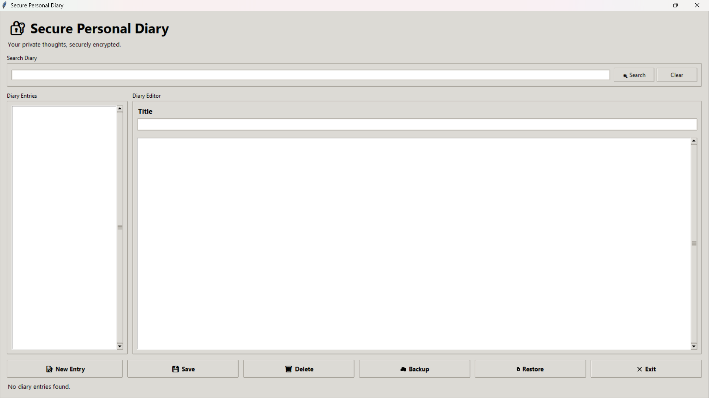
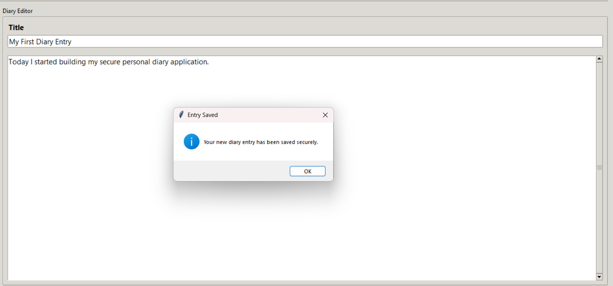
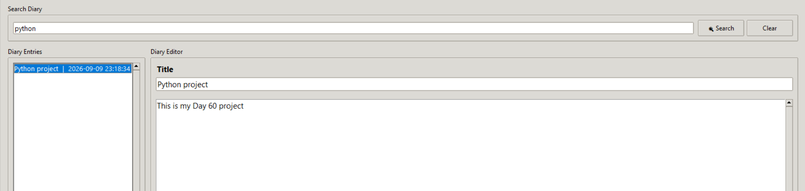
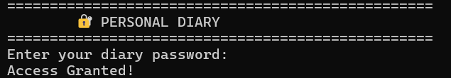

# 🚀 Day 60 - Personal Diary App

Welcome to **Day 60** of my **100 Days, 100 Python Projects** challenge! 🐍

For Day 60, I built a **Secure Personal Diary App** using Python and Tkinter. The application allows users to create, edit, search, and delete personal diary entries while protecting the stored diary data using **Fernet symmetric encryption**.

The application also includes **password-based authentication** and an optional **Google Drive cloud backup and restore system** for securely backing up encrypted diary entries.

This project combines **GUI development, file handling, encryption, authentication, cloud APIs, data management, and modular Python programming** into one complete desktop application.

---

## 📌 Project Overview

The **Personal Diary App** is a secure desktop diary application designed to keep personal notes and thoughts protected.

Instead of storing diary entries as readable text files, the application encrypts every entry using the **Fernet encryption system** provided by the `cryptography` library.

The application provides:

* 🔐 Password protection
* 🔒 Encrypted diary entries
* 📝 Create and edit diary entries
* 📖 View existing entries
* 🔍 Search diary entries
* 🗑️ Delete entries
* ☁️ Google Drive backup
* ↻ Google Drive restore
* 🖥️ Tkinter graphical interface
* 📁 Local file-based storage
* 🧩 Modular project architecture

The application follows this basic workflow:

```text
User
  ↓
Password Authentication
  ↓
Tkinter Diary Interface
  ↓
Create / Read / Update / Delete Entries
  ↓
Encrypt Diary Data
  ↓
Store Encrypted .diary Files
  ↓
Optional Google Drive Backup
```

---

## ✨ Features

### 🔐 Password Authentication

* Creates a diary password during the first launch.
* Password is requested on subsequent launches.
* Passwords are stored as SHA-256 hashes instead of plain text.
* Access is granted only when the entered password matches the stored hash.

### 🔒 Encrypted Diary Entries

* Diary content is encrypted using **Fernet symmetric encryption**.
* Encryption key is stored locally in `secret.key`.
* Each diary entry is stored as an encrypted `.diary` file.
* Plain-text diary content is not directly stored on disk.

### 📝 Create Diary Entries

* Create a new diary entry from the GUI.
* Enter a title and diary content.
* Automatically records the current date and time.
* Generates a unique filename using the timestamp and sanitized title.

### ✏️ Update Diary Entries

* Select an existing diary entry.
* Modify its title or content.
* Save the updated entry.
* Updated entries are encrypted again before being written to disk.

### 📖 Read Diary Entries

* Select an entry from the diary list.
* The application decrypts the stored file.
* Title and content are displayed in the editor.

### 🔍 Search Diary Entries

* Search by title or content.
* Search is case-insensitive.
* Only matching encrypted entries are displayed in the list.

### 🗑️ Delete Diary Entries

* Delete selected diary entries.
* Confirmation dialog is displayed before deletion.
* Prevents accidental deletion.

### ☁️ Google Drive Backup

* Connects to Google Drive using Google's OAuth authentication.
* Creates a dedicated:

```text
Personal Diary Backup
```

folder in Google Drive.

* Uploads encrypted `.diary` files.
* The files remain encrypted before being uploaded.

### ↻ Google Drive Restore

* Downloads encrypted diary entries from Google Drive.
* Restores them to the local diary storage folder.
* Existing files with the same name may be overwritten.

### 🖥️ Graphical User Interface

* Built using Tkinter.
* Clean two-panel diary layout.
* Search functionality.
* Scrollable diary entry list.
* Scrollable content editor.
* Status information.
* Keyboard shortcuts.

### ⌨️ Keyboard Shortcuts

| Shortcut   | Action           |
| ---------- | ---------------- |
| `Ctrl + S` | Save diary entry |
| `Ctrl + F` | Focus search box |
| `Enter`    | Perform search   |

### 🛡️ Input Validation

* Empty diary titles are rejected.
* Empty diary content is rejected.
* Empty passwords are rejected.
* Password confirmation is required during first-time setup.
* Invalid or missing files are handled with appropriate messages.

---

## 🖼️ Application Screenshots

## 📸 Screenshots

### Main Dashboard


### Creating a Diary Entry


### Search Feature


### Authentication


### 🖥️ Main Dashboard

Displays the main Secure Personal Diary application with the entry list, search bar, editor, and action buttons.

### 📝 Create Diary Entry

Shows the interface used to create a new diary entry.

### 🔍 Search Results

Shows diary entries filtered using the search feature.

### 🔐 Password Authentication

Shows the terminal-based password authentication process.


> Replace the screenshot filenames above with your actual screenshot filenames if they are different.

---

## 🛠️ Technologies Used

### 🐍 Python

Python is used as the primary programming language for the entire application.

The project uses Python for:

* GUI development
* File handling
* Encryption
* Authentication
* Data processing
* Google Drive integration
* Application logic

---

### 🖥️ Tkinter

Tkinter is used to build the desktop graphical user interface.

The application uses:

* `Tk`
* `Frame`
* `Label`
* `Entry`
* `Text`
* `Listbox`
* `Button`
* `LabelFrame`
* `Scrollbar`
* `StringVar`
* `ttk.Style`

---

### 🔐 Cryptography / Fernet

The `cryptography` library provides Fernet symmetric encryption.

The application uses:

```python
from cryptography.fernet import Fernet
```

Fernet provides authenticated symmetric encryption, allowing diary entries to be encrypted and later decrypted using the same secret key.

---

### 🔑 SHA-256

Python's built-in `hashlib` module is used to hash the diary password.

```python
hashlib.sha256(password.encode("utf-8")).hexdigest()
```

The resulting hash is stored in:

```text
password.hash
```

The original password is not stored by the application.

---

### ☁️ Google Drive API

The Google Drive API is used to provide cloud backup and restore functionality.

The project uses:

* `google-api-python-client`
* `google-auth-httplib2`
* `google-auth-oauthlib`

OAuth authentication is used to authorize access to Google Drive.

---

### 📁 pathlib

The `pathlib` module is used for platform-independent file and directory handling.

It is used for:

* Creating directories
* Checking file existence
* Building file paths
* Reading files
* Managing diary entries

---

## 📂 Project Structure

```text
DAY_60/
│
├── main60.py
├── encryption.py
├── diary_manager.py
├── cloud_backup.py
├── gui.py
├── requirements.txt
│
├── credentials/
│   ├── credentials.json
│   └── token.json
│
├── data/
│   └── entries/
│       ├── 2026-09-09_20-30-15_My_Diary.diary
│       └── ...
│
├── secret.key
├── password.hash
│
├── README.md
│
└── screenshots/
    ├── main-dashboard.png
    ├── create-entry.png
    ├── search-feature.png
    └── authentication.png
```

### ⚠️ Important

The following files contain sensitive security information and **should not be uploaded to GitHub**:

```text
secret.key
password.hash
credentials/credentials.json
credentials/token.json
```

A `.gitignore` file should be used to exclude them.

---

## 📄 File Description

| File               | Description                                                         |
| ------------------ | ------------------------------------------------------------------- |
| `main60.py`        | Application entry point, password authentication and initialization |
| `encryption.py`    | Generates, loads, encrypts and decrypts diary data                  |
| `diary_manager.py` | Creates, reads, updates, searches and deletes diary entries         |
| `cloud_backup.py`  | Google Drive authentication, backup and restore functionality       |
| `gui.py`           | Tkinter graphical user interface                                    |
| `requirements.txt` | Contains third-party Python dependencies                            |
| `secret.key`       | Locally generated Fernet encryption key                             |
| `password.hash`    | SHA-256 hash of the diary password                                  |
| `data/entries/`    | Stores encrypted diary entry files                                  |
| `credentials/`     | Stores Google OAuth credentials and token files                     |

---

## 📦 requirements.txt

```text
cryptography
google-api-python-client
google-auth-httplib2
google-auth-oauthlib
```

Install all required dependencies using:

```bash
pip install -r requirements.txt
```

---

# ▶️ How to Run

## 1. Clone the Repository

Clone the project repository:

```bash
git clone <your-repository-url>
```

Navigate to the project:

```bash
cd DAY_60
```

---

## 2. Check Python Installation

Make sure Python is installed:

```bash
python --version
```

---

## 3. Install Dependencies

Run:

```bash
pip install -r requirements.txt
```

---

## 4. Run the Application

Start the application using:

```bash
python main60.py
```

---

## 🔐 First-Time Setup

When the application is launched for the first time, it checks whether:

```text
password.hash
```

exists.

If it does not exist, the application asks the user to create a password.

```text
No diary password has been configured.

Create a password:
Confirm password:
```

The password is hashed using SHA-256 and the resulting hash is stored in:

```text
password.hash
```

The actual password is not stored.

---

## 🔑 Authentication

On subsequent launches, the application asks for the diary password:

```text
Enter your diary password:
```

If the password is correct:

```text
Access Granted!
```

The graphical diary application starts.

If the password is incorrect:

```text
Access Denied!
```

The application exits.

---

# 🔒 Encryption System

One of the main objectives of Day 60 is learning how to protect sensitive user data.

The application generates an encryption key using:

```python
Fernet.generate_key()
```

The key is stored in:

```text
secret.key
```

### Encryption Flow

```text
Diary Content
     ↓
UTF-8 Encoding
     ↓
Fernet Encryption
     ↓
Encrypted Bytes
     ↓
.diary File
```

### Decryption Flow

```text
.diary File
     ↓
Encrypted Bytes
     ↓
Fernet Decryption
     ↓
UTF-8 Decoding
     ↓
Original Diary Content
```

The encryption functionality is implemented in:

```text
encryption.py
```

---

# 📝 Diary Entry Management

The `diary_manager.py` module handles all diary entry operations.

## Create Entry

The application creates an entry using:

```python
create_entry(title, content)
```

Each entry contains:

```text
TITLE:<title>
DATE:<date and time>

<diary content>
```

The complete entry is then encrypted before being stored.

---

## 📄 Entry Filename

Diary filenames are generated using the current timestamp and title.

Example:

```text
2026-09-09_20-30-15_My_Diary.diary
```

This provides a simple way to create unique filenames.

---

## 🧹 Filename Sanitization

Unsafe filename characters are removed before the diary file is created.

Characters such as:

```text
\ / : * ? " < > |
```

are removed.

If the title becomes empty after sanitization, the filename uses:

```text
Untitled
```

---

# 📖 Reading Entries

When a diary entry is selected:

1. The encrypted file is opened.
2. Encrypted data is read.
3. Fernet decrypts the data.
4. The title is extracted.
5. The diary body is extracted.
6. The content is displayed in the GUI.

The application uses:

```python
read_entry()
extract_title()
extract_date()
extract_body()
```

---

# ✏️ Updating Entries

Existing diary entries can be modified.

The update process is:

```text
Select Entry
     ↓
Edit Title / Content
     ↓
Click Save
     ↓
Create Updated Entry Data
     ↓
Encrypt
     ↓
Overwrite Existing .diary File
```

The updated entry also receives a new timestamp inside its content.

---

# 🔍 Searching Diary Entries

The application supports searching diary entries by title or content.

Example:

```text
Search Diary: college
```

The application:

1. Reads the available encrypted diary files.
2. Decrypts each readable entry.
3. Converts the content and search keyword to lowercase.
4. Checks whether the keyword exists.
5. Displays matching entries.

Search is therefore **case-insensitive**.

---

# 🗑️ Deleting Diary Entries

The user can delete the currently selected diary entry.

Before deletion, the application displays a confirmation dialog:

```text
Are you sure you want to delete
'My Diary'?

This action cannot be undone.
```

The entry is permanently removed if the user confirms.

---

# ☁️ Google Drive Backup

Day 60 also introduces cloud integration using the **Google Drive API**.

The application backs up the already encrypted diary files instead of uploading readable diary content.

### Backup Workflow

```text
Encrypted Diary Files
        ↓
Google OAuth Authentication
        ↓
Google Drive API
        ↓
Personal Diary Backup Folder
        ↓
Upload .diary Files
```

The backup folder is automatically created if it does not already exist.

Folder name:

```text
Personal Diary Backup
```

---

# 🔑 Google Drive Authentication

The application uses OAuth credentials.

Expected credential structure:

```text
credentials/
├── credentials.json
└── token.json
```

### `credentials.json`

This file is obtained from the Google Cloud project used to enable the Google Drive API.

### `token.json`

This file is generated after successful OAuth authentication and stores the authorization token for future sessions.

> **Never commit either file to a public GitHub repository.**

---

# ↻ Google Drive Restore

The restore feature downloads encrypted diary files from the Google Drive backup folder.

### Restore Workflow

```text
Google Drive
     ↓
Personal Diary Backup
     ↓
Download .diary Files
     ↓
data/entries/
     ↓
Available in Diary Application
```

Restored files remain encrypted.

The application does not need to decrypt the files during the backup or restore process.

---

# 🖥️ Graphical User Interface

The main application window is built using Tkinter.

The interface is divided into several sections.

### Header

Displays:

```text
🔐 Secure Personal Diary

Your private thoughts, securely encrypted.
```

---

### Search Section

Contains:

* Search input
* Search button
* Clear button

---

### Diary Entries Panel

Displays all available diary entries.

Each entry is shown using:

```text
Title | Date
```

A scrollbar is provided when many entries exist.

---

### Diary Editor

Contains:

* Title field
* Content editor
* Vertical scrollbar

The user can create or edit diary content here.

---

### Action Buttons

The application provides:

```text
📝 New Entry
💾 Save
🗑 Delete
☁ Backup
↻ Restore
✕ Exit
```

---

### Status Bar

The application displays information such as:

```text
Ready
```

```text
3 diary entries
```

```text
Found 2 matching entries.
```

```text
Entry saved successfully.
```

This provides feedback about the current application state.

---

# 🧩 Modular Architecture

Instead of putting the entire application into a single Python file, Day 60 separates functionality into multiple modules.

```text
main60.py
   │
   ├── encryption.py
   │
   ├── diary_manager.py
   │
   ├── cloud_backup.py
   │
   └── gui.py
```

### `main60.py`

Responsible for:

* Application startup
* Password authentication
* Encryption initialization
* Storage initialization
* Starting Tkinter

### `encryption.py`

Responsible for:

* Generating encryption keys
* Loading encryption keys
* Encrypting text
* Decrypting text

### `diary_manager.py`

Responsible for:

* Diary storage
* Creating entries
* Reading entries
* Updating entries
* Deleting entries
* Searching entries
* Extracting titles and dates

### `cloud_backup.py`

Responsible for:

* Google authentication
* Finding/creating backup folder
* Uploading diary files
* Restoring diary files

### `gui.py`

Responsible for:

* Tkinter interface
* User interaction
* Search
* Entry selection
* Save/delete operations
* Backup/restore controls

---

# ⚠️ Error Handling

The application handles several common errors.

### Empty Password

```text
Password cannot be empty.
```

### Password Mismatch

```text
Passwords do not match.
```

### Invalid Authentication

```text
Access Denied!
```

### Empty Diary Title

```text
Please enter a title for your diary entry.
```

### Empty Diary Content

```text
Please write something in your diary entry.
```

### Missing Google Credentials

```text
Google credentials.json was not found.
```

### File Read/Decryption Errors

Unreadable diary entries are handled without crashing the entire application during search/list refresh.

### Backup/Restore Errors

Google Drive errors are caught and displayed using Tkinter message boxes.

---

# 📚 Libraries and Functions Practiced

## Python Standard Library

| Library       | Functions / Features                 |
| ------------- | ------------------------------------ |
| `tkinter`     | Desktop GUI                          |
| `tkinter.ttk` | Styled GUI components                |
| `messagebox`  | User notifications and confirmations |
| `getpass`     | Hidden password input                |
| `hashlib`     | SHA-256 password hashing             |
| `json`        | Credential/token file handling       |
| `pathlib`     | File and directory management        |
| `datetime`    | Date and time generation             |
| `re`          | Filename sanitization                |

## External Libraries

| Library                    | Purpose                            |
| -------------------------- | ---------------------------------- |
| `cryptography`             | Fernet encryption                  |
| `google-api-python-client` | Google Drive API                   |
| `google-auth-httplib2`     | Google authentication HTTP support |
| `google-auth-oauthlib`     | OAuth authentication               |

---

# 🧠 Concepts Practiced

During this project, I practiced:

* Python modules
* Functions
* Classes
* Object-oriented programming
* Tkinter GUI development
* File handling
* Directory management
* Path manipulation
* Password hashing
* Symmetric encryption
* Encryption key management
* Data validation
* Regular expressions
* CRUD operations
* Search functionality
* Exception handling
* OAuth authentication
* Google Drive API
* Cloud backup
* Cloud restore
* JSON-based credentials
* Modular application architecture
* Event-driven programming
* Keyboard shortcuts
* User confirmation dialogs

---

# 🎯 Learning Outcome

By completing Day 60, I learned how to build a more complete Python desktop application rather than a simple standalone script.

### Key takeaways:

* Learned how to create a multi-module Python application.
* Learned how to build a desktop application using Tkinter.
* Learned how password hashing works.
* Learned how SHA-256 can be used for password verification.
* Learned how symmetric encryption works using Fernet.
* Learned how to generate and load encryption keys.
* Learned how to encrypt files before storing them.
* Learned how to implement CRUD functionality using files.
* Learned how to search through encrypted records.
* Learned how to integrate Google Drive with Python.
* Learned the basics of OAuth authentication.
* Learned how to upload and download files using the Google Drive API.
* Learned how to separate application logic into independent modules.
* Learned the importance of protecting credentials and encryption keys.

---

# 🔮 Future Improvements

Several improvements could make the application even more powerful.

### 🔐 Improved Password Security

* Use a password-specific key derivation function such as Argon2, scrypt, or PBKDF2 instead of directly hashing with SHA-256.
* Add password change functionality.
* Add password recovery options.
* Add configurable password policies.

### 🔒 Better Key Management

* Derive the encryption key from the user's password.
* Protect the encryption key using a secure key-storage mechanism.
* Add key rotation support.
* Improve recovery handling if the key is lost.

### 📝 Rich Text Editing

Add support for:

* Bold text
* Italic text
* Headings
* Lists
* Links
* Formatting tools

### 📅 Calendar View

Add a calendar interface for browsing diary entries by date.

### 🔍 Advanced Search

Support:

* Date filtering
* Title-only search
* Content-only search
* Multiple keywords
* Search by date range

### 🏷️ Tags and Categories

Allow users to organize entries using:

```text
#College
#Personal
#Ideas
#Projects
#Travel
```

### ☁️ Improved Cloud Synchronization

Instead of only backup and restore:

* Automatic synchronization
* Backup scheduling
* Conflict detection
* Version history
* Incremental backup

### 🖼️ Attachments

Allow diary entries to contain:

* Images
* Documents
* Audio notes

These attachments could also be encrypted before storage.

### 📊 Diary Statistics

Display information such as:

* Total entries
* Entries per month
* Most active days
* Word count
* Writing streak

### 🌙 Dark Mode

Add a customizable dark/light theme.

### 📤 Export

Allow users to export selected diary entries as:

* TXT
* PDF
* HTML
* Markdown

### 🔒 Security Improvements

Future versions should also consider stronger protection against:

* Unauthorized local access
* Credential exposure
* Untrusted restored files
* Sensitive information remaining in memory

---

# 📅 100 Days Challenge

**Day 60** focuses on building a practical secure desktop application while combining several important Python concepts.

The project brings together:

```text
Python
   +
Tkinter
   +
File Handling
   +
Authentication
   +
Encryption
   +
Google Drive API
   +
Modular Programming
```

This makes Day 60 a significant step from smaller utility projects toward building a complete application with **security and cloud functionality**.

---

## 👨‍💻 Author

**Abhijit Munghate**

Happy Coding! 🚀🐍📊