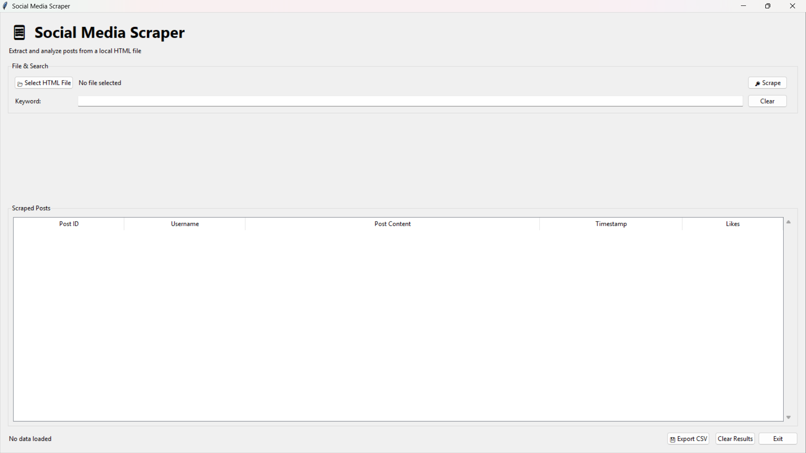
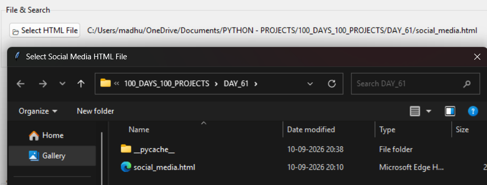
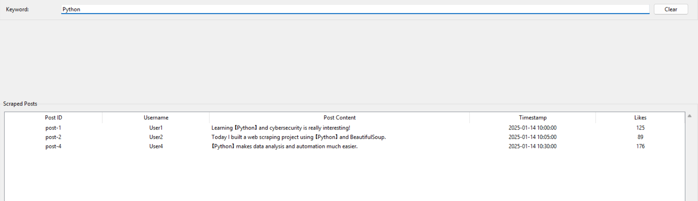
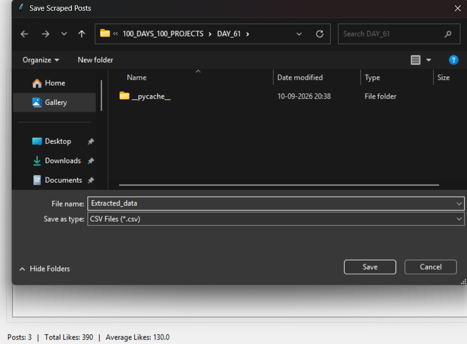

# 🚀 Day 61 - Social Media Scraper

Welcome to **Day 61** of my **100 Days, 100 Python Projects** challenge! 🐍

For Day 61, I built a **Social Media Scraper** using Python, **BeautifulSoup**, and **Tkinter**.

This project reads a locally stored HTML file that simulates a social media feed, extracts useful post information such as **post ID, username, content, timestamp, and likes**, and displays the extracted data in a graphical interface.

The application also provides **keyword searching, keyword highlighting, statistics calculation, and CSV export**, making it a practical introduction to **HTML parsing and data extraction using Python**.

---

## 📌 Project Overview

The **Social Media Scraper** is a desktop application that extracts structured information from a local HTML file.

Instead of manually reading HTML elements, the application uses **BeautifulSoup** to locate specific HTML elements and convert them into structured Python dictionaries.

The extracted information includes:

* 🆔 Post ID
* 👤 Username
* 📝 Post Content
* 🕒 Timestamp
* ❤️ Likes

The extracted posts are then displayed in a Tkinter-based GUI where users can search, filter, analyze, and export the data.

### Basic Workflow

```text
HTML File
    ↓
Load HTML Content
    ↓
BeautifulSoup Parser
    ↓
Find Post Elements
    ↓
Extract Post Information
    ↓
Display in Tkinter Table
    ↓
Search / Filter / Analyze
    ↓
Export to CSV
```

---

## ✨ Features

### 📂 HTML File Selection

* Select a local `.html` or `.htm` file using a file dialog.
* Displays the selected file path.
* Supports custom HTML files following the expected post structure.

### 🔎 Web Scraping / HTML Parsing

* Uses BeautifulSoup to parse HTML.
* Searches for elements with the `post` CSS class.
* Extracts individual post information.
* Handles missing HTML elements gracefully.

### 📊 Structured Post Data

Each scraped post contains:

```text
Post ID
Username
Content
Timestamp
Likes
```

Example:

```text
post-1
User1
Learning Python and cybersecurity is really interesting!
2025-01-14 10:00:00
125
```

### 🔍 Keyword Search

The application provides real-time keyword filtering.

Users can search by:

* Username
* Post content
* Post ID

The search is:

* Case-insensitive
* Performed while typing
* Automatically reflected in the results table

### 🖍️ Keyword Highlighting

When a keyword is entered, matching words in the post content are highlighted using special brackets.

Example:

```text
Learning 【Python】 and cybersecurity is really interesting!
```

### 📈 Statistics

The application calculates statistics for the currently displayed posts:

* Total number of posts
* Total likes
* Average likes

Example:

```text
Posts: 4 | Total Likes: 604 | Average Likes: 151.0
```

Statistics automatically update when the search results change.

### 💾 CSV Export

Filtered or complete scraped results can be exported to a CSV file.

The CSV contains:

```text
post_id
username
content
timestamp
likes
```

### 🧹 Clear Results

The **Clear Results** button resets:

* Scraped posts
* Filtered posts
* Selected file
* Search keyword
* Results table
* Statistics

### 🖥️ Graphical User Interface

The project uses Tkinter to provide:

* File selection
* Scraping controls
* Search field
* Results table
* Statistics display
* CSV export
* Clear results
* Exit functionality

---

## 🖼️ Application Screenshots

### 📸 Main Dashboard



The main dashboard provides the complete interface for selecting an HTML file, scraping posts, searching data, viewing results, and exporting information.

---

### 📂 File Selection & Scraping



Shows the HTML file selection and scraping workflow.

The user can select the local social media HTML file and click **Scrape** to extract the posts.

---

### 🔍 Keyword Search & Highlighting



Demonstrates keyword filtering and highlighting within the scraped post content.

---

### 📊 Statistics & CSV Export



Shows the calculated post statistics and the CSV export functionality.

---

## 🛠️ Technologies Used

### 🐍 Python

Python is used as the main programming language.

It handles:

* HTML file reading
* Data extraction
* Data filtering
* Statistics
* CSV generation
* GUI functionality

---

### 🍲 BeautifulSoup

**BeautifulSoup** is used to parse the HTML document and extract the required information.

The project uses:

```python
from bs4 import BeautifulSoup
```

BeautifulSoup searches the HTML structure for elements such as:

```html
<div class="post">
```

and extracts:

```html
<h2 class="username">
<p class="content">
<span class="timestamp">
<span class="likes">
```

---

### 🖥️ Tkinter

Tkinter is used to build the desktop GUI.

The application uses components such as:

* `Tk`
* `Frame`
* `Label`
* `Button`
* `Entry`
* `LabelFrame`
* `Treeview`
* `Scrollbar`
* `StringVar`
* `filedialog`
* `messagebox`

---

### 📄 CSV

Python's built-in `csv` module is used to export scraped data.

The application uses:

```python
csv.DictWriter
```

to create structured CSV files.

---

### 📁 File Handling

Python's built-in file handling is used to:

* Read HTML files
* Write CSV files
* Handle UTF-8 encoded data
* Manage selected file paths

---

## 📂 Project Structure

```text
DAY_61/
│
├── main61.py
├── scraper.py
├── gui.py
├── social_media.html
├── requirements.txt
├── README.md
│
└── screenshots/
    ├── main-dashboard.png
    ├── file-scraping.png
    ├── keyword-search.png
    └── export-statistics.png
```

---

### 📄 File Description

| File                | Description                                          |
| ------------------- | ---------------------------------------------------- |
| `main61.py`         | Application entry point and Tkinter initialization   |
| `scraper.py`        | HTML loading and BeautifulSoup scraping logic        |
| `gui.py`            | Complete Tkinter graphical interface                 |
| `social_media.html` | Sample local HTML file containing social media posts |
| `requirements.txt`  | Contains the required Python dependency              |
| `README.md`         | Project documentation                                |
| `screenshots/`      | Contains application screenshots                     |

---

## 📦 requirements.txt

```text
beautifulsoup4
```

Install the required dependency using:

```bash
pip install -r requirements.txt
```

Or directly:

```bash
pip install beautifulsoup4
```

---

## ▶️ How to Run

### 1. Check Python Installation

Make sure Python is installed:

```bash
python --version
```

---

### 2. Navigate to the Project Folder

```bash
cd DAY_61
```

---

### 3. Install Dependencies

Run:

```bash
pip install -r requirements.txt
```

---

### 4. Run the Application

Start the application using:

```bash
python main61.py
```

The **Social Media Scraper** GUI will open.

---

## 📄 Sample HTML Structure

The provided `social_media.html` file contains sample social media posts.

Each post follows this structure:

```html
<div class="post" id="post-1">

    <h2 class="username">User1</h2>

    <p class="content">
        Learning Python and cybersecurity is really interesting!
    </p>

    <span class="timestamp">
        2025-01-14 10:00:00
    </span>

    <span class="likes">125</span>

</div>
```

The scraper identifies the post using:

```python
soup.find_all("div", class_="post")
```

---

## 🔎 HTML Data Extraction

The `extract_posts()` function extracts information from each post.

### Post ID

```python
post_id = post.get("id", "Unknown")
```

### Username

```python
username_element = post.find("h2", class_="username")
```

### Content

```python
content_element = post.find("p", class_="content")
```

### Timestamp

```python
timestamp_element = post.find("span", class_="timestamp")
```

### Likes

```python
likes_element = post.find("span", class_="likes")
```

The extracted information is stored as a Python dictionary:

```python
{
    "post_id": "post-1",
    "username": "User1",
    "content": "Learning Python and cybersecurity is really interesting!",
    "timestamp": "2025-01-14 10:00:00",
    "likes": 125
}
```

All extracted posts are stored inside a Python list.

---

## 🧹 Data Cleaning

The scraper performs basic data cleaning while extracting information.

### Text Cleaning

BeautifulSoup's:

```python
get_text(strip=True)
```

is used to remove unnecessary whitespace.

For post content:

```python
get_text(" ", strip=True)
```

ensures that text from the HTML is converted into a clean string.

### Missing Values

If an expected element does not exist, default values are used.

Examples:

```text
Username → Unknown
Timestamp → Unknown
Likes → 0
Content → Empty string
Post ID → Unknown
```

---

## ❤️ Likes Conversion

Likes are extracted from HTML as text.

For example:

```text
125
```

The application converts this value into an integer:

```python
likes = int(likes_text)
```

If the value cannot be converted into an integer, the application safely uses:

```text
0
```

This allows statistics to be calculated without crashing.

---

## 🔍 Keyword Filtering

The search system checks the entered keyword against:

```text
Username
Post Content
Post ID
```

The comparison is case-insensitive.

For example, searching for:

```text
python
```

can match:

```text
Python
PYTHON
python
```

The results table updates automatically whenever the search field changes.

---

## 🖍️ Keyword Highlighting

The application also visually marks matching words in the post content.

For example:

```text
Python makes data analysis easier.
```

Searching for:

```text
Python
```

produces:

```text
【Python】 makes data analysis easier.
```

The highlighting is implemented by splitting the content into words and wrapping matching words with:

```text
【 】
```

---

## 📊 Statistics

The application calculates statistics based on the **currently filtered posts**.

### Total Posts

```python
total_posts = len(self.filtered_posts)
```

### Total Likes

```python
total_likes = sum(
    post["likes"]
    for post in self.filtered_posts
)
```

### Average Likes

```python
average_likes = total_likes / total_posts
```

The result is displayed with one decimal place.

Example:

```text
Posts: 2 | Total Likes: 339 | Average Likes: 169.5
```

This means the statistics change according to the active search filter.

---

## 💾 CSV Export

The application can export the currently displayed posts to a CSV file.

The export process uses:

```python
csv.DictWriter
```

with the following columns:

```text
post_id
username
content
timestamp
likes
```

Example CSV structure:

```text
post_id,username,content,timestamp,likes
post-1,User1,"Learning Python and cybersecurity is really interesting!",2025-01-14 10:00:00,125
post-2,User2,"Today I built a web scraping project using Python and BeautifulSoup.",2025-01-14 10:05:00,89
```

Only the **currently filtered posts** are exported.

---

## 🖥️ GUI Components

The main application contains the following sections.

### 📱 Application Header

Displays:

```text
📱 Social Media Scraper

Extract and analyze posts from a local HTML file
```

---

### 📂 File & Search Section

Contains:

* Select HTML File
* Selected file path
* Scrape button
* Keyword search
* Clear button

---

### 📊 Scraped Posts Table

The results are displayed using a Tkinter `Treeview`.

Columns:

| Column       | Description               |
| ------------ | ------------------------- |
| Post ID      | Unique post identifier    |
| Username     | Name of the post author   |
| Post Content | Text content of the post  |
| Timestamp    | Date and time of the post |
| Likes        | Number of likes           |

---

### 📈 Statistics Section

Displays:

```text
Posts: X | Total Likes: X | Average Likes: X.X
```

The statistics automatically update after scraping and filtering.

---

### 🔘 Action Buttons

The bottom section provides:

```text
💾 Export CSV
Clear Results
Exit
```

---

## 🧩 Application Workflow

The complete application workflow is:

```text
Launch Application
        ↓
Select HTML File
        ↓
Click Scrape
        ↓
Load HTML
        ↓
BeautifulSoup Parses HTML
        ↓
Extract Post Data
        ↓
Display Posts
        ↓
Enter Search Keyword
        ↓
Filter Results
        ↓
Update Statistics
        ↓
Export Filtered Data to CSV
```

---

## ⚠️ Error Handling

The application handles several common errors.

### No File Selected

If the user clicks **Scrape** without selecting a file:

```text
Please select an HTML file first.
```

---

### Missing File

If the selected file cannot be found:

```text
The selected file could not be found.
```

---

### Scraping Errors

Unexpected scraping errors are displayed using a message box instead of terminating the GUI unexpectedly.

---

### No Data for Export

If there are no posts available:

```text
There are no posts to export.
```

---

### Invalid Likes

If a likes value cannot be converted into an integer, the application uses:

```text
0
```

instead.

---

## 📚 Libraries and Functions Practiced

### BeautifulSoup

| Function          | Purpose                         |
| ----------------- | ------------------------------- |
| `BeautifulSoup()` | Parse HTML                      |
| `find_all()`      | Find all matching post elements |
| `find()`          | Find specific HTML elements     |
| `get()`           | Read HTML attributes            |
| `get_text()`      | Extract clean text              |

---

### Tkinter

| Component    | Purpose                 |
| ------------ | ----------------------- |
| `Tk()`       | Main application window |
| `Frame`      | Organize interface      |
| `Label`      | Display information     |
| `Button`     | User actions            |
| `Entry`      | Keyword input           |
| `LabelFrame` | Group related controls  |
| `Treeview`   | Display scraped data    |
| `Scrollbar`  | Scroll through results  |
| `StringVar`  | Manage GUI values       |
| `filedialog` | Select/save files       |
| `messagebox` | Display alerts          |

---

### CSV

| Function           | Purpose                      |
| ------------------ | ---------------------------- |
| `csv.DictWriter()` | Create structured CSV output |
| `writeheader()`    | Write CSV column names       |
| `writerows()`      | Write multiple records       |

---

## 💡 Concepts Practiced

During this project, I practiced:

* Python modules
* Functions
* Object-oriented programming
* Tkinter GUI development
* HTML parsing
* Web scraping fundamentals
* BeautifulSoup
* CSS class selectors
* HTML attributes
* Text extraction
* Data cleaning
* Dictionary-based data structures
* List processing
* Lambda functions
* Event-driven programming
* Real-time filtering
* String searching
* Case-insensitive searching
* Basic data analysis
* Average calculation
* CSV file generation
* File dialogs
* Exception handling
* Modular project architecture

---

## 🎯 Learning Outcome

By completing Day 61, I learned how Python can be used to extract structured information from HTML documents.

### Key takeaways:

* Learned the fundamentals of HTML parsing using BeautifulSoup.
* Learned how to locate HTML elements using tags and CSS classes.
* Learned how to extract text and attributes from HTML.
* Learned how to convert scraped information into structured Python dictionaries.
* Learned how to display scraped data using Tkinter `Treeview`.
* Learned how to implement real-time keyword filtering.
* Learned how to perform case-insensitive searches.
* Learned how to calculate basic statistics from scraped data.
* Learned how to export structured data into CSV format.
* Learned how to separate scraping logic from GUI logic.
* Improved understanding of exception handling and input validation.
* Learned how a basic scraping pipeline can be combined with a desktop interface.

---

## 🔮 Future Improvements

The project can be extended with several advanced features.

### 🌐 Live Website Scraping

Instead of scraping only local HTML files, the application could support publicly accessible webpages using libraries such as:

```text
requests
BeautifulSoup
```

---

### 🔄 Automatic Refresh

Add an option to periodically reload the source and update the scraped data.

---

### 📊 Advanced Analytics

Add visualizations for:

* Likes by user
* Likes over time
* Most liked posts
* Average likes per user
* Post frequency
* Top contributors

---

### 📈 Data Visualization

Integrate Matplotlib to display charts such as:

```text
Likes by Username
Likes Over Time
Top 10 Posts
Posts Per User
```

---

### 🔍 Advanced Filters

Add filters for:

* Username
* Minimum likes
* Maximum likes
* Date
* Date range
* Multiple keywords

---

### 📄 Multiple File Support

Allow the user to select and process multiple HTML files at once.

---

### 🗂️ Export Formats

Add support for:

* JSON
* Excel
* PDF

in addition to CSV.

---

### 🧠 Sentiment Analysis

Use NLP techniques to classify posts as:

```text
Positive
Negative
Neutral
```

---

### 🏷️ Hashtag Extraction

Automatically identify and analyze hashtags from post content.

---

### 🔐 Responsible Scraping

For real-world websites, future versions should include:

* Respect for website terms of service
* `robots.txt` considerations where applicable
* Request rate limiting
* Proper error handling
* Avoiding unauthorized access
* Responsible handling of collected data

---

## 📅 100 Days Challenge

**Day 61** focuses on learning the fundamentals of **HTML parsing and web scraping** while combining the extracted data with a desktop GUI.

The project combines:

```text
Python
   +
BeautifulSoup
   +
HTML Parsing
   +
Tkinter
   +
Data Filtering
   +
Statistics
   +
CSV Export
```

This project is a practical step toward working with **web data extraction, data processing, and automation using Python**.

---

## 👨‍💻 Author

**Abhijit Munghate**

Happy Coding! 🚀🐍📊