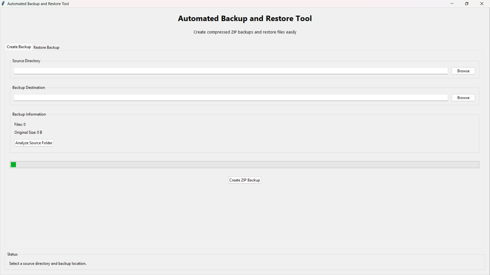
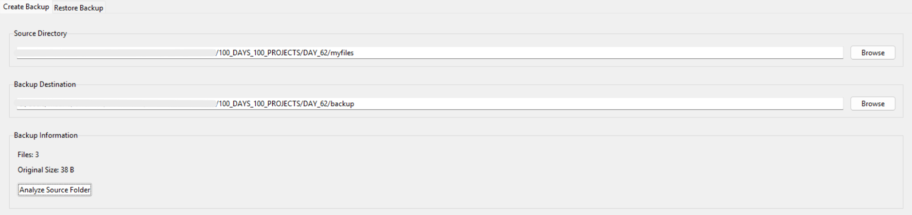
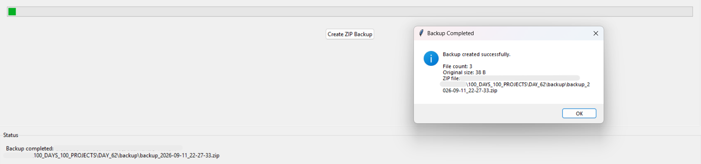
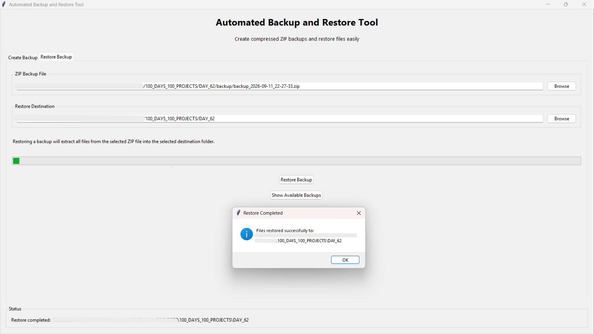

# 🚀 Day 62 - Automated Backup Tool

Welcome to **Day 62** of my **100 Days of Python Projects** challenge.

The goal of this challenge is to build and upload one Python project every day to improve programming skills, problem-solving ability, and practical knowledge.

For Day 62, I created an **Automated Backup and Restore Tool** using Python and Tkinter. This application allows users to analyze a source folder, create compressed ZIP backups, restore backup files, and maintain a CSV history of created backups.

---

## 📌 Project Overview

The **Automated Backup Tool** is a desktop application that helps users create and manage backups of important files and folders.

The application allows users to:

* Select a source directory.
* Analyze the number and total size of files.
* Select a backup destination.
* Create a compressed ZIP backup.
* View available ZIP backups.
* Restore files from a selected backup.
* Store backup information in a CSV history file.
* Perform backup and restore operations in background threads.

This project demonstrates how Python can be used to automate file management and backup-related tasks through a graphical user interface.

> **Note:** This project creates backups manually through the GUI. It does not run automatically at scheduled times.

---

## ✨ Features

### 📁 Source Folder Selection

* Select any folder from the computer.
* Recursively scan files inside the selected folder.
* Include files from nested subdirectories.

### 📊 Folder Analysis

* Display the total number of files.
* Calculate the original size of all files.
* Convert file size into readable units such as B, KB, MB, and GB.

### 🗜️ ZIP Backup Creation

* Create compressed ZIP backups.
* Preserve the relative folder structure.
* Use timestamp-based backup filenames.
* Store backups in the selected destination directory.

### 🔄 Backup Restore

* Select an existing ZIP backup.
* Select a restore destination.
* Extract all files from the backup.
* Ask for confirmation before restoring files.

### 🕒 Backup History

* Store backup details in a CSV file.
* Record the backup date and time.
* Store source directory and backup file path.
* Store file count and original size.

### 📂 Available Backup List

* Display all ZIP backups in the selected backup directory.
* Sort backups from newest to oldest.
* Select a backup directly from the available backups window.

### ⚡ Background Processing

* Use Python threading for backup and restore operations.
* Keep the GUI responsive during file processing.
* Display progress using an indeterminate progress bar.

### 🛡️ Validation and Error Handling

* Check whether the source directory exists.
* Check whether the selected ZIP file exists.
* Prevent the backup destination from being inside the source directory.
* Display warning and error messages when required information is missing.

---

## 📸 Screenshots

### Main Dashboard


### Source Folder Analysis


### ZIP Backup Completed


### Restore Backup


---

## 🛠️ Technologies Used

### Python

Python is the main programming language used to develop the backup and restore application.

### Tkinter

Tkinter is used to create the desktop graphical user interface.

It provides:

* Windows
* Labels
* Buttons
* Entry fields
* Tabs
* Progress bars
* Listboxes
* Message boxes

### pathlib

The `pathlib` module is used to work with file and directory paths in an object-oriented way.

It is used for:

* Searching files recursively.
* Creating directories.
* Getting file information.
* Finding ZIP backup files.
* Working with relative paths.

### zipfile

The `zipfile` module is used to create and extract compressed ZIP archives.

It is used for:

* Creating ZIP backups.
* Adding files to an archive.
* Extracting backup files.

### shutil

The `shutil` module is imported for file-management operations and can be used for copying and moving files.

### os

The `os` module is used for:

* Checking whether directories and files exist.
* Working with operating-system paths.
* Validating selected locations.

### csv

The `csv` module is used to save backup history in a CSV file.

### threading

The `threading` module is used to run backup and restore operations in the background so that the GUI does not freeze.

### datetime

The `datetime` module is used to generate timestamp-based backup filenames and record backup dates.

---

## 📂 Project Structure

```text
DAY_62/
├── main62.py
├── backup_manager.py
├── gui.py
├── requirements.txt
├── README.md
└── screenshots/
    ├── main-dashboard.png
    ├── folder-analysis.png
    ├── backup-completed.png
    └── restore-backup.png
```

---

## 📄 File Description

### `main62.py`

This is the entry point of the application.

It:

* Creates the Tkinter root window.
* Initializes the `BackupToolGUI` class.
* Starts the Tkinter event loop.

### `backup_manager.py`

This file contains the main backup and restore functions.

It includes functions for:

* Finding files.
* Calculating total file size.
* Creating ZIP backups.
* Validating directory relationships.
* Restoring ZIP backups.
* Listing available backups.
* Writing backup history.
* Formatting file sizes.

### `gui.py`

This file contains the complete Tkinter graphical interface.

It manages:

* Folder selection.
* Backup creation.
* Restore operations.
* Progress bars.
* Status messages.
* Backup history access.
* Error handling.
* Background threads.

### `requirements.txt`

This file explains that the project does not require third-party Python packages.

### `README.md`

This file contains project documentation, features, setup instructions, screenshots, and learning outcomes.

---

## 📦 requirements.txt

```text
# No external dependencies required.
# tkinter, zipfile, pathlib, shutil, os, csv, and threading
# are included with standard Python installations.
```

The project uses only Python standard-library modules.

> Tkinter is included with most standard Python installations. On some Linux distributions, it may need to be installed separately through the operating system package manager.

---

## ▶️ How to Run

### 1. Install Python

Install Python from the official Python website if it is not already installed.

Make sure Python is added to the system PATH during installation.

### 2. Open the Project Folder

Open the `DAY_62` folder in VS Code or a terminal.

### 3. Run the Application

Execute the following command:

```bash
python main62.py
```

### 4. Use the Application

The application will open with two tabs:

* Create Backup
* Restore Backup

---

## 💾 Creating a Backup

### Step 1: Select Source Directory

Click the **Browse** button under the Source Directory section.

Select the folder that contains the files you want to back up.

### Step 2: Select Backup Destination

Click the **Browse** button under the Backup Destination section.

Select a separate folder where the ZIP backup should be stored.

The backup destination should not be inside the source directory.

### Step 3: Analyze the Source Folder

Click **Analyze Source Folder**.

The application displays:

* Total number of files.
* Original size of all files.

The scan includes files inside nested folders.

### Step 4: Create the ZIP Backup

Click **Create ZIP Backup**.

The application:

1. Collects all files recursively.
2. Creates the backup destination if required.
3. Generates a timestamp-based filename.
4. Compresses the files into a ZIP archive.
5. Saves the backup history.
6. Displays a completion message.

Example backup filename:

```text
backup_2026-09-11_22-30-45.zip
```

---

## 🗜️ ZIP Backup Process

The backup function uses the `zipfile` module with `ZIP_DEFLATED` compression.

Each file is added to the ZIP archive using its relative path.

For example, a source folder may contain:

```text
Documents/
├── notes.txt
├── projects/
│   └── python.py
└── images/
    └── photo.png
```

The ZIP backup preserves this structure:

```text
notes.txt
projects/python.py
images/photo.png
```

This allows the original folder organization to be maintained when the backup is restored.

---

## 🔄 Restoring a Backup

### Step 1: Select a ZIP Backup

Open the **Restore Backup** tab.

Click **Browse** and select the ZIP backup file.

### Step 2: Select Restore Destination

Choose the folder where the backup files should be extracted.

### Step 3: Confirm the Restore

Click **Restore Backup**.

The application displays a confirmation message because files with the same names may be overwritten.

### Step 4: Extract the Backup

After confirmation, the application extracts all files into the selected restore directory.

A success message is displayed after the restore process is completed.

---

## 📋 Viewing Available Backups

The **Show Available Backups** button displays ZIP files available in the selected backup directory.

The application:

* Searches for files ending with `.zip`.
* Sorts the files by modification time.
* Displays the newest backups first.
* Allows the user to select a backup.
* Automatically fills the selected backup field.

This makes it easier to restore an older backup without manually browsing for the ZIP file.

---

## 🕒 Backup History

After creating a backup, the application creates or updates:

```text
backup_history.csv
```

The history file contains the following columns:

```text
Date
Source Directory
Backup File
File Count
Original Size
```

Example:

```text
Date,Source Directory,Backup File,File Count,Original Size
2026-09-11 22:30:45,C:/Users/User/Documents,C:/Backups/backup_2026-09-11_22-30-45.zip,25,1048576
```

The original size is stored in bytes in the CSV file.

---

## 📊 File Size Formatting

The `format_size()` function converts file sizes from bytes into readable units.

Examples:

```text
500 B
2.50 KB
15.75 MB
1.20 GB
```

The function makes file information easier to understand in the graphical interface.

---

## ⚙️ Important Functions

### `get_files()`

Returns all files inside a directory recursively.

```python
files = get_files(source_directory)
```

### `calculate_total_size()`

Calculates the combined size of all files.

```python
total_size = calculate_total_size(files)
```

### `create_backup_zip()`

Creates a compressed ZIP backup of the selected source directory.

```python
zip_file_path, files = create_backup_zip(source, backup_destination)
```

### `is_directory_inside()`

Checks whether the backup destination is inside the source directory.

This prevents the backup from being created inside the folder being scanned.

### `restore_backup()`

Extracts a ZIP archive into the selected restore directory.

### `get_zip_backups()`

Returns ZIP backups sorted from newest to oldest.

### `write_backup_history()`

Appends backup information to the CSV history file.

### `format_size()`

Converts bytes into a readable file size format.

---

## 🖥️ GUI Components Used

### Main Window

The application window is created using Tkinter.

```python
root = tk.Tk()
```

The window title is:

```text
Automated Backup and Restore Tool
```

The default window size is:

```text
850x650
```

### Notebook Tabs

A `ttk.Notebook` is used to separate the application into:

* Create Backup
* Restore Backup

### Entry Fields

Entry widgets are used for displaying:

* Source directory.
* Backup destination.
* Selected ZIP backup.
* Restore destination.

### Browse Buttons

Browse buttons open directory or file selection dialogs.

### Progress Bars

Indeterminate progress bars display activity while backup or restore operations are running.

### Treeview-Equivalent Listbox

A `Listbox` is used to display available ZIP backups in a separate window.

### Message Boxes

Message boxes are used for:

* Warnings.
* Errors.
* Restore confirmation.
* Successful backup messages.
* Successful restore messages.

---

## 🧵 Threading and GUI Responsiveness

Backup and restore operations may take time when processing large folders.

To prevent the application from becoming unresponsive, the project uses background threads.

Example:

```python
backup_thread = threading.Thread(
    target=self.backup_worker,
    args=(source, backup_destination),
    daemon=True
)

backup_thread.start()
```

After the background operation finishes, `root.after()` is used to update the GUI safely from the Tkinter main thread.

This demonstrates an important concept in desktop application development: long-running tasks should not block the main user interface.

---

## 🛡️ Validation and Error Handling

The application performs several checks before starting operations.

### Missing Source Directory

If the source directory is empty, the application displays a warning.

### Invalid Source Directory

If the selected source directory does not exist, an error message is shown.

### Missing Backup Destination

The user must select both the source directory and backup destination.

### Invalid Backup Location

The backup destination cannot be inside the source directory.

This prevents the backup process from accidentally including the backup file itself.

### Invalid ZIP File

The restore process checks whether:

* The file exists.
* The selected file has a `.zip` extension.

### Restore Confirmation

The application asks for confirmation before extracting files because existing files may be overwritten.

---

## 🔍 Concepts Practiced

This project helped me practice the following Python concepts:

* Functions.
* Modules.
* Classes.
* Object-oriented programming.
* File handling.
* Directory traversal.
* Recursive file searching.
* Path management.
* ZIP compression.
* ZIP extraction.
* CSV file writing.
* Exception handling.
* GUI development.
* Tkinter widgets.
* Threading.
* Background processing.
* Progress indicators.
* Date and time formatting.
* Input validation.
* Working with relative paths.

---

## 📚 Libraries and Functions Practiced

### Python Standard Library

* `os.path.isdir()`
* `os.path.isfile()`
* `Path()`
* `Path.rglob()`
* `Path.is_file()`
* `Path.stat()`
* `Path.mkdir()`
* `Path.glob()`
* `Path.resolve()`
* `Path.relative_to()`
* `shutil`
* `zipfile.ZipFile()`
* `zipfile.ZIP_DEFLATED`
* `ZipFile.write()`
* `ZipFile.extractall()`
* `csv.writer()`
* `datetime.now()`
* `threading.Thread()`
* `root.after()`

### Tkinter

* `tk.Tk()`
* `tk.StringVar()`
* `ttk.Label()`
* `ttk.Entry()`
* `ttk.Button()`
* `ttk.LabelFrame()`
* `ttk.Notebook()`
* `ttk.Progressbar()`
* `tk.Listbox()`
* `tk.Toplevel()`
* `filedialog.askdirectory()`
* `filedialog.askopenfilename()`
* `messagebox.showwarning()`
* `messagebox.showerror()`
* `messagebox.showinfo()`
* `messagebox.askyesno()`

---

## 🎯 Learning Outcome

By completing this project, I learned how to:

* Build a desktop backup utility using Python.
* Search files recursively inside folders.
* Calculate the total size of multiple files.
* Create compressed ZIP archives.
* Restore files from ZIP backups.
* Maintain backup history using CSV.
* Use timestamps to generate unique backup filenames.
* Validate file and directory paths.
* Prevent invalid backup locations.
* Use threads for long-running operations.
* Keep a Tkinter application responsive.
* Create multi-tab desktop applications.

---

## 🚀 Future Improvements

The project can be improved further by adding:

* Automatic scheduled backups.
* Daily, weekly, and monthly backup options.
* Incremental backups.
* Differential backups.
* Backup encryption with a password.
* Backup compression level selection.
* Backup progress percentage.
* Estimated remaining time.
* Backup cancellation support.
* Automatic backup cleanup.
* Retention rules for old backups.
* Cloud backup support.
* Email notifications.
* Backup verification.
* File checksum validation.
* Restore preview before extraction.
* Selective file restoration.
* Backup history viewer inside the GUI.
* Dark mode support.
* System tray integration.

---

## ⚠️ Limitations

The current version has a few limitations:

* Backups are started manually.
* There is no automatic scheduling system.
* The application does not encrypt ZIP files.
* Restore extracts the complete ZIP archive.
* Existing files may be overwritten during restore.
* The progress bar does not show exact percentage progress.
* Backup history is stored in CSV format rather than a database.
* The application does not verify file integrity using checksums.
* Cloud storage is not included.

---

## 🏆 Challenge

This project was created as part of my **100 Days of Python Projects** challenge.

The purpose of this challenge is to improve my Python programming skills by building practical projects regularly and documenting the learning process on GitHub.

---

## 👨‍💻 Author

**Abhijit Munghate**

Happy Coding! 🚀🐍📊