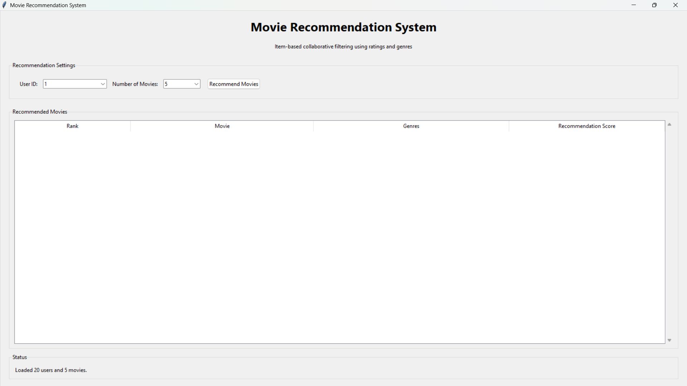
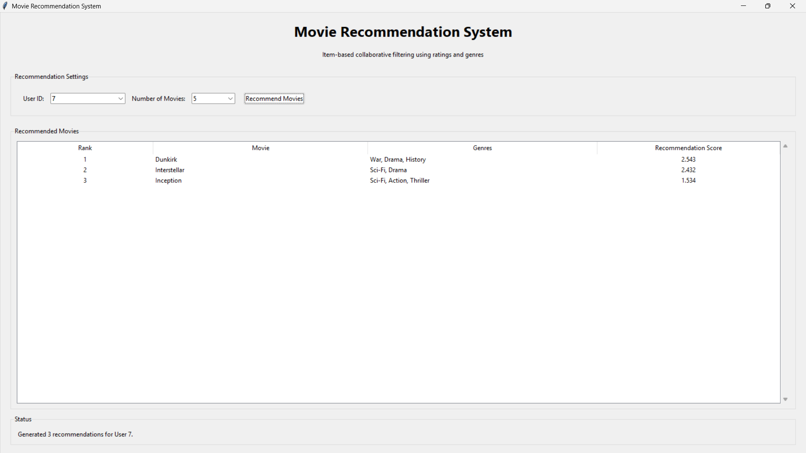
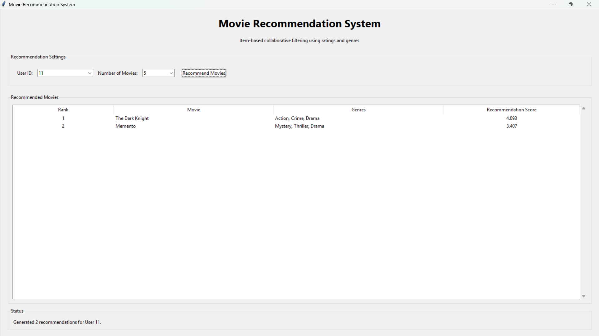

# 🚀 Day 63 - Movie Recommendation System

Welcome to **Day 63** of my **100 Days of Python Projects** challenge.

The goal of this challenge is to build and upload one Python project every day to improve programming skills, problem-solving ability, and practical knowledge.

For Day 63, I created a **Movie Recommendation System** using Python, Pandas, Scikit-learn, and Tkinter. This application recommends movies to users based on their previous ratings and movie genre similarity.

---

## 📌 Project Overview

The **Movie Recommendation System** is a desktop application that uses a basic recommendation algorithm to suggest movies to users.

The project uses:

* User movie ratings.
* Movie-user rating matrices.
* Movie genre information.
* Item-based collaborative filtering.
* Cosine similarity.
* Combined rating and genre similarity scores.

The application loads movie data from CSV files and displays personalized movie recommendations through a graphical user interface.

The recommendation engine combines:

* **70% rating similarity**
* **30% genre similarity**

These weights are used by default to calculate the final recommendation score.

> **Note:** This project uses a small local dataset containing sample movie ratings. It does not connect to live movie databases or online streaming platforms.

---

## ✨ Features

### 🎬 Movie Recommendation

* Recommend movies for a selected user.
* Use the user's previous ratings to generate suggestions.
* Exclude movies already rated by the selected user.
* Display recommendations in ranked order.

### 👤 User Selection

* Load available user IDs from the ratings dataset.
* Select a user through a dropdown menu.
* Generate recommendations for different users.

### ⭐ Rating-Based Similarity

* Create a movie-user rating matrix.
* Compare movies based on user rating patterns.
* Calculate item-to-item similarity using cosine similarity.

### 🎭 Genre-Based Similarity

* Read movie genres from a CSV file.
* Convert genre information into a binary matrix.
* Compare movies based on shared genres.

### ⚖️ Combined Recommendation Score

The recommendation score combines rating similarity and genre similarity.

The default calculation is:

```text
Combined Score =
((Rating Similarity × 0.7) +
 (Genre Similarity × 0.3)) × User Rating
```

This allows movies with similar rating patterns and genres to receive higher recommendation scores.

### 🔢 Recommendation Count

Users can choose how many movies to display:

* 3 movies
* 5 movies
* 10 movies

### 📊 Ranked Results

The application displays:

* Rank
* Movie name
* Genres
* Recommendation score

### 🖥️ Tkinter GUI

The graphical interface includes:

* User selection dropdown.
* Recommendation count dropdown.
* Recommend Movies button.
* Results table.
* Status information.
* Error and warning messages.

### 🛡️ Error Handling

The application handles:

* Missing CSV files.
* Invalid user IDs.
* Invalid recommendation counts.
* Empty recommendation results.
* Data loading errors.

---

## 📸 Screenshots

### 1. Main Application Window


### 2. Movie Recommendation Results


### 3. Recommendations for Another User


---

## 🛠️ Technologies Used

### Python

Python is the main programming language used to build the recommendation engine and graphical user interface.

### Pandas

Pandas is used for loading, cleaning, transforming, and analyzing CSV datasets.

It is used for:

* Reading CSV files.
* Creating pivot tables.
* Handling missing values.
* Splitting genre strings.
* Creating movie-user matrices.
* Creating movie-genre matrices.

### Scikit-learn

Scikit-learn is used to calculate cosine similarity between movies.

The function used in this project is:

```python
cosine_similarity()
```

It compares movies based on their rating and genre feature vectors.

### Tkinter

Tkinter is used to create the desktop application.

It provides:

* Labels.
* Dropdown menus.
* Buttons.
* Frames.
* Tables.
* Scrollbars.
* Status messages.
* Message boxes.

### CSV

CSV files are used as the local data source for movie ratings and genres.

---

## 📂 Project Structure

```text
DAY_63/
├── main63.py
├── recommendation_engine.py
├── gui.py
├── movie_ratings.csv
├── movie_genres.csv
├── requirements.txt
├── README.md
└── screenshots/
    ├── main_window.png
    ├── recommendation_results.png
    └── different_user_results.png
```

---

## 📄 File Description

### `main63.py`

This is the entry point of the application.

It:

* Creates the Tkinter root window.
* Initializes the `MovieRecommendationGUI` class.
* Starts the Tkinter event loop.

### `recommendation_engine.py`

This file contains the main recommendation logic.

It includes functions for:

* Loading rating data.
* Loading genre data.
* Preparing the rating matrix.
* Preparing the genre matrix.
* Calculating rating similarity.
* Calculating genre similarity.
* Finding movies rated by a user.
* Generating recommendations.
* Formatting recommendation results.

### `gui.py`

This file contains the Tkinter graphical interface.

It manages:

* Loading CSV files.
* Preparing recommendation data.
* Selecting users.
* Selecting recommendation count.
* Displaying recommendation results.
* Updating status messages.
* Handling errors.

### `movie_ratings.csv`

This file contains user movie ratings.

The columns are:

```text
user
movie
rating
```

Example:

```text
17,Interstellar,4
18,The Dark Knight,5
10,Memento,4
```

### `movie_genres.csv`

This file contains movie genre information.

The columns are:

```text
movie
genres
```

Example:

```text
Interstellar,Sci-Fi|Drama
The Dark Knight,Action|Crime|Drama
```

### `requirements.txt`

This file contains the external Python libraries required by the project.

---

## 📦 requirements.txt

```text
pandas
scikit-learn
```

Install the dependencies using:

```bash
pip install -r requirements.txt
```

---

## 🎞️ Dataset Information

The project uses two CSV files.

### Movie Ratings Dataset

The `movie_ratings.csv` file stores ratings provided by users.

Each row contains:

* User ID.
* Movie name.
* Rating value.

The dataset contains ratings for the following movies:

* Interstellar
* The Dark Knight
* Memento
* Dunkirk
* Inception

### Movie Genres Dataset

The `movie_genres.csv` file stores genre information for each movie.

Example:

```text
Movie: Interstellar
Genres: Sci-Fi, Drama
```

The pipe symbol `|` is used to separate multiple genres in the CSV file.

---

## ▶️ How to Run

### 1. Install Python

Install Python from the official Python website.

Make sure Python is added to the system PATH.

### 2. Open the Project Folder

Open the `DAY_63` folder in VS Code or a terminal.

### 3. Install Required Libraries

Run:

```bash
pip install -r requirements.txt
```

### 4. Check the Dataset Files

Make sure the following files are present in the same directory as `main63.py`:

```text
movie_ratings.csv
movie_genres.csv
```

### 5. Run the Application

Execute:

```bash
python main63.py
```

The Movie Recommendation System window will open.

---

## 🧮 Recommendation System Workflow

The application follows these steps:

```text
Load CSV Files
      ↓
Prepare Rating Matrix
      ↓
Prepare Genre Matrix
      ↓
Calculate Rating Similarity
      ↓
Calculate Genre Similarity
      ↓
Select User
      ↓
Find Movies Rated by User
      ↓
Calculate Recommendation Scores
      ↓
Sort Recommendations
      ↓
Display Results
```

---

## 📊 Preparing the Rating Matrix

The rating matrix represents the relationship between movies and users.

* Rows represent movies.
* Columns represent users.
* Values represent ratings.

The matrix is created using Pandas:

```python
ratings.pivot_table(
    index="movie",
    columns="user",
    values="rating",
    aggfunc="mean"
).fillna(0)
```

If a user has not rated a movie, the missing value is replaced with `0`.

Example structure:

```text
User       1    2    3
Movie A    4    5    0
Movie B    0    3    4
Movie C    2    0    5
```

This matrix is used to compare movies based on rating patterns.

---

## 🎭 Preparing the Genre Matrix

The genre matrix represents whether a movie belongs to a particular genre.

For example:

```text
Movie          Action  Drama  Sci-Fi  Thriller
Interstellar     0       1      1        0
Inception        1       0      1        1
Memento          0       1      0        1
```

The genre data is transformed by:

1. Filling missing genre values.
2. Splitting genres using `|`.
3. Exploding the genre list into separate rows.
4. Assigning a value of `1`.
5. Creating a pivot table.

This creates a binary movie-genre matrix.

---

## 🔍 Cosine Similarity

Cosine similarity is used to measure how similar two movies are based on their feature vectors.

The similarity value generally ranges from:

```text
0 to 1
```

A higher value indicates greater similarity.

The project calculates two types of similarity:

### Rating Similarity

Compares movies using user rating patterns.

```python
rating_similarity = cosine_similarity(ratings_matrix)
```

### Genre Similarity

Compares movies using their genre information.

```python
genre_similarity = cosine_similarity(genre_matrix)
```

---

## ⭐ Generating Recommendations

The recommendation engine first finds movies already rated by the selected user.

Movies already rated by the user are excluded from the recommendation list.

For each rated movie, the system:

1. Finds similar movies.
2. Checks whether the candidate movie has already been rated.
3. Retrieves genre similarity.
4. Calculates the combined score.
5. Adds the score to the candidate movie's total score.
6. Sorts the results in descending order.

The highest-scoring movies are displayed as recommendations.

---

## ⚖️ Recommendation Score

The project uses the following default weights:

```text
Rating Weight = 0.7
Genre Weight  = 0.3
```

The calculation is:

```python
combined_score = (
    (rating_score * rating_weight) +
    (genre_score * genre_weight)
) * user_rating
```

The user's rating is used to give more importance to movies similar to movies the user rated highly.

The final results are rounded to three decimal places before being displayed.

---

## 🖥️ GUI Components Used

### Main Window

The application uses a Tkinter root window.

```python
root = tk.Tk()
```

The window title is:

```text
Movie Recommendation System
```

The default window size is:

```text
850x600
```

### User ID Combobox

The user ID dropdown displays available users from the ratings matrix.

### Recommendation Count Combobox

The user can select:

* 3
* 5
* 10

### Recommend Movies Button

This button starts the recommendation process for the selected user.

### Treeview

A `ttk.Treeview` displays the recommendation results in tabular form.

The columns are:

* Rank
* Movie
* Genres
* Recommendation Score

### Scrollbar

A vertical scrollbar allows users to navigate through the recommendation results.

### Status Label

The status section displays messages such as:

```text
Loaded 20 users and 5 movies.
```

or:

```text
Generated 5 recommendations for User 17.
```

### Message Boxes

Message boxes are used for:

* Missing files.
* Loading errors.
* Invalid input.
* Empty recommendation results.

---

## 🛡️ Error Handling

The application includes several validation checks.

### Missing CSV Files

If `movie_ratings.csv` or `movie_genres.csv` is missing, the application displays an error message and disables the recommendation button.

### Invalid User ID

The application checks whether the selected user ID can be converted into an integer.

### Invalid Recommendation Count

The recommendation count must be selected from the available dropdown values.

### No Recommendations

If the selected user has no ratings or no new recommendations are available, the application displays an information message.

### General Loading Errors

Unexpected errors during data loading are displayed through a message box.

---

## 📚 Libraries and Functions Practiced

### Pandas

* `pd.read_csv()`
* `DataFrame.copy()`
* `DataFrame.fillna()`
* `DataFrame.assign()`
* `DataFrame.explode()`
* `DataFrame.pivot_table()`
* `DataFrame.sort_values()`
* `DataFrame.iterrows()`
* `DataFrame.index`
* `DataFrame.columns`

### Scikit-learn

* `cosine_similarity()`

### Tkinter

* `tk.Tk()`
* `tk.StringVar()`
* `ttk.Label()`
* `ttk.LabelFrame()`
* `ttk.Combobox()`
* `ttk.Button()`
* `ttk.Treeview()`
* `ttk.Scrollbar()`
* `messagebox.showerror()`
* `messagebox.showwarning()`
* `messagebox.showinfo()`

---

## 🔍 Concepts Practiced

This project helped me practice:

* Functions.
* Modules.
* Object-oriented programming.
* Data loading.
* CSV file handling.
* Pandas DataFrames.
* Pivot tables.
* Missing-value handling.
* Data transformation.
* Matrix representation.
* Cosine similarity.
* Collaborative filtering.
* Recommendation algorithms.
* Weighted scoring.
* Sorting results.
* Tkinter GUI development.
* Dropdown menus.
* Treeview tables.
* Error handling.

---

## 🎯 Learning Outcome

By completing this project, I learned how to:

* Load and process datasets using Pandas.
* Convert raw ratings into a movie-user matrix.
* Convert movie genres into a binary feature matrix.
* Calculate similarity between movies.
* Understand the basic idea of item-based collaborative filtering.
* Combine multiple similarity measures.
* Generate personalized recommendations.
* Display data in a Tkinter table.
* Handle missing files and invalid input.
* Separate recommendation logic from GUI code.

---

## 🚀 Future Improvements

The project can be improved further by adding:

* A larger movie dataset.
* Movie posters and descriptions.
* Movie release years.
* Movie ratings from online sources.
* Search functionality.
* Movie filtering by genre.
* User registration and login.
* User rating input from the GUI.
* Ability to rate recommended movies.
* Content-based filtering.
* User-based collaborative filtering.
* Hybrid recommendation algorithms.
* Machine learning model comparison.
* Recommendation explanations.
* Recommendation history.
* Database storage.
* Web application deployment.
* Integration with movie APIs.
* Personalized genre preferences.
* Improved cold-start handling.
* Advanced recommendation evaluation metrics.

---

## ⚠️ Limitations

The current version has some limitations:

* It uses a small sample dataset.
* It works only with the movies available in the CSV files.
* It does not use live movie information.
* It does not include movie posters or descriptions.
* Users cannot add ratings through the GUI.
* The recommendation weights are fixed.
* New users with no ratings cannot receive personalized recommendations.
* The system does not evaluate recommendation accuracy.
* The system does not use a database.
* It is a desktop application rather than a web application.

---

## 🏆 Challenge

This project was created as part of my **100 Days of Python Projects** challenge.

The purpose of this challenge is to improve my Python programming skills by building practical projects regularly and documenting the learning process on GitHub.

Built a **Movie Recommendation System** using Python, Pandas, Scikit-learn, cosine similarity, and Tkinter.

This project improved my understanding of data preprocessing, collaborative filtering, similarity calculations, recommendation scoring, and GUI-based data presentation.

---

## 👨‍💻 Author

**Abhijit Munghate**

Happy Coding! 🚀🐍📊