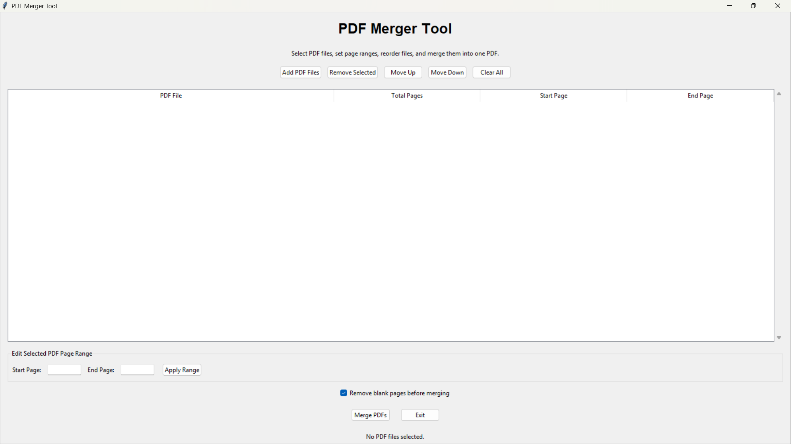
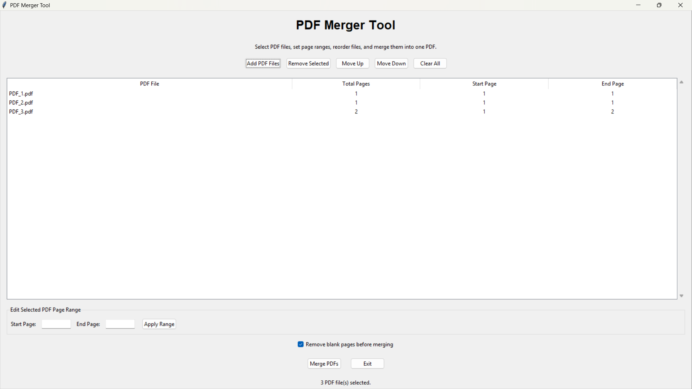
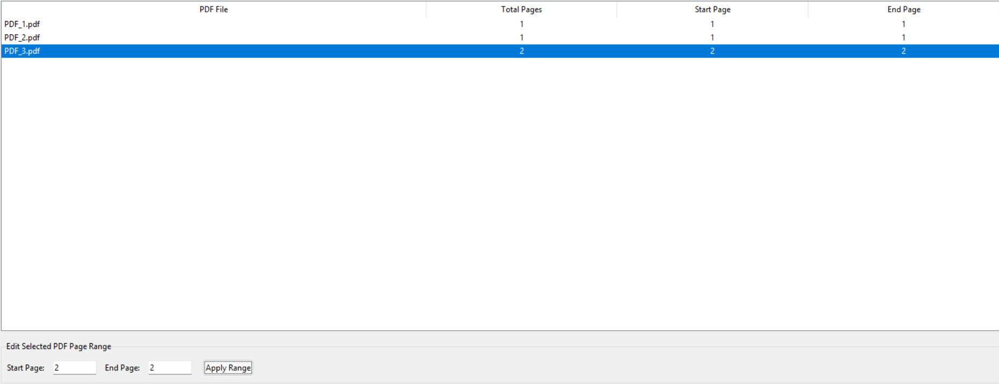
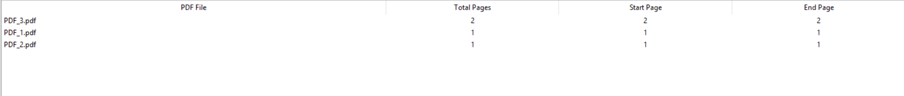
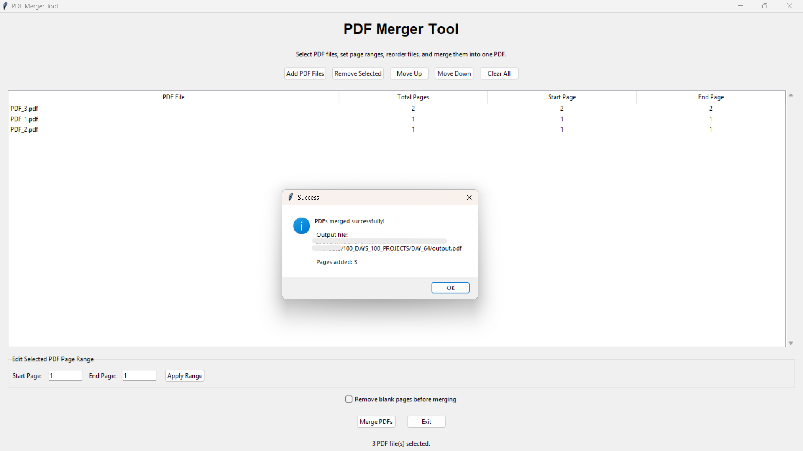

# 🚀 Day 64 - PDF Merger Tool

Welcome to **Day 64** of my **100 Days of Python Projects** challenge.

The goal of this challenge is to build and upload one Python project every day to improve programming skills, problem-solving ability, and practical knowledge.

For Day 64, I created a **PDF Merger Tool** using Python, Tkinter, and PyPDF2. This desktop application allows users to select multiple PDF files, choose specific page ranges, reorder files, remove blank pages, and merge everything into a single PDF document.

---

## 📌 Project Overview

The **PDF Merger Tool** is a desktop application designed to simplify the process of combining multiple PDF files into one document.

The application allows users to:

* Select multiple PDF files.
* View the total number of pages in each PDF.
* Select specific page ranges.
* Reorder PDF files.
* Remove selected PDF files.
* Clear all selected files.
* Remove blank pages before merging.
* Save the merged PDF to a chosen location.
* Display the total number of pages added.

This project demonstrates how Python can be used to automate document management tasks through a graphical user interface.

> **Note:** The application merges existing PDF files. It does not edit the text, images, or layout of individual PDF pages.

---

## ✨ Features

### 📄 Add PDF Files

* Select one or more PDF files using a file dialog.
* Display selected files in a table.
* Read the total number of pages from each PDF.
* Prevent duplicate PDF files from being added.

### 🔢 Page Range Selection

* Set a starting page for each PDF.
* Set an ending page for each PDF.
* Merge only the selected page range.
* Validate the page range before applying changes.

For example:

```text
Start Page: 2
End Page: 5
```

This selects pages 2, 3, 4, and 5 from the selected PDF.

### 🔃 PDF Reordering

* Move a selected PDF file upward.
* Move a selected PDF file downward.
* Control the order in which PDFs are merged.

The order of files in the table determines the order of pages in the final PDF.

### 🗑️ Remove Selected PDF

* Remove one selected PDF file from the list.
* Update the file table automatically.

### 🧹 Clear All Files

* Remove all selected PDF files.
* Clear the page range input fields.
* Reset the application to its initial state.

### 🧾 Blank Page Removal

* Detect pages without extractable text and annotations.
* Skip blank pages before adding them to the output PDF.
* Allow the user to enable or disable blank page removal.

> **Note:** Blank page detection depends on extractable text and annotations. A page containing only an image may be treated as blank if it has no extractable text or annotations.

### 💾 Save Merged PDF

* Select an output location using a save dialog.
* Automatically use the `.pdf` extension.
* Save all selected pages into one PDF file.
* Display a success message after merging.

### 📊 Merge Status

The application displays:

* Number of selected PDF files.
* Number of pages added.
* Merge completion status.
* Error messages when merging fails.

### 🛡️ Error Handling

The application handles:

* Missing PDF selection.
* Invalid page ranges.
* Unsupported or unreadable PDF files.
* Empty merge results.
* Cancelled save operations.
* General PDF processing errors.

---

## 📸 Screenshots

### 1. Main GUI Window



### 2. Selected PDF Files



### 3. Page Range Selection



### 4. PDF Reordering



### 5. Successful Merge



---

## 🛠️ Technologies Used

### Python

Python is the main programming language used to develop the PDF merging application.

It is used for:

* Application logic.
* File handling.
* Page range processing.
* PDF processing.
* GUI development.
* Error handling.

### Tkinter

Tkinter is used to create the desktop graphical user interface.

It provides:

* Application windows.
* Labels.
* Buttons.
* Entry fields.
* Frames.
* Tables.
* Scrollbars.
* Checkbuttons.
* Message boxes.
* File dialogs.

### PyPDF2

PyPDF2 is used to read PDF files and create the merged output PDF.

The project uses PyPDF2 for:

* Reading PDF documents.
* Counting PDF pages.
* Accessing individual pages.
* Creating a PDF writer.
* Adding selected pages.
* Writing the final PDF file.
* Extracting text for blank-page detection.

### Operating System Module

The `os` module is used to work with file paths and display PDF filenames.

---

## 📂 Project Structure

```text
DAY_64/
├── main64.py
├── pdf_merger.py
├── gui.py
├── requirements.txt
├── README.md
└── screenshots/
    ├── main_gui.png
    ├── selected_pdfs.png
    ├── page_range_selection.png
    ├── pdf_reordering.png
    └── successful_merge.png
```

---

## 📄 File Description

### `main64.py`

This is the entry point of the application.

It:

* Imports Tkinter.
* Imports the `PDFMergerGUI` class.
* Creates the main application window.
* Starts the Tkinter event loop.

Example:

```python
root = tk.Tk()
app = PDFMergerGUI(root)
root.mainloop()
```

### `pdf_merger.py`

This file contains the main PDF processing logic.

It includes functions for:

* Detecting blank pages.
* Converting page ranges into page indexes.
* Merging selected PDF pages.
* Counting PDF pages.

### `gui.py`

This file contains the complete Tkinter graphical interface.

It manages:

* Adding PDF files.
* Displaying selected PDFs.
* Editing page ranges.
* Reordering files.
* Removing files.
* Clearing the file list.
* Selecting the output path.
* Starting the merge process.
* Displaying status and error messages.

### `requirements.txt`

This file contains the external Python library required by the project.

### `README.md`

This file contains project documentation, setup instructions, screenshots, features, and learning outcomes.

---

## 📦 requirements.txt

```text
PyPDF2
```

Install the required library using:

```bash
pip install -r requirements.txt
```

---

## ▶️ How to Run

### 1. Install Python

Install Python from the official Python website if it is not already installed.

Make sure Python is added to the system PATH during installation.

### 2. Open the Project Folder

Open the `DAY_64` folder in VS Code or a terminal.

### 3. Install the Required Library

Run:

```bash
pip install -r requirements.txt
```

### 4. Run the Application

Execute:

```bash
python main64.py
```

The PDF Merger Tool window will open.

---

## 📄 Adding PDF Files

### Step 1: Click Add PDF Files

Click the **Add PDF Files** button.

A file selection dialog will open.

### Step 2: Select PDF Documents

Select one or more PDF files.

The application reads the number of pages in each file and adds the files to the table.

The table displays:

* PDF filename.
* Total number of pages.
* Start page.
* End page.

By default, the complete page range is selected for every PDF.

---

## 🔢 Selecting a Page Range

### Step 1: Select a PDF

Click a PDF file in the table.

The current start and end page values will appear in the page range fields.

### Step 2: Enter the Page Range

Enter the required starting and ending pages.

For example:

```text
Start Page: 1
End Page: 3
```

### Step 3: Apply the Range

Click **Apply Range**.

The application validates the entered values and updates the selected PDF.

The following conditions are checked:

* Start page must be at least `1`.
* End page must not exceed the total page count.
* Start page must not be greater than the end page.

---

## 🔃 Reordering PDF Files

The order of the selected PDF files determines the order of pages in the merged document.

To change the order:

1. Select a PDF file from the table.
2. Click **Move Up** or **Move Down**.
3. Repeat until the files are in the required order.

For example:

```text
File A
File B
File C
```

can be reordered as:

```text
File C
File A
File B
```

The final merged PDF will follow this order.

---

## 🧹 Removing Blank Pages

The application includes a checkbox named:

```text
Remove blank pages before merging
```

This option is enabled by default.

When enabled, the application checks each selected page using the `is_blank_page()` function.

A page is considered blank when:

* It contains no extractable text.
* It contains no annotations.

If both conditions are true, the page is skipped during merging.

When the checkbox is disabled, all selected pages are added without blank-page filtering.

---

## 🔍 Blank Page Detection

The blank-page detection function uses PyPDF2:

```python
def is_blank_page(page):
    text = page.extract_text() or ""
    annotations = page.get("/Annots")
    return not text.strip() and not annotations
```

The function:

1. Extracts text from the page.
2. Checks whether the page contains annotations.
3. Removes surrounding whitespace from the extracted text.
4. Returns `True` if the page has no text and no annotations.

If an exception occurs during detection, the function returns `False` so that the page is not accidentally removed.

---

## 🧮 Page Range Processing

Users enter page numbers starting from `1`, but Python uses zero-based indexes.

The `get_page_numbers()` function converts the user-entered page range into valid page indexes.

Example:

```text
Input:
Start Page = 2
End Page = 5

Output:
[1, 2, 3, 4]
```

This allows the application to use normal human-readable page numbers while accessing PDF pages correctly in Python.

---

## 🔗 Merging PDF Files

The `merge_selected_pdfs()` function performs the main merging process.

The function:

1. Creates a `PdfWriter` object.
2. Loops through the selected PDF files.
3. Opens each PDF using `PdfReader`.
4. Converts the selected page range into page indexes.
5. Checks each page for blank-page removal.
6. Adds valid pages to the writer.
7. Counts the total number of added pages.
8. Writes the final PDF to the selected output path.

The main operation is:

```python
writer.add_page(page)
```

After all selected files are processed, the final document is written using:

```python
writer.write(output_pdf)
```

---

## 💾 Saving the Merged PDF

After selecting the required files and page ranges:

1. Click **Merge PDFs**.
2. Choose an output filename.
3. Select the destination folder.
4. Confirm the save location.
5. Wait for the merge process to finish.

After successful completion, the application displays:

* Output file path.
* Total number of pages added.
* Success message.

Example:

```text
PDFs merged successfully!

Output file:
C:/Users/User/Documents/merged_document.pdf

Pages added: 12
```

---

## 🖥️ GUI Components Used

### Main Window

The application is created using a Tkinter root window.

```python
root = tk.Tk()
```

The window title is:

```text
PDF Merger Tool
```

The default window size is:

```text
950x600
```

### Buttons

The application includes buttons for:

* Add PDF Files.
* Remove Selected.
* Move Up.
* Move Down.
* Clear All.
* Apply Range.
* Merge PDFs.
* Exit.

### Treeview

A `ttk.Treeview` displays selected PDF files in a table.

The table contains:

* PDF File.
* Total Pages.
* Start Page.
* End Page.

### Scrollbar

A vertical scrollbar allows users to navigate through the selected PDF list.

### Entry Fields

Entry widgets are used to enter:

* Start page.
* End page.

### Checkbutton

A checkbutton allows the user to enable or disable blank-page removal.

### File Dialogs

File dialogs are used to:

* Select PDF files.
* Select the output PDF location.

### Message Boxes

Message boxes display:

* Warnings.
* Errors.
* Invalid page range messages.
* Successful merge messages.

### Status Label

The status label displays information such as:

```text
No PDF files selected.
```

or:

```text
3 PDF file(s) selected.
```

or:

```text
Merge completed: 12 pages added.
```

---

## 🛡️ Validation and Error Handling

The application performs several checks before and during the merge process.

### No PDF Files Selected

If the user clicks **Merge PDFs** without adding files, a warning is displayed.

### No Selected PDF for Range Editing

If the user clicks **Apply Range** without selecting a PDF, the application displays a warning.

### Invalid Start Page

The start page cannot be less than `1`.

### Invalid End Page

The end page cannot exceed the total number of pages in the selected PDF.

### Incorrect Page Order

The start page cannot be greater than the end page.

### Duplicate PDF Files

The same PDF file cannot be added multiple times.

### Unreadable PDF

If a PDF cannot be read, the application displays an error message.

### Empty Merge Result

If no pages are available after page-range selection and blank-page filtering, the application raises an error:

```text
No pages were available to merge.
```

### Cancelled Save Operation

If the user cancels the save dialog, the merge operation is stopped without displaying an error.

---

## 📚 Libraries and Functions Practiced

### Python Standard Library

* `os.path.basename()`
* `os.path.exists()`
* `os.path`
* `tk.Tk()`
* `tk.StringVar()`
* `tk.BooleanVar()`
* `ttk.Label()`
* `ttk.Frame()`
* `ttk.LabelFrame()`
* `ttk.Button()`
* `ttk.Entry()`
* `ttk.Treeview()`
* `ttk.Scrollbar()`
* `ttk.Checkbutton()`
* `filedialog.askopenfilenames()`
* `filedialog.asksaveasfilename()`
* `messagebox.showwarning()`
* `messagebox.showerror()`
* `messagebox.showinfo()`

### PyPDF2

* `PdfReader()`
* `PdfWriter()`
* `reader.pages`
* `page.extract_text()`
* `page.get()`
* `writer.add_page()`
* `writer.write()`

---

## 🔍 Concepts Practiced

This project helped me practice:

* Functions.
* Modules.
* Classes.
* Object-oriented programming.
* File handling.
* Working with file paths.
* Reading PDF files.
* Writing PDF files.
* PDF page processing.
* Zero-based indexing.
* Page range conversion.
* List manipulation.
* Sorting and reordering data.
* Exception handling.
* Input validation.
* GUI development.
* Tkinter widgets.
* Treeview tables.
* File dialogs.
* Message boxes.
* Conditional processing.
* Boolean options.

---

## 🎯 Learning Outcome

By completing this project, I learned how to:

* Build a desktop PDF utility using Python.
* Read PDF files using PyPDF2.
* Count pages in PDF documents.
* Select specific page ranges.
* Convert one-based page numbers into Python indexes.
* Merge pages from multiple PDF files.
* Reorder files before processing.
* Detect pages without extractable text and annotations.
* Save the final PDF to a selected location.
* Create a user-friendly Tkinter interface.
* Handle invalid input and file-processing errors.

---

## 🚀 Future Improvements

The project can be improved further by adding:

* Drag-and-drop PDF file support.
* PDF thumbnail previews.
* Page preview before merging.
* Individual page selection.
* Page rotation.
* Page deletion.
* PDF splitting.
* PDF compression.
* PDF encryption.
* Password-protected PDF support.
* PDF metadata editing.
* Custom output filename templates.
* Progress bar for large PDF files.
* Merge history.
* Recent files list.
* Dark mode.
* Batch PDF merging.
* Support for additional document formats.
* Improved blank-page detection for image-only pages.
* Background processing for large PDF files.

---

## ⚠️ Limitations

The current version has some limitations:

* It supports PDF files only.
* It does not provide a page preview.
* It does not support drag-and-drop file selection.
* It does not allow individual page deletion.
* Blank-page detection depends on extractable text and annotations.
* Image-only pages may be detected as blank.
* The application does not display a progress bar.
* Large PDF files may take time to process.
* PDF files with unusual encryption or unsupported structures may fail to load.
* The application does not modify the original PDF files.

---

## 🏆 Challenge

This project was created as part of my **100 Days of Python Projects** challenge. The purpose of this challenge is to improve my Python programming skills by building practical projects regularly and documenting the learning process on GitHub.

Built a **PDF Merger Tool** using Python, Tkinter, and PyPDF2.

This project improved my understanding of PDF processing, page-range selection, file reordering, blank-page detection, document automation, and desktop GUI development.

---

## 👨‍💻 Author

**Abhijit Munghate**

Happy Coding! 🚀🐍📊