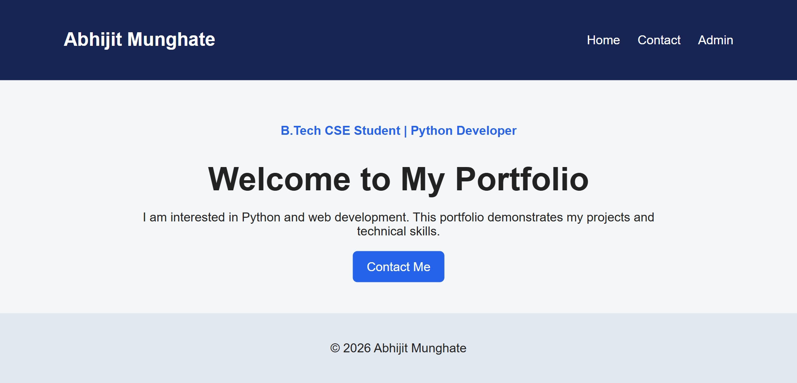
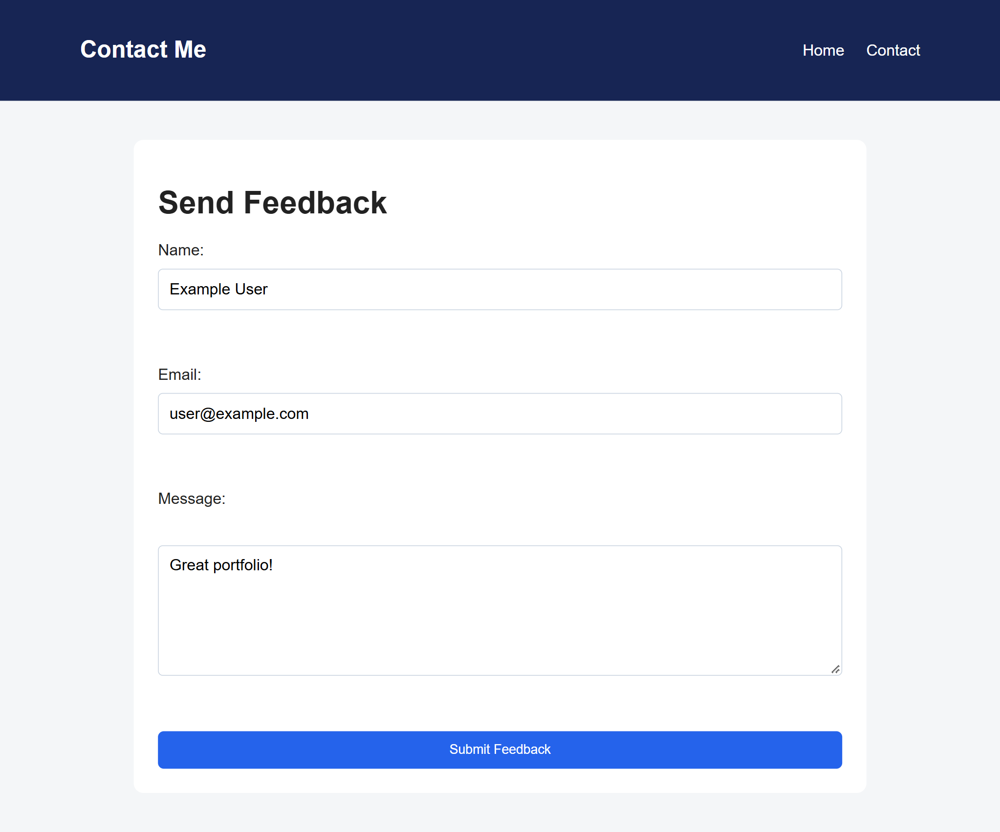
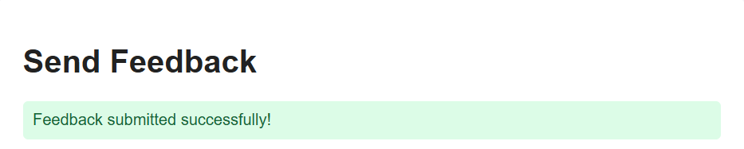
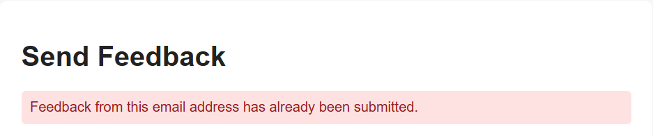
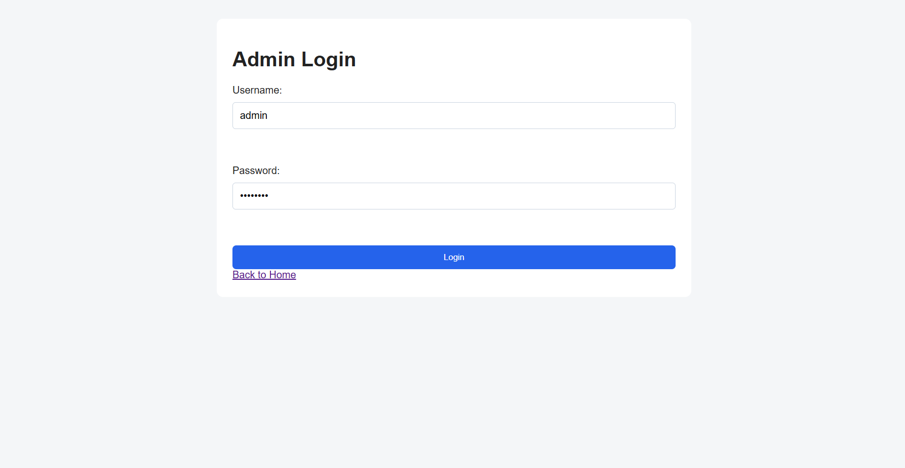
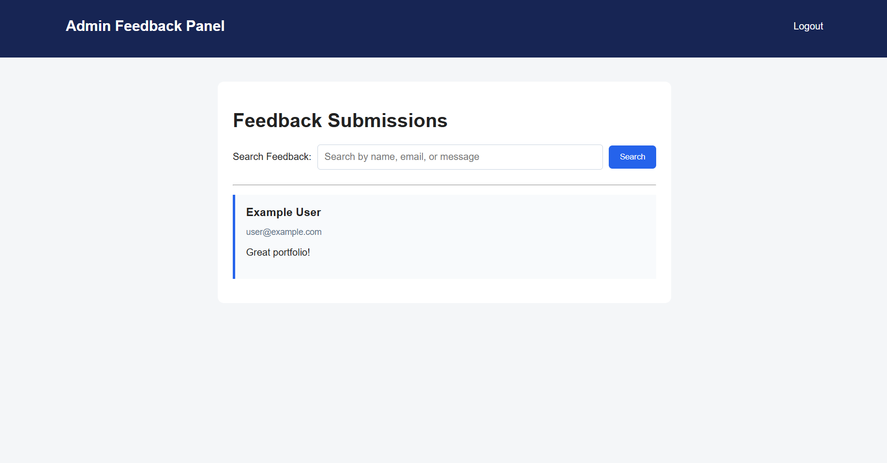

# 🚀 Day 65 - Portfolio Website Backend

Welcome to **Day 65** of my **100 Days of Python Projects** challenge.

The goal of this challenge is to build and upload one Python project every day to improve programming skills, problem-solving ability, and practical knowledge.

For Day 65, I created a **Portfolio Website Backend** using Python, Flask, HTML, CSS, JavaScript, JSON, and environment variables. The application includes a portfolio homepage, contact/feedback form, admin authentication, feedback storage, feedback search, and an admin feedback dashboard.

---

## 📌 Project Overview

The **Portfolio Website Backend** is a Flask-based web application that demonstrates how a portfolio website can be connected to a backend system.

The application allows visitors to:

* View the portfolio homepage.
* Open the contact page.
* Submit feedback using a form.

The administrator can:

* Log in through a protected admin login page.
* View submitted feedback.
* Search feedback by name, email, or message.
* Log out securely.

Feedback is stored locally in a JSON file, while sensitive configuration such as the Flask secret key and administrator credentials are stored in environment variables.

> **Note:** This project is designed as a learning project. It uses a local JSON file instead of a production database and should be further secured before being used as a real-world portfolio backend.

---

## ✨ Features

### 🏠 Portfolio Home Page

* Displays the portfolio introduction.
* Shows the developer's name.
* Displays a short professional description.
* Provides navigation to the Contact and Admin pages.
* Includes a dynamic copyright year.

### 📩 Contact and Feedback Form

Visitors can submit:

* Name.
* Email address.
* Message.

The form uses Flask's POST request handling to send the submitted data to the backend.

### 💾 Feedback Storage

Submitted feedback is stored in:

```text
feedback.json
```

The application:

* Loads existing feedback.
* Normalizes email addresses.
* Stores new feedback.
* Prevents duplicate submissions from the same email address.

### 🚫 Duplicate Feedback Prevention

Before saving new feedback, the application compares the submitted email address with previously stored email addresses.

Email comparison is case-insensitive.

For example:

```text
User@example.com
user@example.com
USER@EXAMPLE.COM
```

are treated as the same email address.

### 🔐 Admin Authentication

The application includes a dedicated administrator login page.

The administrator must provide:

* Username.
* Password.

The password is verified using Werkzeug's password-hashing functionality instead of comparing a plain-text password.

### 🛡️ Protected Feedback Dashboard

The `/feedback` route is protected using a custom decorator:

```python
@admin_required
```

Users who are not logged in as administrators are redirected to the admin login page.

### 🔎 Feedback Search

The administrator can search feedback using:

* Name.
* Email.
* Message.

The search is case-insensitive.

### 🚪 Admin Logout

The administrator can log out using the Logout option.

The admin session flag is removed before redirecting back to the login page.

### 🔔 Flash Messages

The application uses Flask flash messages to display:

* Successful feedback submission.
* Duplicate feedback warnings.
* Invalid login messages.
* Successful login messages.
* Logout confirmation.

### 🌐 Flask Templates

The application uses Jinja2 templates to generate dynamic HTML pages.

Templates include:

* `index.html`
* `contact.html`
* `login.html`
* `feedback.html`

### 📱 Responsive Layout

The HTML pages use the viewport meta tag and CSS layouts designed to work across different screen sizes.

---

## 📸 Screenshots

### 1. Portfolio Home Page



### 2. Contact Form



### 3. Feedback Submission



### 4. Duplicate Feedback Prevention



### 5. Admin Login



### 6. Admin Feedback Dashboard



---

## 🛠️ Technologies Used

### Python

Python is the main programming language used for the backend.

It handles:

* Routing.
* Form processing.
* Authentication.
* Session management.
* JSON file operations.
* Input validation.
* Feedback processing.

### Flask

Flask is used to create the web application and handle HTTP requests.

The project uses Flask for:

* URL routing.
* HTML template rendering.
* Form handling.
* Sessions.
* Flash messages.
* Redirects.

### HTML

HTML is used to create the structure of the website pages.

The project includes separate templates for:

* Portfolio homepage.
* Contact form.
* Admin login.
* Feedback dashboard.

### CSS

CSS is used to style the website.

It controls:

* Navigation bar.
* Buttons.
* Forms.
* Feedback cards.
* Flash messages.
* Page layout.
* Colors and spacing.

### JavaScript

JavaScript is used for a small client-side feature that automatically updates the copyright year on the portfolio homepage.

### JSON

JSON is used as a lightweight local data store for feedback submissions.

### python-dotenv

`python-dotenv` loads configuration values from the `.env` file into environment variables.

This prevents sensitive configuration from being written directly into the Python source code.

### Werkzeug

Werkzeug provides the password-hashing verification functionality used during administrator login.

The project uses:

```python
check_password_hash()
```

---

## 📂 Project Structure

```text
DAY_65/
├── main65.py
├── feedback.json
├── requirements.txt
├── .env
├── README.md
│
├── templates/
│   ├── index.html
│   ├── contact.html
│   ├── login.html
│   └── feedback.html
│
├── static/
│   ├── css/
│   │   └── style.css
│   └── js/
│       └── script.js
│
└── screenshots/
    ├── admin-login.png
    ├── contact-form.png
    ├── duplicate-feedback.png
    ├── feedback-dashboard.png
    ├── feedback-success.png
    └── home-page.png
```

> Adjust the Python filename in the structure if your main Flask file has a different name.

---

## 📄 File Description

### `main65.py`

This file contains the Flask backend.

It manages:

* Flask application setup.
* Environment variables.
* Feedback loading and saving.
* Authentication.
* Session management.
* Routes.
* Form processing.
* Feedback searching.
* Logout functionality.

### `index.html`

This is the main portfolio homepage.

It contains:

* Developer name.
* Navigation.
* Introduction.
* Contact button.
* Dynamic copyright year.

### `contact.html`

This page contains the feedback form.

Visitors can enter:

* Name.
* Email.
* Message.

It also displays Flask flash messages after form submission.

### `login.html`

This page provides the administrator login form.

The administrator enters:

* Username.
* Password.

The credentials are processed by the Flask backend.

### `feedback.html`

This is the protected administrator dashboard.

It displays:

* Submitted feedback.
* Email addresses.
* Messages.
* Search functionality.
* Logout option.

### `style.css`

This file contains the styling for the website.

It defines styles for:

* Navigation.
* Hero section.
* Forms.
* Buttons.
* Feedback cards.
* Flash messages.
* Footer.
* Search form.

### `script.js`

This file contains the client-side JavaScript.

It automatically updates the copyright year:

```javascript
document.addEventListener("DOMContentLoaded", function () {
    const yearElement = document.getElementById("year");

    if (yearElement) {
        yearElement.textContent = new Date().getFullYear();
    }
});
```

### `feedback.json`

This file stores submitted feedback locally.

A stored entry has the following structure:

```json
{
    "name": "Example User",
    "email": "user@example.com",
    "message": "Great portfolio!"
}
```

### `requirements.txt`

Contains the external Python packages required by the project.

---

## 📦 requirements.txt

```text
Flask
python-dotenv
```

Install the dependencies using:

```bash
pip install -r requirements.txt
```

---

## 🔐 Environment Variables

Sensitive configuration should **not** be stored directly inside the Python source code.

The project uses a `.env` file for:

```text
SECRET_KEY
ADMIN_USERNAME
ADMIN_PASSWORD_HASH
```

Example:

```text
SECRET_KEY=your-long-random-secret-key
ADMIN_USERNAME=admin
ADMIN_PASSWORD_HASH=your-generated-password-hash
```

### ⚠️ Important

The `.env` file should **never be uploaded to GitHub**.

Add the following to `.gitignore`:

```text
.env
__pycache__/
*.pyc
venv/
```

The password should also never be stored as plain text.

Instead, a password hash is generated and stored in:

```text
ADMIN_PASSWORD_HASH
```

The application verifies the entered password using:

```python
check_password_hash(ADMIN_PASSWORD_HASH, password)
```

---

## ▶️ How to Run

### 1. Install Python

Install Python if it is not already installed.

Make sure Python is added to the system PATH.

### 2. Open the Project Folder

Open the `DAY_65` project folder in VS Code or a terminal.

### 3. Create a Virtual Environment

Run:

```bash
python -m venv venv
```

Activate it on Windows:

```bash
venv\Scripts\activate
```

### 4. Install Dependencies

Run:

```bash
pip install -r requirements.txt
```

### 5. Create the `.env` File

Create a file named:

```text
.env
```

Add the required configuration:

```text
SECRET_KEY=your-secret-key
ADMIN_USERNAME=admin
ADMIN_PASSWORD_HASH=your-password-hash
```

### 6. Run the Application

Run:

```bash
python main65.py
```

The Flask development server will start.

Open the local address shown in the terminal in your web browser.

---

## 🔑 Password Hashing

The project does not store the administrator password directly.

Instead, the application expects a password hash.

The Flask backend uses:

```python
from werkzeug.security import check_password_hash
```

During login:

```python
valid_password = check_password_hash(
    ADMIN_PASSWORD_HASH,
    password
)
```

The entered password is checked against the stored hash.

This is safer than storing:

```text
ADMIN_PASSWORD=MyPassword123
```

in the application source code.

---

## 🏠 Portfolio Page Workflow

When the user opens the homepage:

```text
Browser
   ↓
GET /
   ↓
home()
   ↓
render_template("index.html")
   ↓
Portfolio Home Page
```

The homepage contains:

* Portfolio introduction.
* Navigation.
* Contact button.
* Current copyright year.

---

## 📩 Feedback Submission Workflow

The feedback process follows these steps:

```text
Visitor
   ↓
Contact Page
   ↓
Enter Name + Email + Message
   ↓
Submit Form
   ↓
POST /submit-feedback
   ↓
Validate Fields
   ↓
Check Duplicate Email
   ↓
Save to feedback.json
   ↓
Display Success Message
```

If any required field is missing, the application displays:

```text
All fields are required.
```

If the email has already been used, the application displays:

```text
Feedback from this email address has already been submitted.
```

---

## 💾 JSON Feedback Storage

The `load_feedback()` function reads existing feedback from:

```text
feedback.json
```

If the file does not exist, it returns an empty list.

If the JSON file contains invalid data, it also returns an empty list instead of crashing the application.

The `save_feedback()` function then:

1. Loads existing feedback.
2. Normalizes the submitted email.
3. Checks for duplicate emails.
4. Creates a new feedback dictionary.
5. Adds the dictionary to the list.
6. Saves the updated list to the JSON file.

---

## 🔎 Feedback Search

The administrator dashboard provides a search form.

The search query is passed using a GET request:

```text
/feedback?search=python
```

The backend searches the query against:

```text
Name
Email
Message
```

The search is converted to lowercase, making it case-insensitive.

For example, searching:

```text
PYTHON
```

can match:

```text
Python
python
PYTHON
```

---

## 🔐 Admin Login Workflow

The administrator login uses the following process:

```text
Admin Login Page
       ↓
Enter Username + Password
       ↓
POST /admin-login
       ↓
Check Username
       ↓
Verify Password Hash
       ↓
Valid?
  ↙         ↘
Yes          No
 ↓            ↓
Create       Flash Error
Session      Message
 ↓
Feedback Dashboard
```

When authentication succeeds, the application sets:

```python
session["admin_logged_in"] = True
```

---

## 🛡️ Protected Admin Route

The feedback dashboard is protected using the custom decorator:

```python
@admin_required
```

The decorator checks:

```python
if not session.get("admin_logged_in"):
    return redirect(url_for("admin_login"))
```

This prevents users who are not authenticated as administrators from directly accessing the feedback dashboard.

---

## 🚪 Logout

The administrator can log out through:

```text
/logout
```

The application removes the login session:

```python
session.pop("admin_logged_in", None)
```

The administrator is then redirected to the login page.

---

## 🔔 Flash Messages

Flask flash messages provide feedback to users after important actions.

### Success Messages

Examples include:

```text
Feedback submitted successfully!
```

```text
Admin login successful.
```

```text
You have been logged out.
```

### Error Messages

Examples include:

```text
All fields are required.
```

```text
Invalid username or password.
```

```text
Feedback from this email address has already been submitted.
```

---

## 🌐 Flask Routes

The application contains the following routes:

| Route              | Method    | Purpose               | Access        |
| ------------------ | --------- | --------------------- | ------------- |
| `/`                | GET       | Portfolio homepage    | Public        |
| `/contact`         | GET       | Feedback form         | Public        |
| `/submit-feedback` | POST      | Process feedback      | Public        |
| `/admin-login`     | GET, POST | Administrator login   | Public        |
| `/feedback`        | GET       | View/search feedback  | Admin         |
| `/logout`          | GET       | Log out administrator | Admin session |

---

## 🖥️ Frontend Components

### Navigation Bar

The navigation bar provides links to:

* Home.
* Contact.
* Admin.

### Hero Section

The homepage contains a central introduction with:

* Developer name.
* Professional tagline.
* Short description.
* Contact button.

### Contact Form

The feedback form contains:

* Name input.
* Email input.
* Message textarea.
* Submit button.

HTML validation is also used through:

```html
required
```

and:

```html
type="email"
```

### Admin Login Form

The login form contains:

* Username field.
* Password field.
* Login button.
* Back to Home link.

### Feedback Dashboard

The dashboard displays feedback entries as individual cards.

Each card contains:

* Name.
* Email.
* Message.

---

## 🎨 CSS Styling

The stylesheet provides a simple portfolio design using:

* Flexbox.
* Responsive widths.
* Cards.
* Buttons.
* Form styling.
* Navigation styling.
* Flash message styling.

Important CSS classes include:

```text
.navbar
.hero
.form-container
.feedback-container
.feedback-card
.search-form
.message
.success
.error
```

---

## 📚 Libraries and Functions Practiced

### Flask

* `Flask()`
* `app.route()`
* `render_template()`
* `request.form.get()`
* `request.args.get()`
* `redirect()`
* `url_for()`
* `session`
* `flash()`

### Python

* `open()`
* `json.load()`
* `json.dump()`
* `try`
* `except`
* Lists.
* Dictionaries.
* Functions.
* Decorators.
* Environment variables.

### python-dotenv

* `load_dotenv()`
* `os.getenv()`

### Werkzeug

* `check_password_hash()`

### HTML

* Forms.
* Inputs.
* Textareas.
* Navigation.
* Jinja2 template expressions.
* Jinja2 loops and conditions.

### CSS

* Flexbox.
* Box model.
* Form styling.
* Responsive layout.
* Hover effects.

### JavaScript

* `DOMContentLoaded`
* `getElementById()`
* `textContent`
* `Date()`

---

## 🔍 Concepts Practiced

This project helped me practice:

* Flask web development.
* URL routing.
* GET and POST requests.
* HTML forms.
* Jinja2 templates.
* Static files.
* CSS styling.
* JavaScript.
* JSON file handling.
* CRUD-style data storage concepts.
* Environment variables.
* Password hashing.
* Authentication.
* Session management.
* Custom decorators.
* Protected routes.
* Flash messages.
* Search functionality.
* Input validation.
* Exception handling.
* Frontend-backend integration.

---

## 🎯 Learning Outcome

By completing this project, I learned how to:

* Build a basic portfolio website using Flask.
* Connect HTML templates to Flask routes.
* Process form submissions using POST requests.
* Store submitted information in a JSON file.
* Prevent duplicate feedback submissions.
* Use environment variables for sensitive configuration.
* Verify hashed administrator passwords.
* Implement session-based authentication.
* Protect routes using a custom decorator.
* Create an administrator feedback dashboard.
* Implement search functionality.
* Use Flask flash messages.
* Separate static CSS and JavaScript files from templates.

---

## 🚀 Future Improvements

The project can be improved further by adding:

* A proper database such as SQLite or PostgreSQL.
* Full portfolio project sections.
* Skills and education sections.
* Resume download.
* GitHub and LinkedIn links.
* Project filtering.
* Contact email notifications.
* Admin ability to delete feedback.
* Admin ability to mark feedback as read.
* Feedback timestamps.
* Pagination.
* CSRF protection.
* Rate limiting.
* Stronger input validation.
* Better email validation.
* Secure production configuration.
* HTTPS deployment.
* Production WSGI server.
* Responsive mobile navigation.
* Dark mode.
* Improved animations.
* Admin dashboard statistics.
* Database-backed authentication.
* Password change functionality.

---

## ⚠️ Limitations

The current version has some limitations:

* Feedback is stored in a local JSON file.
* It is not designed for multiple concurrent administrators.
* There is no database.
* There is no email notification system.
* The feedback dashboard has basic search functionality.
* Feedback cannot be deleted from the dashboard.
* There is no pagination.
* CSRF protection has not been implemented.
* There is no rate limiting on login or feedback submission.
* The application uses Flask's development server when run directly.
* The portfolio content is currently simple and static.
* The project requires additional security configuration before production deployment.

---

## 🔒 Security Considerations

This project demonstrates several basic security practices.

### Environment Variables

Sensitive configuration is loaded using:

```python
load_dotenv()
```

and:

```python
os.getenv()
```

This prevents credentials and secret keys from being hard-coded in the source code.

### Password Hashing

The administrator password is stored as a hash instead of plain text.

### Session Authentication

The administrator's authenticated state is stored in a Flask session.

### Protected Route

The feedback dashboard is protected using:

```python
@admin_required
```

### `.gitignore`

Sensitive files such as `.env` should be excluded from Git:

```text
.env
```

This is especially important when pushing the project to GitHub.

> Never upload your real `SECRET_KEY`, administrator password, or generated password hash if you do not intend to expose them.

---

## 🏆 Challenge

This project was created as part of my **100 Days of Python Projects** challenge. The purpose of this challenge is to improve my Python programming skills by building practical projects regularly and documenting the learning process on GitHub.

Built a **Portfolio Website Backend** using Python, Flask, HTML, CSS, JavaScript, JSON, environment variables, password hashing, and session-based authentication.

This project improved my understanding of Flask web development, form handling, backend data storage, authentication, protected routes, search functionality, and basic web security practices.

---

## 👨‍💻 Author

**Abhijit Munghate**

Happy Coding! 🚀🐍📊