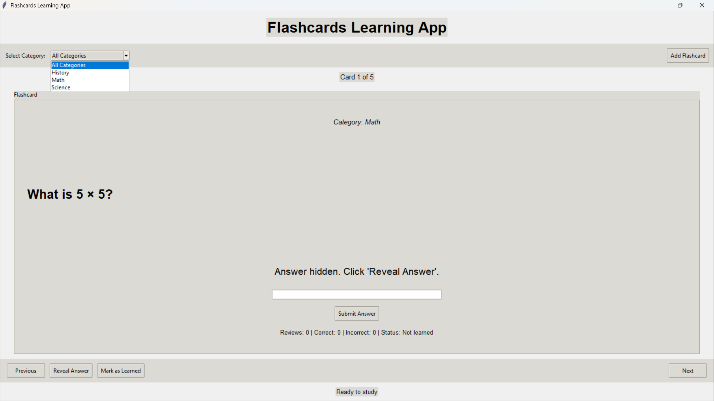
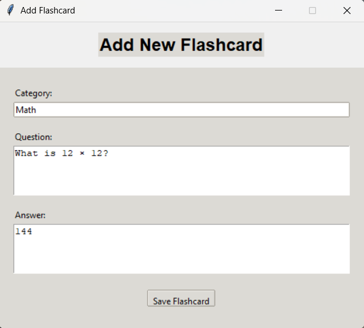
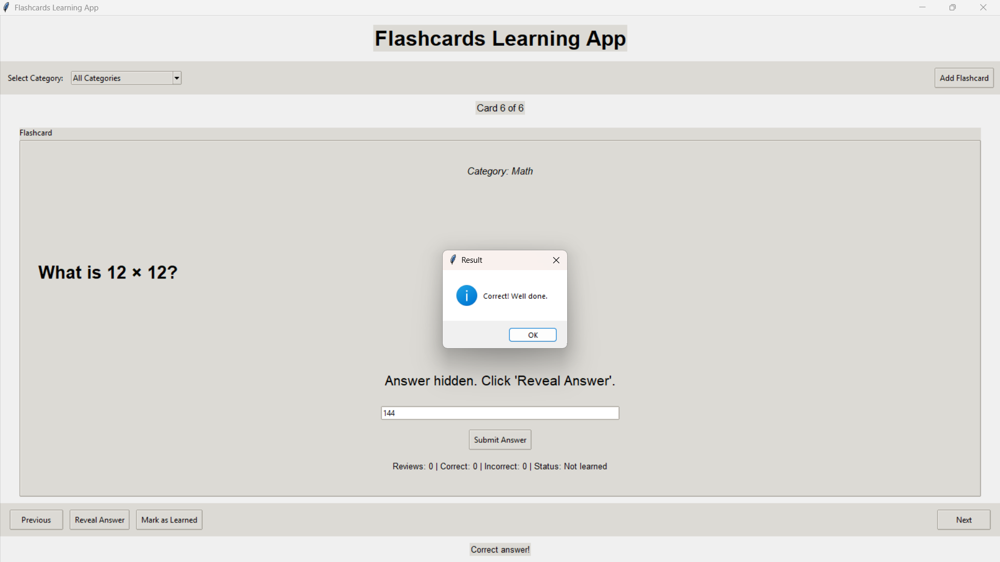

# 🚀 Day 66 - Flashcards Learning App

Welcome to **Day 66** of my **100 Days of Python Projects** challenge.

The goal of this challenge is to build and upload one Python project every day to improve programming skills, problem-solving ability, and practical knowledge.

For Day 66, I created a **Flashcards Learning App** using Python and Tkinter. The application allows users to create flashcards, organize them by category, review questions, submit answers, track performance, and mark flashcards as learned.

---

## 📌 Project Overview

The **Flashcards Learning App** is a desktop-based study application designed to help users practice and review questions using digital flashcards.

Each flashcard contains:

* Question
* Answer
* Category
* Learning status
* Review count
* Correct answer count
* Incorrect answer count

The application stores flashcards and review history in JSON files, allowing study progress to remain available after restarting the application.

The application provides a simple workflow:

```text
Create Flashcards
       ↓
Select Category
       ↓
View Question
       ↓
Enter Answer
       ↓
Submit Answer
       ↓
Track Result
       ↓
Review Progress
       ↓
Mark as Learned
```

---

## ✨ Features

### 🗂️ Flashcard Management

Users can create new flashcards by entering:

* Category
* Question
* Answer

Each flashcard is automatically assigned a unique ID.

### 📚 Category Filtering

Flashcards can be organized into categories such as:

* Math
* History
* Science

The category dropdown allows users to select:

* All Categories
* A specific category

Only flashcards that are **not yet learned** are displayed for studying.

### ❓ Question Display

The application displays the current flashcard question in a large, easy-to-read area.

The question is shown while the answer remains hidden.

### 💡 Answer Reveal

Users can click **Reveal Answer** to display the correct answer for the current flashcard.

### ✍️ Answer Submission

Users can type their answer into the answer field and submit it.

The application compares the entered answer with the stored answer.

The comparison:

* Ignores uppercase/lowercase differences.
* Normalizes extra spaces.

For example:

```text
Jawaharlal Nehru
jawaharlal nehru
```

are treated as the same answer.

### ✅ Correct Answer Tracking

When the answer is correct:

* Review count increases.
* Correct count increases.
* A success message is displayed.
* The review result is saved.

### ❌ Incorrect Answer Tracking

When the answer is incorrect:

* Review count increases.
* Incorrect count increases.
* The correct answer is displayed.
* The review result is saved.

### 📊 Study Statistics

Each flashcard displays:

* Total reviews
* Correct answers
* Incorrect answers
* Learning status

Example:

```text
Reviews: 3 | Correct: 2 | Incorrect: 1 | Status: Not learned
```

### 🏆 Mark as Learned

Users can mark a flashcard as learned.

Once marked as learned, it is removed from the active study list.

### ⏮️ Previous and Next Navigation

Users can navigate between available flashcards using:

* Previous
* Next

The navigation wraps around when reaching the beginning or end of the list.

### ➕ Add Flashcard

A separate **Add Flashcard** window allows users to create new flashcards without closing the main application.

### 💾 JSON Data Storage

The application stores data locally using JSON files:

```text
flashcards.json
review_logs.json
```

This means no external database is required.

### 🕒 Review History

Every submitted answer creates a review log containing:

* Flashcard ID
* Question
* Category
* Result
* Review date and time

### 🛡️ Error Handling

The application handles:

* Missing JSON files.
* Corrupted JSON files.
* Empty answers.
* Missing flashcard information.
* No available flashcards.

---

## 📸 Screenshots

### 1. Main Application Window



### 2. Add Flashcard Window



### 3. Answer Submission



---

## 🛠️ Technologies Used

### Python

Python is the main programming language used to develop the application.

It handles:

* Application logic.
* Flashcard management.
* JSON file operations.
* Answer checking.
* Review tracking.
* Date and time handling.

### Tkinter

Tkinter is used to create the graphical user interface.

The application uses Tkinter components such as:

* Labels
* Buttons
* Entry fields
* Text fields
* Frames
* LabelFrames
* Comboboxes
* Message boxes
* Toplevel windows

### JSON

JSON is used for local data storage.

Two JSON files are used:

```text
flashcards.json
review_logs.json
```

### pathlib

Python's `pathlib` module is used to create file paths.

```python
Path("flashcards.json")
Path("review_logs.json")
```

### datetime

The `datetime` module is used to store the date and time when a flashcard is reviewed.

---

## 📂 Project Structure

```text
DAY_66/
├── main66.py
├── flashcards.json
├── review_logs.json
├── requirements.txt
├── README.md
└── screenshots/
    ├── main-window.png
    ├── add-flashcard.png
    └── answer-submission.png
```

> **Note:** If your Python file has a different filename, replace `main66.py` with the actual filename.

---

## 📄 File Description

### `main66.py`

This is the main Python file containing the application logic.

It includes:

* JSON loading and saving functions.
* Flashcard management.
* Review tracking.
* Add Flashcard window.
* Main Flashcard application.
* Tkinter interface.
* Answer validation.

### `flashcards.json`

This file stores all flashcards and their learning statistics.

Each flashcard contains:

```json
{
    "id": 1,
    "question": "What is 5 × 5?",
    "answer": "25",
    "category": "Math",
    "learned": false,
    "review_count": 0,
    "correct_count": 0,
    "incorrect_count": 0
}
```

### `review_logs.json`

This file stores the history of flashcard reviews.

A review entry contains:

```json
{
    "flashcard_id": 1,
    "question": "What is 5 × 5?",
    "category": "Math",
    "result": "correct",
    "reviewed_at": "2026-09-15 22:00:00"
}
```

The actual timestamp depends on when the flashcard is reviewed.

### `requirements.txt`

This project uses Python's standard library, so no external packages are required.

The file can contain:

```text
# No external dependencies required
```

---

## 🗃️ Flashcard Data

The initial `flashcards.json` contains three sample flashcards.

### Math

**Question:**

```text
What is 5 × 5?
```

**Answer:**

```text
25
```

### History

**Question:**

```text
Who was the first Prime Minister of India?
```

**Answer:**

```text
Jawaharlal Nehru
```

### Science

**Question:**

```text
What is the chemical symbol for water?
```

**Answer:**

```text
H₂O
```

Each flashcard initially has:

```text
Learned: False
Reviews: 0
Correct: 0
Incorrect: 0
```

---

## ▶️ How to Run

### 1. Install Python

Install Python on your computer.

Tkinter is normally included with standard Python installations on Windows.

### 2. Open the Project Folder

Open the Day 66 project folder in VS Code or a terminal.

### 3. Check the JSON Files

Make sure:

```text
flashcards.json
```

is present in the same directory as the Python file.

The application will automatically create the required data structure when new flashcards are added.

### 4. Run the Application

Execute:

```bash
python main66.py
```

The Flashcards Learning App window will open.

> If your Python file has a different name, replace `main66.py` with that filename.

---

## 🔄 Application Workflow

The application works through the following process:

```text
Start Application
       ↓
Load flashcards.json
       ↓
Load available categories
       ↓
Display unlearned flashcards
       ↓
Select Category
       ↓
Display Question
       ↓
Enter Answer
       ↓
Submit Answer
       ↓
Compare Answers
       ↓
Correct / Incorrect
       ↓
Update Statistics
       ↓
Save Review Log
       ↓
Continue Studying
```

---

## 💾 JSON Loading

The application uses a reusable function to load JSON data:

```python
def load_json(file_path, default_value):
    try:
        with open(file_path, "r", encoding="utf-8") as file:
            return json.load(file)
    except FileNotFoundError:
        return default_value
```

This allows the application to continue working even when a JSON file does not exist.

It also handles corrupted JSON using:

```python
except json.JSONDecodeError:
```

---

## 💾 JSON Saving

Data is saved using:

```python
def save_json(file_path, data):
    with open(file_path, "w", encoding="utf-8") as file:
        json.dump(data, file, indent=4, ensure_ascii=False)
```

The use of:

```text
indent=4
```

keeps the JSON file properly formatted and readable.

---

## 🆔 Flashcard ID Generation

Every newly created flashcard receives a unique ID.

The application finds the highest existing ID and adds one:

```python
existing_ids = [card.get("id", 0) for card in flashcards]
next_id = max(existing_ids, default=0) + 1
```

For example:

```text
Existing IDs:
1, 2, 3

New ID:
4
```

This makes it easier to identify individual flashcards and connect them with review logs.

---

## 🗂️ Category System

Categories are automatically extracted from the flashcards.

The application uses a Python set to avoid duplicate category names:

```python
categories = {
    card.get("category", "General")
    for card in flashcards
}
```

The categories are then sorted before being displayed.

The dropdown contains:

```text
All Categories
Math
History
Science
```

---

## 🎯 Filtering Unlearned Flashcards

The application only displays flashcards that have not been marked as learned.

For all categories:

```python
[
    card for card in self.flashcards
    if not card.get("learned", False)
]
```

For a selected category, the category must also match.

This creates a simple learning workflow where completed flashcards are removed from the active study list.

---

## 🧠 Answer Checking

When the user submits an answer, the application normalizes both answers:

```python
" ".join(user_answer.lower().split())
```

and:

```python
" ".join(correct_answer.lower().split())
```

This allows the application to ignore:

* Capitalization differences.
* Extra spaces.
* Leading and trailing spaces.

For example:

```text
User Answer:
  jawaharlal   nehru

Correct Answer:
Jawaharlal Nehru
```

Both become equivalent after normalization.

---

## 📊 Review Statistics

Each flashcard tracks three important statistics:

### Review Count

The total number of times the flashcard has been reviewed.

```text
review_count
```

### Correct Count

The number of times the user submitted the correct answer.

```text
correct_count
```

### Incorrect Count

The number of times the user submitted an incorrect answer.

```text
incorrect_count
```

Example:

```text
Reviews: 5
Correct: 4
Incorrect: 1
```

---

## 📝 Review Logging

Whenever a user submits an answer, the application creates a review log.

Example:

```json
{
    "flashcard_id": 2,
    "question": "Who was the first Prime Minister of India?",
    "category": "History",
    "result": "correct",
    "reviewed_at": "2026-09-15 22:10:30"
}
```

The timestamp is generated using:

```python
datetime.now().strftime("%Y-%m-%d %H:%M:%S")
```

This provides a record of when the flashcard was reviewed.

---

## 🏆 Learned Status

Each flashcard contains a Boolean learning status:

```json
"learned": false
```

When the user clicks **Mark as Learned**, it changes to:

```json
"learned": true
```

The flashcard is then removed from the active study list.

This allows the user to focus on flashcards that still need practice.

---

## 🖥️ GUI Components

### Main Window

The main application window contains the complete flashcard learning interface.

It includes:

* Application title.
* Category selection.
* Add Flashcard button.
* Progress information.
* Flashcard display.
* Answer input.
* Statistics.
* Navigation buttons.
* Status messages.

### Category Combobox

A `ttk.Combobox` allows the user to select a category.

```python
self.category_combo = ttk.Combobox(
    top_frame,
    textvariable=self.category_var,
    state="readonly"
)
```

### Question Label

The current question is displayed using a large label.

The question is wrapped so that longer questions remain readable.

### Answer Entry

Users can enter their answer using the entry field.

The application also supports pressing:

```text
Enter
```

to submit the answer.

### Reveal Answer Button

Displays the stored answer for the current flashcard.

### Mark as Learned Button

Marks the current flashcard as learned and refreshes the study list.

### Previous and Next Buttons

These buttons allow users to navigate between flashcards.

### Add Flashcard Window

A separate `Toplevel` window is used to add new flashcards.

It contains:

* Category field.
* Question field.
* Answer field.
* Save Flashcard button.

---

## 🛡️ Error Handling

The application includes several error-handling mechanisms.

### Missing JSON File

If a JSON file does not exist, the application uses a default value.

For example:

```python
return load_json(FLASHCARDS_FILE, [])
```

### Corrupted JSON

If a JSON file contains invalid data, the application displays an error message.

```python
messagebox.showerror(
    "File Error",
    "The file may be corrupted."
)
```

### Missing Flashcard Information

When adding a flashcard, the application checks whether:

* Category is provided.
* Question is provided.
* Answer is provided.

If any field is empty, a warning is displayed.

### Empty Answer

The application prevents submission if the answer field is empty.

### No Flashcards

If there are no available flashcards, the interface displays:

```text
No flashcards available
```

---

## 📚 Libraries and Functions Practiced

### Python Standard Library

* `json`
* `datetime`
* `pathlib`

### Tkinter

* `tk.Tk()`
* `tk.Toplevel()`
* `tk.Text()`
* `tk.StringVar()`
* `ttk.Label()`
* `ttk.Frame()`
* `ttk.LabelFrame()`
* `ttk.Entry()`
* `ttk.Combobox()`
* `ttk.Button()`
* `messagebox.showerror()`
* `messagebox.showwarning()`
* `messagebox.showinfo()`

### JSON

* `json.load()`
* `json.dump()`

### File Handling

* `open()`
* UTF-8 encoding
* File existence handling
* JSON persistence

### Date and Time

* `datetime.now()`
* `strftime()`

### pathlib

* `Path()`

---

## 🔍 Concepts Practiced

This project helped me practice:

* Functions.
* Classes.
* Object-oriented programming.
* Tkinter GUI development.
* Event handling.
* JSON file handling.
* Data persistence.
* CRUD-style data concepts.
* Lists.
* Dictionaries.
* Sets.
* List comprehensions.
* String normalization.
* Conditional statements.
* Exception handling.
* File paths.
* Date and time handling.
* GUI forms.
* Dropdown menus.
* Multiple windows.
* Application state management.
* Statistics tracking.

---

## 🎯 Learning Outcome

By completing this project, I learned how to:

* Build a complete desktop application using Tkinter.
* Store application data using JSON.
* Load and save structured data.
* Create reusable JSON helper functions.
* Design a flashcard data structure.
* Generate unique IDs.
* Filter data based on categories.
* Track user performance.
* Record review history.
* Compare user input with stored answers.
* Handle invalid and missing data.
* Create additional windows using `Toplevel`.
* Manage application state using classes and instance variables.

---

## 🚀 Future Improvements

The project can be improved further by adding:

* Edit existing flashcards.
* Delete flashcards.
* Search flashcards.
* Flashcard difficulty levels.
* Spaced repetition.
* Automatic review scheduling.
* Daily study goals.
* Study streak tracking.
* Overall accuracy percentage.
* Category-wise statistics.
* Progress charts.
* Review history window.
* Dark mode.
* Keyboard shortcuts.
* Multiple-choice questions.
* Randomized flashcard order.
* Quiz mode.
* Timed quizzes.
* Import flashcards from CSV.
* Export flashcards to CSV.
* Database storage.
* User profiles.
* Multiple decks.
* Cloud synchronization.

---

## ⚠️ Limitations

The current version has some limitations:

* It uses local JSON files for storage.
* It does not have user accounts.
* It does not provide spaced repetition.
* It does not calculate advanced learning analytics.
* Answers must match the stored answer after basic text normalization.
* It does not support multiple acceptable answers.
* Flashcards cannot currently be edited or deleted through the GUI.
* There is no database.
* Review logs are stored locally.
* There is no automatic backup of flashcard data.

---

## 🏆 Challenge

This project was created as part of my **100 Days of Python Projects** challenge. The purpose of this challenge is to improve my Python programming skills by building practical projects regularly and documenting the learning process on GitHub.

Built a **Flashcards Learning App** using Python, Tkinter, JSON, and object-oriented programming.

This project improved my understanding of GUI development, local data persistence, JSON handling, event-driven programming, answer validation, progress tracking, and building practical desktop applications.

---

## 👨‍💻 Author

**Abhijit Munghate**

Happy Coding! 🚀🐍📊