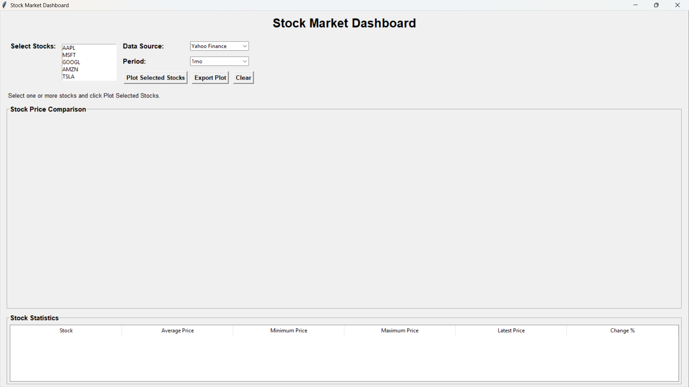
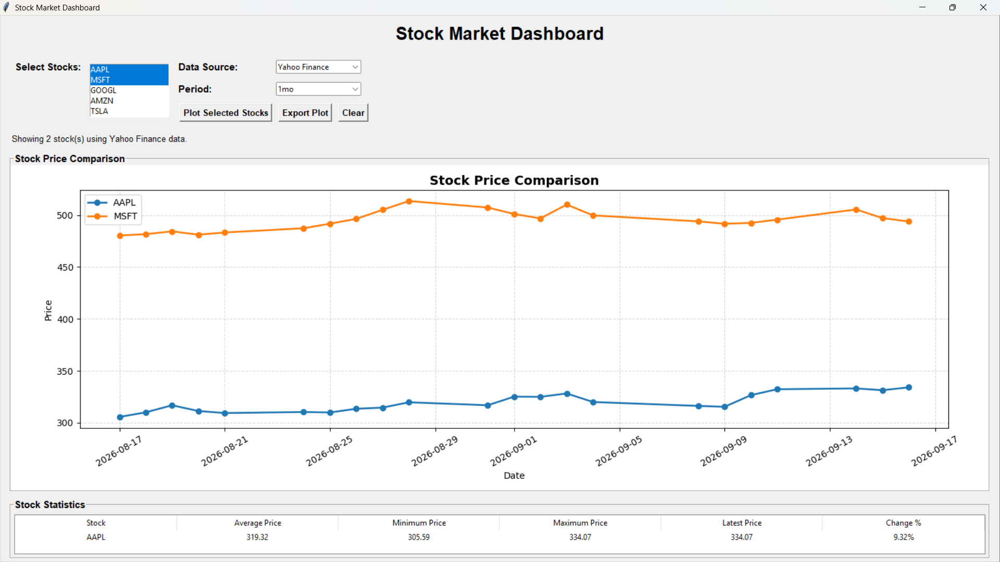
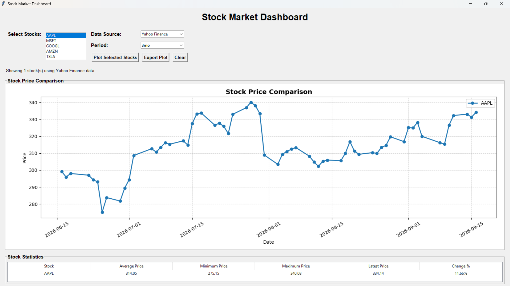
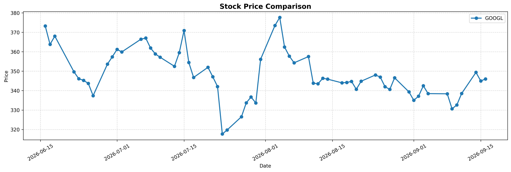

# 🚀 Day 67 - Stock Market Dashboard

Welcome to **Day 67** of my **100 Days of Python Projects** challenge.

The goal of this challenge is to build and upload one Python project every day to improve programming skills, problem-solving ability, and practical knowledge.

For Day 67, I created a **Stock Market Dashboard** using Python, Pandas, Matplotlib, Tkinter, and Yahoo Finance. The application allows users to compare stock prices, view historical market data, calculate stock statistics, and export charts.

---

## 📌 Project Overview

The **Stock Market Dashboard** is a desktop application that displays historical stock price information through an interactive graphical interface.

The application supports two data sources:

* Yahoo Finance
* Local CSV file

Users can select one or more stocks, choose a time period, plot their prices, view statistical information, and export the generated chart.

The dashboard uses:

* Pandas for data processing.
* Yahoo Finance for retrieving historical stock data.
* Matplotlib for creating line charts.
* Tkinter for the graphical user interface.
* CSV files for local stock data storage.

> **Note:** The project is designed for educational purposes. It displays historical price data and does not provide financial advice or predict future stock prices.

---

## ✨ Features

### 📈 Stock Price Comparison

Users can select one or more stocks and compare their historical closing prices on the same chart.

The default stock list includes:

* AAPL
* MSFT
* GOOGL
* AMZN
* TSLA
* META
* NVDA

Each selected stock is displayed as a separate line on the chart.

### 🏢 Multiple Stock Selection

The application uses a multi-selection listbox.

Users can select:

* One stock.
* Multiple stocks.
* Several stocks for comparison.

At least one stock must be selected before plotting.

### 🌐 Yahoo Finance Data

The application can fetch historical stock prices from Yahoo Finance using the `yfinance` library.

The available periods are:

```text
1mo
3mo
6mo
1y
2y
5y
```

The application retrieves the historical closing price for each selected stock.

### 📁 Local CSV Data

Users can also load stock data from a local CSV file.

The CSV file must contain the following columns:

```text
date,stock,price
```

Example:

```csv
date,stock,price
2025-01-01,AAPL,145
2025-01-02,AAPL,150
2025-01-03,AAPL,147
2025-01-01,MSFT,240
2025-01-02,MSFT,235
2025-01-03,MSFT,243
```

### 📊 Historical Price Chart

The application creates a line chart showing stock prices over time.

The chart includes:

* Stock lines.
* Date on the x-axis.
* Price on the y-axis.
* Chart title.
* Legend.
* Grid lines.
* Rotated date labels.

### 📉 Stock Statistics

The dashboard calculates and displays the following statistics for every selected stock:

* Average price.
* Minimum price.
* Maximum price.
* Latest price.
* Percentage change.

The results are displayed in a Tkinter `Treeview` table.

### 🔢 Percentage Change

The percentage change is calculated using the first and latest available prices.

The formula is:

```text
Change % =
((Latest Price - First Price) / First Price) × 100
```

For example, if a stock starts at ₹100 and ends at ₹110:

```text
Change % = ((110 - 100) / 100) × 100
         = 10%
```

### 💾 Export Plot

Users can export the generated chart using the **Export Plot** button.

The supported formats are:

* PNG
* JPEG
* PDF

The chart is saved using Matplotlib's `savefig()` function.

### 🧹 Clear Dashboard

The **Clear** button removes:

* The current chart.
* The stored chart figure.
* The loaded data.
* The statistics table.

The status message is also updated.

### 🛡️ Error Handling

The application handles:

* No selected stocks.
* Missing CSV files.
* Invalid CSV columns.
* Invalid date values.
* Invalid price values.
* Empty Yahoo Finance results.
* Failed chart exports.
* Attempts to export before creating a chart.

---

## 📸 Screenshots

### 1. Main Dashboard



### 2. Multiple Stock Comparison



### 3. Yahoo Finance Chart



### 4. Exported Plot



---

## 🛠️ Technologies Used

### Python

Python is the main programming language used to develop the application.

It handles:

* Application logic.
* Data processing.
* GUI creation.
* File handling.
* Chart generation.
* Error handling.

### Pandas

Pandas is used for loading, cleaning, transforming, and analyzing stock data.

It is used for:

* Reading CSV files.
* Converting dates.
* Converting prices to numeric values.
* Filtering selected stocks.
* Sorting data.
* Calculating statistics.
* Combining stock data from Yahoo Finance.

### Matplotlib

Matplotlib is used to create stock price line charts.

The application uses:

* `Figure`
* `add_subplot()`
* `plot()`
* `set_title()`
* `set_xlabel()`
* `set_ylabel()`
* `legend()`
* `grid()`
* `savefig()`

### yfinance

The `yfinance` library is used to retrieve historical stock data from Yahoo Finance.

The application uses:

```python
yf.Ticker(symbol)
```

and:

```python
ticker.history(period=period, auto_adjust=False)
```

### Tkinter

Tkinter is used to create the desktop graphical interface.

The application includes:

* Labels.
* Listboxes.
* Dropdown menus.
* Buttons.
* Frames.
* LabelFrames.
* Treeview tables.
* Message boxes.
* File save dialogs.

### pathlib

The `pathlib` module is used to define the local CSV file path.

```python
CSV_FILE = Path("stock_data.csv")
```

---

## 📂 Project Structure

```text
DAY_67/
├── main67.py
├── stock_data.csv
├── requirements.txt
├── README.md
└── screenshots/
    ├── main-dashboard.png
    ├── multiple-stock-comparison.png
    ├── yahoo-finance-chart.png
    └── exported-plot.png
```

> **Note:** If your Python file has a different name, replace `main67.py` with the actual filename.

---

## 📄 File Description

### `main67.py`

This is the main Python file containing the complete application.

It includes:

* CSV loading.
* Yahoo Finance data fetching.
* Stock selection.
* Chart creation.
* Statistics calculation.
* Plot exporting.
* Dashboard clearing.
* Tkinter GUI creation.

### `stock_data.csv`

This file stores sample historical stock prices.

The required columns are:

```text
date
stock
price
```

The `date` column stores the trading date.

The `stock` column stores the stock ticker symbol.

The `price` column stores the closing price.

### `requirements.txt`

This file contains the external Python libraries required by the project.

```text
pandas
matplotlib
yfinance
```

### `README.md`

This file contains the project documentation, setup instructions, features, screenshots, and learning outcomes.

### `screenshots/`

This folder contains screenshots showing the application interface and its main features.

---

## 📦 requirements.txt

```text
pandas
matplotlib
yfinance
```

Install the dependencies using:

```bash
pip install -r requirements.txt
```

---

## 🗃️ Sample Dataset

The project includes a sample CSV file containing historical prices for two stocks.

### AAPL

```text
2025-01-01: 145
2025-01-02: 150
2025-01-03: 147
```

### MSFT

```text
2025-01-01: 240
2025-01-02: 235
2025-01-03: 243
```

The CSV data can be used when Yahoo Finance data is not required or when testing the application offline.

---

## ▶️ How to Run

### 1. Install Python

Install Python on your computer.

Make sure Python is added to the system PATH.

### 2. Open the Project Folder

Open the Day 67 project folder in VS Code or a terminal.

### 3. Install Required Libraries

Run:

```bash
pip install -r requirements.txt
```

### 4. Check the CSV File

Make sure the following file is present in the same folder as the Python file:

```text
stock_data.csv
```

### 5. Run the Application

Execute:

```bash
python main67.py
```

The Stock Market Dashboard window will open.

> If your Python file has a different name, replace `main67.py` with that filename.

---

## 🔄 Application Workflow

The application follows this process:

```text
Start Application
       ↓
Display Stock Selection
       ↓
Select Stocks
       ↓
Select Data Source
       ↓
Select Period
       ↓
Fetch or Load Stock Data
       ↓
Validate Data
       ↓
Create Line Chart
       ↓
Calculate Statistics
       ↓
Display Results
       ↓
Export or Clear Dashboard
```

---

## 📁 Loading Local CSV Data

The application loads local stock data using Pandas:

```python
data = pd.read_csv(file_path)
```

Before using the data, it checks whether the required columns exist:

```python
required_columns = {"date", "stock", "price"}
```

The required columns are:

```text
date
stock
price
```

The date column is converted using:

```python
data["date"] = pd.to_datetime(data["date"])
```

The price column is converted using:

```python
data["price"] = pd.to_numeric(data["price"])
```

Finally, the data is sorted by date.

---

## 🌐 Fetching Yahoo Finance Data

The application retrieves historical data using `yfinance`.

For each selected stock, the application creates a ticker object:

```python
ticker = yf.Ticker(symbol)
```

Historical data is retrieved using:

```python
history = ticker.history(
    period=period,
    auto_adjust=False
)
```

The application selects the following columns:

```text
Date
Close
```

These columns are renamed to:

```text
date
price
```

The stock symbol is then added to the dataset.

All selected stock data is combined into a single Pandas DataFrame.

---

## 📈 Creating the Stock Chart

The application uses Matplotlib to draw a line for each stock.

```python
axis.plot(
    stock_data["date"],
    stock_data["price"],
    marker="o",
    linewidth=2,
    label=stock
)
```

The chart includes:

* A title.
* X-axis label.
* Y-axis label.
* Grid lines.
* Legend.
* Rotated date labels.

The chart is embedded inside the Tkinter application using:

```python
FigureCanvasTkAgg()
```

This allows the Matplotlib chart to appear inside the desktop GUI.

---

## 📊 Calculating Stock Statistics

For every selected stock, the application calculates:

### Average Price

```python
average_price = stock_data.mean()
```

### Minimum Price

```python
minimum_price = stock_data.min()
```

### Maximum Price

```python
maximum_price = stock_data.max()
```

### Latest Price

```python
latest_price = stock_data.iloc[-1]
```

### Percentage Change

```python
change_percentage = (
    (latest_price - first_price) / first_price
) * 100
```

The calculated values are formatted to two decimal places before being displayed.

---

## 🧮 Example Statistics

Using the sample data:

### AAPL

```text
Average Price: 147.33
Minimum Price: 145.00
Maximum Price: 150.00
Latest Price: 147.00
Change: 1.38%
```

### MSFT

```text
Average Price: 239.33
Minimum Price: 235.00
Maximum Price: 243.00
Latest Price: 243.00
Change: 1.25%
```

These values are calculated from the sample CSV data.

---

## 💾 Exporting the Chart

The application allows users to save the current chart using a file dialog.

The supported file types are:

```text
PNG Image
JPEG Image
PDF File
All Files
```

The chart is exported using:

```python
self.current_figure.savefig(
    file_path,
    dpi=300,
    bbox_inches="tight"
)
```

The use of `dpi=300` helps produce a high-resolution exported chart.

---

## 🧹 Clearing the Dashboard

The `clear_dashboard()` method:

1. Removes the current chart widget.
2. Clears the current Matplotlib figure.
3. Resets the current data.
4. Deletes all rows from the statistics table.
5. Updates the status message.

The dashboard can then be used for another stock comparison.

---

## 🛡️ Error Handling

### No Stock Selected

If the user clicks the plot button without selecting a stock, the application displays a warning.

```text
Please select at least one stock.
```

### Missing CSV File

If the local CSV file does not exist, an empty DataFrame is returned.

### Invalid CSV Structure

If the CSV file does not contain:

```text
date
stock
price
```

an error message is displayed.

### Empty Data

If no stock data is available, the application displays:

```text
No stock data was found.
```

### Yahoo Finance Errors

If data cannot be retrieved for a stock, the error is printed and the application continues processing other selected stocks.

### Export Without a Chart

If the user tries to export before creating a chart, a warning is displayed.

### Export Failure

If the chart cannot be saved, an error message is displayed.

---

## 📚 Libraries and Functions Practiced

### Pandas

* `pd.read_csv()`
* `pd.to_datetime()`
* `pd.to_numeric()`
* `pd.DataFrame()`
* `pd.concat()`
* `DataFrame.sort_values()`
* `DataFrame.empty`
* `DataFrame.mean()`
* `DataFrame.min()`
* `DataFrame.max()`
* `DataFrame.iloc`
* `DataFrame.unique()`
* `DataFrame.isin()`

### yfinance

* `yf.Ticker()`
* `ticker.history()`

### Matplotlib

* `Figure()`
* `add_subplot()`
* `plot()`
* `set_title()`
* `set_xlabel()`
* `set_ylabel()`
* `grid()`
* `legend()`
* `tick_params()`
* `tight_layout()`
* `savefig()`

### Tkinter

* `tk.Tk()`
* `tk.Label()`
* `tk.Frame()`
* `tk.Listbox()`
* `tk.LabelFrame()`
* `tk.Button()`
* `ttk.Combobox()`
* `ttk.Treeview()`
* `messagebox.showerror()`
* `messagebox.showwarning()`
* `messagebox.showinfo()`
* `filedialog.asksaveasfilename()`

### pathlib

* `Path()`
* `Path.exists()`

---

## 🔍 Concepts Practiced

This project helped me practice:

* Functions.
* Object-oriented programming.
* Classes and methods.
* Pandas DataFrames.
* CSV file handling.
* Data validation.
* Date conversion.
* Numeric conversion.
* Data filtering.
* Data concatenation.
* Historical data analysis.
* API-based data retrieval.
* Matplotlib chart creation.
* Tkinter GUI development.
* Embedding Matplotlib charts in Tkinter.
* Statistical calculations.
* File export.
* Exception handling.
* Multi-selection listboxes.
* Dropdown menus.
* Treeview tables.

---

## 🎯 Learning Outcome

By completing this project, I learned how to:

* Load stock data from a CSV file.
* Retrieve historical stock data from Yahoo Finance.
* Compare multiple stock prices.
* Create line charts using Matplotlib.
* Embed charts into a Tkinter application.
* Calculate average, minimum, maximum, and latest prices.
* Calculate percentage price changes.
* Display statistics in a table.
* Export charts in multiple formats.
* Handle missing and invalid data.
* Build a desktop dashboard using Python libraries.

---

## 🚀 Future Improvements

The project can be improved further by adding:

* Real-time stock price updates.
* Candlestick charts.
* Volume charts.
* Moving averages.
* Technical indicators.
* RSI and MACD indicators.
* Stock search functionality.
* Custom ticker input.
* Date-range selection.
* Portfolio tracking.
* Watchlists.
* Price alerts.
* Dividend information.
* Company details.
* Market news.
* Interactive charts.
* Zoom and pan controls.
* Dark mode.
* Database storage.
* Web-based dashboard.
* Machine learning-based price analysis.
* More advanced financial metrics.

---

## ⚠️ Limitations

The current version has some limitations:

* It mainly displays historical closing prices.
* Yahoo Finance data requires an internet connection.
* The default stock list is fixed in the interface.
* The application does not predict future stock prices.
* The dashboard does not provide financial advice.
* Local CSV data must follow the required column format.
* The application does not store user watchlists.
* There is no portfolio management feature.
* The application does not include advanced technical indicators.
* The dashboard is a desktop application rather than a web application.

---

## ⚠️ Important Note

Stock prices can change frequently, and historical performance does not guarantee future results.

This project is intended for learning Python, data analysis, visualization, and GUI development. It should not be used as the sole basis for investment decisions.

---

## 🏆 Challenge

This project was created as part of my **100 Days of Python Projects** challenge. The purpose of this challenge is to improve my Python programming skills by building practical projects regularly and documenting the learning process on GitHub.

Built a **Stock Market Dashboard** using Python, Pandas, Matplotlib, Tkinter, and Yahoo Finance.

This project improved my understanding of financial data processing, API-based data retrieval, data visualization, statistical calculations, GUI development, and exporting charts in multiple formats.

---

## 👨‍💻 Author

**Abhijit Munghate**

Happy Coding! 🚀🐍📊