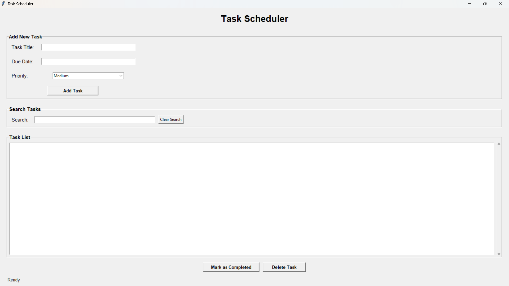
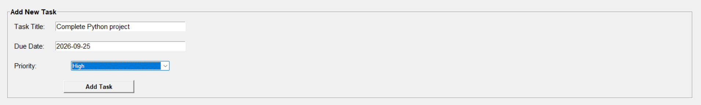
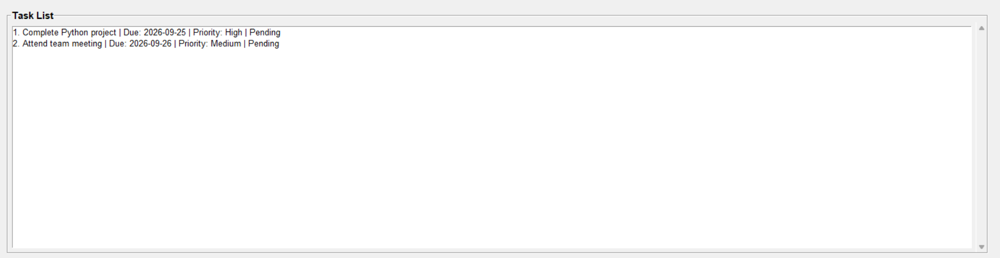
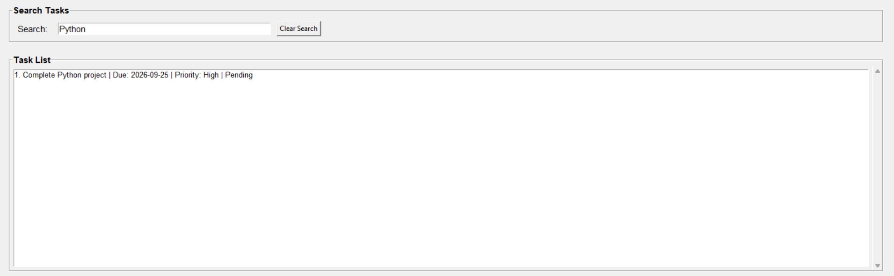

# 🚀 Day 68 - Task Scheduler

Welcome to **Day 68** of my **100 Days of Python Projects** challenge.

The goal of this challenge is to build and upload one Python project every day to improve programming skills, problem-solving ability, and practical knowledge.

For Day 68, I created a **Task Scheduler** using Python and Tkinter. The application allows users to add tasks, assign priorities, set due dates, search tasks, mark tasks as completed, and delete tasks.

The task information is stored locally in a JSON file so that tasks can be accessed again after restarting the application.

---

## 📌 Project Overview

The **Task Scheduler** is a desktop-based task management application designed to help users organize daily activities and track task completion.

Users can create tasks by entering:

* Task title
* Due date
* Priority

Each task also contains a completion status.

The application provides three priority levels:

* High
* Medium
* Low

Tasks can be searched using:

* Task title
* Due date
* Priority
* Completion status

The application uses a simple Tkinter interface and JSON-based data storage.

---

## ✨ Features

### ➕ Add New Task

Users can add a new task by entering:

* Task title
* Due date
* Priority

The task is saved in `tasks.json`.

### 📅 Due Date Validation

The application validates the due date using the following format:

```text
YYYY-MM-DD
```

Example:

```text
2026-09-25
```

If an invalid date is entered, a warning message is displayed.

### 🚦 Task Priorities

Every task can be assigned one of three priority levels:

```text
High
Medium
Low
```

The default priority is:

```text
Medium
```

### 📋 Task List

All tasks are displayed in a Listbox.

Each task shows:

* Task number
* Task title
* Due date
* Priority
* Completion status

Example:

```text
1. Complete Python project | Due: 2026-09-25 | Priority: High | Pending
```

### 🔍 Search Tasks

The search feature allows users to search tasks by:

* Title
* Due date
* Priority
* Status

For example, entering:

```text
High
```

displays tasks with high priority.

Entering:

```text
Completed
```

displays completed tasks.

### 🧹 Clear Search

The **Clear Search** button removes the search text and displays all tasks again.

### ✅ Mark Task as Completed

Users can select a task and click **Mark as Completed**.

The task's completion status changes from:

```text
Pending
```

to:

```text
Completed
```

### 🗑️ Delete Task

Users can select a task and delete it from the task list.

The task is removed from the JSON file as well.

### 💾 JSON Data Storage

Tasks are stored locally in:

```text
tasks.json
```

No external database is required.

### 🛡️ Error Handling

The application handles:

* Missing JSON files.
* Invalid JSON data.
* File loading errors.
* File saving errors.
* Empty task titles.
* Missing due dates.
* Invalid date formats.
* No selected task.

---

## 📸 Screenshots

### 1. Main Task Scheduler Window



### 2. Adding a Task with Priority



### 3. Task List with Different Priorities



### 4. Search Feature



---

## 🛠️ Technologies Used

### Python

Python is the main programming language used to develop the application.

It handles:

* Task management.
* Date validation.
* JSON file operations.
* Search functionality.
* Completion tracking.
* GUI event handling.

### Tkinter

Tkinter is used to create the desktop graphical user interface.

The application uses:

* Labels.
* Entry fields.
* Buttons.
* Frames.
* LabelFrames.
* Listboxes.
* Comboboxes.
* Scrollbars.
* Message boxes.

### JSON

JSON is used to store task information locally.

The task data is saved in a structured format that can be easily read and modified.

### datetime

The `datetime` module is used to validate due dates.

```python
datetime.strptime(due_date, "%Y-%m-%d")
```

### pathlib

The `pathlib` module is used to define the task file path.

```python
TASKS_FILE = Path("tasks.json")
```

---

## 📂 Project Structure

```text
DAY_68/
├── main68.py
├── tasks.json
├── requirements.txt
├── README.md
└── screenshots/
    ├── main-window.png
    ├── add-task-priority.png
    ├── priority-task-list.png
    └── search-tasks.png
```

> **Note:** If your Python file has a different name, replace `main68.py` with the actual filename.

---

## 📄 File Description

### `main68.py`

This is the main Python file containing the complete Task Scheduler application.

It includes:

* Task loading.
* Task saving.
* Task creation.
* Task searching.
* Task completion.
* Task deletion.
* Date validation.
* Tkinter interface.
* Error handling.

### `tasks.json`

This file stores all task information.

Example:

```json
[
    {
        "title": "Complete Python project",
        "due_date": "2026-09-25",
        "priority": "High",
        "completed": false
    },
    {
        "title": "Attend team meeting",
        "due_date": "2026-09-26",
        "priority": "Medium",
        "completed": true
    }
]
```

Each task contains:

* `title`
* `due_date`
* `priority`
* `completed`

### `requirements.txt`

This project uses Python's standard library, so no external packages are required.

The file can contain:

```text
# No external dependencies required
```

### `README.md`

This file contains the project documentation, features, setup instructions, screenshots, and learning outcomes.

### `screenshots/`

This folder contains screenshots of the application's main features.

---

## 📦 Requirements

The project uses only Python's built-in modules:

* `json`
* `tkinter`
* `datetime`
* `pathlib`

No external package installation is required.

If a `requirements.txt` file is included, it can contain:

```text
# No external dependencies required
```

---

## 🗃️ Sample Task Data

The initial `tasks.json` file contains two sample tasks.

### Task 1

```text
Title: Complete Python project
Due Date: 2026-09-25
Priority: High
Status: Pending
```

### Task 2

```text
Title: Attend team meeting
Due Date: 2026-09-26
Priority: Medium
Status: Completed
```

These sample tasks demonstrate different priorities and completion statuses.

---

## ▶️ How to Run

### 1. Install Python

Install Python on your computer.

Tkinter is generally included with standard Python installations on Windows.

### 2. Open the Project Folder

Open the Day 68 project folder in VS Code or a terminal.

### 3. Check the JSON File

Make sure the following file is present in the same folder as the Python file:

```text
tasks.json
```

If the file does not exist, the application starts with an empty task list.

### 4. Run the Application

Execute:

```bash
python main68.py
```

The Task Scheduler window will open.

> If your Python file has a different name, replace `main68.py` with that filename.

---

## 🔄 Application Workflow

The application follows this process:

```text
Start Application
       ↓
Load tasks.json
       ↓
Display Existing Tasks
       ↓
Enter Task Details
       ↓
Validate Task Information
       ↓
Save New Task
       ↓
Display Task List
       ↓
Search or Select a Task
       ↓
Complete or Delete Task
       ↓
Save Updated Tasks
```

---

## 💾 Loading Tasks

The application loads task information from the JSON file using:

```python
with open(file_path, "r", encoding="utf-8") as file:
    loaded_tasks = json.load(file)
```

If the file does not exist, an empty list is returned:

```python
return []
```

The application also adds default values for older task records:

```python
task.setdefault("priority", "Medium")
task.setdefault("completed", False)
```

This helps maintain compatibility with tasks that may not contain these fields.

---

## 💾 Saving Tasks

Tasks are saved using `json.dump()`:

```python
json.dump(tasks, file, indent=4)
```

The use of:

```text
indent=4
```

keeps the JSON file readable and properly formatted.

Whenever a task is added, completed, or deleted, the updated task list is saved.

---

## 📅 Date Validation

The application checks whether the entered due date follows the required format:

```python
datetime.strptime(due_date, "%Y-%m-%d")
```

The required format is:

```text
YYYY-MM-DD
```

Valid example:

```text
2026-09-25
```

Invalid examples:

```text
25-09-2026
09/25/2026
September 25
```

If the date is invalid, the application displays a warning message.

---

## 🚦 Priority System

The application defines the available priorities using a list:

```python
PRIORITIES = ["High", "Medium", "Low"]
```

The priority dropdown is configured as read-only, which prevents users from entering unsupported priority values.

The default priority is:

```text
Medium
```

---

## 🔍 Search Functionality

The search feature checks the entered text against a combined searchable string.

The searchable information includes:

```text
Task title
Due date
Priority
Status
```

For example, a task with the following information:

```text
Complete Python project
2026-09-25
High
Pending
```

can be found using any of these search terms:

```text
Python
2026-09-25
High
Pending
```

The search is case-insensitive.

The search function runs automatically whenever the search text changes.

---

## 🧾 Displaying Tasks

Tasks are displayed in a Tkinter Listbox.

Each task is formatted as:

```python
task_text = (
    f"{index + 1}. {task['title']} | "
    f"Due: {task['due_date']} | "
    f"Priority: {task['priority']} | "
    f"{status}"
)
```

The displayed status is either:

```text
Completed
```

or:

```text
Pending
```

A vertical scrollbar allows users to navigate through longer task lists.

---

## ✅ Completing a Task

When a task is selected and the **Mark as Completed** button is clicked, the application changes:

```python
selected_task["completed"] = True
```

The updated task list is then saved to `tasks.json`.

The search results are refreshed after the update.

---

## 🗑️ Deleting a Task

When a task is selected and the **Delete Task** button is clicked, the selected task is removed from the main task list:

```python
tasks.remove(selected_task)
```

The updated list is saved to the JSON file, and the task display is refreshed.

---

## 🧹 Clearing Search

The **Clear Search** button performs two actions:

1. Removes the search text.
2. Displays all tasks.

The status message is updated to:

```text
Showing all tasks.
```

---

## 🛡️ Error Handling

### Missing JSON File

If `tasks.json` does not exist, the application starts with an empty list.

### Invalid JSON

If the JSON file contains invalid data, an error message is displayed.

### File Errors

If the file cannot be read or saved, the application displays a file error message.

### Empty Task Information

The application prevents users from adding a task without:

* A task title.
* A due date.

### Invalid Date

The application displays a warning if the date does not follow the `YYYY-MM-DD` format.

### No Task Selected

If the user tries to complete or delete a task without selecting one, a warning is displayed.

---

## 📚 Libraries and Functions Practiced

### Python Standard Library

* `json`
* `tkinter`
* `datetime`
* `pathlib`

### JSON

* `json.load()`
* `json.dump()`

### File Handling

* `open()`
* `Path.exists()`
* UTF-8 encoding
* File error handling

### Date and Time

* `datetime.strptime()`

### Tkinter

* `tk.Tk()`
* `tk.Label()`
* `tk.LabelFrame()`
* `tk.Frame()`
* `tk.Entry()`
* `tk.Listbox()`
* `ttk.Combobox()`
* `ttk.Scrollbar()`
* `tk.Button()`
* `tk.StringVar()`
* `messagebox.showerror()`
* `messagebox.showwarning()`

---

## 🔍 Concepts Practiced

This project helped me practice:

* Functions.
* Lists.
* Dictionaries.
* Classes of data represented by dictionaries.
* JSON file handling.
* Data persistence.
* File reading and writing.
* Date validation.
* String formatting.
* String searching.
* Case-insensitive filtering.
* List comprehensions.
* Conditional statements.
* Exception handling.
* Tkinter GUI development.
* Entry fields.
* Dropdown menus.
* Listboxes.
* Scrollbars.
* Event-driven programming.
* Application state management.

---

## 🎯 Learning Outcome

By completing this project, I learned how to:

* Build a task management application using Tkinter.
* Store structured data in JSON format.
* Load and save tasks locally.
* Validate user-entered dates.
* Assign priorities to tasks.
* Search tasks using multiple fields.
* Update task completion status.
* Delete selected tasks.
* Refresh GUI data after changes.
* Handle missing files and invalid JSON.
* Manage filtered data while performing actions.

---

## 🚀 Future Improvements

The project can be improved further by adding:

* Edit task functionality.
* Task sorting by due date.
* Sorting by priority.
* Overdue task detection.
* Reminder notifications.
* Daily and weekly task views.
* Calendar integration.
* Recurring tasks.
* Task categories.
* Task descriptions.
* Subtasks.
* Progress percentage.
* Completed task history.
* Dark mode.
* Keyboard shortcuts.
* Export tasks to CSV.
* Import tasks from CSV.
* Database storage.
* User accounts.
* Cloud synchronization.
* Automatic backup.
* Desktop notifications.

---

## ⚠️ Limitations

The current version has some limitations:

* Tasks are stored in a local JSON file.
* There are no reminder notifications.
* The application does not automatically identify overdue tasks.
* Tasks cannot currently be edited.
* There is no calendar view.
* There are no recurring tasks.
* The application does not support multiple users.
* Task priorities are not visually color-coded.
* There is no database or cloud synchronization.
* The application is a desktop application rather than a web application.

---

## 🏆 Challenge

This project was created as part of my **100 Days of Python Projects** challenge. The purpose of this challenge is to improve my Python programming skills by building practical projects regularly and documenting the learning process on GitHub.

Built a **Task Scheduler** using Python, Tkinter, JSON, and the Python standard library.

This project improved my understanding of task management, local data persistence, date validation, search functionality, GUI event handling, task status tracking, and file-based application development.

---

## 👨‍💻 Author

**Abhijit Munghate**

Happy Coding! 🚀🐍📊