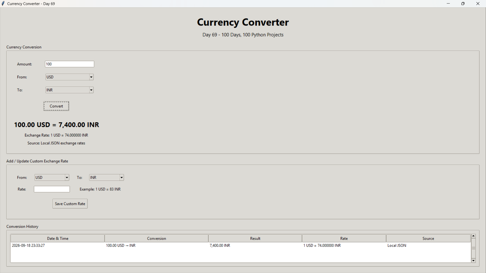
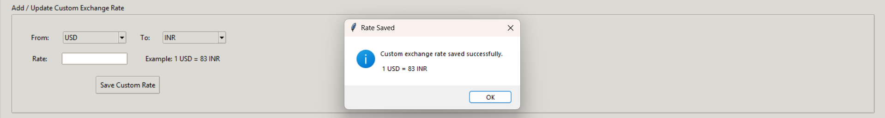
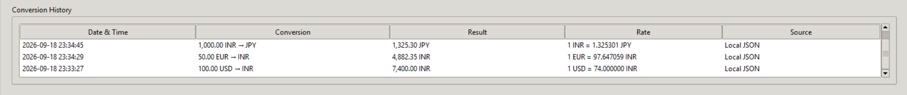

# 🚀 Day 69 - Currency Converter

Welcome to **Day 69** of my **100 Days, 100 Python Projects** challenge!

This project is a **Currency Converter GUI application** built using **Python and Tkinter**. The application allows users to convert amounts between different currencies using exchange rates stored locally in a JSON file.

Users can also add or update custom exchange rates and maintain a history of previous currency conversions.

The main purpose of this project is to gain practical experience with **GUI development, JSON file handling, decimal arithmetic, data persistence, input validation, and exception handling** in Python.

---

## 📌 Project Overview

Currency conversion is a common programming problem that involves applying exchange rates to monetary values.

This project provides a desktop graphical interface where users can:

* 💰 Enter an amount to convert
* 🌍 Select a source currency
* 💱 Select a target currency
* 🔄 Convert between supported currencies
* 📊 View the calculated exchange rate
* 💾 Store exchange rates in a JSON file
* ✏️ Add or update custom exchange rates
* 📜 View conversion history
* 🧹 Clear conversion history
* 💾 Automatically save conversion history
* ⚠️ Validate user input
* 🚨 Handle file and conversion errors

The application uses **USD-based exchange rates** stored in `exchange_rates.json`.

---

## ✨ Features

* 🖥️ Tkinter-based graphical user interface
* 💰 Amount input
* 🌍 Multiple currency support
* 🔄 Currency conversion
* 📊 Exchange rate display
* 💾 Local JSON exchange-rate storage
* ✏️ Add/update custom exchange rates
* 📜 Conversion history
* 🕒 Date and time for each conversion
* 📋 Treeview-based history table
* 🧹 Clear conversion history
* 🔃 Refresh history
* 🔢 Decimal-based calculations
* ⚠️ Input validation
* 🚨 Error handling using message boxes
* 💾 Automatic JSON data persistence
* 📌 Maximum history limit of 100 conversions
* 📁 No external API required

---

## 🖼️ Application Screenshots

## Screenshots

### 🖥️ Main Currency Converter



### 💱 Custom Exchange Rate



### 📜 Conversion History



---

## 🛠️ Technologies Used

* **Python 3**
* **Tkinter**
* **JSON**
* **Decimal**
* **Datetime**

### Python

Python is used to implement the application logic, currency conversion calculations, file handling, validation, and GUI functionality.

### Tkinter

Tkinter is Python's built-in GUI library and is used to create:

* Labels
* Text entry fields
* Buttons
* Comboboxes
* Label frames
* Treeview
* Scrollbars
* Message boxes

### JSON

JSON is used for storing exchange rates and conversion history.

The project uses two JSON files:

```text
exchange_rates.json
conversion_history.json
```

### Decimal

Python's `Decimal` class is used for currency calculations instead of relying only on floating-point arithmetic.

It is used for:

* Amount validation
* Exchange rate calculations
* Converted amount calculations
* Custom exchange rate validation

### Datetime

The `datetime` module records the date and time of every successful conversion.

---

## 📂 Project Structure

```text
DAY_69/
│
├── main69.py
├── exchange_rates.json
├── conversion_history.json
├── requirements.txt
├── README.md
│
└── screenshots/
    ├── main-currency-converter.png
    ├── custom-exchange-rate.png
    └── conversion-history.png
```

### File Description

| File / Folder             | Purpose                             |
| ------------------------- | ----------------------------------- |
| `main69.py`               | Main Currency Converter application |
| `exchange_rates.json`     | Stores local exchange rates         |
| `conversion_history.json` | Stores previous conversion records  |
| `requirements.txt`        | Lists project dependencies          |
| `README.md`               | Project documentation               |
| `screenshots/`            | Application screenshots             |

> **Note:** `conversion_history.json` is created automatically when a conversion is performed if it does not already exist.

---

## 💾 Exchange Rates

The application uses a local JSON file named:

```text
exchange_rates.json
```

The current exchange-rate data is:

```json
{
    "USD": 1.0,
    "EUR": 0.85,
    "GBP": 0.75,
    "INR": 83.0,
    "JPY": 110.0
}
```

These values represent exchange rates relative to USD.

For example:

```text
USD = 1.0
EUR = 0.85
GBP = 0.75
INR = 83.0
JPY = 110.0
```

The application can also add additional currencies through the custom exchange-rate feature.

---

## 📐 Currency Conversion Formula

The application uses USD-based exchange rates.

The conversion rate is calculated using:

```text
Exchange Rate = To Currency Rate / From Currency Rate
```

Then:

```text
Converted Amount = Amount × Exchange Rate
```

### Example

Suppose:

```text
USD = 1.0
INR = 83.0
```

To convert:

```text
10 USD → INR
```

The exchange rate is:

```text
83.0 / 1.0 = 83.0
```

Therefore:

```text
10 × 83.0 = 830 INR
```

The result is:

```text
10.00 USD = 830.00 INR
```

---

## 💰 Currency Conversion

The main conversion section allows the user to enter an amount and select two currencies.

For example:

```text
Amount: 100
From: USD
To: INR
```

After clicking **Convert**, the application displays:

```text
100.00 USD = 8300.00 INR
```

It also displays the calculated exchange rate:

```text
Exchange Rate: 1 USD = 83.000000 INR
```

The source is displayed as:

```text
Source: Local JSON exchange rates
```

---

## 🔢 Decimal-Based Calculations

The project uses:

```python
from decimal import Decimal, InvalidOperation
```

`Decimal` is used to process monetary values and exchange rates.

For example:

```python
amount = Decimal(self.amount_var.get().strip())
```

Exchange rates are also converted to `Decimal`:

```python
from_rate = Decimal(str(rates[from_currency]))
to_rate = Decimal(str(rates[to_currency]))
```

This helps provide more controlled decimal calculations for currency values.

---

## ✏️ Custom Exchange Rates

The application provides an **Add / Update Custom Exchange Rate** section.

Users can select:

```text
From Currency
To Currency
Rate
```

For example:

```text
From: USD
To: INR
Rate: 83
```

This represents:

```text
1 USD = 83 INR
```

After clicking **Save Custom Rate**, the application stores the updated rate in:

```text
exchange_rates.json
```

The currency lists are then refreshed automatically.

---

## 🔄 Updating an Exchange Rate

The custom-rate feature can also update an existing currency rate.

For example:

```text
Current:
1 USD = 83 INR
```

The user can enter:

```text
From: USD
To: INR
Rate: 85
```

The application updates the stored INR base rate accordingly.

The JSON file is then saved with the new exchange-rate information.

---

## 📜 Conversion History

Every successful conversion is stored in:

```text
conversion_history.json
```

Each history record contains:

```text
Date & Time
Conversion
Result
Rate
Source
```

For example:

```json
{
    "datetime": "2026-09-18 20:30:15",
    "conversion": "100.00 USD → INR",
    "result": "8300.00 INR",
    "rate": "1 USD = 83.000000 INR",
    "source": "Local JSON"
}
```

The newest conversion is inserted at the beginning of the history list.

---

## 📊 Conversion History Table

The GUI displays conversion records using a Tkinter `Treeview`.

The table contains five columns:

| Column      | Purpose                             |
| ----------- | ----------------------------------- |
| Date & Time | Time when conversion was performed  |
| Conversion  | Original amount and target currency |
| Result      | Converted amount                    |
| Rate        | Calculated exchange rate            |
| Source      | Source of exchange rate             |

The table also includes a vertical scrollbar for viewing multiple records.

---

## 🔢 History Limit

To prevent the history file from growing indefinitely, the application keeps only the latest **100 conversions**.

This is implemented using:

```python
self.history = self.history[:100]
```

When a new conversion is performed:

1. The new record is added.
2. It is inserted at the beginning.
3. Older records beyond the 100-record limit are removed.
4. The updated history is saved.

---

## 🔃 Refresh History

The **Refresh History** button reloads the history data from:

```text
conversion_history.json
```

This allows the displayed records to be synchronized with the saved file.

---

## 🧹 Clear History

The **Clear History** button removes all saved conversion history.

Before deleting the records, the application asks the user for confirmation:

```text
Are you sure you want to delete all conversion history?
```

If the user confirms:

```text
conversion_history.json
```

is updated with an empty list.

---

## 📁 JSON File Handling

The application uses helper functions for JSON data management.

### `load_json()`

Loads information from a JSON file.

```python
def load_json(file_path, default_value):
```

It handles:

* Missing files
* Invalid JSON
* Operating-system file errors

If the file cannot be loaded, a default value is returned.

---

### `save_json()`

Saves Python data into a JSON file.

```python
def save_json(file_path, data):
```

The data is written using:

```python
json.dump(data, file, indent=4)
```

This produces formatted and readable JSON files.

---

## 🌍 Loading Exchange Rates

The application uses:

```python
load_exchange_rates()
```

to load the exchange-rate information.

If the JSON file does not exist, the application uses the predefined default rates:

```python
DEFAULT_RATES
```

This allows the application to start even when the exchange-rate file is missing.

---

## 📊 Supported Currencies

The initial exchange-rate file contains:

| Currency Code | Currency      |
| ------------- | ------------- |
| USD           | US Dollar     |
| EUR           | Euro          |
| GBP           | British Pound |
| INR           | Indian Rupee  |
| JPY           | Japanese Yen  |

Additional currencies can be added or updated through the custom exchange-rate feature.

---

## ⚠️ Input Validation

The application validates user input before performing calculations.

### Invalid Amount

If the user enters something that is not a valid number:

```text
abc
```

the application displays:

```text
Please enter a valid numeric amount.
```

### Zero or Negative Amount

Amounts must be greater than zero.

For example:

```text
0
```

or:

```text
-50
```

will be rejected.

---

## ⚠️ Exchange Rate Validation

Custom exchange rates must also be greater than zero.

For example:

```text
Rate: -5
```

is rejected.

The application displays:

```text
Exchange rate must be greater than zero.
```

---

## 🚨 Error Handling

The application uses `try-except` blocks to handle possible errors.

Examples include:

* Invalid numeric input
* Missing exchange rates
* Invalid JSON files
* File access errors
* Invalid custom rates
* Invalid currency selections
* Invalid exchange-rate values

Tkinter message boxes are used to communicate errors to the user.

---

## 🖥️ GUI Components Used

The project uses several Tkinter and ttk components:

| Component    | Purpose                                         |
| ------------ | ----------------------------------------------- |
| `Tk()`       | Creates the main application window             |
| `Frame`      | Organizes interface sections                    |
| `Label`      | Displays text                                   |
| `Entry`      | Accepts amount and exchange-rate input          |
| `Button`     | Performs application actions                    |
| `Combobox`   | Selects currencies                              |
| `LabelFrame` | Groups related controls                         |
| `Treeview`   | Displays conversion history                     |
| `Scrollbar`  | Scrolls through history                         |
| `messagebox` | Displays errors, information, and confirmations |
| `StringVar`  | Stores GUI variable values                      |
| `Style`      | Applies the Tkinter `clam` theme                |

---

## 🧩 Important Functions

### `load_json()`

Loads JSON data from a file.

### `save_json()`

Writes data to a JSON file.

### `load_exchange_rates()`

Loads exchange-rate information.

### `load_history()`

Loads saved conversion history.

### `save_history()`

Saves conversion history.

### `convert_using_rates()`

Performs the currency conversion calculation.

### `load_currencies()`

Loads available currencies into the GUI comboboxes.

### `convert()`

Validates the amount, performs conversion, displays the result, and saves the conversion to history.

### `add_custom_rate()`

Adds or updates a custom exchange rate.

### `display_history()`

Displays saved conversion records in the Treeview.

### `clear_history()`

Deletes all saved conversion records after user confirmation.

---

## 🔄 Application Workflow

The basic workflow of the application is:

```text
Start Application
       ↓
Load Exchange Rates
       ↓
Load Conversion History
       ↓
Display Currency Converter
       ↓
Enter Amount
       ↓
Select From Currency
       ↓
Select To Currency
       ↓
Click Convert
       ↓
Validate Input
       ↓
Calculate Exchange Rate
       ↓
Calculate Converted Amount
       ↓
Display Result
       ↓
Save Conversion History
       ↓
Update History Table
```

For custom exchange rates:

```text
Select From Currency
       ↓
Select To Currency
       ↓
Enter Custom Rate
       ↓
Validate Rate
       ↓
Calculate New Base Rate
       ↓
Save to exchange_rates.json
       ↓
Refresh Currency Lists
```

---

## 📦 requirements.txt

This project uses only Python's standard library.

Therefore, no external packages are required.

A `requirements.txt` file can contain:

```text
# No external dependencies required
```

Tkinter is normally included with standard Python installations on Windows.

---

## ▶️ How to Run

### 1. Make sure Python is installed

Check your Python version:

```bash
python --version
```

### 2. Open the project folder

Open a terminal inside the `DAY_69` project folder.

### 3. Install dependencies

No external packages are required for this project.

If a `requirements.txt` file is present:

```bash
pip install -r requirements.txt
```

### 4. Run the application

```bash
python main69.py
```

The **Currency Converter** GUI will open automatically.

---

## 🧪 Example Conversion

Using:

```text
Amount: 100
From: USD
To: INR
```

and:

```text
USD = 1.0
INR = 83.0
```

The application calculates:

```text
Exchange Rate = 83.0 / 1.0
              = 83.0
```

Then:

```text
100 × 83.0 = 8300
```

The displayed result is:

```text
100.00 USD = 8300.00 INR
```

---

## 🧠 Conversion Calculation Logic

The main conversion function is:

```python
def convert_using_rates(amount, from_currency, to_currency, rates):
```

First, it verifies that both currencies exist:

```python
if from_currency not in rates:
    raise ValueError(...)
```

Then it retrieves their rates:

```python
from_rate = Decimal(str(rates[from_currency]))
to_rate = Decimal(str(rates[to_currency]))
```

The conversion rate is calculated:

```python
exchange_rate = to_rate / from_rate
```

Finally, the converted amount is calculated:

```python
converted_amount = amount * exchange_rate
```

Both values are returned to the application.

---

## 📚 Concepts Practiced

* Python Programming
* Tkinter GUI Development
* Object-Oriented Programming
* JSON File Handling
* Data Persistence
* Currency Conversion
* Decimal Arithmetic
* Input Validation
* Exception Handling
* File Handling
* Date and Time Handling
* Dictionaries
* Lists
* String Formatting
* GUI Event Handling
* Comboboxes
* Treeview
* Scrollbars
* Message Boxes
* Local Data Storage
* User Confirmation Dialogs

---

## 🎯 Learning Outcome

This project helped me understand:

* How to build a desktop GUI using Tkinter
* How to create reusable JSON file-handling functions
* How to store application data locally
* How to perform currency conversion using exchange rates
* How to use `Decimal` for numerical calculations
* How to validate user input
* How to handle invalid JSON and file errors
* How to create dropdown menus using Combobox
* How to display structured data using Treeview
* How to implement conversion history
* How to add and update custom exchange rates
* How to save user-generated data permanently
* How to use confirmation dialogs
* How to organize a Python application using classes and functions
* How to build a practical application without relying on an external API

---

## 🔮 Future Improvements

Possible enhancements for future versions:

* 🌐 Add live exchange rates using a currency API
* 🔄 Automatically update exchange rates
* 🌍 Add more world currencies
* 🔎 Add currency search
* 📊 Add conversion statistics
* 📈 Display exchange-rate charts
* 📅 Filter conversion history by date
* 📤 Export conversion history to CSV
* 📄 Export conversion history to PDF
* 🗑️ Delete individual history records
* ⭐ Add favorite currency pairs
* 🔁 Add a swap currencies button
* 🌙 Add Dark Mode
* 🎨 Improve the overall GUI design
* 💱 Add cryptocurrency conversion
* 📱 Create a responsive/web-based version
* 🔐 Add user-specific conversion histories
* 🌐 Connect to a real-time exchange-rate service

---

## ⚠️ Current Limitations

The current version uses **locally stored exchange rates** rather than live market rates.

Therefore:

* Exchange rates do not update automatically.
* Rates depend on the values stored in `exchange_rates.json`.
* Internet access is not required for conversion.
* The application does not provide real-time financial or market exchange rates.

The project is intended primarily as a **Python learning and GUI development project**.

---

## 📅 Challenge

This project is part of my **100 Days, 100 Python Projects** challenge, where I build one Python project every day to improve my Python programming skills, strengthen my problem-solving abilities, learn new technologies, and maintain consistency through daily coding.

**Day 69** focuses on **GUI development, JSON data persistence, currency conversion, decimal arithmetic, and practical file handling** by creating a functional Currency Converter application using Python and Tkinter.

---

## 👨‍💻 Author

**Abhijit Munghate**

Happy Coding! 🚀🐍💱
