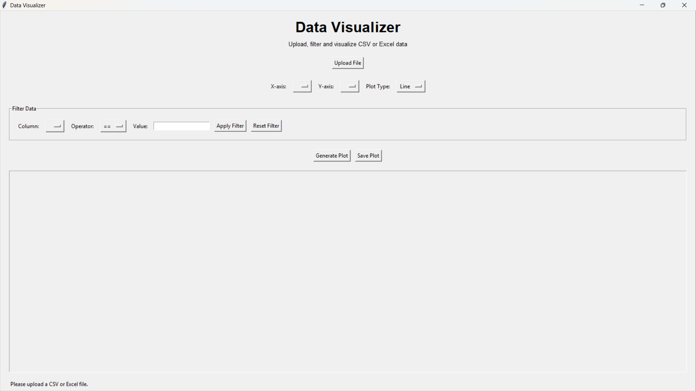
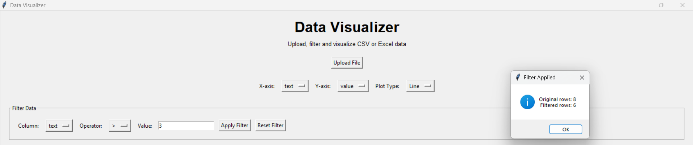
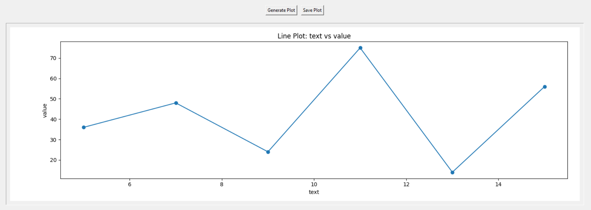
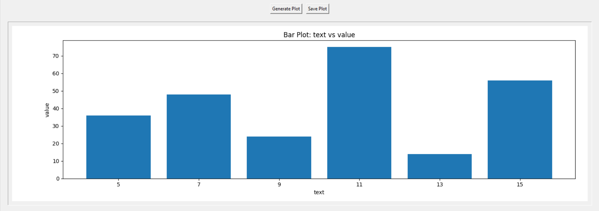

# 🚀 Day 70 - Data Visualizer App

Welcome to **Day 70** of my **100 Days, 100 Python Projects** challenge!

This project is a **Data Visualizer GUI application** built using **Python, Tkinter, Pandas, and Matplotlib**. The application allows users to upload CSV or Excel datasets, filter the data, select columns, generate different types of plots, and save the generated visualizations.

The main purpose of this project is to gain practical experience with **Data Processing, Data Visualization, Pandas, Matplotlib, and GUI development**.

---

## 📌 Project Overview

Data visualization helps transform raw datasets into graphical representations that make patterns, trends, and relationships easier to understand.

This project provides an interactive GUI where users can:

* 📂 Upload CSV files
* 📊 Upload Excel files
* 🔀 Select X-axis and Y-axis columns
* 🔍 Filter dataset values
* ⚙️ Apply different filtering operators
* 📈 Generate Line plots
* 📊 Generate Bar charts
* 🔵 Generate Scatter plots
* 💾 Save generated plots
* 🔄 Reset applied filters
* ⚠️ Handle invalid input and errors

---

## ✨ Features

* 🖥️ Interactive Tkinter GUI
* 📂 CSV file support
* 📊 Excel `.xlsx` file support
* 🔀 Dynamic X/Y column selection
* 🔍 Data filtering
* `==` Equal to
* `!=` Not equal to
* `>` Greater than
* `<` Less than
* `>=` Greater than or equal to
* `<=` Less than or equal to
* `contains` Text search
* 📈 Line Plot
* 📊 Bar Plot
* 🔵 Scatter Plot
* 💾 Save plots as PNG
* 🖼️ Save plots as JPG/JPEG
* 🔄 Reset filters
* 📊 Pandas-based data processing
* 📉 Matplotlib visualization
* ⚠️ Input validation
* 🚨 Error handling using message boxes
* 📌 Status messages for application operations
* 🖥️ Matplotlib graph embedded directly inside the Tkinter window

---

## 🖼️ Application Screenshots

### 🖥️ Main Interface



### 🔍 Data Loading and Filtering



### 📈 Generated Visualization



### 📊 Plot Types and Save Feature



---

## 🛠️ Technologies Used

* **Python 3**
* **Tkinter**
* **Pandas**
* **Matplotlib**
* **OpenPyXL**

### Python

Python is used to implement the application logic, file handling, data processing, filtering, and GUI functionality.

### Tkinter

Tkinter is Python's built-in GUI framework and is used to create:

* Buttons
* Labels
* Input fields
* Dropdown menus
* Frames
* File dialogs
* Message boxes
* Status messages

### Pandas

Pandas is used for loading, processing, filtering, and managing tabular data.

The project uses Pandas to:

* Read CSV files
* Read Excel files
* Access dataframe columns
* Filter rows
* Check data types
* Validate numerical columns

### Matplotlib

Matplotlib is used to create and display visualizations.

The application currently supports:

* Line plots
* Bar charts
* Scatter plots

### OpenPyXL

OpenPyXL provides support for reading Excel `.xlsx` files through Pandas.

---

## 📂 Project Structure

```text
DAY_70/
│
├── main70.py
├── sample_data.csv
├── requirements.txt
├── README.md
│
└── screenshots/
    ├── main-interface.png
    ├── data-filtering.png
    ├── generated-plot.png
    └── plot-types-save.png
```

### File Description

| File / Folder      | Purpose                          |
| ------------------ | -------------------------------- |
| `main70.py`        | Main Data Visualizer application |
| `sample_data.csv`  | Sample dataset for testing       |
| `requirements.txt` | Python dependencies              |
| `README.md`        | Project documentation            |
| `screenshots/`     | Application screenshots          |

---

## 📦 requirements.txt

The project requires the following Python libraries:

```text
pandas
matplotlib
openpyxl
```

Install all dependencies using:

```bash
pip install -r requirements.txt
```

---

## ▶️ How to Run

### 1. Make sure Python is installed

Check your Python version:

```bash
python --version
```

### 2. Open the project folder

Open a terminal inside the **Day 70** project folder.

### 3. Install the dependencies

```bash
pip install -r requirements.txt
```

### 4. Run the application

```bash
python main70.py
```

The **Data Visualizer** GUI will open automatically.

---

## 📂 Loading Data

The application supports two file formats:

### CSV

```text
sample_data.csv
```

### Excel

```text
sample_data.xlsx
```

Click the **Upload File** button to select a dataset.

After successfully loading the file, the application displays the number of rows and columns.

For example:

```text
Loaded 8 rows and 2 columns.
```

The available dataframe columns are then automatically added to the X-axis, Y-axis, and filter-column menus.

---

## 📄 Sample Dataset

The project includes the following sample CSV dataset:

```csv
text,value
1,20
3,14
5,36
7,48
9,24
11,75
13,14
15,56
```

The dataset contains two columns:

* `text`
* `value`

These columns can be selected for visualization and filtering.

For example:

```text
X-axis → text
Y-axis → value
```

---

## 🔀 Selecting X and Y Columns

After uploading a dataset, the application automatically updates the column selection menus.

Users can select:

```text
X-axis: text
Y-axis: value
```

The selected columns are then passed to the plotting function.

The application checks whether both selected columns exist before generating the graph.

---

## 🔍 Data Filtering

The application provides a filtering section that allows users to filter the dataset before creating a visualization.

Users can select:

* Column
* Operator
* Filter value

For example:

```text
Column: value
Operator: >
Value: 30
```

This filters the dataset to show only rows where the `value` column is greater than `30`.

---

## ⚙️ Supported Filter Operators

The application supports different operators depending on the column type.

### Numeric Filtering

For numerical columns, the following operators are supported:

```text
==
!=
>
<
>=
<=
```

For example:

```text
value > 30
```

will return only rows where the value is greater than 30.

### Text Filtering

For text-based columns, the application supports:

```text
==
!=
contains
```

For example:

```text
Column: name
Operator: contains
Value: python
```

will find rows containing the word `python`.

The text search is case-insensitive.

---

## 🔄 Reset Filter

The **Reset Filter** button restores the original dataset.

It:

* Removes the current filtering
* Clears the filter value
* Clears the selected filter column
* Resets the operator
* Restores all original rows

For example:

```text
Original rows: 8
Filtered rows: 4
```

After resetting:

```text
Showing all 8 rows.
```

---

## 📊 Supported Plot Types

The application currently supports three visualization types.

### 📈 1. Line Plot

Line plots are useful for showing trends and changes across data points.

The application uses:

```python
ax.plot()
```

Example:

```text
X → 1  3  5  7  9
Y → 20 14 36 48 24
```

---

### 📊 2. Bar Chart

Bar charts are useful for comparing individual values.

The application uses:

```python
ax.bar()
```

The X-axis values are converted to strings so that categorical values can also be displayed.

---

### 🔵 3. Scatter Plot

Scatter plots are useful for examining relationships between two numerical variables.

The application uses:

```python
ax.scatter()
```

For a scatter plot, the application checks that the X-axis column contains numerical data.

If the selected X-axis column is not numeric, an error message is displayed.

---

## 📈 Generating a Visualization

To generate a graph:

1. Upload a CSV or Excel file.
2. Select the X-axis column.
3. Select the Y-axis column.
4. Select a plot type.
5. Click **Generate Plot**.

The generated Matplotlib visualization is embedded directly into the Tkinter application.

The graph automatically receives:

* A title
* X-axis label
* Y-axis label

For example:

```text
Line Plot: text vs value
```

---

## 💾 Saving Plots

The **Save Plot** button allows users to save the currently displayed visualization.

Supported formats:

```text
PNG
JPG
JPEG
```

The application uses:

```python
current_figure.savefig()
```

The graph is saved at:

```text
300 DPI
```

which provides good quality for saved visualizations.

---

## ⚠️ Input Validation and Error Handling

The application includes validation to prevent invalid operations.

Examples include:

### No File Uploaded

If the user attempts to generate a plot before uploading data:

```text
Please upload a data file first.
```

### Missing Columns

If the X-axis or Y-axis column is not selected:

```text
Please select both X-axis and Y-axis columns.
```

### Missing Plot Type

If no plot type is selected:

```text
Please select a plot type.
```

### Invalid Y-axis Data

The Y-axis column must contain numerical data.

Otherwise, the application displays an appropriate error message.

### Empty Filter

The application also checks that a filter value has been entered before applying a filter.

---

## 🧩 Important Functions

### `load_file()`

Loads CSV or Excel files using Pandas.

```python
pd.read_csv()
pd.read_excel()
```

---

### `update_dropdowns()`

Dynamically updates the column selection menus after a dataset is loaded.

---

### `filter_data()`

Applies the selected filter condition to the dataframe.

It supports both numerical and text-based filtering.

---

### `reset_filter()`

Restores the original dataframe after filtering.

---

### `plot_data()`

Generates the selected visualization using Matplotlib.

It handles:

```text
Line
Bar
Scatter
```

---

### `handle_plot()`

Validates the user's selections and calls the plotting function.

---

### `save_plot()`

Saves the currently generated Matplotlib figure to an image file.

---

## 🖥️ GUI Components Used

| Component           | Purpose                             |
| ------------------- | ----------------------------------- |
| `Tk()`              | Creates the main application window |
| `Label`             | Displays text and information       |
| `Button`            | Performs application actions        |
| `Entry`             | Accepts filter values               |
| `OptionMenu`        | Selects columns and plot types      |
| `Frame`             | Organizes GUI sections              |
| `LabelFrame`        | Creates grouped sections            |
| `filedialog`        | Selects input and output files      |
| `messagebox`        | Displays warnings and errors        |
| `Figure`            | Creates Matplotlib figures          |
| `FigureCanvasTkAgg` | Embeds Matplotlib inside Tkinter    |

---

## 📚 Libraries and Functions Practiced

### Pandas

| Function / Feature   | Purpose                          |
| -------------------- | -------------------------------- |
| `pd.read_csv()`      | Loads CSV datasets               |
| `pd.read_excel()`    | Loads Excel datasets             |
| `df.copy()`          | Creates a dataframe copy         |
| `df.columns`         | Retrieves column names           |
| `df[...]`            | Selects dataframe columns/rows   |
| `astype()`           | Converts data to a specific type |
| `is_numeric_dtype()` | Checks whether data is numerical |
| `str.contains()`     | Searches text values             |

### Matplotlib

| Function         | Purpose                     |
| ---------------- | --------------------------- |
| `Figure()`       | Creates a Matplotlib figure |
| `add_subplot()`  | Creates plotting axes       |
| `plot()`         | Creates line plots          |
| `bar()`          | Creates bar charts          |
| `scatter()`      | Creates scatter plots       |
| `set_title()`    | Sets graph title            |
| `set_xlabel()`   | Sets X-axis label           |
| `set_ylabel()`   | Sets Y-axis label           |
| `tight_layout()` | Adjusts graph layout        |
| `savefig()`      | Saves the generated graph   |

---

## 🧠 Data Visualization Workflow

The application follows a simple data visualization workflow:

```text
Upload Dataset
      ↓
Load Data with Pandas
      ↓
Select Columns
      ↓
Filter Data
      ↓
Select Plot Type
      ↓
Generate Visualization
      ↓
Display Using Matplotlib
      ↓
Save Plot
```

This workflow demonstrates how raw data can be transformed into a useful visual representation.

---

## 📊 Example Workflow

Using the included `sample_data.csv`:

### Step 1 — Upload

```text
sample_data.csv
```

### Step 2 — Select Columns

```text
X-axis → text
Y-axis → value
```

### Step 3 — Select Plot

```text
Line
```

### Step 4 — Generate

The application generates:

```text
Line Plot: text vs value
```

### Step 5 — Save

The generated graph can be saved as:

```text
visualization.png
```

---

## 🔄 Concepts Practiced

This project helped practice:

* Python Programming
* Tkinter GUI Development
* Pandas
* Matplotlib
* Data Loading
* CSV Processing
* Excel Processing
* Data Filtering
* Data Type Checking
* Data Visualization
* Line Plots
* Bar Charts
* Scatter Plots
* File Handling
* Exception Handling
* Input Validation
* GUI Event Handling
* Dataframe Operations
* Graph Export

---

## 🎯 Learning Outcome

This project helped me understand:

* How to load CSV and Excel datasets using Pandas
* How to work with Pandas DataFrames
* How to dynamically retrieve dataframe columns
* How to filter datasets using different conditions
* How to distinguish between numerical and text data
* How to create different visualizations using Matplotlib
* How to embed Matplotlib figures inside Tkinter
* How to validate user input
* How to handle errors using message boxes
* How to save generated visualizations
* How data filtering affects visualization
* How Pandas and Matplotlib can be combined in a GUI application
* How data processing fits into a basic Data Science workflow

---

## 🔮 Future Improvements

Possible enhancements for future versions:

* 📊 Add more graph types such as Pie, Histogram, and Area charts
* 📋 Add a preview table for uploaded datasets
* 📈 Add multiple series to the same graph
* 🎨 Add graph color customization
* 📝 Allow users to customize graph titles and axis labels
* 🔍 Add advanced filtering with multiple conditions
* 📊 Add basic statistical analysis
* 📉 Add mean, median, minimum, and maximum calculations
* 📈 Add correlation analysis
* 🔄 Add sorting functionality
* 📂 Support additional file formats
* 🔎 Add search functionality
* 💾 Add visualization history
* 🌙 Add Dark Mode
* 📊 Add automatic chart recommendations
* 🖱️ Add Matplotlib zoom and pan controls
* 📑 Add dataset summary information

---

## 📅 Challenge

This project is part of my **100 Days, 100 Python Projects** challenge, where I build one Python project every day to improve my Python programming skills, strengthen my problem-solving abilities, learn new technologies, and maintain consistency through daily coding.

**Day 70** focuses on **Data Visualization and Data Processing**, combining **Pandas for data handling**, **Matplotlib for visualization**, and **Tkinter for GUI development** to create a practical Data Visualizer application.

---

## 👨‍💻 Author

**Abhijit Munghate**

Happy Coding! 🚀🐍📊
