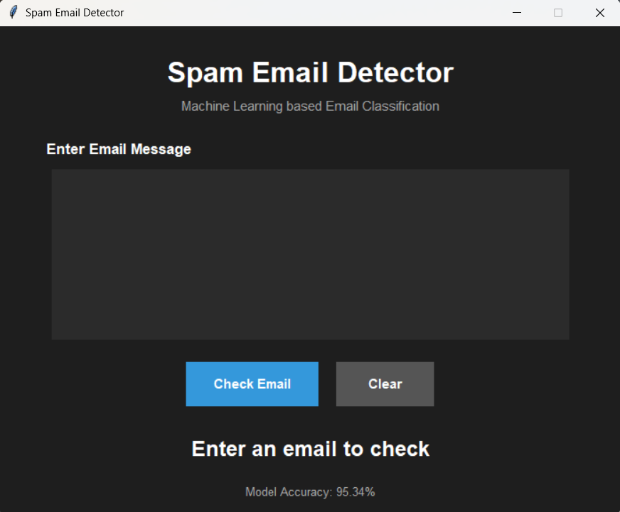
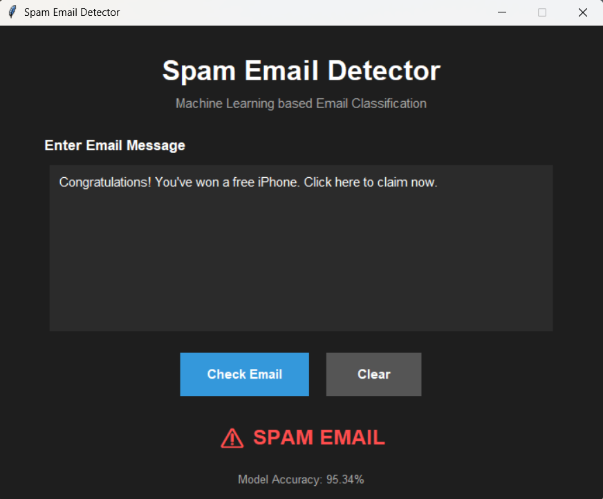
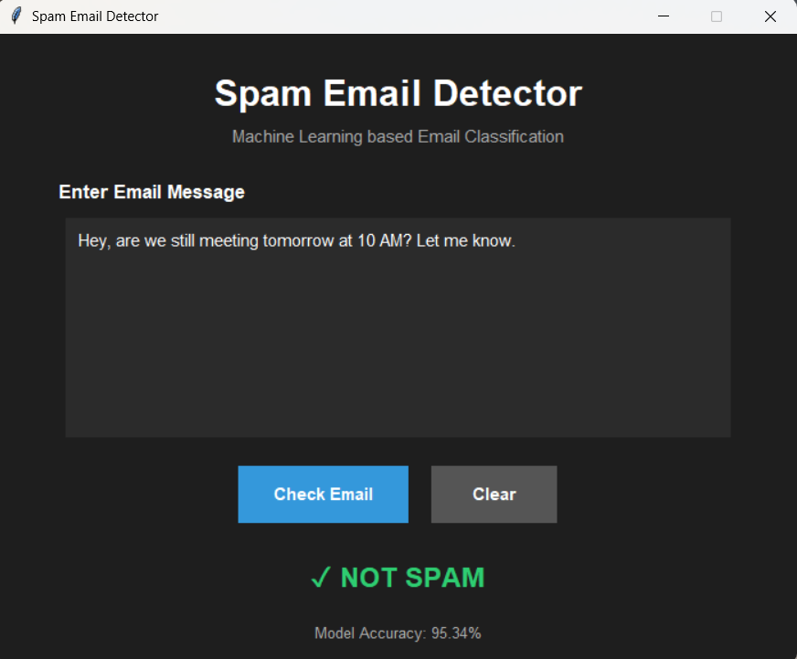

# 🚀 Day 71 - Spam Email Detector

Welcome to **Day 71** of my **100 Days, 100 Python Projects** challenge!

This project is a **Spam Email Detector** built using **Python, Tkinter, Pandas, NLTK, and Scikit-learn**. The application uses **Natural Language Processing (NLP)** and **Machine Learning** to classify email messages as either **SPAM** or **NOT SPAM**.

The project uses the **SMS Spam Collection dataset**, containing **5,575 messages**, and trains a **Logistic Regression** classification model using **TF-IDF (Term Frequency-Inverse Document Frequency)** text features.

The trained model is integrated into a simple **Tkinter GUI**, where users can enter an email message and instantly check whether it is likely to be spam.

---

## 📌 Project Overview

Spam messages are unwanted messages that may contain advertisements, fraudulent offers, suspicious links, or other unwanted content.

Machine Learning can be used to automatically identify spam messages by learning patterns from previously classified messages.

This project demonstrates a complete basic **NLP and Machine Learning workflow**:

**Dataset → Text Preprocessing → TF-IDF Vectorization → Model Training → Prediction → GUI Output**

The application allows users to:

* ✉️ Enter an email or message
* 🤖 Classify the message using Machine Learning
* ⚠️ Detect spam messages
* ✅ Detect non-spam messages
* 📊 Display the trained model's accuracy
* 🧹 Clear the entered message
* 🖥️ Use the detector through a graphical interface

---

## ✨ Features

* 🖥️ Interactive Tkinter GUI
* ✉️ Email/message input field
* 🤖 Machine Learning based classification
* 🧠 Natural Language Processing
* 🧹 Text preprocessing
* 🔤 Stopword removal
* 🌱 Porter stemming
* 📊 TF-IDF feature extraction
* 📈 Logistic Regression classification
* 📊 Model accuracy calculation
* ⚠️ Spam detection
* ✅ Not Spam detection
* 🧹 Clear input functionality
* 🚨 Empty input validation
* 📋 Classification report
* 🗂️ CSV dataset support
* 🎨 Dark-themed GUI
* ⚡ Instant prediction after entering a message
* 📌 Model accuracy displayed in the application

---

## 🖼️ Application Screenshots

## Screenshots

### 🖥️ Main Application



### ⚠️ Spam Detection



### ✅ Not Spam Detection



---

## 🛠️ Technologies Used

* **Python 3**
* **Pandas**
* **NLTK**
* **Scikit-learn**
* **Tkinter**
* **Regular Expressions**

### Python

Python is used to develop the complete application, including:

* Data processing
* Text preprocessing
* Machine Learning
* Prediction
* GUI development

### Pandas

Pandas is used to load and process the spam dataset.

The project uses:

```python
pd.read_csv()
```

to read the `spam.csv` dataset.

### NLTK

NLTK is used for Natural Language Processing tasks.

The project uses NLTK for:

* English stopwords
* Text preprocessing
* Word filtering

The project also uses the **Porter Stemmer** to reduce words to their root form.

### Scikit-learn

Scikit-learn is used for the Machine Learning pipeline.

The project uses:

* `TfidfVectorizer`
* `train_test_split`
* `LogisticRegression`
* `accuracy_score`
* `classification_report`

### Tkinter

Tkinter is used to create the graphical user interface.

It provides:

* Text input
* Buttons
* Labels
* Message boxes
* Application window

---

## 📂 Project Structure

```text
DAY_71/

│
├── main71.py
├── spam.csv
├── requirements.txt
├── README.md
│
└── screenshots/
    ├── spam-detector-main.png
    ├── spam-detection.png
    └── not-spam-detection.png
```

### File Description

| File / Folder      | Purpose                                       |
| ------------------ | --------------------------------------------- |
| `main71.py`        | Main Python application                       |
| `spam.csv`         | Dataset containing spam and non-spam messages |
| `requirements.txt` | Python dependencies                           |
| `README.md`        | Project documentation                         |
| `screenshots/`     | Application screenshots                       |

---

## 📊 Dataset

The project uses the **SMS Spam Collection dataset** stored in:

```text
spam.csv
```

The dataset contains approximately **5,575 messages**.

The original dataset contains the following important columns:

```text
v1
v2
```

Where:

| Column | Description                              |
| ------ | ---------------------------------------- |
| `v1`   | Message classification (`ham` or `spam`) |
| `v2`   | Actual message text                      |

The project renames these columns to:

```text
label
message
```

The labels are then converted into numerical values:

```text
ham  → 0
spam → 1
```

### Example Dataset

```text
label    message

ham      Go until jurong point, crazy..
ham      Ok lar... Joking wif u oni...
spam     Free entry to win FA Cup final tickets...
ham      U dun say so early hor...
ham      Nah I don't think he goes to usf...
```

---

## 🔄 Machine Learning Workflow

The Spam Email Detector follows these major steps:

```text
Load Dataset
     ↓
Clean Dataset
     ↓
Convert Labels
     ↓
Text Preprocessing
     ↓
Stopword Removal
     ↓
Stemming
     ↓
TF-IDF Vectorization
     ↓
Train-Test Split
     ↓
Logistic Regression
     ↓
Model Evaluation
     ↓
User Input
     ↓
Prediction
     ↓
SPAM / NOT SPAM
```

---

## 🧹 Text Preprocessing

Before training the Machine Learning model, the text messages are cleaned and processed.

The project uses the `preprocess_text()` function.

### Step 1 — Remove Special Characters

Regular expressions are used to remove non-word characters.

```python
text = re.sub(r"\W", " ", text)
```

This removes unnecessary symbols and punctuation.

### Step 2 — Convert Text to Lowercase

```python
text = text.lower()
```

Converting all text to lowercase ensures that words such as:

```text
FREE
Free
free
```

are treated consistently.

### Step 3 — Split Text into Words

```python
words = text.split()
```

The message is converted into individual words.

### Step 4 — Remove Stopwords

Common English words are removed using NLTK stopwords.

Examples include words such as:

```text
the
is
a
an
and
```

### Step 5 — Stemming

The project uses the Porter Stemmer:

```python
stemmer = PorterStemmer()
```

Stemming reduces words to simpler root forms.

For example:

```text
playing → play
played  → play
plays   → play
```

The final cleaned message is then used for Machine Learning.

---

## 📊 TF-IDF Vectorization

Machine Learning models cannot directly understand raw text.

Therefore, the cleaned messages are converted into numerical features using **TF-IDF**.

The project uses:

```python
vectorizer = TfidfVectorizer(max_features=3000)
```

TF-IDF stands for:

**Term Frequency-Inverse Document Frequency**

It assigns numerical importance to words based on how frequently they occur in messages and how common they are across the dataset.

The transformed data is stored in:

```python
X = vectorizer.fit_transform(df["cleaned_message"])
```

The model target values are stored in:

```python
y = df["label"]
```

---

## ✂️ Train-Test Split

The dataset is divided into training and testing sets.

The project uses:

```python
X_train, X_test, y_train, y_test = train_test_split(
    X,
    y,
    test_size=0.2,
    random_state=42
)
```

The dataset is divided into:

* **80% Training Data**
* **20% Testing Data**

The training data is used to teach the model, while the testing data is used to evaluate its performance on unseen messages.

---

## 🤖 Machine Learning Model

The project uses **Logistic Regression** as the classification algorithm.

```python
model = LogisticRegression()
model.fit(X_train, y_train)
```

Logistic Regression is a commonly used classification algorithm that can be used to classify text messages into two categories.

In this project:

```text
0 → NOT SPAM
1 → SPAM
```

The trained model learns patterns from the TF-IDF features and uses those patterns to classify new messages.

---

## 📈 Model Evaluation

After training, the model makes predictions on the testing dataset.

```python
y_pred = model.predict(X_test)
```

The project calculates accuracy using:

```python
accuracy = accuracy_score(y_test, y_pred)
```

The accuracy is displayed in the terminal:

```text
Accuracy: XX.XX%
```

The application also displays the accuracy in the GUI:

```text
Model Accuracy: XX.XX%
```

### Classification Report

The project also generates a classification report:

```python
print(classification_report(y_test, y_pred))
```

The report provides metrics such as:

* Precision
* Recall
* F1-score
* Support

These metrics help evaluate how well the classifier identifies spam and non-spam messages.

---

## 🔍 Spam Prediction

The project provides a dedicated prediction function:

```python
def predict_email(email_text):
```

The process is:

```text
User enters message
        ↓
Text preprocessing
        ↓
TF-IDF transformation
        ↓
Logistic Regression
        ↓
Prediction
        ↓
SPAM / NOT SPAM
```

The model returns:

```text
SPAM
```

or:

```text
NOT SPAM
```

---

## 🖥️ Graphical User Interface

The application uses **Tkinter** to provide a simple graphical interface.

The main window contains:

* Application title
* Description
* Email input area
* Check Email button
* Clear button
* Prediction result
* Model accuracy

The application uses a dark-themed interface for a clean and simple appearance.

---

## ✉️ Entering an Email

Users can enter an email or message into the text box.

For example:

```text
Congratulations! You have won a free prize.
Click now to claim your reward.
```

After clicking:

```text
Check Email
```

the Machine Learning model processes the message and displays the result.

---

## ⚠️ Spam Detection

When the model identifies a message as spam, the application displays:

```text
⚠ SPAM EMAIL
```

The result is displayed prominently in the GUI.

Example spam messages may contain patterns such as:

```text
Free entry
Congratulations
You have won
Claim your prize
Limited offer
```

The model does not simply search for individual words. It uses patterns learned from the training dataset.

---

## ✅ Not Spam Detection

If the model classifies the message as a normal message, the application displays:

```text
✓ NOT SPAM
```

This indicates that the trained model classified the entered message as a non-spam message.

---

## 🧹 Clear Function

The **Clear** button removes the currently entered message.

It also resets the result label:

```text
Enter an email to check
```

This allows users to test another message without restarting the application.

---

## ⚠️ Input Validation

The application checks whether the user has entered any text.

If the input field is empty, a warning message is displayed:

```text
Please enter an email message.
```

This prevents prediction from being performed on an empty input.

---

## 🧩 Important Functions Practiced

### Pandas

| Function            | Purpose                           |
| ------------------- | --------------------------------- |
| `pd.read_csv()`     | Loads the spam dataset            |
| `df["label"].map()` | Converts text labels to numbers   |
| `df.apply()`        | Applies preprocessing to messages |

### NLTK

| Function / Class    | Purpose                     |
| ------------------- | --------------------------- |
| `stopwords.words()` | Loads English stopwords     |
| `PorterStemmer()`   | Performs word stemming      |
| `stem()`            | Reduces words to root forms |

### Scikit-learn

| Function / Class          | Purpose                                   |
| ------------------------- | ----------------------------------------- |
| `TfidfVectorizer()`       | Converts text into numerical features     |
| `train_test_split()`      | Splits dataset into training/testing data |
| `LogisticRegression()`    | Trains the classification model           |
| `accuracy_score()`        | Calculates model accuracy                 |
| `classification_report()` | Generates evaluation metrics              |

### Tkinter

| Component    | Purpose                             |
| ------------ | ----------------------------------- |
| `Tk()`       | Creates the main application window |
| `Label`      | Displays text and results           |
| `Text`       | Accepts email/message input         |
| `Button`     | Performs application actions        |
| `Frame`      | Organizes GUI components            |
| `messagebox` | Displays warnings                   |
| `config()`   | Updates result display              |

---

## 🧠 Concepts Practiced

* Python Programming
* Machine Learning
* Natural Language Processing
* Text Classification
* Data Preprocessing
* Regular Expressions
* Stopword Removal
* Stemming
* TF-IDF
* Logistic Regression
* Train-Test Split
* Model Evaluation
* Accuracy
* Precision
* Recall
* F1-score
* Pandas
* NLTK
* Scikit-learn
* Tkinter GUI Development
* CSV Data Processing
* Exception Handling
* User Input Validation

---

## 📦 Requirements

The project requires the following Python libraries:

```text
pandas
nltk
scikit-learn
```

Tkinter is generally included with standard Python installations on Windows.

Install the dependencies using:

```bash
pip install -r requirements.txt
```

---

## 📄 requirements.txt

The `requirements.txt` file contains:

```text
pandas
nltk
scikit-learn
```

---

## ▶️ How to Run

### 1. Make Sure Python is Installed

Check your Python version:

```bash
python --version
```

### 2. Open the Project Folder

Open a terminal inside the `DAY_71` folder.

### 3. Install Required Dependencies

```bash
pip install -r requirements.txt
```

### 4. Run the Application

```bash
python main71.py
```

The **Spam Email Detector** GUI will open automatically.

---

## 📂 Dataset Setup

Make sure the dataset is located in the same directory as the Python file:

```text
DAY_71/

├── main71.py
├── spam.csv
└── ...
```

The application loads the dataset using:

```python
pd.read_csv("spam.csv", encoding="latin-1")
```

Therefore, the file should be named:

```text
spam.csv
```

and placed in the project directory.

---

## 🔐 How the Classification Works

The application uses a Machine Learning pipeline rather than a simple keyword search.

For example:

```text
Input Message
      ↓
Remove Special Characters
      ↓
Convert to Lowercase
      ↓
Remove Stopwords
      ↓
Apply Stemming
      ↓
TF-IDF Vectorization
      ↓
Logistic Regression
      ↓
Classification
      ↓
SPAM / NOT SPAM
```

This allows the application to identify patterns in messages based on the dataset used for training.

---

## 📊 Dataset Labels

The original dataset uses two labels:

| Original Label | Numerical Label | Meaning        |
| -------------- | --------------- | -------------- |
| `ham`          | `0`             | Normal message |
| `spam`         | `1`             | Spam message   |

The project converts these labels using:

```python
df["label"] = df["label"].map({
    "ham": 0,
    "spam": 1
})
```

---

## 🎯 Learning Outcome

This project helped me understand:

* How Machine Learning can be applied to text classification
* How to load and process datasets using Pandas
* How to clean text using Regular Expressions
* How to remove stopwords using NLTK
* How stemming works in NLP
* How text can be converted into numerical features
* How TF-IDF works
* How to split a dataset into training and testing data
* How Logistic Regression can be used for classification
* How to evaluate a Machine Learning model
* How to calculate model accuracy
* How to generate a classification report
* How to integrate a Machine Learning model into a Tkinter application
* How to process user input and make predictions
* How to build a practical NLP application using Python

---

## 🔮 Future Improvements

Possible improvements for future versions include:

* 🧠 Try additional Machine Learning algorithms
* 📊 Add a confusion matrix
* 📈 Add precision, recall, and F1-score visualization
* 📊 Display dataset statistics
* 📋 Show prediction confidence/probability
* 📂 Allow users to upload email files
* 📧 Add `.txt` email file support
* 📩 Add `.eml` email support
* 🔗 Detect suspicious URLs
* 🔍 Detect suspicious keywords and patterns
* 🛡️ Add phishing detection
* 📊 Add a model comparison feature
* 💾 Save prediction history
* 📜 Display previously analyzed messages
* 🌐 Create a web-based version using Flask
* 🎨 Improve the GUI design
* 🌙 Add customizable themes
* 🔄 Add automatic model retraining
* 📚 Use a larger and more diverse dataset
* 🧪 Add cross-validation
* ⚙️ Add hyperparameter tuning

---

## ⚠️ Important Note

This project is an **educational Machine Learning application** created as part of the **100 Days, 100 Python Projects** challenge.

The prediction is based on patterns learned from the provided training dataset. Therefore, the model may occasionally classify a legitimate message as spam or a spam message as not spam.

The application should not be considered a complete production-level email security or anti-spam system.

---

## 📅 Challenge

This project is part of my **100 Days, 100 Python Projects** challenge, where I build one Python project every day to improve my Python programming skills, strengthen my problem-solving abilities, learn new technologies, and maintain consistency through daily coding.

**Day 71** focuses on **Natural Language Processing and Machine Learning**, combining **Pandas for data processing**, **NLTK for text preprocessing**, **TF-IDF for feature extraction**, **Logistic Regression for classification**, and **Tkinter for GUI development** to create a practical Spam Email Detector.

---

## 👨‍💻 Author

**Abhijit Munghate**

Happy Coding! 🚀🐍🤖
