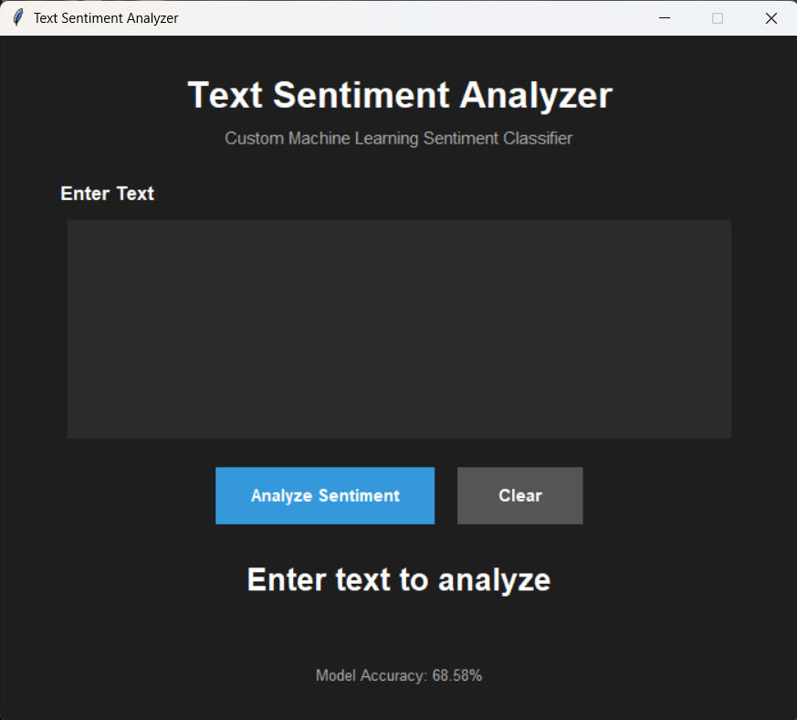
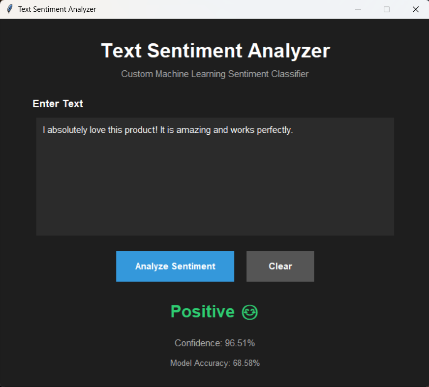
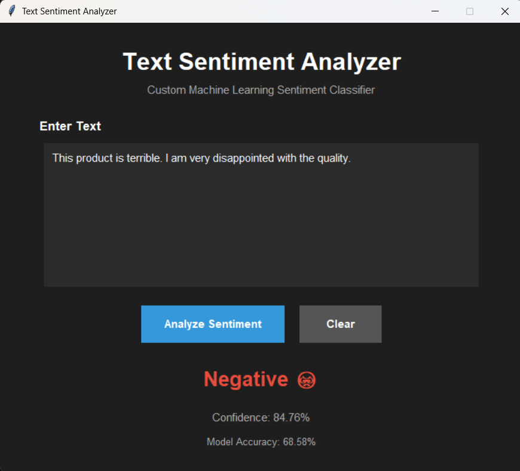
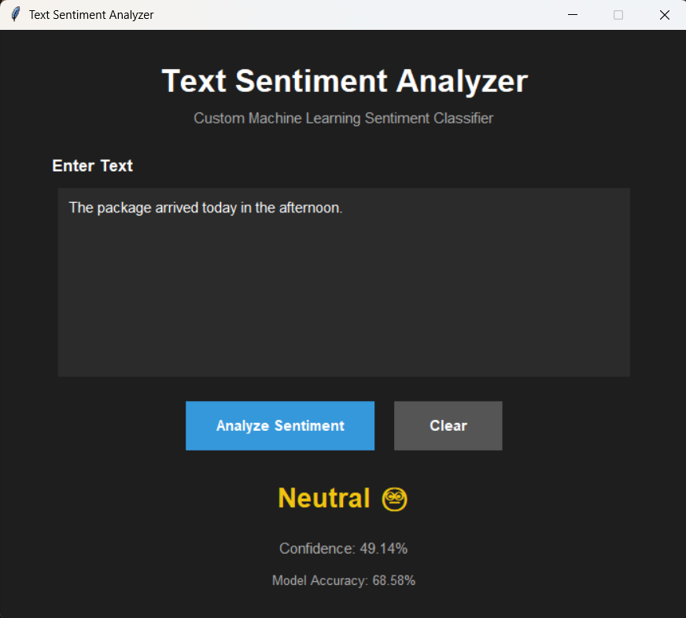
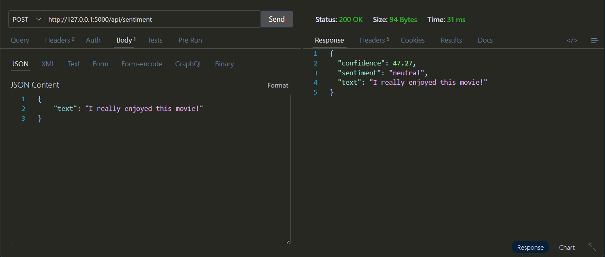

# 🚀 Day 72 - Text Sentiment Analyzer

Welcome to **Day 72** of my **100 Days, 100 Python Projects** challenge!

This project is a **Text Sentiment Analyzer** built using **Python, Tkinter, Pandas, Scikit-learn, and Flask**. The application uses **Natural Language Processing (NLP)** and **Machine Learning** to classify text into three sentiment categories:

* 😊 **Positive**
* 😡 **Negative**
* 😐 **Neutral**

The project uses a custom sentiment dataset containing approximately **27,480 text samples**. A **TF-IDF Vectorizer** is used to convert text into numerical features, and a **Logistic Regression** model is trained to perform sentiment classification.

The trained model is integrated into a **Tkinter desktop GUI**, where users can enter text and receive a sentiment prediction along with the model's confidence.

The project also includes a **Flask REST API**, allowing sentiment predictions to be accessed programmatically through an HTTP endpoint.

---

## 📌 Project Overview

Sentiment Analysis is a Natural Language Processing technique used to determine the emotional tone or opinion expressed in text.

It can be used in applications such as:

* 💬 Customer feedback analysis
* ⭐ Product review analysis
* 📱 Social media monitoring
* 📧 Feedback classification
* 📝 Opinion mining
* 📊 Customer satisfaction analysis

This project demonstrates a complete basic Machine Learning sentiment-analysis workflow:

```text
Dataset
   ↓
Data Cleaning
   ↓
Train-Test Split
   ↓
TF-IDF Vectorization
   ↓
Logistic Regression
   ↓
Model Evaluation
   ↓
Sentiment Prediction
   ↓
Tkinter GUI / Flask API
```

The application allows users to:

* ✏️ Enter text manually
* 😊 Detect positive sentiment
* 😡 Detect negative sentiment
* 😐 Detect neutral sentiment
* 📊 View prediction confidence
* 📈 View model accuracy
* 🧹 Clear the input
* 🌐 Access sentiment analysis through a Flask API

---

## ✨ Features

* 🖥️ Interactive Tkinter GUI
* ✏️ Text input area
* 🤖 Machine Learning based sentiment classification
* 🧠 Natural Language Processing
* 📊 TF-IDF text vectorization
* 🔤 Unigram and bigram features
* 🤖 Logistic Regression model
* 📈 Model accuracy calculation
* 📋 Classification report
* 😊 Positive sentiment detection
* 😡 Negative sentiment detection
* 😐 Neutral sentiment detection
* 📊 Prediction confidence score
* 🧹 Clear input functionality
* ⚠️ Empty input validation
* 🎨 Dark-themed GUI
* 🌐 Flask REST API
* 📡 JSON API responses
* 🚨 API error handling
* 📂 CSV dataset support
* 🔄 Reusable sentiment prediction function

---

## 🖼️ Application Screenshots

## Screenshots

### 🖥️ Main Application



### 😊 Positive Sentiment



### 😡 Negative Sentiment



### 😐 Neutral Sentiment



### 🌐 Flask API



---

## 🛠️ Technologies Used

* **Python 3**
* **Pandas**
* **Scikit-learn**
* **Tkinter**
* **Flask**
* **TF-IDF**
* **Logistic Regression**

### Python

Python is used to develop the complete project, including:

* Dataset processing
* Machine Learning
* Sentiment prediction
* GUI development
* REST API development

### Pandas

Pandas is used to load and process the sentiment dataset.

The project uses:

```python
pd.read_csv()
```

to load the `sentiment_data.csv` file.

Pandas is also used to:

* Remove missing values
* Convert text values to strings
* Normalize sentiment labels
* Separate features and target labels

### Scikit-learn

Scikit-learn is used to implement the Machine Learning pipeline.

The project uses:

* `train_test_split`
* `TfidfVectorizer`
* `LogisticRegression`
* `accuracy_score`
* `classification_report`

### Tkinter

Tkinter is used to build the desktop graphical interface.

It provides:

* Text input
* Buttons
* Labels
* Result display
* Confidence display
* Message boxes

### Flask

Flask is used to create a REST API for the sentiment classifier.

The API accepts text in JSON format and returns:

* Input text
* Predicted sentiment
* Confidence score

---

## 📂 Project Structure

```text
DAY_72/

│
├── main72.py
├── sentiment_model.py
├── app.py
├── sentiment_data.csv
├── requirements.txt
├── README.md
│
└── screenshots/
    ├── sentiment-analyzer-main.png
    ├── positive-sentiment.png
    ├── negative-sentiment.png
    ├── neutral-sentiment.png
    └── flask-api-response.png
```

### File Description

| File / Folder        | Purpose                                                     |
| -------------------- | ----------------------------------------------------------- |
| `main72.py`          | Main Tkinter GUI application                                |
| `sentiment_model.py` | Data processing, model training, evaluation, and prediction |
| `app.py`             | Flask REST API                                              |
| `sentiment_data.csv` | Sentiment analysis dataset                                  |
| `requirements.txt`   | Python dependencies                                         |
| `README.md`          | Project documentation                                       |
| `screenshots/`       | Application screenshots                                     |

---

## 📊 Dataset

The project uses a custom sentiment dataset stored in:

```text
sentiment_data.csv
```

The dataset contains approximately **27,480 text samples**.

The dataset contains two columns:

| Column      | Description             |
| ----------- | ----------------------- |
| `text`      | Text/message to analyze |
| `sentiment` | Sentiment category      |

The three sentiment categories used in the project are:

```text
positive
negative
neutral
```

### Example Dataset

```text
text                                      sentiment

I`d have responded, if I were going        neutral
Sooo SAD I will miss you here...           negative
my boss is bullying me...                  negative
what interview! leave me alone             negative
```

The dataset is loaded using:

```python
df = pd.read_csv("sentiment_data.csv")
```

---

## 🧹 Data Preprocessing

Before training the Machine Learning model, the dataset is cleaned and prepared.

### Step 1 — Remove Missing Values

The project removes rows where either the text or sentiment is missing:

```python
df = df.dropna(subset=["text", "sentiment"])
```

This ensures that the model is trained only on valid records.

### Step 2 — Convert Text to String

The text column is converted to string values:

```python
df["text"] = df["text"].astype(str)
```

This ensures that the text processing pipeline receives consistent input.

### Step 3 — Normalize Sentiment Labels

The sentiment labels are converted to lowercase and surrounding spaces are removed:

```python
df["sentiment"] = df["sentiment"].str.lower().str.strip()
```

For example:

```text
Positive → positive
NEGATIVE → negative
 Neutral  → neutral
```

This keeps the sentiment labels consistent throughout the dataset.

---

## ✂️ Train-Test Split

The dataset is divided into training and testing data using:

```python
train_test_split()
```

The project uses:

```python
X_train, X_test, y_train, y_test = train_test_split(
    X,
    y,
    test_size=0.2,
    random_state=42,
    stratify=y
)
```

The dataset is divided into:

* **80% Training Data**
* **20% Testing Data**

The training data is used to train the Machine Learning model.

The testing data is used to evaluate the model on previously unseen text.

### Stratified Split

The project uses:

```python
stratify=y
```

This helps maintain the distribution of the sentiment classes between the training and testing datasets.

---

## 📊 TF-IDF Vectorization

Machine Learning models work with numerical data rather than raw text.

Therefore, the project converts text into numerical features using **TF-IDF**.

The vectorizer is created using:

```python
vectorizer = TfidfVectorizer(
    lowercase=True,
    max_features=5000,
    ngram_range=(1, 2)
)
```

### TF-IDF

TF-IDF stands for:

**Term Frequency-Inverse Document Frequency**

It assigns numerical importance to words based on their occurrence within documents and across the dataset.

The vectorizer uses:

```text
max_features = 5000
```

This limits the vocabulary to the most useful 5,000 features.

---

## 🔤 N-Gram Features

The project uses:

```python
ngram_range=(1, 2)
```

This means the model considers:

* **Unigrams** — individual words
* **Bigrams** — pairs of consecutive words

For example:

```text
I love this movie
```

can produce features such as:

```text
I
love
this
movie
I love
love this
this movie
```

Using both unigrams and bigrams allows the model to capture some short phrases in addition to individual words.

---

## 🤖 Machine Learning Model

The project uses **Logistic Regression** for sentiment classification.

The model is created using:

```python
model = LogisticRegression(max_iter=1000)
```

The model is then trained using:

```python
model.fit(X_train_vectorized, y_train)
```

The classifier learns patterns from the TF-IDF features and associates those patterns with the three sentiment categories:

```text
positive
negative
neutral
```

---

## 📈 Model Evaluation

After training, the model predicts the sentiment of the testing dataset:

```python
y_pred = model.predict(X_test_vectorized)
```

The project calculates model accuracy using:

```python
accuracy = accuracy_score(y_test, y_pred)
```

The accuracy is displayed in the terminal:

```text
Model Accuracy: XX.XX%
```

The same accuracy is also displayed in the Tkinter GUI:

```text
Model Accuracy: XX.XX%
```

### Classification Report

The project also generates:

```python
classification_report(y_test, y_pred)
```

The classification report contains:

* Precision
* Recall
* F1-score
* Support

These metrics provide additional information about how the model performs for the different sentiment categories.

---

## 🔍 Sentiment Prediction

The `predict_sentiment()` function is responsible for analyzing new text.

```python
def predict_sentiment(text):
```

The prediction process is:

```text
User Text
    ↓
TF-IDF Transformation
    ↓
Logistic Regression
    ↓
Sentiment Prediction
    ↓
Probability Calculation
    ↓
Sentiment + Confidence
```

The function returns:

```python
return prediction, confidence
```

For example:

```text
positive, 91.42
```

or:

```text
negative, 87.63
```

or:

```text
neutral, 72.18
```

---

## 📊 Confidence Score

The application also calculates a confidence value using the probabilities generated by the Logistic Regression model.

The project uses:

```python
probabilities = model.predict_proba(text_vectorized)[0]
confidence = max(probabilities) * 100
```

The highest class probability is displayed as the prediction confidence.

For example:

```text
Sentiment: Positive 😊
Confidence: 94.21%
```

The confidence value represents the model's highest predicted class probability; it should not be interpreted as a guarantee that the classification is correct.

---

## 🖥️ Tkinter Graphical User Interface

The desktop application is implemented in:

```text
main72.py
```

The GUI provides a simple interface for testing the trained sentiment model.

The main window contains:

* Application title
* Subtitle
* Text input area
* Analyze Sentiment button
* Clear button
* Sentiment result
* Confidence score
* Model accuracy

The application uses a dark-themed interface.

---

## ✏️ Entering Text

Users can enter any text into the input box.

For example:

```text
I really enjoyed this product. It works perfectly!
```

After clicking:

```text
Analyze Sentiment
```

the application sends the text to the trained sentiment model.

The result is then displayed in the GUI.

---

## 😊 Positive Sentiment

When the model predicts a positive sentiment, the application displays:

```text
Positive 😊
```

The result is displayed using a positive result indicator.

Example:

```text
I absolutely loved this movie. It was fantastic!
```

Possible output:

```text
Positive 😊
Confidence: XX.XX%
```

---

## 😡 Negative Sentiment

When the model predicts a negative sentiment, the application displays:

```text
Negative 😡
```

Example:

```text
I am very disappointed with this service.
```

Possible output:

```text
Negative 😡
Confidence: XX.XX%
```

---

## 😐 Neutral Sentiment

When the model predicts a neutral sentiment, the application displays:

```text
Neutral 😐
```

Example:

```text
The meeting is scheduled for tomorrow.
```

Possible output:

```text
Neutral 😐
Confidence: XX.XX%
```

---

## 🧹 Clear Function

The **Clear** button resets the current input and result.

It:

* Clears the text input
* Resets the sentiment result
* Clears the confidence value

The result label returns to:

```text
Enter text to analyze
```

This allows users to analyze another text without restarting the application.

---

## ⚠️ Input Validation

The application checks whether the text input is empty.

If the user clicks **Analyze Sentiment** without entering any text, a warning message is displayed:

```text
Please enter some text.
```

This prevents an empty string from being sent to the prediction function.

---

# 🌐 Flask REST API

In addition to the Tkinter desktop application, this project includes a Flask REST API.

The API is implemented in:

```text
app.py
```

The API provides a way for other applications to send text and receive sentiment predictions.

---

## 🚀 Starting the Flask API

Run:

```bash
python app.py
```

The Flask development server will start locally.

The API home endpoint is:

```text
/
```

It returns:

```json
{
    "message": "Text Sentiment Analyzer API",
    "status": "running"
}
```

---

## 📡 Sentiment API Endpoint

The main sentiment endpoint is:

```text
POST /api/sentiment
```

It expects JSON input.

### Example Request

```json
{
    "text": "I really love this product!"
}
```

### Example Response

```json
{
    "text": "I really love this product!",
    "sentiment": "positive",
    "confidence": 92.45
}
```

The exact confidence value depends on the trained model and input text.

---

## ⚠️ API Error Handling

The Flask API performs basic request validation.

### Missing JSON Body

If no JSON data is provided, the API returns an error:

```json
{
    "error": "Request body must contain JSON data"
}
```

with HTTP status:

```text
400
```

### Missing Text Field

If the `text` field is missing or empty, the API returns:

```json
{
    "error": "Text field is required"
}
```

with HTTP status:

```text
400
```

This provides basic validation for API requests.

---

## 🧩 Important Functions Practiced

### Pandas

| Function        | Purpose                      |
| --------------- | ---------------------------- |
| `pd.read_csv()` | Loads the sentiment dataset  |
| `dropna()`      | Removes missing values       |
| `astype(str)`   | Converts text to string      |
| `str.lower()`   | Converts labels to lowercase |
| `str.strip()`   | Removes extra whitespace     |

### Scikit-learn

| Function / Class          | Purpose                                |
| ------------------------- | -------------------------------------- |
| `train_test_split()`      | Splits data into training/testing sets |
| `TfidfVectorizer()`       | Converts text into numerical features  |
| `LogisticRegression()`    | Trains the sentiment classifier        |
| `accuracy_score()`        | Calculates model accuracy              |
| `classification_report()` | Generates evaluation metrics           |

### Tkinter

| Component    | Purpose                                   |
| ------------ | ----------------------------------------- |
| `Tk()`       | Creates the main application window       |
| `Label`      | Displays titles, results, and information |
| `Text`       | Accepts text input                        |
| `Button`     | Performs analysis and clear actions       |
| `Frame`      | Organizes GUI components                  |
| `messagebox` | Displays input warnings                   |
| `config()`   | Updates result labels                     |

### Flask

| Function / Component | Purpose                       |
| -------------------- | ----------------------------- |
| `Flask()`            | Creates the Flask application |
| `@app.route()`       | Defines API routes            |
| `request.get_json()` | Reads JSON request data       |
| `jsonify()`          | Returns JSON responses        |
| `app.run()`          | Starts the development server |

---

## 🧠 Concepts Practiced

* Python Programming
* Machine Learning
* Natural Language Processing
* Sentiment Analysis
* Text Classification
* Data Cleaning
* Dataset Processing
* Train-Test Split
* Stratified Sampling
* TF-IDF
* N-Grams
* Unigrams
* Bigrams
* Logistic Regression
* Probability Prediction
* Model Accuracy
* Precision
* Recall
* F1-score
* Pandas
* Scikit-learn
* Tkinter GUI Development
* Flask REST API
* JSON
* API Request Handling
* API Response Handling
* Input Validation
* Exception Handling

---

## 📦 Requirements

The project requires the following Python libraries:

```text
pandas
scikit-learn
flask
```

Tkinter is generally included with standard Python installations on Windows.

---

## 📄 requirements.txt

The `requirements.txt` file contains:

```text
pandas
scikit-learn
flask
```

Install all dependencies using:

```bash
pip install -r requirements.txt
```

---

## ▶️ How to Run

### 1. Make Sure Python is Installed

Check your Python version:

```bash
python --version
```

### 2. Open the Project Folder

Open a terminal inside the `DAY_72` folder.

### 3. Install Required Dependencies

```bash
pip install -r requirements.txt
```

### 4. Make Sure the Dataset Exists

Ensure that:

```text
sentiment_data.csv
```

is located in the same folder as:

```text
sentiment_model.py
```

and:

```text
main72.py
```

### 5. Run the Desktop Application

Run:

```bash
python main72.py
```

The **Text Sentiment Analyzer** Tkinter GUI will open automatically.

The `sentiment_model.py` file is imported automatically and trains the model before the GUI becomes available.

---

## 🌐 Running the Flask API

To run the API separately, open a terminal in the project folder and execute:

```bash
python app.py
```

The Flask development server will start.

You can then access the API home route through a browser or API testing tool.

For sentiment analysis, send a POST request to:

```text
/api/sentiment
```

with a JSON body containing a `text` field.

---

## 🔄 Complete Project Workflow

The complete project combines Machine Learning, a desktop GUI, and a REST API.

```text
                 sentiment_data.csv
                         ↓
                  Data Processing
                         ↓
                  Train-Test Split
                         ↓
                  TF-IDF Vectorizer
                         ↓
                 Logistic Regression
                         ↓
                  Model Evaluation
                         ↓
                Trained Sentiment Model
                    ↙            ↘
             Tkinter GUI       Flask API
                  ↓                 ↓
             User Text          JSON Text
                  ↓                 ↓
              Prediction        Prediction
                  ↓                 ↓
          Sentiment +          Sentiment +
           Confidence           Confidence
```

---

## 🎯 Learning Outcome

This project helped me understand:

* How sentiment analysis works
* How Machine Learning can be applied to text classification
* How to clean and prepare a text dataset
* How to handle missing values using Pandas
* How to normalize text labels
* How to split a dataset into training and testing data
* How stratified train-test splitting works
* How TF-IDF converts text into numerical features
* How unigrams and bigrams can be used for text classification
* How Logistic Regression can classify multiple sentiment categories
* How to calculate model accuracy
* How to generate a classification report
* How to obtain prediction probabilities
* How to calculate a prediction confidence value
* How to build a Tkinter Machine Learning application
* How to connect a GUI with a trained Machine Learning model
* How to create a Flask REST API
* How to accept JSON requests
* How to return JSON responses
* How to perform basic API input validation
* How the same Machine Learning model can be used by both a desktop application and an API

---

## 🔮 Future Improvements

Possible enhancements for future versions include:

* 🧠 Experiment with other Machine Learning algorithms
* 🤖 Compare Logistic Regression with Naive Bayes and SVM
* 📊 Add confusion matrix visualization
* 📈 Add sentiment distribution charts
* 📊 Display precision, recall, and F1-score in the GUI
* 📉 Add model performance graphs
* 🔍 Add word-frequency analysis
* ☁️ Add word cloud visualization
* 📝 Add batch text analysis
* 📂 Allow CSV file upload for bulk sentiment analysis
* 📊 Generate sentiment reports
* 💾 Save prediction history
* 📜 Display previously analyzed texts
* 🌐 Build a web interface for the Flask API
* 🔐 Add API authentication
* 🐳 Containerize the API using Docker
* 📱 Create a mobile-friendly frontend
* 🔄 Add automatic model retraining
* 🧪 Add cross-validation
* ⚙️ Perform hyperparameter tuning
* 📚 Use a larger and more diverse dataset
* 🧠 Experiment with advanced NLP models such as Transformers

---

## ⚠️ Important Note

This project is an **educational Machine Learning application** created as part of the **100 Days, 100 Python Projects** challenge.

The sentiment prediction is based on patterns learned from the training dataset. Therefore, the model may occasionally classify text incorrectly, especially when the input contains sarcasm, slang, ambiguous language, domain-specific terminology, or expressions that differ significantly from the training data.

The displayed confidence is the model's highest predicted class probability and should not be treated as a guarantee of prediction correctness.

---

## 📅 Challenge

This project is part of my **100 Days, 100 Python Projects** challenge, where I build one Python project every day to improve my Python programming skills, strengthen my problem-solving abilities, learn new technologies, and maintain consistency through daily coding.

**Day 72** focuses on **Natural Language Processing and Machine Learning**, combining **Pandas for data processing**, **TF-IDF for text feature extraction**, **Logistic Regression for sentiment classification**, **Tkinter for desktop GUI development**, and **Flask for REST API development** to create a practical Text Sentiment Analyzer.

---

## 👨‍💻 Author

**Abhijit Munghate**

Happy Coding! 🚀🐍🤖📊
