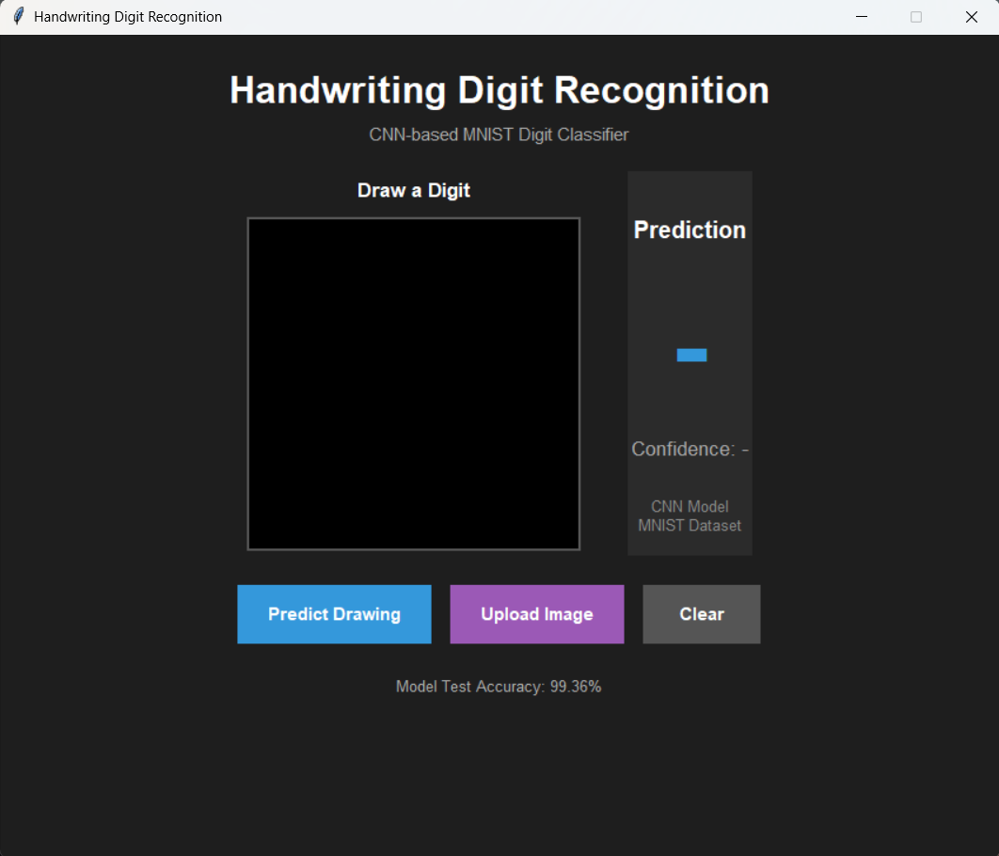
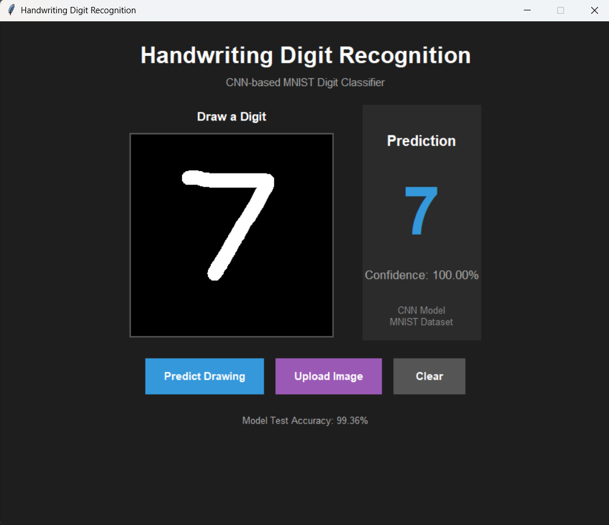
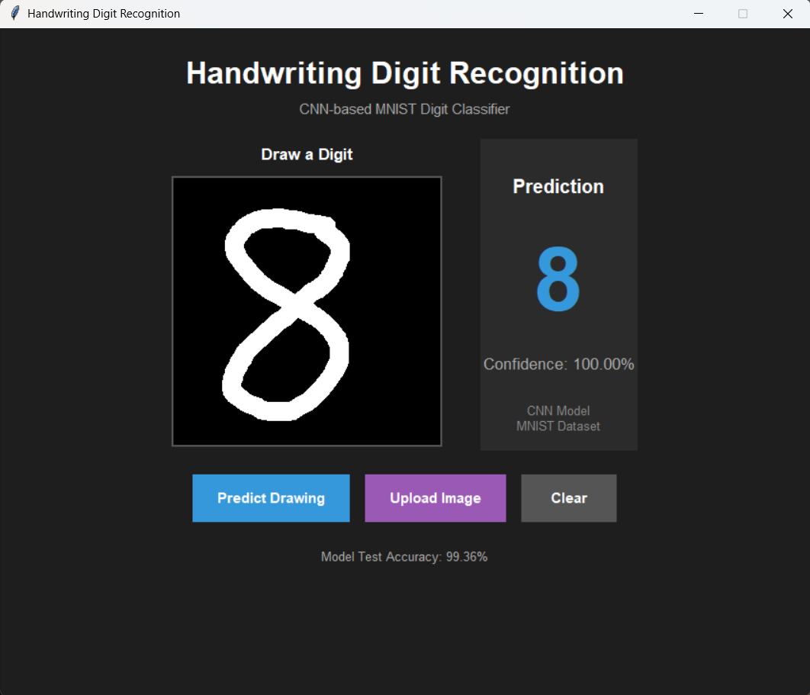
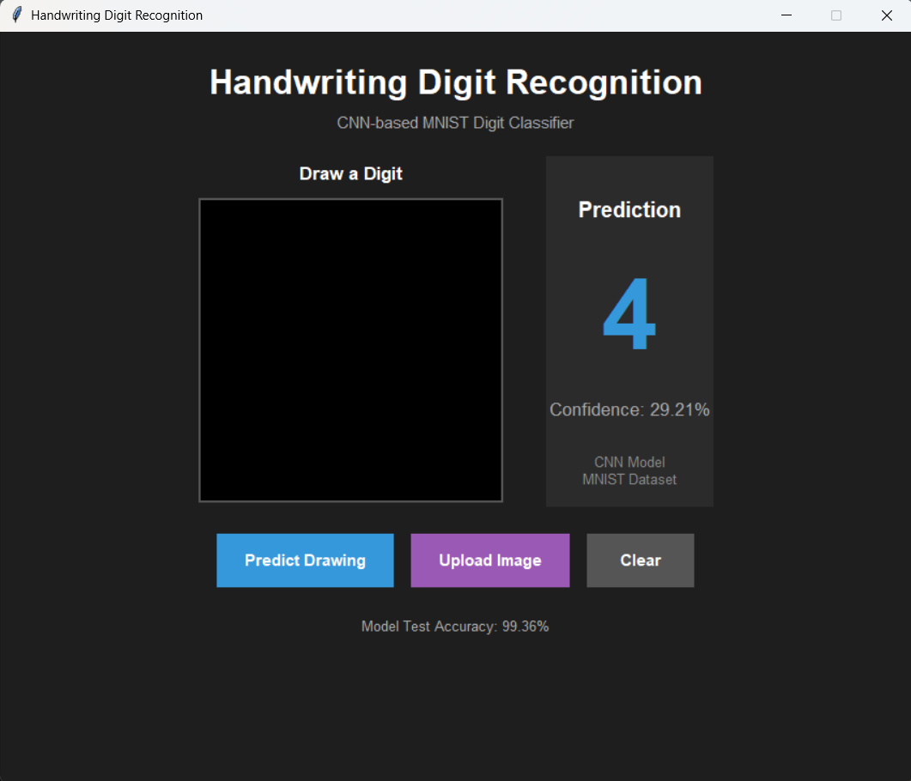
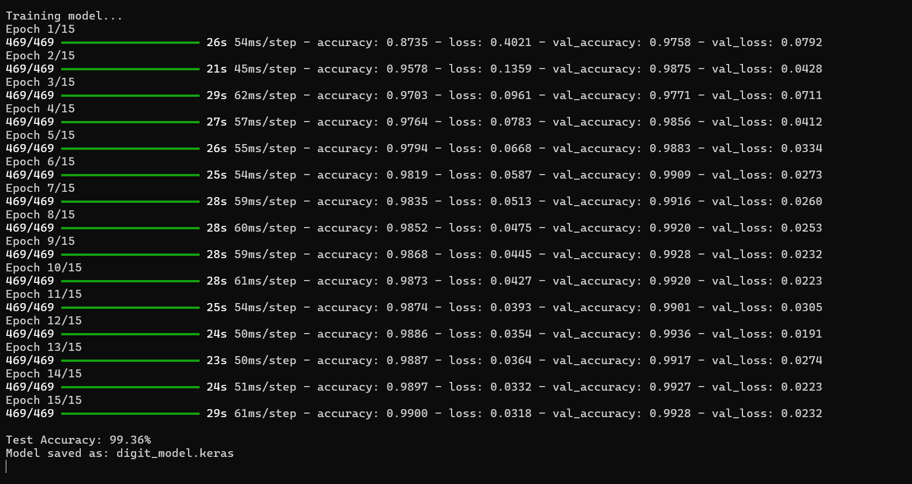
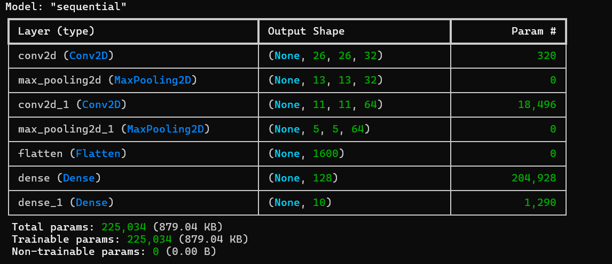

# 🚀 Day 73 - Handwriting Digit Recognition

Welcome to **Day 73** of my **100 Days, 100 Python Projects** challenge!

This project is a **Handwriting Digit Recognition** application built using **Python, TensorFlow, NumPy, Pillow, and Tkinter**.

The application uses a **Convolutional Neural Network (CNN)** trained on the **MNIST handwritten digit dataset** to recognize handwritten digits from **0 to 9**.

Users can either:

* ✍️ Draw a digit directly on the application canvas
* 📂 Upload an image containing a handwritten digit

The trained CNN processes the image and predicts the digit along with a **confidence score**.

The project also includes **image preprocessing, data augmentation, early stopping, model saving/loading, and a graphical user interface**.

---

## 📌 Project Overview

Handwritten digit recognition is a classic Computer Vision and Machine Learning problem.

The goal of this project is to train a neural network that can recognize handwritten digits from images.

The project uses the **MNIST dataset**, which contains grayscale images of handwritten digits from:

```text
0 1 2 3 4 5 6 7 8 9
```

The complete workflow is:

```text
MNIST Dataset
      ↓
Image Normalization
      ↓
Reshaping
      ↓
Data Augmentation
      ↓
CNN Model
      ↓
Model Training
      ↓
Model Evaluation
      ↓
Save Trained Model
      ↓
Tkinter GUI
      ↓
Draw / Upload Digit
      ↓
Image Preprocessing
      ↓
CNN Prediction
      ↓
Digit + Confidence
```

---

## ✨ Features

* 🖥️ Interactive Tkinter GUI
* ✍️ Draw digits directly on the canvas
* 📂 Upload digit images
* 🤖 CNN-based digit classification
* 🧠 TensorFlow/Keras Deep Learning
* 🔢 Recognizes digits from 0 to 9
* 📊 MNIST dataset
* 🔄 Image data augmentation
* 🖼️ Image preprocessing
* 🔲 Grayscale image conversion
* 📐 Automatic image resizing
* 🎯 Digit centering
* 📊 Prediction confidence
* 💾 Trained model saving
* 📂 Saved model loading
* ⏱️ Early stopping during training
* ⚠️ Empty canvas validation
* 🚨 Prediction error handling
* 🎨 Dark-themed GUI
* 📈 Model test accuracy display

---

## 🖼️ Application Screenshots

## Screenshots

### 🖥️ Main Application



### ✍️ Drawing Prediction



### 🔢 Another Digit Prediction



### 📂 Uploaded Image Prediction



### 🧠 Model Training



### 🏗️ CNN Model Architecture



---

## 🛠️ Technologies Used

* **Python 3**
* **TensorFlow**
* **Keras**
* **NumPy**
* **Pillow**
* **Tkinter**

### Python

Python is used to develop the complete application, including:

* Dataset processing
* CNN training
* Image preprocessing
* Prediction
* GUI development
* Model management

### TensorFlow / Keras

TensorFlow and Keras are used to build and train the Convolutional Neural Network.

The project uses:

* `Sequential`
* `Conv2D`
* `MaxPooling2D`
* `Flatten`
* `Dense`
* `Input`
* `ImageDataGenerator`
* `EarlyStopping`
* `load_model`

### NumPy

NumPy is used for:

* Image array processing
* Pixel value manipulation
* Normalization
* Image reshaping
* Finding image boundaries
* Processing model predictions

### Pillow

Pillow is used for image processing.

The project uses Pillow for:

* Opening uploaded images
* Converting images to grayscale
* Inverting images
* Cropping images
* Resizing images
* Creating blank images
* Drawing handwritten digits
* Processing image pixels

### Tkinter

Tkinter is used to create the graphical user interface.

It provides:

* Drawing canvas
* Buttons
* Labels
* File selection
* Result display
* Error messages

---

## 📂 Project Structure

```text
DAY_73/

│
├── main73.py
├── digit_model.keras
├── requirements.txt
├── README.md
│
└── screenshots/
    ├── digit-recognition-main.png
    ├── drawing-prediction.png
    ├── second-drawing-prediction.png
    ├── uploaded-image-prediction.png
    ├── model-training.png
    └── cnn-model-summary.png
```

### File Description

| File / Folder       | Purpose                                |
| ------------------- | -------------------------------------- |
| `main73.py`         | Main application and CNN training code |
| `digit_model.keras` | Saved trained CNN model                |
| `requirements.txt`  | Python dependencies                    |
| `README.md`         | Project documentation                  |
| `screenshots/`      | Application and model screenshots      |

> **Note:** `digit_model.keras` is created automatically after the CNN is trained for the first time.

---

# 📊 MNIST Dataset

The project uses the **MNIST handwritten digit dataset** provided through TensorFlow/Keras.

The dataset can be loaded using:

```python
mnist = tf.keras.datasets.mnist
```

The training and testing data are loaded using:

```python
(X_train, y_train), (X_test, y_test) = mnist.load_data()
```

The dataset contains grayscale images of handwritten digits.

Each image has dimensions:

```text
28 × 28 pixels
```

The model classifies each image into one of ten classes:

```text
0 1 2 3 4 5 6 7 8 9
```

---

## 📚 Training and Testing Data

The MNIST dataset is divided into:

* Training dataset
* Testing dataset

The code prints the number of samples:

```python
print("Training samples:", len(X_train))
print("Testing samples:", len(X_test))
```

The training dataset is used to teach the CNN how to recognize handwritten digits.

The testing dataset is used to evaluate the trained model on unseen images.

---

# 🧹 Image Preprocessing

Before the images are passed to the CNN, they are normalized and reshaped.

## Step 1 — Pixel Normalization

The original pixel values range from:

```text
0 → 255
```

The project converts them to:

```text
0.0 → 1.0
```

using:

```python
X_train = X_train.astype("float32") / 255.0
X_test = X_test.astype("float32") / 255.0
```

This helps provide normalized input values to the neural network.

---

## Step 2 — Reshaping

The original MNIST images have dimensions:

```text
28 × 28
```

The CNN expects an additional channel dimension.

Therefore, the images are reshaped into:

```text
28 × 28 × 1
```

using:

```python
X_train = X_train.reshape(-1, 28, 28, 1)
X_test = X_test.reshape(-1, 28, 28, 1)
```

The `1` represents the grayscale image channel.

---

# 🔄 Data Augmentation

The project uses TensorFlow/Keras `ImageDataGenerator` to create slightly modified versions of training images.

```python
datagen = ImageDataGenerator(
    rotation_range=10,
    width_shift_range=0.10,
    height_shift_range=0.10,
    zoom_range=0.10
)
```

The augmentation includes:

* 🔄 Small rotations
* ↔️ Horizontal shifting
* ↕️ Vertical shifting
* 🔍 Small zoom changes

This provides the model with more varied training examples and helps it learn to recognize digits with slight positional or orientation differences.

The augmentation is applied to the training data using:

```python
datagen.flow(
    X_train,
    y_train,
    batch_size=128
)
```

---

# 🧠 Convolutional Neural Network

The project uses a **Convolutional Neural Network (CNN)** for digit recognition.

The CNN architecture is:

```text
Input
  ↓
Conv2D - 32 Filters
  ↓
MaxPooling2D
  ↓
Conv2D - 64 Filters
  ↓
MaxPooling2D
  ↓
Flatten
  ↓
Dense - 128 Neurons
  ↓
Dense - 10 Classes
  ↓
Softmax Output
```

The model is created using:

```python
model = Sequential([
    Input(shape=(28, 28, 1)),
    Conv2D(32, (3, 3), activation="relu"),
    MaxPooling2D((2, 2)),
    Conv2D(64, (3, 3), activation="relu"),
    MaxPooling2D((2, 2)),
    Flatten(),
    Dense(128, activation="relu"),
    Dense(10, activation="softmax")
])
```

---

## 🧩 CNN Layers

### 1. Input Layer

```python
Input(shape=(28, 28, 1))
```

The input layer accepts:

```text
28 × 28 grayscale images
```

---

### 2. First Convolution Layer

```python
Conv2D(32, (3, 3), activation="relu")
```

This layer uses:

* 32 filters
* 3 × 3 convolution kernels
* ReLU activation

It learns basic visual patterns from the digit images.

---

### 3. First Max Pooling Layer

```python
MaxPooling2D((2, 2))
```

Max pooling reduces the spatial dimensions of the feature maps while retaining important information.

---

### 4. Second Convolution Layer

```python
Conv2D(64, (3, 3), activation="relu")
```

The second convolution layer uses 64 filters.

It can learn more complex visual features from the representations produced by the earlier layer.

---

### 5. Second Max Pooling Layer

```python
MaxPooling2D((2, 2))
```

The second pooling layer further reduces the spatial dimensions.

---

### 6. Flatten Layer

```python
Flatten()
```

The feature maps are converted into a one-dimensional vector before being passed to the fully connected layers.

---

### 7. Dense Layer

```python
Dense(128, activation="relu")
```

This fully connected layer contains 128 neurons.

It combines the extracted image features before classification.

---

### 8. Output Layer

```python
Dense(10, activation="softmax")
```

The output layer contains 10 neurons corresponding to the digits:

```text
0 1 2 3 4 5 6 7 8 9
```

The Softmax activation produces a probability distribution across these ten classes.

---

# ⚙️ Model Compilation

The CNN is compiled using:

```python
model.compile(
    optimizer="adam",
    loss="sparse_categorical_crossentropy",
    metrics=["accuracy"]
)
```

### Optimizer

The project uses:

```text
Adam
```

Adam is used to update the neural network weights during training.

### Loss Function

The project uses:

```text
Sparse Categorical Crossentropy
```

This is suitable for multi-class classification when the labels are represented as integer class values.

### Evaluation Metric

The model uses:

```text
Accuracy
```

to measure classification performance.

---

# ⏱️ Early Stopping

The project uses the Keras `EarlyStopping` callback:

```python
early_stopping = EarlyStopping(
    monitor="val_accuracy",
    patience=3,
    restore_best_weights=True
)
```

The model monitors validation accuracy during training.

If validation accuracy does not improve for three consecutive epochs, training can stop early.

The best model weights are restored using:

```text
restore_best_weights=True
```

This helps avoid unnecessarily continuing training when validation performance stops improving.

---

# 🏋️ Model Training

The model is trained using:

```python
history = model.fit(
    datagen.flow(X_train, y_train, batch_size=128),
    epochs=15,
    validation_data=(X_test, y_test),
    callbacks=[early_stopping]
)
```

The maximum number of epochs is:

```text
15
```

The batch size is:

```text
128
```

Training progress is displayed in the terminal.

---

# 📈 Model Evaluation

After training, the model is evaluated using the MNIST test dataset:

```python
test_loss, test_accuracy = model.evaluate(
    X_test,
    y_test,
    verbose=0
)
```

The test accuracy is then displayed:

```text
Test Accuracy: XX.XX%
```

The application also displays the model's test accuracy in the GUI when the model has just been trained.

---

# 💾 Saving the Trained Model

After training, the model is saved as:

```text
digit_model.keras
```

using:

```python
model.save(MODEL_FILE)
```

The saved model allows the application to reuse the trained CNN instead of retraining it every time.

---

# 📂 Loading the Saved Model

When the application starts, it first checks whether the saved model exists:

```python
if os.path.exists(MODEL_FILE):
```

If the model exists, it is loaded using:

```python
model = load_model(MODEL_FILE)
```

The terminal displays:

```text
Saved model found.
Loading trained model...
```

This makes subsequent application launches faster because the CNN does not need to be trained again.

---

# ✍️ Drawing a Digit

The application contains a **280 × 280 pixel drawing canvas**.

Users can draw a digit using the mouse.

The canvas captures mouse events:

```python
canvas.bind("<Button-1>", start_drawing)
canvas.bind("<B1-Motion>", draw)
canvas.bind("<ButtonRelease-1>", stop_drawing)
```

The digit is drawn using a thick white line on a black background.

The drawing is also stored using Pillow:

```python
drawing_image = Image.new(
    "L",
    (CANVAS_SIZE, CANVAS_SIZE),
    0
)
```

---

# 🖼️ Image Preprocessing for Prediction

Images drawn or uploaded by the user need to be converted into the same general format expected by the MNIST-trained model.

The project uses:

```python
def preprocess_image(image):
```

The preprocessing pipeline includes:

```text
Input Image
     ↓
Convert to Grayscale
     ↓
Check Background
     ↓
Invert if Necessary
     ↓
Find Digit Boundaries
     ↓
Crop Digit
     ↓
Resize
     ↓
Center Digit
     ↓
Create 28 × 28 Image
     ↓
Normalize Pixels
     ↓
Add Model Dimensions
```

---

## ⚫ Grayscale Conversion

The image is converted to grayscale:

```python
image = image.convert("L")
```

This ensures that the input contains a single grayscale channel.

---

## 🔄 Background Inversion

The application calculates the average pixel value:

```python
average_pixel = np.mean(image_array)
```

If the image background is bright, it is inverted:

```python
if average_pixel > 127:
    image = ImageOps.invert(image)
```

This helps standardize the digit/background appearance.

---

## ✂️ Automatic Cropping

The application identifies pixels above a threshold:

```python
coords = np.argwhere(image_array > 30)
```

It then finds the boundaries of the drawn digit and crops the image.

This removes unnecessary empty space around the digit.

---

## 📐 Resizing

The cropped digit is resized to fit within:

```text
20 × 20 pixels
```

using:

```python
image.thumbnail((20, 20), Image.Resampling.LANCZOS)
```

---

## 🎯 Centering the Digit

A new blank 28 × 28 image is created:

```python
final_image = Image.new("L", (28, 28), 0)
```

The resized digit is placed in the center.

This produces an image with the same dimensions as the MNIST input.

---

## 🔢 Normalization

The final image is converted into a NumPy array and normalized:

```python
image_array = np.array(final_image).astype("float32") / 255.0
```

The image is then reshaped for the CNN:

```python
image_array = image_array.reshape(
    1,
    28,
    28,
    1
)
```

The final shape is:

```text
1 × 28 × 28 × 1
```

where:

* `1` = one image
* `28` = image height
* `28` = image width
* `1` = grayscale channel

---

# 🔮 Digit Prediction

The project uses:

```python
def predict_digit(image):
```

The image is first preprocessed:

```python
processed_image = preprocess_image(image)
```

The CNN then generates predictions:

```python
predictions = model.predict(
    processed_image,
    verbose=0
)[0]
```

The predicted digit is selected using:

```python
predicted_digit = int(np.argmax(predictions))
```

The highest predicted probability is converted into a percentage:

```python
confidence = float(np.max(predictions)) * 100
```

The function returns:

```text
Predicted Digit
Confidence
```

---

# 📊 Confidence Score

The application displays the model's highest predicted class probability as the confidence value.

For example:

```text
Prediction

7

Confidence: 98.45%
```

The confidence value is derived from the Softmax output of the CNN.

It represents the model's highest predicted class probability and should not be interpreted as a guarantee that the prediction is correct.

---

# 📂 Upload Image Feature

Users can also upload an image containing a handwritten digit.

The application supports:

```text
PNG
JPG
JPEG
BMP
```

The file selection is handled using:

```python
filedialog.askopenfilename()
```

The uploaded image is opened using Pillow:

```python
image = Image.open(file_path)
```

It is then sent through the same preprocessing and prediction pipeline used for drawn digits.

---

# 🖥️ Graphical User Interface

The Tkinter interface contains two main sections.

### ✍️ Drawing Section

The left side contains:

* Draw a Digit label
* Drawing canvas

### 🔢 Prediction Section

The right side contains:

* Prediction title
* Predicted digit
* Confidence score
* Model information

The bottom section contains:

* Predict Drawing
* Upload Image
* Clear

buttons.

---

# 🧹 Clear Function

The **Clear** button resets the drawing canvas and prediction results.

It:

* Removes the drawing
* Creates a new blank image
* Resets the prediction
* Resets the confidence display

The prediction returns to:

```text
-
```

and the confidence returns to:

```text
Confidence: -
```

---

# ⚠️ Input Validation

The application checks whether the canvas contains a drawing before attempting prediction.

If the canvas is empty, a warning is displayed:

```text
Please draw a digit first.
```

This prevents unnecessary prediction attempts on a completely blank image.

---

# 🚨 Error Handling

The project uses Tkinter message boxes to handle errors.

For example, if an error occurs during drawing prediction:

```python
messagebox.showerror(
    "Prediction Error",
    f"Could not predict the digit.\n\n{e}"
)
```

For uploaded images, errors are handled using:

```python
messagebox.showerror(
    "Image Error",
    f"Could not process the image.\n\n{e}"
)
```

This makes the application more user-friendly.

---

# 🧩 Important Functions and Classes Practiced

## TensorFlow / Keras

| Function / Class          | Purpose                                                    |
| ------------------------- | ---------------------------------------------------------- |
| `tf.keras.datasets.mnist` | Loads the MNIST dataset                                    |
| `Sequential()`            | Creates the CNN model                                      |
| `Input()`                 | Defines model input shape                                  |
| `Conv2D()`                | Extracts image features                                    |
| `MaxPooling2D()`          | Reduces feature-map dimensions                             |
| `Flatten()`               | Converts feature maps to a vector                          |
| `Dense()`                 | Creates fully connected layers                             |
| `ImageDataGenerator()`    | Performs data augmentation                                 |
| `EarlyStopping()`         | Stops training when validation performance stops improving |
| `model.fit()`             | Trains the CNN                                             |
| `model.evaluate()`        | Evaluates model performance                                |
| `model.save()`            | Saves the trained model                                    |
| `load_model()`            | Loads the saved model                                      |
| `model.predict()`         | Generates predictions                                      |

## NumPy

| Function                | Purpose                                  |
| ----------------------- | ---------------------------------------- |
| `np.array()`            | Converts images to arrays                |
| `np.mean()`             | Calculates average pixel value           |
| `np.argwhere()`         | Finds pixels meeting a condition         |
| `np.min()` / `np.max()` | Finds prediction and image boundaries    |
| `np.argmax()`           | Finds the predicted digit                |
| `np.max()`              | Finds the highest prediction probability |

## Pillow

| Function / Class           | Purpose                     |
| -------------------------- | --------------------------- |
| `Image.open()`             | Opens uploaded images       |
| `Image.new()`              | Creates new images          |
| `ImageDraw.Draw()`         | Draws on images             |
| `ImageOps.invert()`        | Inverts image colors        |
| `convert("L")`             | Converts to grayscale       |
| `crop()`                   | Crops the digit             |
| `thumbnail()`              | Resizes the image           |
| `Image.Resampling.LANCZOS` | High-quality image resizing |

## Tkinter

| Component    | Purpose                        |
| ------------ | ------------------------------ |
| `Tk()`       | Creates the application window |
| `Canvas`     | Provides the drawing area      |
| `Label`      | Displays text and predictions  |
| `Button`     | Performs application actions   |
| `Frame`      | Organizes GUI components       |
| `filedialog` | Selects image files            |
| `messagebox` | Displays warnings and errors   |
| `bind()`     | Handles mouse events           |

---

# 🧠 Concepts Practiced

* Python Programming
* Deep Learning
* Computer Vision
* Machine Learning
* Convolutional Neural Networks
* Image Classification
* MNIST Dataset
* Image Preprocessing
* Image Normalization
* Image Resizing
* Image Cropping
* Image Centering
* Grayscale Image Processing
* Data Augmentation
* CNN Architecture
* Convolution Layers
* Pooling Layers
* Dense Layers
* Softmax Classification
* Model Training
* Model Evaluation
* Early Stopping
* Model Saving
* Model Loading
* Prediction Confidence
* TensorFlow
* Keras
* NumPy
* Pillow
* Tkinter GUI Development
* Mouse Event Handling
* File Upload
* Error Handling

---

# 📦 Requirements

The project requires the following Python libraries:

```text
tensorflow
numpy
pillow
```

Tkinter is generally included with standard Python installations on Windows.

---

# 📄 requirements.txt

The `requirements.txt` file contains:

```text
tensorflow
numpy
pillow
```

Install all dependencies using:

```bash
pip install -r requirements.txt
```

---

# ▶️ How to Run

## 1. Make Sure Python is Installed

Check your Python version:

```bash
python --version
```

## 2. Open the Project Folder

Open a terminal inside the `DAY_73` folder.

## 3. Install Required Dependencies

```bash
pip install -r requirements.txt
```

## 4. Run the Application

```bash
python main73.py
```

---

# 🏋️ First Run

When the application is started for the first time, if the model file does not exist:

```text
digit_model.keras
```

the application automatically downloads the MNIST dataset and trains a new CNN model.

The terminal displays information such as:

```text
No saved model found.
Training a new CNN model...
```

The training process then displays the model architecture and training progress.

After training, the test accuracy is displayed.

The trained model is then saved as:

```text
digit_model.keras
```

---

# ⚡ Subsequent Runs

Once `digit_model.keras` has been created, the application checks for the saved model when it starts.

If the model exists, it displays:

```text
Saved model found.
Loading trained model...
```

The application loads the existing CNN instead of training from scratch.

This makes subsequent launches significantly faster.

---

# 🔄 Complete Application Workflow

```text
                    MNIST Dataset
                         ↓
                Data Normalization
                         ↓
                 Data Augmentation
                         ↓
                   CNN Training
                         ↓
                 Model Evaluation
                         ↓
               Save digit_model.keras
                         ↓
                    Tkinter GUI
                    ↙         ↘
              Draw Digit    Upload Image
                    ↘         ↙
                 Image Preprocessing
                         ↓
                   Resize to 28×28
                         ↓
                    CNN Prediction
                         ↓
                Predicted Digit + Confidence
```

---

# 🎯 Learning Outcome

This project helped me understand:

* How handwritten digit recognition works
* How to use the MNIST dataset
* How to preprocess image data
* How to normalize pixel values
* How CNNs are used for image classification
* How convolution layers extract image features
* How pooling layers reduce feature dimensions
* How Dense layers perform classification
* How Softmax produces class probabilities
* How to use TensorFlow and Keras
* How to perform image data augmentation
* How to use Early Stopping
* How to evaluate a CNN model
* How to save a trained neural network
* How to load an existing trained model
* How to preprocess custom handwritten images
* How to center and resize handwritten digits
* How to calculate prediction confidence
* How to build a drawing canvas using Tkinter
* How to handle mouse drawing events
* How to upload images through a GUI
* How to combine Deep Learning with a desktop application

---

# 🔮 Future Improvements

Possible enhancements for future versions include:

* 🔢 Display predictions for all 10 digits with probabilities
* 📊 Add a prediction probability chart
* 📈 Display training and validation accuracy graphs
* 📉 Display training and validation loss graphs
* 🧠 Experiment with deeper CNN architectures
* ⚙️ Add hyperparameter tuning
* 🖼️ Support multiple uploaded images
* 📂 Add batch digit recognition
* 🔢 Recognize multi-digit handwritten numbers
* ➕ Recognize handwritten mathematical expressions
* ➗ Build a handwritten calculator
* 🧮 Recognize handwritten equations
* 📱 Create a mobile-friendly version
* 🌐 Create a web-based digit recognition application
* 🚀 Deploy the model as an API
* 🎨 Improve the GUI design
* 🌓 Add Dark/Light Mode
* 💾 Save prediction history
* 🖼️ Add image preview for uploaded images
* 🔄 Add a retraining option with custom data
* 📚 Experiment with other handwriting datasets

---

# ⚠️ Important Note

This project is an **educational Deep Learning application** created as part of the **100 Days, 100 Python Projects** challenge.

The CNN is trained on the MNIST dataset, which contains a particular style and format of handwritten digits. Therefore, predictions on handwriting that differs significantly from the MNIST data may not always be accurate.

The displayed confidence represents the model's highest Softmax class probability and should not be treated as a guarantee that the prediction is correct.

---

# 📅 Challenge

This project is part of my **100 Days, 100 Python Projects** challenge, where I build one Python project every day to improve my Python programming skills, strengthen my problem-solving abilities, learn new technologies, and maintain consistency through daily coding.

**Day 73** focuses on **Deep Learning and Computer Vision**, combining **TensorFlow/Keras for CNN development**, **MNIST for handwritten digit data**, **Pillow and NumPy for image processing**, and **Tkinter for GUI development** to create a practical Handwriting Digit Recognition application.

---

# 👨‍💻 Author

**Abhijit Munghate**

Happy Coding! 🚀🐍🧠🔢
