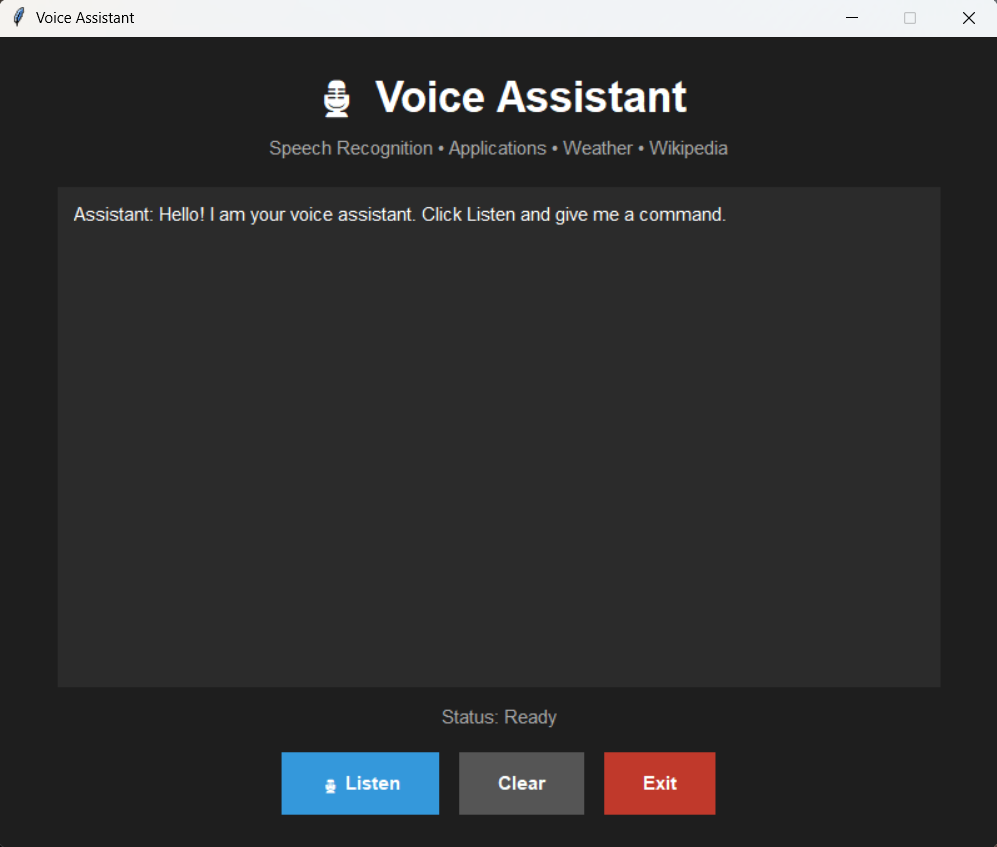

# 🚀 Day 74 - Voice Assistant

Welcome to **Day 74** of my **100 Days, 100 Python Projects** challenge!

This project is a **Voice Assistant GUI application** built using **Python, Tkinter, SpeechRecognition, pyttsx3, Wikipedia, Requests, and Python-dotenv**.

The application allows users to interact with a desktop voice assistant using spoken commands.

The assistant can:

* 🎙️ Listen to voice commands
* 🗣️ Convert speech into text
* 🔊 Respond using text-to-speech
* 🕐 Tell the current time
* 🌐 Open Google Chrome
* 📝 Open Notepad
* 🧮 Open Calculator
* 📚 Search Wikipedia
* 🌤️ Get weather information for a city
* 💬 Display the conversation inside the GUI
* 🧹 Clear the conversation
* ❌ Exit the application

The project combines **Speech Recognition, Text-to-Speech, API Integration, Web Search, Desktop Automation, Multithreading, Environment Variables, and Tkinter GUI development** into one practical Python application.

---

## 📌 Project Overview

Voice assistants provide a natural way for users to interact with computer systems using spoken commands.

This project demonstrates how Python can be used to build a simple desktop voice assistant that listens to a user's voice, converts it into text, identifies the requested command, performs the corresponding action, and responds using speech.

The overall workflow is:

```text
User
  ↓
Click Listen
  ↓
Microphone
  ↓
Speech Recognition
  ↓
Convert Speech → Text
  ↓
Command Processing
  ↓
Identify Command
  ↓
Perform Action
  ↓
Generate Response
  ↓
Display Response in GUI
  ↓
Text-to-Speech
  ↓
Assistant Speaks
```

---

## ✨ Features

* 🎙️ Voice command recognition
* 🗣️ Speech-to-text conversion
* 🔊 Text-to-speech responses
* 🕐 Current time detection
* 🌐 Google Chrome launching
* 📝 Notepad launching
* 🧮 Calculator launching
* 📚 Wikipedia search
* 🌤️ Weather information
* 🌡️ Temperature information
* 💧 Humidity information
* 🔍 Wikipedia result handling
* ⚠️ Wikipedia disambiguation handling
* 📡 Weather API integration
* 🔐 `.env` API key support
* 💬 Conversation history
* 🟢 Real-time assistant status
* 🧵 Background speech recognition thread
* 🧹 Clear conversation button
* ❌ Exit button
* 🚨 Error handling
* 🖥️ Dark-themed Tkinter GUI

---

# 🖼️ Application Screenshots

## Screenshots

### 🖥️ Main Application



### 🕐 Time Command


### 🌐 Open Chrome


---

# 🛠️ Technologies Used

* **Python 3**
* **Tkinter**
* **SpeechRecognition**
* **PyAudio**
* **pyttsx3**
* **Wikipedia**
* **Requests**
* **python-dotenv**
* **Webbrowser**
* **Subprocess**
* **Threading**
* **Datetime**

---

## 🐍 Python

Python is used to develop the complete voice assistant application.

It handles:

* Command processing
* Speech recognition
* Text-to-speech
* API requests
* Application launching
* Wikipedia searches
* GUI development
* Error handling
* Multithreading

---

## 🖥️ Tkinter

Tkinter is used to create the graphical user interface.

The application contains:

* Title and subtitle
* Conversation display
* Status indicator
* Listen button
* Clear button
* Exit button

The conversation area displays messages such as:

```text
Assistant: Hello! I am your voice assistant.
You: what is the time
Assistant: The current time is 07:30 PM.
```

---

## 🎙️ SpeechRecognition

The `SpeechRecognition` library is used to capture audio from the microphone and convert the spoken command into text.

The project uses:

```python
recognizer = sr.Recognizer()
```

The microphone is accessed using:

```python
with sr.Microphone() as source:
```

The assistant then listens for a command:

```python
audio = recognizer.listen(
    source,
    timeout=5,
    phrase_time_limit=8
)
```

The recognized speech is converted into text using:

```python
text = recognizer.recognize_google(audio)
```

---

## 🔊 pyttsx3

The `pyttsx3` library provides offline text-to-speech functionality.

The project initializes the speech engine using:

```python
engine = pyttsx3.init()
```

The assistant speaks responses using:

```python
engine.say(text)
engine.runAndWait()
```

For example:

```text
Assistant: The current time is 07:30 PM.
```

The application both displays the response and speaks it aloud.

---

## 📚 Wikipedia

The `wikipedia` Python library is used to search Wikipedia and retrieve short summaries.

The assistant first searches for matching pages:

```python
search_results = wikipedia.search(
    query,
    results=5
)
```

It then retrieves a summary:

```python
result = wikipedia.summary(
    page_title,
    sentences=2,
    auto_suggest=False
)
```

The assistant can therefore answer basic informational queries using Wikipedia.

---

## 🌤️ Weather API

The project uses the **OpenWeather API** to retrieve weather information.

The API key is stored in an environment variable:

```text
WEATHER_API_KEY
```

The project uses:

```python
load_dotenv()
```

to load the API key from the `.env` file.

The weather request includes:

* City
* Temperature
* Feels-like temperature
* Humidity
* Weather description

Example response:

```text
The weather in Nagpur is clear sky.
The temperature is 28.5 degrees Celsius,
feels like 29.1 degrees,
with 65% humidity.
```

---

# 🔐 Environment Variables

The Weather API key is not directly written inside the Python source code.

Instead, the project uses a `.env` file.

Example:

```text
WEATHER_API_KEY=your_api_key_here
```

The key is loaded using:

```python
load_dotenv()

WEATHER_API_KEY = os.getenv(
    "WEATHER_API_KEY"
)
```

This keeps sensitive API credentials separate from the main source code.

> **Important:** Do not upload your actual `.env` file or API key to GitHub.

Add the following to `.gitignore`:

```text
.env
```

---

# 📂 Project Structure

```text
DAY_74/

│
├── main74.py
├── requirements.txt
├── .env
├── .gitignore
├── README.md
│
└── screenshots/
    ├── voice-assistant-main.png
    ├── time-command.png
    └── open-chrome.png
```

### File Description

| File / Folder      | Purpose                                                |
| ------------------ | ------------------------------------------------------ |
| `main74.py`        | Main Voice Assistant application                       |
| `requirements.txt` | Python dependencies                                    |
| `.env`             | Stores the Weather API key                             |
| `.gitignore`       | Prevents sensitive/unwanted files from being committed |
| `README.md`        | Project documentation                                  |
| `screenshots/`     | Application screenshots                                |

---

# 📦 Requirements

The project requires the following Python libraries:

```text
SpeechRecognition
pyttsx3
wikipedia
requests
python-dotenv
PyAudio
```

Install all dependencies using:

```bash
pip install -r requirements.txt
```

---

# 📄 requirements.txt

The `requirements.txt` file contains:

```text
SpeechRecognition
pyttsx3
wikipedia
requests
python-dotenv
PyAudio
```

---

# ▶️ How to Run

## 1. Make Sure Python is Installed

Check your Python version:

```bash
python --version
```

---

## 2. Open the Project Folder

Open a terminal inside the `DAY_74` folder.

---

## 3. Install Required Dependencies

```bash
pip install -r requirements.txt
```

---

## 4. Configure the Weather API

Create a file named:

```text
.env
```

inside the project folder.

Add:

```text
WEATHER_API_KEY=your_api_key_here
```

Replace `your_api_key_here` with your OpenWeather API key.

---

## 5. Run the Application

```bash
python main74.py
```

The Voice Assistant GUI will open.

---

# 🎙️ How the Voice Assistant Works

The assistant follows several steps when the user clicks **Listen**.

```text
Click Listen
     ↓
Start Microphone
     ↓
Adjust for Ambient Noise
     ↓
Listen for Speech
     ↓
Google Speech Recognition
     ↓
Convert Speech to Text
     ↓
Process Command
     ↓
Execute Requested Action
     ↓
Generate Response
     ↓
Display Response
     ↓
Speak Response
```

---

# 🎧 Speech Recognition

The application uses a microphone to capture the user's voice.

Before listening, the assistant adjusts itself to the surrounding noise:

```python
recognizer.adjust_for_ambient_noise(
    source,
    duration=0.5
)
```

It then listens for speech:

```python
audio = recognizer.listen(
    source,
    timeout=5,
    phrase_time_limit=8
)
```

The assistant waits up to 5 seconds for speech and limits each command to 8 seconds.

---

# 🗣️ Speech-to-Text

After recording the audio, the application sends it to the Google Speech Recognition service:

```python
text = recognizer.recognize_google(audio)
```

The recognized text is converted to lowercase:

```python
text = text.lower()
```

The command is then passed to the command-processing function.

---

# 🧠 Command Processing

The main command-processing function is:

```python
def process_command(command):
```

It checks the recognized text and determines which operation should be performed.

The assistant currently supports:

```text
Command
   │
   ├── Time
   │
   ├── Open Chrome
   │
   ├── Open Notepad
   │
   ├── Open Calculator
   │
   ├── Wikipedia Search
   │
   ├── Weather
   │
   └── Exit
```

If the command does not match any supported operation, the assistant responds:

```text
Sorry, I don't understand that command.
```

---

# 🕐 Time Command

The assistant can provide the current system time.

The current time is obtained using:

```python
datetime.now()
```

The time is formatted using:

```python
strftime("%I:%M %p")
```

For example:

```text
You: What is the time?

Assistant: The current time is 07:30 PM.
```

---

# 🌐 Open Google Chrome

The assistant can launch Google Chrome using a voice command such as:

```text
Open Chrome
```

The application checks common Chrome installation locations:

```text
C:\Program Files\Google\Chrome\Application\chrome.exe

C:\Program Files (x86)\Google\Chrome\Application\chrome.exe
```

It also checks the user's local application directory.

If Chrome is found, it is launched using:

```python
subprocess.Popen([chrome_path])
```

If the Chrome executable cannot be found, the project opens Google in the default web browser.

---

# 📝 Open Notepad

The assistant can launch Windows Notepad.

Example:

```text
You: Open Notepad

Assistant: Opening Notepad.
```

The application uses:

```python
subprocess.Popen(["notepad.exe"])
```

---

# 🧮 Open Calculator

The assistant can also launch the Windows Calculator application.

Example:

```text
You: Open Calculator

Assistant: Opening Calculator.
```

The application uses:

```python
subprocess.Popen(["calc.exe"])
```

---

# 📚 Wikipedia Search

The assistant can search Wikipedia using commands such as:

```text
Search Wikipedia for Python
```

or:

```text
Wikipedia Python
```

The application extracts the search query and sends it to Wikipedia.

The search process is:

```text
Voice Command
      ↓
Extract Query
      ↓
Wikipedia Search
      ↓
Find Matching Page
      ↓
Retrieve 2-Sentence Summary
      ↓
Display Result
      ↓
Speak Result
```

---

# ⚠️ Wikipedia Error Handling

The project handles several possible Wikipedia errors.

### Disambiguation Error

If multiple Wikipedia pages match a query, the application handles:

```python
wikipedia.exceptions.DisambiguationError
```

It attempts to use the first available option.

---

### Page Error

If the requested page cannot be found:

```python
wikipedia.exceptions.PageError
```

the assistant responds:

```text
I could not find that page on Wikipedia.
```

---

### General Error

Other Wikipedia-related errors are handled using:

```python
except Exception:
```

The assistant responds:

```text
Sorry, I could not search Wikipedia.
```

---

# 🌤️ Weather Command

The assistant can retrieve weather information for a specified city.

Example:

```text
You: Weather in Nagpur
```

The assistant extracts:

```text
Nagpur
```

and sends a request to the OpenWeather API.

---

## 🌡️ Weather Information

The application retrieves:

* 🌡️ Temperature
* 🌡️ Feels-like temperature
* 💧 Humidity
* ☁️ Weather description

The API request uses:

```python
params = {
    "q": city,
    "appid": WEATHER_API_KEY,
    "units": "metric"
}
```

Using metric units means temperatures are returned in Celsius.

---

# 🌐 API Request

The weather service is accessed using the `requests` library.

The application sends:

```python
requests.get(
    url,
    params=params,
    timeout=10
)
```

The response is then converted to JSON:

```python
data = response.json()
```

The required weather information is extracted from the response.

---

# ⚠️ Weather Error Handling

The application handles several possible weather errors.

### Missing API Key

If the API key is not configured:

```text
Weather API key is not configured.
Please add WEATHER_API_KEY to your .env file.
```

### Connection Error

If the weather service cannot be reached:

```text
I could not connect to the weather service.
```

### API Error

If the API returns an error, the response message is displayed and spoken.

---

# 🧵 Multithreading

Speech recognition can take several seconds because the application needs to:

* Access the microphone
* Listen for speech
* Process audio
* Communicate with the speech recognition service

To prevent the GUI from becoming unresponsive, the project uses Python's `threading` module.

The Listen button starts a background thread:

```python
threading.Thread(
    target=listen_thread,
    daemon=True
).start()
```

This allows the Tkinter interface to remain responsive while speech recognition is running.

---

# 🟢 Application Status

The GUI contains a status indicator:

```text
Status: Ready
```

During speech recognition, it changes to:

```text
Status: Listening...
```

While processing:

```text
Status: Processing...
```

If no speech is detected:

```text
Status: No speech detected
```

If speech cannot be understood:

```text
Status: Could not understand
```

This provides feedback about what the assistant is currently doing.

---

# 💬 Conversation Display

The application displays both user commands and assistant responses in the conversation area.

For example:

```text
Assistant: Hello! I am your voice assistant.

You: What is the time?

Assistant: The current time is 07:30 PM.

You: Open Chrome

Assistant: Opening Google Chrome.
```

Messages are added using:

```python
def add_message(sender, message):
```

The conversation automatically scrolls to the latest message.

---

# 🔊 Text-to-Speech Workflow

Every assistant response follows this pattern:

```text
Generate Response
      ↓
Display Response
      ↓
Send Response to pyttsx3
      ↓
Assistant Speaks
```

The function:

```python
def speak(text):
```

handles the speech output.

---

# 🧹 Clear Conversation

The **Clear** button removes all previous messages from the conversation window.

It allows users to start a fresh conversation without restarting the application.

The function used is:

```python
def clear_conversation():
```

---

# ❌ Exit Function

The assistant can be closed using the **Exit** button.

The assistant also supports voice commands such as:

```text
Exit
Stop
Goodbye
Quit
```

When one of these commands is recognized, the assistant says:

```text
Goodbye! Have a nice day.
```

and then closes the application.

---

# ⚠️ Speech Recognition Error Handling

The application handles common microphone and speech-recognition errors.

### No Speech

If no speech is detected within the timeout:

```text
I didn't hear anything.
```

### Unrecognized Speech

If the speech cannot be understood:

```text
Sorry, I could not understand you.
```

### Speech Service Error

If the recognition service is unavailable:

```text
Speech recognition service is unavailable.
```

### Microphone Error

Other microphone-related errors are displayed in the conversation area.

---

# 🧩 Libraries and Functions Practiced

## SpeechRecognition

| Function / Class             | Purpose                         |
| ---------------------------- | ------------------------------- |
| `sr.Recognizer()`            | Creates speech recognizer       |
| `sr.Microphone()`            | Accesses microphone             |
| `adjust_for_ambient_noise()` | Calibrates for background noise |
| `listen()`                   | Captures audio                  |
| `recognize_google()`         | Converts speech to text         |

---

## pyttsx3

| Function              | Purpose                   |
| --------------------- | ------------------------- |
| `pyttsx3.init()`      | Initializes speech engine |
| `engine.say()`        | Adds text to speech queue |
| `engine.runAndWait()` | Speaks queued text        |

---

## Wikipedia

| Function              | Purpose                         |
| --------------------- | ------------------------------- |
| `wikipedia.search()`  | Searches Wikipedia              |
| `wikipedia.summary()` | Retrieves page summary          |
| `DisambiguationError` | Handles multiple matching pages |
| `PageError`           | Handles missing pages           |

---

## Requests

| Function          | Purpose                       |
| ----------------- | ----------------------------- |
| `requests.get()`  | Sends weather API request     |
| `response.json()` | Converts API response to JSON |

---

## Tkinter

| Component    | Purpose                                       |
| ------------ | --------------------------------------------- |
| `Tk()`       | Creates main window                           |
| `Label`      | Displays text                                 |
| `Text`       | Displays conversation                         |
| `Button`     | Performs actions                              |
| `Frame`      | Organizes GUI components                      |
| `messagebox` | Displays messages                             |
| `after()`    | Safely updates GUI from background operations |

---

## Python Standard Library

| Module       | Purpose                               |
| ------------ | ------------------------------------- |
| `os`         | File paths and environment variables  |
| `subprocess` | Launches Windows applications         |
| `threading`  | Runs speech recognition in background |
| `webbrowser` | Opens websites                        |
| `datetime`   | Retrieves current time                |

---

# 🧠 Concepts Practiced

* Python Programming
* Speech Recognition
* Speech-to-Text
* Text-to-Speech
* Voice Command Processing
* Natural Language Command Matching
* API Integration
* Weather API
* Wikipedia API/Search
* Environment Variables
* `.env` Configuration
* Desktop Application Automation
* Subprocess Management
* Web Browser Automation
* Tkinter GUI Development
* Multithreading
* Microphone Input
* Ambient Noise Calibration
* Exception Handling
* Error Handling
* Conversation History
* Event-Driven Programming
* File and Application Management

---

# 🔄 Complete Command Flow

```text
                    Voice Assistant
                          │
                          ▼
                    Click Listen
                          │
                          ▼
                    Microphone Input
                          │
                          ▼
                  Speech Recognition
                          │
                          ▼
                    Text Command
                          │
             ┌────────────┼────────────┐
             ▼            ▼            ▼
           Time       Applications   Information
             │            │            │
             │       ┌────┼────┐    ┌──┴───────┐
             │       ▼    ▼    ▼    ▼          ▼
             │    Chrome Notepad Calc  Wikipedia Weather
             │
             └────────────┬────────────┘
                          ▼
                     Response
                          │
                ┌─────────┴─────────┐
                ▼                   ▼
           GUI Display          Text-to-Speech
                                    │
                                    ▼
                              Assistant Speaks
```

---

# 🎯 Learning Outcome

This project helped me understand:

* How speech recognition works in Python
* How to capture audio from a microphone
* How to convert speech into text
* How to convert text into speech
* How to create voice-controlled applications
* How to process natural-language commands using Python
* How to launch desktop applications programmatically
* How to use the `subprocess` module
* How to open websites using Python
* How to integrate Wikipedia into a Python application
* How to integrate a weather API
* How to securely store API keys using environment variables
* How to use `.env` files
* How to build a Tkinter GUI
* How to display conversation history
* How to use background threads for long-running operations
* How to update a GUI safely using Tkinter
* How to handle speech recognition errors
* How to handle API connection errors
* How to handle Wikipedia search errors
* How to combine multiple Python libraries into one application

---

# 🔮 Future Improvements

Possible enhancements for future versions include:

* 🗣️ Add more voice commands
* 🔍 Add Google search support
* 📺 Add YouTube search and playback
* 🎵 Add music controls
* 📧 Add email functionality
* 📅 Add reminders
* ⏰ Add alarms
* 📋 Add clipboard commands
* 📁 Add file and folder search
* 🖥️ Add more Windows application controls
* 🌐 Add support for more APIs
* 🧠 Add an AI-powered conversational mode
* 💬 Add natural-language intent classification
* 🎙️ Add wake-word detection
* 🔊 Add customizable voice settings
* 🌎 Add multiple language support
* 📊 Add command history
* 💾 Save conversation history
* 🎨 Improve GUI design
* 🌙 Add Dark/Light Mode
* ⚙️ Add customizable assistant settings
* 🔐 Improve API-key and configuration management

---

# ⚠️ Important Notes

### Internet Connection

Some features require an active internet connection:

* Google Speech Recognition
* Wikipedia search
* Weather API

Basic desktop commands such as opening Notepad or Calculator do not require an internet connection.

### Microphone

The application requires a working microphone for voice commands.

### Weather API

The weather feature requires a valid OpenWeather API key stored in the `.env` file.

### Windows Applications

Chrome, Notepad, and Calculator launching are implemented for a **Windows environment**, particularly because the application uses Windows executable names and common Windows installation paths.

---

# 📅 Challenge

This project is part of my **100 Days, 100 Python Projects** challenge, where I build one Python project every day to improve my Python programming skills, strengthen my problem-solving abilities, learn new technologies, and maintain consistency through daily coding.

**Day 74** focuses on **Voice Automation and Python Integration**, combining **Speech Recognition for voice input**, **pyttsx3 for speech output**, **Wikipedia and Weather APIs for information retrieval**, **subprocess and webbrowser for application control**, **threading for responsive execution**, and **Tkinter for GUI development** to create a practical desktop Voice Assistant.

---

# 👨‍💻 Author

**Abhijit Munghate**

Happy Coding! 🚀🐍🎙️
