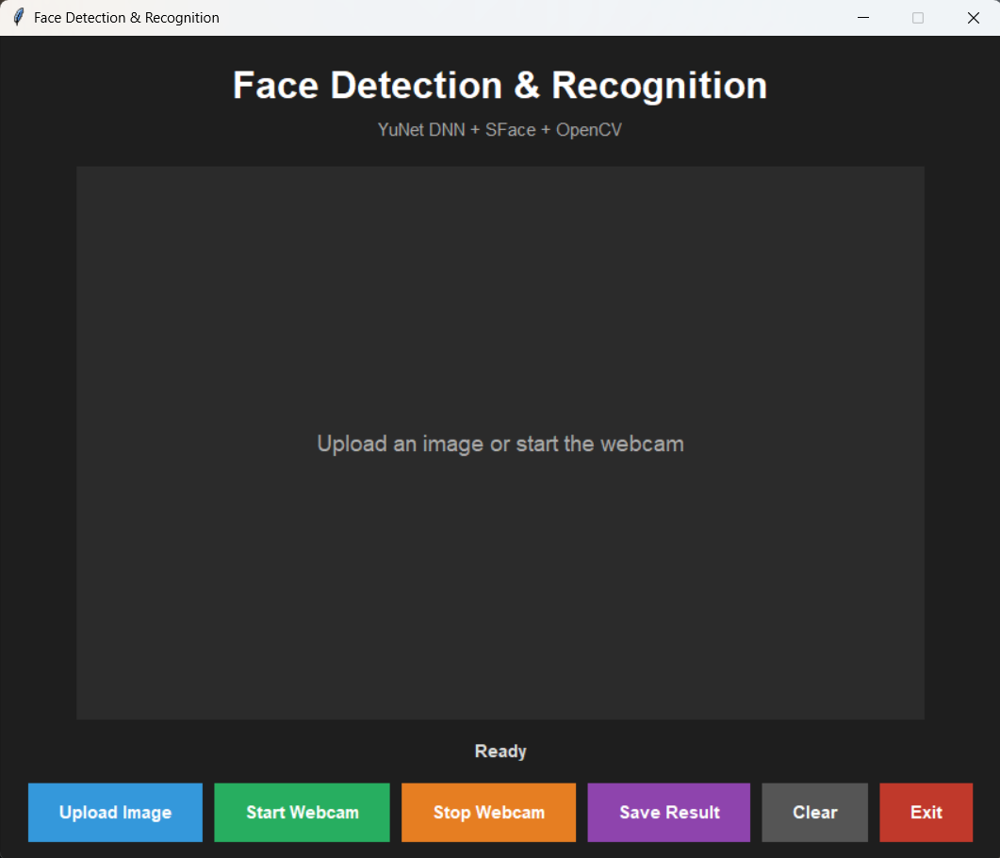
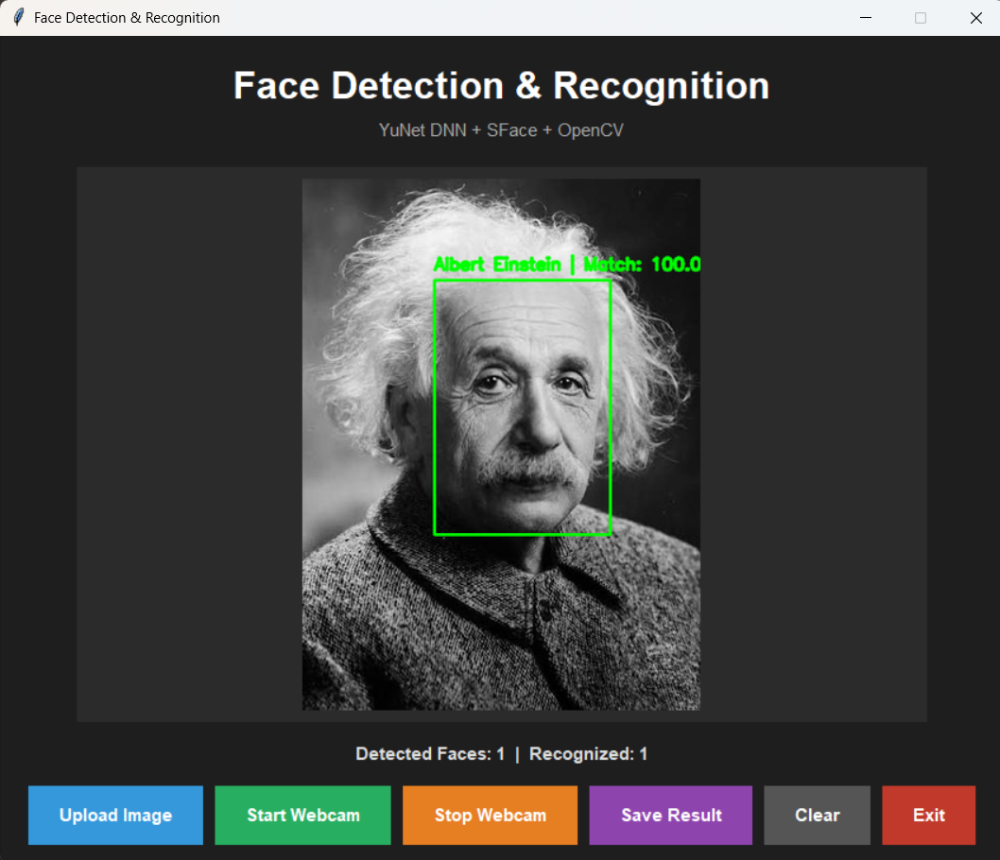
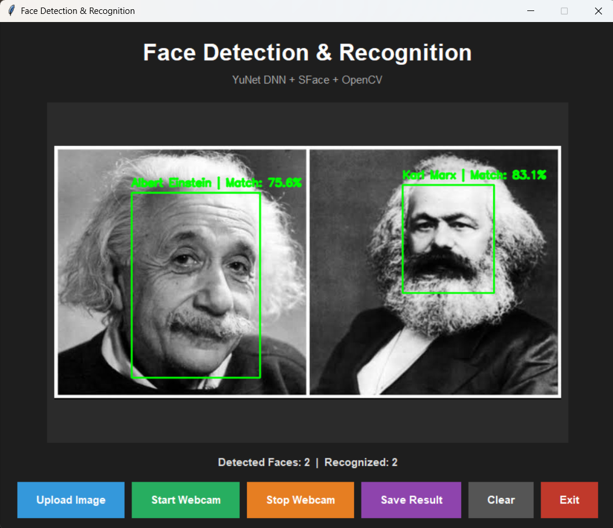
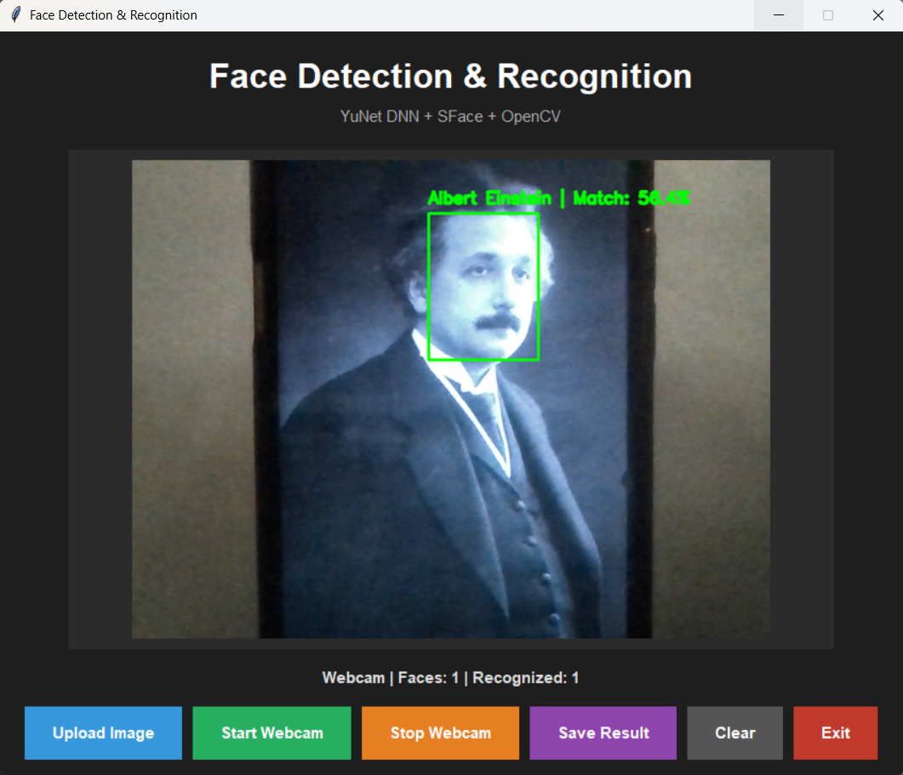
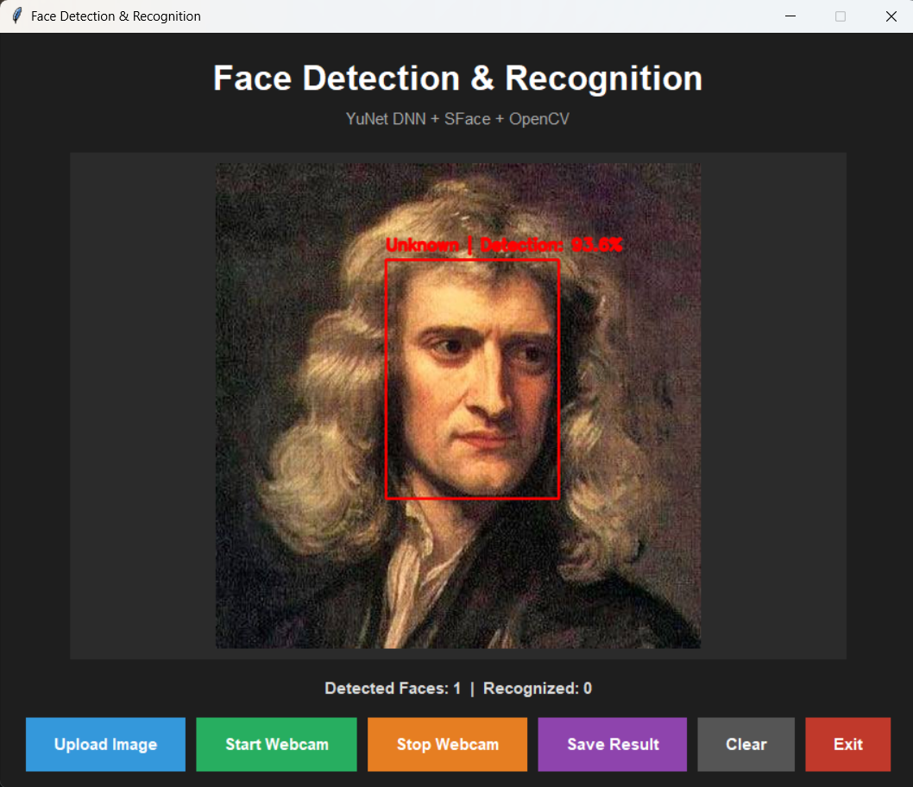

# 🚀 Day 75 - Face Detection & Recognition App

Welcome to **Day 75** of my **100 Days, 100 Python Projects** challenge!

This project is a **Face Detection and Recognition GUI application** built using **Python, OpenCV, NumPy, Pillow, and Tkinter**.

The application can detect faces in images and recognize known people using **OpenCV's YuNet face detection model** and **SFace face recognition model**. It also supports **real-time webcam face detection and recognition**.

The main purpose of this project is to gain practical experience with **Computer Vision, Face Detection, Face Recognition, Deep Learning-based vision models, image processing, and real-time webcam applications**.

---

## 📌 Project Overview

Face detection and face recognition are important applications of Computer Vision.

**Face Detection** identifies where faces are located in an image or video frame, while **Face Recognition** attempts to determine whether a detected face matches one of the known faces stored by the application.

This project combines both techniques into a single desktop application.

The application allows users to:

* 📂 Upload an image
* 👤 Detect faces in the image
* 🧠 Recognize known faces
* ❓ Identify unknown faces
* 👥 Detect and recognize multiple faces
* 📷 Use a webcam for real-time recognition
* 💾 Save processed images
* 🧹 Clear the current image
* 🛑 Stop the webcam
* 🚪 Safely close the application

---

## ✨ Features

* 🖥️ Interactive Tkinter GUI
* 📂 Image upload support
* 👤 Face detection
* 🧠 Face recognition
* 👥 Multiple face detection
* 👥 Multiple face recognition
* ❓ Unknown face detection
* 📷 Real-time webcam recognition
* 🔴 Red bounding box for unknown faces
* 🟢 Green bounding box for recognized faces
* 📊 Face detection confidence
* 📈 Face recognition similarity score
* 💾 Save processed images
* 🧹 Clear image
* 🛑 Start and stop webcam
* ⚠️ Error handling using message boxes
* 🔍 Automatic image resizing for display
* 📁 Folder-based known face management
* 🧠 YuNet DNN face detector
* 🧠 SFace face recognition model
* ⚡ Real-time frame processing using OpenCV

---

## 🖼️ Application Screenshots

## 📸 Screenshots

### 🖥️ Main Application



### 👤 Face Detection & Recognition



### 👥 Multiple Face Recognition



### 📷 Real-Time Webcam Recognition



### ❓ Unknown Face Detection



---

## 🛠️ Technologies Used

* **Python 3**
* **OpenCV**
* **OpenCV Contrib**
* **NumPy**
* **Pillow**
* **Tkinter**
* **YuNet**
* **SFace**
* **ONNX Models**

### Python

Python is used to build the application logic, image processing pipeline, face recognition system, and graphical user interface.

### OpenCV

OpenCV is the main Computer Vision library used in this project.

It is responsible for:

* Reading images
* Capturing webcam frames
* Detecting faces
* Aligning faces
* Extracting face features
* Matching face features
* Drawing bounding boxes
* Saving processed images

### OpenCV Contrib

The `opencv-contrib-python` package provides the additional OpenCV modules required for the **FaceRecognizerSF** functionality used by the SFace model.

### NumPy

NumPy is used for numerical operations and image array processing.

It is used to:

* Process image data
* Convert image formats
* Work with face coordinates
* Process face recognition features
* Calculate image dimensions

### Pillow

Pillow is used to display processed OpenCV images inside the Tkinter GUI.

It provides:

* Image conversion
* Image resizing
* RGB conversion
* Tkinter-compatible image objects

### Tkinter

Tkinter is Python's built-in GUI framework.

It is used to create:

* Application windows
* Buttons
* Labels
* Image display area
* File selection dialogs
* Error messages
* Status information

---

## 🧠 Computer Vision Models

This project uses two pre-trained ONNX models.

### YuNet Face Detection Model

The **YuNet** model is used for detecting faces in images and webcam frames.

The model used in this project is:

```text
face_detection_yunet_2023mar.onnx
````

YuNet identifies faces and provides information such as:

* Face bounding box
* Facial landmarks
* Detection confidence

The detector is initialized using:

```python
detector = cv2.FaceDetectorYN.create(
    DETECTOR_MODEL,
    "",
    (320, 320),
    DETECTION_THRESHOLD,
    NMS_THRESHOLD,
    TOP_K
)
```

---

### SFace Face Recognition Model

The **SFace** model is used to generate facial feature representations and compare faces.

The model used in this project is:

```text
face_recognition_sface_2021dec.onnx
```

The recognizer is initialized using:

```python
recognizer = cv2.FaceRecognizerSF.create(
    RECOGNITION_MODEL,
    ""
)
```

The application uses cosine similarity to compare a detected face against the stored known faces.

---

## 🔄 Face Recognition Workflow

The application follows this general workflow:

```text
Input Image / Webcam Frame
            ↓
       Face Detection
            ↓
     Detect Face Regions
            ↓
       Face Alignment
            ↓
     Feature Extraction
            ↓
 Compare With Known Faces
            ↓
     Cosine Similarity
            ↓
 ┌──────────┴──────────┐
 ↓                     ↓
Known Face         Unknown Face
 ↓                     ↓
Green Box           Red Box
 ↓                     ↓
Person Name        "Unknown"
```

---

## 📂 Known Faces System

The application uses a folder-based system to store known people.

Each person has their own folder inside:

```text
known_faces/
```

For example:

```text
known_faces/
│
├── Person1/
│   ├── photo1.jpg
│   └── photo2.jpg
│
├── Person2/
│   └── photo1.jpg
│
└── Person3/
    └── photo1.jpg
```

The folder name is used as the person's name.

For example:

```text
known_faces/Person1/
```

will result in:

```text
Person1
```

being displayed when a matching face is detected.

---

## 👤 Loading Known Faces

When the application starts, it scans the `known_faces` directory.

The application:

1. Finds all person folders
2. Reads images from each folder
3. Detects faces in the images
4. Selects the largest detected face
5. Aligns the face
6. Extracts the face feature
7. Stores the feature
8. Associates it with the person's folder name

The stored information is maintained in:

```python
known_features
known_names
```

This allows the application to compare new faces against the loaded known faces.

---

## 🔍 Face Detection

The `detect_faces()` function performs face detection.

```python
def detect_faces(image):
    height, width = image.shape[:2]
    detector.setInputSize((width, height))
    _, faces = detector.detect(image)

    if faces is None:
        return []

    return faces
```

The detector returns information about detected faces.

If no face is detected, an empty list is returned.

---

## 🧠 Face Feature Extraction

After detecting a face, the application aligns the face before extracting its feature representation.

The process is:

```text
Detected Face
     ↓
Face Alignment
     ↓
Feature Extraction
     ↓
Face Feature Vector
```

The application uses:

```python
aligned_face = recognizer.alignCrop(image, largest_face)
feature = recognizer.feature(aligned_face)
```

These features are then used for recognition.

---

## 🔗 Face Matching

The application compares a detected face against every known face.

It uses cosine similarity:

```python
score = recognizer.match(
    known_feature,
    feature,
    cv2.FaceRecognizerSF_FR_COSINE
)
```

The highest similarity score is selected.

The project uses:

```python
COSINE_THRESHOLD = 0.363
```

If the best score reaches the threshold, the face is considered recognized.

Otherwise, the application displays:

```text
Unknown
```

---

## 🟢 Recognized Faces

Recognized faces are displayed using a **green bounding box**.

For recognized people, the application displays:

```text
PersonName | Match: XX.X%
```

For example:

```text
Person1 | Match: 82.5%
```

The match score represents the similarity between the detected face and the stored known face feature.

---

## 🔴 Unknown Faces

If a detected face does not meet the recognition threshold, it is classified as:

```text
Unknown
```

Unknown faces are displayed using a **red bounding box**.

The application shows the face detection confidence:

```text
Unknown | Detection: XX.X%
```

This allows the user to distinguish between known and unknown faces.

---

## 👥 Multiple Face Recognition

The application can process multiple faces in the same image.

For each detected face, it:

1. Detects the face
2. Aligns the face
3. Extracts its features
4. Compares it with known faces
5. Determines the best match
6. Draws the corresponding label

Example:

```text
Image
 ↓
Face 1 → Person1
Face 2 → Person2
Face 3 → Unknown
```

The application also displays the total number of detected and recognized faces.

---

## 📷 Real-Time Webcam Recognition

The project supports real-time webcam processing.

When the user clicks:

```text
Start Webcam
```

the application opens the default webcam.

Each frame is processed continuously:

```text
Webcam
   ↓
Capture Frame
   ↓
Flip Frame
   ↓
Detect Faces
   ↓
Recognize Faces
   ↓
Draw Results
   ↓
Display Frame
   ↓
Next Frame
```

The webcam is updated using Tkinter's:

```python
root.after(15, update_webcam)
```

This allows the GUI to continuously process and display webcam frames.

---

## 🛑 Stop Webcam

The **Stop Webcam** button stops real-time processing.

The application:

* Stops the webcam loop
* Releases the camera
* Resets the camera object
* Updates the status message

The camera is released using:

```python
camera.release()
```

---

## 📂 Uploading Images

Users can upload images using the **Upload Image** button.

Supported formats include:

```text
JPG
JPEG
PNG
BMP
WEBP
```

The application loads the selected image using:

```python
cv2.imread(file_path)
```

The image is then processed by the face detection and recognition pipeline.

---

## 💾 Saving Results

Processed images can be saved using the **Save Result** button.

Supported output formats include:

```text
JPG
PNG
```

The application uses:

```python
cv2.imwrite(save_path, current_image)
```

This allows users to save images containing the detected face bounding boxes and recognition labels.

---

## 🖥️ GUI Components Used

The project uses several Tkinter components.

| Component            | Purpose                             |
| -------------------- | ----------------------------------- |
| `Tk()`               | Creates the main application window |
| `Label`              | Displays titles, status and images  |
| `Frame`              | Organizes GUI sections              |
| `Button`             | Performs application actions        |
| `filedialog`         | Selects images and save locations   |
| `messagebox`         | Displays warnings and errors        |
| `ImageTk.PhotoImage` | Displays images inside Tkinter      |
| `root.after()`       | Updates webcam frames               |

---

## ⚙️ Recognition Configuration

The application uses several configuration values.

| Parameter             |   Value | Purpose                             |
| --------------------- | ------: | ----------------------------------- |
| `COSINE_THRESHOLD`    | `0.363` | Face recognition threshold          |
| `DETECTION_THRESHOLD` |   `0.6` | Minimum face detection confidence   |
| `NMS_THRESHOLD`       |   `0.3` | Non-maximum suppression threshold   |
| `TOP_K`               |  `5000` | Maximum number of detection results |

These values control the behavior of the detection and recognition system.

---

## 📂 Project Structure

```text
Day_75/

│
├── main75.py
├── requirements.txt
├── README.md
│
├── models/
│   ├── face_detection_yunet_2023mar.onnx
│   └── face_recognition_sface_2021dec.onnx
│
├── screenshots/
│   ├── face-recognition-main.png
│   ├── image-face-recognition.png
│   ├── multiple-face-recognition.png
│   ├── webcam-recognition.png
│   └── unknown-face.png
│
└── known_faces/
    │
    ├── Person1/
    │   ├── photo1.jpg
    │   └── photo2.jpg
    │
    ├── Person2/
    │   └── photo1.jpg
    │
    └── Person3/
        └── photo1.jpg
```

### File / Folder Description

| File / Folder                         | Purpose                                |
| ------------------------------------- | -------------------------------------- |
| `main75.py`                           | Main Python application                |
| `requirements.txt`                    | Python dependencies                    |
| `README.md`                           | Project documentation                  |
| `models/`                             | Stores the YuNet and SFace ONNX models |
| `face_detection_yunet_2023mar.onnx`   | YuNet face detection model             |
| `face_recognition_sface_2021dec.onnx` | SFace face recognition model           |
| `screenshots/`                        | Application screenshots                |
| `known_faces/`                        | Stores images of known people          |
| `Person1/`, `Person2/`, etc.          | Individual person directories          |
| `photo1.jpg`, `photo2.jpg`            | Reference images for recognition       |

---

## 📦 requirements.txt

The project requires the following Python libraries:

```text
opencv-contrib-python
numpy
Pillow
```

Install all dependencies using:

```bash
pip install -r requirements.txt
```

---

## ▶️ How to Run

### 1. Make sure Python is installed

Check your Python version:

```bash
python --version
```

---

### 2. Open the project folder

Open a terminal inside the `Day_75` folder.

---

### 3. Install the required dependencies

```bash
pip install -r requirements.txt
```

---

### 4. Verify the model files

Make sure the following files are present:

```text
models/face_detection_yunet_2023mar.onnx
models/face_recognition_sface_2021dec.onnx
```

The application requires both models to start.

---

### 5. Add known faces

Create folders inside:

```text
known_faces/
```

For example:

```text
known_faces/
└── Abhijit/
    ├── photo1.jpg
    └── photo2.jpg
```

The folder name will be used as the person's name.

---

### 6. Run the application

```bash
python main75.py
```

The **Face Detection & Recognition** GUI will open.

---

## 📝 How to Add a New Person

To add a new known person:

### Step 1

Create a folder inside:

```text
known_faces/
```

For example:

```text
known_faces/Alice/
```

### Step 2

Add one or more clear face images:

```text
known_faces/Alice/
├── photo1.jpg
├── photo2.jpg
└── photo3.jpg
```

### Step 3

Restart the application.

The application automatically scans the folder and loads the person's face features.

---

## 🧪 Example Recognition Process

Suppose the folder structure contains:

```text
known_faces/
├── Person1/
│   └── photo1.jpg
├── Person2/
│   └── photo1.jpg
└── Person3/
    └── photo1.jpg
```

When an image containing Person1 is uploaded:

```text
Detected Face
      ↓
Feature Extraction
      ↓
Compare With Person1
      ↓
Compare With Person2
      ↓
Compare With Person3
      ↓
Highest Similarity
      ↓
Person1
```

The application then displays a green bounding box around the recognized face.

---

## ❓ Unknown Face Detection

If the uploaded image contains a person who is not present in the `known_faces` directory, the application does not assign a known name.

Instead, it displays:

```text
Unknown
```

with a red bounding box.

This prevents every detected face from automatically being assigned to a known person.

---

## 📊 Application Status

The application displays useful status information.

For uploaded images:

```text
Detected Faces: 3 | Recognized: 2
```

For webcam processing:

```text
Webcam | Faces: 2 | Recognized: 1
```

This provides a quick overview of the recognition results.

---

## ⚠️ Error Handling

The application handles several possible errors.

Examples include:

* Model files missing
* Unable to open image
* Webcam unavailable
* Invalid image
* No image available to save
* Image processing errors
* Recognition errors

The application uses Tkinter message boxes to display appropriate warnings and errors.

---

## 🧹 Clear Function

The **Clear** button resets the current application state.

It:

* Removes the displayed image
* Clears the current processed image
* Resets the status
* Allows the user to start another recognition task

The application does not need to be restarted after clearing an image.

---

## 🔄 Application Workflow

The complete application workflow can be summarized as:

```text
Start Application
       ↓
Load YuNet + SFace Models
       ↓
Load Known Faces
       ↓
Display GUI
       ↓
 ┌─────┴─────┐
 ↓           ↓
Upload       Webcam
Image        Mode
 ↓           ↓
Face Detection
       ↓
Face Alignment
       ↓
Feature Extraction
       ↓
Face Matching
       ↓
 ┌─────┴─────┐
 ↓           ↓
Known      Unknown
 ↓           ↓
Green Box   Red Box
 ↓           ↓
Name +      Unknown +
Match Score Detection Score
```

---

## 🧩 Libraries and Functions Practiced

### OpenCV

| Function / Class                | Purpose                     |
| ------------------------------- | --------------------------- |
| `cv2.imread()`                  | Reads images                |
| `cv2.imwrite()`                 | Saves processed images      |
| `cv2.VideoCapture()`            | Accesses webcam             |
| `cv2.cvtColor()`                | Converts image color spaces |
| `cv2.flip()`                    | Flips webcam frames         |
| `cv2.rectangle()`               | Draws face bounding boxes   |
| `cv2.putText()`                 | Adds text to images         |
| `cv2.FaceDetectorYN.create()`   | Creates YuNet face detector |
| `cv2.FaceRecognizerSF.create()` | Creates SFace recognizer    |
| `detector.detect()`             | Detects faces               |
| `recognizer.alignCrop()`        | Aligns detected faces       |
| `recognizer.feature()`          | Extracts face features      |
| `recognizer.match()`            | Compares face features      |

### NumPy

| Function     | Purpose                          |
| ------------ | -------------------------------- |
| `np.int32()` | Converts coordinates to integers |
| `np.array()` | Handles image/feature arrays     |
| `max()`      | Selects the largest face         |

### Pillow

| Function / Class           | Purpose                     |
| -------------------------- | --------------------------- |
| `Image.fromarray()`        | Converts NumPy image arrays |
| `Image.resize()`           | Resizes images              |
| `Image.Resampling.LANCZOS` | High-quality image resizing |
| `ImageTk.PhotoImage()`     | Displays images in Tkinter  |

### Tkinter

| Component      | Purpose                    |
| -------------- | -------------------------- |
| `Tk()`         | Creates application window |
| `Label`        | Displays text/images       |
| `Frame`        | Organizes interface        |
| `Button`       | Performs actions           |
| `filedialog`   | Selects files              |
| `messagebox`   | Displays messages          |
| `root.after()` | Schedules webcam updates   |

---

## 📚 Concepts Practiced

* Python Programming
* Computer Vision
* Face Detection
* Face Recognition
* OpenCV
* OpenCV DNN
* YuNet
* SFace
* ONNX Models
* Facial Feature Extraction
* Face Alignment
* Cosine Similarity
* Image Processing
* Webcam Processing
* Real-Time Computer Vision
* Multiple Face Detection
* Multiple Face Recognition
* Unknown Face Detection
* Tkinter GUI Development
* File Handling
* Image Loading
* Image Saving
* Error Handling
* GUI Event Handling
* Real-Time Frame Processing
* Model-Based Computer Vision

---

## 🎯 Learning Outcome

This project helped me understand:

* How face detection works in Computer Vision
* How face recognition differs from face detection
* How to use OpenCV's YuNet face detector
* How to use the SFace face recognition model
* How ONNX-based Computer Vision models can be used with OpenCV
* How to detect multiple faces in an image
* How to extract facial feature representations
* How to compare facial features using cosine similarity
* How to create a known-face database using folders
* How to recognize known people from reference images
* How to identify unknown faces
* How to process webcam frames in real time
* How to display OpenCV images inside Tkinter
* How to save processed images
* How to handle webcam resources correctly
* How to build a complete Computer Vision desktop application
* How Computer Vision models can be integrated into Python applications

---

## 🔮 Future Improvements

Possible enhancements for future versions:

* 👤 Add a GUI for registering new people
* 📸 Capture known-face images directly from the webcam
* 🗑️ Add a GUI for removing known people
* 📊 Display recognition statistics
* 📈 Add recognition history
* 🕐 Add timestamped recognition logs
* 📁 Store recognition results in CSV
* 🗄️ Add a database for known users
* 🔐 Add user authentication
* 🎯 Improve recognition threshold configuration
* 📷 Add camera selection
* ⚡ Improve real-time processing performance
* 🖼️ Support batch image processing
* 🎥 Add video file recognition
* 📹 Save recognized webcam sessions
* 🔊 Add audio notifications for recognized faces
* 🧠 Explore additional face recognition models
* 🎨 Improve GUI design
* 🌙 Add Dark/Light Mode
* 📊 Add face recognition analytics
* 🧑‍🤝‍🧑 Add a dedicated person-management interface

---

## 🔐 Privacy Considerations

Face recognition involves biometric information, so the application should be used responsibly.

The `known_faces` directory contains reference images used by the application for recognition. These images should only be used with appropriate permission and should be stored securely.

This project is intended primarily as an educational Computer Vision application.

---

## 📅 Challenge

This project is part of my **100 Days, 100 Python Projects** challenge, where I build one Python project every day to improve my Python programming skills, strengthen my problem-solving abilities, learn new technologies, and maintain consistency through daily coding.

**Day 75** focuses on **Computer Vision and Face Recognition**, combining **OpenCV, YuNet, SFace, NumPy, Pillow, and Tkinter** to create a practical face detection and recognition application with both image and real-time webcam support.

---

## 👨‍💻 Author

**Abhijit Munghate**

Happy Coding! 🚀🐍👤📷