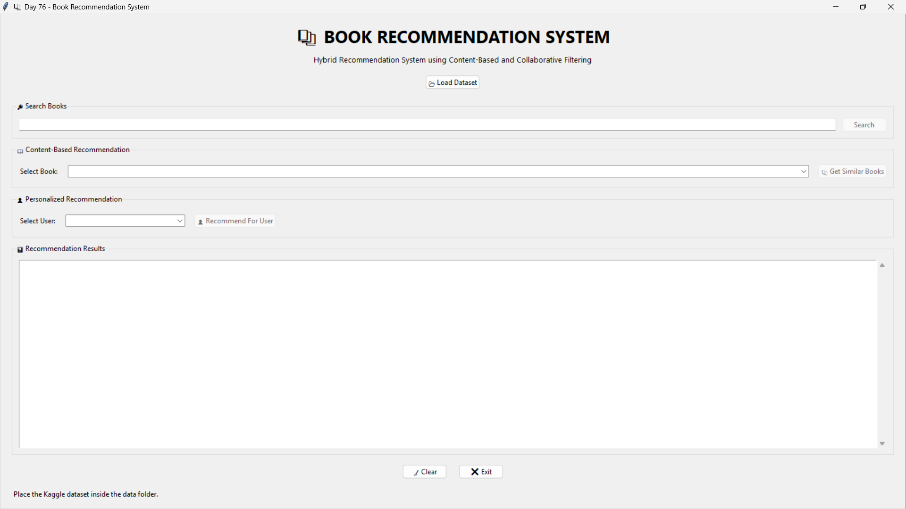
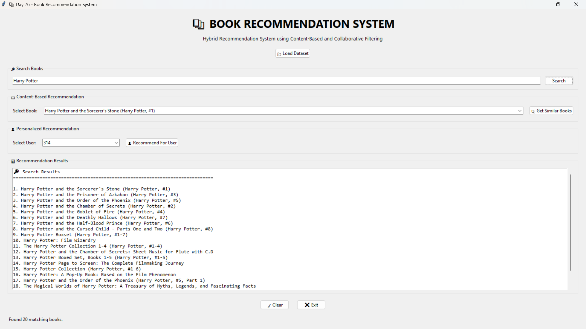
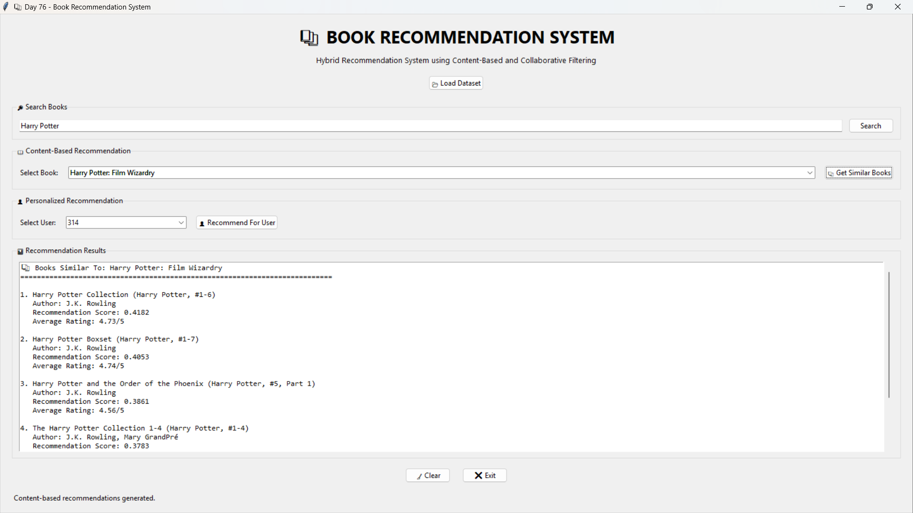
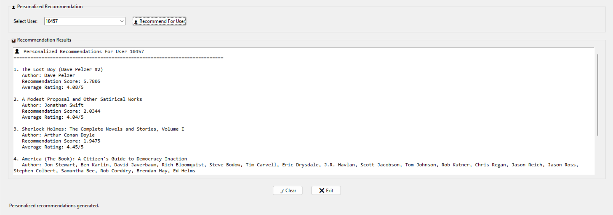

# 🚀 Day 76 - Hybrid Book Recommendation System

Welcome to **Day 76** of my **100 Days, 100 Python Projects** challenge!

This project is a **Hybrid Book Recommendation System** built using **Python, Tkinter, Pandas, NumPy, Scikit-learn, and SciPy**.

The application combines **Content-Based Filtering** and **Collaborative Filtering** to recommend books to users.

The system allows users to:

* 📚 Find books similar to a selected book
* 👤 Get personalized book recommendations for a selected user
* 🔎 Search for books by title
* 📊 View recommendation scores and average ratings
* 📂 Load book and rating datasets
* 🧹 Clear search and recommendation results

The main purpose of this project is to gain practical experience with **Recommendation Systems, Machine Learning, Data Processing, TF-IDF, Cosine Similarity, and Collaborative Filtering**.

---

## 📌 Project Overview

Recommendation systems are widely used by platforms such as online bookstores, streaming services, shopping websites, and social media platforms.

They analyze available data and suggest items that may be relevant to a user.

This project implements two recommendation approaches:

### 📖 Content-Based Filtering

Content-based filtering recommends books that are similar to a book selected by the user.

The system uses:

* Book titles
* Authors
* TF-IDF vectorization
* Cosine similarity

For example, if a user selects a particular programming or machine learning book, the system finds other books with similar title and author information.

### 👤 Collaborative Filtering

Collaborative filtering recommends books based on the behavior of other users.

The system:

1. Creates a user-book rating matrix.
2. Finds users with similar rating patterns.
3. Identifies books highly rated by similar users.
4. Excludes books already rated by the selected user.
5. Calculates recommendation scores.
6. Displays the recommended books.

By combining both approaches, the project demonstrates the basic architecture of a **hybrid recommendation system**.

---

## ✨ Features

* 🖥️ Interactive Tkinter GUI
* 📂 Load book dataset
* 📂 Load user rating dataset
* 🔎 Search books by title
* 📖 Content-based recommendations
* 👤 Personalized user recommendations
* 🤝 Similar-user analysis
* 📊 TF-IDF vectorization
* 📐 Cosine similarity
* ⭐ Average book ratings
* 📈 Recommendation scores
* 🔢 Select from thousands of books
* 👥 Select users from the rating dataset
* 📋 Scrollable recommendation results
* ⚠️ Input validation
* 🚨 Error handling using message boxes
* 🧹 Clear results
* ❌ Exit application
* 📊 Dataset loading status
* 🔄 Hybrid recommendation approach

---

## 🖼️ Application Screenshots

## 📸 Screenshots

### 🖥️ Main Application



### 🔎 Book Search



### 📚 Content-Based Recommendations



### 👤 Personalized Recommendations



---

## 🛠️ Technologies Used

* **Python 3**
* **Tkinter**
* **Pandas**
* **NumPy**
* **Scikit-learn**
* **SciPy**

### Python

Python is used to develop the complete recommendation system, including:

* Data processing
* Recommendation algorithms
* GUI logic
* File handling
* Error handling

### Tkinter

Tkinter is used to create the desktop graphical user interface.

The application uses Tkinter for:

* Labels
* Buttons
* Text boxes
* Combo boxes
* Frames
* Scrollbars
* Message boxes
* Dataset controls

### Pandas

Pandas is used for loading and processing the book and rating datasets.

It is responsible for:

* Reading CSV files
* Selecting required columns
* Cleaning missing values
* Processing book information
* Filtering ratings
* Accessing recommendation data

### NumPy

NumPy is used for numerical operations and array processing.

It is also used for:

* Finding similar users
* Sorting similarity scores
* Processing rating values
* Managing recommendation calculations

### Scikit-learn

Scikit-learn provides the machine learning components used in the recommendation system.

The project uses:

* `TfidfVectorizer`
* `cosine_similarity`

TF-IDF is used for converting book information into numerical vectors.

Cosine similarity is then used to determine how similar books or users are.

### SciPy

SciPy is used to create a sparse user-book rating matrix.

The project uses:

```python
csr_matrix()
```

This allows the application to efficiently store the large number of mostly empty user-book ratings.

---

## 📂 Project Structure

```text
Day76_Recommendation_System/

│
├── main76.py
├── requirements.txt
├── README.md
│
├── data/
│   ├── books.csv
│   ├── ratings.csv
│   ├── book_tags.csv
│   └── tags.csv
│
└── screenshots/
    ├── main-gui.png
    ├── content-recommendations.png
    ├── user-recommendations.png
    └── search-book.png
```

### File Description

| File / Folder      | Purpose                                |
| ------------------ | -------------------------------------- |
| `main76.py`        | Main recommendation system application |
| `requirements.txt` | Python dependencies                    |
| `README.md`        | Project documentation                  |
| `data/`            | Dataset files                          |
| `books.csv`        | Book information                       |
| `ratings.csv`      | User-book rating information           |
| `book_tags.csv`    | Book tag information from the dataset  |
| `tags.csv`         | Tag information                        |
| `screenshots/`     | Application screenshots                |

---

## 📊 Dataset

This project uses a book recommendation dataset containing information about books and user ratings.

The main files used by the application are:

### `books.csv`

This file contains book-related information such as:

* Book ID
* Book title
* Authors
* Average rating
* Number of ratings
* Original publication year

The application requires the following columns:

```text
book_id
title
authors
average_rating
ratings_count
original_publication_year
```

### `ratings.csv`

This file contains user rating information.

The application uses:

```text
user_id
book_id
rating
```

These ratings are used to build the collaborative filtering model.

### `book_tags.csv`

Contains book-tag relationships from the dataset.

### `tags.csv`

Contains information about available tags.

The current implementation primarily uses `books.csv` and `ratings.csv` for generating recommendations.

---

## 📦 requirements.txt

The project requires the following Python libraries:

```text
pandas
numpy
scikit-learn
scipy
Pillow
```

Install all dependencies using:

```bash
pip install -r requirements.txt
```

### Why Pillow?

Pillow is included as a dependency for image-processing support and compatibility with the project's Python environment.

---

## ▶️ How to Run

### 1. Make sure Python is installed

Check your Python version:

```bash
python --version
```

### 2. Open the project folder

Open a terminal inside the `Day76_Recommendation_System` folder.

### 3. Place the dataset files

Make sure the dataset is placed inside:

```text
data/
```

The required files are:

```text
data/books.csv
data/ratings.csv
```

The complete dataset folder can contain:

```text
data/
├── books.csv
├── ratings.csv
├── book_tags.csv
└── tags.csv
```

### 4. Install dependencies

Run:

```bash
pip install -r requirements.txt
```

### 5. Run the application

Run:

```bash
python main76.py
```

The **Book Recommendation System** GUI will open.

---

# 📂 Loading the Dataset

When the application starts, the dataset is not loaded automatically.

Click:

```text
📂 Load Dataset
```

The application then:

1. Checks whether `books.csv` exists.
2. Checks whether `ratings.csv` exists.
3. Loads the book dataset.
4. Validates required columns.
5. Cleans missing values.
6. Builds the TF-IDF model.
7. Loads the rating dataset.
8. Builds the user-book rating matrix.
9. Loads book titles into the book selection box.
10. Loads user IDs into the user selection box.

After successful loading, the application displays information such as:

```text
Loaded X books and X ratings.
```

---

# 🔎 Book Search

The application includes a book search feature.

Users can enter part of a book title into the search box.

For example:

```text
Harry Potter
```

The application searches through the available book titles.

If matching books are found, they are displayed in the results section.

The application displays up to **20 matching books**.

### Search Process

```text
User enters search term
        ↓
Convert search term to lowercase
        ↓
Compare with available book titles
        ↓
Find matching titles
        ↓
Display search results
```

---

# 📖 Content-Based Recommendation

The first recommendation method is **Content-Based Filtering**.

The system recommends books based on their content information.

In this project, the content is created using:

```text
Book Title + Author
```

The application creates a combined field:

```python
books_df["content"] = (
    books_df["title"] + " " + books_df["authors"]
)
```

---

## 🧮 TF-IDF Vectorization

The combined book information is converted into numerical vectors using:

```python
TfidfVectorizer(
    stop_words="english",
    max_features=20000
)
```

TF-IDF stands for:

**Term Frequency-Inverse Document Frequency**

It converts text into numerical representations based on the importance of words.

The resulting vectors are stored in:

```python
tfidf_matrix
```

---

## 📐 Cosine Similarity

After converting books into TF-IDF vectors, the application calculates similarity using:

```python
cosine_similarity()
```

Cosine similarity measures how similar two vectors are.

The system compares the selected book against all available books.

The books with the highest similarity scores are selected as recommendations.

---

## 📚 Content-Based Recommendation Process

```text
User selects a book
        ↓
Find selected book index
        ↓
Get TF-IDF vector
        ↓
Calculate cosine similarity
        ↓
Compare with all books
        ↓
Sort similarity scores
        ↓
Remove selected book
        ↓
Select top 5 books
        ↓
Display recommendations
```

The system generates:

```text
5 recommendations
```

by default.

---

# 👤 Personalized Recommendation

The second recommendation method uses **Collaborative Filtering**.

Instead of looking at book titles and authors, this approach looks at how users have rated books.

The system creates a:

**User-Book Rating Matrix**

where:

* Rows represent users
* Columns represent books
* Values represent ratings

---

## 🤝 User Similarity

The system compares the rating patterns of users using cosine similarity.

For example:

```text
User A → 5, 4, 5, 2, 4
User B → 5, 4, 4, 2, 5
```

If two users have similar rating patterns, their similarity score will be higher.

The system identifies similar users and uses their highly rated books to generate recommendations.

---

# 🧠 Similar User Selection

The application searches for users with similar rating patterns.

The system considers up to:

```text
20 similar users
```

as defined by:

```python
SIMILAR_USERS = 20
```

Users with zero similarity are ignored.

The remaining users are sorted according to their similarity score.

---

# ⭐ Recommendation Scoring

For similar users, the application checks their ratings.

Only books with ratings of:

```text
4 or higher
```

are considered for recommendation.

The recommendation score is calculated using:

```text
Similarity Score × Rating
```

This gives greater importance to highly rated books from users who are more similar to the selected user.

---

# 🚫 Excluding Already Rated Books

The application does not recommend books that the selected user has already rated.

The system first identifies books already rated by the target user.

These books are then excluded from the recommendation process.

This helps generate recommendations for books that are new to the selected user.

---

# 👤 Personalized Recommendation Process

```text
User selects a user ID
        ↓
Find user's rating vector
        ↓
Calculate similarity with other users
        ↓
Find similar users
        ↓
Select up to 20 similar users
        ↓
Find highly rated books
        ↓
Remove books already rated
        ↓
Calculate recommendation scores
        ↓
Sort recommendations
        ↓
Display top 5 books
```

---

# 🔀 Hybrid Recommendation System

The main purpose of this project is to demonstrate two different recommendation approaches in one application.

The application provides:

### Content-Based Filtering

Uses:

```text
Book Title
+
Author
↓
TF-IDF
↓
Cosine Similarity
↓
Similar Books
```

### Collaborative Filtering

Uses:

```text
User Ratings
↓
User-Book Matrix
↓
User Similarity
↓
Highly Rated Books
↓
Personalized Recommendations
```

This combination makes the application a **hybrid recommendation system**.

---

# 📊 Recommendation Results

The recommendation results display:

```text
Book Title
Author
Recommendation Score
Average Rating
```

For example:

```text
1. Example Book
   Author: Example Author
   Recommendation Score: 0.8521
   Average Rating: 4.25/5
```

This makes it easier for the user to understand why a particular book appeared in the recommendation list.

---

# 🖥️ GUI Components

The application uses several Tkinter components.

| Component    | Purpose                                  |
| ------------ | ---------------------------------------- |
| `Tk()`       | Creates the main application window      |
| `Label`      | Displays headings and status information |
| `Button`     | Performs application actions             |
| `Entry`      | Accepts book search text                 |
| `Combobox`   | Selects books and users                  |
| `LabelFrame` | Organizes application sections           |
| `Text`       | Displays recommendation results          |
| `Scrollbar`  | Scrolls through recommendation results   |
| `messagebox` | Displays warnings and errors             |

---

# 🔘 Main Application Controls

### 📂 Load Dataset

Loads:

```text
books.csv
ratings.csv
```

and prepares the recommendation models.

### 🔎 Search

Searches the available book titles.

### 📚 Get Similar Books

Generates content-based recommendations for the selected book.

### 👤 Recommend For User

Generates personalized recommendations for the selected user.

### 🧹 Clear

Clears:

* Search field
* Recommendation results
* Selected user
* Book selection

### ❌ Exit

Closes the application.

---

# 🧩 Important Functions

## `load_data()`

Loads and prepares the datasets.

It handles:

* CSV loading
* Column validation
* Missing values
* TF-IDF model creation
* Rating matrix creation
* GUI data population

---

## `recommend_books()`

Generates content-based book recommendations using:

```python
TF-IDF
```

and:

```python
cosine_similarity()
```

---

## `recommend_for_user()`

Generates personalized recommendations using:

```text
User similarity
+
Rating information
```

---

## `display_results()`

Displays recommendation results inside the Tkinter text area.

---

## `search_book()`

Searches the dataset for matching book titles.

---

## `clear_results()`

Resets the current search and recommendation results.

---

# 📚 Libraries and Functions Practiced

## Pandas

| Function / Feature | Purpose                            |
| ------------------ | ---------------------------------- |
| `pd.read_csv()`    | Loads CSV datasets                 |
| `DataFrame.copy()` | Creates a copy of data             |
| `fillna()`         | Handles missing values             |
| `pd.to_numeric()`  | Converts columns to numeric values |
| `unique()`         | Gets unique users                  |
| `isin()`           | Filters matching IDs               |
| `iloc[]`           | Accesses rows                      |

## NumPy

| Function / Feature | Purpose                     |
| ------------------ | --------------------------- |
| `np.argsort()`     | Sorts similarity scores     |
| `np.float32`       | Efficient numerical storage |
| Arrays             | Stores numerical data       |

## Scikit-learn

| Function / Class      | Purpose                           |
| --------------------- | --------------------------------- |
| `TfidfVectorizer`     | Converts text into TF-IDF vectors |
| `cosine_similarity()` | Measures similarity               |

## SciPy

| Function       | Purpose                        |
| -------------- | ------------------------------ |
| `csr_matrix()` | Creates a sparse rating matrix |

## Tkinter

| Component    | Purpose           |
| ------------ | ----------------- |
| `Tk()`       | Main window       |
| `Label`      | Text display      |
| `Button`     | User actions      |
| `Entry`      | Search input      |
| `Combobox`   | Selection         |
| `Text`       | Results display   |
| `Scrollbar`  | Result navigation |
| `LabelFrame` | GUI organization  |

---

# ⚠️ Error Handling

The application includes error handling for common problems.

Examples include:

### Missing Dataset

If `books.csv` or `ratings.csv` is missing, the application displays an error message.

### Missing Columns

The application checks for required columns such as:

```text
book_id
title
authors
```

### Empty Search

If the user clicks Search without entering anything:

```text
Enter a book title to search.
```

is displayed.

### Dataset Not Loaded

If the user tries to generate recommendations before loading the dataset, the application displays a warning.

### Invalid User

If a selected user is not available in the dataset, no recommendations are generated.

---

# 🧹 Clear Function

The **Clear** button resets the current application state.

It:

* Clears the search field
* Restores the complete book list
* Resets the selected user
* Clears recommendation results
* Resets the status message

This allows users to start another recommendation search without restarting the application.

---

# 📈 Recommendation Parameters

The application uses the following parameters:

```python
CONTENT_RECOMMENDATIONS = 5
USER_RECOMMENDATIONS = 5
SIMILAR_USERS = 20
```

### Content Recommendations

The system displays up to:

```text
5 similar books
```

### User Recommendations

The system displays up to:

```text
5 personalized books
```

### Similar Users

The collaborative filtering system considers up to:

```text
20 similar users
```

---

# 🔄 Complete Application Workflow

```text
Start Application
        ↓
Load Dataset
        ↓
Validate CSV Files
        ↓
Load Books
        ↓
Create TF-IDF Matrix
        ↓
Load Ratings
        ↓
Create User-Book Matrix
        ↓
User Searches / Selects Book
        ↓
Content-Based Recommendation
        ↓
OR
        ↓
User Selects User ID
        ↓
Collaborative Recommendation
        ↓
Calculate Similarity
        ↓
Generate Recommendations
        ↓
Display Results
```

---

# 📚 Concepts Practiced

* Python Programming
* Machine Learning Basics
* Recommendation Systems
* Content-Based Filtering
* Collaborative Filtering
* Hybrid Recommendation Systems
* TF-IDF
* Cosine Similarity
* Sparse Matrices
* User-Item Matrices
* Data Cleaning
* CSV Data Processing
* Pandas
* NumPy
* Scikit-learn
* SciPy
* Tkinter GUI Development
* File Handling
* Exception Handling
* Search Functionality
* Data Filtering
* Similarity Analysis
* Recommendation Scoring

---

# 🎯 Learning Outcome

This project helped me understand:

* How recommendation systems work
* How content-based filtering can recommend similar items
* How collaborative filtering uses user behavior
* How TF-IDF converts text into numerical vectors
* How cosine similarity measures similarity
* How to create a user-book rating matrix
* How sparse matrices can efficiently store rating data
* How to identify similar users
* How to generate personalized recommendations
* How to exclude already-rated books
* How recommendation scores can be calculated
* How to process large CSV datasets using Pandas
* How to build a desktop recommendation application using Tkinter
* How different recommendation techniques can be combined into a hybrid system

---

# 🔮 Future Improvements

Possible enhancements for future versions:

* 🤖 Add a more advanced hybrid recommendation algorithm
* ⭐ Allow users to provide their own ratings
* ❤️ Add favorites and reading lists
* 📚 Recommend books using genres and tags
* 🏷️ Use `book_tags.csv` and `tags.csv` for richer content recommendations
* 👤 Create user profiles
* 📊 Add recommendation statistics
* 📈 Add rating distribution charts
* 🔍 Improve book search
* 🖼️ Display book covers
* 📖 Show detailed book information
* 🌐 Build a web version
* 🔐 Add user authentication
* 💾 Store user preferences
* 🧠 Experiment with matrix factorization
* 🤖 Implement SVD-based collaborative filtering
* 🧮 Add weighted hybrid scoring
* 📱 Create a responsive web interface
* ☁️ Deploy the recommendation system online

---

# 🚀 Future Hybrid Recommendation Approach

A future version could combine the two recommendation scores.

For example:

```text
Final Score =
(Content Similarity × Weight 1)
+
(Collaborative Score × Weight 2)
```

This would allow the system to combine:

```text
Book Similarity
+
User Preferences
```

into a single recommendation score.

This would make the project a more advanced recommendation-system implementation.

---

# 📅 100 Days Challenge

This project is part of my **100 Days, 100 Python Projects** challenge.

The goal of this challenge is to build one Python project every day to improve:

* Python programming skills
* Problem-solving abilities
* Machine learning knowledge
* Data processing skills
* GUI development
* Practical project-building experience

**Day 76** focuses on **Recommendation Systems**, combining **Pandas for data processing**, **Scikit-learn for TF-IDF and similarity calculations**, **SciPy for sparse matrices**, and **Tkinter for GUI development**.

---

# 👨‍💻 Author

**Abhijit Munghate**

Happy Coding! 🚀🐍📚
