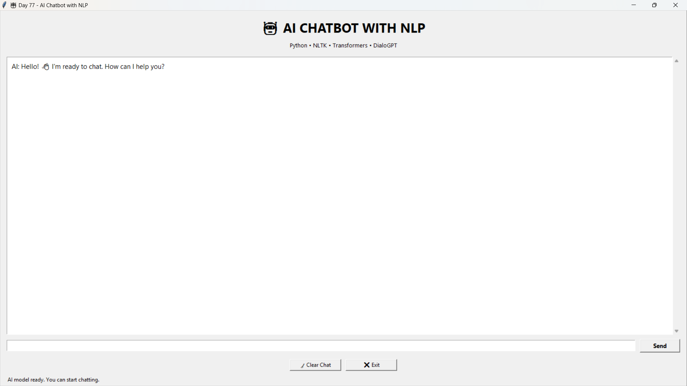
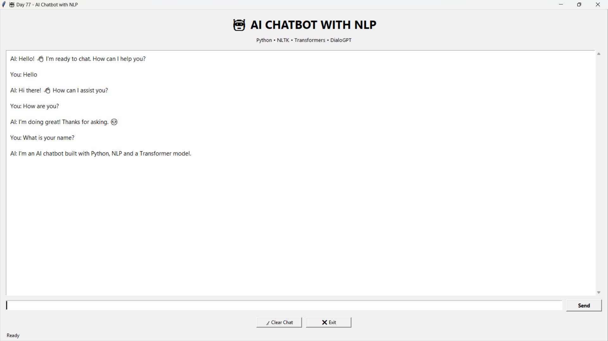
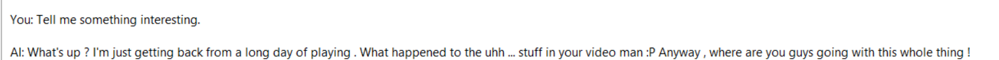

# 🤖 Day 77 - AI Chatbot with NLP

Welcome to **Day 77** of my **100 Days, 100 Python Projects** challenge!

This project is an **AI Chatbot with NLP** built using **Python, Tkinter, NLTK, PyTorch, Hugging Face Transformers, and Microsoft's DialoGPT-small model**.

The chatbot combines **rule-based responses** with a **Transformer-based conversational AI model**. It can handle common messages using predefined responses and generate dynamic conversational responses using **DialoGPT**.

The project also uses **multithreading** to load the AI model and generate responses in the background, keeping the graphical interface responsive.

---

## 📌 Project Overview

Chatbots are software applications that interact with users through natural language.

This project demonstrates how **Natural Language Processing (NLP)** and **Transformer-based language models** can be combined with a desktop GUI to create a conversational AI application.

The chatbot provides two response mechanisms:

1. 💬 **Rule-Based Responses**
   Common messages such as greetings, thanks, help, and goodbye are handled using predefined responses.

2. 🤖 **AI-Generated Responses**
   Other messages are processed by the **DialoGPT-small** conversational language model.

The application provides a simple Tkinter interface where users can type messages, receive responses, clear conversations, and exit the application.

---

## ✨ Features

* 🤖 AI-powered conversational chatbot
* 💬 Rule-based responses for common messages
* 🧠 Transformer-based response generation
* 🤗 Hugging Face Transformers integration
* 🗣️ Microsoft DialoGPT-small model
* 📝 NLTK-based text preprocessing
* 🔤 Tokenization using NLTK
* 🚫 Stopword removal
* 🧹 Basic text cleaning
* 🖥️ Interactive Tkinter GUI
* 💭 Conversation history
* 🧵 Background model loading
* ⚡ Background AI response generation
* 🔄 Clear chat functionality
* ⌨️ Enter key support for sending messages
* 🚪 Exit button
* 📊 Model loading status
* ⚠️ Error handling
* 🚨 Message-box notifications
* 🌐 Automatic NLTK resource setup
* 📦 Easy dependency installation using `requirements.txt`

---

## 🖼️ Application Screenshots

## 📸 Screenshots

### 🖥️ Main Application



The main interface provides the chat area, message input field, Send button, Clear Chat button, Exit button, and model status.

### 💬 Rule-Based Response



Common messages such as greetings, thanks, and help are handled using predefined responses without requiring AI model generation.

### 🤖 AI-Generated Response



Messages that are not handled by the rule-based system are passed to DialoGPT to generate a conversational response.

---

## 🛠️ Technologies Used

* **Python 3**
* **Tkinter**
* **NLTK**
* **PyTorch**
* **Hugging Face Transformers**
* **DialoGPT-small**
* **SentencePiece**

---

## 🐍 Python

Python is used to develop the complete application, including:

* GUI development
* NLP preprocessing
* Model loading
* Conversation management
* AI response generation
* Thread management
* Error handling

---

## 🖥️ Tkinter

Tkinter is used to create the desktop graphical user interface.

The application uses Tkinter components such as:

* `Tk()`
* `Frame`
* `Label`
* `Entry`
* `Button`
* `ScrolledText`
* `messagebox`

The GUI provides a simple interface for chatting with the AI model.

---

## 🧠 Natural Language Processing

The project uses **NLTK (Natural Language Toolkit)** for basic NLP preprocessing.

The `clean_text()` function performs several preprocessing operations:

1. Converts text to lowercase
2. Removes special characters
3. Tokenizes the text
4. Removes English stopwords
5. Reconstructs the cleaned text

Example:

```text
Original:
Hello! How are you doing today?

After preprocessing:
hello doing today
```

The project also automatically checks whether the required NLTK resources are available.

---

## 📚 NLTK Resources

The application checks and downloads the following resources when required:

```text
punkt
punkt_tab
stopwords
```

This is handled through the `setup_nltk()` function.

The application attempts to download missing resources automatically so that the user does not have to manually download them.

---

## 🤗 Hugging Face Transformers

The project uses the **Transformers** library to load and use the DialoGPT conversational language model.

The following classes are used:

```python
AutoTokenizer
AutoModelForCausalLM
```

The tokenizer converts text into tokens that the model can process, while the causal language model generates the chatbot's response.

---

## 🤖 DialoGPT

The chatbot uses:

```python
MODEL_NAME = "microsoft/DialoGPT-small"
```

DialoGPT is a conversational language model designed for generating dialogue responses.

The model is loaded using:

```python
tokenizer = AutoTokenizer.from_pretrained(MODEL_NAME)
model = AutoModelForCausalLM.from_pretrained(MODEL_NAME)
```

The model is then switched to evaluation mode:

```python
model.eval()
```

---

## 🔄 Chatbot Processing Flow

The application follows this general workflow:

```text
User enters message
        ↓
Message displayed in chat
        ↓
Check for exit commands
        ↓
Check rule-based responses
        ↓
 ┌───────────────┐
 │ Match found?  │
 └───────┬───────┘
       Yes │ No
          ↓   ↓
   Rule Response
              ↓
       Check AI Model
              ↓
       Tokenize Input
              ↓
       Add Conversation History
              ↓
       DialoGPT Generation
              ↓
       Decode Response
              ↓
       Display AI Response
```

This approach allows simple messages to be answered quickly while more general messages are processed by the AI model.

---

## 💬 Rule-Based Chatbot

Before using the AI model, the application checks whether the user's message matches a predefined response.

The chatbot contains responses for messages such as:

```text
hello
hi
hey
how are you
what is your name
who are you
thanks
thank you
bye
goodbye
help
```

For example:

```text
User:
Hello

AI:
Hi there! 👋 How can I assist you?
```

Another example:

```text
User:
What is your name?

AI:
I'm an AI chatbot built with Python, NLP and a Transformer model.
```

This approach reduces unnecessary model generation for common messages.

---

## 🧠 AI Response Generation

If a message does not match the predefined rule-based responses, it is passed to DialoGPT.

The application first converts the user input into model tokens:

```python
new_input_ids = tokenizer.encode(
    user_input + tokenizer.eos_token,
    return_tensors="pt"
)
```

The generated tokens are then converted back into readable text.

---

## 💭 Conversation History

The chatbot maintains a conversation history using:

```python
conversation_history = []
```

Previous conversation tokens are combined with the new user input.

This allows the model to consider recent conversation context when generating responses.

The application limits the stored conversation history to the most recent entries:

```python
if len(conversation_history) > 4:
    conversation_history = conversation_history[-4:]
```

This helps prevent the conversation context from growing indefinitely.

---

## 📏 Context Length

The chatbot limits the model input context to:

```python
max_context_length = 512
```

If the conversation becomes longer than the allowed context length, only the most recent portion is retained:

```python
input_ids = input_ids[:, -max_context_length:]
```

This helps control the amount of text passed to the model.

---

## 🎲 AI Generation Settings

The project uses several parameters when generating responses:

```python
max_new_tokens=80
top_k=50
top_p=0.95
temperature=0.75
repetition_penalty=1.1
```

### `max_new_tokens`

Controls the maximum number of new tokens generated by the model.

### `top_k`

Limits the number of highest-probability tokens considered during sampling.

### `top_p`

Uses nucleus sampling to consider a group of probable tokens.

### `temperature`

Controls the randomness of generated responses.

### `repetition_penalty`

Helps reduce repetitive responses.

---

## 🧵 Multithreading

One important feature of this project is the use of **Python threading**.

Loading a Transformer model can take some time. Instead of loading the model directly on the main GUI thread, the application uses:

```python
model_thread = threading.Thread(
    target=load_model,
    daemon=True
)

model_thread.start()
```

This allows the GUI to remain responsive while the model is being loaded.

---

## ⚡ Background AI Response Generation

AI response generation is also performed in a separate thread.

When the user sends a message, the application creates a background thread:

```python
thread = threading.Thread(
    target=generate_and_display_response,
    args=(user_input,),
    daemon=True
)

thread.start()
```

This prevents the Tkinter interface from becoming unresponsive while the model is generating a response.

---

## 🔄 Tkinter Thread-Safe Updates

Tkinter GUI elements should be updated from the main GUI thread.

The project therefore uses:

```python
root.after()
```

For example:

```python
root.after(0, lambda: finish_ai_response(response))
```

This safely updates the GUI after the background thread finishes generating the response.

---

## 📊 Model Loading Status

The application displays different status messages during execution.

Examples include:

```text
Loading AI model... First startup may take a while.
```

After successful loading:

```text
AI model ready. You can start chatting.
```

During response generation:

```text
AI is thinking...
```

After completion:

```text
Ready
```

This gives the user feedback about the current application state.

---

## 🧹 Clear Chat

The **Clear Chat** button removes the current conversation.

It:

* Clears the conversation history
* Deletes messages from the chat area
* Displays a new welcome message
* Resets the application status

Example:

```text
AI:
Chat cleared. How can I help you?
```

This allows the user to start a fresh conversation without restarting the application.

---

## ⌨️ Keyboard Support

The application supports sending messages using the **Enter key**.

This is implemented using:

```python
input_box.bind("<Return>", send_message)
```

Therefore, users can either click **Send** or press **Enter**.

---

## 🚪 Exit Functionality

The chatbot supports multiple exit commands:

```text
exit
quit
close
```

When one of these commands is entered, the chatbot responds:

```text
Goodbye! 👋
```

and closes the application shortly afterward.

The GUI also contains a dedicated **Exit** button.

---

## ⚠️ Error Handling

The project includes error handling for several operations.

### Model Loading Errors

If the Transformer model cannot be loaded, the application displays an error message.

Possible causes include:

* Internet connection problems
* Missing dependencies
* Model download problems
* Environment configuration issues

### Response Generation Errors

AI response generation is also wrapped in exception handling so that an error does not immediately terminate the application.

---

## 📦 requirements.txt

The project requires the following Python packages:

```text
transformers
torch
nltk
sentencepiece
```

Install all dependencies using:

```bash
pip install -r requirements.txt
```

---

## 📂 Project Structure

```text
DAY_77/

│
├── main77.py
├── requirements.txt
├── README.md
│
└── screenshots/
    ├── chatbot-main.png
    ├── rule-response.png
    └── ai-response.png
```

---

## 📋 File Description

| File / Folder      | Purpose                     |
| ------------------ | --------------------------- |
| `main77.py`        | Main AI chatbot application |
| `requirements.txt` | Python project dependencies |
| `README.md`        | Project documentation       |
| `screenshots/`     | Application screenshots     |

---

## ▶️ How to Run

### 1. Make sure Python is installed

Check your Python version:

```bash
python --version
```

---

### 2. Open the project folder

Open a terminal inside the `DAY_77` project directory.

---

### 3. Install dependencies

Run:

```bash
pip install -r requirements.txt
```

---

### 4. Run the application

Run:

```bash
python main77.py
```

The **AI Chatbot with NLP** GUI will open.

---

## 🌐 First Startup

During the first startup, the application may take some time because the DialoGPT model needs to be downloaded and loaded.

The application initially displays:

```text
Loading AI model...
```

Once the model is successfully loaded, the status changes to:

```text
AI model ready. You can start chatting.
```

The **Send** button is enabled after the model is ready.

---

## 💬 Example Conversation

### Rule-Based Interaction

```text
You:
Hello

AI:
Hi there! 👋 How can I assist you?
```

### AI-Based Interaction

```text
You:
Tell me something interesting.

AI:
[Response generated by DialoGPT]
```

The exact AI-generated response may vary because the model uses sampling parameters during generation.

---

## 🧩 Important Functions

| Function                          | Purpose                                      |
| --------------------------------- | -------------------------------------------- |
| `setup_nltk()`                    | Checks and downloads required NLTK resources |
| `clean_text()`                    | Performs basic NLP preprocessing             |
| `simple_chatbot()`                | Handles predefined responses                 |
| `load_model()`                    | Loads the tokenizer and DialoGPT model       |
| `generate_ai_response()`          | Generates AI responses                       |
| `send_message()`                  | Processes user messages                      |
| `generate_and_display_response()` | Runs AI generation in a background thread    |
| `finish_ai_response()`            | Displays the generated response              |
| `append_message()`                | Adds messages to the chat window             |
| `clear_chat()`                    | Clears the conversation                      |
| `update_status()`                 | Updates the application status               |
| `enable_send_button()`            | Enables chat after model loading             |
| `on_closing()`                    | Closes the application                       |

---

## 📚 Libraries and Functions Practiced

### NLTK

| Function / Feature  | Purpose                             |
| ------------------- | ----------------------------------- |
| `nltk.data.find()`  | Checks whether NLTK resources exist |
| `nltk.download()`   | Downloads missing resources         |
| `word_tokenize()`   | Tokenizes text                      |
| `stopwords.words()` | Provides English stopwords          |

### Transformers

| Function / Class       | Purpose                                 |
| ---------------------- | --------------------------------------- |
| `AutoTokenizer`        | Converts text into model tokens         |
| `AutoModelForCausalLM` | Loads the conversational language model |
| `from_pretrained()`    | Loads pretrained model/tokenizer        |
| `generate()`           | Generates AI responses                  |

### PyTorch

| Function / Feature    | Purpose                                        |
| --------------------- | ---------------------------------------------- |
| `torch.cat()`         | Combines token tensors                         |
| `torch.no_grad()`     | Disables gradient calculation during inference |
| `return_tensors="pt"` | Creates PyTorch tensors                        |

### Tkinter

| Component      | Purpose                      |
| -------------- | ---------------------------- |
| `Tk()`         | Creates the main window      |
| `Frame`        | Organizes GUI sections       |
| `Label`        | Displays text                |
| `Entry`        | Accepts user input           |
| `Button`       | Performs actions             |
| `ScrolledText` | Displays chat messages       |
| `messagebox`   | Displays error notifications |
| `root.after()` | Safely schedules GUI updates |

### Threading

| Function / Feature   | Purpose                                                     |
| -------------------- | ----------------------------------------------------------- |
| `threading.Thread()` | Creates background threads                                  |
| `daemon=True`        | Allows background threads to terminate with the application |

---

## 🧠 NLP Concepts Practiced

This project provides practical exposure to:

* Natural Language Processing
* Text preprocessing
* Tokenization
* Stopword removal
* Conversational AI
* Transformer models
* Causal language modeling
* Text generation
* Conversation history
* Context management
* Sampling-based generation
* Model inference

---

## 🖥️ GUI Concepts Practiced

The project also provides experience with:

* Tkinter GUI development
* Event handling
* Button callbacks
* Keyboard events
* Scrollable text areas
* Application status indicators
* GUI state management
* Background processing
* Thread-safe GUI updates
* Error message handling

---

## 🎯 Learning Outcome

This project helped me understand:

* How chatbots can be built using Python
* How NLP preprocessing works
* How NLTK can be used for text processing
* How tokenization works
* How stopword removal works
* How Transformer models can generate text
* How to use Hugging Face Transformers
* How to load a pretrained conversational model
* How DialoGPT can be used for chatbot applications
* How PyTorch is used during model inference
* How conversation history can be maintained
* How context length affects model input
* How text generation parameters affect responses
* How to combine rule-based and AI-based responses
* How to build a chatbot GUI using Tkinter
* How to use threading for long-running operations
* How to keep a GUI responsive during model loading
* How to handle errors in AI applications
* How to manage application state

---

## 🔮 Future Improvements

Possible enhancements for future versions include:

* 🎙️ Add speech-to-text input
* 🔊 Add text-to-speech responses
* 🌐 Add web search capabilities
* 💾 Save conversations to files
* 📜 Add conversation history panel
* 🧠 Support larger conversational models
* 👤 Add user profiles
* ⚙️ Add chatbot settings
* 🎨 Improve GUI design
* 🌙 Add Dark Mode
* 📝 Add Markdown response formatting
* 📋 Add Copy Response functionality
* 🗑️ Add individual message deletion
* 🔍 Add conversation search
* 📤 Export conversations as TXT/PDF
* 🔐 Add local conversation storage
* 🧩 Add plugin/tool support
* 🌍 Add multilingual chatbot support
* 📊 Add conversation statistics
* 🧠 Add improved long-term memory
* 🚀 Optimize model inference performance

---

## ⚠️ Notes

The project uses:

```text
microsoft/DialoGPT-small
```

The model is downloaded when it is first required by the Transformers library.

Therefore:

* An internet connection may be required during the first model download.
* Model loading can take some time.
* Response generation speed depends on the computer's hardware.
* AI-generated responses may vary between conversations.
* The chatbot is intended as a learning project and not as a source of guaranteed factual information.

---

## 📅 100 Days, 100 Python Projects

This project is part of my **100 Days, 100 Python Projects** challenge.

The goal of this challenge is to build one Python project every day to:

* Improve Python programming skills
* Practice problem-solving
* Learn new libraries and technologies
* Build practical applications
* Explore different areas of software development
* Maintain consistency through daily coding

**Day 77** focuses on **Natural Language Processing and Conversational AI**, combining **NLTK for text preprocessing**, **Hugging Face Transformers and DialoGPT for AI-generated conversations**, **PyTorch for model inference**, and **Tkinter for the graphical interface**.

---

## 👨‍💻 Author

**Abhijit Munghate**

Happy Coding! 🚀🐍🤖
