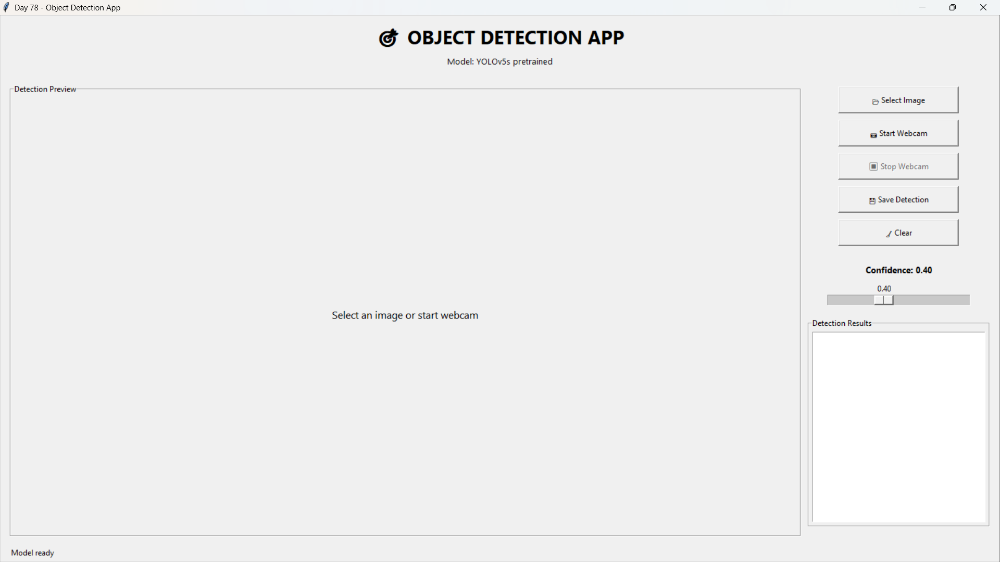
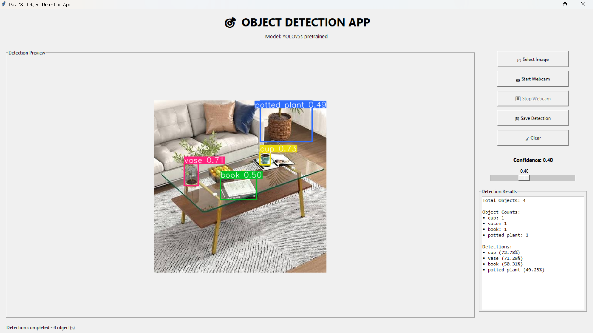
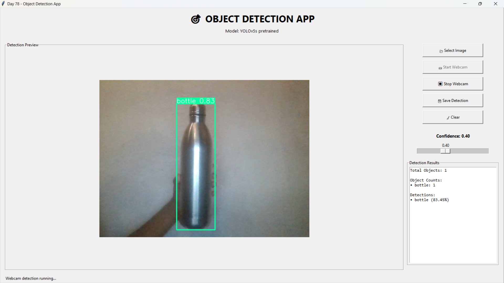
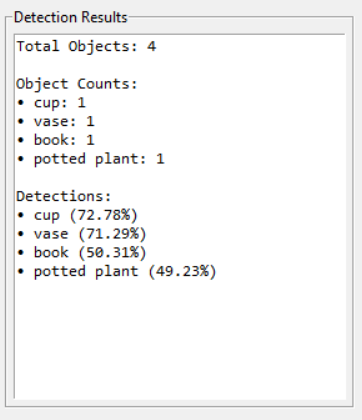

# 🎯 Day 78 - Object Detection App

Welcome to **Day 78** of my **100 Days, 100 Python Projects** challenge!

This project is an **Object Detection Application** built using **Python, Tkinter, OpenCV, PyTorch, YOLOv5, and Pillow**.

The application uses a **custom-trained YOLOv5 model** to detect **Helmet** and **No Helmet** objects. It supports both **image-based object detection** and **real-time webcam detection** through an interactive Tkinter GUI.

The project also includes a separate training script that can be used to train the custom YOLOv5 model using a Helmet Detection dataset.

---

## 📌 Project Overview

Object detection is a Computer Vision task that identifies objects within an image or video frame and determines their locations using bounding boxes.

This project demonstrates how a pretrained **YOLOv5s** model can be customized for a specific object detection task.

The custom model is trained to detect two classes:

* 🪖 **Helmet**
* ❌ **No Helmet**

The final trained model is loaded into a Tkinter application where users can:

* Select an image for detection
* Start real-time webcam detection
* Adjust the detection confidence threshold
* View detected objects and their confidence scores
* Count detected objects
* Save detection results
* Clear the current screen
* Stop webcam detection

---

## ✨ Features

* 🎯 Custom YOLOv5 object detection
* 🪖 Helmet detection
* ❌ No-Helmet detection
* 📂 Image-based object detection
* 📷 Real-time webcam detection
* 📊 Object counting
* 📈 Detection confidence scores
* 🎚️ Adjustable confidence threshold
* 🖼️ Detection preview inside Tkinter
* 💾 Save detected images
* 🧹 Clear detection results
* ⏹️ Start/stop webcam controls
* 🧠 Custom-trained model support
* 🔄 Automatic fallback to pretrained YOLOv5s
* 🧵 Background model loading
* ⚠️ Error handling
* 🚨 Message-box notifications
* 📋 Detection result information panel
* 🖥️ Interactive Tkinter GUI

---

# 🖼️ Application Screenshots

## 📸 Screenshots

### 🖥️ 1. Main GUI



The main interface provides controls for image detection, webcam detection, confidence adjustment, saving results, and clearing the current detection.

### 🖼️ 2. Image Object Detection



An image can be selected from the computer, after which YOLOv5 detects the objects and displays bounding boxes around them.

### 📷 3. Real-Time Webcam Detection



The application can access the computer's webcam and perform real-time object detection on each captured frame.

### 📊 4. Object Counting



The detection results panel displays the total number of detected objects and the count of each detected class.

---

# 🤖 Object Detection Model

This project uses **YOLOv5** for object detection.

The application primarily uses a custom-trained model:

```text
models/best.pt
```

The model is trained specifically for:

```text
0 → helmet
1 → no_helmet
```

If the custom model is not available, the application automatically falls back to the pretrained:

```text
YOLOv5s
```

This fallback behavior makes it possible to run the application even when the custom model has not yet been trained.

---

# 🧠 YOLOv5

**YOLO** stands for **You Only Look Once**.

YOLO is a real-time object detection architecture that can identify objects and their locations in an image using a single neural network.

This project uses **YOLOv5s** as the pretrained base model and fine-tunes it for Helmet/No-Helmet detection.

The training process starts from:

```text
yolov5s.pt
```

and produces a custom model:

```text
best.pt
```

---

# 🪖 Detection Classes

The custom model contains two object classes.

| Class ID | Class Name  | Description                              |
| -------: | ----------- | ---------------------------------------- |
|        0 | `helmet`    | Detects a person/object wearing a helmet |
|        1 | `no_helmet` | Detects a person/object without a helmet |

The model configuration is defined in:

```text
dataset.yaml
```

with:

```yaml
nc: 2

names:
  0: helmet
  1: no_helmet
```

---

# 📊 Dataset

This project uses a custom **Helmet Detection dataset** for training the YOLOv5 object detection model.

The original dataset contains **638 images**.

The dataset was divided into three subsets:

| Split      |  Images |
| ---------- | ------: |
| Training   |     446 |
| Validation |     127 |
| Testing    |      65 |
| **Total**  | **638** |

The dataset follows the **YOLO annotation format**.

Each image has a corresponding `.txt` label file containing:

* Class ID
* X-coordinate of bounding-box center
* Y-coordinate of bounding-box center
* Bounding-box width
* Bounding-box height

---

# 📂 Dataset Structure

```text
dataset/
├── train/
│   ├── images/
│   └── labels/
│
├── valid/
│   ├── images/
│   └── labels/
│
└── test/
    ├── images/
    └── labels/
```

---

# 📋 Dataset Configuration

The `dataset.yaml` file defines the dataset location and object classes.

```yaml
path: C:/Users/madhu/OneDrive/Documents/PYTHON - PROJECTS/100_DAYS_100_PROJECTS/DAY_78/dataset

train: train/images

val: valid/images

test: test/images

nc: 2

names:
  0: helmet
  1: no_helmet
```

> **Note:** The `path` value is machine-specific. When reproducing the project on another computer, update it to the local dataset path.

---

# 🌐 Dataset Source

The dataset was obtained from **Roboflow Universe**:

**Helmet Detection Dataset – Version 3**

* Workspace: `yolo-6nfqk`
* Project: `helmet-detection-jlgiv`
* Version: `3`
* License: **CC BY 4.0**

The dataset is used for educational and project-development purposes.

> **Note:** The dataset and large model files are excluded from this GitHub repository using `.gitignore` to keep the repository lightweight.

---

# 📥 Dataset Setup

The dataset is not included in the GitHub repository because it contains hundreds of images and would unnecessarily increase the repository size.

To reproduce the project:

### 1. Download the Dataset

Download the **Helmet Detection Dataset – Version 3** from Roboflow Universe.

### 2. Extract the Dataset

Place the extracted dataset inside the Day 78 project directory.

### 3. Organize the Dataset

Make sure the directory follows:

```text
dataset/
├── train/
│   ├── images/
│   └── labels/
├── valid/
│   ├── images/
│   └── labels/
└── test/
    ├── images/
    └── labels/
```

### 4. Configure `dataset.yaml`

Update the dataset path:

```yaml
path: YOUR_DATASET_PATH
```

### 5. Start YOLOv5 Training

The included `train.py` script can be used to start the training process.

---

# 🏋️ Custom YOLOv5 Training

The project includes:

```text
train.py
```

This script automates the YOLOv5 training process.

The training configuration is:

| Parameter  |          Value |
| ---------- | -------------: |
| Model      |        YOLOv5s |
| Image Size |            640 |
| Batch Size |              4 |
| Epochs     |             20 |
| Workers    |              0 |
| Dataset    | `dataset.yaml` |

The script internally executes YOLOv5's training process.

---

# ⚙️ Training Configuration

The following values are defined in `train.py`:

```python
EPOCHS = 20
IMAGE_SIZE = 640
BATCH_SIZE = 4
WORKERS = 0
```

The pretrained model is:

```text
yolov5s.pt
```

---

# ▶️ Running the Training Script

First make sure that the YOLOv5 repository exists inside the project:

```text
DAY_78/
└── yolov5/
```

Then run:

```bash
python train.py
```

The script checks whether:

* YOLOv5 exists
* `dataset.yaml` exists

If both are available, training begins automatically.

---

# 🤖 YOLOv5 Repository Setup

The YOLOv5 source code is not included in the repository to keep the project lightweight.

## 1. Clone YOLOv5

From the Day 78 project directory:

```bash
git clone https://github.com/ultralytics/yolov5.git
```

This creates:

```text
DAY_78/
└── yolov5/
```

---

## 2. Install YOLOv5 Dependencies

Navigate into the YOLOv5 directory:

```bash
cd yolov5
```

Install its dependencies:

```bash
pip install -r requirements.txt
```

Return to the project directory:

```bash
cd ..
```

---

## 3. Download YOLOv5s

The project uses:

```text
yolov5s.pt
```

as the pretrained model for custom training.

The pretrained model is used as the starting point for training the Helmet Detection model.

---

# 🏃 Training Command

The equivalent YOLOv5 training command is:

```bash
python yolov5\train.py --img 640 --batch 4 --epochs 20 --data dataset.yaml --weights yolov5s.pt --workers 0 --project yolov5\runs\train --name helmet_detection --exist-ok
```

The training process generates model weights after training.

---

# 📁 Training Output

YOLOv5 generates training results under:

```text
yolov5/
└── runs/
    └── train/
        └── day78_custom/
            └── weights/
                ├── best.pt
                └── last.pt
```

The included `train.py` script then copies:

```text
best.pt
```

to:

```text
models/best.pt
```

The application uses this file as the custom detection model.

---

# 🔄 Training Workflow

The complete training workflow is:

```text
Helmet Detection Dataset
          ↓
      dataset.yaml
          ↓
       YOLOv5s
          ↓
    Custom Training
          ↓
       20 Epochs
          ↓
       best.pt
          ↓
      models/best.pt
          ↓
  Tkinter Detection App
```

---

# 🖥️ Application Workflow

The application works as follows:

```text
Application Start
       ↓
Load Custom Model
       ↓
Is models/best.pt available?
       ↓
 ┌─────┴─────┐
Yes         No
 ↓           ↓
Custom      YOLOv5s
YOLOv5      pretrained
 ↓           ↓
 └─────┬─────┘
       ↓
   Model Ready
       ↓
 ┌─────┴──────────┐
 ↓                ↓
Select Image   Start Webcam
 ↓                ↓
YOLO Detection  YOLO Detection
 ↓                ↓
Bounding Boxes  Bounding Boxes
 ↓                ↓
Object Counts   Object Counts
 └───────┬────────┘
         ↓
    Save Detection
```

---

# 📂 Image Detection

The **Select Image** button allows the user to choose an image from the computer.

Supported formats include:

```text
.jpg
.jpeg
.png
.bmp
```

The application loads the selected image using OpenCV:

```python
image = cv2.imread(image_path)
```

The image is then passed to the YOLOv5 model:

```python
results = model(image)
```

---

# 🎯 Bounding Box Detection

After detection, YOLOv5 renders bounding boxes around detected objects.

The rendered image is obtained using:

```python
rendered = results.render()[0]
```

The resulting image is displayed inside the Tkinter application.

---

# 📊 Detection Results

The application displays detailed detection information.

For example:

```text
Total Objects: 3

Object Counts:
• helmet: 2
• no_helmet: 1

Detections:
• helmet (87.52%)
• helmet (76.34%)
• no_helmet (91.21%)
```

This provides both the total number of detected objects and individual detection confidence values.

---

# 🔢 Object Counting

The application counts detected objects using Pandas:

```python
counts = detections["name"].value_counts().to_dict()
```

This makes it possible to display how many objects of each class were detected.

For example:

```text
helmet: 5
no_helmet: 2
```

---

# 📈 Confidence Score

Every YOLO detection contains a confidence score.

The application displays the confidence of each detection as a percentage:

```python
f"{row['confidence']:.2%}"
```

For example:

```text
helmet (91.42%)
```

---

# 🎚️ Confidence Threshold

The application provides a confidence slider.

The default confidence threshold is:

```text
0.40
```

The available range is:

```text
0.10 → 0.90
```

with increments of:

```text
0.05
```

The selected value is applied to the YOLOv5 model:

```python
model.conf = float(value)
```

A higher confidence threshold generally makes the detector more selective, while a lower threshold allows more detections to be considered.

---

# 📷 Real-Time Webcam Detection

The application supports real-time object detection using the computer's webcam.

The webcam is opened using:

```python
camera = cv2.VideoCapture(0)
```

Each captured frame is passed through the YOLOv5 model:

```python
results = model(frame)
```

The processed frame is then displayed in the GUI.

---

# 🔄 Webcam Processing

The webcam continuously captures frames using:

```python
root.after(30, update_webcam)
```

This schedules the next webcam update approximately every 30 milliseconds.

The general webcam workflow is:

```text
Webcam
   ↓
Capture Frame
   ↓
YOLOv5 Detection
   ↓
Render Bounding Boxes
   ↓
Display Frame
   ↓
Update Detection Results
   ↓
Capture Next Frame
```

---

# ⏹️ Stop Webcam

The **Stop Webcam** button stops real-time detection.

The application:

* Stops webcam processing
* Releases the camera
* Resets the camera object
* Re-enables the Start Webcam button
* Disables the Stop Webcam button
* Updates the application status

The camera is released using:

```python
camera.release()
```

---

# 💾 Save Detection

The **Save Detection** button allows the user to save the current detection result.

Supported output formats are:

```text
JPG
PNG
```

The detected frame is saved using OpenCV:

```python
cv2.imwrite(save_path, current_frame)
```

Example output:

```text
helmet-detection.jpg
```

---

# 🧹 Clear Screen

The **Clear** button resets the current detection.

It:

* Removes the displayed image
* Clears detection information
* Resets the current frame
* Resets the application status

The status is changed back to:

```text
Ready
```

---

# 🧵 Background Model Loading

Loading a YOLO model can take some time.

To prevent the Tkinter interface from becoming unresponsive, the application loads the model using a background thread:

```python
thread = threading.Thread(
    target=load_model,
    daemon=True
)

thread.start()
```

This allows the GUI to start while the model is loading.

---

# 🔄 Automatic Model Selection

The application checks whether the custom model exists:

```python
CUSTOM_MODEL = "models/best.pt"
```

If the file exists, it loads:

```text
Custom YOLOv5
```

Otherwise, it loads:

```text
YOLOv5s pretrained
```

This logic is implemented using:

```python
if os.path.exists(CUSTOM_MODEL):
```

This provides a fallback model if the custom model is unavailable.

---

# 🖼️ Image Processing

OpenCV is used to read and process images.

Pillow is used to convert the processed OpenCV image into a format that can be displayed by Tkinter.

The conversion process is:

```text
OpenCV BGR Image
       ↓
Convert BGR → RGB
       ↓
Pillow Image
       ↓
ImageTk.PhotoImage
       ↓
Tkinter Label
```

The conversion from BGR to RGB is performed using:

```python
cv2.cvtColor(frame, cv2.COLOR_BGR2RGB)
```

---

# 🛠️ Technologies Used

## Python

Python is used to build the complete application, including:

* GUI development
* Computer Vision
* Model loading
* Object detection
* Webcam processing
* File handling
* Threading
* Error handling

---

## 🖥️ Tkinter

Tkinter is used to build the graphical interface.

The application uses:

* `Tk`
* `Frame`
* `Label`
* `LabelFrame`
* `Button`
* `Text`
* `Scale`
* `filedialog`
* `messagebox`

---

## 👁️ OpenCV

OpenCV is used for:

* Reading images
* Accessing the webcam
* Processing video frames
* Saving detection results
* Image color conversion

Important functions include:

```python
cv2.imread()
cv2.VideoCapture()
cv2.cvtColor()
cv2.imwrite()
```

---

## 🔥 PyTorch

PyTorch provides the deep-learning framework used by YOLOv5.

The project loads YOLOv5 models using:

```python
torch.hub.load()
```

---

## 🖼️ Pillow

Pillow is used to convert processed images into Tkinter-compatible images.

Important components include:

```python
Image.fromarray()
ImageTk.PhotoImage()
Image.Resampling.LANCZOS
```

---

## 📦 NumPy

NumPy is included as part of the computer vision and deep learning environment and supports numerical operations used by the underlying libraries.

---

## 📊 Matplotlib

Matplotlib is included in the project dependencies and is used by the YOLOv5 ecosystem for generating training and evaluation visualizations.

---

## ⚙️ PyYAML

PyYAML is used to handle YAML configuration files such as:

```text
dataset.yaml
```

---

# 📦 requirements.txt

The project requires:

```text
torch
torchvision
opencv-python
numpy
Pillow
PyYAML
matplotlib
```

Install the dependencies using:

```bash
pip install -r requirements.txt
```

> **Note:** YOLOv5 has its own dependency requirements. When setting up the training environment, also install the dependencies from `yolov5/requirements.txt`.

---

# 📂 Project Structure

After completing the local setup, the project can have the following structure:

```text
DAY_78/
│
├── main78.py
├── train.py
├── dataset.yaml
├── requirements.txt
├── README.md
├── .gitignore
├── yolov5s.pt
│
├── models/
│   └── best.pt
│
├── dataset/
│   ├── train/
│   │   ├── images/
│   │   └── labels/
│   │
│   ├── valid/
│   │   ├── images/
│   │   └── labels/
│   │
│   └── test/
│       ├── images/
│       └── labels/
│
├── yolov5/
│
└── screenshots/
    ├── main-gui.png
    ├── image-detection.png
    ├── webcam-detection.png
    └── object-counting.png
```

---

# 📋 File Description

| File / Folder      | Purpose                                   |
| ------------------ | ----------------------------------------- |
| `main78.py`        | Main Tkinter object detection application |
| `train.py`         | Automates custom YOLOv5 training          |
| `dataset.yaml`     | Dataset and class configuration           |
| `requirements.txt` | Python dependencies                       |
| `yolov5s.pt`       | Pretrained YOLOv5s model                  |
| `models/best.pt`   | Custom-trained Helmet Detection model     |
| `dataset/`         | Helmet Detection dataset                  |
| `yolov5/`          | YOLOv5 source repository                  |
| `screenshots/`     | Application screenshots                   |
| `README.md`        | Project documentation                     |

---

# ▶️ How to Run the Application

## 1. Make Sure Python Is Installed

Check the Python version:

```bash
python --version
```

---

## 2. Open the Project Folder

Open a terminal inside the:

```text
DAY_78
```

directory.

---

## 3. Install Project Dependencies

Run:

```bash
pip install -r requirements.txt
```

---

## 4. Set Up YOLOv5

Clone YOLOv5:

```bash
git clone https://github.com/ultralytics/yolov5.git
```

Install YOLOv5 dependencies:

```bash
cd yolov5
pip install -r requirements.txt
cd ..
```

---

## 5. Make Sure the Model Exists

For custom Helmet/No-Helmet detection, make sure:

```text
models/best.pt
```

exists.

---

## 6. Run the Application

Run:

```bash
python main78.py
```

The **Object Detection App** window will open.

---

# 🏋️ How to Train the Custom Model

If you want to train the model yourself:

### Step 1 — Prepare the Dataset

Make sure the dataset follows:

```text
dataset/
├── train/
├── valid/
└── test/
```

with `images` and `labels` folders inside each split.

### Step 2 — Configure `dataset.yaml`

Set the correct dataset path and classes.

### Step 3 — Make Sure YOLOv5 Exists

```text
DAY_78/
└── yolov5/
```

### Step 4 — Make Sure `yolov5s.pt` Exists

The pretrained YOLOv5s weights are used as the starting point.

### Step 5 — Run Training

```bash
python train.py
```

### Step 6 — Locate the Trained Model

After successful training:

```text
yolov5/runs/train/day78_custom/weights/best.pt
```

The training script automatically copies it to:

```text
models/best.pt
```

### Step 7 — Run the Application

```bash
python main78.py
```

The application will automatically detect and load the custom model.

---

# 🧩 Important Functions

| Function                  | Purpose                                         |
| ------------------------- | ----------------------------------------------- |
| `load_model()`            | Loads custom or pretrained YOLOv5 model         |
| `enable_buttons()`        | Enables detection buttons after model loading   |
| `update_confidence()`     | Changes the YOLO confidence threshold           |
| `detect_image()`          | Performs object detection on a selected image   |
| `display_image()`         | Displays processed images in Tkinter            |
| `update_detection_info()` | Displays detection counts and confidence values |
| `start_webcam()`          | Starts webcam detection                         |
| `update_webcam()`         | Processes webcam frames continuously            |
| `stop_webcam()`           | Stops and releases the webcam                   |
| `save_detection()`        | Saves the current detection image               |
| `clear_screen()`          | Clears the current detection                    |
| `close_application()`     | Stops webcam and closes the application         |

---

# 🧠 Computer Vision Concepts Practiced

This project provides practical experience with:

* Object Detection
* Computer Vision
* YOLO
* YOLOv5
* Transfer Learning
* Custom Model Training
* Bounding Boxes
* Confidence Scores
* Image Classification
* Real-Time Detection
* Webcam Processing
* Image Preprocessing
* Model Inference
* Dataset Annotation
* Train/Validation/Test Splitting

---

# 🖥️ GUI Concepts Practiced

The project also provides experience with:

* Tkinter GUI development
* GUI event handling
* Buttons
* Sliders
* File dialogs
* Message boxes
* Text widgets
* Image display
* Application status indicators
* Background threads
* Real-time GUI updates

---

# 📊 Machine Learning Concepts Practiced

The training component of this project helped me understand:

* Custom object detection datasets
* YOLO annotation format
* Dataset splitting
* Transfer learning
* Pretrained models
* Fine-tuning
* Training epochs
* Batch size
* Image size
* Model weights
* `best.pt`
* `last.pt`
* Model inference
* Confidence thresholds

---

# 🎯 Learning Outcome

This project helped me understand:

* How object detection works
* How YOLOv5 can be used for object detection
* How to train a custom YOLOv5 model
* How pretrained models can be fine-tuned for a specific task
* How to prepare a YOLO-format dataset
* How to configure a dataset using YAML
* How to train a model using custom classes
* How to load trained YOLOv5 weights
* How to perform image-based object detection
* How to perform real-time webcam detection
* How bounding boxes are generated
* How confidence scores are used
* How to adjust detection thresholds
* How to count detected objects
* How to display detection results
* How to save processed images
* How to integrate OpenCV with Tkinter
* How to use Pillow for GUI image rendering
* How to use PyTorch for model inference
* How to use threading for model loading
* How to build a complete Computer Vision application

---

# ⚠️ Important Notes

### Custom Model

The application looks for:

```text
models/best.pt
```

If it is not available, the application attempts to load:

```text
YOLOv5s pretrained
```

The pretrained model does **not** provide the same custom Helmet/No-Helmet classes as the trained model, so the custom model should be used for the intended Helmet Detection functionality.

### Dataset

The dataset is not included in the repository because it contains hundreds of images.

### Model Files

Large `.pt` files such as:

```text
yolov5s.pt
best.pt
last.pt
```

should generally not be committed to GitHub unless there is a specific reason to do so.

### Hardware

Real-time webcam detection performance depends on the computer's CPU/GPU, available RAM, image resolution, and model configuration.

---

# 🔮 Future Improvements

Possible enhancements for future versions include:

* 🎯 Improve custom model accuracy
* 🪖 Detect additional safety equipment
* 👤 Detect people separately from helmets
* 📊 Display detection statistics
* 📈 Display model performance metrics
* 🎥 Save webcam detection videos
* 📹 Add video-file detection
* 📂 Support multiple image selection
* 🔄 Add batch image detection
* 📊 Add detection history
* 💾 Export detection results to CSV
* 🧾 Generate detection reports
* 📈 Add confidence graphs
* 🎚️ Add more model settings
* 🧠 Experiment with larger YOLOv5 models
* ⚡ Optimize real-time inference
* 🖥️ Improve GUI design
* 🌙 Add Dark Mode
* 🔍 Add image zoom controls
* 📐 Add configurable image resolution
* ☁️ Add cloud-based inference
* 🚀 Deploy the detector as a web application

---

# 📅 100 Days, 100 Python Projects

This project is part of my **100 Days, 100 Python Projects** challenge.

The goal of this challenge is to build one Python project every day to improve programming skills, practice problem-solving, learn new technologies, and build practical applications.

**Day 78** focuses on **Computer Vision and Object Detection**, combining **YOLOv5 for deep-learning-based object detection**, **PyTorch for model inference**, **OpenCV for image and webcam processing**, **Pillow for image handling**, and **Tkinter for GUI development**.

The project also provided practical experience with **custom dataset preparation and YOLOv5 model training** for a real-world **Helmet/No-Helmet detection** task.

---

# 👨‍💻 Author

**Abhijit Munghate**

Happy Coding! 🚀🐍🎯
