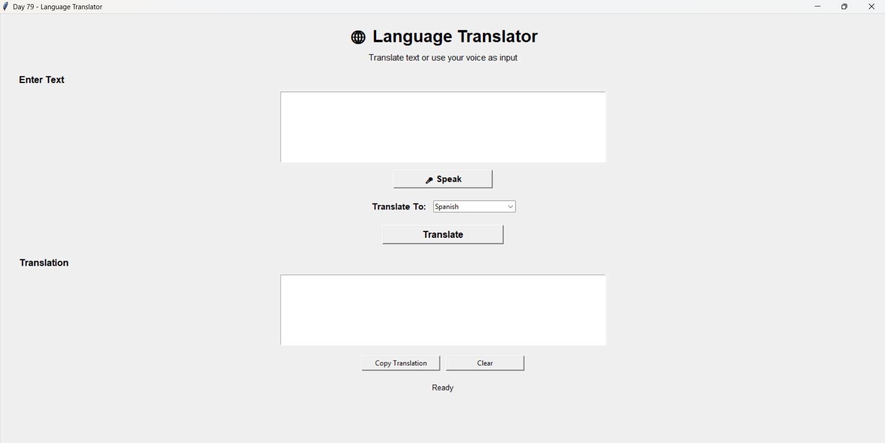
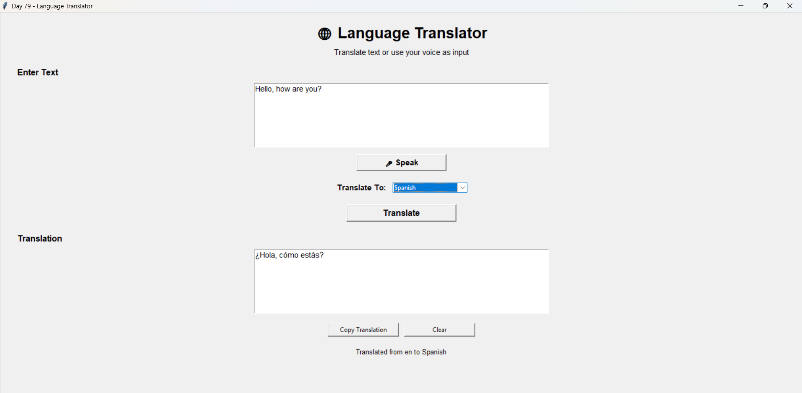
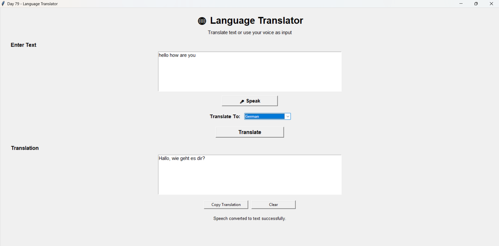
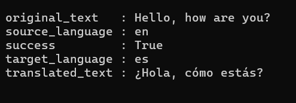

# 🌐 Day 79 - Language Translator Tool

Welcome to **Day 79** of my **100 Days, 100 Python Projects** challenge!

This project is a **Language Translator Tool** built using **Python, Tkinter, Googletrans, SpeechRecognition, PyAudio, and Flask**.

The application allows users to enter text, select a target language, translate the text, use their microphone for speech-to-text input, copy the translated result, and clear the current translation.

In addition to the desktop GUI application, this project also provides a **Flask REST API** that can be used to perform translations through HTTP requests.

The main purpose of this project is to gain practical experience with **API-based language translation, speech recognition, GUI development, REST API development, and modular Python programming**.

---

## 📌 Project Overview

Language translation is useful for communication between people who speak different languages.

This project provides two ways to access the translation functionality:

### 🖥️ Desktop GUI

The Tkinter application allows users to:

* ✏️ Enter text manually
* 🎤 Use microphone input
* 🗣️ Convert speech into text
* 🌐 Select a target language
* 🔄 Translate the entered text
* 📋 Copy translated text
* 🧹 Clear the input and output
* ℹ️ Display translation status

### 🌐 Flask API

The Flask application provides a REST API that allows other applications to send text and receive translated results using JSON.

The API provides:

* `GET /` for API status
* `POST /translate` for translation
* JSON request and response handling
* Input validation
* Error handling
* Source language detection
* Target language selection

---

## ✨ Features

### 🖥️ Desktop Application

* 🌐 Language Translator GUI
* ✏️ Manual text input
* 🎤 Speech-to-text input
* 🗣️ Microphone support
* 🔄 Text translation
* 🌍 Support for multiple languages
* 📋 Copy translation to clipboard
* 🧹 Clear input and output
* ⚠️ Input validation
* 🚨 Error handling using message boxes
* 📊 Translation status messages
* 🔒 Read-only translation output
* 🖥️ Simple Tkinter interface

### 🌍 Supported Languages

The application currently supports:

```text
English
Spanish
French
German
Italian
Portuguese
Dutch
Russian
Chinese
Japanese
Korean
Arabic
Hindi
Bengali
Tamil
Telugu
Marathi
Gujarati
Punjabi
```

### 🌐 Flask API

* 🚀 REST API using Flask
* 📡 `GET /` status endpoint
* 🔄 `POST /translate` translation endpoint
* 📦 JSON request handling
* 📤 JSON response handling
* ⚠️ Request validation
* 🚨 Exception handling
* 🔍 Automatic source-language detection
* 🌎 Target-language selection

---

## 🖼️ Application Screenshots

### 🖥️ Main GUI



### 🌐 Text Translation



### 🎤 Speech Translation



### 🌐 Flask API



---

## 🛠️ Technologies Used

* **Python 3**
* **Tkinter**
* **Googletrans**
* **SpeechRecognition**
* **PyAudio**
* **Flask**

### Python

Python is used as the main programming language for building the entire project.

It handles:

* Application logic
* Translation processing
* Speech recognition
* GUI interaction
* API development
* Error handling
* Data processing

---

### Tkinter

Tkinter is Python's built-in GUI framework.

It is used to create the desktop translator application.

The project uses Tkinter components such as:

* `Tk`
* `Label`
* `Text`
* `Button`
* `Frame`
* `Combobox`
* `StringVar`
* `messagebox`

---

### Googletrans

Googletrans is used to communicate with Google Translate's translation service.

The project uses:

```python
from googletrans import Translator
```

A translator object is created:

```python
translator = Translator()
```

Translation is performed using:

```python
translator.translate(text, dest=target_lang)
```

The returned result provides information such as:

* Translated text
* Detected source language
* Target language

---

### SpeechRecognition

The `SpeechRecognition` library is used to capture speech from the microphone and convert it into text.

The project uses:

```python
recognizer = sr.Recognizer()
```

The microphone is accessed using:

```python
with sr.Microphone() as source:
```

Speech is converted into text using:

```python
recognizer.recognize_google(audio)
```

---

### PyAudio

PyAudio provides microphone/audio input support for the speech recognition functionality.

It allows the application to capture audio from the system microphone.

---

### Flask

Flask is used to create the REST API version of the translator.

The API provides:

```text
GET  /
POST /translate
```

The API accepts JSON data and returns JSON responses.

---

## 📂 Project Structure

```text
DAY_79/
│
├── main79.py
├── translator.py
├── app.py
├── requirements.txt
├── README.md
│
└── screenshots/
    ├── main-gui.png
    ├── text-translation.png
    ├── speech-translation.png
    └── flask-api.png
```

### File Description

| File / Folder      | Purpose                                     |
| ------------------ | ------------------------------------------- |
| `main79.py`        | Main Tkinter desktop translator application |
| `translator.py`    | Reusable translation service                |
| `app.py`           | Flask REST API                              |
| `requirements.txt` | Python dependencies                         |
| `README.md`        | Project documentation                       |
| `screenshots/`     | Application screenshots                     |

---

## 📦 requirements.txt

The project requires the following Python libraries:

```text
googletrans==4.0.0-rc1
SpeechRecognition
PyAudio
Flask
```

Install all dependencies using:

```bash
pip install -r requirements.txt
```

### Install Manually

If required, the packages can also be installed individually:

```bash
pip install googletrans==4.0.0-rc1
pip install SpeechRecognition
pip install PyAudio
pip install Flask
```

> **Note:** `PyAudio` is required for microphone-based speech input. If PyAudio installation fails on your system, the text translation functionality can still be used after installing the required audio dependency correctly.

---

# ▶️ How to Run

## 1. Make sure Python is installed

Check your Python version:

```bash
python --version
```

---

## 2. Open the project folder

Open a terminal inside the `DAY_79` project folder.

---

## 3. Install dependencies

```bash
pip install -r requirements.txt
```

---

## 4. Run the Desktop Translator

Run:

```bash
python main79.py
```

The **Language Translator** Tkinter window will open.

---

# 🖥️ Using the Desktop Translator

## ✏️ 1. Enter Text

Enter the text that you want to translate into the **Enter Text** box.

For example:

```text
Hello, how are you?
```

---

## 🌐 2. Select Target Language

Use the **Translate To** dropdown to select the desired target language.

For example:

```text
Spanish
```

The application internally converts the selected language into its corresponding language code.

Example:

```python
"Spanish": "es"
```

---

## 🔄 3. Translate Text

Click the **Translate** button.

The application:

1. Reads the entered text.
2. Gets the selected target language.
3. Converts the language name into its language code.
4. Sends the text to `translate_text()`.
5. Receives the translation result.
6. Displays the translated text.
7. Displays the detected source language in the status label.

Example:

```text
Input:
Hello, how are you?

Target:
Spanish

Output:
Hola, ¿cómo estás?
```

---

# 🎤 Speech-to-Text Translation

The application also supports voice input.

Click:

```text
🎤 Speak
```

The application then:

1. Activates the microphone.
2. Adjusts for ambient noise.
3. Listens for speech.
4. Converts the captured audio into text.
5. Places the recognized text into the input box.

The application uses:

```python
recognizer.adjust_for_ambient_noise(source, duration=1)
```

and:

```python
audio = recognizer.listen(
    source,
    timeout=5,
    phrase_time_limit=15
)
```

Speech recognition is performed using:

```python
recognizer.recognize_google(audio)
```

After the speech is converted into text, the user can select a target language and click **Translate**.

---

## 🎤 Speech Recognition Error Handling

The application handles several possible speech recognition errors.

### No Speech Detected

If no speech is detected within the timeout period:

```text
No speech was detected. Please try again.
```

### Speech Not Understood

If the speech recognition service cannot understand the audio:

```text
Sorry, I could not understand the speech.
```

### Service Unavailable

If the speech recognition service is unavailable:

```text
The speech recognition service is currently unavailable.
```

### Microphone Error

Other microphone-related problems are handled using a general exception handler.

---

# 📋 Copy Translation

The **Copy Translation** button copies the translated text to the system clipboard.

The project uses:

```python
root.clipboard_clear()
root.clipboard_append(text)
root.update()
```

This allows the user to easily paste the translated text into another application.

If there is no translation available, the application displays:

```text
There is no translation to copy.
```

---

# 🧹 Clear Function

The **Clear** button resets the current translator state.

It:

* Clears the input text.
* Clears the translation output.
* Resets the output text box.
* Changes the status message back to `Ready`.

This allows the user to start a new translation without restarting the application.

---

# 🔧 Translation Service

The translation logic is separated into a dedicated file:

```text
translator.py
```

This makes the translation functionality reusable by both:

* Tkinter GUI
* Flask API

The main function is:

```python
translate_text(text, target_lang)
```

The function validates the input:

```python
if not text or not text.strip():
    raise ValueError("Text cannot be empty.")
```

It also validates the target language:

```python
if not target_lang:
    raise ValueError("Target language is required.")
```

The translation is then performed using:

```python
translator.translate(
    text.strip(),
    dest=target_lang
)
```

The function returns:

```python
{
    "translated_text": result.text,
    "source_language": result.src,
    "target_language": target_lang
}
```

---

# 🌐 Flask REST API

This project also provides a Flask-based API.

The API allows external applications to use the translation functionality without directly using the Tkinter GUI.

---

## 🚀 Start the Flask API

Run:

```bash
python app.py
```

The Flask development server starts at:

```text
http://127.0.0.1:5000
```

---

## 🏠 API Home Endpoint

The API provides:

```text
GET /
```

Example:

```http
GET /
```

Example response:

```json
{
    "message": "Day 79 Language Translator API",
    "status": "running",
    "endpoint": "/translate",
    "method": "POST"
}
```

This endpoint can be used to check whether the API is running.

---

# 🔄 Translation API Endpoint

The main translation endpoint is:

```text
POST /translate
```

The endpoint expects a JSON request body.

### Request

```json
{
    "text": "Hello, how are you?",
    "target_lang": "es"
}
```

The API passes the request to:

```python
translate_text(text, target_lang)
```

---

## 📤 Successful Response

A successful request returns:

```json
{
    "success": true,
    "original_text": "Hello, how are you?",
    "translated_text": "Hola, ¿cómo estás?",
    "source_language": "en",
    "target_language": "es"
}
```

The response contains:

* Success status
* Original text
* Translated text
* Detected source language
* Target language

---

# ⚠️ API Validation

The Flask API validates incoming requests.

### Missing JSON Body

If a JSON request body is not provided:

```json
{
    "success": false,
    "error": "JSON request body is required."
}
```

The API returns HTTP status:

```text
400 Bad Request
```

---

### Missing Text

If the `text` field is empty:

```json
{
    "success": false,
    "error": "Text is required."
}
```

---

### Missing Target Language

If `target_lang` is empty:

```json
{
    "success": false,
    "error": "Target language is required."
}
```

---

### Translation Error

If an error occurs during translation, the API returns:

```json
{
    "success": false,
    "error": "Error message"
}
```

with HTTP status:

```text
500 Internal Server Error
```

---

# 🔀 Language Code Mapping

The GUI uses readable language names while the translation service uses language codes.

For example:

| Language   | Code    |
| ---------- | ------- |
| English    | `en`    |
| Spanish    | `es`    |
| French     | `fr`    |
| German     | `de`    |
| Italian    | `it`    |
| Portuguese | `pt`    |
| Dutch      | `nl`    |
| Russian    | `ru`    |
| Chinese    | `zh-cn` |
| Japanese   | `ja`    |
| Korean     | `ko`    |
| Arabic     | `ar`    |
| Hindi      | `hi`    |
| Bengali    | `bn`    |
| Tamil      | `ta`    |
| Telugu     | `te`    |
| Marathi    | `mr`    |
| Gujarati   | `gu`    |
| Punjabi    | `pa`    |

The mapping is stored in:

```python
LANGUAGES = {
    "English": "en",
    "Spanish": "es",
    "French": "fr",
    ...
}
```

This makes the dropdown user-friendly while keeping the translation service language-code based.

---

# 🧩 Important Functions

## `translate()`

Handles the GUI translation process.

Main responsibilities:

* Read input text
* Read selected language
* Validate input
* Call translation service
* Display translation
* Update status
* Handle errors

---

## `speech_to_text()`

Handles microphone input.

Main responsibilities:

* Activate microphone
* Reduce ambient noise
* Capture speech
* Convert speech to text
* Insert text into the input box
* Handle speech recognition errors

---

## `copy_translation()`

Copies the translated text to the clipboard.

---

## `clear_all()`

Clears both input and output fields.

---

## `translate_text()`

Located in `translator.py`.

This function provides the reusable translation logic for both the GUI and Flask API.

---

## `home()`

Located in `app.py`.

Provides information about the Flask API status.

---

## `translate()` in Flask

Handles:

```text
POST /translate
```

It receives JSON data, validates it, performs translation, and returns the result.

---

# 🖥️ GUI Components Used

| Component    | Purpose                              |
| ------------ | ------------------------------------ |
| `Tk()`       | Creates the main application window  |
| `Label`      | Displays titles and information      |
| `Text`       | Accepts and displays multi-line text |
| `Button`     | Performs application actions         |
| `Frame`      | Organizes GUI components             |
| `Combobox`   | Selects target language              |
| `StringVar`  | Stores selected language             |
| `messagebox` | Displays warnings and errors         |

---

# 🌐 API Components Used

| Flask Component      | Purpose                       |
| -------------------- | ----------------------------- |
| `Flask()`            | Creates the Flask application |
| `@app.route()`       | Defines API endpoints         |
| `request.get_json()` | Reads JSON request data       |
| `jsonify()`          | Creates JSON responses        |
| `app.run()`          | Starts the development server |

---

# 📚 Concepts Practiced

* Python Programming
* Tkinter GUI Development
* REST API Development
* Flask
* JSON Data Handling
* Language Translation
* Speech Recognition
* Microphone Input
* Google Translate Integration
* HTTP GET Requests
* HTTP POST Requests
* API Request Validation
* API Response Handling
* Exception Handling
* Error Handling
* Clipboard Operations
* Modular Programming
* Function Design
* Dictionary-Based Language Mapping
* Event-Driven Programming
* Client-Service Architecture
* Reusable Python Modules

---

# 🎯 Learning Outcome

This project helped me understand:

* How to build a desktop application using Tkinter
* How to integrate an external translation service
* How to translate text between different languages
* How to work with language codes
* How to implement speech-to-text functionality
* How to capture microphone input using Python
* How to handle speech recognition errors
* How to create a reusable translation service
* How to separate application logic into different Python files
* How to create a REST API using Flask
* How to handle JSON requests and responses
* How to validate API input
* How to handle API errors
* How to copy text to the system clipboard
* How desktop applications and APIs can share the same backend functionality
* How to combine multiple Python libraries in a single project

---

# 🔄 Application Workflow

The overall desktop application workflow is:

```text
             User
               │
               ▼
       ┌─────────────────┐
       │   Tkinter GUI   │
       └────────┬────────┘
                │
       ┌────────┴────────┐
       │                 │
       ▼                 ▼
  Manual Text       Microphone
       │                 │
       │                 ▼
       │        Speech Recognition
       │                 │
       └────────┬────────┘
                ▼
        Text Input
                │
                ▼
       Select Target Language
                │
                ▼
        translate_text()
                │
                ▼
         Googletrans
                │
                ▼
        Translated Text
                │
        ┌───────┴────────┐
        ▼                ▼
     Display           Copy
     Result          Translation
```

---

# 🌐 API Workflow

The Flask API follows:

```text
Client
  │
  │ POST /translate
  │
  ▼
Flask API
  │
  ▼
Validate JSON
  │
  ▼
translate_text()
  │
  ▼
Googletrans
  │
  ▼
Translation Result
  │
  ▼
JSON Response
  │
  ▼
Client
```

---

# 🔮 Future Improvements

Possible enhancements for future versions:

* 🔄 Add automatic source-language selection in the GUI
* 🗣️ Allow users to select the speech recognition language
* 🔊 Add text-to-speech output
* 🔈 Add a speaker button for translated text
* 📜 Add translation history
* 💾 Save translation history to a file
* 📋 Add one-click copy buttons
* 🔁 Add a Swap Languages feature
* 🌍 Add more supported languages
* 🖼️ Improve the GUI design
* 🌙 Add Dark Mode
* 📱 Create a responsive web interface
* 🔐 Add API authentication
* 🚦 Add API rate limiting
* 📊 Add API usage statistics
* 🧪 Add automated API tests
* 📝 Add API documentation using Swagger/OpenAPI
* 🐳 Containerize the Flask API using Docker
* ☁️ Deploy the translation API to a cloud platform
* 🎤 Improve voice input controls
* ⚡ Add asynchronous translation requests
* 🧠 Add translation history search

---

# ⚠️ Important Notes

* The translation functionality depends on the `googletrans` package and its underlying online translation service.
* An internet connection is required for translation and Google-based speech recognition.
* Microphone functionality requires a working microphone and `PyAudio`.
* The Flask API is configured as a development server and is intended for local/project use.
* The API accepts language codes such as `en`, `es`, `fr`, `hi`, and `ja`.
* The desktop GUI uses readable language names and converts them to language codes internally.
* Translation results may depend on the availability and behavior of the external translation service.

---

# 📅 Challenge

This project is part of my **100 Days, 100 Python Projects** challenge, where I build one Python project every day to improve my Python programming skills, strengthen my problem-solving abilities, learn new technologies, and maintain consistency through daily coding.

**Day 79** focuses on **Language Translation and API Integration**, combining **Tkinter for GUI development**, **Googletrans for translation**, **SpeechRecognition for voice input**, **PyAudio for microphone access**, and **Flask for REST API development** to create a practical multilingual translation system.

---

## 👨‍💻 Author

**Abhijit Munghate**

Happy Coding! 🚀🐍🌐
