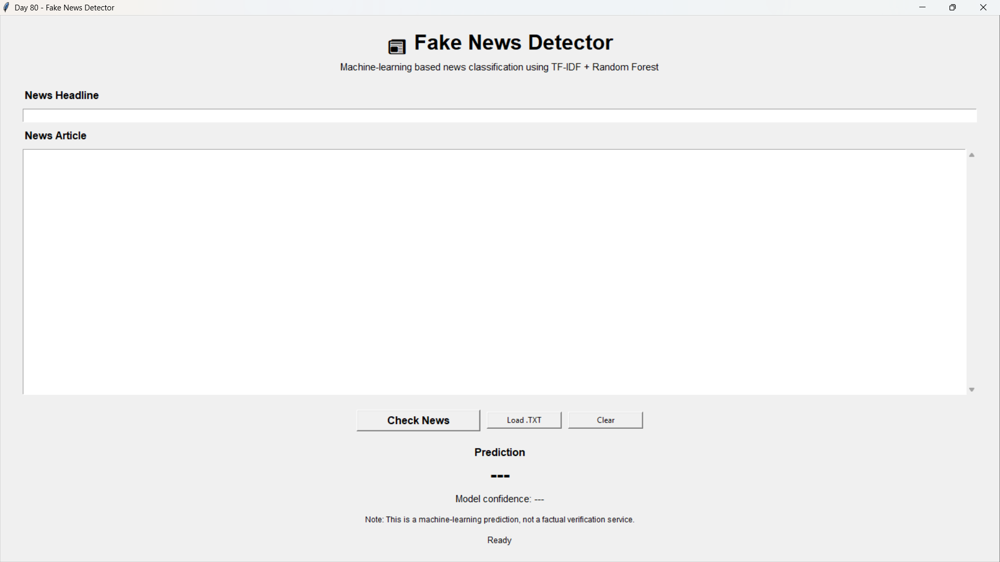
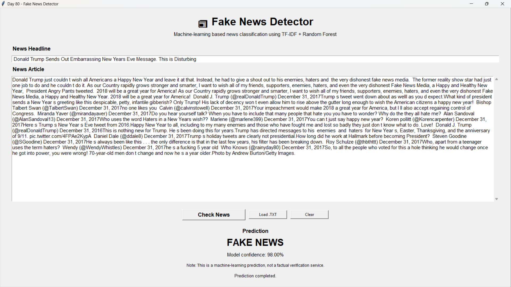
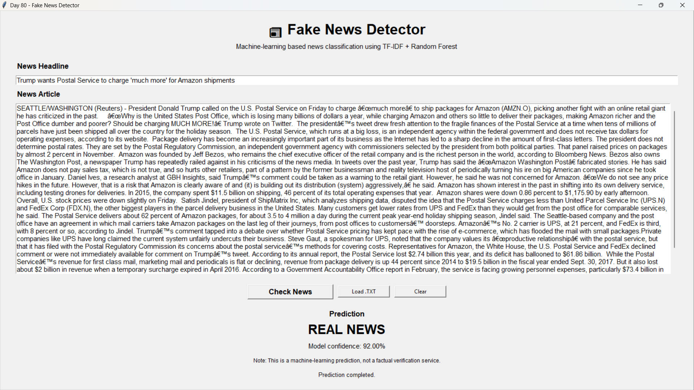
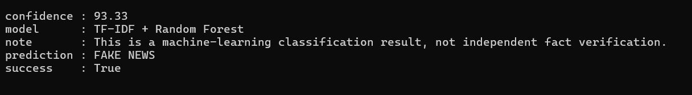

# 📰 Day 80 - Fake News Detector

Welcome to **Day 80** of my **100 Days, 100 Python Projects** challenge!

This project is a **Fake News Detector** built using **Python, Tkinter, Pandas, NLTK, Scikit-learn, Joblib, and Flask**.

The application uses **Natural Language Processing (NLP)** and **Machine Learning** to classify a news headline or article as either **FAKE NEWS** or **REAL NEWS**.

The machine-learning pipeline uses **TF-IDF (Term Frequency-Inverse Document Frequency)** for text feature extraction and a **Random Forest Classifier** for classification.

The project includes both:

* 🖥️ A **Tkinter desktop GUI**
* 🌐 A **Flask REST API**

The main purpose of this project is to gain practical experience with **NLP, text preprocessing, TF-IDF feature extraction, machine-learning classification, model evaluation, model persistence, GUI development, and REST API development**.

> ⚠️ **Important:** This application provides a machine-learning classification result. It is **not an independent fact-checking or factual verification service**.

---

## 📌 Project Overview

Fake news detection is a Natural Language Processing problem where textual content is analyzed to identify patterns associated with different categories of news.

This project follows a complete machine-learning workflow:

```text
News Dataset
     │
     ▼
Text Cleaning
     │
     ▼
Tokenization
     │
     ▼
Stopword Removal
     │
     ▼
TF-IDF Feature Extraction
     │
     ▼
Train/Test Split
     │
     ▼
Random Forest Classifier
     │
     ▼
Model Evaluation
     │
     ▼
Save Model + Vectorizer
     │
     ├───────────────┐
     ▼               ▼
Tkinter GUI      Flask REST API
     │               │
     └───────┬───────┘
             ▼
     FAKE / REAL Prediction
```

The application can:

* 📰 Accept a news headline
* 📝 Accept a complete news article
* 📂 Load news content from a `.txt` file
* 🧹 Clean and preprocess text
* 🔢 Convert text into TF-IDF features
* 🌲 Use a trained Random Forest model
* 🤖 Predict FAKE or REAL news
* 📊 Display model confidence
* 🌐 Provide predictions through a Flask REST API
* 🧹 Clear the current input
* ⚠️ Validate user input
* 🚨 Handle errors gracefully

---

## ✨ Features

### 🖥️ Tkinter GUI

* 📰 News headline input
* 📝 News article input
* 📂 Load `.txt` news files
* 🧹 Text preprocessing
* 🤖 Machine-learning prediction
* 🚨 FAKE NEWS classification
* ✅ REAL NEWS classification
* 📊 Model confidence percentage
* ⚠️ Input validation
* 🚨 Error handling
* 🧹 Clear all fields
* 📜 Scrollable article input
* ℹ️ Prediction status messages
* ⚠️ Machine-learning disclaimer

### 🤖 Machine Learning

* 📚 Fake and real news dataset
* 🧹 NLP text preprocessing
* 🔤 Tokenization
* 🛑 Stopword removal
* 🔢 TF-IDF vectorization
* 🌲 Random Forest classification
* 📊 Train/test split
* ⚖️ Stratified dataset splitting
* 📈 Accuracy evaluation
* 📋 Classification report
* 🔲 Confusion matrix
* 💾 Model serialization using Joblib

### 🌐 Flask REST API

* 🚀 Flask REST API
* 🏠 API status endpoint
* 🔮 News prediction endpoint
* 📦 JSON request handling
* 📤 JSON response handling
* ⚠️ Request validation
* 🚨 API error handling
* 📊 Prediction confidence
* 🤖 Model information

---

# 🖼️ Application Screenshots

## 🖥️ Main Application



## 🚨 Fake News Prediction



## ✅ Real News Prediction



## 🌐 Flask REST API



---

# 🛠️ Technologies Used

* **Python 3**
* **Tkinter**
* **Pandas**
* **NumPy**
* **NLTK**
* **Scikit-learn**
* **Joblib**
* **Flask**

---

## 🐍 Python

Python is used as the main programming language for the entire project.

It handles:

* Data loading
* Text preprocessing
* Machine-learning training
* Prediction
* GUI development
* API development
* File handling
* Model loading
* Error handling

---

## 🖥️ Tkinter

Tkinter is Python's built-in GUI framework.

It is used to create the Fake News Detector desktop application.

The GUI includes:

* Labels
* Text input
* Entry fields
* Buttons
* Scrollbars
* Message boxes
* Prediction display
* Confidence display
* Status messages

---

## 🐼 Pandas

Pandas is used during model training to load and process the CSV datasets.

The project loads:

```python
pd.read_csv(FAKE_PATH)
```

and:

```python
pd.read_csv(REAL_PATH)
```

Pandas is also used to:

* Combine fake and real datasets
* Create labels
* Handle missing values
* Combine title and article text
* Shuffle the dataset

---

## 🔤 NLTK

NLTK is used for Natural Language Processing.

The project uses NLTK for:

* Tokenization
* Stopword removal

The required resources include:

```text
punkt
punkt_tab
stopwords
```

---

## 🔢 Scikit-learn

Scikit-learn provides the machine-learning components.

The project uses:

* `TfidfVectorizer`
* `RandomForestClassifier`
* `train_test_split`
* `accuracy_score`
* `classification_report`
* `confusion_matrix`

---

## 💾 Joblib

Joblib is used to save and load the trained machine-learning model and TF-IDF vectorizer.

The saved files are:

```text
models/fake_news_model.pkl
models/tfidf_vectorizer.pkl
```

This means the model does not need to be retrained every time the GUI or API starts.

---

## 🌐 Flask

Flask is used to create the REST API.

The API provides:

```text
GET  /
POST /predict
```

The API accepts JSON requests and returns JSON responses.

---

# 📂 Project Structure

```text
DAY_80/
│
├── main80.py
├── train_model.py
├── app.py
├── requirements.txt
├── README.md
│
├── dataset/
│   ├── Fake.csv
│   └── True.csv
│
├── models/
│   ├── fake_news_model.pkl
│   └── tfidf_vectorizer.pkl
│
└── screenshots/
    ├── main-gui.png
    ├── fake-prediction.png
    ├── real-prediction.png
    └── flask-api.png
```

> **Note:** The `dataset/` folder is used locally for model training, but the large CSV dataset files are **not pushed to GitHub**.

---

# 📄 File Description

| File / Folder                 | Purpose                                          |
| ----------------------------- | ------------------------------------------------ |
| `main80.py`                   | Main Tkinter Fake News Detector application      |
| `train_model.py`              | Loads dataset, trains and evaluates the ML model |
| `app.py`                      | Flask REST API for news prediction               |
| `requirements.txt`            | Python dependencies                              |
| `README.md`                   | Project documentation                            |
| `dataset/Fake.csv`            | Fake news training dataset                       |
| `dataset/True.csv`            | Real news training dataset                       |
| `models/fake_news_model.pkl`  | Trained Random Forest model                      |
| `models/tfidf_vectorizer.pkl` | Trained TF-IDF vectorizer                        |
| `screenshots/`                | Application screenshots                          |

---

# 📚 Dataset

The project uses the **Fake and Real News Dataset** downloaded from Kaggle.

Dataset source:

**Kaggle - Fake and Real News Dataset**

Dataset page:

https://www.kaggle.com/datasets/clmentbisaillon/fake-and-real-news-dataset

The dataset contains two CSV files:

```text
Fake.csv
True.csv
```

The project assigns labels as follows:

| Dataset    | Label | Meaning |
| ---------- | ----: | ------- |
| `Fake.csv` |   `0` | FAKE    |
| `True.csv` |   `1` | REAL    |

During training, the two datasets are combined into one DataFrame.

---

## 📥 Dataset Setup

Download the dataset from Kaggle and place the files inside:

```text
dataset/
├── Fake.csv
└── True.csv
```

The final local structure should be:

```text
DAY_80/
│
├── dataset/
│   ├── Fake.csv
│   └── True.csv
│
├── train_model.py
├── main80.py
├── app.py
└── requirements.txt
```

---

# 🚫 Dataset Not Included in GitHub

The original CSV dataset is relatively large, so the dataset files are **not included in the GitHub repository**.

The following files remain local:

```text
dataset/Fake.csv
dataset/True.csv
```

They should be added to `.gitignore` so that they are not accidentally committed.

For example:

```text
dataset/
```

or:

```text
dataset/*.csv
```

The README provides the Kaggle dataset source so that the dataset can be downloaded separately when reproducing the project.

---

# 🤖 Machine Learning Pipeline

The project uses the following machine-learning pipeline:

```text
Dataset
   ↓
Combine Fake + Real News
   ↓
Assign Labels
   ↓
Combine Title + Article
   ↓
Clean Text
   ↓
Tokenization
   ↓
Stopword Removal
   ↓
TF-IDF
   ↓
Train/Test Split
   ↓
Random Forest
   ↓
Evaluation
   ↓
Save Model
```

---

# 🧹 Text Preprocessing

Before machine learning, the news text is cleaned.

The `clean_text()` function performs several operations.

## 1. Convert Text to Lowercase

Example:

```text
Breaking News About Technology
```

becomes:

```text
breaking news about technology
```

---

## 2. Remove URLs

URLs are removed using a regular expression.

For example:

```text
https://example.com/news
```

is removed from the text.

---

## 3. Remove HTML Tags

HTML tags are removed.

Example:

```html
<p>News article</p>
```

becomes:

```text
News article
```

---

## 4. Remove Non-Alphabetic Characters

Characters other than letters and whitespace are removed.

The project uses:

```python
re.sub(r"[^a-zA-Z\s]", " ", text)
```

---

## 5. Tokenization

The cleaned text is converted into individual words using:

```python
word_tokenize(text)
```

Example:

```text
news article contains information
```

becomes approximately:

```text
["news", "article", "contains", "information"]
```

---

## 6. Stopword Removal

Common English words are removed using the NLTK stopword list.

Examples can include words such as:

```text
the
is
a
an
and
of
```

---

## 7. Remove Very Short Words

Words with two or fewer characters are removed.

The project keeps words where:

```python
len(word) > 2
```

---

# 🔢 TF-IDF Feature Extraction

After text preprocessing, the project converts text into numerical features using **TF-IDF**.

TF-IDF stands for:

**Term Frequency-Inverse Document Frequency**

It measures how important a word is within a document relative to the collection of documents.

The project uses:

```python
TfidfVectorizer(
    max_features=5000,
    ngram_range=(1, 2),
    min_df=2,
    max_df=0.95,
    sublinear_tf=True
)
```

### Configuration

| Parameter      |    Value | Purpose                               |
| -------------- | -------: | ------------------------------------- |
| `max_features` |   `5000` | Limits vocabulary size                |
| `ngram_range`  | `(1, 2)` | Uses unigrams and bigrams             |
| `min_df`       |      `2` | Ignores extremely rare terms          |
| `max_df`       |   `0.95` | Ignores extremely common terms        |
| `sublinear_tf` |   `True` | Uses sublinear term-frequency scaling |

---

# 🌲 Random Forest Classifier

The project uses a **Random Forest Classifier** for news classification.

The model is configured with:

```python
RandomForestClassifier(
    n_estimators=150,
    max_depth=None,
    min_samples_split=2,
    min_samples_leaf=1,
    max_features="sqrt",
    class_weight="balanced",
    random_state=42,
    n_jobs=-1
)
```

### Important Parameters

| Parameter      |      Value | Purpose                           |
| -------------- | ---------: | --------------------------------- |
| `n_estimators` |      `150` | Number of decision trees          |
| `max_depth`    |     `None` | No fixed maximum tree depth       |
| `max_features` |     `sqrt` | Features considered at each split |
| `class_weight` | `balanced` | Helps account for class imbalance |
| `random_state` |       `42` | Reproducible results              |
| `n_jobs`       |       `-1` | Uses available CPU cores          |

---

# 📊 Dataset Splitting

The dataset is divided into training and testing data using:

```python
train_test_split()
```

The project uses:

```python
test_size=0.20
```

This means approximately:

```text
80% → Training
20% → Testing
```

The split uses:

```python
stratify=y
```

to maintain the class distribution between the training and testing sets.

---

# 📈 Model Evaluation

After training, the model is evaluated using the testing dataset.

The project calculates:

## Accuracy

```python
accuracy_score(y_test, y_pred)
```

Accuracy represents the proportion of test predictions that were classified correctly.

---

## Classification Report

The project generates:

```python
classification_report(
    y_test,
    y_pred,
    target_names=["FAKE", "REAL"]
)
```

The classification report provides metrics such as:

* Precision
* Recall
* F1-score
* Support

---

## Confusion Matrix

The project also generates:

```python
confusion_matrix(y_test, y_pred)
```

A confusion matrix shows how many samples were classified into each category.

```text
                 Predicted
              FAKE       REAL

Actual FAKE     ┌───────┬───────┐
                │       │       │
                ├───────┼───────┤
Actual REAL     │       │       │
                └───────┴───────┘
```

---

# 💾 Saving the Trained Model

After training, the model and vectorizer are saved using Joblib.

The model is saved as:

```text
models/fake_news_model.pkl
```

The TF-IDF vectorizer is saved as:

```text
models/tfidf_vectorizer.pkl
```

The code uses:

```python
joblib.dump(model, MODEL_PATH)
```

and:

```python
joblib.dump(vectorizer, VECTORIZER_PATH)
```

This allows the trained components to be reused without retraining.

---

# ▶️ How to Run

## 1. Make Sure Python Is Installed

Check your Python version:

```bash
python --version
```

---

## 2. Open the Project Folder

Open a terminal inside the `DAY_80` folder.

---

## 3. Install Dependencies

```bash
pip install -r requirements.txt
```

---

# 📥 4. Download the Dataset

Download the dataset from Kaggle and place:

```text
Fake.csv
True.csv
```

inside:

```text
dataset/
```

The final structure should be:

```text
dataset/
├── Fake.csv
└── True.csv
```

---

# 🧠 5. Train the Model

Run:

```bash
python train_model.py
```

The training script will:

1. Check the dataset files.
2. Load fake news data.
3. Load real news data.
4. Assign class labels.
5. Combine the datasets.
6. Shuffle the dataset.
7. Clean the text.
8. Create TF-IDF features.
9. Split the data.
10. Train the Random Forest classifier.
11. Evaluate the model.
12. Save the trained model.
13. Save the TF-IDF vectorizer.

After successful training, the following files should exist:

```text
models/
├── fake_news_model.pkl
└── tfidf_vectorizer.pkl
```

---

# 🖥️ 6. Run the Tkinter Application

After training the model:

```bash
python main80.py
```

The **Fake News Detector** GUI will open.

---

# 🌐 7. Run the Flask API

Make sure the model has already been trained.

Then run:

```bash
python app.py
```

The API will start at:

```text
http://127.0.0.1:5000
```

---

# 🖥️ Using the GUI

## 📰 Enter a News Headline

Enter the headline in the:

```text
News Headline
```

field.

Example:

```text
Scientists announce a major breakthrough
```

---

## 📝 Enter the News Article

Paste the article into the:

```text
News Article
```

text area.

The text area includes a scrollbar for longer articles.

---

## 🚨 Check News

Click:

```text
Check News
```

The application combines:

```text
Headline + Article
```

and sends the text through the same preprocessing pipeline used during training.

The text is then transformed using the saved TF-IDF vectorizer and classified using the saved Random Forest model.

---

# 🔍 Prediction Process

The prediction process is:

```text
Headline + Article
       │
       ▼
   Clean Text
       │
       ▼
TF-IDF Vectorizer
       │
       ▼
Random Forest Model
       │
       ▼
Prediction + Probability
       │
       ▼
FAKE NEWS / REAL NEWS
```

---

# 📊 Model Confidence

The application also calculates a confidence value from the model's predicted class probabilities.

It uses:

```python
probabilities = model.predict_proba(features)[0]
confidence = max(probabilities) * 100
```

The GUI displays the result as:

```text
Model confidence: XX.XX%
```

The confidence value represents the model's predicted probability for the selected class; it should **not** be interpreted as proof that an article is factually true or false.

---

# 📂 Load `.TXT` File

The application supports loading news content from a text file.

Click:

```text
Load .TXT
```

and select a `.txt` file.

The contents of the file are loaded into the **News Article** text area.

This is useful for testing longer articles without manually pasting them.

---

# 🧹 Clear Function

The **Clear** button resets the application.

It:

* Clears the headline.
* Clears the article.
* Resets the prediction.
* Resets the confidence display.
* Changes the status to `Ready`.

---

# ⚠️ Input Validation

The application validates user input before performing a prediction.

### Empty Input

If both headline and article are empty:

```text
Please enter a news headline or article.
```

---

### Invalid Processed Text

If the supplied text becomes empty after preprocessing:

```text
The provided text could not be processed.
```

---

### Missing Model

If the trained model or vectorizer is unavailable:

```text
Please train the model first using:

python train_model.py
```

---

# 🌐 Flask REST API

The project also provides a REST API using Flask.

The API allows other applications to send news content and receive a machine-learning classification result.

---

# 🏠 API Home Endpoint

The API provides:

```text
GET /
```

Example request:

```http
GET /
```

Example response:

```json
{
    "project": "Day 80 - Fake News Detector",
    "status": "running",
    "model": "TF-IDF + Random Forest",
    "endpoint": "/predict",
    "method": "POST"
}
```

---

# 🔮 Prediction API

The main endpoint is:

```text
POST /predict
```

The API expects a JSON request containing:

```json
{
    "title": "News headline",
    "text": "News article content"
}
```

Both fields are optional individually, but at least one of them must contain text.

---

## 📤 Example API Request

```json
{
    "title": "Scientists announce a major discovery",
    "text": "Researchers have published a new study describing their findings."
}
```

---

## 📥 Example API Response

```json
{
    "success": true,
    "prediction": "REAL NEWS",
    "confidence": 87.42,
    "model": "TF-IDF + Random Forest",
    "note": "This is a machine-learning classification result, not independent fact verification."
}
```

The exact prediction and confidence will depend on the trained model and input text.

---

# ⚠️ API Error Handling

The API validates incoming JSON requests.

### Missing JSON Body

If no JSON request body is provided:

```json
{
    "success": false,
    "error": "JSON request body is required."
}
```

The API returns:

```text
400 Bad Request
```

---

### Missing Title and Text

If both fields are empty:

```json
{
    "success": false,
    "error": "Please provide title or text."
}
```

---

### Text Cannot Be Processed

If the supplied text becomes empty after preprocessing:

```json
{
    "success": false,
    "error": "The supplied text could not be processed."
}
```

---

### Prediction Error

Unexpected prediction errors are returned as:

```json
{
    "success": false,
    "error": "Error message"
}
```

with:

```text
500 Internal Server Error
```

---

# 🔄 GUI and API Architecture

Both interfaces use the same basic machine-learning pipeline.

```text
                 ┌─────────────────┐
                 │ Trained Model    │
                 │ + TF-IDF        │
                 └────────┬────────┘
                          │
             ┌────────────┴────────────┐
             │                         │
             ▼                         ▼
      ┌──────────────┐          ┌──────────────┐
      │ Tkinter GUI  │          │ Flask API    │
      └──────┬───────┘          └──────┬───────┘
             │                         │
             ▼                         ▼
        User Input                JSON Request
             │                         │
             └────────────┬────────────┘
                          ▼
                   Text Preprocessing
                          │
                          ▼
                    TF-IDF Features
                          │
                          ▼
                  Random Forest Model
                          │
                          ▼
                  FAKE / REAL Result
```

---

# 🧩 Important Functions

## `clean_text()`

Cleans and preprocesses news text.

Main operations include:

* Lowercasing
* URL removal
* HTML removal
* Character cleaning
* Tokenization
* Stopword removal
* Short-word removal

---

## `load_dataset()`

Loads the fake and real CSV files and prepares the dataset for training.

It:

* Loads `Fake.csv`
* Loads `True.csv`
* Assigns labels
* Combines the datasets
* Handles missing text
* Combines title and article
* Shuffles the data

---

## `train_model()`

Performs the complete machine-learning training process.

It:

* Creates the model directory
* Loads the dataset
* Cleans the text
* Creates TF-IDF features
* Splits the data
* Trains Random Forest
* Evaluates predictions
* Saves the model
* Saves the vectorizer

---

## `predict_news()`

Handles predictions from the Tkinter GUI.

It:

* Reads the headline
* Reads the article
* Validates input
* Cleans the text
* Creates TF-IDF features
* Performs prediction
* Calculates confidence
* Displays the result

---

## `load_file()`

Loads a `.txt` file into the article text area.

---

## `clear_all()`

Resets all GUI fields and prediction information.

---

## `home()`

Provides the Flask API status information.

---

## `predict()`

Handles:

```text
POST /predict
```

It:

* Reads JSON data
* Validates title/article
* Cleans the text
* Generates TF-IDF features
* Performs classification
* Calculates confidence
* Returns a JSON response

---

# 🖥️ GUI Components Used

| Component    | Purpose                                |
| ------------ | -------------------------------------- |
| `Tk()`       | Creates the application window         |
| `Label`      | Displays titles and information        |
| `Entry`      | Accepts the news headline              |
| `Text`       | Accepts the news article               |
| `Scrollbar`  | Allows scrolling through long articles |
| `Button`     | Performs prediction and other actions  |
| `Frame`      | Organizes GUI elements                 |
| `messagebox` | Displays warnings and errors           |

---

# 🌐 Flask Components Used

| Flask Component      | Purpose                       |
| -------------------- | ----------------------------- |
| `Flask()`            | Creates the Flask application |
| `@app.route()`       | Defines API endpoints         |
| `request.get_json()` | Reads JSON request data       |
| `jsonify()`          | Creates JSON responses        |
| `app.run()`          | Starts the development server |

---

# 🧠 Machine Learning Concepts Practiced

* Supervised Learning
* Binary Classification
* Natural Language Processing
* Text Classification
* TF-IDF
* N-grams
* Random Forest
* Decision Trees
* Feature Extraction
* Training and Testing
* Stratified Dataset Splitting
* Model Prediction
* Prediction Probabilities
* Model Evaluation
* Accuracy
* Precision
* Recall
* F1-score
* Confusion Matrix
* Model Serialization

---

# 📚 NLP Concepts Practiced

* Text normalization
* Lowercasing
* Regular expressions
* URL removal
* HTML removal
* Tokenization
* Stopword removal
* Vocabulary generation
* Unigrams
* Bigrams
* TF-IDF representation
* Text preprocessing pipelines

---

# 💻 Python Concepts Practiced

* Functions
* Dictionaries
* File handling
* Exception handling
* Modules
* Object-oriented library usage
* Data processing
* JSON handling
* Regular expressions
* Model persistence
* GUI event handling
* REST API development

---

# 🎯 Learning Outcome

This project helped me understand:

* How NLP can be applied to text classification
* How to clean and preprocess news articles
* How tokenization works
* How stopword removal works
* How TF-IDF converts text into numerical features
* How unigrams and bigrams can represent textual information
* How to train a Random Forest classifier
* How to split data into training and testing sets
* How to evaluate a machine-learning model
* How to use accuracy and classification reports
* How to interpret a confusion matrix
* How to save trained models using Joblib
* How to reuse a saved ML model for predictions
* How to build a machine-learning GUI using Tkinter
* How to load text files into a GUI
* How to calculate prediction probabilities
* How to create a Flask REST API
* How to handle JSON API requests
* How to return JSON prediction responses
* How to combine machine learning with application development
* Why ML predictions should not automatically be treated as factual verification

---

# ⚠️ Important Limitation

This project is a **machine-learning text classifier**, not a professional fact-checking system.

The model learns patterns from the dataset used during training. Therefore:

* A prediction does not prove that a news article is true.
* A prediction does not prove that a news article is false.
* Model confidence is not the same as factual certainty.
* Performance depends on the training dataset and preprocessing.
* News from different domains or time periods may behave differently from the training data.
* Real-world misinformation can require source verification, evidence checking, and contextual analysis beyond text classification.

The application therefore displays the following disclaimer:

```text
Note: This is a machine-learning prediction, not a factual verification service.
```

---

# 🔮 Future Improvements

Possible enhancements for future versions:

* 🌐 Add a web-based frontend
* 🔍 Add source credibility analysis
* 🔗 Analyze article URLs directly
* 📰 Extract article text from web pages
* 🧠 Experiment with Logistic Regression
* 🧠 Experiment with SVM
* 🤖 Experiment with transformer-based models
* 📊 Add model comparison
* 📈 Add visual evaluation graphs
* 📉 Display confusion matrix in the GUI
* 📊 Display precision, recall, and F1-score
* 💾 Store prediction history
* 📜 Add prediction history viewer
* 🔍 Add keyword analysis
* 🧾 Display important TF-IDF features
* 🌍 Support multiple languages
* 🔐 Add API authentication
* 🚦 Add API rate limiting
* 🧪 Add automated tests
* 📚 Add cross-validation
* ⚙️ Add hyperparameter tuning
* 🐳 Dockerize the Flask API
* ☁️ Deploy the API
* 🎨 Improve the GUI design
* 🌙 Add Dark Mode

---

# 📦 Requirements

The project uses:

```text
pandas
numpy
scikit-learn
nltk
joblib
flask
```

Install everything with:

```bash
pip install -r requirements.txt
```

---

# 📅 Challenge

This project is part of my **100 Days, 100 Python Projects** challenge, where I build one Python project every day to improve my Python programming skills, strengthen my problem-solving abilities, learn new technologies, and maintain consistency through daily coding.

**Day 80** focuses on **Natural Language Processing and Machine Learning**, combining **NLTK for text preprocessing**, **TF-IDF for feature extraction**, **Random Forest for classification**, **Tkinter for GUI development**, and **Flask for REST API development** to create a practical Fake News Detection system.

---

# 👨‍💻 Author

**Abhijit Munghate**

Happy Coding! 🚀🐍📰🤖
